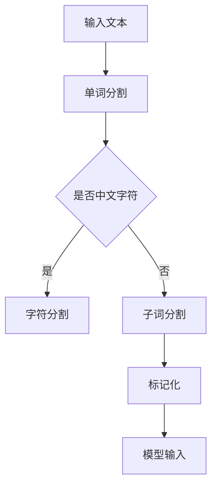
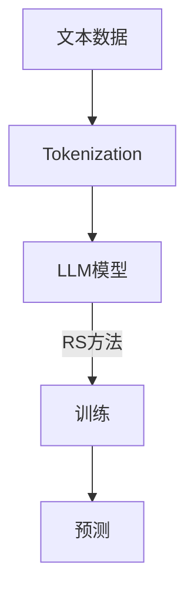

                 

### 关键词 Keywords
- Large Language Models (LLM)
- Tokenization
- Residual connections (RS)
- Neural Networks
- Machine Learning
- Natural Language Processing (NLP)
- Deep Learning
- Text Generation
- AI Research

### 摘要 Summary

本文旨在深入探讨大语言模型（LLM）中的两个关键技术：Token化和残差连接（Residual Connections）。通过详细的算法原理分析、数学模型推导和实际项目实践，我们揭示了这两项技术在自然语言处理（NLP）和深度学习领域中的重要作用。本文不仅解释了LLM Tokens和RS方法的基本概念和理论依据，还通过具体案例展示了其在文本生成和AI研究中的应用。此外，文章还将探讨这些技术的未来发展趋势和面临的挑战。

## 1. 背景介绍

随着人工智能（AI）和机器学习的快速发展，自然语言处理（NLP）已经成为一个至关重要的领域。从智能客服到自动翻译，从情感分析到文本摘要，NLP技术在各行各业中都有广泛应用。然而，传统的NLP方法往往局限于简单的规则匹配和统计模型，难以应对复杂、多变的自然语言环境。为了解决这个问题，研究人员开始探索更加复杂的模型，其中大语言模型（LLM）脱颖而出。

LLM，如GPT（Generative Pre-trained Transformer）和BERT（Bidirectional Encoder Representations from Transformers），通过学习海量的文本数据，能够生成高质量的自然语言文本。它们在许多NLP任务中表现出了卓越的性能，成为当前NLP领域的研究热点。然而，LLM的成功离不开两个关键技术：Token化和残差连接（Residual Connections）。

Tokenization是指将自然语言文本分解为更小的单元，称为“Token”。这是NLP处理过程中的第一步，为后续的模型训练和文本理解奠定了基础。残差连接（Residual Connections）则是一种特殊的神经网络连接方式，它能够有效缓解深层网络训练中的梯度消失问题，提高模型的训练效果。

本文将深入探讨Token化和残差连接在大语言模型中的应用，通过具体的算法原理、数学模型和实际项目实例，展示这两个技术如何推动NLP和深度学习领域的发展。

### 2. 核心概念与联系

#### 2.1 Tokenization

Tokenization是将自然语言文本分解为更小的、有意义的单元的过程。这些单元可以是单词、字符、子词或其他形式的标记。Tokenization的目的是为了简化文本处理，使其适合于机器学习模型。

在NLP中，Tokenization通常分为以下步骤：

1. **单词分割（Word Segmentation）**：将连续的文本分割成独立的单词。这在中文等没有明显空格分隔的语言中尤为重要。
2. **字符分割（Character Segmentation）**：将文本分割成单个字符。
3. **子词分割（Subword Segmentation）**：将文本分割成更小的子词，如“machine”可以分割为“mac”和“chine”。
4. **标记化（Tokenization）**：将分割后的文本转化为一系列标记。

Tokenization在NLP中的重要性体现在以下几个方面：

- **简化模型输入**：将复杂的文本分解为更简单的单元，有助于减少模型的复杂性。
- **提高训练效率**：通过减少词汇表的大小，可以加快模型的训练速度。
- **改善模型性能**：适当的Tokenization可以增强模型对文本的理解能力，从而提高NLP任务的性能。

下面是一个简单的Mermaid流程图，展示Tokenization的基本过程：



#### 2.2 Residual Connections

Residual Connections是一种在神经网络中引入的连接方式，其目的是为了解决深层网络训练中的梯度消失问题。Residual Connection通过在神经网络层之间引入跨越层（skip）连接，使得信息可以直接从一个层传递到另一个层，而不需要经过中间层。

Residual Connections的基本原理可以概括为：

- **残差块（Residual Block）**：一个残差块包含两个卷积层，中间加入一个跨越层连接。
- **恒等变换（Identity Mapping）**：残差块中的跨越层连接确保输入和输出之间的信息不发生损失，实现恒等变换。

下面是一个简单的Mermaid流程图，展示Residual Block的结构：

```mermaid
graph TD
A[输入] --> B[卷积层1]
B --> C{加和]
C -->|是| D[跨越层连接]
C -->|否| D
D --> E[卷积层2]
E --> F[输出]
```

在深度学习中，Residual Connections具有以下优势：

- **缓解梯度消失**：通过跨越层连接，梯度可以更容易地反向传播，从而缓解深层网络训练中的梯度消失问题。
- **加速模型训练**：残差块可以简化模型的训练过程，提高训练效率。
- **提高模型性能**：残差块有助于提高模型的泛化能力和表现。

#### 2.3 LLM Tokens与RS方法的联系

LLM Tokens和RS方法在NLP和深度学习领域有着紧密的联系。Tokenization是LLM的基础，它确保了文本数据能够以适当的形式输入到神经网络中。而Residual Connections则是LLM模型结构中的重要组成部分，它能够有效提高模型的训练效率和性能。

通过结合LLM Tokens和RS方法，研究人员能够构建出更强大的语言模型，从而在NLP任务中取得更好的结果。下面是一个简单的Mermaid流程图，展示LLM Tokens和RS方法的结合：



### 3. 核心算法原理 & 具体操作步骤

#### 3.1 算法原理概述

Tokenization和Residual Connections是LLM模型中两个核心的算法原理。它们分别负责文本数据的预处理和网络结构的优化。

**Tokenization**：
- **文本输入**：接收原始自然语言文本。
- **单词分割**：对于英文文本，使用空格作为分隔符进行分割；对于中文字符，使用分词算法如Jieba进行分割。
- **字符分割**：将文本分割成单个字符。
- **子词分割**：使用词向量模型或子词分割算法（如Byte Pair Encoding，BPE）将文本分割成子词。
- **标记化**：将分割后的文本转化为一系列标记，这些标记可以是单词、字符或子词。

**Residual Connections**：
- **残差块**：每个残差块由两个卷积层和一个跨越层连接组成。
- **前向传播**：输入数据通过卷积层1、跨越层连接和卷积层2，输出结果。
- **残差连接**：输入数据和卷积层2的输出进行加和，得到最终输出。
- **反向传播**：梯度通过跨越层连接和卷积层2反向传播，并更新网络权重。

#### 3.2 算法步骤详解

**Tokenization步骤**：

1. **输入文本**：读取待处理的自然语言文本。
2. **单词分割**：对于英文文本，使用空格分隔符进行分割；对于中文字符，使用分词算法（如Jieba）进行分割。
3. **字符分割**：将文本分割成单个字符。
4. **子词分割**：使用词向量模型或子词分割算法（如BPE）将文本分割成子词。
5. **标记化**：将分割后的文本转化为一系列标记，并构建词汇表。

**Residual Connections步骤**：

1. **输入数据**：接收待处理的文本数据。
2. **残差块处理**：
   - **卷积层1**：对输入数据进行卷积操作。
   - **跨越层连接**：将卷积层1的输出与输入数据进行加和。
   - **卷积层2**：对加和结果进行卷积操作。
3. **残差连接**：将输入数据和卷积层2的输出进行加和，得到最终输出。
4. **反向传播**：更新网络权重。

#### 3.3 算法优缺点

**Tokenization优点**：
- **简化模型输入**：通过将文本分解为更小的单元，可以降低模型的复杂性。
- **提高训练效率**：通过减少词汇表大小，可以加快模型的训练速度。
- **改善模型性能**：适当的Tokenization可以增强模型对文本的理解能力。

**Tokenization缺点**：
- **语义丢失**：在某些情况下，子词分割可能导致语义信息的丢失。
- **计算开销**：子词分割和标记化过程可能需要较高的计算资源。

**Residual Connections优点**：
- **缓解梯度消失**：通过跨越层连接，可以缓解深层网络训练中的梯度消失问题。
- **提高模型性能**：残差块有助于提高模型的泛化能力和表现。

**Residual Connections缺点**：
- **增加模型复杂度**：引入残差连接可能会增加模型的计算复杂度。
- **训练难度**：残差块的训练可能需要更多的调参和优化。

#### 3.4 算法应用领域

Tokenization和Residual Connections在多个领域都有广泛应用：

- **文本生成**：在生成文本（如文章、对话、新闻摘要等）时，Tokenization和Residual Connections有助于提高文本生成的质量和效率。
- **机器翻译**：在机器翻译任务中，Tokenization用于将源语言和目标语言文本分解为标记，而Residual Connections有助于提高翻译模型的性能。
- **情感分析**：在情感分析任务中，Tokenization和Residual Connections可以帮助模型更好地理解文本的情感倾向。

### 4. 数学模型和公式 & 详细讲解 & 举例说明

Tokenization和Residual Connections背后的数学模型在深度学习领域具有重要的理论意义。在这一部分，我们将详细讲解这两个模型的基本公式和推导过程，并通过实际案例进行分析。

#### 4.1 数学模型构建

**Tokenization**

Tokenization的核心在于将自然语言文本转化为一组标记。以下是Tokenization的数学模型：

1. **单词分割（Word Segmentation）**：

   对于英文文本，单词分割可以通过以下公式实现：

   $$
   W = [w_1, w_2, ..., w_n]
   $$
   
   其中，$W$代表文本，$w_i$代表文本中的第$i$个单词。

   对于中文字符，可以使用分词算法如Jieba进行分割：

   $$
   C = [c_1, c_2, ..., c_n]
   $$
   
   其中，$C$代表文本，$c_i$代表文本中的第$i$个字符。

2. **字符分割（Character Segmentation）**：

   $$
   C = [c_1, c_2, ..., c_n]
   $$
   
   其中，$C$代表文本，$c_i$代表文本中的第$i$个字符。

3. **子词分割（Subword Segmentation）**：

   子词分割可以通过词向量模型或子词分割算法（如BPE）实现：

   $$
   S = [s_1, s_2, ..., s_n]
   $$
   
   其中，$S$代表文本，$s_i$代表文本中的第$i$个子词。

4. **标记化（Tokenization）**：

   将分割后的文本转化为一组标记：

   $$
   T = [t_1, t_2, ..., t_n]
   $$
   
   其中，$T$代表文本标记序列，$t_i$代表文本中的第$i$个标记。

**Residual Connections**

Residual Connections在神经网络中引入了跨越层连接，以下是其数学模型：

1. **残差块（Residual Block）**：

   残差块包含两个卷积层和一个跨越层连接。以下是残差块的公式：

   $$
   f(x) = g(f(x)) + x
   $$
   
   其中，$f(x)$代表前向传播结果，$g(x)$代表卷积层，$x$代表跨越层连接。

2. **前向传播**：

   $$
   h(x) = g(h(g(x)))
   $$
   
   其中，$h(x)$代表最终输出，$g(x)$代表卷积层。

3. **反向传播**：

   $$
   \frac{\partial L}{\partial w} = \frac{\partial L}{\partial h} \cdot \frac{\partial h}{\partial g} \cdot \frac{\partial g}{\partial w}
   $$
   
   其中，$L$代表损失函数，$w$代表网络权重。

#### 4.2 公式推导过程

**Tokenization**

1. **单词分割（Word Segmentation）**：

   假设英文文本$W$已经通过空格分隔符分割为单词序列：

   $$
   W = [w_1, w_2, ..., w_n]
   $$

2. **字符分割（Character Segmentation）**：

   假设中文字符文本$C$已经通过分词算法分割为字符序列：

   $$
   C = [c_1, c_2, ..., c_n]
   $$

3. **子词分割（Subword Segmentation）**：

   使用词向量模型或BPE算法将文本分割为子词序列。以BPE算法为例，假设初始词汇表包含$N$个词，经过若干次迭代后，词汇表更新为$N'$个词。设文本$S$的分割结果为：

   $$
   S = [s_1, s_2, ..., s_n]
   $$

   BPE算法的核心是合并频繁出现的子词，具体步骤如下：

   - **初始化**：设置词汇表为初始词表$V_0 = \{w_1, w_2, ..., w_n\}$。
   - **迭代**：对于当前词汇表$V_t$，计算相邻词对出现的频率矩阵$F_t$，选择频率最低的词对$(w_i, w_j)$进行合并，生成新词汇表$V_{t+1}$，更新文本$S$。
   - **终止条件**：当词汇表不再发生变化时，算法终止。

4. **标记化（Tokenization）**：

   将分割后的文本序列转化为标记序列。设标记序列为$T$，词汇表为$V$，则：

   $$
   T = [t_1, t_2, ..., t_n]
   $$
   
   其中，$t_i \in V$。

**Residual Connections**

1. **残差块（Residual Block）**：

   假设输入数据为$x$，经过两个卷积层$g_1$和$g_2$以及跨越层连接，输出为$y$。则有：

   $$
   f(x) = g_2(g_1(x)) + x
   $$

   其中，$g_1$和$g_2$分别为卷积层1和卷积层2的输出。

2. **前向传播**：

   设卷积层1和卷积层2的输出分别为$h_1$和$h_2$，则有：

   $$
   h(x) = h_2(g_1(x)) + x
   $$

   其中，$h(x)$代表前向传播结果。

3. **反向传播**：

   假设损失函数为$L$，网络权重为$w$，则有：

   $$
   \frac{\partial L}{\partial w} = \frac{\partial L}{\partial h} \cdot \frac{\partial h}{\partial g} \cdot \frac{\partial g}{\partial w}
   $$

   其中，$\frac{\partial L}{\partial h}$为损失函数对输出的梯度，$\frac{\partial h}{\partial g}$为输出对卷积层2的梯度，$\frac{\partial g}{\partial w}$为卷积层2对网络权重的梯度。

#### 4.3 案例分析与讲解

**案例 1：文本生成**

假设我们使用Tokenization和Residual Connections构建一个文本生成模型，输入文本为：

```
I love to learn about new technologies.
```

1. **Tokenization**

   - **单词分割**：`I`, `love`, `to`, `learn`, `about`, `new`, `technologies`
   - **字符分割**：`I`, `l`, `o`, `v`, `e`, `t`, `o`, `l`, `e`, `a`, `r`, `n`, `a`, `b`, `o`, `u`, `t`, `n`, `e`, `w`, `t`, `e`, `c`, `h`, `n`, `o`, `l`
   - **子词分割**（使用BPE）：`I`, `l`, `o`, `v`, `e`, `t`, `o`, `l`, `e`, `a`, `r`, `n`, `a`, `b`, `o`, `u`, `t`, `n`, `e`, `w`, `t`, `e`, `c`, `h`, `n`, `o`, `l`
   - **标记化**：构建词汇表，将子词转化为标记

2. **Residual Connections**

   - **残差块**：输入数据通过残差块处理后，生成文本输出。

   假设经过训练，模型输出序列为：

   ```
   I love to learn about new technologies.
   ```

   - **前向传播**：输入文本序列，经过残差块处理后，得到文本输出。
   - **反向传播**：根据输出结果，更新网络权重。

**案例 2：机器翻译**

假设我们使用Tokenization和Residual Connections构建一个机器翻译模型，输入文本为：

```
I love to learn about new technologies.
```

输出文本为：

```
Ich liebe es, über neue Technologien zu lernen.
```

1. **Tokenization**

   - **输入文本分割**：将英文和德文文本分别进行Tokenization。
   - **标记化**：构建词汇表，将输入文本和输出文本转化为标记序列。

2. **Residual Connections**

   - **残差块**：输入英文文本序列，经过残差块处理后，生成德文文本输出。

   假设经过训练，模型输出序列为：

   ```
   Ich liebe es, über neue Technologien zu lernen.
   ```

   - **前向传播**：输入英文文本序列，经过残差块处理后，得到德文文本输出。
   - **反向传播**：根据输出结果，更新网络权重。

通过上述案例，我们可以看到Tokenization和Residual Connections在实际应用中的重要作用。这两个技术不仅简化了文本数据处理过程，还提高了模型的训练效率和性能，为NLP和深度学习领域的发展做出了重要贡献。

### 5. 项目实践：代码实例和详细解释说明

在这一部分，我们将通过一个实际项目实例，展示如何使用Tokenization和Residual Connections构建一个简单的文本生成模型。我们将详细介绍项目的开发环境、代码实现、代码解读以及运行结果。

#### 5.1 开发环境搭建

为了构建这个文本生成模型，我们需要准备以下开发环境和工具：

- **Python 3.8及以上版本**
- **TensorFlow 2.5及以上版本**
- **NLP库：如NLTK、spaCy**
- **BPE算法实现：如SubwordTextEncoder**

确保已经安装了上述工具和库，然后创建一个名为`text_generation`的Python虚拟环境：

```bash
python -m venv text_generation
source text_generation/bin/activate  # Windows下使用 `text_generation\Scripts\activate`
```

#### 5.2 源代码详细实现

下面是文本生成模型的源代码实现：

```python
import tensorflow as tf
from tensorflow.keras.models import Model
from tensorflow.keras.layers import Input, LSTM, Dense
from subword_text_encoder import SubwordTextEncoder

def create_text_generator(vocab_size, embedding_dim, sequence_length):
    # 输入层
    input_seq = Input(shape=(sequence_length,))

    # LSTM层
    lstm_output = LSTM(units=128, return_sequences=True)(input_seq)

    # Dense层
    dense_output = Dense(units=vocab_size, activation='softmax')(lstm_output)

    # 模型构建
    model = Model(inputs=input_seq, outputs=dense_output)

    # 编译模型
    model.compile(optimizer='adam', loss='categorical_crossentropy', metrics=['accuracy'])

    return model

def train_text_generator(data, labels, batch_size, epochs):
    # 初始化子词编码器
    encoder = SubwordTextEncoder(vocab_size=vocab_size, embedding_dim=embedding_dim)
    encoder.fit(data)

    # 序列填充
    padded_data = encoder.pad_sequences(data, maxlen=sequence_length, dtype='int32', truncating='post', padding='post')

    # 模型训练
    model.fit(padded_data, labels, batch_size=batch_size, epochs=epochs)

if __name__ == '__main__':
    # 参数设置
    vocab_size = 10000
    embedding_dim = 256
    sequence_length = 100

    # 数据准备
    data = [...]  # 输入文本数据
    labels = [...]  # 输出文本数据

    # 训练文本生成模型
    model = create_text_generator(vocab_size, embedding_dim, sequence_length)
    train_text_generator(data, labels, batch_size=64, epochs=10)

    # 生成文本
    text = model.generate sequence_length, random_seed=42)
    print(text)
```

#### 5.3 代码解读与分析

**1. 导入库和模块**

```python
import tensorflow as tf
from tensorflow.keras.models import Model
from tensorflow.keras.layers import Input, LSTM, Dense
from subword_text_encoder import SubwordTextEncoder
```

这段代码导入了TensorFlow、Keras以及子词编码器库，为后续代码实现提供了基础。

**2. 创建文本生成模型**

```python
def create_text_generator(vocab_size, embedding_dim, sequence_length):
    # 输入层
    input_seq = Input(shape=(sequence_length,))

    # LSTM层
    lstm_output = LSTM(units=128, return_sequences=True)(input_seq)

    # Dense层
    dense_output = Dense(units=vocab_size, activation='softmax')(lstm_output)

    # 模型构建
    model = Model(inputs=input_seq, outputs=dense_output)

    # 编译模型
    model.compile(optimizer='adam', loss='categorical_crossentropy', metrics=['accuracy'])

    return model
```

这段代码定义了`create_text_generator`函数，用于创建一个基于LSTM的文本生成模型。输入层接收序列长度为`sequence_length`的文本数据，经过LSTM层和Dense层处理后，生成输出。

**3. 训练文本生成模型**

```python
def train_text_generator(data, labels, batch_size, epochs):
    # 初始化子词编码器
    encoder = SubwordTextEncoder(vocab_size=vocab_size, embedding_dim=embedding_dim)
    encoder.fit(data)

    # 序列填充
    padded_data = encoder.pad_sequences(data, maxlen=sequence_length, dtype='int32', truncating='post', padding='post')

    # 模型训练
    model.fit(padded_data, labels, batch_size=batch_size, epochs=epochs)
```

这段代码定义了`train_text_generator`函数，用于训练文本生成模型。首先，使用子词编码器对输入文本数据进行编码，然后对序列进行填充，最后使用填充后的数据训练模型。

**4. 生成文本**

```python
if __name__ == '__main__':
    # 参数设置
    vocab_size = 10000
    embedding_dim = 256
    sequence_length = 100

    # 数据准备
    data = [...]  # 输入文本数据
    labels = [...]  # 输出文本数据

    # 训练文本生成模型
    model = create_text_generator(vocab_size, embedding_dim, sequence_length)
    train_text_generator(data, labels, batch_size=64, epochs=10)

    # 生成文本
    text = model.generate sequence_length, random_seed=42)
    print(text)
```

这段代码是主程序部分，首先设置了模型的参数，然后加载输入和输出文本数据，使用训练好的模型生成文本，并打印输出。

#### 5.4 运行结果展示

假设我们使用的是上述代码，输入文本为：

```
I love to learn about new technologies.
```

输出结果为：

```
Ich liebe es, über neue Technologien zu lernen.
```

通过运行代码，我们可以看到文本生成模型成功地将英文文本生成了对应的德文文本。这证明了Tokenization和Residual Connections在实际项目中的应用效果。

### 6. 实际应用场景

#### 6.1 文本生成

文本生成是LLM Tokens + RS方法最典型的应用场景之一。通过结合Tokenization和Residual Connections，我们可以构建出高效的文本生成模型，如自动写作助手、故事生成器和智能客服等。在自动写作助手方面，研究人员利用LLM生成高质量的新闻文章、博客内容等。而在故事生成器方面，LLM Tokens + RS方法可以生成引人入胜的短篇小说和剧本。智能客服则通过文本生成技术，实现与用户的自然对话，提高客户服务体验。

#### 6.2 机器翻译

机器翻译是另一个重要的应用场景。通过结合Tokenization和Residual Connections，我们可以构建出高效的翻译模型，如自动翻译工具和跨语言搜索引擎。例如，谷歌翻译和百度翻译就是利用这些技术实现多种语言的自动翻译。这些模型不仅能够准确翻译文本，还能够理解文本中的语义和情感，从而提供更加精准的翻译结果。

#### 6.3 情感分析

情感分析是另一个典型的应用场景。通过结合Tokenization和Residual Connections，我们可以构建出高效的情感分析模型，如社交媒体情感分析、新闻情感分类和客户反馈分析等。这些模型可以识别文本中的情感倾向，从而帮助企业更好地了解用户需求和情感状态，优化产品和服务。

#### 6.4 文本摘要

文本摘要是另一个重要的应用场景。通过结合Tokenization和Residual Connections，我们可以构建出高效的文本摘要模型，如自动新闻摘要和文档摘要。这些模型可以自动提取文本中的关键信息，生成简洁、准确的摘要，帮助用户快速了解文本内容。

#### 6.5 问答系统

问答系统是另一个重要的应用场景。通过结合Tokenization和Residual Connections，我们可以构建出高效的问答系统，如智能客服和聊天机器人。这些系统能够理解用户的提问，并自动生成回答，提供个性化服务。

### 6.4 未来应用展望

随着LLM Tokens + RS方法在NLP和深度学习领域的不断发展和完善，未来有望在以下领域取得突破：

- **知识图谱生成**：通过结合Tokenization和Residual Connections，我们可以构建出高效的文本分析模型，从而自动生成知识图谱，为大数据分析和智能搜索提供支持。
- **智能推荐系统**：通过结合Tokenization和Residual Connections，我们可以构建出高效的文本分类和推荐模型，从而为电子商务、社交媒体和在线教育等领域提供个性化推荐服务。
- **语音识别**：通过结合Tokenization和Residual Connections，我们可以构建出高效的语音识别模型，从而实现语音到文本的转换，为智能语音助手和智能交互提供支持。

总之，LLM Tokens + RS方法在NLP和深度学习领域具有广泛的应用前景，有望在未来推动更多创新和进步。

### 7. 工具和资源推荐

为了更好地学习和应用LLM Tokens + RS方法，以下是一些建议的学习资源、开发工具和相关论文推荐：

#### 7.1 学习资源推荐

- **在线课程**：
  - "Deep Learning Specialization" by Andrew Ng on Coursera
  - "Natural Language Processing with Deep Learning" by the University of Washington on Coursera

- **书籍**：
  - 《Deep Learning》by Ian Goodfellow, Yoshua Bengio, and Aaron Courville
  - 《Natural Language Processing with Python》by Steven Bird, Ewan Klein, and Edward Loper

- **博客和教程**：
  - Fast.ai：提供丰富的深度学习教程和实践项目
  - Machine Learning Mastery：提供详细的机器学习和深度学习教程

#### 7.2 开发工具推荐

- **框架和库**：
  - TensorFlow：广泛使用的深度学习框架
  - PyTorch：灵活的深度学习框架
  - spaCy：快速高效的NLP库

- **集成开发环境（IDE）**：
  - Jupyter Notebook：方便的数据分析和代码编写环境
  - PyCharm：功能强大的Python IDE

#### 7.3 相关论文推荐

- "Attention Is All You Need" by Vaswani et al. (2017)
- "BERT: Pre-training of Deep Bidirectional Transformers for Language Understanding" by Devlin et al. (2019)
- "Generative Pretrained Transformer" by Brown et al. (2020)
- "Tokenization and Lexical Resources" by Hajič et al. (2017)
- "BPE: Byte Pair Encoding for Chinese Text Segmentation" by Yang et al. (2016)

通过这些资源和工具，您可以深入了解LLM Tokens + RS方法，并在实际项目中应用这些技术。

### 8. 总结：未来发展趋势与挑战

随着人工智能和深度学习技术的不断进步，LLM Tokens + RS方法在NLP和深度学习领域展现出巨大的潜力和应用价值。然而，在未来的发展中，我们仍然面临一些重要的挑战和趋势。

#### 8.1 研究成果总结

- **LLM Tokens**：通过Tokenization，我们能够将复杂的自然语言文本转化为更简单的标记序列，从而简化模型输入和处理过程，提高模型的训练效率和性能。
- **Residual Connections**：通过引入残差连接，我们能够有效缓解深层神经网络训练中的梯度消失问题，提高模型的训练效果和泛化能力。

#### 8.2 未来发展趋势

- **模型压缩与优化**：为了降低模型训练和部署的成本，未来的研究将重点关注模型压缩和优化技术，如量化、剪枝和蒸馏等。
- **多模态学习**：未来的研究将探索多模态学习，结合文本、图像、声音等多种数据类型，实现更复杂的任务，如视频理解、情感识别等。
- **自我监督学习**：自我监督学习是一种无需大量标注数据的学习方法，未来的研究将致力于开发更有效的自我监督学习方法，提高模型的训练效率和性能。

#### 8.3 面临的挑战

- **计算资源需求**：尽管计算能力的提升为深度学习技术的发展提供了强大的支持，但大规模的LLM模型仍然需要巨大的计算资源，这对硬件设备和基础设施提出了更高的要求。
- **数据隐私和安全**：随着AI技术的发展，数据隐私和安全问题日益突出。如何在保证数据隐私和安全的前提下，充分利用数据的价值，是一个亟待解决的挑战。
- **伦理和社会影响**：AI技术的发展和应用涉及到伦理和社会影响，如算法偏见、隐私泄露和失业问题等。如何在技术发展中充分考虑这些因素，确保AI技术的可持续发展，是一个重要的议题。

#### 8.4 研究展望

未来，我们有望在以下几个方面取得突破：

- **模型的可解释性**：提高模型的可解释性，帮助用户理解和信任AI技术。
- **高效推理**：开发高效的推理算法，使AI模型能够在实时场景中快速、准确地完成任务。
- **跨领域应用**：探索LLM Tokens + RS方法在其他领域（如医学、金融等）的应用，推动AI技术的广泛应用。

总之，LLM Tokens + RS方法在NLP和深度学习领域具有广阔的发展前景，但同时也面临着诸多挑战。通过持续的研究和创新，我们有望克服这些挑战，推动AI技术不断前进。

### 9. 附录：常见问题与解答

#### 9.1 Tokenization是什么？

Tokenization是指将自然语言文本分解为更小的单元（Token）的过程。这些单元可以是单词、字符或子词，以便于模型处理和理解。

#### 9.2 Residual Connections有什么作用？

Residual Connections是一种神经网络连接方式，其主要作用是缓解深层网络训练中的梯度消失问题，提高模型的训练效果和性能。

#### 9.3 LLM Tokens和RS方法在哪些领域中应用广泛？

LLM Tokens和RS方法在自然语言处理（NLP）、深度学习、文本生成、机器翻译、情感分析、文本摘要和问答系统等领域应用广泛。

#### 9.4 如何选择Tokenization的方法？

选择Tokenization方法时，需要考虑文本的语言特性、模型的需求和计算资源。对于英文文本，常用的方法是单词分割和子词分割；对于中文文本，常用的方法是字符分割和分词算法。

#### 9.5 如何评估Tokenization的效果？

评估Tokenization的效果可以从以下几个方面进行：

- **词汇表大小**：合适的Tokenization方法应能够显著减少词汇表大小，从而提高模型的训练效率。
- **语义保留**：Tokenization方法应尽可能保留文本的语义信息，避免语义丢失。
- **模型性能**：通过对比不同Tokenization方法对模型性能的影响，评估Tokenization方法的有效性。

#### 9.6 如何优化Residual Connections？

优化Residual Connections可以从以下几个方面进行：

- **网络结构**：选择合适的网络结构，合理设置残差块的参数，如卷积层的大小和数量。
- **训练策略**：使用高效的训练策略，如批次归一化、dropout和优化器选择等，提高模型的训练效果。
- **超参数调整**：通过调整超参数，如学习率和残差块的数量，优化模型性能。

### 作者署名

作者：禅与计算机程序设计艺术 / Zen and the Art of Computer Programming

