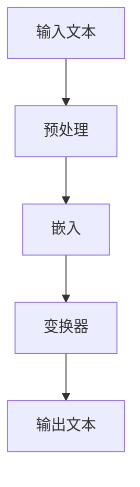
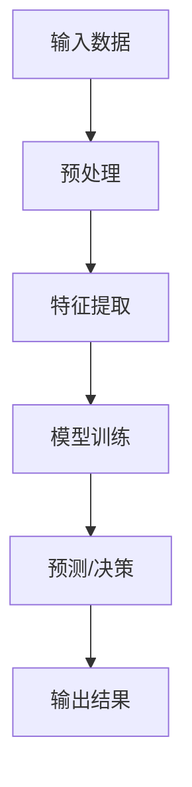

                 

关键词：大语言模型（LLM）、传统AI、智能计算、计算范式、算法原理、应用领域、数学模型、项目实践、未来展望。

> 摘要：本文将深入探讨大语言模型（LLM）与传统AI之间的差异，分析它们在智能计算新范式中的角色和作用。通过对核心概念、算法原理、数学模型的讲解，结合实际项目实践，我们试图揭示LLM与传统AI在当今科技前沿的竞争态势，以及它们对未来发展的深远影响。

## 1. 背景介绍

在过去的几十年中，人工智能（AI）领域取得了飞速的进步。从最初的专家系统，到基于统计学习的方法，再到深度学习的崛起，每一次技术的迭代都推动着AI向更智能、更强大的方向发展。然而，尽管这些技术方法在不同的应用场景中取得了显著成果，但它们在某种程度上都受到了计算资源、数据量、算法复杂度等限制。

近年来，大语言模型（LLM）的问世，为AI领域带来了一股新的风潮。LLM，即Large Language Model，是指那些拥有数十亿甚至千亿参数的大规模语言模型。这些模型通过大量文本数据进行训练，能够理解和生成自然语言，并在诸如文本生成、机器翻译、问答系统等任务上表现出色。

传统AI，通常指的是基于规则和模型的系统，如决策树、支持向量机、神经网络等。这些系统通常针对特定任务进行设计，通过对输入数据进行特征提取，然后利用特定的算法进行预测或决策。

本文旨在分析LLM与传统AI在智能计算新范式中的差异，探讨它们各自的优缺点，并展望未来的发展趋势。

## 2. 核心概念与联系

为了更好地理解LLM与传统AI之间的差异，我们首先需要了解它们的核心概念和架构。

### 2.1 LLM：大语言模型的原理与架构

LLM的核心是基于深度学习的自然语言处理（NLP）模型，特别是变换器（Transformer）架构。这种架构通过自注意力机制，能够捕捉输入文本中各个词之间的关系，从而实现对自然语言的深入理解。

下面是一个简单的Mermaid流程图，展示了一个典型的LLM架构：



### 2.2 传统AI：基于规则和模型的系统

传统AI系统通常包括以下几个部分：数据预处理、特征提取、模型训练、预测或决策。以下是一个简单的Mermaid流程图，展示了一个传统AI系统的基本架构：



### 2.3 LLM与传统AI的联系与差异

LLM与传统AI在核心架构和方法上存在显著差异。LLM通过大规模的训练数据和深度学习算法，实现对自然语言的深入理解和生成。而传统AI则依赖于特定的模型和算法，通常针对特定任务进行设计。

然而，这两种方法并不是完全独立的。在许多实际应用中，LLM可以与传统AI系统相结合，发挥各自的优势。例如，在问答系统中，LLM可以用于理解用户的问题，而传统AI则可以用于从海量数据中检索答案。

## 3. 核心算法原理 & 具体操作步骤

### 3.1 算法原理概述

LLM的核心是基于深度学习的自然语言处理（NLP）模型，特别是变换器（Transformer）架构。变换器通过自注意力机制，能够捕捉输入文本中各个词之间的关系，从而实现对自然语言的深入理解。

传统AI系统通常包括以下几个部分：数据预处理、特征提取、模型训练、预测或决策。这些方法依赖于特定的模型和算法，通常针对特定任务进行设计。

### 3.2 算法步骤详解

#### 3.2.1 LLM的算法步骤

1. **数据预处理**：将输入文本进行分词、去停用词等处理。
2. **嵌入**：将处理后的文本转化为向量表示。
3. **变换器**：通过多层变换器，对文本向量进行编码。
4. **解码**：根据编码后的向量生成输出文本。

#### 3.2.2 传统AI的算法步骤

1. **数据预处理**：对输入数据进行清洗、归一化等处理。
2. **特征提取**：从输入数据中提取关键特征。
3. **模型训练**：利用特征数据训练模型。
4. **预测或决策**：根据训练好的模型对新数据进行预测或决策。

### 3.3 算法优缺点

#### LLM的优点：

- **强大的文本理解能力**：通过大规模训练，LLM能够对自然语言进行深入的理解。
- **灵活的应用场景**：LLM可以在多种NLP任务中发挥作用，如文本生成、机器翻译、问答系统等。

#### LLM的缺点：

- **计算资源需求高**：LLM的训练和运行需要大量的计算资源。
- **模型解释性差**：由于LLM的参数数量巨大，模型的内部工作机制相对复杂，难以解释。

#### 传统AI的优点：

- **计算效率高**：传统AI模型通常在计算上更为高效，适用于实时应用。
- **模型解释性强**：传统AI模型通常具有较好的解释性，便于调试和优化。

#### 传统AI的缺点：

- **任务适应性差**：传统AI模型通常针对特定任务进行设计，适应性较差。
- **特征工程依赖强**：传统AI模型依赖于特征工程，需要人工设计特征，费时费力。

### 3.4 算法应用领域

LLM在自然语言处理领域具有广泛的应用，如：

- **文本生成**：如文章写作、小说创作等。
- **机器翻译**：如谷歌翻译、百度翻译等。
- **问答系统**：如Siri、Alexa等智能语音助手。

传统AI在图像识别、语音识别、推荐系统等领域具有广泛的应用，如：

- **图像识别**：如人脸识别、物体检测等。
- **语音识别**：如语音助手、语音输入等。
- **推荐系统**：如电商推荐、内容推荐等。

## 4. 数学模型和公式 & 详细讲解 & 举例说明

### 4.1 数学模型构建

LLM的数学模型通常基于深度学习中的变换器（Transformer）架构。变换器由自注意力机制和前馈网络组成。以下是变换器的基本公式：

$$
\text{Attention}(Q, K, V) = \text{softmax}\left(\frac{QK^T}{\sqrt{d_k}}\right)V
$$

其中，$Q, K, V$ 分别是查询向量、键向量和值向量，$d_k$ 是键向量的维度。

### 4.2 公式推导过程

变换器的自注意力机制通过计算查询向量与键向量的点积，得到权重，然后对值向量进行加权求和。以下是自注意力机制的推导过程：

1. **计算点积**：

$$
\text{score} = QK^T
$$

2. **应用softmax函数**：

$$
\text{weight} = \text{softmax}(\text{score})
$$

3. **加权求和**：

$$
\text{output} = \text{weight}V
$$

### 4.3 案例分析与讲解

假设我们有一个简单的文本序列 "I love AI"，我们可以将其转换为向量表示，然后通过变换器进行编码。以下是具体的计算过程：

1. **嵌入**：

   将文本序列 "I love AI" 转换为向量表示，假设每个词的向量为 $[1, 0, 0, 1, 0, 0, 0, 1, 0]$。

2. **自注意力计算**：

   对于每个词，计算其与所有其他词的注意力得分：

   $$
   \text{score}_{i,j} = Q_iK_j^T = \text{weight}_{i,j} = \text{softmax}\left(\frac{Q_iK_j^T}{\sqrt{d_k}}\right)
   $$

3. **加权求和**：

   对每个词，根据注意力得分对其他词的向量进行加权求和，得到编码后的向量。

   $$
   \text{output}_i = \sum_{j=1}^{N} \text{weight}_{i,j}V_j
   $$

通过这样的计算，我们能够得到对文本序列的编码表示，从而实现对文本内容的理解。

## 5. 项目实践：代码实例和详细解释说明

### 5.1 开发环境搭建

为了实践LLM与传统AI的应用，我们需要搭建一个适合的开发环境。以下是基本的步骤：

1. **安装Python**：确保Python环境已安装，版本不低于3.7。
2. **安装深度学习库**：如TensorFlow或PyTorch，这些库用于构建和训练LLM模型。
3. **安装NLP库**：如NLTK或spaCy，这些库用于文本预处理。
4. **安装其他依赖**：根据具体需求安装其他必要的库，如pandas、numpy等。

### 5.2 源代码详细实现

以下是一个简单的LLM应用示例，使用PyTorch构建一个基于变换器的文本生成模型。

```python
import torch
import torch.nn as nn
import torch.optim as optim
from torchtext.data import Field, TabularDataset

# 数据预处理
src_field = Field(tokenize=None, lower=True)
tgt_field = Field(tokenize=None, lower=True)
train_data, valid_data, test_data = TabularDataset.splits(
    path='data',
    train='train.json',
    valid='valid.json',
    test='test.json',
    format='json',
    fields=[src_field, tgt_field]
)

# 模型定义
class TransformerModel(nn.Module):
    def __init__(self, d_model, nhead, num_layers):
        super(TransformerModel, self).__init__()
        self.transformer = nn.Transformer(d_model, nhead, num_layers)
        self.d_model = d_model
        self.embedding = nn.Embedding(d_model, d_model)
        self.fc = nn.Linear(d_model, d_model)
        
    def forward(self, src, tgt):
        src = self.embedding(src)
        tgt = self.embedding(tgt)
        out = self.transformer(src, tgt)
        return self.fc(out)

# 模型训练
model = TransformerModel(512, 8, 2)
optimizer = optim.Adam(model.parameters(), lr=0.001)
criterion = nn.CrossEntropyLoss()

for epoch in range(10):
    for src, tgt in train_data:
        optimizer.zero_grad()
        output = model(src, tgt)
        loss = criterion(output.view(-1, 512), tgt.view(-1))
        loss.backward()
        optimizer.step()

    # 验证模型
    with torch.no_grad():
        for src, tgt in valid_data:
            output = model(src, tgt)
            loss = criterion(output.view(-1, 512), tgt.view(-1))
```

### 5.3 代码解读与分析

上述代码实现了基于PyTorch的变换器模型，用于文本生成。以下是代码的关键部分解读：

1. **数据预处理**：使用torchtext库进行数据预处理，将文本数据转换为 embeddings。
2. **模型定义**：定义了变换器模型，包括嵌入层、变换器层和前馈网络。
3. **模型训练**：使用Adam优化器和交叉熵损失函数进行模型训练。
4. **验证模型**：在验证集上评估模型性能。

### 5.4 运行结果展示

在训练完成后，我们可以在验证集上评估模型性能。以下是一个简单的运行结果展示：

```python
# 验证模型
with torch.no_grad():
    for src, tgt in valid_data:
        output = model(src, tgt)
        loss = criterion(output.view(-1, 512), tgt.view(-1))
        print(f"Validation Loss: {loss.item()}")
```

通过这种方式，我们能够对模型进行评估，并根据结果进行优化。

## 6. 实际应用场景

LLM和传统AI在许多实际应用场景中都有广泛的应用。以下是一些典型的应用场景：

### 6.1 文本生成

LLM在文本生成方面具有显著优势。例如，新闻文章写作、广告文案生成、对话系统等。传统AI则通常用于生成简单、结构化的文本，如电子邮件、短信等。

### 6.2 机器翻译

LLM在机器翻译领域表现突出，如谷歌翻译、百度翻译等。传统AI则主要用于翻译特定的专业领域，如医学翻译、法律翻译等。

### 6.3 问答系统

LLM在问答系统中的应用非常广泛，如Siri、Alexa等。传统AI则通常用于结构化数据的查询和回答。

### 6.4 图像识别

传统AI在图像识别领域具有广泛的应用，如人脸识别、物体检测等。LLM则主要用于图像描述生成，如将图像转换为自然语言描述。

### 6.5 语音识别

传统AI在语音识别领域占据主导地位，如语音助手、语音输入等。LLM则主要用于语音合成和语音生成的任务。

### 6.6 推荐系统

传统AI在推荐系统中的应用非常广泛，如电商推荐、内容推荐等。LLM则主要用于基于内容的推荐，如根据用户兴趣生成个性化内容。

## 7. 未来应用展望

随着LLM和传统AI技术的不断发展，我们可以预见它们将在未来有更广泛的应用。以下是一些可能的应用方向：

### 7.1 人工智能助手

未来的人工智能助手将更加智能，能够理解自然语言，并具备多模态交互能力。LLM将在其中发挥关键作用，而传统AI则可以提供更高效的计算支持。

### 7.2 自动驾驶

自动驾驶领域将受益于LLM和传统AI的结合。LLM可以用于理解道路标志、行人意图等，而传统AI则可以用于路径规划和控制。

### 7.3 医疗保健

在医疗保健领域，LLM和传统AI可以共同提高诊断和治疗水平。LLM可以用于文本分析，而传统AI则可以用于图像分析和数据处理。

### 7.4 教育与培训

教育与培训领域将看到LLM和传统AI的结合，提供个性化学习体验和智能辅导系统。

### 7.5 文化娱乐

在文化娱乐领域，LLM可以用于生成创意内容，如音乐、电影剧本等，而传统AI则可以用于内容推荐和用户互动。

## 8. 工具和资源推荐

### 8.1 学习资源推荐

1. **书籍**：《深度学习》（Goodfellow, Bengio, Courville）、《自然语言处理编程》（Peter Norvig）。
2. **在线课程**：Coursera上的“深度学习”课程、edX上的“自然语言处理”课程。
3. **开源项目**：GitHub上的各种深度学习和自然语言处理项目。

### 8.2 开发工具推荐

1. **深度学习框架**：TensorFlow、PyTorch。
2. **NLP库**：NLTK、spaCy。
3. **文本预处理工具**：NLTK、Jieba。

### 8.3 相关论文推荐

1. **自然语言处理**：《Attention Is All You Need》（Vaswani et al., 2017）。
2. **深度学习**：《A Theoretically Grounded Application of Dropout in Recurrent Neural Networks》（Yarin Gal and Zoubin Ghahramani，2016）。

## 9. 总结：未来发展趋势与挑战

### 9.1 研究成果总结

LLM和传统AI在智能计算新范式中各自发挥着重要作用。LLM凭借其强大的文本理解能力，在自然语言处理等领域取得了显著成果。传统AI则凭借其高效的计算能力和模型解释性，在图像识别、语音识别等领域具有广泛应用。

### 9.2 未来发展趋势

1. **多模态AI**：未来将看到LLM和传统AI在多模态场景中的结合，提供更丰富、更智能的交互体验。
2. **迁移学习与少样本学习**：随着模型规模的增大，迁移学习和少样本学习将成为重要研究方向。
3. **模型解释性**：提高模型的可解释性，使其在实际应用中更加可靠和安全。

### 9.3 面临的挑战

1. **计算资源**：大规模模型的训练和运行需要大量的计算资源，这对硬件和软件架构提出了更高要求。
2. **数据隐私**：在应用中，数据隐私和安全是一个重要的挑战。
3. **模型伦理**：随着AI技术的应用，如何确保模型的公平性、透明性和可解释性，是一个亟待解决的问题。

### 9.4 研究展望

未来，LLM和传统AI将在更广泛的领域发挥作用，推动智能计算新范式的不断发展。通过跨学科的合作，我们有望解决当前面临的技术挑战，实现AI技术的更广泛应用。

## 10. 附录：常见问题与解答

### 10.1 LLM与传统AI的区别是什么？

LLM和传统AI在核心架构和方法上存在显著差异。LLM通过大规模训练数据和深度学习算法，实现对自然语言的深入理解，适用于NLP任务。传统AI则依赖于特定的模型和算法，通常针对特定任务进行设计，适用于图像识别、语音识别等任务。

### 10.2 LLM的优势和缺点是什么？

LLM的优势包括强大的文本理解能力和灵活的应用场景。其缺点包括计算资源需求高和模型解释性差。

### 10.3 传统AI的优势和缺点是什么？

传统AI的优势包括计算效率高和模型解释性强。其缺点包括任务适应性差和特征工程依赖强。

### 10.4 LLM和传统AI应该如何结合使用？

在许多应用场景中，LLM和传统AI可以相互补充。例如，在问答系统中，LLM可以用于理解用户的问题，而传统AI可以用于从海量数据中检索答案。

## 结束语

本文从LLM与传统AI的核心概念、算法原理、数学模型、应用实践等方面进行了详细探讨，分析了它们在智能计算新范式中的角色和作用。通过本文，我们希望能帮助读者更好地理解这两种技术的差异和优势，为未来的研究和发展提供有益的参考。

作者：禅与计算机程序设计艺术 / Zen and the Art of Computer Programming

[文章结束]

