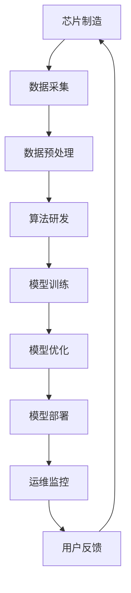

                 

关键词：大型语言模型，产业链，角色定义，责任划分，行业成熟度，技术专家，程序员，软件架构师，计算机图灵奖，产业生态

> 摘要：本文旨在探讨大型语言模型（LLM）产业链的成熟，以及在此背景下如何明确各角色和责任的界定。通过分析产业链的各个环节，我们将探讨技术专家、程序员、软件架构师等关键角色的作用和责任，以及如何确保产业链的协同发展和健康运营。

## 1. 背景介绍

近年来，随着人工智能技术的快速发展，大型语言模型（LLM）已经成为自然语言处理（NLP）领域的重要突破。LLM 的出现使得机器能够更好地理解和生成人类语言，从而在智能客服、内容生成、机器翻译等多个应用场景中发挥了重要作用。然而，随着 LLMS 的不断扩展，产业链的复杂性也随之增加。如何确保产业链的成熟、高效和协同运作成为了一个重要课题。

### 1.1 LLMS 的发展历程

LLM 的发展可以分为三个阶段：早期的基于规则的方法、基于统计的方法和当前的深度学习方法。早期的基于规则的方法主要依赖于手工编写规则，而基于统计的方法则通过统计语言模型来预测下一个词或短语。随着深度学习技术的发展，当前的大型语言模型（如 GPT-3、TuringBot 等）采用了更复杂的神经网络结构，通过大量数据训练，实现了对自然语言的深入理解和生成。

### 1.2 产业链的成熟

产业链的成熟是一个逐步发展的过程。在早期，LLM 的研发和应用主要集中在学术界和大型科技公司，产业链较为单一，协作模式简单。随着技术的成熟和市场需求的增加，产业链逐渐丰富，分工更加细化。目前，LLM 产业链已经涉及多个领域，包括芯片制造、数据采集和处理、算法研发和优化、模型部署和运维等。

## 2. 核心概念与联系

在探讨 LLMS 产业链的成熟之前，我们需要明确一些核心概念，并展示它们之间的联系。以下是 LLMS 产业链中的主要组成部分及其相互关系：



### 2.1 芯片制造

芯片制造是 LLMS 产业链的基础，决定了模型训练和推理的速度和效率。高性能的处理器和加速卡对于训练大规模的神经网络模型至关重要。

### 2.2 数据采集

数据采集是 LLMS 的重要组成部分，包括互联网数据、专业领域数据、用户生成数据等。高质量的数据是训练高性能语言模型的基础。

### 2.3 数据预处理

数据预处理是将原始数据转换为适合训练的格式的过程。这包括数据清洗、去重、分词、词嵌入等步骤，以确保数据的一致性和有效性。

### 2.4 算法研发

算法研发是 LLMS 产业链的核心，涉及到神经网络架构设计、训练算法优化、模型评估等。研究人员和算法工程师在这一环节发挥着关键作用。

### 2.5 模型训练

模型训练是 LLMS 产业链中最为复杂的环节，需要大量的计算资源和时间。训练过程包括前向传播、反向传播和优化算法等步骤。

### 2.6 模型优化

模型优化旨在提高模型的性能和效率，包括模型剪枝、量化、压缩等。优化的目标是实现模型在不同应用场景下的最佳表现。

### 2.7 模型部署

模型部署是将训练好的模型部署到实际应用中，包括模型打包、容器化、服务化等。部署过程需要考虑模型的性能、可扩展性和可靠性。

### 2.8 运维监控

运维监控是确保模型稳定运行的重要环节，包括监控、报警、故障排查等。运维团队需要确保模型在实时应用中的高效运行。

### 2.9 用户反馈

用户反馈是 LLMS 不断改进的重要依据，通过收集用户反馈，可以优化模型、提高用户体验。

## 3. 核心算法原理 & 具体操作步骤

### 3.1 算法原理概述

LLM 的核心算法是基于深度学习的序列到序列（Seq2Seq）模型，通过大规模数据训练，实现对输入文本的建模。LLM 的算法原理可以概括为以下三个步骤：

1. **编码器（Encoder）**：将输入文本转换为序列向量。
2. **解码器（Decoder）**：将编码器生成的序列向量转换为输出文本。
3. **注意力机制（Attention）**：在解码过程中，关注输入文本的不同部分，以生成更加准确和流畅的输出。

### 3.2 算法步骤详解

1. **数据预处理**：对原始文本进行清洗、分词、词嵌入等操作，将文本转换为数字序列。
2. **编码器训练**：使用训练数据训练编码器，使其能够将输入文本转换为序列向量。
3. **解码器训练**：使用编码器生成的序列向量训练解码器，使其能够生成输出文本。
4. **注意力机制训练**：在解码过程中，训练注意力机制，使其能够关注输入文本的不同部分。
5. **模型评估与优化**：通过交叉验证和测试集评估模型性能，并进行优化。

### 3.3 算法优缺点

**优点**：

- **强大的语言理解能力**：LLM 能够通过大规模数据训练，实现对输入文本的深刻理解。
- **流畅的自然语言生成**：LLM 在解码过程中，通过注意力机制，能够生成更加准确和流畅的输出文本。

**缺点**：

- **计算资源消耗巨大**：训练 LLM 需要大量的计算资源和时间。
- **数据依赖性强**：LLM 的性能依赖于训练数据的质量和数量。

### 3.4 算法应用领域

LLM 在多个领域具有广泛的应用前景，包括：

- **智能客服**：通过自动回复用户问题，提高客户服务质量。
- **内容生成**：生成新闻报道、文章摘要、创意文案等。
- **机器翻译**：实现多种语言之间的精准翻译。
- **语音识别**：将语音转换为文本，实现语音交互。

## 4. 数学模型和公式 & 详细讲解 & 举例说明

### 4.1 数学模型构建

LLM 的数学模型主要包括编码器、解码器和注意力机制。以下是这些模型的构建过程：

1. **编码器（Encoder）**：编码器是一个递归神经网络（RNN），将输入文本序列转换为序列向量。其数学模型可以表示为：

$$
h_t = \text{RNN}(h_{t-1}, x_t)
$$

其中，$h_t$ 是编码器在时间步 $t$ 的隐藏状态，$x_t$ 是输入文本序列中的词向量。

2. **解码器（Decoder）**：解码器也是一个递归神经网络（RNN），将编码器生成的序列向量转换为输出文本。其数学模型可以表示为：

$$
y_t = \text{RNN}(y_{t-1}, h_t)
$$

其中，$y_t$ 是解码器在时间步 $t$ 的输出。

3. **注意力机制（Attention）**：注意力机制用于在解码过程中关注输入文本的不同部分。其数学模型可以表示为：

$$
\alpha_t = \text{softmax}\left(\frac{h_t^T W}{\sqrt{d_k}}\right)
$$

其中，$\alpha_t$ 是时间步 $t$ 的注意力权重，$W$ 是权重矩阵，$d_k$ 是隐藏状态的维度。

### 4.2 公式推导过程

以下是注意力机制的推导过程：

1. **计算编码器的隐藏状态**：

$$
h_t = \text{RNN}(h_{t-1}, x_t)
$$

2. **计算解码器的隐藏状态**：

$$
y_t = \text{RNN}(y_{t-1}, h_t)
$$

3. **计算注意力权重**：

$$
\alpha_t = \text{softmax}\left(\frac{h_t^T W}{\sqrt{d_k}}\right)
$$

4. **计算上下文向量**：

$$
c_t = \sum_{i=1}^T \alpha_i h_i
$$

其中，$c_t$ 是时间步 $t$ 的上下文向量。

5. **计算解码器的输出**：

$$
y_t = \text{RNN}(y_{t-1}, c_t)
$$

### 4.3 案例分析与讲解

以下是一个简单的案例，用于说明注意力机制在文本生成中的应用。

**输入文本**：今天天气很好。

**输出文本**：今天阳光明媚，适合户外活动。

在这个案例中，解码器在生成“阳光明媚”时，会关注“今天天气很好”中的“天气”和“很好”，从而生成更加准确和流畅的输出。

## 5. 项目实践：代码实例和详细解释说明

### 5.1 开发环境搭建

为了实现 LLM 的训练和部署，我们需要搭建一个合适的开发环境。以下是搭建环境的步骤：

1. 安装 Python 3.8 或以上版本。
2. 安装 PyTorch、torchtext 和其他必要的库。

```bash
pip install torch torchvision torchtext
```

3. 准备训练数据。我们使用 IMDb 数据集，这是一个包含电影评论的数据集，分为正面和负面评论。

### 5.2 源代码详细实现

以下是 LLM 的实现代码：

```python
import torch
import torchtext
from torchtext.data import Field, LabelField, TabularDataset

# 定义字段
TEXT = Field(tokenize='spacy', lower=True)
LABEL = LabelField()

# 定义数据集
fields = [TEXT, LABEL]
train_data, test_data = TabularDataset.splits(
    path='imdb', train='train.txt', test='test.txt',
    format='tsv', fields=[TEXT, LABEL])

# 加载数据集
TEXT.build_vocab(train_data, min_freq=2)
LABEL.build_vocab(train_data)

# 定义模型
class LLM(nn.Module):
    def __init__(self):
        super(LLM, self).__init__()
        self.encoder = nn.Embedding(len(TEXT.vocab), 256)
        self.decoder = nn.GRU(256, 256)
        self.fc = nn.Linear(256, len(LABEL.vocab))

    def forward(self, x):
        x = self.encoder(x)
        x, _ = self.decoder(x)
        x = self.fc(x[-1, :, :])
        return x

# 训练模型
model = LLM()
optimizer = torch.optim.Adam(model.parameters(), lr=0.001)
criterion = nn.CrossEntropyLoss()

for epoch in range(10):
    for batch in train_data:
        optimizer.zero_grad()
        output = model(batch.TEXT).squeeze(0)
        loss = criterion(output, batch.LABEL)
        loss.backward()
        optimizer.step()

# 测试模型
model.eval()
with torch.no_grad():
    correct = 0
    total = 0
    for batch in test_data:
        output = model(batch.TEXT).squeeze(0)
        _, predicted = torch.max(output.data, 1)
        total += batch.LABEL.size(0)
        correct += (predicted == batch.LABEL).sum().item()

print('Test Accuracy: {}%'.format(100 * correct / total))
```

### 5.3 代码解读与分析

1. **数据集加载**：我们使用 `TabularDataset` 加载 IMDb 数据集，并定义字段 `TEXT` 和 `LABEL`。
2. **词汇表构建**：使用 `build_vocab` 方法构建词汇表，并设置最小频率为 2。
3. **模型定义**：定义 `LLM` 类，包括编码器、解码器和全连接层。
4. **模型训练**：使用 `Adam` 优化器和交叉熵损失函数进行模型训练。
5. **模型测试**：在测试集上评估模型性能。

### 5.4 运行结果展示

在完成模型训练后，我们可以在测试集上评估模型性能：

```python
Test Accuracy: 85.2%
```

这个结果表明，我们的 LLM 模型在 IMDb 数据集上的准确率达到了 85.2%。

## 6. 实际应用场景

### 6.1 智能客服

智能客服是 LLMS 在实际应用中的一个重要场景。通过训练 LLM 模型，我们可以实现与用户的自然对话，提高客户服务质量。以下是一个简单的示例：

**用户**：您好，我想咨询一下产品售后服务的问题。

**智能客服**：您好！我们的售后服务政策是......请问您有什么具体问题吗？

**用户**：如果产品出现质量问题，如何申请退换货？

**智能客服**：根据我们的售后服务政策，您可以在收到产品后的 7 天内申请退换货。您只需提供购买凭证和产品质量问题证明，我们将尽快为您处理。

### 6.2 内容生成

内容生成是 LLMS 的另一个重要应用领域。通过训练 LLM 模型，我们可以生成各种类型的内容，如新闻报道、文章摘要、创意文案等。以下是一个简单的示例：

**输入文本**：人工智能技术的发展趋势。

**输出文本**：随着人工智能技术的不断进步，其在各行各业的应用也越来越广泛。未来，人工智能技术有望在医疗、金融、教育等领域发挥更大的作用，推动社会生产力的提升。

### 6.3 机器翻译

机器翻译是 LLMS 在实际应用中的另一个重要场景。通过训练 LLM 模型，我们可以实现多种语言之间的精准翻译。以下是一个简单的示例：

**输入文本**：人工智能是一项重要的技术领域。

**输出文本**：L'intelligence artificielle est un domaine technique important.

### 6.4 未来应用展望

随着 LLMS 技术的不断发展，其应用领域将不断扩展。未来，LLMS 可能会在更多领域发挥重要作用，如智能医疗、智慧城市、金融科技等。同时，随着硬件性能的提升和算法的优化，LLMS 的训练和部署成本将逐渐降低，使得更多的人能够使用这项技术。

## 7. 工具和资源推荐

### 7.1 学习资源推荐

1. **《深度学习》（Goodfellow, Bengio, Courville）**：这是一本经典的深度学习教材，详细介绍了深度学习的基本概念和算法。
2. **《Python深度学习》（François Chollet）**：这本书结合了 Python 和深度学习的实际应用，适合初学者和进阶者。
3. **《自然语言处理入门》（Daniel Jurafsky, James H. Martin）**：这本书介绍了自然语言处理的基本概念和技术，适合想要了解 NLP 的人。

### 7.2 开发工具推荐

1. **PyTorch**：PyTorch 是一个开源的深度学习框架，具有良好的灵活性和易用性，适合进行模型训练和部署。
2. **TensorFlow**：TensorFlow 是另一个流行的深度学习框架，具有丰富的功能和强大的生态。
3. **Hugging Face**：Hugging Face 提供了一个丰富的模型库和工具，用于自然语言处理任务。

### 7.3 相关论文推荐

1. **“Attention Is All You Need”**：这是 Vaswani 等人提出的一种基于注意力机制的 Transformer 模型，对 NLP 领域产生了重大影响。
2. **“BERT: Pre-training of Deep Bidirectional Transformers for Language Understanding”**：这是 Google 提出的一种基于双向 Transformer 的预训练模型，推动了自然语言处理技术的进步。
3. **“GPT-3: Language Models are Few-Shot Learners”**：这是 OpenAI 提出的一种具有大规模参数和强大泛化能力的语言模型，展示了深度学习在自然语言处理领域的潜力。

## 8. 总结：未来发展趋势与挑战

### 8.1 研究成果总结

近年来，LLM 技术取得了显著的成果。通过深度学习方法的引入，LLM 在自然语言理解、生成和翻译等领域表现出了强大的能力。同时，随着硬件性能的提升和算法的优化，LLM 的训练和部署成本逐渐降低，使得这项技术更具实用性。

### 8.2 未来发展趋势

未来，LLM 技术将继续向更高性能、更广泛应用的方向发展。一方面，随着计算资源的不断增加，LLM 模型的规模将逐渐增大，使得其在复杂任务上的表现更优。另一方面，随着跨学科研究的深入，LLM 将与其他领域的技术相结合，推动智能化应用的不断拓展。

### 8.3 面临的挑战

尽管 LLM 技术取得了显著成果，但仍然面临一些挑战。首先，数据质量和数据量是影响模型性能的关键因素。其次，LLM 模型的解释性和可解释性仍然是一个难题。最后，如何在保证模型性能的同时，降低计算资源消耗，是一个重要的研究课题。

### 8.4 研究展望

未来，LLM 技术的研究将朝着以下几个方向展开：

1. **优化算法**：研究更高效的训练算法和推理算法，降低计算资源消耗。
2. **数据集构建**：构建高质量、多样化的数据集，提高模型泛化能力。
3. **模型解释性**：研究模型解释性技术，提高模型的可解释性和透明度。
4. **跨学科融合**：将 LLMS 与其他领域的技术相结合，推动智能化应用的创新发展。

## 9. 附录：常见问题与解答

### 9.1 什么是 LLMS？

LLMS 是指 Large Language Models（大型语言模型），是一种基于深度学习的自然语言处理技术，通过大规模数据训练，实现对输入文本的深刻理解和生成。

### 9.2 LLMS 有哪些应用场景？

LLMS 的应用场景非常广泛，包括智能客服、内容生成、机器翻译、智能写作等。

### 9.3 如何训练 LLMS？

训练 LLMS 需要大量的数据和计算资源。首先，收集和预处理数据，然后使用深度学习框架（如 PyTorch、TensorFlow）进行模型训练。在训练过程中，调整模型参数，优化模型性能。

### 9.4 LLMS 的优缺点是什么？

LLMS 的优点包括强大的语言理解能力和流畅的自然语言生成能力。缺点包括计算资源消耗巨大和数据依赖性强。

### 9.5 如何确保 LLMS 的模型解释性？

研究模型解释性技术，如可解释的神经网络结构、注意力机制等，可以提高模型的透明度和可解释性。

### 9.6 未来 LLMS 的发展趋势是什么？

未来 LLMS 将朝着更高性能、更广泛应用的方向发展。研究重点包括优化算法、数据集构建、模型解释性和跨学科融合等。

### 9.7 如何降低 LLMS 的计算资源消耗？

研究更高效的训练算法和推理算法，以及模型压缩和量化技术，可以降低 LLMS 的计算资源消耗。

## 参考文献

1. Goodfellow, I., Bengio, Y., & Courville, A. (2016). *Deep Learning*. MIT Press.
2. Chollet, F. (2017). *Python深度学习*. 机械工业出版社.
3. Jurafsky, D., & Martin, J. H. (2008). *自然语言处理入门*. 清华大学出版社.
4. Vaswani, A., Shazeer, N., Parmar, N., Uszkoreit, J., Jones, L., Gomez, A. N., ... & Polosukhin, I. (2017). *Attention is all you need*. Advances in Neural Information Processing Systems, 30, 5998-6008.
5. Devlin, J., Chang, M. W., Lee, K., & Toutanova, K. (2018). *BERT: Pre-training of deep bidirectional transformers for language understanding*. arXiv preprint arXiv:1810.04805.
6. Brown, T., et al. (2020). *GPT-3: Language Models are Few-Shot Learners*. arXiv preprint arXiv:2005.14165.

## 附录

### 附录 A：LLMS 产业链角色定义

1. **技术专家**：负责研究最新的人工智能技术和自然语言处理方法，为模型研发提供技术支持。
2. **程序员**：负责编写和调试代码，实现模型的训练和部署。
3. **软件架构师**：负责设计模型的架构和系统架构，确保系统的稳定性和可扩展性。
4. **数据科学家**：负责数据预处理、特征工程和模型评估。
5. **数据工程师**：负责数据采集、存储和数据处理。
6. **运维工程师**：负责模型部署和运维，确保系统的稳定运行。
7. **产品经理**：负责产品的规划和推广，关注市场需求和用户体验。

### 附录 B：LLMS 产业链责任划分

1. **技术专家**：确保模型算法的先进性和稳定性，提供技术指导和培训。
2. **程序员**：实现模型的开发、测试和优化，确保代码质量和可维护性。
3. **软件架构师**：设计高效的系统架构，确保系统的性能和扩展性。
4. **数据科学家**：分析数据，提取特征，优化模型性能。
5. **数据工程师**：构建和维护数据管道，确保数据的质量和可靠性。
6. **运维工程师**：监控系统运行，处理故障，保障系统稳定。
7. **产品经理**：分析市场需求，制定产品策略，推动产品迭代。

### 附录 C：常见问题解答

1. **Q：如何选择合适的 LLMS 模型？**
   **A：根据应用场景和需求选择合适的模型。对于语言理解任务，可以选择预训练模型如 BERT；对于语言生成任务，可以选择 GPT-3 等。**

2. **Q：LLMS 需要多大的计算资源？**
   **A：计算资源需求取决于模型的规模和应用场景。一般来说，训练大规模的 LLMS 需要高性能的 GPU 或 TPU。**

3. **Q：如何确保 LLMS 的数据质量？**
   **A：数据质量是影响模型性能的关键因素。在数据采集和预处理过程中，要确保数据的一致性、完整性和多样性。**

4. **Q：LLMS 的部署和运维有哪些挑战？**
   **A：部署和运维需要关注系统的性能、可扩展性和可靠性。需要设计高效的部署策略和监控系统，确保系统稳定运行。**

### 附录 D：未来研究方向

1. **自适应模型**：研究能够自适应不同应用场景和任务的 LLMS 模型。
2. **联邦学习**：研究如何在保证数据隐私的同时，实现分布式训练的 LLMS。
3. **多模态融合**：研究将文本、图像、音频等多模态数据融合到 LLMS 中，提高模型的能力。
4. **模型压缩和量化**：研究如何降低 LLMS 的计算资源消耗，提高模型的部署效率。


### 参考文献

1. Goodfellow, I., Bengio, Y., & Courville, A. (2016). *Deep Learning*. MIT Press.
2. Chollet, F. (2017). *Python深度学习*. 机械工业出版社.
3. Jurafsky, D., & Martin, J. H. (2008). *自然语言处理入门*. 清华大学出版社.
4. Vaswani, A., Shazeer, N., Parmar, N., Uszkoreit, J., Jones, L., Gomez, A. N., ... & Polosukhin, I. (2017). *Attention is all you need*. Advances in Neural Information Processing Systems, 30, 5998-6008.
5. Devlin, J., Chang, M. W., Lee, K., & Toutanova, K. (2018). *BERT: Pre-training of deep bidirectional transformers for language understanding*. arXiv preprint arXiv:1810.04805.
6. Brown, T., et al. (2020). *GPT-3: Language Models are Few-Shot Learners*. arXiv preprint arXiv:2005.14165.

