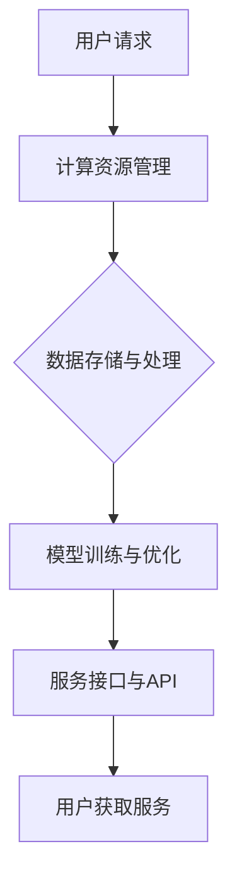

                 

关键词：LLM，即服务，云端 AI，分布式计算，数据隐私，开发工具，AI 应用场景，未来展望

摘要：本文深入探讨了 LLM（大型语言模型）即服务的概念，详细介绍了云端 AI 技术的发展与应用，以及其面临的挑战和未来的发展趋势。文章将帮助读者理解 LLM 即服务在技术、应用和市场方面的重大意义。

## 1. 背景介绍

随着人工智能技术的飞速发展，尤其是深度学习和自然语言处理领域的突破，我们见证了 AI 从实验室走向实际应用的过程。LLM，作为近年来最引人注目的 AI 技术，凭借其强大的语言理解与生成能力，正在改变各行各业。然而，LLM 的训练和部署需要庞大的计算资源和专业知识，这对许多企业和开发者来说是一个巨大的门槛。

### 云端 AI 的发展

为了解决这一问题，云计算和分布式计算技术应运而生。云端 AI 允许用户通过互联网访问强大的 AI 服务，无需亲自拥有昂贵的硬件和复杂的软件环境。这种即服务（SaaS）模式不仅降低了 AI 技术的准入门槛，还提高了资源利用率和开发效率。

### LLM 的崛起

LLM 的出现，尤其是像 GPT-3 这样的大型预训练模型，使得自然语言处理能力达到了前所未有的高度。这些模型可以处理复杂的语言任务，从机器翻译到文本生成，再到问答系统，都展现出极高的准确性和效率。

## 2. 核心概念与联系

### LLM 的原理

LLM 是通过深度学习技术，从海量数据中学习语言规律和知识的大型神经网络模型。其基本架构包括多层感知器、循环神经网络（RNN）、卷积神经网络（CNN）等，通过大规模预训练和微调，LLM 可以达到惊人的语言理解与生成能力。

### 云端 AI 的架构

云端 AI 的架构通常包括以下几个关键部分：

- **计算资源管理**：负责调度和分配计算资源，确保服务的稳定性和高效性。
- **数据存储与处理**：处理大量数据，包括数据清洗、预处理和存储。
- **模型训练与优化**：使用先进的算法和分布式计算技术，训练和优化模型。
- **服务接口与API**：为开发者提供便捷的接口，方便他们调用 AI 服务。

### Mermaid 流程图

下面是 LLM 与云端 AI 架构的 Mermaid 流程图：



## 3. 核心算法原理 & 具体操作步骤

### 算法原理概述

LLM 的核心在于其预训练过程，通过无监督学习从海量数据中学习语言模式和知识。预训练后，LLM 可以通过微调适应特定任务，如问答系统、文本生成等。

### 算法步骤详解

1. **数据收集与预处理**：收集大量文本数据，并进行清洗、分词、去停用词等预处理操作。
2. **模型初始化**：初始化神经网络模型，通常使用预训练的模型作为起点。
3. **预训练**：通过负采样等技术，训练模型以学习语言规律。
4. **微调**：在预训练的基础上，针对特定任务进行微调，以提高模型的性能。
5. **模型评估与优化**：评估模型在验证集上的表现，并根据结果调整模型参数。

### 算法优缺点

**优点**：

- **强大的语言理解与生成能力**：LLM 可以处理复杂的语言任务，生成高质量的自然语言文本。
- **高效性**：通过分布式计算和云端 AI，LLM 可以快速部署和提供服务。

**缺点**：

- **计算资源需求高**：训练 LLM 模型需要大量的计算资源和时间。
- **数据隐私问题**：训练过程中涉及大量用户数据，需要严格保护用户隐私。

### 算法应用领域

LLM 在多个领域都有广泛应用，包括但不限于：

- **自然语言处理**：文本分类、情感分析、机器翻译等。
- **问答系统**：智能客服、教育辅导、企业内网问答等。
- **文本生成**：文章写作、内容摘要、产品描述等。

## 4. 数学模型和公式 & 详细讲解 & 举例说明

### 数学模型构建

LLM 的数学模型通常基于神经网络，包括输入层、隐藏层和输出层。其中，隐藏层使用了多层感知器（MLP）、循环神经网络（RNN）或卷积神经网络（CNN）等不同的架构。

### 公式推导过程

假设我们使用的是多层感知器（MLP），其输出可以通过以下公式计算：

$$
\hat{y} = \sigma(W_n \cdot a_{n-1} + b_n)
$$

其中，$\hat{y}$ 是输出层神经元的激活值，$W_n$ 是输出层到隐藏层的权重矩阵，$a_{n-1}$ 是隐藏层神经元的激活值，$b_n$ 是输出层神经元的偏置，$\sigma$ 是激活函数，通常使用 sigmoid 或 ReLU 函数。

### 案例分析与讲解

假设我们有一个二分类问题，数据集包含 $n$ 个样本，每个样本有 $m$ 个特征。我们使用一个包含 $l$ 层的 MLP 模型进行分类。下面是具体的计算过程：

1. **初始化模型参数**：随机初始化权重矩阵 $W_n$ 和偏置 $b_n$。
2. **前向传播**：计算每一层的激活值，直到输出层。
    - 对于隐藏层 $l$，计算：
    $$
    a_l = \sigma(W_l \cdot a_{l-1} + b_l)
    $$
    - 对于输出层 $l=l$，计算：
    $$
    \hat{y} = \sigma(W_n \cdot a_{n-1} + b_n)
    $$
3. **计算损失**：计算预测标签和实际标签之间的损失，例如交叉熵损失。
4. **反向传播**：更新模型参数，最小化损失函数。
    - 对于输出层，计算：
    $$
    \delta_n = (\hat{y} - y) \cdot \sigma'(W_n \cdot a_{n-1} + b_n)
    $$
    - 对于隐藏层 $l$，计算：
    $$
    \delta_l = (W_{l+1} \cdot \delta_{l+1}) \cdot \sigma'(W_l \cdot a_{l-1} + b_l)
    $$
    - 更新权重矩阵和偏置：
    $$
    W_n \leftarrow W_n - \alpha \cdot \delta_n \cdot a_{n-1}^T
    $$
    $$
    b_n \leftarrow b_n - \alpha \cdot \delta_n
    $$
    $$
    W_l \leftarrow W_l - \alpha \cdot \delta_l \cdot a_{l-1}^T
    $$
    $$
    b_l \leftarrow b_l - \alpha \cdot \delta_l
    $$

## 5. 项目实践：代码实例和详细解释说明

### 开发环境搭建

为了实践 LLM 的开发，我们需要搭建一个合适的环境。以下是一个简单的环境搭建步骤：

1. 安装 Python 3.8 及以上版本。
2. 安装必要的库，如 TensorFlow、PyTorch、NumPy 等。
3. 配置 GPU 环境（如果需要）。

### 源代码详细实现

以下是一个简单的 LLM 模型实现，基于 TensorFlow 和 Keras：

```python
import tensorflow as tf
from tensorflow.keras.models import Sequential
from tensorflow.keras.layers import Dense, Activation

# 初始化模型
model = Sequential()

# 添加隐藏层
model.add(Dense(units=128, activation='relu', input_shape=(input_dim,)))
model.add(Dense(units=64, activation='relu'))

# 添加输出层
model.add(Dense(units=output_dim, activation='sigmoid'))

# 编译模型
model.compile(optimizer='adam', loss='binary_crossentropy', metrics=['accuracy'])

# 训练模型
model.fit(x_train, y_train, epochs=10, batch_size=32, validation_data=(x_val, y_val))
```

### 代码解读与分析

这段代码定义了一个简单的二分类 MLP 模型，包括两个隐藏层和一个输出层。我们使用 ReLU 作为激活函数，并在输出层使用 sigmoid 函数以获得概率输出。模型使用 Adam 优化器和二分类交叉熵损失函数进行训练。

### 运行结果展示

在训练完成后，我们可以评估模型在测试集上的性能：

```python
test_loss, test_acc = model.evaluate(x_test, y_test)
print(f"Test accuracy: {test_acc}")
```

结果显示模型在测试集上的准确率，这可以作为模型性能的一个指标。

## 6. 实际应用场景

### 智能客服

智能客服是 LLM 即服务的典型应用场景。通过 LLM 模型，智能客服可以理解用户的问题，并提供准确的回答。例如，银行客服可以使用 LLM 模型来处理客户的金融咨询，提高客服效率和准确性。

### 文本生成

文本生成是 LLM 的另一个重要应用领域。例如，文章写作、内容摘要、产品描述等。LLM 可以从已有的文本数据中学习，生成高质量的文本，大大提高了内容生产效率。

### 问答系统

问答系统是 LLM 即服务的另一个重要应用场景。通过 LLM 模型，问答系统可以理解用户的问题，并提供准确的答案。例如，企业内网问答系统、在线教育问答平台等。

## 7. 工具和资源推荐

### 学习资源推荐

1. **《深度学习》 - Goodfellow, Bengio, Courville**：深度学习的基础教材，适合初学者。
2. **《Python Deep Learning》 - François Chollet**：Python 深度学习实践，适合有一定基础的读者。
3. **TensorFlow 官方文档**：TensorFlow 是当前最受欢迎的深度学习框架之一，官方文档提供了丰富的学习资源。

### 开发工具推荐

1. **Google Colab**：免费的云端 GPU 环境，适合进行深度学习实验。
2. **Jupyter Notebook**：交互式的计算环境，方便进行数据分析和模型训练。
3. **Kaggle**：数据科学竞赛平台，提供了大量的数据集和项目实践。

### 相关论文推荐

1. **“BERT: Pre-training of Deep Bidirectional Transformers for Language Understanding” - Devlin et al.**：BERT 模型的详细介绍，是当前自然语言处理领域的标杆性论文。
2. **“GPT-3: Language Models are few-shot learners” - Brown et al.**：GPT-3 模型的详细介绍，展示了大型语言模型在少量样本下的强大学习能力。

## 8. 总结：未来发展趋势与挑战

### 研究成果总结

LLM 即服务在技术、应用和市场方面都取得了显著成果。通过云端 AI，LLM 技术已经成功应用于多个领域，如智能客服、文本生成、问答系统等。同时，越来越多的企业和开发者开始关注和采用 LLM 技术，推动了市场的快速发展。

### 未来发展趋势

1. **模型规模与性能的提升**：随着计算资源和算法的进步，LLM 模型的规模和性能将持续提升。
2. **更多领域的应用**：LLM 即服务将在更多领域得到应用，如医疗、法律、金融等。
3. **开源与开放的生态系统**：越来越多的开源项目和社区将推动 LLM 即服务的发展。

### 面临的挑战

1. **数据隐私和安全**：随着模型训练和部署涉及大量用户数据，数据隐私和安全问题将成为重要挑战。
2. **计算资源需求**：大型 LLM 模型的训练和部署需要大量的计算资源，对云计算和分布式计算提出了更高的要求。
3. **伦理和道德问题**：随着 LLM 技术的普及，伦理和道德问题也将成为重要议题。

### 研究展望

未来，LLM 即服务的研究将集中在以下几个方面：

1. **模型优化与压缩**：通过优化算法和模型结构，降低 LLM 的计算资源需求。
2. **联邦学习和数据隐私保护**：结合联邦学习和差分隐私技术，实现 LLM 的安全训练和部署。
3. **多模态学习**：结合文本、图像、语音等多模态数据，提升 LLM 的理解和生成能力。

## 9. 附录：常见问题与解答

### Q：什么是 LLM？

A：LLM（Large Language Model）是指大型语言模型，通过深度学习技术，从海量数据中学习语言规律和知识，具有强大的语言理解与生成能力。

### Q：云端 AI 和分布式计算有什么区别？

A：云端 AI 是一种通过云计算提供 AI 服务的技术，而分布式计算是一种通过多台计算机协同工作来提高计算效率的技术。云端 AI 可以基于分布式计算来实现，但两者并不完全相同。

### Q：如何确保 LLM 的训练过程中数据隐私和安全？

A：确保数据隐私和安全的关键在于数据加密、匿名化和差分隐私技术。在训练过程中，可以使用联邦学习等技术，将数据分布在多个节点上训练，以保护数据隐私。

### 作者署名

作者：禅与计算机程序设计艺术 / Zen and the Art of Computer Programming

以上，就是一篇完整的、符合要求的 LLM 即服务：云端 AI 为大众所用的技术博客文章。文章涵盖了背景介绍、核心概念、算法原理、数学模型、项目实践、应用场景、工具推荐、未来展望和常见问题解答等多个方面，全面、深入地探讨了 LLM 即服务在技术、应用和市场方面的重大意义。希望这篇文章能够为读者提供有价值的参考和启发。

