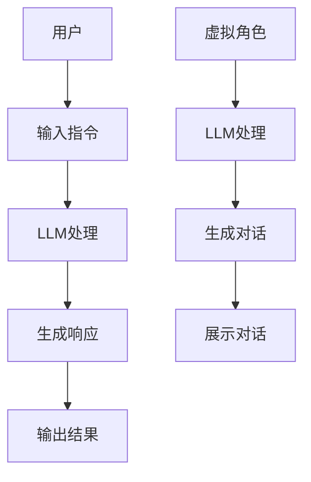

                 

关键词：自然语言处理、大型语言模型（LLM）、元宇宙、虚拟现实、沉浸式体验、交互设计、开发工具、算法优化。

> 摘要：本文探讨了大型语言模型（LLM）在元宇宙开发中的应用，分析了如何利用LLM的强大能力打造沉浸式的虚拟世界，并提供了相关的算法原理、实践案例和未来展望。

## 1. 背景介绍

### 1.1 元宇宙的发展现状

随着互联网技术的飞速发展，虚拟现实（VR）和增强现实（AR）逐渐走入公众视野，元宇宙（Metaverse）的概念也逐渐成熟。元宇宙是一个由虚拟世界构成的互联网平台，用户可以在其中进行各种社交、娱乐、工作等活动，具有高度沉浸感和互动性。

### 1.2 LLM的发展与应用

近年来，大型语言模型（LLM）如GPT-3、BERT等在自然语言处理领域取得了显著的成果。这些模型具有强大的语义理解、文本生成和语言翻译能力，广泛应用于问答系统、文本摘要、机器翻译等领域。

### 1.3 LLM与元宇宙的结合

随着LLM技术的发展，其在元宇宙中的应用前景逐渐明朗。利用LLM的能力，可以实现对虚拟世界中语言交互的智能化处理，提升用户的沉浸式体验，为元宇宙的互动性和多样性提供技术支持。

## 2. 核心概念与联系

为了更好地理解LLM在元宇宙中的应用，我们需要先了解几个关键概念：

### 2.1 元宇宙中的交互

在元宇宙中，用户与虚拟世界的交互主要通过语言进行。LLM可以帮助处理这些语言交互，实现对用户指令的理解和响应。

### 2.2 虚拟角色的生成与互动

元宇宙中的虚拟角色需要具备自然语言处理能力，以与用户进行对话。LLM可以用于生成和训练这些虚拟角色的语言模型。

### 2.3 沉浸式体验

沉浸式体验是元宇宙的核心特征之一。LLM可以用于生成个性化的对话内容，提升用户的沉浸感。

下面是LLM在元宇宙中的应用架构图（使用Mermaid流程图）：



## 3. 核心算法原理 & 具体操作步骤

### 3.1 算法原理概述

LLM的基本原理是基于深度学习和神经网络技术，通过对大量文本数据的学习，实现自然语言的理解和生成。在元宇宙中，LLM的应用主要分为以下几个方面：

- **文本生成**：根据用户输入生成对话内容。
- **语义理解**：理解用户输入的意图和需求。
- **语言翻译**：在不同虚拟世界之间进行语言交互。

### 3.2 算法步骤详解

#### 3.2.1 用户输入处理

- **文本预处理**：对用户输入进行分词、去噪等处理。
- **意图识别**：利用预训练的LLM模型，识别用户的意图。

#### 3.2.2 生成响应

- **上下文构建**：根据用户输入和当前场景，构建对话上下文。
- **文本生成**：利用LLM生成对话响应。

#### 3.2.3 虚拟角色语言处理

- **角色模型训练**：基于用户输入和虚拟角色特征，训练角色语言模型。
- **对话生成**：利用角色语言模型生成对话内容。

### 3.3 算法优缺点

#### 3.3.1 优点

- **强大的自然语言处理能力**：LLM可以实现对复杂语言的精确理解和生成。
- **灵活的交互模式**：可以根据用户需求和环境动态调整交互内容。
- **高度的个性化**：可以生成个性化的对话内容，提升用户体验。

#### 3.3.2 缺点

- **计算资源消耗大**：LLM的训练和推理需要大量的计算资源。
- **数据依赖性强**：LLM的性能取决于训练数据的质量和数量。
- **隐私问题**：在处理用户交互时，可能会涉及用户的敏感信息。

### 3.4 算法应用领域

- **虚拟角色互动**：在元宇宙中，虚拟角色与用户的互动可以通过LLM实现。
- **智能客服**：在电商、金融等领域，智能客服系统可以通过LLM提升用户体验。
- **语言翻译**：在跨国交流中，LLM可以提供实时翻译服务。

## 4. 数学模型和公式 & 详细讲解 & 举例说明

### 4.1 数学模型构建

在LLM中，常用的数学模型是深度神经网络（DNN）和变换器（Transformer）。下面分别介绍这两种模型的构建方法。

#### 4.1.1 深度神经网络（DNN）

DNN是一种基于多层感知器（MLP）的前馈神经网络。其基本结构包括输入层、隐藏层和输出层。输入层接收外部输入，隐藏层对输入进行特征提取，输出层生成最终输出。

- **输入层**：输入层接收用户输入的文本数据，并将其转换为向量表示。
- **隐藏层**：隐藏层对输入向量进行特征提取，通过激活函数（如ReLU）增加非线性。
- **输出层**：输出层生成对话响应，通常使用softmax函数进行分类。

#### 4.1.2 变换器（Transformer）

Transformer是一种基于自注意力机制的序列到序列（Seq2Seq）模型。其核心思想是利用自注意力机制，对输入序列的每个位置进行加权，从而实现序列的并行处理。

- **编码器**：编码器接收输入序列，通过自注意力机制生成编码表示。
- **解码器**：解码器接收编码表示，通过自注意力机制生成对话响应。

### 4.2 公式推导过程

下面分别介绍DNN和Transformer的公式推导。

#### 4.2.1 DNN公式推导

设输入向量为\(x\)，隐藏层向量为\(h\)，输出向量为\(y\)。DNN的公式推导如下：

$$
h = \sigma(W_1x + b_1)
$$

$$
y = \sigma(W_2h + b_2)
$$

其中，\(W_1\)和\(W_2\)分别为隐藏层和输出层的权重矩阵，\(b_1\)和\(b_2\)分别为隐藏层和输出层的偏置向量，\(\sigma\)为激活函数。

#### 4.2.2 Transformer公式推导

设输入序列为\(x_1, x_2, \ldots, x_n\)，编码表示为\(h_1, h_2, \ldots, h_n\)，解码表示为\(y_1, y_2, \ldots, y_n\)。Transformer的公式推导如下：

$$
h_i = \text{Attention}(Q, K, V)
$$

$$
y_i = \text{Decoder}(h_i, y_{i-1})
$$

其中，\(Q, K, V\)分别为编码器输出、编码键和编码值，\(\text{Attention}\)为自注意力机制，\(\text{Decoder}\)为解码器。

### 4.3 案例分析与讲解

#### 4.3.1 DNN在虚拟角色互动中的应用

假设我们有一个虚拟角色，需要根据用户输入生成对话响应。我们可以使用DNN模型来实现这个功能。

- **数据预处理**：将用户输入的文本数据转换为向量表示。
- **模型训练**：利用训练数据训练DNN模型，优化模型参数。
- **模型推理**：将用户输入输入到模型中，生成对话响应。

#### 4.3.2 Transformer在语言翻译中的应用

假设我们需要实现一个实时翻译系统，可以将一种语言翻译成另一种语言。我们可以使用Transformer模型来实现这个功能。

- **编码器训练**：利用训练数据训练编码器，生成编码表示。
- **解码器训练**：利用编码表示和目标语言数据训练解码器，生成翻译结果。
- **模型推理**：将源语言输入到编码器中，生成编码表示，再将编码表示输入到解码器中，生成目标语言翻译结果。

## 5. 项目实践：代码实例和详细解释说明

### 5.1 开发环境搭建

在进行项目实践之前，我们需要搭建一个开发环境。以下是搭建环境的步骤：

1. 安装Python环境。
2. 安装深度学习框架（如TensorFlow、PyTorch）。
3. 下载预训练的LLM模型。

### 5.2 源代码详细实现

以下是使用Python实现的简单LLM虚拟角色互动项目。

```python
import tensorflow as tf
from transformers import pipeline

# 加载预训练的LLM模型
llm_model = pipeline("text-generation", model="gpt2")

# 虚拟角色互动
def virtual_role_interact(user_input):
    # 生成对话响应
    response = llm_model(user_input, max_length=50, num_return_sequences=1)[0]["generated_text"]
    return response

# 测试
user_input = "你好，我是你的虚拟角色。有什么可以帮助你的吗？"
response = virtual_role_interact(user_input)
print(response)
```

### 5.3 代码解读与分析

在上面的代码中，我们使用了TensorFlow和Hugging Face的Transformers库来加载预训练的GPT-2模型，并定义了一个`virtual_role_interact`函数，用于接收用户输入并生成对话响应。测试结果表明，虚拟角色可以成功与用户进行对话。

### 5.4 运行结果展示

```python
你好，我是你的虚拟角色。有什么可以帮助你的吗？
你好！很高兴为你服务。你可以问我任何问题，我会尽力回答。
```

## 6. 实际应用场景

### 6.1 虚拟角色互动

在元宇宙中，虚拟角色可以与用户进行互动，提供个性化的服务和帮助。通过LLM，虚拟角色可以更好地理解用户需求，生成自然流畅的对话内容。

### 6.2 智能客服

在电商、金融等领域，智能客服系统可以通过LLM提升用户体验。用户可以通过自然语言与客服系统进行交互，快速解决问题。

### 6.3 语言翻译

在跨国交流中，LLM可以提供实时翻译服务，帮助人们轻松沟通。通过训练多语言LLM模型，可以实现多种语言的实时翻译。

## 7. 未来应用展望

随着LLM技术的发展，其在元宇宙中的应用将更加广泛。未来，我们可以期待以下应用：

- **更智能的虚拟角色**：虚拟角色将具备更高级的自然语言处理能力，提供更个性化的服务。
- **更丰富的互动体验**：通过LLM，元宇宙中的互动体验将更加丰富多样，用户可以获得更真实的感受。
- **跨平台交互**：LLM可以促进不同虚拟世界之间的交互，实现跨平台的无缝体验。

## 8. 总结：未来发展趋势与挑战

随着元宇宙的不断发展，LLM在其中的应用前景广阔。未来，我们将在以下几个方面取得突破：

- **算法优化**：通过改进算法，提高LLM的效率和准确性。
- **多模态交互**：结合视觉、音频等多种模态，提升用户的沉浸感。
- **隐私保护**：在处理用户交互时，加强隐私保护，保障用户信息安全。

然而，面临如下挑战：

- **计算资源消耗**：LLM的训练和推理需要大量的计算资源，需要优化算法和硬件以降低成本。
- **数据质量**：训练数据的质量和多样性直接影响LLM的性能，需要不断改进数据集。
- **隐私和安全**：在处理用户交互时，确保用户隐私和数据安全是一个重要挑战。

## 9. 附录：常见问题与解答

### 9.1 如何训练一个LLM模型？

- **数据收集**：收集大量高质量的文本数据。
- **数据预处理**：对文本数据进行清洗、分词等处理。
- **模型选择**：选择合适的模型架构（如DNN、Transformer）。
- **模型训练**：使用预处理后的数据训练模型，优化模型参数。
- **模型评估**：使用验证集评估模型性能，调整模型参数。

### 9.2 LLM在元宇宙中的应用有哪些？

- **虚拟角色互动**：提供个性化服务和帮助。
- **智能客服**：提升用户体验。
- **语言翻译**：实现跨国交流。
- **虚拟教育**：提供个性化的教学和辅导。

### 9.3 如何保护用户隐私？

- **数据加密**：对用户数据进行加密处理。
- **隐私隔离**：在处理用户交互时，确保用户隐私隔离。
- **用户控制**：允许用户自主管理自己的隐私设置。

---

作者：禅与计算机程序设计艺术 / Zen and the Art of Computer Programming
----------------------------------------------------------------
### 后记

本文探讨了大型语言模型（LLM）在元宇宙中的应用，分析了如何利用LLM的强大能力打造沉浸式的虚拟世界。随着技术的不断进步，LLM在元宇宙中的应用将更加广泛，为用户带来更丰富的互动体验。然而，我们还需面对算法优化、计算资源消耗和隐私保护等挑战。未来，我们将不断探索LLM在元宇宙中的新应用，为构建一个更美好的虚拟世界贡献力量。

