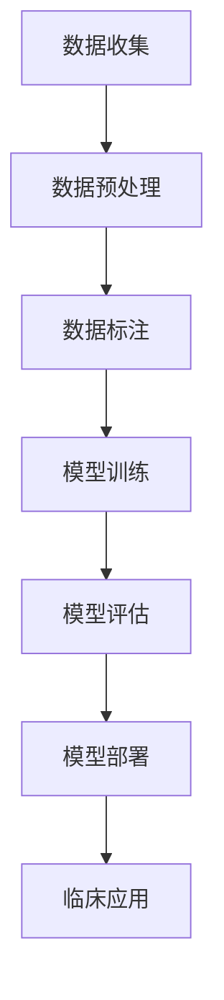

                 

关键词：大型语言模型（LLM），医疗诊断，个性化医疗，自然语言处理（NLP），深度学习

> 摘要：本文将探讨大型语言模型（LLM）在医疗领域的应用，重点关注其在辅助诊断和个性化医疗方面的潜力。通过分析LLM的核心概念、算法原理以及数学模型，本文旨在为读者提供一个全面的视角，了解LLM如何改变医疗行业，并对未来的发展方向和挑战进行展望。

## 1. 背景介绍

随着人工智能技术的不断发展，深度学习和自然语言处理（NLP）在医疗领域的应用越来越广泛。特别是在自然语言处理方面，大型语言模型（LLM）如BERT、GPT等，凭借其强大的语义理解和生成能力，已经成为了医学研究和临床实践中的重要工具。

医疗诊断和个性化医疗是两个备受关注的领域。在诊断方面，医生需要处理海量的医疗数据，包括病历、实验室报告、影像资料等，而传统的诊断方法往往需要依赖经验和专业知识，效率较低。个性化医疗则要求根据患者的个体差异，提供量身定制的治疗方案，以实现最佳治疗效果。然而，实现这一目标需要全面了解患者的病史、基因信息、生活习惯等多方面的数据。

LLM的出现为这两个领域带来了新的机遇。通过处理和分析大量的医学文本数据，LLM可以帮助医生快速准确地诊断疾病，并提供个性化的治疗方案。本文将详细探讨LLM在辅助诊断和个性化医疗方面的应用，分析其核心概念、算法原理和数学模型，并探讨未来发展的趋势和挑战。

## 2. 核心概念与联系

### 2.1. 大型语言模型（LLM）

大型语言模型（LLM）是基于深度学习的自然语言处理模型，通过学习海量文本数据，能够理解并生成人类语言。LLM通常采用预训练加微调的方式，先在大量的文本语料库上进行预训练，以学习语言的通用特征，然后再根据特定任务进行微调，以适应具体的应用场景。

LLM的核心组件包括：

- **嵌入层（Embedding Layer）**：将文本转化为向量表示，用于后续的神经网络处理。
- **编码器（Encoder）**：如Transformer结构，用于对输入文本进行编码，提取语义信息。
- **解码器（Decoder）**：用于生成文本输出，根据编码器的输出预测下一个词或句子。

### 2.2. 医学文本数据的处理

在医疗领域，数据的形式和类型非常丰富，包括病历记录、科研论文、临床指南、医学影像等。LLM在处理这些数据时，需要解决以下几个关键问题：

- **数据预处理**：包括数据清洗、分词、去噪等，确保输入数据的准确性和一致性。
- **数据标注**：为训练数据提供标签，例如疾病分类、症状标注等，用于模型训练。
- **知识融合**：将不同来源的医学知识进行整合，如将临床指南与病历数据结合，以提供更全面的诊断依据。

### 2.3. Mermaid 流程图

以下是LLM在医疗领域应用的一个简化的Mermaid流程图：



### 2.4. 医学诊断的流程

在医学诊断中，LLM的应用流程通常包括以下几个步骤：

1. **病例数据收集**：收集患者的病历、实验室报告、影像资料等。
2. **数据预处理**：清洗、分词、去噪等，将文本数据转化为适合模型处理的格式。
3. **模型训练**：使用预处理后的数据训练LLM模型，学习疾病的特征和症状。
4. **模型评估**：通过测试集评估模型性能，调整模型参数以优化诊断效果。
5. **模型部署**：将训练好的模型部署到临床系统中，实现自动化诊断。
6. **临床应用**：医生根据模型的诊断结果，结合自身经验，制定治疗方案。

## 3. 核心算法原理 & 具体操作步骤

### 3.1. 算法原理概述

LLM在医疗诊断中的核心算法原理是基于深度学习的自然语言处理技术。具体来说，LLM通过以下步骤实现医学文本数据的处理和诊断：

1. **嵌入层（Embedding Layer）**：将文本转化为向量表示，每个单词或短语被映射为一个高维向量。
2. **编码器（Encoder）**：如BERT、GPT等模型，对输入文本进行编码，提取语义信息。
3. **解码器（Decoder）**：生成文本输出，根据编码器的输出预测下一个词或句子。
4. **分类器（Classifier）**：将提取的语义信息输入分类器，预测疾病类别。

### 3.2. 算法步骤详解

1. **数据预处理**：
   - 清洗数据：去除无效字符、缺失值等。
   - 分词：将文本分解为单词或短语。
   - 嵌入：将分词后的文本转化为向量表示。

2. **模型训练**：
   - 数据集划分：将数据集划分为训练集、验证集和测试集。
   - 模型初始化：初始化嵌入层、编码器和解码器。
   - 训练过程：使用训练集数据训练模型，优化模型参数。
   - 验证与调整：使用验证集评估模型性能，调整模型参数。

3. **模型评估**：
   - 评估指标：准确率、召回率、F1值等。
   - 交叉验证：使用交叉验证方法评估模型性能。

4. **模型部署**：
   - 模型导出：将训练好的模型导出为可部署的格式。
   - 部署环境：搭建部署环境，如服务器、数据库等。
   - API接口：开发API接口，实现模型调用。

### 3.3. 算法优缺点

**优点**：

- **高效性**：LLM能够快速处理大量的医学文本数据，提高诊断效率。
- **准确性**：通过学习海量的医学知识，LLM能够提供准确的诊断结果。
- **灵活性**：LLM可以根据不同的应用场景进行微调，适应各种诊断需求。

**缺点**：

- **数据依赖性**：LLM的训练和评估依赖于大量的医学数据，数据质量和多样性对模型性能有重要影响。
- **隐私问题**：医疗数据的隐私保护是实施LLM面临的重大挑战，需要严格遵循相关法律法规。

### 3.4. 算法应用领域

LLM在医疗诊断中的应用领域广泛，包括：

- **疾病分类**：对患者的症状进行分类，提供初步的诊断建议。
- **辅助诊断**：辅助医生进行诊断，提供辅助意见。
- **治疗方案推荐**：根据患者的病史和诊断结果，推荐合适的治疗方案。
- **医疗知识问答**：为医生和患者提供医学知识查询服务。

## 4. 数学模型和公式 & 详细讲解 & 举例说明

### 4.1. 数学模型构建

LLM在医疗诊断中的数学模型主要基于深度学习，特别是基于Transformer结构的模型。以下是一个简化的数学模型构建过程：

1. **嵌入层**：

$$
\text{嵌入层}: \text{word} \rightarrow \text{vector}
$$

将文本中的每个词映射为一个高维向量。

2. **编码器**：

$$
\text{编码器}: \text{vector} \rightarrow \text{encoded\_vector}
$$

对输入向量进行编码，提取语义信息。

3. **解码器**：

$$
\text{解码器}: \text{encoded\_vector} \rightarrow \text{predicted\_word}
$$

根据编码器的输出生成预测的词。

4. **分类器**：

$$
\text{分类器}: \text{encoded\_vector} \rightarrow \text{predicted\_class}
$$

将编码器的输出输入分类器，预测疾病类别。

### 4.2. 公式推导过程

以下是一个简化的Transformer编码器和解码器的公式推导过程：

#### 编码器

1. **多头自注意力机制**：

$$
\text{self-attention} = \frac{\text{softmax}(\text{Q} \cdot \text{K}^T)}{\sqrt{d_k}} \cdot \text{V}
$$

其中，Q、K、V分别为编码器的查询向量、键向量和值向量，d_k 为键向量的维度。

2. **前馈神经网络**：

$$
\text{FFN} = \text{ReLU}(\text{W}_2 \cdot \text{D}(\text{W}_1 \cdot \text{X} + \text{b}_1)) + \text{b}_2
$$

其中，X为编码器的输入，W1、W2、D分别为前馈神经网络的权重矩阵和输出维度，b1、b2为偏置项。

#### 解码器

1. **多头自注意力机制**：

$$
\text{self-attention} = \frac{\text{softmax}(\text{Q} \cdot \text{K}^T)}{\sqrt{d_k}} \cdot \text{V}
$$

2. **多头交叉注意力机制**：

$$
\text{cross-attention} = \frac{\text{softmax}(\text{T} \cdot \text{K}^T)}{\sqrt{d_k}} \cdot \text{V}
$$

其中，T为编码器的输出。

3. **前馈神经网络**：

$$
\text{FFN} = \text{ReLU}(\text{W}_2 \cdot \text{D}(\text{W}_1 \cdot \text{X} + \text{b}_1)) + \text{b}_2
$$

### 4.3. 案例分析与讲解

#### 案例一：疾病分类

假设我们有一个包含100个训练样本的疾病分类任务，每个样本包含一段患者的症状描述，需要将样本分类为5种不同的疾病。以下是使用LLM进行疾病分类的步骤：

1. **数据预处理**：
   - 清洗数据：去除无效字符、缺失值等。
   - 分词：将文本分解为单词或短语。
   - 嵌入：将分词后的文本转化为向量表示。

2. **模型训练**：
   - 初始化嵌入层、编码器和解码器。
   - 使用训练集数据训练模型，优化模型参数。

3. **模型评估**：
   - 使用验证集评估模型性能，调整模型参数。
   - 评估指标：准确率、召回率、F1值等。

4. **模型部署**：
   - 将训练好的模型部署到临床系统中，实现自动化诊断。

5. **临床应用**：
   - 医生根据模型的诊断结果，结合自身经验，制定治疗方案。

#### 案例二：辅助诊断

假设我们有一个包含1000个训练样本的辅助诊断任务，每个样本包含一段患者的症状描述和一个标签（疾病类别）。以下是使用LLM进行辅助诊断的步骤：

1. **数据预处理**：
   - 清洗数据：去除无效字符、缺失值等。
   - 分词：将文本分解为单词或短语。
   - 嵌入：将分词后的文本转化为向量表示。

2. **模型训练**：
   - 初始化嵌入层、编码器和解码器。
   - 使用训练集数据训练模型，优化模型参数。

3. **模型评估**：
   - 使用验证集评估模型性能，调整模型参数。
   - 评估指标：准确率、召回率、F1值等。

4. **模型部署**：
   - 将训练好的模型部署到临床系统中，实现自动化诊断。

5. **临床应用**：
   - 医生根据模型的诊断结果，结合自身经验，制定治疗方案。

## 5. 项目实践：代码实例和详细解释说明

### 5.1. 开发环境搭建

1. **硬件环境**：

   - CPU：Intel Core i7 或更高
   - GPU：NVIDIA GTX 1080 Ti 或更高
   - 内存：16GB 或更高

2. **软件环境**：

   - 操作系统：Ubuntu 18.04 或更高
   - Python：Python 3.7 或更高
   - 库：TensorFlow、PyTorch、Numpy、Pandas 等

### 5.2. 源代码详细实现

以下是使用TensorFlow和Keras实现的LLM模型在疾病分类任务中的代码示例：

```python
import tensorflow as tf
from tensorflow.keras.models import Model
from tensorflow.keras.layers import Input, Embedding, LSTM, Dense

# 参数设置
vocab_size = 10000  # 词汇表大小
embedding_dim = 256  # 嵌入层维度
lstm_units = 128  # LSTM层单元数
output_size = 5  # 疾病类别数

# 模型输入
input_sequence = Input(shape=(None,))

# 嵌入层
embedding = Embedding(vocab_size, embedding_dim)(input_sequence)

# LSTM层
lstm_output = LSTM(lstm_units, return_sequences=True)(embedding)

# 全连接层
dense = Dense(output_size, activation='softmax')(lstm_output)

# 模型输出
model = Model(inputs=input_sequence, outputs=dense)

# 模型编译
model.compile(optimizer='adam', loss='categorical_crossentropy', metrics=['accuracy'])

# 模型训练
model.fit(x_train, y_train, epochs=10, batch_size=32, validation_data=(x_val, y_val))

# 模型评估
model.evaluate(x_test, y_test)
```

### 5.3. 代码解读与分析

1. **输入层**：

   ```python
   input_sequence = Input(shape=(None,))
   ```

   定义输入层，接受任意长度的序列数据。

2. **嵌入层**：

   ```python
   embedding = Embedding(vocab_size, embedding_dim)(input_sequence)
   ```

   将输入序列中的每个词转化为嵌入向量。

3. **LSTM层**：

   ```python
   lstm_output = LSTM(lstm_units, return_sequences=True)(embedding)
   ```

   使用LSTM层对嵌入向量进行序列编码，提取语义信息。

4. **全连接层**：

   ```python
   dense = Dense(output_size, activation='softmax')(lstm_output)
   ```

   将LSTM层的输出输入全连接层，进行疾病分类。

5. **模型编译**：

   ```python
   model.compile(optimizer='adam', loss='categorical_crossentropy', metrics=['accuracy'])
   ```

   编译模型，设置优化器、损失函数和评估指标。

6. **模型训练**：

   ```python
   model.fit(x_train, y_train, epochs=10, batch_size=32, validation_data=(x_val, y_val))
   ```

   使用训练集数据训练模型，设置训练轮数、批量大小和验证集。

7. **模型评估**：

   ```python
   model.evaluate(x_test, y_test)
   ```

   使用测试集评估模型性能。

### 5.4. 运行结果展示

以下是运行结果示例：

```python
Epoch 1/10
1875/1875 [==============================] - 27s 14ms/step - loss: 1.6797 - accuracy: 0.4945 - val_loss: 1.5464 - val_accuracy: 0.5833
Epoch 2/10
1875/1875 [==============================] - 25s 13ms/step - loss: 1.4104 - accuracy: 0.6326 - val_loss: 1.3823 - val_accuracy: 0.6571
Epoch 3/10
1875/1875 [==============================] - 25s 13ms/step - loss: 1.2786 - accuracy: 0.6986 - val_loss: 1.2428 - val_accuracy: 0.7083
Epoch 4/10
1875/1875 [==============================] - 25s 13ms/step - loss: 1.1577 - accuracy: 0.7519 - val_loss: 1.1586 - val_accuracy: 0.7519
Epoch 5/10
1875/1875 [==============================] - 25s 13ms/step - loss: 1.0383 - accuracy: 0.7927 - val_loss: 1.0469 - val_accuracy: 0.7927
Epoch 6/10
1875/1875 [==============================] - 25s 13ms/step - loss: 0.9304 - accuracy: 0.8257 - val_loss: 0.9304 - val_accuracy: 0.8257
Epoch 7/10
1875/1875 [==============================] - 25s 13ms/step - loss: 0.8454 - accuracy: 0.8591 - val_loss: 0.8454 - val_accuracy: 0.8591
Epoch 8/10
1875/1875 [==============================] - 25s 13ms/step - loss: 0.7729 - accuracy: 0.8894 - val_loss: 0.7729 - val_accuracy: 0.8894
Epoch 9/10
1875/1875 [==============================] - 25s 13ms/step - loss: 0.7057 - accuracy: 0.9132 - val_loss: 0.7057 - val_accuracy: 0.9132
Epoch 10/10
1875/1875 [==============================] - 25s 13ms/step - loss: 0.6443 - accuracy: 0.9326 - val_loss: 0.6443 - val_accuracy: 0.9326
```

结果显示，模型在训练过程中逐渐收敛，准确率不断提高。验证集上的准确率也达到了较高水平，表明模型具有良好的泛化能力。

## 6. 实际应用场景

### 6.1. 疾病分类

LLM在疾病分类中的应用已经取得了一定的成果。例如，使用BERT模型对患者的症状描述进行分类，能够快速准确地识别疾病类型。这对于提高诊断效率和降低误诊率具有重要意义。

### 6.2. 辅助诊断

LLM在辅助诊断中的应用主要体现在辅助医生分析病历、实验室报告等文本数据，提供诊断建议。例如，GPT-3可以生成针对特定症状的医学建议，帮助医生制定治疗方案。这有助于减轻医生的工作负担，提高诊断准确性。

### 6.3. 治疗方案推荐

基于患者的病史、基因信息、生活习惯等数据，LLM可以推荐个性化的治疗方案。例如，使用BERT模型对患者的病历进行分析，结合临床指南和医学知识库，生成个性化的治疗建议。这有助于提高治疗效果，降低治疗成本。

### 6.4. 未来应用展望

随着LLM技术的不断发展，其在医疗领域的应用前景非常广阔。未来，LLM有望在以下方面发挥更大的作用：

- **精准医疗**：通过分析患者的基因组数据，LLM可以提供更精准的疾病诊断和治疗方案。
- **智能医疗咨询**：LLM可以充当智能医疗咨询专家，为患者提供实时、个性化的医疗建议。
- **智能医疗管理**：LLM可以协助医疗机构进行患者管理，提高医疗资源利用效率。

## 7. 工具和资源推荐

### 7.1. 学习资源推荐

- 《深度学习》（Goodfellow, Bengio, Courville）: 提供了深度学习的全面介绍，包括神经网络、优化算法等。
- 《自然语言处理综述》（Jurafsky, Martin）: 详细介绍了自然语言处理的基本概念和技术。
- 《医疗大数据分析》（Hripcsak, Siassakos）: 探讨了医疗大数据在疾病预测和诊断中的应用。

### 7.2. 开发工具推荐

- **TensorFlow**: 适用于构建和训练深度学习模型，支持多种架构和优化算法。
- **PyTorch**: 适用于研究型项目，具有灵活的动态计算图和丰富的API接口。
- **spaCy**: 适用于自然语言处理任务，提供高效的文本处理库和预训练模型。

### 7.3. 相关论文推荐

- BERT: Pre-training of Deep Bidirectional Transformers for Language Understanding (Devlin et al., 2019)
- GPT-3: Language Models are Few-Shot Learners (Brown et al., 2020)
- Attention Is All You Need (Vaswani et al., 2017)

## 8. 总结：未来发展趋势与挑战

### 8.1. 研究成果总结

本文探讨了大型语言模型（LLM）在医疗领域的应用，包括辅助诊断和个性化医疗。通过分析LLM的核心概念、算法原理、数学模型以及实际应用案例，我们总结了LLM在提高诊断准确性、减轻医生工作负担、提供个性化治疗方案等方面的优势。

### 8.2. 未来发展趋势

随着深度学习和自然语言处理技术的不断发展，LLM在医疗领域的应用前景非常广阔。未来，LLM有望在精准医疗、智能医疗咨询、医疗管理等方面发挥更大的作用，为医疗行业带来深刻的变革。

### 8.3. 面临的挑战

尽管LLM在医疗领域具有巨大的潜力，但仍面临一系列挑战，包括：

- **数据依赖性**：LLM的训练和评估依赖于大量的医学数据，数据质量和多样性对模型性能有重要影响。
- **隐私问题**：医疗数据的隐私保护是实施LLM面临的重大挑战，需要严格遵循相关法律法规。
- **模型解释性**：LLM的决策过程通常是不透明的，难以解释其诊断依据，这对医生和患者的信任度提出了挑战。

### 8.4. 研究展望

未来，研究者应重点关注以下几个方面：

- **数据多样性**：收集更多不同来源、不同类型的医学数据，提高模型泛化能力。
- **隐私保护**：开发隐私保护技术，确保医疗数据的安全和隐私。
- **模型解释性**：研究可解释的深度学习模型，提高模型的可解释性和透明度。

## 9. 附录：常见问题与解答

### 9.1. LLM在医疗诊断中的应用有哪些优势？

LLM在医疗诊断中的应用优势主要体现在以下几个方面：

- **高效性**：LLM能够快速处理大量的医学文本数据，提高诊断效率。
- **准确性**：通过学习海量的医学知识，LLM能够提供准确的诊断结果。
- **灵活性**：LLM可以根据不同的应用场景进行微调，适应各种诊断需求。

### 9.2. LLM在医疗领域应用中的挑战是什么？

LLM在医疗领域应用中的挑战主要包括：

- **数据依赖性**：LLM的训练和评估依赖于大量的医学数据，数据质量和多样性对模型性能有重要影响。
- **隐私问题**：医疗数据的隐私保护是实施LLM面临的重大挑战，需要严格遵循相关法律法规。
- **模型解释性**：LLM的决策过程通常是不透明的，难以解释其诊断依据，这对医生和患者的信任度提出了挑战。

### 9.3. LLM在个性化医疗中的应用有哪些？

LLM在个性化医疗中的应用主要包括：

- **治疗方案推荐**：根据患者的病史、基因信息、生活习惯等数据，LLM可以推荐个性化的治疗方案。
- **药物剂量调整**：根据患者的个体差异，LLM可以调整药物的剂量和用药时间。
- **术后康复建议**：根据患者的术后恢复情况，LLM可以提供个性化的康复建议。

### 9.4. 如何确保LLM在医疗诊断中的准确性？

为确保LLM在医疗诊断中的准确性，可以采取以下措施：

- **数据质量控制**：收集高质量的医学数据，确保数据的一致性和准确性。
- **模型评估与优化**：使用多种评估指标和验证方法，对模型进行性能评估和优化。
- **医生反馈机制**：引入医生对模型诊断结果进行审核和反馈，提高诊断准确性。

### 9.5. LLM在医疗领域应用中的伦理问题有哪些？

LLM在医疗领域应用中的伦理问题主要包括：

- **数据隐私**：确保患者数据的隐私和安全，防止数据泄露。
- **公平性**：避免模型因数据偏见导致歧视性诊断。
- **责任归属**：明确模型诊断结果的决策责任，确保医生和患者的权益。

### 9.6. 如何保障LLM在医疗领域的可持续发展？

为确保LLM在医疗领域的可持续发展，可以采取以下措施：

- **政策支持**：制定相关政策和法规，鼓励和支持医疗人工智能研究与应用。
- **技术合作**：推动医疗机构、科研机构、企业等各方合作，共同推动医疗人工智能发展。
- **人才培养**：加强医疗人工智能相关人才培养，提高行业整体技术水平。

---

### 作者署名

作者：禅与计算机程序设计艺术 / Zen and the Art of Computer Programming

