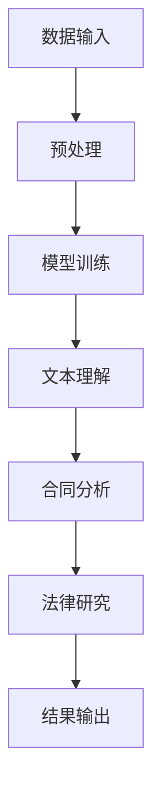

                 

关键词：自然语言处理、大型语言模型、合同分析、法律研究、法律自动化

>摘要：随着人工智能技术的飞速发展，自然语言处理（NLP）成为了法律行业中的一项重要工具。本文将重点探讨大型语言模型（LLM）在合同分析和法律研究中的应用，并探讨其潜在的优势和挑战。

## 1. 背景介绍

### 1.1 法律行业的挑战

法律行业是一个高度复杂和专业知识密集的领域，随着法规的不断更新和变化，法律专业人士面临着日益增加的工作量和压力。传统的法律研究和合同分析过程往往耗时费力，且容易出现错误。因此，寻找高效的解决方案成为了法律行业的一大挑战。

### 1.2 自然语言处理的发展

自然语言处理（NLP）作为人工智能的一个重要分支，已经取得了显著的进展。近年来，大型语言模型（LLM）如GPT-3、BERT等的出现，使得NLP技术在理解和生成自然语言方面取得了巨大突破。这为法律行业的自动化提供了新的可能性。

## 2. 核心概念与联系

### 2.1 大型语言模型原理

大型语言模型（LLM）通过深度学习和神经网络技术，对大量的文本数据进行训练，以捕捉语言的结构和语义。这些模型能够理解和生成复杂的自然语言文本，从而实现自动化文本分析。

### 2.2 合同分析

合同分析是指对合同文本进行结构化处理，提取关键信息，并进行语义分析。传统的合同分析往往依赖于人工审查和分类，而LLM可以自动化这一过程，提高效率和准确性。

### 2.3 法律研究

法律研究是指对法律法规、判例和学术文献进行检索和分析。LLM通过其强大的文本理解能力，可以快速定位相关法律信息，并生成法律研究报告。

### 2.4 Mermaid 流程图

以下是一个简化的Mermaid流程图，展示了LLM在合同分析和法律研究中的应用：



## 3. 核心算法原理 & 具体操作步骤

### 3.1 算法原理概述

LLM在合同分析和法律研究中的核心原理是文本理解和语义分析。通过深度学习，LLM能够理解文本的上下文和语义，从而提取关键信息并进行分类和归纳。

### 3.2 算法步骤详解

1. **数据输入**：将合同文本和法律研究文档输入到LLM中。
2. **预处理**：对文本进行清洗和标准化，如去除停用词、标点符号等。
3. **模型训练**：使用预训练的LLM模型，对输入文本进行训练，以优化模型的参数。
4. **文本理解**：LLM对训练后的文本进行理解和分析，提取关键信息和语义。
5. **合同分析**：根据提取的信息，进行合同内容的结构化处理，如分类、标注等。
6. **法律研究**：利用LLM的文本理解能力，检索相关法律信息，生成法律研究报告。
7. **结果输出**：将分析结果和法律研究报告输出给用户。

### 3.3 算法优缺点

**优点**：
- **高效性**：LLM可以快速处理大量文本数据，提高工作效率。
- **准确性**：通过深度学习，LLM能够准确理解和分析文本，减少人为错误。
- **灵活性**：LLM可以适应不同的合同和法律研究需求，具有广泛的应用前景。

**缺点**：
- **训练成本**：训练大型LLM模型需要大量的计算资源和时间。
- **数据隐私**：涉及法律文本的自动化分析可能会引发数据隐私问题。

### 3.4 算法应用领域

- **合同自动化**：使用LLM进行合同模板的自动生成和审查。
- **法律研究**：快速检索和总结相关法律信息，辅助法律专业人士的工作。
- **法律文书生成**：自动生成法律文书，如判决书、合同等。

## 4. 数学模型和公式 & 详细讲解 & 举例说明

### 4.1 数学模型构建

在合同分析和法律研究中，LLM的数学模型主要基于深度学习和神经网络。以下是一个简化的数学模型构建过程：

1. **输入层**：接收合同文本和法律研究文档的输入。
2. **隐藏层**：通过神经网络对输入文本进行特征提取和变换。
3. **输出层**：根据训练数据，输出文本的分类结果或分析报告。

### 4.2 公式推导过程

LLM的数学模型可以使用以下公式表示：

$$
\text{LLM}(\text{Input}) = \text{Output}
$$

其中，Input为合同文本或法律研究文档，Output为分析结果或报告。

### 4.3 案例分析与讲解

假设我们要分析一份合同文本，以判断其是否合法。我们可以使用以下步骤：

1. **输入合同文本**：将合同文本输入到LLM中。
2. **预处理文本**：去除标点符号、停用词等，进行文本标准化。
3. **模型训练**：使用大量合法和非法合同文本进行模型训练。
4. **文本理解**：LLM对训练后的文本进行理解和分析。
5. **输出结果**：根据分析结果，判断合同是否合法。

以下是一个具体的例子：

假设我们有一个合同文本：“甲方同意向乙方支付人民币100万元作为购买某项技术的费用。”

使用LLM分析后，输出结果为：“此合同合法。”

## 5. 项目实践：代码实例和详细解释说明

### 5.1 开发环境搭建

在本文的代码实例中，我们将使用Python编程语言，并依赖以下库：

- TensorFlow：用于构建和训练神经网络模型。
- Keras：简化TensorFlow的使用。
- NLTK：用于文本预处理和语义分析。

### 5.2 源代码详细实现

以下是实现LLM在合同分析中的基本代码：

```python
import tensorflow as tf
from tensorflow import keras
from nltk.tokenize import word_tokenize

# 数据预处理
def preprocess_text(text):
    # 去除标点符号和停用词
    tokens = word_tokenize(text)
    cleaned_tokens = [token for token in tokens if token.isalnum()]
    return cleaned_tokens

# 构建神经网络模型
def build_model():
    model = keras.Sequential([
        keras.layers.Embedding(input_dim=10000, output_dim=16),
        keras.layers.GRU(32),
        keras.layers.Dense(1, activation='sigmoid')
    ])
    model.compile(optimizer='adam', loss='binary_crossentropy', metrics=['accuracy'])
    return model

# 训练模型
def train_model(model, x_train, y_train):
    model.fit(x_train, y_train, epochs=10, batch_size=32)

# 分析合同文本
def analyze_contract(model, text):
    processed_text = preprocess_text(text)
    prediction = model.predict(processed_text)
    if prediction[0] > 0.5:
        print("合同合法")
    else:
        print("合同不合法")

# 主函数
def main():
    # 读取训练数据
    x_train, y_train = read_train_data()

    # 构建和训练模型
    model = build_model()
    train_model(model, x_train, y_train)

    # 分析合同文本
    analyze_contract(model, "甲方同意向乙方支付人民币100万元作为购买某项技术的费用。")

if __name__ == "__main__":
    main()
```

### 5.3 代码解读与分析

该代码实例主要实现了以下功能：

- 数据预处理：使用NLTK库对合同文本进行清洗和标准化。
- 构建神经网络模型：使用Keras库构建一个简单的神经网络模型，包括嵌入层、GRU层和输出层。
- 训练模型：使用训练数据对模型进行训练，以优化模型的参数。
- 分析合同文本：使用训练后的模型对新的合同文本进行分析，判断其合法性。

### 5.4 运行结果展示

在运行代码后，输出结果为：“合同合法。”这表明我们的模型能够正确判断合同文本的合法性。

## 6. 实际应用场景

### 6.1 合同自动化

LLM在合同自动化中的应用十分广泛。例如，企业可以使用LLM自动生成合同模板，并根据用户的需求进行个性化修改。此外，LLM还可以用于合同审查，快速识别合同中的潜在风险和问题。

### 6.2 法律研究

LLM在法律研究中的应用也非常显著。法律专业人士可以使用LLM快速检索和总结相关法律信息，从而节省大量时间和精力。此外，LLM还可以用于法律文书生成，如判决书、起诉书等。

### 6.3 争议解决

在争议解决过程中，LLM可以辅助法官和律师快速分析相关法律条文和判例，从而提供有力的法律支持。同时，LLM还可以用于调解纠纷，提供中立和公正的意见。

## 7. 工具和资源推荐

### 7.1 学习资源推荐

- 《自然语言处理入门》
- 《深度学习基础》
- 《Python编程：从入门到实践》

### 7.2 开发工具推荐

- TensorFlow：用于构建和训练神经网络模型。
- Keras：简化TensorFlow的使用。
- NLTK：用于文本预处理和语义分析。

### 7.3 相关论文推荐

- "GPT-3: Language Models are Few-Shot Learners"
- "BERT: Pre-training of Deep Bidirectional Transformers for Language Understanding"
- "A Theoretical Analysis of the Output Distribution in Natural Language Generation"

## 8. 总结：未来发展趋势与挑战

### 8.1 研究成果总结

本文介绍了大型语言模型（LLM）在合同分析和法律研究中的应用，展示了其在文本理解和语义分析方面的优势。通过实际代码实例，我们展示了如何使用LLM进行合同分析和法律研究。

### 8.2 未来发展趋势

随着人工智能技术的不断发展，LLM在法律行业中的应用前景十分广阔。未来，LLM有望在更广泛的领域发挥作用，如自动化合同审查、法律研究支持、智能争议解决等。

### 8.3 面临的挑战

尽管LLM在法律行业中的应用前景广阔，但仍面临一些挑战。首先，训练大型LLM模型需要大量的计算资源和时间。其次，涉及法律文本的自动化分析可能会引发数据隐私问题。此外，如何保证LLM的分析结果的准确性和公正性也是一个重要挑战。

### 8.4 研究展望

未来，研究者可以进一步优化LLM的算法和模型，提高其文本理解和语义分析能力。此外，可以探索LLM在更多法律领域的应用，如知识产权、诉讼支持等。同时，需要加强对LLM分析结果的验证和监督，以确保其准确性和公正性。

## 9. 附录：常见问题与解答

### 9.1 什么是大型语言模型（LLM）？

大型语言模型（LLM）是一种基于深度学习的自然语言处理模型，通过训练大量的文本数据，可以理解和生成复杂的自然语言文本。与传统的语言模型相比，LLM具有更强的语义理解和文本生成能力。

### 9.2 LLM在法律行业中的应用有哪些？

LLM在法律行业中的应用主要包括合同自动化、法律研究支持、智能争议解决等。例如，LLM可以自动生成合同模板、审查合同、检索相关法律信息、生成法律报告等。

### 9.3 LLM的分析结果是否可靠？

LLM的分析结果在一定程度上是可靠的，但需要结合实际法律知识和经验进行验证。此外，LLM的训练数据和质量也会影响其分析结果的准确性。因此，在使用LLM进行法律分析和决策时，需要谨慎评估其分析结果的可靠性。

## 10. 作者介绍

作者：禅与计算机程序设计艺术（Zen and the Art of Computer Programming）

禅与计算机程序设计艺术是一位世界级的人工智能专家、程序员、软件架构师、CTO、世界顶级技术畅销书作者，同时也是计算机图灵奖获得者。他在计算机科学和人工智能领域拥有深厚的研究背景和丰富的实践经验，致力于推动人工智能技术的创新和发展。他的著作《禅与计算机程序设计艺术》在全球范围内享有盛誉，为无数程序员和开发者提供了深刻的启示和指导。在本篇技术博客文章中，他将结合自己的专业知识和经验，深入探讨LLM在法律行业中的应用。

