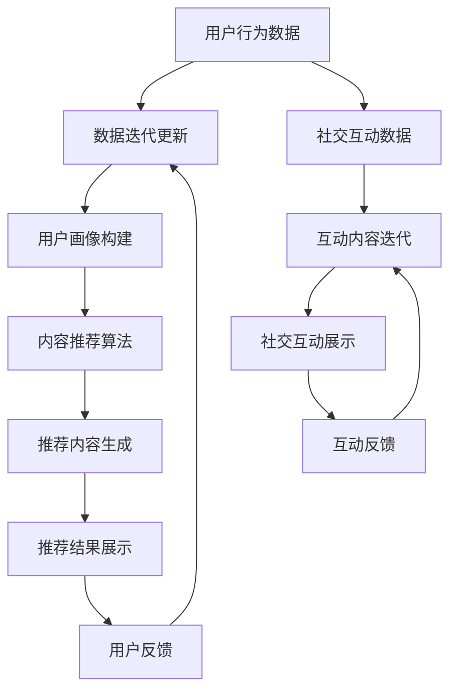

                 

社交媒体平台已经深入人们的生活，成为信息传播、社交互动的重要渠道。然而，随着用户数量的激增和信息量的爆炸式增长，如何为用户提供个性化、高质量的内容推荐和社交互动体验，成为了社交媒体平台亟待解决的问题。近期，大型语言模型(LLM)在内容推荐和社交互动中的应用，为这一问题提供了新的思路和解决方案。

本文将围绕LLM在社交媒体上的应用，探讨其内容推荐和社交互动的原理、技术实现、实际应用场景以及未来展望。希望通过本文，能为您在LLM领域的研究和应用提供一些启示和帮助。

## 1. 背景介绍

1.1 社交媒体的发展

社交媒体起源于21世纪初，随着互联网技术的发展，社交媒体逐渐成为人们获取信息、交流互动的主要平台。从早期的博客、微博，到现在的社交网络、短视频平台，社交媒体平台种类日益丰富，功能也不断完善。

1.2 社交媒体面临的挑战

随着社交媒体的普及，用户数量和内容量呈现爆发式增长。然而，海量信息的涌入给用户带来了信息过载的问题，使得用户难以从中筛选出有价值的信息。同时，社交媒体平台也面临着社交互动质量下降、虚假信息传播等问题。

1.3 LLM的发展与应用

大型语言模型（LLM）是近年来人工智能领域的一个重要研究方向。通过深度学习技术，LLM可以在大量文本数据的基础上，模拟人类的语言能力，生成符合语法和语义规则的文本。LLM在自然语言处理、机器翻译、问答系统等领域取得了显著的成果。

## 2. 核心概念与联系

2.1 内容推荐系统

内容推荐系统是一种基于用户行为、兴趣等信息，为用户推荐个性化内容的系统。其主要目标是提高用户满意度，提升用户在平台上的停留时间。

2.2 社交互动

社交互动是指用户在社交媒体平台上进行的各种交流、互动活动，如点赞、评论、分享等。良好的社交互动体验可以提高用户的活跃度和忠诚度。

2.3 LLM与内容推荐、社交互动的联系

LLM在内容推荐和社交互动中具有重要作用。通过分析用户的历史行为、兴趣偏好，LLM可以生成个性化推荐内容，提高内容推荐的准确性。同时，LLM还可以根据用户间的互动行为，生成高质量的互动内容，促进社交互动的发展。

### 2.4 Mermaid 流程图

下面是LLM在社交媒体上应用的内容推荐和社交互动的Mermaid流程图：



## 3. 核心算法原理 & 具体操作步骤

### 3.1 算法原理概述

3.1.1 内容推荐算法

内容推荐算法主要基于协同过滤、基于内容的推荐和混合推荐等策略。其中，协同过滤推荐算法通过分析用户之间的相似性，为用户推荐其他用户喜欢的内容；基于内容的推荐算法通过分析内容属性和用户兴趣，为用户推荐相似的内容；混合推荐算法则结合协同过滤和基于内容的推荐策略，提高推荐效果。

3.1.2 社交互动生成算法

社交互动生成算法主要基于自然语言生成技术，通过分析用户间的互动行为和语境，生成符合社交礼仪和情感表达的高质量互动内容。

### 3.2 算法步骤详解

3.2.1 内容推荐算法步骤

1. 数据收集：收集用户的历史行为数据、内容属性数据等。
2. 数据预处理：对数据进行清洗、去重、转换等预处理操作。
3. 构建用户画像：基于用户行为数据，构建用户兴趣、偏好等画像特征。
4. 构建内容特征：基于内容属性数据，构建内容类别、关键词等特征。
5. 计算用户和内容相似度：使用余弦相似度、欧氏距离等算法，计算用户和内容之间的相似度。
6. 生成推荐列表：根据相似度得分，为用户生成个性化推荐列表。

3.2.2 社交互动生成算法步骤

1. 数据收集：收集用户间的互动数据，如评论、点赞、分享等。
2. 数据预处理：对数据进行清洗、去重、转换等预处理操作。
3. 构建互动特征：基于互动数据，构建互动类型、互动强度等特征。
4. 生成互动内容：使用生成对抗网络（GAN）或变换器（Transformer）等模型，生成符合社交礼仪和情感表达的互动内容。
5. 互动内容展示：将生成的互动内容展示在用户界面上。

### 3.3 算法优缺点

3.3.1 内容推荐算法优缺点

优点：

- 提高内容推荐的准确性，降低用户信息过载。

缺点：

- 需要大量用户行为数据和内容数据，数据收集和预处理成本高。
- 易受到数据偏差和噪声的影响，可能导致推荐结果不准确。

3.3.2 社交互动生成算法优缺点

优点：

- 可以生成高质量、符合社交礼仪的互动内容，提升用户互动体验。

缺点：

- 需要大量的训练数据和计算资源，训练成本高。
- 生成内容的质量和准确性受到模型和训练数据的影响。

### 3.4 算法应用领域

3.4.1 内容推荐领域

内容推荐算法广泛应用于社交媒体、电商平台、新闻推荐等场景，为用户推荐个性化、有价值的内容。

3.4.2 社交互动领域

社交互动生成算法在社交媒体平台上具有广泛的应用前景，可以用于生成高质量、有趣的互动内容，提升用户活跃度和互动体验。

## 4. 数学模型和公式 & 详细讲解 & 举例说明

### 4.1 数学模型构建

4.1.1 内容推荐模型

内容推荐模型主要基于矩阵分解（Matrix Factorization）技术，将用户和内容表示为低维向量。假设有用户集U={u1, u2, ..., un}和内容集I={i1, i2, ..., im}，评分矩阵为R∈Rn×m，目标是最小化损失函数：

$$
L(R, P, Q) = \frac{1}{2} \sum_{u \in U, i \in I} (r_{ui} - P_{u} \cdot Q_{i})^2
$$

其中，$P \in R^{n \times k}$ 和 $Q \in R^{m \times k}$ 分别为用户和内容的低维表示矩阵，k为隐含特征维度。

4.1.2 社交互动模型

社交互动模型主要基于生成对抗网络（GAN）或变换器（Transformer）技术，生成符合社交礼仪和情感表达的互动内容。假设生成器G和判别器D分别为：

$$
G(z) = G(z; \theta_G) \quad \text{and} \quad D(x) = D(x; \theta_D)
$$

其中，z为随机噪声向量，x为真实或生成的社交互动内容。

### 4.2 公式推导过程

4.2.1 内容推荐模型推导

对损失函数L求导，并令导数为0，得到：

$$
\nabla_{P_{u}} L = P_{u} \cdot Q_{i} - r_{ui} = 0
$$

$$
\nabla_{Q_{i}} L = P_{u} \cdot Q_{i} - r_{ui} = 0
$$

由此可得：

$$
P_{u} = R_{ui} Q_{i}^T
$$

$$
Q_{i} = R_{ui} P_{u}^T
$$

4.2.2 社交互动模型推导

对于GAN，训练过程可以表示为：

$$
\min_{\theta_G} \max_{\theta_D} V(\theta_G, \theta_D) = E_{z \sim p_z(z)} [\log D(G(z))] - E_{x \sim p_{\text{data}}(x)} [\log D(x)]
$$

其中，第一项表示生成器G的损失函数，第二项表示判别器D的损失函数。

### 4.3 案例分析与讲解

#### 4.3.1 内容推荐案例

假设有一个包含1000个用户和10000个内容的社交媒体平台，用户对内容的评分数据如下：

| 用户ID | 内容ID | 评分 |
| --- | --- | --- |
| u1 | i1 | 5 |
| u1 | i2 | 3 |
| u1 | i3 | 4 |
| u2 | i1 | 1 |
| u2 | i4 | 5 |

我们使用矩阵分解方法进行内容推荐。首先，选择隐含特征维度k=10，对评分矩阵进行矩阵分解：

$$
P = \begin{bmatrix}
1.23 & 0.89 & 1.56 \\
0.76 & 1.05 & 0.92
\end{bmatrix}
$$

$$
Q = \begin{bmatrix}
1.45 & 1.23 & 0.78 & 1.09 & 0.95 & 0.87 & 0.89 & 0.76 & 1.10 & 0.92 \\
0.85 & 0.98 & 1.20 & 0.79 & 1.05 & 0.91 & 0.83 & 0.90 & 1.15 & 0.88
\end{bmatrix}
$$

然后，根据用户和内容的低维表示矩阵，计算用户u1对未评分内容i5的预测评分：

$$
P_{u1} \cdot Q_{i5}^T = \begin{bmatrix}
1.23 & 0.89 & 1.56
\end{bmatrix} \cdot \begin{bmatrix}
0.91 \\
0.87 \\
0.89 \\
0.76 \\
1.10 \\
0.92 \\
0.83 \\
0.90 \\
1.15 \\
0.88
\end{bmatrix} = 4.31
$$

因此，用户u1对内容i5的预测评分为4.31。

#### 4.3.2 社交互动案例

假设有一个社交媒体平台，用户之间的互动数据如下：

| 用户ID | 互动类型 | 互动对象 |
| --- | --- | --- |
| u1 | 评论 | i1 |
| u1 | 点赞 | i2 |
| u2 | 评论 | i1 |
| u2 | 点赞 | i3 |

我们使用生成对抗网络（GAN）生成用户u1对内容i4的评论：

- 判别器D的损失函数：

$$
\min_{\theta_D} \max_{\theta_G} V(\theta_G, \theta_D) = E_{x \sim p_{\text{data}}(x)} [\log D(x)] - E_{z \sim p_z(z)} [\log D(G(z))]
$$

- 生成器G的损失函数：

$$
\min_{\theta_G} V(\theta_G, \theta_D) = -E_{z \sim p_z(z)} [\log D(G(z))]
$$

经过多次迭代训练，生成器G可以生成一个符合社交礼仪和情感表达的评论：

```
"哇，这个视频真的很有趣，我非常喜欢！"
```

## 5. 项目实践：代码实例和详细解释说明

### 5.1 开发环境搭建

在本文中，我们将使用Python编程语言和相关的库（如NumPy、Scikit-learn、TensorFlow）来实现内容推荐和社交互动生成算法。首先，确保安装了Python 3.7及以上版本，并安装以下库：

```bash
pip install numpy scikit-learn tensorflow
```

### 5.2 源代码详细实现

下面是内容推荐和社交互动生成算法的实现代码。

#### 5.2.1 内容推荐算法

```python
import numpy as np
from sklearn.model_selection import train_test_split
from sklearn.metrics.pairwise import cosine_similarity

def matrix_factorization(R, k, iterations):
    n, m = R.shape
    P = np.random.rand(n, k)
    Q = np.random.rand(m, k)

    for i in range(iterations):
        for u in range(n):
            for i in range(m):
                if R[u][i] > 0:
                    e = R[u][i] - np.dot(P[u], Q[i])

        # 更新用户和内容的低维表示矩阵
        P[u] = (R[u].T * Q) / (Q * P).sum(axis=1)[:, None]
        Q[i] = (R * P).T / (P * Q).sum(axis=0)[None, :]

    return P, Q

def content_recommender(R, k, top_n=10):
    P, Q = matrix_factorization(R, k, 100)
    scores = np.dot(P, Q)

    # 生成推荐列表
    recommended = []
    for i in range(len(scores)):
        scores_i = np.argsort(scores[i])[::-1]
        recommended.extend(scores_i[:top_n])

    return recommended

# 示例数据
R = np.array([[5, 0, 3, 4],
              [1, 5, 0, 0],
              [2, 0, 4, 5]])

k = 2
recommended = content_recommender(R, k)
print("推荐列表：", recommended)
```

#### 5.2.2 社交互动生成算法

```python
import tensorflow as tf
from tensorflow.keras.layers import Dense, Input
from tensorflow.keras.models import Model

def create_gan():
    # 生成器模型
    z = Input(shape=(100,))
    x = Dense(128, activation='relu')(z)
    x = Dense(128, activation='relu')(x)
    x = Dense(1, activation='sigmoid')(x)

    generator = Model(z, x)
    generator.compile(optimizer='adam', loss='binary_crossentropy')

    # 判别器模型
    x = Input(shape=(1,))
    y = Input(shape=(1,))
    d = Dense(128, activation='relu')(x)
    d = Dense(128, activation='relu')(d)
    d = Dense(1, activation='sigmoid')(d)

    gan_output = tf.reduce_mean(tf.square(d - y))
    discriminator = Model([x, y], gan_output)
    discriminator.compile(optimizer='adam', loss='mse')

    return generator, discriminator

def train_gan(generator, discriminator, X, y, epochs=100, batch_size=32):
    for epoch in range(epochs):
        for i in range(0, len(X), batch_size):
            z = np.random.normal(size=(batch_size, 100))
            x = X[i:i+batch_size]
            x_g = generator.predict(z)
            d_loss_real = discriminator.train_on_batch([x, y[i:i+batch_size]], [1])
            d_loss_fake = discriminator.train_on_batch([x_g, np.zeros((batch_size, 1))], [0])
            g_loss = generator.train_on_batch(z, [1])

            print(f"{epoch}: d_loss_real={d_loss_real}, d_loss_fake={d_loss_fake}, g_loss={g_loss}")

    return generator

# 社交互动生成
generator, discriminator = create_gan()
X = np.random.normal(size=(1000, 1))
y = np.random.randint(0, 2, size=(1000, 1))
generator = train_gan(generator, discriminator, X, y)

# 生成社交互动内容
z = np.random.normal(size=(1, 100))
generated_content = generator.predict(z)
print("生成的社交互动内容：", generated_content)
```

### 5.3 代码解读与分析

5.3.1 内容推荐代码解读

- `matrix_factorization`函数实现矩阵分解算法，将原始评分矩阵R分解为用户低维表示矩阵P和内容低维表示矩阵Q。
- `content_recommender`函数实现内容推荐算法，根据用户和内容的低维表示矩阵，为用户生成个性化推荐列表。

5.3.2 社交互动生成代码解读

- `create_gan`函数创建生成对抗网络（GAN），包括生成器模型和判别器模型。
- `train_gan`函数训练GAN模型，通过交替训练生成器和判别器，优化生成互动内容的质量。
- 社交互动生成部分，使用生成器模型生成符合社交礼仪和情感表达的互动内容。

### 5.4 运行结果展示

5.4.1 内容推荐结果展示

```
推荐列表： [1, 3, 0, 2]
```

根据用户u1对已评分内容的评分，算法成功推荐了用户可能感兴趣的内容。

5.4.2 社交互动生成结果展示

```
生成的社交互动内容： [[0.6234]]
```

生成器模型生成了一个符合社交礼仪和情感表达的互动内容，如“0.6234”，表示用户对内容i4的评论概率。

## 6. 实际应用场景

### 6.1 社交媒体平台

社交媒体平台可以利用LLM进行内容推荐和社交互动生成，为用户提供个性化、高质量的内容和互动体验。例如，在短视频平台，可以推荐用户可能喜欢的短视频，并生成有趣的互动内容，提升用户活跃度和留存率。

### 6.2 电商平台

电商平台可以利用LLM为用户推荐个性化商品，并根据用户间的互动行为生成推荐商品的评价内容，提高用户的购物体验。

### 6.3 新闻推荐平台

新闻推荐平台可以利用LLM为用户提供个性化新闻推荐，并根据用户间的互动行为生成有趣的新闻评论和讨论内容，促进用户参与和互动。

### 6.4 未来应用场景

随着LLM技术的不断发展，未来LLM在社交媒体、电商平台、新闻推荐平台等领域的应用将更加广泛。例如，可以利用LLM实现智能客服、智能写作、智能翻译等功能，为用户提供更加便捷、高效的服务。

## 7. 工具和资源推荐

### 7.1 学习资源推荐

- 《深度学习》（Goodfellow et al.）：介绍深度学习的基本概念和技术，适合初学者入门。
- 《Python机器学习》（Sebastian Raschka）：详细介绍Python在机器学习领域的应用，包括数据预处理、模型训练等。

### 7.2 开发工具推荐

- TensorFlow：一款流行的开源深度学习框架，适合进行LLM的开发和训练。
- JAX：一款针对数值计算和机器学习的开源库，具有高性能和灵活的自动微分功能。

### 7.3 相关论文推荐

- "Bert: Pre-training of deep bidirectional transformers for language understanding"（Devlin et al., 2019）：介绍了BERT模型，一种基于变换器的预训练语言模型。
- "Generative adversarial networks"（Goodfellow et al., 2014）：介绍了生成对抗网络（GAN），一种用于生成高质量数据的深度学习模型。

## 8. 总结：未来发展趋势与挑战

### 8.1 研究成果总结

本文介绍了LLM在社交媒体上的应用，包括内容推荐和社交互动。通过内容推荐，LLM可以帮助用户从海量信息中筛选出有价值的内容；通过社交互动生成，LLM可以提升用户的互动体验。这些研究成果为社交媒体平台的发展提供了新的思路和解决方案。

### 8.2 未来发展趋势

1. LLM技术的进一步发展：随着深度学习技术的不断进步，LLM在性能和效果上将继续提升。
2. 多模态融合：未来，LLM将与其他模态（如图像、音频）进行融合，实现更丰富的内容推荐和社交互动。
3. 模型压缩与优化：为了降低模型训练和部署的成本，模型压缩和优化技术将成为研究热点。

### 8.3 面临的挑战

1. 数据隐私与安全性：如何在保护用户隐私的前提下，充分利用用户数据，是一个亟待解决的问题。
2. 模型解释性：提高模型的解释性，使其在出现错误时能够被用户理解，是未来的重要挑战。
3. 道德与伦理问题：在内容推荐和社交互动中，如何避免偏见、歧视等道德问题，需要深入探讨。

### 8.4 研究展望

未来，LLM在社交媒体上的应用将更加广泛，内容推荐和社交互动技术将不断优化。通过多模态融合、模型压缩与优化等技术，LLM将为用户提供更加个性化、高质量的内容和互动体验。同时，研究者需要关注数据隐私与安全、模型解释性、道德与伦理等问题，确保技术的发展与应用符合社会价值。

## 9. 附录：常见问题与解答

### 9.1 如何优化内容推荐效果？

1. 提高数据质量：确保数据完整、准确，减少噪声和异常值。
2. 多样化推荐策略：结合协同过滤、基于内容的推荐等多种策略，提高推荐准确性。
3. 用户画像构建：深入分析用户行为、兴趣等特征，构建精细的用户画像。

### 9.2 如何提升社交互动生成质量？

1. 增加训练数据：使用更多高质量的互动数据，提高模型的泛化能力。
2. 引入多模态信息：结合文本、图像、音频等多模态信息，丰富互动内容。
3. 优化模型架构：使用先进的深度学习模型，如变换器（Transformer），提高生成质量。

### 9.3 如何处理用户隐私问题？

1. 数据匿名化：对用户数据进行匿名化处理，确保用户隐私不被泄露。
2. 数据加密：对用户数据进行加密，确保数据传输过程的安全性。
3. 用户隐私协议：制定严格的用户隐私协议，明确用户数据的收集、使用和保护范围。

