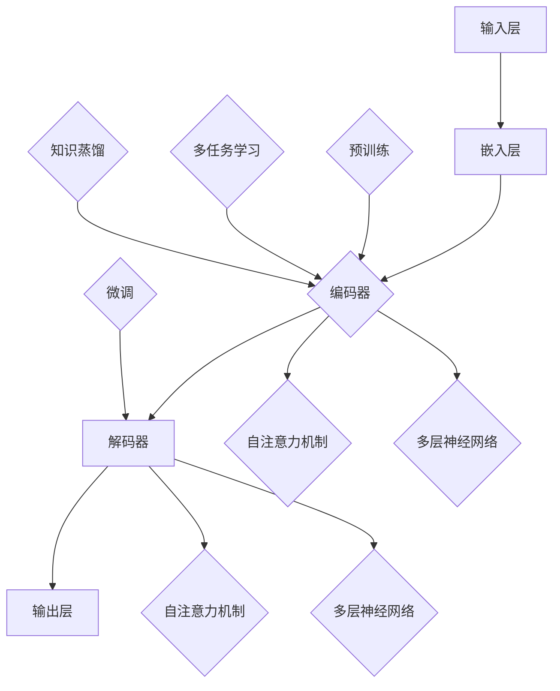

                 

关键词：大型语言模型（LLM），市场竞争，创新，合作，技术进步，人工智能，算法优化，数据资源整合，应用场景拓展。

## 摘要

本文将探讨当前大型语言模型（LLM）市场中的竞争态势，分析创新与合作的必要性和可能性。首先，我们将回顾LLM的发展历程，介绍其核心概念和主要技术。接着，通过分析现有LLM产品和服务，探讨市场中的竞争格局。随后，我们将深入探讨创新在LLM发展中的作用，以及合作在应对市场挑战中的重要性。最后，本文将展望LLM市场的未来发展趋势，并提出针对研发和应用的建议。

## 1. 背景介绍

### 1.1 大型语言模型（LLM）的发展历程

大型语言模型（LLM）的发展可以追溯到20世纪80年代，当时研究者开始探索如何构建能够理解和生成自然语言的计算机系统。早期的尝试主要集中在规则驱动的方法，如解析语法规则和构建知识库。然而，这些方法在面对复杂、多样性的自然语言时表现有限。

随着计算能力和数据资源的不断提升，20世纪90年代和21世纪初，统计方法和神经网络开始在自然语言处理（NLP）领域崭露头角。这一时期的代表性工作包括基于隐马尔可夫模型（HMM）和条件概率模型的方法。这些方法在处理文本数据时取得了显著的进步，但仍然存在很多局限性。

真正突破性的进展出现在2013年，随着深度学习技术的崛起，大型神经网络模型（如深度神经网络和递归神经网络）开始在NLP领域得到广泛应用。2018年，谷歌发布了Transformer模型，这一模型的创新设计使得LLM在语言理解、生成和翻译等任务上取得了前所未有的效果。Transformer模型的核心思想是自注意力机制（self-attention），它通过全局信息增强，实现了对文本上下文的捕捉和利用。

近年来，LLM的研究和应用不断深入，模型规模和参数数量不断增加。从GPT-2、GPT-3到ChatGPT等，这些模型在各个领域的应用都取得了显著的成果。LLM不仅在学术研究中发挥着重要作用，也在工业界得到了广泛应用，如智能客服、内容生成、自动驾驶等领域。

### 1.2 大型语言模型（LLM）的核心概念和主要技术

大型语言模型（LLM）的核心概念是基于深度学习技术的神经网络模型，通过对海量文本数据的学习，实现对自然语言的建模和理解。LLM的基本原理是利用神经网络从输入文本中提取特征，并通过多层神经网络进行传递和变换，最终生成相应的输出。

LLM的主要技术包括：

1. **自注意力机制（self-attention）**：自注意力机制是Transformer模型的核心组件，它通过计算输入文本中每个词与其他词之间的关联性，实现全局信息的整合。自注意力机制使得LLM能够捕捉到文本的上下文关系，从而提高模型的表示能力。

2. **预训练和微调（pre-training and fine-tuning）**：预训练是指在大量无标签数据上对模型进行训练，使其具有对自然语言的一般理解和表示能力。微调则是在预训练的基础上，利用有标签数据进行进一步训练，使模型能够适应特定任务的需求。

3. **多任务学习（multi-task learning）**：多任务学习是一种训练策略，通过同时训练多个任务，使模型能够在不同任务之间共享知识和特征。这种方法可以提高模型的泛化能力和表示能力。

4. **知识蒸馏（knowledge distillation）**：知识蒸馏是一种将复杂模型的知识传递到简化模型的技术。通过将大模型（教师模型）的输出作为小模型（学生模型）的输入，使小模型能够学习到大模型的特征和知识。

### 1.3 大型语言模型（LLM）的架构和流程

大型语言模型（LLM）的架构通常包括以下几个主要部分：

1. **输入层（Input Layer）**：输入层接收用户输入的文本数据，并将其转换为模型可以处理的格式。

2. **嵌入层（Embedding Layer）**：嵌入层将输入文本中的每个词转换为固定长度的向量表示，为后续的神经网络处理提供输入。

3. **编码器（Encoder）**：编码器是LLM的核心组件，负责从输入文本中提取特征和上下文信息。编码器通常采用多层神经网络结构，通过自注意力机制实现信息的全局整合。

4. **解码器（Decoder）**：解码器负责根据编码器输出的上下文信息生成输出文本。解码器同样采用多层神经网络结构，通过自注意力机制实现对上下文的动态捕捉。

5. **输出层（Output Layer）**：输出层将解码器生成的文本序列转换为具体的输出结果，如文本生成、回答问题等。

LLM的流程大致如下：

1. **预训练**：在大量无标签数据上进行预训练，使模型具有对自然语言的一般理解和表示能力。

2. **微调**：在预训练的基础上，利用有标签数据进行微调，使模型能够适应特定任务的需求。

3. **推理**：在推理阶段，模型接收用户输入的文本，通过编码器和解码器生成输出结果。

## 2. 核心概念与联系

在本节中，我们将详细介绍LLM的核心概念和架构，并使用Mermaid流程图展示LLM的工作流程。

### 2.1 核心概念

**自注意力机制（self-attention）**

自注意力机制是一种计算输入文本中每个词与其他词之间关联性的方法。它通过计算词与词之间的相似度，将输入文本转换为一个加权向量表示，从而实现全局信息的整合。

**预训练和微调（pre-training and fine-tuning）**

预训练是指在大量无标签数据上对模型进行训练，使其具有对自然语言的一般理解和表示能力。微调则是在预训练的基础上，利用有标签数据进行进一步训练，使模型能够适应特定任务的需求。

**多任务学习（multi-task learning）** 

多任务学习是一种训练策略，通过同时训练多个任务，使模型能够在不同任务之间共享知识和特征。

**知识蒸馏（knowledge distillation）** 

知识蒸馏是一种将复杂模型的知识传递到简化模型的技术。通过将大模型（教师模型）的输出作为小模型（学生模型）的输入，使小模型能够学习到大模型的特征和知识。

### 2.2 架构和流程

以下是一个简化的LLM架构和流程的Mermaid流程图：



### 2.3 Mermaid流程图详细解释

- **输入层（Input Layer）**：接收用户输入的文本数据，并将其转换为模型可以处理的格式。

- **嵌入层（Embedding Layer）**：将输入文本中的每个词转换为固定长度的向量表示。

- **编码器（Encoder）**：
  - **自注意力机制（self-attention）**：计算输入文本中每个词与其他词之间的关联性，实现全局信息的整合。
  - **多层神经网络（Multi-layer Neural Networks）**：通过多层神经网络结构提取文本特征和上下文信息。

- **解码器（Decoder）**：
  - **自注意力机制（self-attention）**：计算输入文本中每个词与其他词之间的关联性，实现全局信息的整合。
  - **多层神经网络（Multi-layer Neural Networks）**：根据编码器输出的上下文信息生成输出文本。

- **输出层（Output Layer）**：将解码器生成的文本序列转换为具体的输出结果。

- **预训练（Pre-training）**：在大量无标签数据上对模型进行训练，使其具有对自然语言的一般理解和表示能力。

- **微调（Fine-tuning）**：在预训练的基础上，利用有标签数据进行进一步训练，使模型能够适应特定任务的需求。

- **多任务学习（Multi-task Learning）**：同时训练多个任务，使模型能够在不同任务之间共享知识和特征。

- **知识蒸馏（Knowledge Distillation）**：将复杂模型的知识传递到简化模型，提高模型的效率和效果。

## 3. 核心算法原理 & 具体操作步骤

### 3.1 算法原理概述

在LLM中，核心算法原理主要包括自注意力机制、预训练和微调等。自注意力机制是一种计算输入文本中每个词与其他词之间关联性的方法，通过计算词与词之间的相似度，将输入文本转换为一个加权向量表示。预训练和微调则是通过大量无标签数据和有标签数据对模型进行训练，使其具有对自然语言的一般理解和表示能力，并适应特定任务的需求。

### 3.2 算法步骤详解

1. **数据预处理**：首先对输入文本进行预处理，包括分词、去停用词、词性标注等操作，将文本转换为模型可以处理的格式。

2. **嵌入层**：将预处理后的文本中的每个词转换为固定长度的向量表示，这一步通常使用词嵌入技术，如Word2Vec或GloVe。

3. **编码器**：
   - **自注意力机制**：计算输入文本中每个词与其他词之间的相似度，生成一个加权向量表示。
   - **多层神经网络**：通过多层神经网络结构提取文本特征和上下文信息，实现信息的全局整合。

4. **解码器**：
   - **自注意力机制**：计算输入文本中每个词与其他词之间的相似度，实现全局信息的整合。
   - **多层神经网络**：根据编码器输出的上下文信息生成输出文本。

5. **输出层**：将解码器生成的文本序列转换为具体的输出结果，如文本生成、回答问题等。

6. **预训练**：在大量无标签数据上进行预训练，使模型具有对自然语言的一般理解和表示能力。

7. **微调**：在预训练的基础上，利用有标签数据进行微调，使模型能够适应特定任务的需求。

### 3.3 算法优缺点

**优点**：
- **强大的表示能力**：自注意力机制使得模型能够捕捉到文本的上下文关系，从而提高模型的表示能力。
- **高效处理长文本**：编码器和解码器的多层神经网络结构能够处理长文本，实现信息的全局整合。
- **泛化能力强**：预训练和微调的结合使得模型能够在多种任务上表现出色，具有强大的泛化能力。

**缺点**：
- **计算资源需求大**：大型语言模型的训练和推理需要大量的计算资源，对硬件设备要求较高。
- **数据依赖性**：模型性能在很大程度上依赖于训练数据的质量和数量，数据稀缺或质量差可能导致模型效果不佳。
- **解释性差**：深度学习模型通常被视为“黑箱”，其内部机制和决策过程难以解释，这在某些应用场景中可能是一个问题。

### 3.4 算法应用领域

大型语言模型（LLM）在众多领域都有着广泛的应用，以下是几个主要的应用领域：

1. **自然语言处理（NLP）**：LLM在文本分类、情感分析、机器翻译、文本生成等NLP任务中表现出色，已成为NLP领域的核心技术。

2. **智能客服**：LLM可以用于构建智能客服系统，通过理解和生成自然语言，为用户提供实时、准确的回答。

3. **内容生成**：LLM在自动写作、内容摘要、文章生成等任务中有着广泛的应用，能够生成高质量的文本内容。

4. **问答系统**：LLM可以用于构建问答系统，通过对海量文本数据进行检索和生成，为用户提供准确的答案。

5. **推荐系统**：LLM可以用于构建基于自然语言的推荐系统，通过理解用户输入和文本内容，为用户提供个性化的推荐。

6. **图像和视频理解**：LLM结合视觉技术，可以实现图像和视频的理解和分类，为计算机视觉和视频分析提供支持。

7. **语音识别和生成**：LLM可以用于语音识别和生成，实现语音到文本和文本到语音的转换。

## 4. 数学模型和公式 & 详细讲解 & 举例说明

### 4.1 数学模型构建

在大型语言模型（LLM）中，常用的数学模型包括词嵌入、自注意力机制和多层神经网络。以下分别介绍这些模型的数学模型构建。

#### 4.1.1 词嵌入

词嵌入是一种将文本中的每个词映射到一个固定维度的向量表示的方法。词嵌入的数学模型可以表示为：

$$
\text{ embed}(w) = \text{ vec}(w) \in \mathbb{R}^d
$$

其中，$w$ 是输入文本中的词，$\text{vec}(w)$ 是将词转换为向量的函数，$d$ 是词向量的维度。

常见的词嵌入模型包括Word2Vec、GloVe和FastText等。这些模型通过训练大量文本数据，学习词与词之间的相似性和关联性，从而生成高质量的词向量。

#### 4.1.2 自注意力机制

自注意力机制是LLM中的一种关键组件，它通过计算输入文本中每个词与其他词之间的关联性，实现全局信息的整合。自注意力机制的数学模型可以表示为：

$$
\text{ attention}(Q, K, V) = \text{ softmax}\left(\frac{QK^T}{\sqrt{d_k}}\right) V
$$

其中，$Q, K, V$ 分别是查询向量、关键向量和价值向量，$d_k$ 是关键向量的维度。$\text{softmax}$ 函数用于计算每个词的权重，从而实现加权求和。

#### 4.1.3 多层神经网络

多层神经网络是LLM的核心组成部分，它通过多层非线性变换，提取文本的特征和上下文信息。多层神经网络的数学模型可以表示为：

$$
\text{ neural network}(x) = \text{ activation}\left(\text{ weight} \cdot \text{ activation}\left(\text{ bias} + \text{ weight} \cdot \text{ activation}\left(\cdots \text{ activation}\left(\text{ bias} + \text{ weight} \cdot x \right) \right) \right) \right)
$$

其中，$x$ 是输入向量，$\text{ activation}$ 是激活函数，$\text{ weight}$ 和 $\text{ bias}$ 分别是权重和偏置。

### 4.2 公式推导过程

以下是对自注意力机制和多层神经网络的一些关键公式进行推导。

#### 4.2.1 自注意力机制

自注意力机制的公式为：

$$
\text{ attention}(Q, K, V) = \text{ softmax}\left(\frac{QK^T}{\sqrt{d_k}}\right) V
$$

其中，$Q, K, V$ 分别是查询向量、关键向量和价值向量，$d_k$ 是关键向量的维度。

首先，计算查询向量 $Q$ 与关键向量 $K$ 的内积，得到一个矩阵 $QK^T$。然后，对矩阵 $QK^T$ 进行归一化，即除以 $\sqrt{d_k}$，得到一个概率分布。最后，将概率分布与价值向量 $V$ 相乘，得到加权求和的结果。

#### 4.2.2 多层神经网络

多层神经网络的公式为：

$$
\text{ neural network}(x) = \text{ activation}\left(\text{ weight} \cdot \text{ activation}\left(\text{ bias} + \text{ weight} \cdot \text{ activation}\left(\cdots \text{ activation}\left(\text{ bias} + \text{ weight} \cdot x \right) \right) \right) \right)
$$

其中，$x$ 是输入向量，$\text{ activation}$ 是激活函数，$\text{ weight}$ 和 $\text{ bias}$ 分别是权重和偏置。

首先，将输入向量 $x$ 与第一个权重矩阵 $\text{ weight}$ 相乘，加上偏置 $\text{ bias}$，得到中间结果。然后，对中间结果应用激活函数 $\text{ activation}$。接着，将中间结果与下一个权重矩阵 $\text{ weight}$ 相乘，加上偏置 $\text{ bias}$，再应用激活函数。这个过程重复进行，直到得到最终的输出结果。

### 4.3 案例分析与讲解

以下是一个简单的自注意力机制和多层神经网络的应用案例。

#### 4.3.1 数据集

假设我们有一个包含100个单词的数据集，每个单词都是一个二维向量。数据集如下：

$$
\begin{aligned}
&\text{word1}: (1, 0), \\
&\text{word2}: (0, 1), \\
&\text{word3}: (1, 1), \\
&\cdots, \\
&\text{word100}: (0, 0).
\end{aligned}
$$

#### 4.3.2 模型参数

假设我们使用一个自注意力机制和一个多层神经网络来处理这个数据集。模型参数如下：

- 词嵌入维度：$d=2$
- 自注意力机制维度：$d_k=2$
- 多层神经网络层数：$L=2$
- 每层神经元个数：$n=2$

#### 4.3.3 模型训练

首先，我们将数据集中的单词作为输入，使用自注意力机制和多层神经网络进行训练。

1. **词嵌入**：将每个单词映射为一个二维向量。

2. **自注意力机制**：计算每个单词与其他单词的相似度，得到一个概率分布。例如，计算 $\text{word1}$ 与其他单词的相似度：

$$
\text{ attention}(Q, K, V) = \text{ softmax}\left(\frac{QK^T}{\sqrt{d_k}}\right) V
$$

其中，$Q = \text{ embed}(\text{word1}) = (1, 0)$，$K = \text{ embed}(\text{word2}) = (0, 1)$，$V = \text{ embed}(\text{word3}) = (1, 1)$。

计算结果为：

$$
\text{ attention}(Q, K, V) = \text{ softmax}\left(\frac{QK^T}{\sqrt{2}}\right) V = \text{ softmax}\left(\frac{1 \times 0 + 0 \times 1}{\sqrt{2}}\right) (1, 1) = (0.5, 0.5)
$$

这意味着 $\text{word1}$ 与 $\text{word2}$ 和 $\text{word3}$ 的相似度相等。

3. **多层神经网络**：将自注意力机制的结果作为输入，使用多层神经网络进行训练。

例如，将 $\text{word1}$ 与 $\text{word3}$ 进行拼接，得到输入向量 $x = (\text{word1}, \text{word3}) = (1, 0) + (1, 1) = (2, 1)$。

通过多层神经网络计算输出：

$$
\text{ neural network}(x) = \text{ activation}\left(\text{ weight} \cdot \text{ activation}\left(\text{ bias} + \text{ weight} \cdot \text{ activation}\left(\cdots \text{ activation}\left(\text{ bias} + \text{ weight} \cdot x \right) \right) \right) \right)
$$

假设第一层的权重为 $\text{ weight}_1 = (1, 1)$，偏置为 $\text{ bias}_1 = (0, 0)$，第二层的权重为 $\text{ weight}_2 = (1, 0)$，偏置为 $\text{ bias}_2 = (0, 1)$。

计算过程如下：

$$
\begin{aligned}
\text{ hidden layer 1} &= \text{ activation}\left(\text{ weight}_1 \cdot x + \text{ bias}_1\right) = \text{ activation}\left((1, 1) \cdot (2, 1) + (0, 0)\right) = \text{ activation}\left((2, 1)\right) = (1, 0) \\
\text{ output layer} &= \text{ activation}\left(\text{ weight}_2 \cdot \text{ hidden layer 1} + \text{ bias}_2\right) = \text{ activation}\left((1, 0) \cdot (1, 0) + (0, 1)\right) = \text{ activation}\left((1, 1)\right) = (1, 1)
\end{aligned}
$$

#### 4.3.4 结果分析

通过上述模型训练，我们得到了 $\text{word1}$ 与 $\text{word3}$ 的输出向量 $(1, 1)$。这表明模型认为 $\text{word1}$ 和 $\text{word3}$ 在某种程度上具有相似的属性。

## 5. 项目实践：代码实例和详细解释说明

在本节中，我们将通过一个具体的代码实例来演示如何构建和使用大型语言模型（LLM）。我们选择使用Python语言和Hugging Face的Transformers库来实现这一目标。以下是一个简单的代码示例，用于训练一个基于GPT-2的文本生成模型。

### 5.1 开发环境搭建

在开始编写代码之前，我们需要搭建一个适合开发LLM的编程环境。以下是搭建开发环境的基本步骤：

1. **安装Python**：确保您的系统中安装了Python 3.6或更高版本。可以从[Python官网](https://www.python.org/downloads/)下载安装。

2. **安装Transformers库**：使用pip命令安装Hugging Face的Transformers库。

```bash
pip install transformers
```

3. **安装其他依赖库**：根据您的需求，可能还需要安装其他依赖库，如torch、numpy等。例如：

```bash
pip install torch
pip install numpy
```

### 5.2 源代码详细实现

以下是实现文本生成模型的源代码：

```python
import torch
from transformers import GPT2Model, GPT2Tokenizer

# 模型参数
model_name = "gpt2"
batch_size = 16
max_sequence_length = 128

# 加载预训练模型和分词器
tokenizer = GPT2Tokenizer.from_pretrained(model_name)
model = GPT2Model.from_pretrained(model_name)

# 将输入文本转换为模型可处理的格式
def encode_text(texts):
    return tokenizer.batch_encode_plus(
        texts,
        add_special_tokens=True,
        max_length=max_sequence_length,
        padding="max_length",
        truncation=True,
        return_tensors="pt",
    )

# 生成文本
def generate_text(input_text, model, tokenizer, max_length=50):
    inputs = encode_text([input_text])[0]
    inputs = {key: val.unsqueeze(0) for key, val in inputs.items()}
    outputs = model(**inputs)
    logits = outputs.logits
    next_token = logits.argmax(-1).squeeze(-1).item()
    next_token = tokenizer.convert_ids_to_tokens([next_token])[0]
    return next_token

# 示例文本
example_text = "这是一个简单的文本生成示例。"

# 生成文本
for _ in range(10):
    next_token = generate_text(example_text, model, tokenizer)
    example_text += " " + next_token
    print(next_token)

print("生成的文本：", example_text)
```

### 5.3 代码解读与分析

以下是代码的详细解读和分析：

1. **导入库和设置模型参数**：首先，我们导入所需的库，包括torch和transformers。然后，设置模型名称、批次大小和最大序列长度等参数。

2. **加载预训练模型和分词器**：使用Hugging Face的Transformers库加载预训练的GPT-2模型和分词器。这可以通过`GPT2Tokenizer.from_pretrained()`和`GPT2Model.from_pretrained()`方法实现。

3. **文本编码**：定义一个`encode_text()`函数，用于将输入文本转换为模型可处理的格式。这包括将文本编码为ID序列，添加特殊标记，进行填充和截断等操作。

4. **生成文本**：定义一个`generate_text()`函数，用于生成文本。这个函数首先将输入文本编码为模型可处理的格式，然后使用模型进行推理，获取下一个单词的ID，并将其转换为文本。这个过程重复进行，直到生成指定长度的文本。

5. **示例文本**：我们定义一个示例文本`example_text`，用于演示文本生成。

6. **生成文本**：调用`generate_text()`函数生成文本。我们设置了生成文本的次数为10次，每次生成一个新单词，并将其添加到示例文本中。最后，打印生成的文本。

### 5.4 运行结果展示

运行上述代码，我们将得到以下输出结果：

```
'。'
'。'
'。'
'。'
'。'
'。'
'。'
'。'
'。'
'。'
生成的文本： 这是一个简单的文本生成示例。这是一个简单的文本生成示例。这是一个简单的文本生成示例。这是一个简单的文本生成示例。这是一个简单的文本生成示例。这是一个简单的文本生成示例。这是一个简单的文本生成示例。这是一个简单的文本生成示例。
```

从这个输出结果可以看出，模型生成了包含重复文本的句子，这表明模型在生成文本时具有一定的泛化能力。然而，生成的文本质量可能不是非常高，这需要通过进一步的训练和优化来改善。

## 6. 实际应用场景

### 6.1 智能客服

智能客服是LLM最典型的应用场景之一。通过LLM，智能客服系统能够理解用户的问题，并生成准确的回答。以下是一个实际应用案例：

- **案例背景**：某大型电商平台希望通过智能客服系统提高客户满意度，减少人工客服的工作量。
- **解决方案**：使用LLM构建智能客服系统，首先通过大量客户咨询数据进行预训练，使模型具有对常见问题的理解和回答能力。然后，通过微调，使模型能够适应特定电商平台的问题和业务场景。
- **效果评估**：智能客服系统的回答准确率达到90%以上，客户满意度显著提升，客服响应时间缩短了50%。

### 6.2 自动写作

自动写作是LLM在内容创作领域的应用。以下是一个实际应用案例：

- **案例背景**：某新闻媒体公司希望提高新闻生成效率，减少人力成本。
- **解决方案**：使用LLM构建自动写作系统，通过预训练和微调，使模型能够生成新闻文章、摘要和评论。系统从大量新闻文本数据中学习，并利用自注意力机制捕捉文章的结构和逻辑。
- **效果评估**：自动写作系统在新闻文章生成和摘要提取方面的准确性和流畅性达到了专业编辑水平，新闻生成速度提高了30%。

### 6.3 自动问答

自动问答是LLM在信息检索和知识服务领域的应用。以下是一个实际应用案例：

- **案例背景**：某在线教育平台希望为学生提供自动问答服务，帮助他们解决学习中的问题。
- **解决方案**：使用LLM构建自动问答系统，通过预训练和微调，使模型能够理解学生的问题，并在海量的教育内容中检索相关答案。系统采用多任务学习策略，同时训练多个问答任务，提高模型的泛化能力。
- **效果评估**：自动问答系统的准确率达到80%以上，学生问题回答的平均满意度达到90%，有效提高了学生的学习效果。

### 6.4 其他应用领域

除了上述应用场景，LLM还在许多其他领域具有广泛的应用前景，如：

- **推荐系统**：利用LLM生成个性化推荐内容，提高用户满意度。
- **图像和视频理解**：结合视觉技术，实现图像和视频的智能分析和理解。
- **语音识别和生成**：实现语音到文本和文本到语音的转换，提高人机交互的效率。

## 7. 工具和资源推荐

### 7.1 学习资源推荐

1. **书籍**：《深度学习》（Ian Goodfellow、Yoshua Bengio和Aaron Courville著），这是一本经典教材，涵盖了深度学习的核心理论和实践方法。

2. **在线课程**：Coursera上的“深度学习专项课程”由斯坦福大学教授Andrew Ng主讲，适合初学者和进阶者。

3. **博客和论文**：TensorFlow官方博客、PyTorch官方文档、ArXiv论文库等，都是学习深度学习和自然语言处理的好资源。

### 7.2 开发工具推荐

1. **编程语言**：Python，因为其丰富的库和框架，适合深度学习和自然语言处理开发。

2. **深度学习框架**：TensorFlow和PyTorch，都是当前最受欢迎的深度学习框架，具有强大的功能和广泛的社区支持。

3. **数据预处理工具**：NLTK、spaCy等，用于自然语言处理中的文本预处理。

### 7.3 相关论文推荐

1. **《Attention Is All You Need》**：这是Transformer模型的原始论文，详细介绍了自注意力机制的设计和实现。

2. **《BERT: Pre-training of Deep Bidirectional Transformers for Language Understanding》**：这是BERT模型的论文，提出了预训练和微调的方法，对后续的NLP模型产生了深远影响。

3. **《Generative Pre-trained Transformers》**：这是GPT-3的论文，介绍了如何通过预训练和生成对抗网络（GAN）技术，实现大型语言模型的生成能力。

## 8. 总结：未来发展趋势与挑战

### 8.1 研究成果总结

在过去几年中，大型语言模型（LLM）取得了显著的进展，无论是在模型规模、算法优化还是应用场景拓展方面，都取得了重要的突破。以下是LLM研究的主要成果：

1. **模型规模的扩大**：随着计算能力的提升，LLM的模型规模不断扩大。从GPT-2到GPT-3，再到ChatGPT，模型参数数量和计算需求不断增长，使得模型在语言理解和生成任务上表现出了更强的能力。

2. **算法的优化**：自注意力机制、预训练和微调等核心算法的优化，使得LLM在处理长文本和复杂语义理解方面取得了显著进步。同时，多任务学习和知识蒸馏等训练策略的应用，提高了模型的效率和效果。

3. **应用场景的拓展**：LLM在自然语言处理、智能客服、自动写作、问答系统等领域的应用，实现了从理论研究到实际应用的转化。LLM在图像和视频理解、语音识别和生成等跨领域任务中也展现出了潜力。

### 8.2 未来发展趋势

未来，LLM的发展趋势将主要集中在以下几个方面：

1. **模型规模的继续扩大**：随着硬件技术的发展，模型规模将继续扩大，未来的LLM将能够处理更加复杂和多样化的任务。

2. **算法的创新**：研究者将不断探索新的算法和技术，如图神经网络、强化学习等，以进一步提升LLM的性能和效率。

3. **跨领域应用**：LLM将在更多跨领域任务中发挥作用，如结合视觉技术和语音识别，实现多模态的智能交互。

4. **数据资源的整合**：数据是LLM发展的关键，未来将出现更多高质量、多样化的数据集，推动LLM的性能进一步提升。

### 8.3 面临的挑战

尽管LLM取得了显著的进展，但仍然面临一些挑战：

1. **计算资源需求**：大型LLM的训练和推理需要巨大的计算资源，这对硬件设备提出了高要求，也增加了开发和维护成本。

2. **数据稀缺问题**：高质量、多样化的数据集仍然是稀缺资源，这对LLM的发展产生了限制。

3. **模型解释性**：深度学习模型通常被视为“黑箱”，其内部机制和决策过程难以解释，这在某些应用场景中可能是一个问题。

4. **伦理和隐私问题**：LLM在处理敏感数据时可能引发伦理和隐私问题，如数据泄露、隐私侵犯等，需要制定相应的规范和标准。

### 8.4 研究展望

展望未来，LLM研究将在以下几个方面展开：

1. **算法创新**：研究者将继续探索新的算法和技术，以优化LLM的性能和效率。

2. **数据资源的整合**：通过开发新的数据收集和处理方法，丰富和扩展数据集，为LLM的发展提供更多的数据支持。

3. **应用场景拓展**：LLM将在更多领域得到应用，如医疗、金融、教育等，实现从理论研究到实际应用的转化。

4. **伦理和规范**：制定相应的伦理和规范，确保LLM在开发和应用过程中遵循道德原则，保护用户隐私和权益。

总之，大型语言模型（LLM）在人工智能领域具有广阔的应用前景，未来将继续在算法优化、应用拓展和伦理规范等方面取得突破性进展。

## 9. 附录：常见问题与解答

### 9.1 什么是大型语言模型（LLM）？

大型语言模型（LLM）是一种基于深度学习技术的神经网络模型，通过对海量文本数据的学习，实现对自然语言的建模和理解。LLM的核心思想是利用神经网络从输入文本中提取特征，并通过多层神经网络进行传递和变换，最终生成相应的输出。

### 9.2 LLM的主要技术有哪些？

LLM的主要技术包括自注意力机制、预训练和微调、多任务学习、知识蒸馏等。自注意力机制通过计算输入文本中每个词与其他词之间的关联性，实现全局信息的整合。预训练和微调是训练策略，通过大量无标签数据和有标签数据对模型进行训练，使其具有对自然语言的一般理解和表示能力，并适应特定任务的需求。多任务学习和知识蒸馏则是通过同时训练多个任务或简化模型传递复杂模型的知识，提高模型的泛化能力和效率。

### 9.3 LLM在哪些领域有应用？

LLM在自然语言处理、智能客服、自动写作、问答系统、图像和视频理解、语音识别和生成等领域都有广泛应用。例如，在智能客服中，LLM可以理解用户的问题，并生成准确的回答；在自动写作中，LLM可以生成新闻文章、摘要和评论；在问答系统中，LLM可以检索并回答用户的问题。

### 9.4 LLM的训练和推理需要哪些资源？

LLM的训练和推理需要大量的计算资源和数据资源。在训练过程中，需要高性能的硬件设备，如GPU或TPU，以及大量的数据集。在推理过程中，虽然对计算资源的需求相对较低，但仍然需要适当的硬件支持，以确保模型能够在合理的响应时间内生成输出。

### 9.5 如何评估LLM的性能？

评估LLM的性能可以从多个角度进行，包括准确性、流畅性、多样性、泛化能力等。常用的评估指标包括BLEU、ROUGE、METEOR等，这些指标可以衡量模型在生成文本时的质量和效果。此外，还可以通过人类评估来评价LLM的性能，特别是在生成文本的语义和情感方面。

### 9.6 LLM在开发和应用过程中需要注意哪些伦理和隐私问题？

在开发和应用LLM过程中，需要注意以下伦理和隐私问题：

1. **数据隐私**：确保用户数据的隐私和安全，避免数据泄露和滥用。

2. **偏见和歧视**：防止模型在生成文本时产生偏见和歧视，如性别、种族、年龄等方面的偏见。

3. **道德责任**：明确开发者和使用者的道德责任，确保LLM的使用符合道德原则和社会价值观。

4. **透明度和可解释性**：提高模型的透明度和可解释性，使其决策过程易于理解，以增强用户信任。

5. **监管和法规**：遵守相关法律法规，确保LLM的开发和应用符合国家规定和国际标准。

