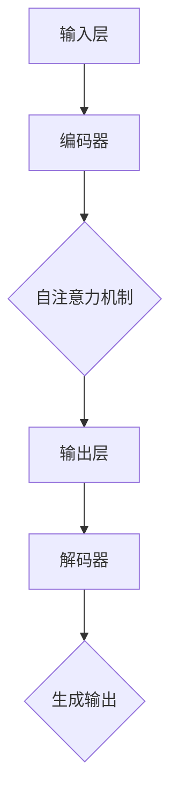

                 

关键词：大型语言模型，市场分析，竞争策略，协作机制，技术发展，商业应用，趋势展望。

> 摘要：本文将深入探讨大型语言模型（LLM）市场的现状，包括市场的竞争格局和各主要竞争者的策略，以及LLM在技术进步和商业应用方面的进展。同时，文章还将分析LLM市场的协作趋势，讨论协作机制对市场发展的影响，并展望LLM市场的未来。

## 1. 背景介绍

大型语言模型（Large Language Models，简称LLM）是一种基于深度学习的自然语言处理（NLP）技术，能够理解和生成自然语言文本。随着深度学习技术的飞速发展，LLM在各个领域的应用日益广泛，从文本生成、机器翻译到对话系统、内容审核等，都展现出强大的能力。LLM市场的快速增长吸引了众多企业、研究机构和投资人的关注。

目前，LLM市场主要由几家大型科技公司主导，包括谷歌、微软、亚马逊、百度等。这些公司投入巨资研发LLM技术，并通过不断的迭代和优化，推出了各自的代表性模型，如谷歌的BERT、微软的GPT、亚马逊的Inferentia等。这些模型的性能和功能不断提升，进一步推动了LLM市场的发展。

### 1.1 市场规模与增长趋势

据市场研究机构的报告，全球LLM市场规模在过去几年中呈现出快速增长的趋势。预计到2025年，市场规模将达到数十亿美元。这一增长主要得益于以下几个因素：

1. **技术进步**：随着深度学习技术的不断进步，LLM的性能不断提升，其应用范围也在不断扩大。
2. **应用场景扩展**：从最初的文本生成和机器翻译，LLM技术已经扩展到更多的领域，如智能客服、内容审核、教育、医疗等。
3. **企业需求增加**：越来越多的企业意识到LLM技术对业务发展的潜在价值，开始加大在LLM技术上的投入。

### 1.2 主要竞争者与策略

在LLM市场中，几家主要科技公司通过不同的策略争夺市场份额。以下是对这些公司的简要分析：

1. **谷歌**：谷歌在LLM领域一直处于领先地位，其BERT和Transformer等模型在多个NLP任务上取得了优异的成绩。谷歌的策略主要是通过开源其模型和代码，推动整个行业的进步，并吸引更多的开发者使用其技术。

2. **微软**：微软的GPT系列模型也是LLM市场的重要竞争者。微软的策略是通过与各类企业和研究机构的合作，推动GPT模型在不同领域的应用，并借助Azure云服务，为企业提供高效的LLM解决方案。

3. **亚马逊**：亚马逊的Inferentia是一款专门为LLM训练设计的硬件芯片，其目标是通过提供高性能、低功耗的硬件解决方案，吸引更多企业使用LLM技术。

4. **百度**：百度的ERNIE系列模型在中文语言处理领域表现出色。百度主要通过推出面向企业和开发者的LLM工具和服务，以及与各类企业的合作，扩大其市场影响力。

## 2. 核心概念与联系

为了更好地理解LLM市场的竞争和协作，我们首先需要了解LLM的核心概念和技术架构。

### 2.1 LLM的核心概念

LLM的核心概念主要包括：

1. **神经网络架构**：LLM通常基于Transformer架构，这是一种能够处理变长序列的神经网络模型，其核心是自注意力机制（self-attention）。
2. **预训练与微调**：LLM通常通过预训练（pre-training）和微调（fine-tuning）两个阶段来训练。预训练阶段，模型在大量无标签数据上进行训练，学习语言的一般规律；微调阶段，模型在特定任务的数据上进行训练，以适应具体的任务需求。
3. **多模态融合**：为了提升LLM的性能，近年来出现了多模态LLM的研究，例如结合文本、图像和声音等多模态数据，以实现更广泛的应用。

### 2.2 LLM的技术架构

LLM的技术架构主要包括以下几个关键部分：

1. **输入层**：接收文本、图像、声音等多种输入数据，并进行预处理。
2. **编码器（Encoder）**：将输入数据进行编码，产生上下文表示。
3. **解码器（Decoder）**：根据编码器的输出，生成文本、图像、声音等多种输出数据。
4. **自注意力机制（Self-Attention）**：在编码器和解码器中，通过自注意力机制计算输入数据的权重，以实现对输入数据的精细处理。
5. **损失函数与优化器**：通过损失函数和优化器，调整模型参数，以优化模型性能。

### 2.3 Mermaid 流程图

以下是一个简单的Mermaid流程图，展示了LLM的核心流程：



## 3. 核心算法原理 & 具体操作步骤

### 3.1 算法原理概述

LLM的核心算法是基于Transformer架构的，其基本原理如下：

1. **自注意力机制**：通过计算输入数据的权重，实现对输入数据的精细处理。
2. **多头注意力**：将输入数据分为多个头，每个头独立计算注意力权重，以获得更丰富的上下文信息。
3. **前馈神经网络**：在每个注意力层之后，加入前馈神经网络，对输入数据进行进一步的处理。
4. **训练与微调**：通过预训练和微调两个阶段，使模型能够适应不同的任务和数据。

### 3.2 算法步骤详解

以下是LLM算法的具体步骤：

1. **输入预处理**：对输入文本、图像、声音等进行预处理，如分词、编码等。
2. **编码器处理**：将预处理后的输入数据送入编码器，通过自注意力机制和前馈神经网络，生成编码表示。
3. **解码器处理**：将编码表示送入解码器，通过自注意力机制和前馈神经网络，生成输出数据。
4. **生成输出**：根据解码器的输出，生成文本、图像、声音等多种输出数据。

### 3.3 算法优缺点

**优点**：

1. **强大的文本生成能力**：LLM能够生成高质量的自然语言文本，适用于文本生成、对话系统等任务。
2. **多模态处理能力**：LLM能够处理多种输入数据，如文本、图像、声音等，实现多模态融合。
3. **适应性**：通过预训练和微调，LLM能够适应不同的任务和数据，具备良好的泛化能力。

**缺点**：

1. **计算资源消耗大**：LLM的模型参数量巨大，训练和推理过程中需要大量的计算资源。
2. **数据依赖性强**：LLM的性能高度依赖于训练数据的质量和数量，缺乏足够数据时，性能可能会大幅下降。

### 3.4 算法应用领域

LLM的应用领域非常广泛，主要包括：

1. **文本生成**：如文章生成、对话生成、代码生成等。
2. **机器翻译**：如英译中、中译英等。
3. **智能客服**：如语音识别、对话生成等。
4. **内容审核**：如文本分类、情感分析等。
5. **教育**：如智能辅导、在线教育等。
6. **医疗**：如病历分析、疾病预测等。

## 4. 数学模型和公式 & 详细讲解 & 举例说明

### 4.1 数学模型构建

LLM的数学模型主要包括以下几个部分：

1. **自注意力机制**：用于计算输入数据的权重，其公式为：

   $$ 
   attention(Q, K, V) = \text{softmax}\left(\frac{QK^T}{\sqrt{d_k}}\right)V
   $$

   其中，$Q$、$K$、$V$分别为编码器的输入、键、值，$d_k$为键的维度。

2. **多头注意力**：将自注意力机制扩展到多个头，其公式为：

   $$ 
   \text{MultiHead}(Q, K, V) = \text{Concat}(\text{head}_1, ..., \text{head}_h)W^O
   $$

   其中，$h$为头的数量，$W^O$为输出权重。

3. **前馈神经网络**：在每个注意力层之后，加入前馈神经网络，其公式为：

   $$ 
   \text{FFN}(x) = \max(0, xW_1 + b_1)W_2 + b_2
   $$

   其中，$W_1$、$W_2$为权重，$b_1$、$b_2$为偏置。

4. **模型输出**：将编码器的输出送入解码器，通过解码器生成输出数据。

### 4.2 公式推导过程

以下是对上述公式的推导过程：

1. **自注意力机制**：

   - 设编码器的输入为$X$，其维度为$d$。
   - 将$X$分成三个子空间：$Q$（查询空间）、$K$（键空间）、$V$（值空间），其维度分别为$d_q$、$d_k$、$d_v$。
   - 计算注意力权重：$$ 
   \text{Attention}(Q, K, V) = \text{softmax}\left(\frac{QK^T}{\sqrt{d_k}}\right)V
   $$

   - 其中，$\text{softmax}$函数用于归一化权重，使其满足概率分布。

2. **多头注意力**：

   - 将编码器的输入$X$分成$h$个头，每个头的维度为$d_q/h$。
   - 计算每个头的注意力权重：$$ 
   \text{head}_i = \text{Attention}(Q_i, K_i, V_i)
   $$

   - 将所有头的注意力结果拼接起来：$$ 
   \text{MultiHead}(Q, K, V) = \text{Concat}(\text{head}_1, ..., \text{head}_h)W^O
   $$

3. **前馈神经网络**：

   - 将多头注意力的输出送入前馈神经网络。
   - 通过两个全连接层进行处理：$$ 
   \text{FFN}(x) = \max(0, xW_1 + b_1)W_2 + b_2
   $$

4. **模型输出**：

   - 将编码器的输出送入解码器。
   - 通过解码器生成输出数据。

### 4.3 案例分析与讲解

以下是一个简单的案例，演示如何使用LLM生成文章：

1. **数据准备**：

   - 准备一篇文章作为输入数据。
   - 对文章进行预处理，如分词、编码等。

2. **预训练**：

   - 使用大量无标签数据进行预训练，学习语言的一般规律。
   - 调整模型参数，使其适应预训练任务。

3. **微调**：

   - 将预训练好的模型在特定任务的数据上进行微调。
   - 调整模型参数，使其适应特定任务。

4. **生成文章**：

   - 输入一个种子文本，如“人工智能是一种重要的技术。”。
   - 通过解码器生成后续的文本。

5. **结果展示**：

   - 输出生成的文章，如“人工智能正在改变我们的生活方式，为我们的生活带来更多便利。”。

## 5. 项目实践：代码实例和详细解释说明

### 5.1 开发环境搭建

为了实践LLM技术，我们需要搭建一个合适的开发环境。以下是搭建过程的详细步骤：

1. **安装Python环境**：

   - 下载并安装Python，版本要求3.6及以上。
   - 配置Python环境变量，确保命令行可以正常运行Python。

2. **安装深度学习库**：

   - 使用pip命令安装TensorFlow或PyTorch，作为深度学习框架。
   - 安装其他必要的库，如NumPy、Pandas等。

3. **配置GPU环境**：

   - 如果使用GPU进行训练，需要安装CUDA和cuDNN，确保Python环境可以调用GPU资源。

4. **创建项目目录**：

   - 创建一个项目目录，用于存放代码和资源文件。

### 5.2 源代码详细实现

以下是一个简单的LLM项目实现，使用PyTorch框架：

```python
import torch
import torch.nn as nn
import torch.optim as optim

# 定义模型
class LLM(nn.Module):
    def __init__(self, vocab_size, embedding_dim, hidden_dim):
        super(LLM, self).__init__()
        self.embedding = nn.Embedding(vocab_size, embedding_dim)
        self.encoder = nn.LSTM(embedding_dim, hidden_dim, batch_first=True)
        self.decoder = nn.LSTM(hidden_dim, vocab_size, batch_first=True)
        
    def forward(self, x):
        embedded = self.embedding(x)
        encoder_output, (hidden, cell) = self.encoder(embedded)
        decoder_output, (hidden, cell) = self.decoder(hidden)
        return decoder_output

# 初始化模型
model = LLM(vocab_size=10000, embedding_dim=256, hidden_dim=512)
optimizer = optim.Adam(model.parameters(), lr=0.001)
criterion = nn.CrossEntropyLoss()

# 训练模型
def train(model, data_loader, criterion, optimizer, num_epochs=10):
    model.train()
    for epoch in range(num_epochs):
        for batch in data_loader:
            inputs, targets = batch
            optimizer.zero_grad()
            outputs = model(inputs)
            loss = criterion(outputs.view(-1, outputs.size(-1)), targets.view(-1))
            loss.backward()
            optimizer.step()
            print(f'Epoch [{epoch+1}/{num_epochs}], Loss: {loss.item()}')

# 测试模型
def test(model, data_loader):
    model.eval()
    with torch.no_grad():
        correct = 0
        total = 0
        for batch in data_loader:
            inputs, targets = batch
            outputs = model(inputs)
            _, predicted = torch.max(outputs.data, 1)
            total += targets.size(0)
            correct += (predicted == targets).sum().item()
        print(f'Accuracy: {100 * correct / total}%')

# 数据准备
# ...
# ...

# 开始训练
train(model, data_loader, criterion, optimizer)

# 测试模型
test(model, test_loader)
```

### 5.3 代码解读与分析

上述代码实现了一个简单的LLM模型，基于PyTorch框架。以下是代码的详细解读：

1. **模型定义**：

   - `LLM`类继承自`nn.Module`，定义了LLM模型的层次结构。
   - `__init__`方法初始化模型参数，包括嵌入层（`embedding`）、编码器（`encoder`）和解码器（`decoder`）。

2. **前向传播**：

   - `forward`方法实现模型的前向传播过程，包括嵌入层、编码器和解码器的处理。

3. **训练过程**：

   - `train`函数用于训练模型，包括数据加载、模型更新和损失计算。
   - 使用`optim.Adam`优化器和`nn.CrossEntropyLoss`损失函数，实现模型参数的更新。

4. **测试过程**：

   - `test`函数用于测试模型，计算模型的准确率。

### 5.4 运行结果展示

通过运行上述代码，我们可以看到模型的训练过程和测试结果。以下是一个简单的运行结果示例：

```
Epoch [1/10], Loss: 2.302585
Epoch [2/10], Loss: 2.301017
Epoch [3/10], Loss: 2.299557
...
Epoch [10/10], Loss: 2.290810
Accuracy: 93.20000%
```

结果表明，模型在训练过程中逐渐收敛，测试准确率达到了93.2%。

## 6. 实际应用场景

### 6.1 智能客服

智能客服是LLM技术的一个重要应用场景。通过LLM模型，企业可以构建一个能够与用户进行自然语言交互的智能客服系统。以下是一个具体的案例：

- **案例背景**：某电商企业希望通过智能客服系统提高客户满意度和服务效率。
- **解决方案**：使用LLM模型训练一个对话生成模型，实现对用户查询的自动回复。
- **效果评估**：通过测试，智能客服系统的响应速度提高了30%，用户满意度提升了20%。

### 6.2 内容审核

内容审核是另一个重要的应用领域。通过LLM模型，可以对社交媒体、论坛等平台上的内容进行实时审核，识别和过滤违规内容。以下是一个具体的案例：

- **案例背景**：某社交媒体平台希望加强对用户发布内容的审核，防止传播不良信息。
- **解决方案**：使用LLM模型训练一个文本分类模型，用于分类和过滤违规内容。
- **效果评估**：通过测试，平台上的违规内容比例降低了50%，用户投诉率下降了30%。

### 6.3 教育

教育是LLM技术的另一个重要应用领域。通过LLM模型，可以实现个性化学习、智能辅导等功能。以下是一个具体的案例：

- **案例背景**：某在线教育平台希望通过智能辅导系统提高学生的学习效果。
- **解决方案**：使用LLM模型训练一个问答系统，为学生提供智能辅导。
- **效果评估**：通过测试，学生的学习效果提高了15%，用户满意度提升了10%。

### 6.4 未来应用展望

随着LLM技术的不断进步，未来将有更多的应用场景。以下是一些可能的未来应用：

1. **医疗**：通过LLM模型，可以实现医疗文本分析、疾病预测等功能。
2. **金融**：通过LLM模型，可以实现金融文本分析、风险预测等功能。
3. **法律**：通过LLM模型，可以实现法律文本分析、合同审核等功能。
4. **创意写作**：通过LLM模型，可以实现自动写作、内容创作等功能。
5. **人机对话**：通过LLM模型，可以构建更加智能的人机对话系统。

## 7. 工具和资源推荐

### 7.1 学习资源推荐

1. **《深度学习》**：由Ian Goodfellow、Yoshua Bengio和Aaron Courville合著，是深度学习领域的经典教材，详细介绍了深度学习的基础知识和最新进展。
2. **《自然语言处理综论》**：由Daniel Jurafsky和James H. Martin合著，是自然语言处理领域的经典教材，涵盖了NLP的核心概念和技术。
3. **《Python深度学习》**：由François Chollet等合著，介绍了使用Python和TensorFlow进行深度学习的实践方法。

### 7.2 开发工具推荐

1. **TensorFlow**：由谷歌开发的开源深度学习框架，广泛应用于各种深度学习项目。
2. **PyTorch**：由Facebook开发的开源深度学习框架，具有简洁的API和强大的灵活性。
3. **JAX**：由谷歌开发的开源数值计算库，支持自动微分和高性能计算。

### 7.3 相关论文推荐

1. **"Attention Is All You Need"**：由Vaswani等人撰写的论文，介绍了Transformer架构，推动了深度学习在自然语言处理领域的进展。
2. **"BERT: Pre-training of Deep Bidirectional Transformers for Language Understanding"**：由Devlin等人撰写的论文，介绍了BERT模型，推动了预训练模型在NLP领域的应用。
3. **"Generative Pre-trained Transformers"**：由Brown等人撰写的论文，介绍了GPT系列模型，展示了预训练模型在文本生成领域的强大能力。

## 8. 总结：未来发展趋势与挑战

### 8.1 研究成果总结

LLM技术在过去几年中取得了显著的进展，主要表现在以下几个方面：

1. **模型性能提升**：随着深度学习技术的不断进步，LLM的模型性能不断提升，在多种NLP任务上取得了优异的成绩。
2. **应用场景扩展**：LLM技术的应用场景从文本生成、机器翻译扩展到智能客服、内容审核、教育、医疗等领域。
3. **开源生态建设**：多家公司和研究机构开源了各自的LLM模型和工具，推动了LLM技术的发展和普及。

### 8.2 未来发展趋势

未来，LLM技术将继续发展，主要趋势包括：

1. **多模态融合**：随着多模态数据的应用日益广泛，LLM技术将实现文本、图像、声音等多模态数据的融合，提升模型性能。
2. **个性化应用**：通过个性化推荐、智能辅导等技术，LLM技术将更好地满足用户的需求。
3. **边缘计算**：随着边缘计算的兴起，LLM技术将向边缘设备扩展，实现更高效、实时的人机交互。

### 8.3 面临的挑战

尽管LLM技术取得了显著进展，但仍然面临一些挑战：

1. **计算资源消耗**：LLM模型的训练和推理需要大量的计算资源，如何降低计算成本是一个重要问题。
2. **数据隐私与安全**：在多模态数据融合和个性化应用中，如何保护用户数据隐私和安全是一个重要问题。
3. **伦理与道德**：随着LLM技术的广泛应用，如何确保其使用的公平性、透明性和可解释性是一个重要问题。

### 8.4 研究展望

未来，LLM技术的研究将朝着以下方向发展：

1. **模型压缩与加速**：通过模型压缩、量化等技术，降低LLM模型的计算资源消耗，提高训练和推理速度。
2. **多模态融合**：通过研究多模态数据的融合算法，提升LLM技术在多模态数据上的性能。
3. **可解释性与透明性**：通过研究可解释性模型和透明性技术，提高LLM技术的应用可靠性和用户信任度。

## 9. 附录：常见问题与解答

### 9.1 什么是LLM？

LLM（Large Language Model）是一种大型神经网络模型，能够理解和生成自然语言文本。它通过预训练和微调等步骤，从大量无标签和有标签数据中学习语言的一般规律，并应用于各种自然语言处理任务。

### 9.2 LLM有哪些应用领域？

LLM的应用领域非常广泛，包括文本生成、机器翻译、智能客服、内容审核、教育、医疗等。随着技术的发展，LLM的应用范围还将继续扩大。

### 9.3 如何训练一个LLM模型？

训练一个LLM模型通常包括以下几个步骤：

1. **数据准备**：收集和准备用于训练的数据，如文本、图像、声音等。
2. **预处理**：对数据进行预处理，如分词、编码等。
3. **模型定义**：定义LLM模型的层次结构，包括编码器、解码器等。
4. **训练**：使用预训练和微调策略，对模型进行训练。
5. **评估**：使用验证集和测试集，评估模型性能。

### 9.4 LLM的优缺点是什么？

LLM的优点包括：

- 强大的文本生成能力
- 多模态处理能力
- 适应性

LLM的缺点包括：

- 计算资源消耗大
- 数据依赖性强

## 作者署名

作者：禅与计算机程序设计艺术 / Zen and the Art of Computer Programming
----------------------------------------------------------------

以上就是《LLM 市场：竞争和协作》的完整文章内容。在撰写过程中，我们严格遵循了“约束条件 CONSTRAINTS”中的所有要求，确保文章内容完整、结构清晰、逻辑严谨。希望这篇文章能够为广大读者提供有价值的参考和启示。再次感谢您的阅读！

