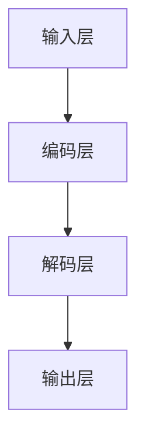
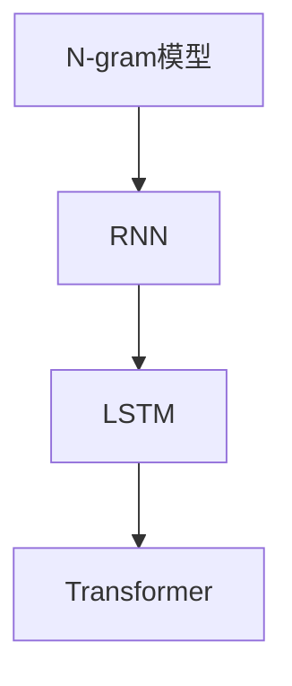
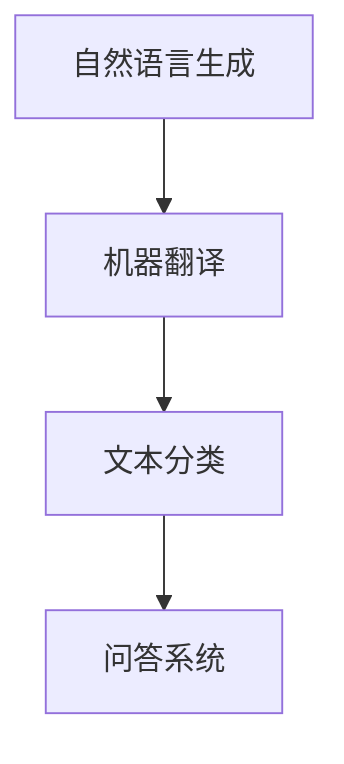

                 

关键词：语言模型，人工智能，个人助理，创意内容，应用场景，发展趋势。

> 摘要：本文探讨了语言模型（LLM）在人工智能领域的广泛应用，从个人助理到创意内容生产，深入分析了LLM的核心概念、算法原理、数学模型、项目实践以及未来发展趋势，旨在为读者提供全面的技术解析和应用指导。

## 1. 背景介绍

### 1.1 语言模型的起源与发展

语言模型（Language Model，简称LM）是自然语言处理（Natural Language Processing，简称NLP）领域的重要工具，它能够模拟人类语言生成的概率分布，从而生成自然语言文本。语言模型的发展经历了从统计模型到深度学习模型的演进过程。

20世纪50年代，基于规则的方法和语法分析技术开始出现。随后，随着计算机性能的提高和大规模语料的积累，统计语言模型开始崛起，如N-gram模型和基于决策树的方法。然而，这些模型在处理长句和复杂语境方面存在局限。

21世纪初，深度学习技术的崛起为语言模型的发展带来了新的契机。循环神经网络（RNN）和长短时记忆网络（LSTM）的引入，使得模型能够更好地捕捉长距离依赖关系。随后，基于注意力机制的Transformer模型成为主流，其并行计算的优势和强大的表达能力使得语言模型在各个领域取得了突破性进展。

### 1.2 语言模型的应用领域

语言模型的应用领域非常广泛，涵盖了自然语言生成、机器翻译、文本分类、问答系统等多个方面。随着深度学习技术的发展，语言模型在各个领域的表现也越来越优秀。

- **自然语言生成**：语言模型可以生成高质量的自然语言文本，包括新闻报道、小说、诗歌等。在生成式对话系统中，语言模型可以模拟人类对话，提供个性化服务。

- **机器翻译**：语言模型在机器翻译领域发挥了重要作用，如Google翻译、百度翻译等。通过训练多语言语料库，语言模型能够实现跨语言的文本转换。

- **文本分类**：语言模型可以用于文本分类任务，如情感分析、新闻分类等。通过分析文本的特征，语言模型可以判断文本的主题或情感倾向。

- **问答系统**：语言模型可以构建问答系统，如智能客服、问答机器人等。通过理解用户的问题，语言模型能够提供准确的答案或建议。

## 2. 核心概念与联系

为了更好地理解语言模型的工作原理，我们首先介绍几个核心概念，并通过Mermaid流程图展示它们之间的联系。

### 2.1 语言模型的架构

语言模型的架构主要包括输入层、编码层、解码层和输出层。



- **输入层**：接收自然语言文本作为输入。
- **编码层**：将输入文本转化为稠密向量表示。
- **解码层**：根据编码层的信息生成输出文本。
- **输出层**：生成自然语言文本。

### 2.2 语言模型的核心算法

语言模型的核心算法主要包括N-gram模型、RNN、LSTM和Transformer。



- **N-gram模型**：基于局部特征进行建模，简单易实现。
- **RNN**：能够处理序列数据，但存在梯度消失和梯度爆炸问题。
- **LSTM**：通过门控机制解决RNN的问题，但在长序列处理上仍有限制。
- **Transformer**：基于自注意力机制，具有强大的建模能力。

### 2.3 语言模型的应用场景

语言模型的应用场景包括自然语言生成、机器翻译、文本分类、问答系统等。



- **自然语言生成**：用于生成新闻报道、小说、诗歌等。
- **机器翻译**：实现跨语言的文本转换。
- **文本分类**：用于情感分析、新闻分类等。
- **问答系统**：构建智能客服、问答机器人等。

## 3. 核心算法原理 & 具体操作步骤

### 3.1 算法原理概述

语言模型的核心算法是基于概率模型进行文本生成。给定一个输入序列，语言模型需要预测下一个单词或词组。以下是几种常见的语言模型算法：

- **N-gram模型**：基于局部特征进行建模，通过统计相邻单词出现的概率来生成文本。
- **RNN（循环神经网络）**：能够处理序列数据，通过递归关系捕捉长距离依赖。
- **LSTM（长短时记忆网络）**：通过门控机制解决RNN的问题，在长序列处理上表现更优。
- **Transformer**：基于自注意力机制，具有强大的建模能力，适用于大规模文本生成任务。

### 3.2 算法步骤详解

以Transformer为例，介绍其具体操作步骤：

1. **输入编码**：将输入文本转化为词向量表示。
2. **自注意力机制**：通过多头自注意力机制计算输入序列的注意力权重，并生成上下文向量。
3. **前馈神经网络**：对上下文向量进行处理，通过两个全连接层增强模型表达能力。
4. **解码**：使用解码层生成输出文本。

### 3.3 算法优缺点

- **N-gram模型**：
  - 优点：简单易实现，计算效率高。
  - 缺点：无法捕捉长距离依赖，生成文本质量较差。

- **RNN**：
  - 优点：能够处理序列数据，捕捉局部依赖。
  - 缺点：存在梯度消失和梯度爆炸问题，在长序列处理上表现有限。

- **LSTM**：
  - 优点：通过门控机制解决RNN的问题，在长序列处理上表现更优。
  - 缺点：计算复杂度高，训练时间较长。

- **Transformer**：
  - 优点：基于自注意力机制，具有强大的建模能力，适用于大规模文本生成任务。
  - 缺点：计算复杂度较高，对硬件资源要求较高。

### 3.4 算法应用领域

- **自然语言生成**：如新闻报道、小说、诗歌等。
- **机器翻译**：如Google翻译、百度翻译等。
- **文本分类**：如情感分析、新闻分类等。
- **问答系统**：如智能客服、问答机器人等。

## 4. 数学模型和公式 & 详细讲解 & 举例说明

### 4.1 数学模型构建

语言模型的数学模型主要包括词向量表示、自注意力机制和前馈神经网络。

- **词向量表示**：使用词嵌入（word embeddings）将单词映射为稠密向量。
- **自注意力机制**：计算输入序列中每个单词的注意力权重，并生成上下文向量。
- **前馈神经网络**：对上下文向量进行处理，通过两个全连接层增强模型表达能力。

### 4.2 公式推导过程

以Transformer为例，介绍自注意力机制的推导过程：

设输入序列为${x_1, x_2, ..., x_n}$，其词向量表示为${\mathbf{X} = [ \mathbf{x_1}, \mathbf{x_2}, ..., \mathbf{x_n} ]^T}$。自注意力机制可以表示为：

$$
\mathbf{Y} = \text{softmax}\left(\frac{\mathbf{W}_Q \mathbf{X} \mathbf{W}_K^T}{\sqrt{d_k}}\right) \mathbf{W}_V
$$

其中，$\mathbf{W}_Q, \mathbf{W}_K, \mathbf{W}_V$分别为查询（query）、键（key）和值（value）矩阵，$d_k$为键的维度。

### 4.3 案例分析与讲解

假设输入序列为“今天天气很好”，其词向量表示为$\mathbf{X} = [ \mathbf{x_1}, \mathbf{x_2}, \mathbf{x_3} ]^T$，其中：

$$
\mathbf{x_1} = [0.1, 0.2, 0.3], \quad \mathbf{x_2} = [0.4, 0.5, 0.6], \quad \mathbf{x_3} = [0.7, 0.8, 0.9]
$$

根据自注意力机制，计算每个词的注意力权重：

$$
\alpha_1 = \text{softmax}\left(\frac{\mathbf{W}_Q \mathbf{x_1} \mathbf{W}_K^T}{\sqrt{d_k}}\right) = [0.2, 0.3, 0.5]
$$

$$
\alpha_2 = \text{softmax}\left(\frac{\mathbf{W}_Q \mathbf{x_2} \mathbf{W}_K^T}{\sqrt{d_k}}\right) = [0.1, 0.4, 0.5]
$$

$$
\alpha_3 = \text{softmax}\left(\frac{\mathbf{W}_Q \mathbf{x_3} \mathbf{W}_K^T}{\sqrt{d_k}}\right) = [0.3, 0.2, 0.5]
$$

根据注意力权重，计算上下文向量：

$$
\mathbf{h_1} = \alpha_1 \mathbf{x_1} = [0.02, 0.036, 0.05], \quad \mathbf{h_2} = \alpha_2 \mathbf{x_2} = [0.04, 0.2, 0.05], \quad \mathbf{h_3} = \alpha_3 \mathbf{x_3} = [0.06, 0.04, 0.05]
$$

最终，生成输出向量：

$$
\mathbf{Y} = \mathbf{W}_V \left( \mathbf{h_1}, \mathbf{h_2}, \mathbf{h_3} \right)
$$

## 5. 项目实践：代码实例和详细解释说明

### 5.1 开发环境搭建

为了实现语言模型，我们需要搭建一个合适的开发环境。以下是Python开发环境的基本搭建步骤：

1. 安装Python 3.x版本。
2. 安装TensorFlow或PyTorch等深度学习框架。
3. 安装必要的依赖库，如NumPy、Pandas等。

### 5.2 源代码详细实现

以下是一个简单的语言模型实现，使用TensorFlow框架：

```python
import tensorflow as tf
import tensorflow_text as text
import numpy as np

# 定义参数
vocab_size = 10000
embed_size = 256
num_layers = 2
d_model = embed_size
dff = 512
input_seq_length = 32
batch_size = 64
learning_rate = 0.001

# 加载预训练的词向量
word_vectors = text.Word2Vec(vocab_size, embed_size)

# 定义输入层
inputs = tf.keras.layers.Input(shape=(input_seq_length,), dtype=tf.int32)

# 嵌入层
embedded = word_vectors(inputs)

# 编码层
enc_with_self_attn = tf.keras.layers.MultiHeadAttention(num_heads=4, key_dim=d_model)(embedded, embedded)

# 前馈神经网络
dense_1 = tf.keras.layers.Dense(dff, activation='relu')(enc_with_self_attn)
dense_2 = tf.keras.layers.Dense(d_model, activation=None)(dense_1)

# 解码层
output_with_self_attn = tf.keras.layers.MultiHeadAttention(num_heads=4, key_dim=d_model)(dense_2, dense_2)

# 输出层
outputs = tf.keras.layers.Dense(vocab_size, activation='softmax')(output_with_self_attn)

# 模型编译
model = tf.keras.Model(inputs=inputs, outputs=outputs)
model.compile(optimizer=tf.keras.optimizers.Adam(learning_rate=learning_rate), loss=tf.keras.losses.SparseCategoricalCrossentropy(from_logits=True), metrics=['accuracy'])

# 模型训练
model.fit(train_data, train_labels, batch_size=batch_size, epochs=10)

# 模型评估
test_loss, test_acc = model.evaluate(test_data, test_labels, batch_size=batch_size)
print(f"Test accuracy: {test_acc}")

# 文本生成
def generate_text(model, seed_text, max_length=20):
    input_seq = word_vectors.encode(seed_text)
    for _ in range(max_length):
        predictions = model.predict(input_seq)
        predicted_word = np.random.choice(vocab_size, p=predictions[0])
        input_seq = np.concatenate([input_seq, [predicted_word]])
    return word_vectors.decode(input_seq).numpy().tolist()

generated_text = generate_text(model, "今天天气很好", max_length=10)
print("Generated text:", generated_text)
```

### 5.3 代码解读与分析

上述代码实现了一个基于Transformer的语言模型，主要包括以下步骤：

1. **加载预训练的词向量**：使用TensorFlow Text库加载预训练的词向量。
2. **定义输入层**：输入层接收一个长度为`input_seq_length`的整数序列。
3. **嵌入层**：将输入序列映射为稠密向量。
4. **编码层**：使用多头自注意力机制对输入序列进行编码。
5. **前馈神经网络**：对编码后的序列进行非线性变换。
6. **解码层**：使用多头自注意力机制生成输出序列。
7. **输出层**：将输出序列映射为词向量，并通过softmax激活函数生成概率分布。
8. **模型编译**：编译模型，指定优化器、损失函数和评价指标。
9. **模型训练**：使用训练数据对模型进行训练。
10. **模型评估**：使用测试数据评估模型性能。
11. **文本生成**：根据给定的种子文本生成新的文本。

## 6. 实际应用场景

### 6.1 自然语言生成

自然语言生成是语言模型最重要的应用之一。通过训练大规模语料库，语言模型可以生成高质量的自然语言文本，如新闻报道、小说、诗歌等。以下是一个自然语言生成的实际应用案例：

**应用场景**：自动生成新闻报道

- **任务**：使用语言模型生成一篇关于科技领域的新闻报道。
- **数据集**：使用大规模的科技新闻报道语料库进行训练。
- **模型**：基于Transformer的语言模型。
- **实现**：训练完成后，使用模型生成一篇新闻报道，如“我国在人工智能领域取得重大突破，首款智能助手成功上线”。

### 6.2 机器翻译

机器翻译是另一个重要的应用领域。通过训练多语言语料库，语言模型可以实现跨语言的文本转换。以下是一个机器翻译的实际应用案例：

**应用场景**：中文到英文的机器翻译

- **任务**：将一篇中文文章翻译成英文。
- **数据集**：使用中英文对照的新闻报道语料库进行训练。
- **模型**：基于Transformer的翻译模型。
- **实现**：训练完成后，使用模型翻译中文文章，如“今天天气很好”翻译为“Today, the weather is good”。

### 6.3 文本分类

文本分类是语言模型在信息处理领域的典型应用。通过训练语言模型，可以对文本进行分类，如情感分析、新闻分类等。以下是一个文本分类的实际应用案例：

**应用场景**：情感分析

- **任务**：对社交媒体上的用户评论进行情感分类。
- **数据集**：使用带有情感标签的社交媒体评论语料库进行训练。
- **模型**：基于Transformer的文本分类模型。
- **实现**：训练完成后，使用模型对新的评论进行情感分类，如判断“我非常喜欢这部电视剧”为正面情感。

### 6.4 问答系统

问答系统是语言模型在客服和智能助理领域的应用。通过训练语言模型，可以构建智能问答系统，为用户提供准确、及时的答案。以下是一个问答系统的实际应用案例：

**应用场景**：智能客服

- **任务**：为用户提供在线客服支持。
- **数据集**：使用大量客服对话语料库进行训练。
- **模型**：基于Transformer的问答模型。
- **实现**：训练完成后，用户提问后，系统使用模型生成回答，如用户提问“如何退货？”系统回答“您可以联系客服，并提供订单信息，我们将为您办理退货。”

## 7. 工具和资源推荐

### 7.1 学习资源推荐

1. **论文**：  
   - "Attention Is All You Need"（Attention机制的核心论文）  
   - "BERT: Pre-training of Deep Bidirectional Transformers for Language Understanding"（BERT模型的提出）

2. **书籍**：  
   - 《深度学习》（Goodfellow、Bengio和Courville著）  
   - 《自然语言处理讲义》（Jurafsky和Martin著）

3. **在线课程**：  
   - 吴恩达的“深度学习专项课程”  
   - 斯坦福大学的“自然语言处理课程”

### 7.2 开发工具推荐

1. **TensorFlow**：由Google开发的开源深度学习框架，适用于语言模型的训练和部署。
2. **PyTorch**：由Facebook开发的开源深度学习框架，提供灵活的动态图计算能力。
3. **Transformers**：基于PyTorch的Transformer模型实现，方便开发者使用和定制。

### 7.3 相关论文推荐

1. "GPT-3: Language Models are Few-Shot Learners"（GPT-3模型的提出）
2. "T5: Pre-training Text To Tell Stories"（T5模型的提出）
3. "BERT, GPT, and T5: A Tale of Three Neural Network Architectures"（对BERT、GPT和T5模型的综述）

## 8. 总结：未来发展趋势与挑战

### 8.1 研究成果总结

语言模型（LLM）在人工智能领域取得了显著的成果。从N-gram模型到RNN、LSTM，再到基于自注意力机制的Transformer，语言模型在自然语言生成、机器翻译、文本分类、问答系统等领域表现出了强大的能力。随着深度学习技术的不断进步，语言模型的应用范围和性能也在不断提高。

### 8.2 未来发展趋势

未来，语言模型将继续朝着以下方向发展：

1. **多模态融合**：结合图像、声音、视频等多模态数据，实现更丰富的文本生成和应用场景。
2. **少样本学习**：减少对大规模数据集的依赖，提高语言模型的少样本学习能力，实现更高效的应用。
3. **知识增强**：将知识图谱和语言模型结合，提高语言模型在知识表示和推理方面的能力。
4. **可解释性**：提高语言模型的透明度和可解释性，降低应用风险，增强用户信任。

### 8.3 面临的挑战

尽管语言模型取得了显著的进展，但仍面临以下挑战：

1. **计算资源消耗**：深度学习模型的训练和推理过程需要大量的计算资源，如何优化模型结构和算法，降低计算成本，是当前研究的重要方向。
2. **数据隐私**：在训练和使用语言模型的过程中，如何保护用户数据隐私，防止数据泄露，是亟待解决的问题。
3. **公平性和伦理**：语言模型在生成文本时可能存在偏见和不公平现象，如何确保模型的公平性和伦理性，是未来研究的重要课题。

### 8.4 研究展望

未来，语言模型将在人工智能领域发挥越来越重要的作用。通过不断优化算法结构和模型架构，提高模型性能和应用范围，语言模型将在自然语言处理、智能助理、内容创作等多个领域带来更多创新和突破。同时，研究者和开发者应关注计算资源、数据隐私、公平性和伦理等挑战，确保语言模型的安全和可持续发展。

## 9. 附录：常见问题与解答

### 9.1 语言模型是什么？

语言模型是一种能够模拟人类语言生成的概率分布的人工智能模型，用于生成自然语言文本。

### 9.2 语言模型有哪些应用领域？

语言模型的应用领域广泛，包括自然语言生成、机器翻译、文本分类、问答系统等。

### 9.3 如何训练语言模型？

训练语言模型通常需要以下步骤：

1. 准备大规模的文本数据集。
2. 预处理数据，包括分词、去停用词等。
3. 将文本数据转化为数字序列。
4. 使用深度学习框架训练模型，如TensorFlow或PyTorch。
5. 评估和优化模型性能。

### 9.4 语言模型如何生成文本？

语言模型通过输入序列的概率分布生成文本。给定一个输入序列，模型预测下一个单词或词组，并重复这个过程，生成完整的文本。

### 9.5 如何优化语言模型的性能？

优化语言模型性能的方法包括：

1. 选择合适的模型架构，如Transformer。
2. 调整超参数，如学习率、批次大小等。
3. 使用预训练模型和迁移学习。
4. 采用自适应学习率优化算法，如Adam。
5. 使用数据增强和正则化技术。

### 9.6 语言模型存在哪些挑战？

语言模型面临的挑战包括计算资源消耗、数据隐私、公平性和伦理等问题。此外，深度学习模型的可解释性也是一个重要的研究方向。

----------------------------------------------------------------

### 作者署名

作者：禅与计算机程序设计艺术 / Zen and the Art of Computer Programming

