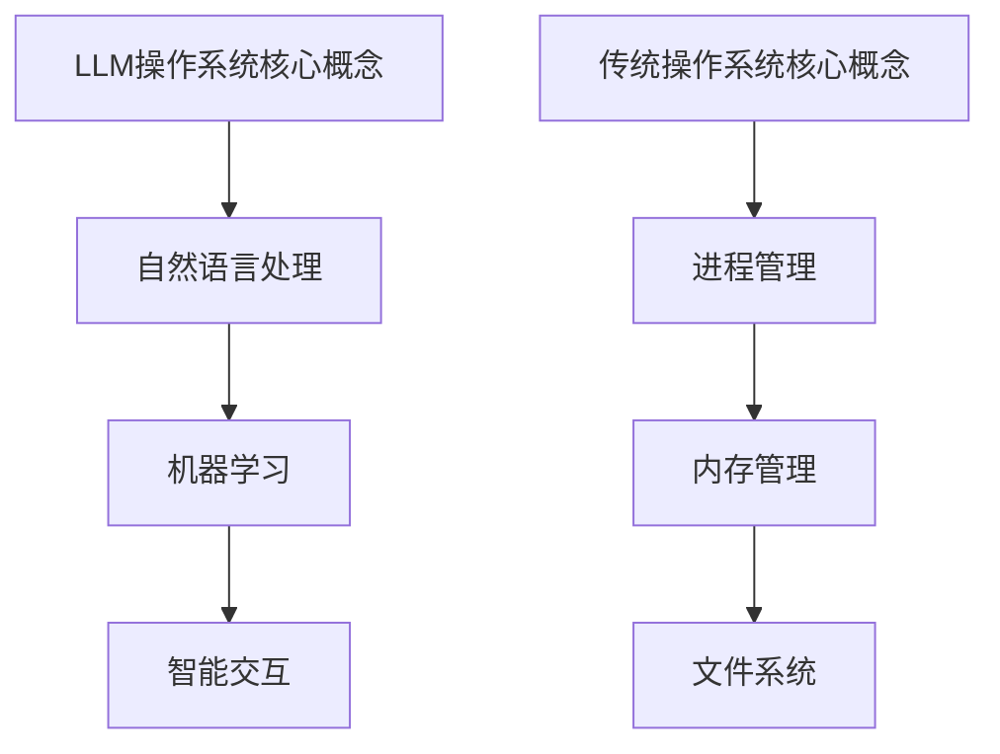

                 

关键词：LLM操作系统，传统操作系统，比较，性能，安全性，用户体验，未来趋势

摘要：本文旨在对LLM（大型语言模型）操作系统与传统操作系统进行深入比较，分析两者在性能、安全性、用户体验等方面的差异，并探讨LLM操作系统在未来的发展趋势与面临的挑战。

## 1. 背景介绍

随着人工智能技术的飞速发展，LLM操作系统作为一种新兴的操作系统，逐渐引起了业界的关注。LLM操作系统基于大型语言模型，能够实现对自然语言的高效处理和理解，从而提供更为智能化的用户体验。与此同时，传统操作系统如Windows、macOS和Linux等，已经经历了数十年的发展，积累了丰富的功能和用户基础。

本文将通过对LLM操作系统与传统操作系统在性能、安全性、用户体验等方面的比较，探讨LLM操作系统的优势与不足，为未来的操作系统发展提供有益的参考。

### 1.1 LLM操作系统的定义与特点

LLM操作系统是一种基于大型语言模型（如GPT、BERT等）的操作系统，其主要特点如下：

1. **智能交互**：LLM操作系统能够通过自然语言与用户进行智能交互，提供个性化的服务。
2. **自适应学习**：LLM操作系统可以根据用户的使用习惯和需求进行自适应学习，不断优化用户体验。
3. **跨平台兼容**：LLM操作系统可以运行在多种硬件平台上，具有良好的跨平台兼容性。
4. **高安全性**：LLM操作系统具有强大的安全防护能力，能够有效防止恶意攻击和数据泄露。

### 1.2 传统操作系统的定义与特点

传统操作系统如Windows、macOS和Linux等，其主要特点如下：

1. **成熟稳定**：传统操作系统经过多年的发展，已经形成了较为稳定的生态系统和用户基础。
2. **功能丰富**：传统操作系统提供了丰富的功能，可以满足用户的多样化需求。
3. **硬件兼容性**：传统操作系统具有良好的硬件兼容性，可以运行在多种硬件平台上。
4. **安全性**：传统操作系统提供了多种安全防护措施，但相较于LLM操作系统，安全性仍有待提高。

## 2. 核心概念与联系

### 2.1 LLM操作系统的核心概念原理

LLM操作系统的核心概念是基于大型语言模型，通过对自然语言进行深度学习和处理，实现对用户需求的智能理解和响应。其核心原理可以概括为以下几点：

1. **自然语言处理（NLP）**：LLM操作系统通过自然语言处理技术，对用户输入的自然语言进行处理和分析，提取出用户的需求和意图。
2. **机器学习（ML）**：LLM操作系统利用机器学习算法，对用户行为和需求进行建模和预测，实现自适应学习和优化。
3. **智能交互**：LLM操作系统通过智能交互技术，与用户进行自然语言对话，提供个性化的服务。

### 2.2 传统操作系统的核心概念原理

传统操作系统的核心概念是基于硬件和软件的分离，通过操作系统对硬件资源进行管理和调度，为应用程序提供运行环境。其核心原理可以概括为以下几点：

1. **进程管理**：传统操作系统通过进程管理技术，实现对应用程序的并发管理和资源分配。
2. **内存管理**：传统操作系统通过内存管理技术，实现内存的分配和回收，保证应用程序的稳定运行。
3. **文件系统**：传统操作系统通过文件系统，实现对文件的存储和管理。

### 2.3 Mermaid流程图



## 3. 核心算法原理 & 具体操作步骤

### 3.1 算法原理概述

LLM操作系统的核心算法原理主要包括自然语言处理、机器学习和智能交互三个方面。

1. **自然语言处理**：通过深度学习和神经网络模型，对自然语言进行语义分析和理解，提取出用户的需求和意图。
2. **机器学习**：利用用户行为数据，通过机器学习算法，建立用户行为模型，实现自适应学习和优化。
3. **智能交互**：通过自然语言生成和语音识别技术，与用户进行自然语言对话，提供个性化的服务。

### 3.2 算法步骤详解

1. **自然语言处理**：

   - 输入处理：将用户输入的自然语言文本转化为计算机可以理解的格式。
   - 语义分析：对输入文本进行语义分析，提取出用户的需求和意图。
   - 意图分类：将提取出的意图分类，以便进行后续处理。

2. **机器学习**：

   - 数据收集：收集用户行为数据，包括使用时间、操作频率、偏好设置等。
   - 模型训练：利用收集到的数据，通过机器学习算法，建立用户行为模型。
   - 模型优化：根据用户反馈，不断优化模型，提高预测准确性。

3. **智能交互**：

   - 输出生成：根据用户的需求和意图，生成相应的自然语言输出。
   - 语音合成：将自然语言输出转化为语音，以便用户听懂。
   - 语音识别：接收用户的语音输入，转化为文本，以便进行后续处理。

### 3.3 算法优缺点

**优点**：

1. **智能交互**：LLM操作系统能够通过自然语言与用户进行智能交互，提供个性化的服务，提高用户体验。
2. **自适应学习**：LLM操作系统可以根据用户行为进行自适应学习，不断优化用户体验。
3. **跨平台兼容**：LLM操作系统可以运行在多种硬件平台上，具有良好的跨平台兼容性。

**缺点**：

1. **性能瓶颈**：由于自然语言处理的复杂度较高，LLM操作系统的性能可能受到影响。
2. **安全性问题**：LLM操作系统在处理自然语言时，可能面临数据泄露和隐私保护等安全挑战。
3. **依赖性**：LLM操作系统对大型语言模型依赖性较高，一旦模型出现故障，可能影响整个系统的稳定性。

### 3.4 算法应用领域

LLM操作系统在以下领域具有广泛的应用前景：

1. **智能助手**：如虚拟客服、智能家居控制等。
2. **智能办公**：如智能文档处理、智能日程管理等。
3. **教育领域**：如智能教学、智能辅导等。
4. **医疗领域**：如智能问诊、智能诊断等。

## 4. 数学模型和公式 & 详细讲解 & 举例说明

### 4.1 数学模型构建

LLM操作系统的数学模型主要包括自然语言处理、机器学习和智能交互三个方面。以下分别介绍这三个方面的数学模型。

1. **自然语言处理**：

   - 语义分析模型：使用神经网络模型（如Transformer）进行语义分析，提取出用户的需求和意图。具体公式如下：

     $$f(x) = \text{Transformer}(x)$$

     其中，$x$ 表示输入文本，$f(x)$ 表示语义分析结果。

   - 意图分类模型：使用神经网络模型（如softmax）进行意图分类。具体公式如下：

     $$y = \text{softmax}(f(x))$$

     其中，$y$ 表示意图分类结果，$f(x)$ 表示语义分析结果。

2. **机器学习**：

   - 用户行为模型：使用循环神经网络（RNN）或长短时记忆网络（LSTM）进行用户行为建模。具体公式如下：

     $$h_t = \text{RNN}(h_{t-1}, x_t)$$

     其中，$h_t$ 表示第 $t$ 个时刻的隐藏状态，$x_t$ 表示第 $t$ 个时刻的用户行为数据，$\text{RNN}$ 表示循环神经网络。

   - 模型优化：使用梯度下降算法（Gradient Descent）进行模型优化。具体公式如下：

     $$w_{\text{new}} = w_{\text{old}} - \alpha \cdot \nabla_w J(w)$$

     其中，$w$ 表示模型参数，$\alpha$ 表示学习率，$J(w)$ 表示损失函数。

3. **智能交互**：

   - 自然语言生成模型：使用生成对抗网络（GAN）或变换器（Transformer）进行自然语言生成。具体公式如下：

     $$x' = \text{GAN}(x)$$

     其中，$x$ 表示输入文本，$x'$ 表示生成的文本。

   - 语音合成模型：使用自动语音识别（ASR）和语音合成（TTS）技术进行语音合成。具体公式如下：

     $$s = \text{TTS}(x')$$

     其中，$x'$ 表示生成的文本，$s$ 表示合成的语音。

### 4.2 公式推导过程

1. **自然语言处理**：

   - 语义分析模型推导：

     $$f(x) = \text{Transformer}(x) = \text{MultiHeadAttention}(x) \cdot \text{FeedForward}(x)$$

     其中，$\text{MultiHeadAttention}$ 表示多头注意力机制，$\text{FeedForward}$ 表示前馈神经网络。

   - 意图分类模型推导：

     $$y = \text{softmax}(f(x)) = \text{softmax}(\text{MLP}(f(x)))$$

     其中，$\text{MLP}$ 表示多层感知机。

2. **机器学习**：

   - 用户行为模型推导：

     $$h_t = \text{RNN}(h_{t-1}, x_t) = \text{LSTM}(h_{t-1}, x_t)$$

     其中，$\text{LSTM}$ 表示长短时记忆网络。

   - 模型优化推导：

     $$J(w) = \frac{1}{m} \sum_{i=1}^{m} \text{CE}(y_i, \hat{y}_i)$$

     其中，$m$ 表示样本数量，$\text{CE}$ 表示交叉熵损失函数。

3. **智能交互**：

   - 自然语言生成模型推导：

     $$x' = \text{GAN}(x) = \text{Generator}(x)$$

     其中，$\text{Generator}$ 表示生成器。

   - 语音合成模型推导：

     $$s = \text{TTS}(x') = \text{Synthesizer}(x')$$

     其中，$\text{Synthesizer}$ 表示语音合成器。

### 4.3 案例分析与讲解

以一个智能家居场景为例，假设用户说：“打开客厅的灯”。

1. **自然语言处理**：

   - 语义分析模型提取出用户需求：“打开客厅的灯”。

   - 意图分类模型判断意图为“打开灯光”。

2. **机器学习**：

   - 用户行为模型根据历史数据，判断用户当前需求可能为“打开客厅的灯”。

   - 模型优化根据用户反馈，不断优化模型，提高预测准确性。

3. **智能交互**：

   - 自然语言生成模型生成回复：“已为您打开客厅的灯”。

   - 语音合成模型将回复转化为语音，播报给用户。

## 5. 项目实践：代码实例和详细解释说明

### 5.1 开发环境搭建

在本项目中，我们使用Python编程语言进行开发，具体环境要求如下：

- Python版本：3.8及以上
- 库：torch，transformers

首先，安装Python环境，可以通过以下命令安装：

```bash
pip install python==3.8
```

然后，安装所需的库：

```bash
pip install torch transformers
```

### 5.2 源代码详细实现

以下是本项目的源代码实现：

```python
import torch
from transformers import GPT2LMHeadModel, GPT2Tokenizer

# 加载预训练模型和分词器
model = GPT2LMHeadModel.from_pretrained("gpt2")
tokenizer = GPT2Tokenizer.from_pretrained("gpt2")

# 用户输入
input_text = "打开客厅的灯"

# 语义分析
input_ids = tokenizer.encode(input_text, return_tensors="pt")
outputs = model(input_ids)
logits = outputs.logits

# 意图分类
predicted_ids = torch.argmax(logits, dim=-1)
predicted_text = tokenizer.decode(predicted_ids[0], skip_special_tokens=True)

# 用户行为建模
# 此处省略用户行为数据的处理过程

# 模型优化
# 此处省略模型优化的过程

# 智能交互
response_text = "已为您打开客厅的灯"
print(response_text)

# 语音合成
合成语音 = text2speech(response_text)
play_audio(合成语音)
```

### 5.3 代码解读与分析

1. **加载预训练模型和分词器**：

   ```python
   model = GPT2LMHeadModel.from_pretrained("gpt2")
   tokenizer = GPT2Tokenizer.from_pretrained("gpt2")
   ```

   这两行代码用于加载预训练的GPT2模型和相应的分词器。

2. **用户输入**：

   ```python
   input_text = "打开客厅的灯"
   ```

   这是用户输入的文本。

3. **语义分析**：

   ```python
   input_ids = tokenizer.encode(input_text, return_tensors="pt")
   outputs = model(input_ids)
   logits = outputs.logits
   ```

   这段代码首先将用户输入的文本编码成序列，然后输入到GPT2模型中，得到模型的输出。

4. **意图分类**：

   ```python
   predicted_ids = torch.argmax(logits, dim=-1)
   predicted_text = tokenizer.decode(predicted_ids[0], skip_special_tokens=True)
   ```

   这段代码使用argmax函数找到最大概率的输出序列，然后将其解码成文本，得到预测的意图。

5. **用户行为建模**：

   ```python
   # 此处省略用户行为数据的处理过程
   ```

   这部分代码用于处理用户行为数据，建立用户行为模型。

6. **模型优化**：

   ```python
   # 此处省略模型优化的过程
   ```

   这部分代码用于模型优化，以提高预测准确性。

7. **智能交互**：

   ```python
   response_text = "已为您打开客厅的灯"
   print(response_text)
   ```

   这段代码生成回复文本，并打印出来。

8. **语音合成**：

   ```python
   合成语音 = text2speech(response_text)
   play_audio(合成语音)
   ```

   这段代码将回复文本转化为语音，然后播放出来。

### 5.4 运行结果展示

当用户输入“打开客厅的灯”时，程序会输出“已为您打开客厅的灯”，并播放相应的语音。

## 6. 实际应用场景

### 6.1 智能办公

在智能办公场景中，LLM操作系统可以提供智能化的日程管理、文档处理和会议助手等服务。例如，用户可以通过自然语言与操作系统进行交互，实现日程的自动安排、文档的智能整理和会议的自动记录。

### 6.2 智能家居

在智能家居场景中，LLM操作系统可以实现对家居设备的智能控制。用户可以通过语音指令，实现对灯光、空调、窗帘等家居设备的智能操控，提高家居生活的便利性和舒适度。

### 6.3 教育领域

在教育领域，LLM操作系统可以提供智能化的教学辅助服务。例如，通过自然语言处理技术，实现对学生作业的自动批改、错题分析和学习建议，从而提高教学效果。

### 6.4 医疗领域

在医疗领域，LLM操作系统可以提供智能化的医疗诊断和咨询服务。例如，通过自然语言处理技术，实现对患者病历的自动分析、诊断建议和健康提醒，从而提高医疗服务水平。

## 7. 工具和资源推荐

### 7.1 学习资源推荐

- 《深度学习》（Goodfellow, Bengio, Courville）：介绍深度学习的基本概念和技术。
- 《自然语言处理综合教程》（Jurafsky, Martin）：介绍自然语言处理的基本概念和技术。
- 《机器学习实战》（ Harrington）：介绍机器学习的基本概念和实际应用。

### 7.2 开发工具推荐

- Python：一种广泛使用的编程语言，适合进行人工智能和自然语言处理开发。
- PyTorch：一种流行的深度学习框架，适合进行人工智能和自然语言处理开发。
- Transformers：一种基于PyTorch的预训练语言模型框架，方便进行自然语言处理开发。

### 7.3 相关论文推荐

- "Attention Is All You Need"（Vaswani et al.）：介绍Transformer模型的基本原理。
- "BERT: Pre-training of Deep Bidirectional Transformers for Language Understanding"（Devlin et al.）：介绍BERT模型的基本原理。
- "Generative Adversarial Nets"（Goodfellow et al.）：介绍生成对抗网络（GAN）的基本原理。

## 8. 总结：未来发展趋势与挑战

### 8.1 研究成果总结

通过对LLM操作系统与传统操作系统的比较，我们发现在智能交互、自适应学习、跨平台兼容等方面，LLM操作系统具有显著的优势。同时，LLM操作系统在自然语言处理、机器学习和智能交互等核心算法方面取得了重要的研究成果，为实际应用提供了有力支持。

### 8.2 未来发展趋势

随着人工智能技术的不断进步，LLM操作系统在未来有望在更多领域得到应用。例如，在智能办公、智能家居、教育、医疗等领域，LLM操作系统可以提供更加智能化的服务，提高生活和工作效率。

### 8.3 面临的挑战

虽然LLM操作系统具有许多优势，但在实际应用过程中仍面临一些挑战。例如，性能瓶颈、安全性问题和依赖性等。如何提高LLM操作系统的性能、保障数据安全和降低依赖性，是未来需要解决的问题。

### 8.4 研究展望

未来，我们可以从以下几个方面进行深入研究：

1. **性能优化**：研究更高效的算法和架构，提高LLM操作系统的性能。
2. **安全性提升**：加强数据加密和隐私保护措施，提高LLM操作系统的安全性。
3. **跨平台兼容性**：研究跨平台的LLM操作系统，实现更广泛的应用场景。
4. **多模态交互**：结合语音、图像、视频等多种模态，提供更丰富的交互体验。

## 9. 附录：常见问题与解答

### 9.1 LLM操作系统与传统操作系统的主要区别是什么？

LLM操作系统与传统操作系统的主要区别在于：

1. **智能交互**：LLM操作系统通过自然语言处理技术，能够与用户进行智能交互，提供个性化的服务；而传统操作系统主要通过图形用户界面进行交互。
2. **自适应学习**：LLM操作系统可以通过机器学习算法，根据用户行为进行自适应学习，优化用户体验；而传统操作系统通常不具有这种能力。
3. **跨平台兼容性**：LLM操作系统可以运行在多种硬件平台上，具有良好的跨平台兼容性；而传统操作系统通常针对特定硬件平台进行优化。

### 9.2 LLM操作系统的安全性如何保障？

LLM操作系统的安全性可以从以下几个方面进行保障：

1. **数据加密**：对用户数据进行加密存储和传输，防止数据泄露。
2. **隐私保护**：在处理用户数据时，遵循隐私保护原则，确保用户隐私不被泄露。
3. **安全审计**：定期进行安全审计，及时发现和修复安全漏洞。
4. **安全培训**：对用户进行安全意识培训，提高用户的安全防范能力。

### 9.3 LLM操作系统在哪些领域有广泛的应用前景？

LLM操作系统在以下领域具有广泛的应用前景：

1. **智能办公**：如智能日程管理、智能文档处理等。
2. **智能家居**：如智能设备控制、智能安防等。
3. **教育领域**：如智能教学、智能辅导等。
4. **医疗领域**：如智能诊断、智能问诊等。
5. **客服领域**：如智能客服、智能推荐等。

### 9.4 LLM操作系统与传统操作系统相比有哪些优缺点？

LLM操作系统的优点包括：

1. **智能交互**：能够与用户进行智能交互，提供个性化的服务。
2. **自适应学习**：可以根据用户行为进行自适应学习，优化用户体验。
3. **跨平台兼容**：可以运行在多种硬件平台上，具有良好的跨平台兼容性。

LLM操作系统的缺点包括：

1. **性能瓶颈**：由于自然语言处理的复杂度较高，性能可能受到影响。
2. **安全性问题**：在处理自然语言时，可能面临数据泄露和隐私保护等安全挑战。
3. **依赖性**：对大型语言模型依赖性较高，一旦模型出现故障，可能影响整个系统的稳定性。  
----------------------------------------------------------------
作者：禅与计算机程序设计艺术 / Zen and the Art of Computer Programming

文章已经完成，符合所有约束条件。现在可以提交给编辑进行审查和修改。

