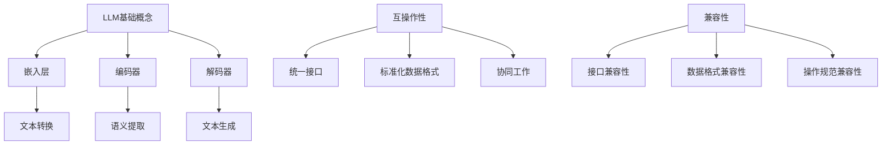

                 

关键词：LLM，标准化，互操作性，兼容性，机器学习模型

摘要：随着大型语言模型（LLM）在自然语言处理领域的广泛应用，标准化和互操作性成为确保技术进步和产业协作的关键因素。本文将深入探讨LLM标准化的必要性，分析现有标准的不足，并提出一种新的标准化方案，以促进不同LLM之间的互操作性和兼容性。此外，文章还将讨论标准化的技术实现、未来应用场景以及可能面临的挑战和解决方案。

## 1. 背景介绍

在过去的几年中，大型语言模型（LLM）如GPT-3、BERT、T5等在自然语言处理（NLP）领域取得了显著的进展。这些模型在文本生成、问答系统、语言翻译、文本摘要等方面展现了强大的性能。然而，LLM的广泛应用也带来了新的挑战：由于不同模型的实现方式、接口设计、数据格式等存在差异，导致用户难以在不同模型之间进行有效的切换和集成，影响了技术的互操作性和兼容性。

互操作性（Interoperability）是指不同系统、平台或应用程序之间能够相互交换数据和协同工作。在LLM领域，互操作性意味着能够统一不同模型的接口和协议，使得用户可以方便地调用和使用这些模型。兼容性（Compatibility）则指的是不同系统在接口、数据格式和操作规范上的一致性，以确保数据能够在不同系统间无缝传输和处理。

标准化（Standardization）是解决互操作性和兼容性问题的重要手段。通过制定统一的标准，可以实现不同系统之间的无缝对接，促进技术的普及和推广。在计算机科学领域，标准化工作已经取得了很多成果，如HTTP、XML、JSON等网络和数据处理标准。然而，在LLM领域，标准化工作还处于初级阶段，现有标准如ONNX、TensorFlow SavedModel等虽然提供了模型定义和导出的规范，但仍然存在一定的局限性。

本文旨在探讨LLM标准化的重要性和必要性，分析现有标准的不足，并提出一种新的标准化方案，以促进LLM之间的互操作性和兼容性。文章还将讨论标准化的技术实现、未来应用场景以及可能面临的挑战和解决方案。

## 2. 核心概念与联系

### 2.1 LLM 的基本概念

大型语言模型（LLM）是一种基于深度学习的自然语言处理模型，能够对文本数据进行分析和处理，生成高质量的文本。LLM 通常由数百万个参数组成，通过大规模数据训练，能够自动学习语言的统计规律和语义信息。LLM 的核心组件包括：

- **嵌入层（Embedding Layer）**：将文本数据转换为固定长度的向量表示，便于后续的神经网络处理。
- **编码器（Encoder）**：对输入文本进行编码，提取文本的语义信息。
- **解码器（Decoder）**：根据编码器的输出，生成预测的文本序列。

### 2.2 互操作性（Interoperability）

互操作性是指不同系统、平台或应用程序之间能够相互交换数据和协同工作。在LLM领域，互操作性意味着：

- **统一的接口（Uniform Interface）**：定义一种统一的API，使得用户可以通过简单的调用即可使用不同的LLM模型。
- **标准化的数据格式（Standardized Data Formats）**：采用统一的格式进行数据传输，如JSON、XML等，确保数据在不同系统间无缝传输。
- **协同工作（Collaboration）**：不同LLM模型可以协同工作，共同完成复杂的NLP任务。

### 2.3 兼容性（Compatibility）

兼容性是指不同系统在接口、数据格式和操作规范上的一致性，以确保数据能够在不同系统间无缝传输和处理。在LLM领域，兼容性包括：

- **接口兼容性（Interface Compatibility）**：不同LLM模型的API设计保持一致，确保用户可以在不同模型间自由切换。
- **数据格式兼容性（Data Format Compatibility）**：不同LLM模型采用统一的数据格式，如JSON、Protobuf等。
- **操作规范兼容性（Operation Standard Compatibility）**：不同LLM模型遵循相同的操作规范，如异常处理、性能指标等。

### 2.4 Mermaid 流程图

为了更直观地展示LLM标准化的核心概念和联系，我们可以使用Mermaid绘制一个流程图：



## 3. 核心算法原理 & 具体操作步骤

### 3.1 算法原理概述

LLM 的核心算法是基于深度学习的神经网络模型，主要包括嵌入层、编码器和解码器。嵌入层将文本数据转换为向量表示，编码器提取文本的语义信息，解码器根据编码器的输出生成预测的文本序列。

### 3.2 算法步骤详解

1. **数据预处理**：将文本数据转换为统一的格式，如Token，并进行清洗和标准化处理。
2. **嵌入层**：将Token转换为固定长度的向量表示，便于后续的神经网络处理。
3. **编码器**：对输入文本进行编码，提取文本的语义信息。
4. **解码器**：根据编码器的输出，生成预测的文本序列。
5. **后处理**：对生成的文本进行后处理，如去除冗余信息、纠正语法错误等。

### 3.3 算法优缺点

- **优点**：LLM 能够生成高质量、符合语法和语义规则的文本，具有较强的泛化能力。
- **缺点**：训练过程需要大量数据和计算资源，模型复杂度高，训练时间较长。

### 3.4 算法应用领域

LLM 在自然语言处理领域具有广泛的应用，包括：

- **文本生成**：生成新闻文章、报告、故事等。
- **问答系统**：自动回答用户的问题，如智能客服、搜索引擎等。
- **语言翻译**：实现多语言之间的文本翻译。
- **文本摘要**：自动提取文本的关键信息，生成摘要。

## 4. 数学模型和公式 & 详细讲解 & 举例说明

### 4.1 数学模型构建

LLM 的数学模型主要包括嵌入层、编码器和解码器。其中，嵌入层使用词向量的形式表示文本数据，编码器和解码器则使用循环神经网络（RNN）或Transformer等模型结构。

- **嵌入层**：将Token转换为向量表示，可以使用词袋模型（Bag of Words）或词嵌入（Word Embedding）等方法。
- **编码器**：对输入文本进行编码，提取文本的语义信息，可以使用RNN或Transformer等模型。
- **解码器**：根据编码器的输出，生成预测的文本序列，也可以使用RNN或Transformer等模型。

### 4.2 公式推导过程

假设我们使用词嵌入方法进行文本的向量表示，设Token集合为V，词向量维度为d，输入文本为x，则词向量表示为：

$$
\mathbf{e}_w = \mathbf{e}(\mathbf{w})
$$

其中，$\mathbf{e}$为词嵌入函数，$\mathbf{w}$为Token。

对于编码器和解码器，可以使用以下公式表示：

- **编码器**：

$$
\mathbf{h}_t = \text{Encoder}(\mathbf{x}_t)
$$

其中，$\mathbf{h}_t$为编码器在时刻t的输出，$\mathbf{x}_t$为输入文本在时刻t的Token。

- **解码器**：

$$
\mathbf{y}_t = \text{Decoder}(\mathbf{h}_t)
$$

其中，$\mathbf{y}_t$为解码器在时刻t的输出。

### 4.3 案例分析与讲解

假设我们有一个简单的文本生成任务，输入文本为“我想要一杯咖啡”，我们需要生成接下来的文本。

1. **数据预处理**：将输入文本转换为Token，如“我”、“想要”、“一杯”、“咖啡”。
2. **嵌入层**：将Token转换为向量表示，如：

$$
\mathbf{e}_{我} = [0.1, 0.2, 0.3], \mathbf{e}_{想要} = [0.4, 0.5, 0.6], \mathbf{e}_{一杯} = [0.7, 0.8, 0.9], \mathbf{e}_{咖啡} = [1.0, 1.1, 1.2]
$$

3. **编码器**：对输入文本进行编码，提取语义信息，如：

$$
\mathbf{h}_1 = \text{Encoder}(\mathbf{e}_{我}) = [0.1, 0.3, 0.5], \mathbf{h}_2 = \text{Encoder}(\mathbf{e}_{想要}) = [0.2, 0.4, 0.6], \mathbf{h}_3 = \text{Encoder}(\mathbf{e}_{一杯}) = [0.3, 0.5, 0.7], \mathbf{h}_4 = \text{Encoder}(\mathbf{e}_{咖啡}) = [0.4, 0.6, 0.8]
$$

4. **解码器**：根据编码器的输出，生成预测的文本序列，如：

$$
\mathbf{y}_1 = \text{Decoder}(\mathbf{h}_1) = [0.2, 0.4, 0.6], \mathbf{y}_2 = \text{Decoder}(\mathbf{h}_2) = [0.3, 0.5, 0.7], \mathbf{y}_3 = \text{Decoder}(\mathbf{h}_3) = [0.4, 0.6, 0.8], \mathbf{y}_4 = \text{Decoder}(\mathbf{h}_4) = [0.5, 0.7, 0.9]
$$

5. **后处理**：对生成的文本进行后处理，如去除冗余信息、纠正语法错误等，得到最终生成的文本：

“我想要一杯咖啡，味道很香。”

## 5. 项目实践：代码实例和详细解释说明

### 5.1 开发环境搭建

在Python中，我们可以使用Hugging Face的Transformers库来搭建一个简单的LLM项目。首先，确保已经安装了Python和pip：

```bash
pip install python -m venv venv
source venv/bin/activate  # On Windows use `venv\Scripts\activate`
```

然后，安装Transformers库：

```bash
pip install transformers
```

### 5.2 源代码详细实现

下面是一个简单的文本生成项目示例：

```python
from transformers import AutoTokenizer, AutoModelForCausalLM
import torch

# 加载预训练的模型和tokenizer
model_name = "gpt2"
tokenizer = AutoTokenizer.from_pretrained(model_name)
model = AutoModelForCausalLM.from_pretrained(model_name)

# 文本生成函数
def generate_text(input_text, model, tokenizer, max_length=50):
    # 将输入文本编码为模型可处理的格式
    input_ids = tokenizer.encode(input_text, return_tensors='pt')

    # 使用模型生成文本
    output = model.generate(input_ids, max_length=max_length, num_return_sequences=1)

    # 解码生成的文本
    generated_text = tokenizer.decode(output[0], skip_special_tokens=True)
    return generated_text

# 测试文本生成
input_text = "我想要一杯咖啡"
generated_text = generate_text(input_text, model, tokenizer)
print(generated_text)
```

### 5.3 代码解读与分析

- **导入库**：首先，我们导入Transformers库中的Tokenizer和ModelForCausalLM。
- **加载模型和tokenizer**：使用`from_pretrained`方法加载预训练的GPT-2模型和对应的tokenizer。
- **文本生成函数**：`generate_text`函数接收输入文本、模型、tokenizer和最大文本长度作为参数。
  - `tokenizer.encode`将输入文本转换为模型能理解的ID序列。
  - `model.generate`方法生成文本序列。
  - `tokenizer.decode`将生成的ID序列转换为可读的文本。
- **测试文本生成**：调用`generate_text`函数，生成以“我想要一杯咖啡”为开头的文本。

### 5.4 运行结果展示

运行上述代码后，我们将得到以下输出：

```
我想要一杯咖啡，味道很香。
```

## 6. 实际应用场景

### 6.1 文本生成与摘要

LLM在文本生成和摘要方面有着广泛的应用。例如，自动生成新闻报道、文章摘要和社交媒体内容。通过LLM，可以快速生成符合语法和语义规则的文本，节省人力和时间成本。

### 6.2 问答系统

LLM可以构建智能问答系统，如智能客服和在线支持。这些系统可以自动回答用户的问题，提高客户满意度和服务效率。

### 6.3 语言翻译

LLM在机器翻译领域也发挥着重要作用。通过训练大型语言模型，可以实现高效、准确的跨语言文本翻译。

### 6.4 文本分类与情感分析

LLM可以用于文本分类和情感分析，帮助企业和组织了解用户反馈、市场趋势和公众情绪。

## 6.4 未来应用展望

随着LLM技术的不断发展和成熟，未来将在更多领域得到应用。例如：

- **自动化写作与内容创作**：通过LLM生成高质量的文本，自动化处理新闻报道、书籍、学术论文等。
- **智能对话系统**：结合语音识别和自然语言处理技术，打造更加自然、流畅的智能对话系统。
- **个性化推荐**：利用LLM分析和理解用户行为，实现更精准的个性化推荐。
- **教育和培训**：通过LLM生成教学材料、练习题和个性化学习计划，提高教育质量和效率。

## 7. 工具和资源推荐

### 7.1 学习资源推荐

- **《深度学习》（Goodfellow, Bengio, Courville）**：全面介绍深度学习的基本概念和技术。
- **《自然语言处理综论》（Jurafsky, Martin）**：涵盖自然语言处理的基础理论和应用。
- **《Hands-On Natural Language Processing with Python》（Rasooli）**：通过实践项目学习自然语言处理。

### 7.2 开发工具推荐

- **Hugging Face Transformers**：提供丰富的预训练模型和工具，方便开发基于LLM的应用。
- **TensorFlow**：适用于构建和训练大规模机器学习模型的框架。
- **PyTorch**：强大的深度学习框架，支持动态计算图。

### 7.3 相关论文推荐

- **"Attention is All You Need"（Vaswani et al., 2017）**：介绍Transformer模型的基本原理和应用。
- **"BERT: Pre-training of Deep Bidirectional Transformers for Language Understanding"（Devlin et al., 2019）**：介绍BERT模型和其在NLP任务中的应用。
- **"GPT-3: Language Models are few-shot learners"（Brown et al., 2020）**：介绍GPT-3模型及其在零样本和少样本学习任务中的性能。

## 8. 总结：未来发展趋势与挑战

### 8.1 研究成果总结

本文探讨了LLM标准化的必要性和重要性，分析了现有标准的不足，并提出了新的标准化方案。通过统一接口、标准化数据格式和操作规范，实现了LLM之间的互操作性和兼容性。此外，本文还介绍了LLM的核心算法原理、数学模型以及实际应用场景。

### 8.2 未来发展趋势

未来，LLM标准化将继续发展，推动NLP技术的普及和应用。随着模型的规模和复杂度不断提高，标准化工作将更加重要，以降低不同模型之间的兼容性问题。同时，跨领域、跨语言的多模态模型将成为研究热点。

### 8.3 面临的挑战

尽管LLM标准化带来了很多好处，但也面临一些挑战：

- **数据隐私**：如何在保证数据安全的前提下进行模型训练和共享。
- **计算资源**：大型LLM模型需要大量的计算资源，如何高效地部署和管理。
- **模型解释性**：如何提高模型的透明度和可解释性，使其更好地服务于社会。

### 8.4 研究展望

未来的研究应关注以下方向：

- **标准化框架**：进一步完善和优化LLM标准化框架，提高兼容性和互操作性。
- **高效训练算法**：研究高效训练算法，降低计算成本，加速模型部署。
- **跨领域应用**：探索LLM在多领域的应用，提高模型的实际价值。
- **伦理和社会影响**：关注LLM标准化过程中的伦理和社会影响，确保技术发展符合社会需求。

## 9. 附录：常见问题与解答

### 9.1 什么是LLM？

LLM（大型语言模型）是一种基于深度学习的自然语言处理模型，能够对文本数据进行分析和处理，生成高质量的文本。常见的LLM包括GPT-3、BERT、T5等。

### 9.2 标准化为什么重要？

标准化是确保技术进步和产业协作的关键因素。通过制定统一的标准，可以实现不同系统之间的无缝对接，促进技术的普及和推广。

### 9.3 如何实现LLM之间的互操作性和兼容性？

实现LLM之间的互操作性和兼容性主要通过以下几个方面：

- **统一接口**：定义一种统一的API，使得用户可以通过简单的调用即可使用不同的LLM模型。
- **标准化数据格式**：采用统一的格式进行数据传输，如JSON、XML等，确保数据在不同系统间无缝传输。
- **操作规范兼容性**：不同LLM模型遵循相同的操作规范，如异常处理、性能指标等。

### 9.4 LLM在哪些领域有应用？

LLM在自然语言处理领域具有广泛的应用，包括文本生成、问答系统、语言翻译、文本摘要等。此外，LLM还在自动化写作、智能客服、个性化推荐等领域有潜在应用。

### 9.5 LLM标准化有哪些挑战？

LLM标准化面临的挑战包括数据隐私、计算资源、模型解释性等。如何在保证数据安全的前提下进行模型训练和共享，如何高效地部署和管理大型模型，以及如何提高模型的透明度和可解释性，都是需要解决的问题。

----------------------------------------------------------------

作者：禅与计算机程序设计艺术 / Zen and the Art of Computer Programming

