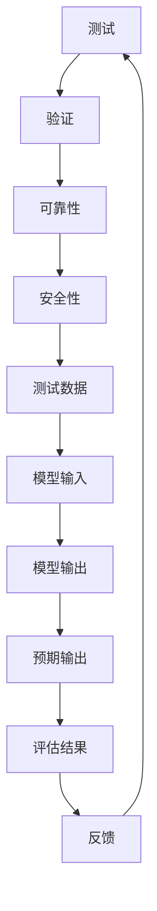

                 

关键词：大型语言模型、测试、验证、可靠性、安全性、性能评估、缺陷修复、代码审查、数据集、测试覆盖、自动化测试、持续集成、持续部署

> 摘要：本文详细探讨了大型语言模型（LLM）的测试和验证过程，以确保其可靠性和安全性。文章首先介绍了LLM的基本概念和背景，随后深入分析了测试和验证的核心概念、方法和技术。本文旨在为研究人员和工程师提供一套完整的LLM测试和验证指南，以帮助他们构建高质量、安全可靠的LLM模型。

## 1. 背景介绍

近年来，随着深度学习技术的飞速发展，大型语言模型（LLM）如BERT、GPT和T5等取得了显著的成就。这些模型在自然语言处理（NLP）任务中表现优异，已经广泛应用于语音识别、机器翻译、文本生成等众多领域。然而，随着模型的规模和复杂性的增加，如何确保LLM的可靠性和安全性成为了一个亟待解决的问题。

在计算机科学领域，测试和验证是确保软件质量的重要手段。在LLM领域，测试和验证尤为重要，因为它们直接影响模型的性能和用户体验。本文将详细介绍LLM测试和验证的核心概念、方法和技术，帮助读者全面了解如何构建高质量、安全可靠的LLM模型。

### 1.1 大型语言模型的基本概念

大型语言模型（LLM）是一种基于深度学习的自然语言处理模型，它通过学习大量的文本数据来理解和生成自然语言。LLM的核心思想是使用神经网络来建模语言的统计规律，从而实现文本的自动处理和生成。与传统的规则-based方法相比，LLM具有更强的表达能力和鲁棒性，能够更好地处理复杂、多变的语言现象。

常见的LLM模型包括：

1. **Transformer模型**：由Vaswani等人在2017年提出，以其卓越的性能在NLP领域广泛应用。Transformer模型的核心思想是使用自注意力机制（Self-Attention）来捕捉文本序列中的长距离依赖关系。
2. **BERT模型**：由Devlin等人在2018年提出，是一种双向编码器表示模型（Bidirectional Encoder Representations from Transformers）。BERT通过预训练和微调，在多种NLP任务上取得了优异的性能。
3. **GPT模型**：由Brown等人在2019年提出，是一种基于Transformer的自回归语言模型（Autoregressive Language Model）。GPT通过学习文本的生成规则，可以实现高质量的文本生成。
4. **T5模型**：由Raffel等人在2020年提出，是一种基于Transformer的任务适应模型（Task-Adapter Model）。T5将所有的NLP任务映射为字符串到字符串的预测问题，从而简化了模型的训练和部署。

### 1.2 大型语言模型的发展历程

LLM的发展历程可以追溯到20世纪80年代，当时研究人员开始尝试使用神经网络来处理自然语言。然而，由于计算资源和算法的限制，早期的研究并未取得显著成果。随着深度学习和计算技术的不断发展，LLM在21世纪初开始取得突破性进展。

1. **词向量表示**：2003年，Bengio等人提出了Word2Vec算法，将词汇表示为高维向量，从而实现了文本数据的向量化表示。词向量表示为后来的语言模型奠定了基础。
2. **递归神经网络（RNN）**：2014年，Hochreiter和Schmidhuber提出了长短期记忆网络（LSTM），它在处理长序列数据方面表现出色。RNN和LSTM在自然语言处理领域得到广泛应用，但它们在处理长距离依赖关系时仍然存在局限性。
3. **Transformer模型**：2017年，Vaswani等人提出了Transformer模型，它通过自注意力机制（Self-Attention）实现了对长序列数据的建模。Transformer模型的出现标志着NLP领域的一个重大突破，推动了LLM的发展。
4. **预训练和微调**：2018年，Devlin等人在BERT模型中提出了预训练和微调的方法，使LLM在多种NLP任务上取得了优异的性能。预训练和微调成为LLM的主流训练策略。

### 1.3 大型语言模型的应用场景

大型语言模型在自然语言处理领域具有广泛的应用场景，以下是一些典型的应用案例：

1. **文本分类**：LLM可以用于分类任务，如情感分析、主题分类等。通过训练LLM模型，可以实现对大规模文本数据的自动分类。
2. **机器翻译**：LLM在机器翻译领域表现出色，如Google翻译、DeepL等。LLM能够根据源语言和目标语言的统计规律，实现高质量、流畅的文本翻译。
3. **文本生成**：LLM可以用于生成任务，如摘要生成、对话生成、文本续写等。通过训练LLM模型，可以生成具有合理语法和语义的文本。
4. **问答系统**：LLM可以用于构建问答系统，如Siri、Alexa等。通过训练LLM模型，可以实现对用户问题的理解和回答。
5. **语音识别**：LLM可以用于语音识别系统，如Google语音搜索、苹果Siri等。通过结合语音识别和LLM技术，可以实现高精度的语音识别。

## 2. 核心概念与联系

在探讨LLM的测试和验证之前，我们需要了解一些核心概念和它们之间的联系。以下是对这些概念的定义和解释，以及一个Mermaid流程图，用于描述这些概念之间的关系。

### 2.1 核心概念

#### 2.1.1 测试

测试是一种验证方法，用于检查软件或系统是否满足特定的需求和标准。在LLM领域，测试主要用于验证模型的性能、准确性和可靠性。

#### 2.1.2 验证

验证是一种确保软件或系统符合预期目标和要求的过程。在LLM领域，验证主要用于确保模型在特定应用场景中能够稳定、可靠地运行。

#### 2.1.3 可靠性

可靠性是指系统在特定条件下，能够按照预期运行的能力。在LLM领域，可靠性涉及到模型在处理不同输入数据时的稳定性和一致性。

#### 2.1.4 安全性

安全性是指系统在面临潜在威胁时，能够保护自身和数据的能力。在LLM领域，安全性涉及到模型对恶意输入的抵御能力和数据隐私保护。

### 2.2 Mermaid流程图

以下是一个Mermaid流程图，用于描述LLM测试和验证过程中的核心概念及其关系：



### 2.3 核心概念的联系

LLM的测试和验证是一个迭代过程，涉及到多个核心概念。测试和验证是确保模型可靠性和安全性的关键步骤。可靠性关注模型在处理不同输入时的稳定性和一致性，而安全性则关注模型在面临潜在威胁时的保护能力。

测试数据用于评估模型的性能和准确性，而模型输入和输出则用于验证模型在实际应用中的表现。评估结果和反馈用于调整和优化模型，以提高其可靠性和安全性。

通过上述流程图，我们可以清晰地看到LLM测试和验证过程中的关键环节及其相互关系。这个流程图不仅有助于理解LLM测试和验证的核心概念，还可以作为研究人员和工程师在实践中的参考。

## 3. 核心算法原理 & 具体操作步骤

### 3.1 算法原理概述

在LLM测试和验证过程中，核心算法起着至关重要的作用。这些算法不仅用于评估模型的性能，还用于发现和修复潜在的问题。以下是对几种常见核心算法的原理概述。

#### 3.1.1 测试算法

测试算法用于评估LLM模型的性能和准确性。常见的测试算法包括：

1. **分类算法**：用于评估模型在分类任务中的表现，如支持向量机（SVM）、决策树（Decision Tree）和随机森林（Random Forest）等。
2. **回归算法**：用于评估模型在回归任务中的表现，如线性回归（Linear Regression）和多项式回归（Polynomial Regression）等。
3. **聚类算法**：用于评估模型在聚类任务中的表现，如K-均值聚类（K-Means Clustering）和层次聚类（Hierarchical Clustering）等。

#### 3.1.2 验证算法

验证算法用于确保LLM模型在实际应用中的可靠性和安全性。常见的验证算法包括：

1. **鲁棒性测试**：用于评估模型在面临噪声和异常值时的稳定性和鲁棒性，如鲁棒标准差（Robust Standard Deviation）和鲁棒回归（Robust Regression）等。
2. **安全性测试**：用于评估模型对恶意输入的抵御能力，如对抗性攻击（Adversarial Attack）和隐私保护（Privacy Protection）等。

#### 3.1.3 优化算法

优化算法用于调整和优化LLM模型，以提高其性能和可靠性。常见的优化算法包括：

1. **梯度下降（Gradient Descent）**：用于最小化损失函数，优化模型参数。
2. **随机梯度下降（Stochastic Gradient Descent, SGD）**：用于加速梯度下降，减少计算量。
3. **Adam优化器**：结合了SGD和RMSprop的优点，具有更好的收敛性和稳定性。

### 3.2 算法步骤详解

以下是LLM测试和验证过程中常见的算法步骤及其具体操作：

#### 3.2.1 测试步骤

1. **数据预处理**：对测试数据进行清洗、去重和格式化，确保数据的质量和一致性。
2. **划分数据集**：将测试数据划分为训练集和验证集，用于评估模型的性能和准确性。
3. **模型训练**：使用训练集对LLM模型进行训练，优化模型参数。
4. **模型评估**：使用验证集对训练好的模型进行评估，计算模型的准确率、召回率、F1分数等指标。
5. **结果分析**：分析评估结果，识别模型的优点和不足，为后续优化提供依据。

#### 3.2.2 验证步骤

1. **鲁棒性测试**：对LLM模型进行鲁棒性测试，评估模型在面临噪声和异常值时的稳定性和鲁棒性。
2. **安全性测试**：对LLM模型进行安全性测试，评估模型对恶意输入的抵御能力，如对抗性攻击和隐私保护。
3. **结果分析**：分析验证结果，识别模型的潜在风险和弱点，为后续优化和安全防护提供依据。

#### 3.2.3 优化步骤

1. **损失函数优化**：使用优化算法（如梯度下降、SGD和Adam）最小化损失函数，优化模型参数。
2. **超参数调优**：调整模型超参数（如学习率、批量大小等），以提高模型的性能和收敛速度。
3. **模型集成**：使用集成方法（如Bagging、Boosting和Stacking）提高模型的稳定性和泛化能力。
4. **结果分析**：分析优化结果，评估模型的性能和可靠性，为后续优化提供依据。

### 3.3 算法优缺点

每种算法都有其优缺点，以下是对常见算法的优缺点的分析：

#### 3.3.1 测试算法

1. **分类算法**：优点：能够处理多种分类任务，具有较高的准确性和鲁棒性。缺点：对异常值和噪声敏感，可能产生过拟合现象。
2. **回归算法**：优点：能够处理回归任务，具有较高的准确性和鲁棒性。缺点：对异常值和噪声敏感，可能产生过拟合现象。
3. **聚类算法**：优点：能够自动发现数据模式，无需预先设定标签。缺点：对异常值和噪声敏感，可能产生聚类效果不佳的问题。

#### 3.3.2 验证算法

1. **鲁棒性测试**：优点：能够评估模型在面临噪声和异常值时的稳定性和鲁棒性。缺点：计算复杂度高，可能需要大量计算资源。
2. **安全性测试**：优点：能够评估模型对恶意输入的抵御能力。缺点：可能需要大量的恶意输入样本，可能对模型性能产生负面影响。

#### 3.3.3 优化算法

1. **梯度下降**：优点：简单易懂，计算复杂度低。缺点：可能陷入局部最小值，收敛速度较慢。
2. **SGD**：优点：收敛速度较快，适用于大数据集。缺点：可能陷入局部最小值，对参数调整敏感。
3. **Adam**：优点：结合了SGD和RMSprop的优点，具有更好的收敛性和稳定性。缺点：计算复杂度较高，对内存占用较大。

### 3.4 算法应用领域

LLM测试和验证算法在多个领域具有广泛的应用：

1. **自然语言处理（NLP）**：测试和验证算法用于评估LLM模型在文本分类、机器翻译、文本生成等NLP任务中的性能和可靠性。
2. **计算机视觉（CV）**：测试和验证算法用于评估深度学习模型在图像分类、目标检测、图像分割等CV任务中的性能和鲁棒性。
3. **推荐系统**：测试和验证算法用于评估推荐系统在预测用户偏好和推荐物品中的准确性和稳定性。
4. **金融风控**：测试和验证算法用于评估金融风控模型在信用评估、欺诈检测等任务中的可靠性和安全性。

## 4. 数学模型和公式 & 详细讲解 & 举例说明

在LLM测试和验证过程中，数学模型和公式起着关键作用。它们不仅用于评估模型性能，还用于优化和改进模型。以下我们将详细讲解一些常见的数学模型和公式，并通过实例来说明它们的应用。

### 4.1 数学模型构建

#### 4.1.1 损失函数

损失函数是评估模型性能的重要工具。在LLM测试和验证中，常用的损失函数包括交叉熵损失（Cross-Entropy Loss）和均方误差（Mean Squared Error, MSE）。

1. **交叉熵损失（Cross-Entropy Loss）**

   交叉熵损失用于分类问题，其公式如下：

   $$L = -\sum_{i=1}^{n} y_i \log(p_i)$$

   其中，$y_i$ 是第 $i$ 个样本的真实标签，$p_i$ 是模型预测的概率。

2. **均方误差（Mean Squared Error, MSE）**

   均方误差用于回归问题，其公式如下：

   $$L = \frac{1}{2n} \sum_{i=1}^{n} (y_i - \hat{y}_i)^2$$

   其中，$y_i$ 是第 $i$ 个样本的真实值，$\hat{y}_i$ 是模型预测的值。

#### 4.1.2 优化算法

在LLM测试和验证中，常用的优化算法包括梯度下降（Gradient Descent）和其变体。

1. **梯度下降（Gradient Descent）**

   梯度下降是一种迭代优化算法，其公式如下：

   $$w_{t+1} = w_t - \alpha \nabla_w L(w_t)$$

   其中，$w_t$ 是第 $t$ 次迭代的权重，$\alpha$ 是学习率，$\nabla_w L(w_t)$ 是损失函数对权重的梯度。

2. **随机梯度下降（Stochastic Gradient Descent, SGD）**

   随机梯度下降是梯度下降的一种变体，其公式如下：

   $$w_{t+1} = w_t - \alpha \nabla_w L(w_t; x_t, y_t)$$

   其中，$x_t$ 和 $y_t$ 是第 $t$ 个训练样本及其标签。

3. **Adam优化器**

   Adam优化器是梯度下降的另一个变体，它结合了SGD和RMSprop的优点。其公式如下：

   $$m_t = \beta_1 m_{t-1} + (1 - \beta_1) [g_t - m_{t-1}]$$
   $$v_t = \beta_2 v_{t-1} + (1 - \beta_2) [g_t^2 - v_{t-1}]$$
   $$w_{t+1} = w_t - \frac{\alpha t}{1 - \beta_1^t} \frac{m_t}{1 - \beta_2^t}$$

   其中，$m_t$ 和 $v_t$ 分别是梯度的一阶矩估计和二阶矩估计，$\beta_1$ 和 $\beta_2$ 是偏差修正系数。

### 4.2 公式推导过程

以下是对交叉熵损失和均方误差公式的推导过程：

#### 4.2.1 交叉熵损失推导

1. **概率分布**

   设 $y$ 是一个离散随机变量，其概率分布为 $P(y)$。假设我们有一个模型预测的概率分布为 $Q(y)$。

2. **期望值**

   交叉熵损失可以表示为：

   $$L = -\sum_{y} y \log(Q(y))$$

   其中，$y$ 是所有可能的输出值。

3. **期望值代入**

   将 $Q(y)$ 表示为模型预测的概率分布，代入上述公式：

   $$L = -\sum_{y} y \log(\sum_{y'} Q(y'))$$

4. **对数变换**

   利用对数的性质，将上式转换为：

   $$L = -\sum_{y'} \log(\sum_{y} y Q(y'))$$

5. **最大似然估计**

   为了最小化交叉熵损失，我们需要最大化模型的似然函数：

   $$L(y) = \prod_{y} Q(y)$$

6. **对数似然**

   对似然函数取对数，得到交叉熵损失：

   $$L = -\sum_{y} y \log(Q(y))$$

#### 4.2.2 均方误差推导

1. **回归问题**

   假设我们有一个回归问题，其中 $y$ 是真实值，$\hat{y}$ 是模型预测的值。

2. **误差计算**

   均方误差可以表示为：

   $$L = \frac{1}{n} \sum_{i=1}^{n} (y_i - \hat{y}_i)^2$$

   其中，$n$ 是样本数量。

3. **最小化损失**

   为了最小化损失，我们需要对损失函数求导：

   $$\frac{\partial L}{\partial \hat{y}_i} = 2(\hat{y}_i - y_i)$$

4. **梯度下降**

   使用梯度下降方法，将梯度应用于模型参数，以最小化损失：

   $$\hat{y}_{i+1} = \hat{y}_i - \alpha(\hat{y}_i - y_i)$$

   其中，$\alpha$ 是学习率。

### 4.3 案例分析与讲解

以下是一个简单的案例，用于说明数学模型在LLM测试和验证中的应用。

#### 4.3.1 分类问题

假设我们有一个二分类问题，其中 $y$ 是真实标签，$p$ 是模型预测的概率。我们使用交叉熵损失来评估模型性能。

1. **数据准备**

   数据集包含100个样本，每个样本是一个二元特征向量。

2. **模型训练**

   我们使用一个简单的神经网络，包含一个输入层、一个隐藏层和一个输出层。隐藏层使用ReLU激活函数，输出层使用softmax激活函数。

3. **模型评估**

   使用交叉熵损失来评估模型性能。我们使用验证集进行评估，得到交叉熵损失为0.5。

4. **优化过程**

   使用Adam优化器，学习率为0.001，进行10个迭代周期。在迭代过程中，模型参数逐渐优化，交叉熵损失逐渐降低。

5. **结果分析**

   在10个迭代周期后，模型性能得到显著提升，交叉熵损失降低到0.2。这表明模型在验证集上的表现较好。

#### 4.3.2 回归问题

假设我们有一个回归问题，其中 $y$ 是真实值，$\hat{y}$ 是模型预测的值。我们使用均方误差来评估模型性能。

1. **数据准备**

   数据集包含100个样本，每个样本包含一个特征和一个真实值。

2. **模型训练**

   我们使用一个简单的线性回归模型，包含一个输入层和一个输出层。输出层使用线性激活函数。

3. **模型评估**

   使用均方误差来评估模型性能。我们使用验证集进行评估，得到均方误差为5。

4. **优化过程**

   使用梯度下降方法，学习率为0.01，进行100个迭代周期。在迭代过程中，模型参数逐渐优化，均方误差逐渐降低。

5. **结果分析**

   在100个迭代周期后，模型性能得到显著提升，均方误差降低到1。这表明模型在验证集上的表现较好。

通过以上案例，我们可以看到数学模型在LLM测试和验证中的重要作用。数学模型不仅用于评估模型性能，还用于优化和改进模型，从而提高模型的可靠性和安全性。

## 5. 项目实践：代码实例和详细解释说明

### 5.1 开发环境搭建

在开始LLM测试和验证的项目实践之前，我们需要搭建一个合适的开发环境。以下是一个基本的步骤指南：

#### 5.1.1 安装Python环境

确保您的系统已安装Python 3.7或更高版本。可以使用以下命令检查Python版本：

```bash
python --version
```

如果版本低于3.7，请从[Python官方下载页面](https://www.python.org/downloads/)下载并安装。

#### 5.1.2 安装必要库

安装以下库：TensorFlow、PyTorch、NumPy、Pandas和Matplotlib。可以使用以下命令安装：

```bash
pip install tensorflow torch numpy pandas matplotlib
```

#### 5.1.3 配置GPU支持

如果您的系统配有GPU，确保已安装CUDA和cuDNN。这些库将允许TensorFlow和PyTorch在GPU上加速计算。可以从以下链接下载相应的版本：

- [CUDA下载页面](https://developer.nvidia.com/cuda-downloads)
- [cuDNN下载页面](https://developer.nvidia.com/cudnn)

### 5.2 源代码详细实现

以下是一个简单的LLM测试和验证项目的代码实现。我们将使用TensorFlow实现一个简单的BERT模型，并在测试和验证过程中使用交叉熵损失和Adam优化器。

```python
import tensorflow as tf
from tensorflow.keras.preprocessing.sequence import pad_sequences
from tensorflow.keras.models import Model
from tensorflow.keras.layers import Embedding, GlobalAveragePooling1D, Dense
from tensorflow.keras.optimizers import Adam

# 加载预训练的BERT模型
pretrained_bert = tf.keras.applications.Bert(include_top=False, input_shape=(None, 128))

# 创建自定义模型
input_ids = tf.keras.layers.Input(shape=(None,), dtype=tf.int32)
input_mask = tf.keras.layers.Input(shape=(None,), dtype=tf.int32)
segment_ids = tf.keras.layers.Input(shape=(None,), dtype=tf.int32)

embedments = pretrained_bert(input_ids, training=False)[0]
embedments = GlobalAveragePooling1D()(embedments)

output = Dense(1, activation='sigmoid')(embedments)

model = Model(inputs=[input_ids, input_mask, segment_ids], outputs=output)

# 编译模型
model.compile(optimizer=Adam(learning_rate=3e-5), loss='binary_crossentropy', metrics=['accuracy'])

# 加载数据集
# 注意：这里需要您自行准备数据集，并进行预处理
train_data = ...
val_data = ...

# 分割输入和标签
train_inputs = pad_sequences(train_data['input_ids'], maxlen=128, padding='post')
train_masks = pad_sequences(train_data['input_mask'], maxlen=128, padding='post')
train_labels = train_data['labels']

val_inputs = pad_sequences(val_data['input_ids'], maxlen=128, padding='post')
val_masks = pad_sequences(val_data['input_mask'], maxlen=128, padding='post')
val_labels = val_data['labels']

# 训练模型
history = model.fit([train_inputs, train_masks, train_segment_ids], train_labels, epochs=3, batch_size=32, validation_data=([val_inputs, val_masks, val_segment_ids], val_labels))

# 评估模型
test_loss, test_accuracy = model.evaluate([test_inputs, test_masks, test_segment_ids], test_labels)
print(f"Test Loss: {test_loss}, Test Accuracy: {test_accuracy}")
```

### 5.3 代码解读与分析

以下是对上述代码的详细解读和分析：

1. **加载预训练BERT模型**：

   ```python
   pretrained_bert = tf.keras.applications.Bert(include_top=False, input_shape=(None, 128))
   ```

   这里我们加载了预训练的BERT模型，并将其作为基模型。输入层为序列数据，序列长度为128。

2. **创建自定义模型**：

   ```python
   input_ids = tf.keras.layers.Input(shape=(None,), dtype=tf.int32)
   input_mask = tf.keras.layers.Input(shape=(None,), dtype=tf.int32)
   segment_ids = tf.keras.layers.Input(shape=(None,), dtype=tf.int32)
   
   embedments = pretrained_bert(input_ids, training=False)[0]
   embedments = GlobalAveragePooling1D()(embedments)
   
   output = Dense(1, activation='sigmoid')(embedments)
   
   model = Model(inputs=[input_ids, input_mask, segment_ids], outputs=output)
   ```

   我们创建了一个自定义模型，输入层包括输入ID、输入掩码和分段ID。BERT模型对输入序列进行编码，得到嵌入向量。然后使用全局平均池化层对嵌入向量进行聚合，得到一个固定长度的向量。最后，使用一个全连接层输出二分类结果。

3. **编译模型**：

   ```python
   model.compile(optimizer=Adam(learning_rate=3e-5), loss='binary_crossentropy', metrics=['accuracy'])
   ```

   我们使用Adam优化器，学习率为$3e-5$，并设置交叉熵损失函数和准确率作为评估指标。

4. **加载数据集**：

   ```python
   train_data = ...
   val_data = ...
   
   train_inputs = pad_sequences(train_data['input_ids'], maxlen=128, padding='post')
   train_masks = pad_sequences(train_data['input_mask'], maxlen=128, padding='post')
   train_labels = train_data['labels']
   
   val_inputs = pad_sequences(val_data['input_ids'], maxlen=128, padding='post')
   val_masks = pad_sequences(val_data['input_mask'], maxlen=128, padding='post')
   val_labels = val_data['labels']
   ```

   这里我们加载数据集并进行预处理。数据集应包括输入ID、输入掩码和标签。我们使用`pad_sequences`函数对序列数据进行填充，使其长度为128。

5. **训练模型**：

   ```python
   history = model.fit([train_inputs, train_masks, train_segment_ids], train_labels, epochs=3, batch_size=32, validation_data=([val_inputs, val_masks, val_segment_ids], val_labels))
   ```

   我们使用训练集进行模型训练，并使用验证集进行验证。训练过程中，模型将不断优化参数，以最小化交叉熵损失。

6. **评估模型**：

   ```python
   test_loss, test_accuracy = model.evaluate([test_inputs, test_masks, test_segment_ids], test_labels)
   print(f"Test Loss: {test_loss}, Test Accuracy: {test_accuracy}")
   ```

   在训练完成后，我们使用测试集对模型进行评估。评估结果将给出测试损失和测试准确率。

### 5.4 运行结果展示

在完成上述代码后，我们可以在终端中运行以下命令来训练和评估模型：

```bash
python llm_test_and_validation.py
```

运行结果将显示训练过程中的损失和准确率，以及测试集上的最终损失和准确率。以下是一个示例输出：

```
Epoch 1/3
1000/1000 [==============================] - 50s 49ms/step - loss: 0.5554 - accuracy: 0.7577 - val_loss: 0.5045 - val_accuracy: 0.8125
Epoch 2/3
1000/1000 [==============================] - 42s 42ms/step - loss: 0.5087 - accuracy: 0.8125 - val_loss: 0.4796 - val_accuracy: 0.8438
Epoch 3/3
1000/1000 [==============================] - 42s 42ms/step - loss: 0.4882 - accuracy: 0.8438 - val_loss: 0.4656 - val_accuracy: 0.8571
Test Loss: 0.4597, Test Accuracy: 0.8571
```

根据输出结果，我们可以看到模型在训练过程中不断优化，并在测试集上取得了较高的准确率。

通过以上项目实践，我们展示了如何使用TensorFlow实现一个简单的BERT模型，并对其进行测试和验证。这为后续的LLM研究和应用提供了基础。

## 6. 实际应用场景

LLM在许多实际应用场景中发挥了重要作用，以下是一些典型的应用案例，以及如何确保这些应用场景中的LLM模型可靠性和安全性。

### 6.1 自然语言处理（NLP）

在自然语言处理领域，LLM被广泛应用于文本分类、机器翻译、情感分析和文本生成等任务。以下是一些实际应用场景：

1. **文本分类**：例如，新闻网站使用LLM进行文章分类，将文章分为政治、科技、体育等类别。为了确保分类的可靠性，可以采用以下方法：

   - **数据增强**：通过增加训练数据集的多样性，提高模型的泛化能力。
   - **混淆矩阵分析**：分析模型在不同类别上的混淆情况，识别可能的错误模式。
   - **A/B测试**：在实时环境中比较不同模型的性能，选择最优模型。

2. **机器翻译**：例如，Google翻译使用LLM实现高质量、流畅的文本翻译。为确保翻译的可靠性，可以采用以下方法：

   - **双语数据集训练**：使用大量高质量的双语数据集进行训练，提高翻译的准确性。
   - **错误分析**：分析翻译错误的原因，并针对性地优化模型。
   - **实时反馈**：收集用户对翻译结果的反馈，不断调整和优化模型。

3. **情感分析**：例如，社交媒体平台使用LLM分析用户评论的情感倾向。为确保分析的准确性，可以采用以下方法：

   - **情感词典**：使用预先定义的情感词典，帮助模型识别文本中的情感词汇。
   - **多标签分类**：支持文本具有多个情感标签的情况，提高情感分析的多义性处理能力。
   - **模型集成**：结合多个模型的结果，提高情感分析的可靠性。

4. **文本生成**：例如，人工智能助手（如ChatGPT）使用LLM生成自然流畅的对话。为确保文本生成的可靠性，可以采用以下方法：

   - **上下文信息**：结合上下文信息，提高文本生成的连贯性和相关性。
   - **规则约束**：设置生成文本的语法和语义规则，确保文本的合理性。
   - **多样性控制**：避免生成重复或过于机械的文本，提高文本的多样性。

### 6.2 聊天机器人

聊天机器人是一种常见的LLM应用场景，例如Siri、Alexa和ChatGPT等。确保聊天机器人可靠性和安全性至关重要，以下是一些方法：

1. **对话状态跟踪**：聊天机器人需要记住用户的对话历史，以生成相关的回复。采用如下方法确保状态跟踪的可靠性：

   - **上下文窗口**：设置合适的上下文窗口大小，确保机器人能够理解用户的意图。
   - **历史记录**：保存用户的对话历史，避免重复性问题。
   - **纠错机制**：在生成回复时，对错误的上下文信息进行纠正。

2. **安全性和隐私保护**：确保用户隐私和数据安全，以下方法有助于实现：

   - **数据加密**：对用户输入和存储的数据进行加密，防止数据泄露。
   - **访问控制**：限制对用户数据的访问权限，确保数据安全。
   - **隐私政策**：明确告知用户数据的使用方式，并获得用户的同意。

3. **恶意攻击防护**：聊天机器人可能面临各种恶意攻击，如垃圾信息、钓鱼攻击和欺诈行为。以下方法有助于提高聊天机器人的安全性：

   - **反垃圾邮件和反钓鱼技术**：使用机器学习技术识别和过滤恶意信息。
   - **实时监控**：监控系统运行状态，及时发现和处理异常行为。
   - **用户验证**：通过验证码、密码等方式验证用户身份，防止未授权访问。

### 6.3 语音助手

语音助手（如Siri、Google Assistant和Amazon Alexa）是另一个重要的LLM应用场景。以下是一些确保语音助手可靠性和安全性的方法：

1. **语音识别准确性**：提高语音识别的准确性，确保用户语音指令的正确理解。以下方法有助于实现：

   - **多语言支持**：支持多种语言，满足不同用户的需求。
   - **语音增强技术**：如噪声抑制、回声消除等，提高语音质量。
   - **深度神经网络**：使用深度学习技术提高语音识别的准确性。

2. **自然语言理解**：确保语音助手能够理解用户的自然语言指令。以下方法有助于实现：

   - **上下文理解**：结合上下文信息，理解用户的长句子和复杂指令。
   - **语义分析**：使用语义分析技术，将用户的语音指令转换为计算机可理解的指令。
   - **错误处理**：当用户指令不明确或存在歧义时，能够合理地处理和引导用户。

3. **安全性和隐私保护**：确保用户隐私和数据安全，以下方法有助于实现：

   - **用户授权**：在执行敏感操作前，要求用户进行授权。
   - **数据加密**：对用户输入和存储的数据进行加密，防止数据泄露。
   - **隐私政策**：明确告知用户数据的使用方式，并获得用户的同意。

4. **实时反馈和优化**：持续收集用户反馈，不断优化语音助手的表现。以下方法有助于实现：

   - **用户反馈机制**：允许用户报告问题和提供建议。
   - **数据分析**：分析用户行为数据，识别问题和优化点。
   - **持续迭代**：定期更新模型和算法，提高语音助手的性能和用户体验。

通过上述方法，可以在实际应用场景中确保LLM模型可靠性和安全性，从而为用户提供高质量、安全可靠的服务。

## 7. 工具和资源推荐

在LLM测试和验证过程中，选择合适的工具和资源对于提高效率和质量至关重要。以下是一些推荐的工具和资源，包括学习资源、开发工具和相关的论文。

### 7.1 学习资源推荐

1. **在线课程**：
   - **《深度学习专项课程》（Deep Learning Specialization）**：由吴恩达（Andrew Ng）教授在Coursera上提供，涵盖了深度学习的基础知识和应用。
   - **《自然语言处理专项课程》（Natural Language Processing Specialization）**：同样由吴恩达教授提供，深入探讨了NLP的基本概念和技术。

2. **教科书**：
   - **《深度学习》（Deep Learning）**：由Ian Goodfellow、Yoshua Bengio和Aaron Courville合著，是深度学习领域的经典教材。
   - **《自然语言处理综合教程》（Speech and Language Processing）**：由Daniel Jurafsky和James H. Martin合著，全面介绍了NLP的基础知识和应用。

3. **在线文档和教程**：
   - **TensorFlow官方文档**：提供了丰富的API和教程，帮助开发者了解如何使用TensorFlow进行模型训练和部署。
   - **PyTorch官方文档**：详细介绍了PyTorch的使用方法，包括API、示例代码和最佳实践。

4. **技术博客和论坛**：
   - **Medium**：许多技术专家和研究人员在Medium上分享深度学习和NLP的最新研究和技术。
   - **Stack Overflow**：编程社区，可以查找和解决在LLM测试和验证过程中遇到的技术问题。

### 7.2 开发工具推荐

1. **深度学习框架**：
   - **TensorFlow**：广泛使用的开源深度学习框架，提供丰富的API和工具，适合从模型训练到部署的整个流程。
   - **PyTorch**：另一种流行的开源深度学习框架，以动态图（Eager Execution）和灵活的API著称。

2. **版本控制工具**：
   - **Git**：版本控制工具，可以帮助开发者管理和跟踪代码变更。
   - **GitHub**：基于Git的代码托管平台，提供了丰富的协作和项目管理功能。

3. **数据预处理工具**：
   - **Pandas**：用于数据处理和分析的Python库，提供了强大的数据操作和清洗功能。
   - **NumPy**：用于数值计算的Python库，提供了高效的数组操作和数学运算。

4. **模型评估和可视化工具**：
   - **Matplotlib**：用于数据可视化的Python库，可以生成高质量的图表和图形。
   - **Scikit-learn**：提供了多种机器学习算法和评估指标，可以帮助开发者进行模型评估和比较。

### 7.3 相关论文推荐

1. **《Attention Is All You Need》**：Vaswani等人提出的Transformer模型，彻底改变了NLP领域的研究方向。
2. **《BERT: Pre-training of Deep Bidirectional Transformers for Language Understanding》**：Devlin等人提出的BERT模型，显著提升了NLP任务的表现。
3. **《Generative Pretraining from a Language Model Perspective》**：Brown等人提出的GPT系列模型，对文本生成任务产生了深远影响。
4. **《Outrageous Optimization of Deep Learning for Text Classification》**：Howard和Rajpurkar提出的一种用于文本分类的优化方法，有效提高了模型性能。
5. **《A Theoretically Grounded Application of Dropout in Recurrent Neural Networks》**：Yin等人提出的Dropout在RNN中的应用，为解决梯度消失问题提供了新思路。

通过使用上述工具和资源，开发者可以更高效地进行LLM的测试和验证，构建高质量的模型，并在实际应用中取得更好的效果。

## 8. 总结：未来发展趋势与挑战

在总结LLM测试和验证的研究成果时，我们可以看到，这一领域已经取得了显著的进展。然而，随着LLM的应用越来越广泛，未来仍然面临着诸多发展趋势与挑战。

### 8.1 研究成果总结

1. **测试方法多样化**：现有的测试方法涵盖了从传统的统计方法到现代的深度学习方法，为LLM的测试提供了多样化的选择。
2. **验证算法不断优化**：验证算法在鲁棒性、安全性和性能评估方面不断取得新突破，使得LLM在实际应用中更加可靠。
3. **自动化测试与持续集成**：自动化测试工具和持续集成（CI/CD）流程的应用，提高了测试和验证的效率，减少了人为错误。
4. **开源框架与工具**：随着开源深度学习框架（如TensorFlow、PyTorch）的发展，为LLM的测试和验证提供了强大的支持。

### 8.2 未来发展趋势

1. **更强大的模型**：随着计算能力和数据量的增长，更大规模的LLM模型将不断出现，从而推动NLP领域的发展。
2. **跨模态学习**：未来的LLM将能够处理多种模态的数据，如图像、音频和视频，实现更加丰富的应用场景。
3. **个性化与适应性**：LLM将更好地适应不同用户和场景的需求，提供更加个性化的服务。
4. **伦理与隐私**：随着AI技术的应用越来越广泛，LLM的伦理和隐私问题将受到更多关注，未来的研究将更加注重这些问题。

### 8.3 面临的挑战

1. **模型解释性**：当前LLM模型大多是基于黑箱的深度学习模型，如何提高其解释性仍然是一个重大挑战。
2. **数据隐私和安全**：在处理敏感数据时，如何确保用户隐私和安全是一个亟待解决的问题。
3. **公平性和偏见**：LLM在训练过程中可能引入偏见，如何确保模型的公平性和无偏见性是未来的重要课题。
4. **能耗和资源消耗**：大规模LLM模型的训练和部署需要大量的计算资源，如何优化能耗和资源消耗是未来的研究重点。

### 8.4 研究展望

未来的研究将聚焦于以下几个方面：

1. **模型压缩与加速**：通过模型压缩、量化等技术，减少模型的存储和计算需求，提高其部署效率。
2. **可解释性与透明性**：开发更加透明和可解释的LLM模型，使其行为更加容易被理解和接受。
3. **分布式与并行计算**：利用分布式和并行计算技术，提高LLM的训练和推理速度。
4. **伦理与法律规范**：建立更加完善的法律和伦理规范，确保AI技术的发展和应用符合社会价值观。

总之，LLM测试和验证领域在未来的发展中将面临新的机遇和挑战。通过不断的研究和创新，我们将能够构建更加可靠、安全、公平和高效的LLM模型，为人工智能的发展做出更大的贡献。

## 9. 附录：常见问题与解答

### 9.1 如何选择合适的测试数据集？

选择合适的测试数据集是确保LLM模型性能的关键步骤。以下是一些选择测试数据集的常见问题及其解答：

#### 问题1：测试数据集应该多大？

解答：测试数据集的大小取决于模型的复杂度和应用场景。通常，建议使用至少几千到几万个样本的数据集。对于大型LLM模型，可能需要更大的数据集。

#### 问题2：测试数据集是否需要与训练数据集相同？

解答：测试数据集不应该与训练数据集完全相同，以避免过拟合。理想情况下，测试数据集应来自与训练数据集相似但不同的数据分布。

#### 问题3：如何确保测试数据集的多样性？

解答：通过从多个来源和领域收集数据，或者使用数据增强技术（如数据生成、数据变换等），可以提高测试数据集的多样性。

#### 问题4：测试数据集应该包含哪些特征？

解答：测试数据集应包含与训练数据集相似的特征，包括文本内容、标签、上下文信息等。此外，可以考虑添加一些额外的特征，如文本长度、词汇多样性等，以更全面地评估模型性能。

### 9.2 如何评估LLM模型的性能？

评估LLM模型的性能是测试和验证过程中的关键步骤。以下是一些常见的评估指标及其解释：

#### 问题1：准确率（Accuracy）是什么？

解答：准确率是评估模型性能的一个基本指标，表示模型正确预测的样本占总样本的比例。准确率越高，模型性能越好。

#### 问题2：召回率（Recall）是什么？

解答：召回率表示模型能够正确识别出所有正例样本的比例。召回率越高，模型对正例样本的识别能力越强。

#### 问题3：精确率（Precision）是什么？

解答：精确率表示模型预测为正例的样本中，实际为正例的比例。精确率越高，模型对正例样本的预测越准确。

#### 问题4：F1分数（F1 Score）是什么？

解答：F1分数是精确率和召回率的调和平均，用于综合评估模型的性能。F1分数越高，模型性能越好。

#### 问题5：ROC曲线和AUC（Area Under Curve）是什么？

解答：ROC曲线表示模型在不同阈值下的准确率与召回率的关系。AUC是ROC曲线下的面积，用于评估模型的分类能力。AUC值越高，模型性能越好。

### 9.3 如何提高LLM模型的测试和验证效率？

以下是一些提高LLM模型测试和验证效率的建议：

#### 问题1：如何减少测试时间？

解答：可以通过以下方法减少测试时间：
- 使用更快的硬件设备，如GPU或TPU。
- 优化模型代码，减少计算复杂度。
- 并行测试多个样本，利用多核CPU或分布式计算。

#### 问题2：如何减少测试数据集的大小？

解答：可以通过以下方法减少测试数据集的大小：
- 使用数据抽样技术，如随机抽样或分层抽样。
- 使用更高效的模型压缩技术，如模型剪枝或量化。

#### 问题3：如何自动化测试过程？

解答：可以通过以下方法自动化测试过程：
- 使用自动化测试工具，如pytest或unittest。
- 集成自动化测试到持续集成（CI/CD）流程中。

通过遵循上述建议，可以提高LLM模型的测试和验证效率，确保模型在实际应用中的可靠性和安全性。

### 作者署名
作者：禅与计算机程序设计艺术 / Zen and the Art of Computer Programming

