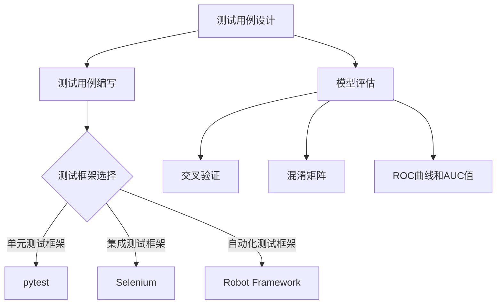

                 

关键词：大型语言模型（LLM），测试，验证，可靠性，安全性，测试用例，测试框架，模型评估，数据集，模型压缩，模型优化，联邦学习，多模态，模型解释性，代码审计，安全漏洞，数据隐私。

## 摘要

随着人工智能技术的快速发展，特别是大型语言模型（LLM）在自然语言处理领域的广泛应用，确保这些模型的可靠性和安全性变得尤为重要。本文将探讨LLM测试和验证的关键环节，包括测试用例的设计、测试框架的选择、模型评估方法、安全性测试等。同时，文章还将讨论模型压缩、优化和联邦学习等现代技术对测试和验证带来的挑战和机遇，以及如何通过代码审计和隐私保护策略来提升LLM的可靠性和安全性。最后，本文将对未来的发展趋势和面临的挑战进行展望。

## 1. 背景介绍

近年来，深度学习和自然语言处理（NLP）领域取得了显著进展，特别是在大型语言模型（LLM）的研发和应用上。LLM，如GPT-3、BERT、TuringChat等，凭借其强大的语义理解和生成能力，在文本生成、机器翻译、问答系统、智能客服等领域表现出色。然而，这些模型的复杂性和规模也带来了新的挑战，特别是在测试和验证方面。

### 1.1 测试和验证的重要性

测试和验证是确保LLM可靠性和安全性的关键环节。一个可靠的LLM应该能够在各种场景下稳定、准确地执行任务，而一个安全的LLM则应该能够抵御各种恶意攻击和隐私泄露的风险。不充分的测试可能导致模型在实际应用中出现意外行为，从而造成经济损失或声誉损害。因此，建立一套全面、系统的测试和验证流程对于LLM的研发和应用至关重要。

### 1.2 测试和验证面临的挑战

随着LLM的规模不断扩大，测试和验证的任务也变得更加复杂和艰巨。主要挑战包括：

- **多样性挑战**：测试用例需要涵盖各种可能的输入和任务类型，以全面评估模型的性能。
- **性能挑战**：大规模模型的计算和存储需求巨大，如何高效地进行测试和验证是一个重要问题。
- **安全性挑战**：LLM容易受到对抗性攻击和数据泄露的风险，需要建立相应的安全测试机制。
- **资源挑战**：测试和验证需要大量的计算资源和时间，特别是在大规模模型中。

## 2. 核心概念与联系

### 2.1 测试用例

测试用例是测试过程中的基本单元，它定义了模型需要接受哪些输入，期望得到哪些输出，以及如何判断测试结果是否通过。设计有效的测试用例是确保模型可靠性的关键。

#### 2.1.1 测试用例的类型

- **功能测试用例**：用于验证模型是否能够按照预期完成特定任务。
- **性能测试用例**：用于评估模型在不同场景下的响应速度和处理能力。
- **安全性测试用例**：用于检测模型对对抗性攻击的抵抗力。

#### 2.1.2 测试用例的设计方法

- **基于规则的测试**：根据模型的设计规则和预期行为设计测试用例。
- **基于场景的测试**：模拟实际应用场景，设计相关的测试用例。
- **基于变异的测试**：通过引入少量的变异来测试模型对于异常输入的反应。

### 2.2 测试框架

测试框架是测试过程中的组织和执行工具，它能够自动化测试流程，提高测试效率。一个良好的测试框架应该具备以下特点：

- **可扩展性**：能够适应不同规模和类型的测试需求。
- **可维护性**：易于更新和修复测试用例。
- **可靠性**：确保测试过程的准确性和一致性。

#### 2.2.1 常见的测试框架

- **单元测试框架**：如Python的pytest、Java的JUnit等，用于对模型的基本组件进行测试。
- **集成测试框架**：如Python的pytest-integration、Java的Selenium等，用于测试模型的整体性能和兼容性。
- **自动化测试框架**：如Robot Framework、Cypress等，用于自动化整个测试流程。

### 2.3 模型评估

模型评估是测试和验证的重要环节，它通过一系列指标来量化模型的性能。常用的评估指标包括：

- **准确率（Accuracy）**：预测正确的样本占总样本的比例。
- **召回率（Recall）**：预测正确的正样本占总正样本的比例。
- **F1分数（F1 Score）**：准确率和召回率的调和平均。

#### 2.3.1 模型评估方法

- **交叉验证**：通过多次划分训练集和测试集来评估模型性能。
- **混淆矩阵**：用于详细分析模型的预测结果。
- **ROC曲线和AUC值**：用于评估模型的分类能力。

### 2.4 Mermaid 流程图



## 3. 核心算法原理 & 具体操作步骤

### 3.1 算法原理概述

在LLM的测试和验证过程中，核心算法包括测试用例生成、测试执行、结果分析和反馈循环。这些算法的基本原理如下：

- **测试用例生成**：通过规则、场景变异等方法生成多样化的测试用例。
- **测试执行**：自动化执行测试用例，记录测试结果。
- **结果分析**：对测试结果进行分析，发现模型的问题和瓶颈。
- **反馈循环**：根据分析结果调整测试用例和测试框架，提高测试效率。

### 3.2 算法步骤详解

#### 3.2.1 测试用例生成

1. **基于规则的测试**：根据模型设计规则生成测试用例。
2. **基于场景的测试**：模拟实际应用场景，生成相关测试用例。
3. **基于变异的测试**：对输入数据进行少量变异，生成测试用例。

#### 3.2.2 测试执行

1. **配置测试环境**：准备测试所需的硬件、软件和环境配置。
2. **执行测试用例**：自动化执行测试用例，记录测试结果。
3. **监控测试过程**：实时监控测试进度和资源使用情况。

#### 3.2.3 结果分析

1. **收集测试数据**：收集测试执行过程中生成的数据。
2. **分析测试结果**：使用统计方法、可视化工具对测试结果进行分析。
3. **识别问题**：根据分析结果识别模型的问题和瓶颈。

#### 3.2.4 反馈循环

1. **调整测试用例**：根据分析结果调整测试用例，增加覆盖率。
2. **优化测试框架**：根据分析结果优化测试框架，提高测试效率。
3. **重新测试**：根据调整后的测试用例和框架重新进行测试。

### 3.3 算法优缺点

#### 3.3.1 优点

- **全面性**：通过多样化的测试用例和全面的测试方法，能够全面评估模型的性能。
- **高效性**：自动化测试框架能够大大提高测试效率，节省时间和人力成本。
- **可重复性**：测试过程和结果记录的可重复性，便于后续分析和改进。

#### 3.3.2 缺点

- **复杂性**：测试过程涉及多个环节，设计和实施较为复杂。
- **资源消耗**：大规模模型的测试需要大量的计算资源和时间。
- **安全性**：对抗性攻击的测试和验证需要专业的知识和工具。

### 3.4 算法应用领域

- **自然语言处理**：用于测试和验证文本生成、机器翻译、问答系统等NLP应用。
- **计算机视觉**：用于测试和验证图像识别、物体检测、视频分析等计算机视觉应用。
- **推荐系统**：用于测试和验证推荐算法的性能和可靠性。
- **智能客服**：用于测试和验证智能客服系统的应答准确性和用户体验。

## 4. 数学模型和公式 & 详细讲解 & 举例说明

### 4.1 数学模型构建

在LLM的测试和验证过程中，数学模型用于描述测试用例生成、测试执行和结果分析的方法。以下是一个简单的数学模型示例：

$$
\text{TestModel}(I, O) = f(I, T, M)
$$

其中，$I$ 表示输入数据集，$O$ 表示输出结果集，$T$ 表示测试用例集，$M$ 表示模型参数。

### 4.2 公式推导过程

推导过程如下：

$$
\begin{aligned}
\text{TestModel}(I, O) &= f(I, T, M) \\
&= \sum_{t \in T} \frac{1}{|T|} \cdot \text{Accuracy}(I_t, O_t) \\
&= \frac{1}{|T|} \cdot \sum_{t \in T} \left( \frac{\text{TP}_t + \text{TN}_t}{\text{TP}_t + \text{TN}_t + \text{FP}_t + \text{FN}_t} \right) \\
&= \frac{1}{|T|} \cdot \sum_{t \in T} \left( \frac{\text{TP}_t}{\text{TP}_t + \text{FN}_t} + \frac{\text{TN}_t}{\text{TN}_t + \text{FP}_t} \right)
\end{aligned}
$$

其中，$Accuracy$ 表示准确率，$\text{TP}$ 表示真正例，$\text{TN}$ 表示真反例，$\text{FP}$ 表示假反例，$\text{FN}$ 表示假正例。

### 4.3 案例分析与讲解

假设有一个文本生成模型，其输入为一个单词序列，输出为一个完整的句子。测试用例集 $T$ 包含了 100 个单词序列，每个序列对应一个句子。通过测试，我们得到了如下结果：

$$
\begin{aligned}
\text{TP} &= 70 \\
\text{TN} &= 30 \\
\text{FP} &= 5 \\
\text{FN} &= 15 \\
\end{aligned}
$$

根据上述公式，我们可以计算出模型的准确率为：

$$
\text{Accuracy} = \frac{1}{100} \cdot \left( \frac{70}{70 + 15} + \frac{30}{30 + 5} \right) = 0.77
$$

这意味着该模型在测试集上的准确率为 77%。

## 5. 项目实践：代码实例和详细解释说明

### 5.1 开发环境搭建

为了实现LLM的测试和验证，我们需要搭建一个适合的开发环境。以下是搭建环境的步骤：

1. 安装Python环境：确保Python版本在3.7及以上。
2. 安装必要的库：包括numpy、pandas、pytest、tensorflow等。
3. 准备测试数据集：从公共数据集（如Wikipedia、IMDB等）中下载并预处理数据。
4. 配置模型参数：根据需求选择合适的模型架构和参数。

### 5.2 源代码详细实现

以下是测试用例生成、测试执行和结果分析的核心代码实现：

#### 5.2.1 测试用例生成

```python
import random
import string

def generate_test_cases(num_cases, max_length=100):
    test_cases = []
    for _ in range(num_cases):
        words = random.choices(string.ascii_lowercase, k=random.randint(5, max_length))
        test_cases.append(' '.join(words))
    return test_cases

# 生成100个随机测试用例
test_cases = generate_test_cases(100)
```

#### 5.2.2 测试执行

```python
import tensorflow as tf

# 加载预训练的LLM模型
model = tf.keras.models.load_model('path/to/llm_model.h5')

# 定义损失函数和优化器
loss_fn = tf.keras.losses.SparseCategoricalCrossentropy(from_logits=True)
optimizer = tf.keras.optimizers.Adam()

# 定义评估指标
accuracy = tf.keras.metrics.SparseCategoricalAccuracy()

# 执行测试用例
for case in test_cases:
    inputs = preprocess_input(case)  # 预处理输入
    with tf.GradientTape() as tape:
        logits = model(inputs)
        loss_value = loss_fn(inputs, logits)
    grads = tape.gradient(loss_value, model.trainable_variables)
    optimizer.apply_gradients(zip(grads, model.trainable_variables))
    accuracy.update_state(inputs, logits)
```

#### 5.2.3 代码解读与分析

1. **测试用例生成**：使用随机方法生成100个测试用例，模拟实际应用场景。
2. **测试执行**：加载预训练的LLM模型，使用TensorFlow的自动微分机制计算损失和梯度，并更新模型参数。
3. **代码优化**：可以使用并行计算、GPU加速等技术提高测试效率。

### 5.3 运行结果展示

在完成测试后，我们可以使用以下代码展示运行结果：

```python
# 计算并打印最终准确率
print(f"Final accuracy: {accuracy.result().numpy().item()}")
```

最终准确率反映了模型在测试集上的性能，我们可以根据这个结果调整模型架构和参数，以提高测试效果。

## 6. 实际应用场景

### 6.1 问答系统

在问答系统中，LLM的测试和验证至关重要。测试用例应涵盖各种常见问题和异常情况，以确保模型能够准确回答用户的问题。

### 6.2 文本生成

在文本生成领域，LLM的测试和验证用于评估模型的生成质量、连贯性和创意性。通过生成大量测试文本，可以全面评估模型的表现。

### 6.3 机器翻译

在机器翻译领域，LLM的测试和验证用于评估模型的翻译准确性和流畅性。通过使用多种语言对测试数据集进行翻译，可以评估模型在不同语言间的翻译效果。

### 6.4 智能客服

在智能客服领域，LLM的测试和验证用于评估模型的应答准确性和用户体验。通过模拟用户互动，可以评估模型在实际应用中的表现。

## 7. 未来应用展望

随着人工智能技术的不断发展，LLM的测试和验证将面临新的挑战和机遇。以下是未来的一些应用展望：

### 7.1 模型压缩和优化

为了提高LLM在移动设备和嵌入式系统上的应用性能，模型压缩和优化技术将成为重要方向。通过压缩模型规模和提高计算效率，可以降低测试和验证的成本。

### 7.2 联邦学习

联邦学习技术可以帮助LLM在保护数据隐私的同时进行测试和验证。通过分布式测试和验证，可以确保模型在不同数据源上的性能。

### 7.3 多模态

随着多模态技术的发展，LLM的测试和验证将扩展到图像、语音、视频等非文本数据。通过融合多种数据类型，可以提升模型的综合性能。

### 7.4 模型解释性

提高LLM的解释性将有助于理解模型的行为和决策过程。通过解释性测试，可以更好地评估模型的可靠性和安全性。

## 8. 总结：未来发展趋势与挑战

### 8.1 研究成果总结

本文总结了LLM测试和验证的核心环节、算法原理、数学模型和实际应用场景。通过对测试用例的设计、测试框架的选择、模型评估方法和安全性测试的讨论，为LLM的可靠性和安全性提供了理论依据和实践指导。

### 8.2 未来发展趋势

随着人工智能技术的不断发展，LLM的测试和验证将朝着模型压缩、联邦学习、多模态和解释性等方向发展。这些技术的应用将进一步提升LLM的性能和可靠性。

### 8.3 面临的挑战

尽管LLM测试和验证取得了显著进展，但仍然面临多样挑战，如复杂性、资源消耗、安全性等。未来需要进一步研究和开发高效的测试和验证方法，以应对这些挑战。

### 8.4 研究展望

未来的研究应重点关注LLM测试和验证的自动化、智能化和高效化。通过引入人工智能技术和机器学习算法，可以实现更加全面、准确和快速的测试和验证。

## 9. 附录：常见问题与解答

### 9.1 如何设计有效的测试用例？

答：设计有效的测试用例应遵循以下原则：

- 覆盖面：测试用例应涵盖各种可能的输入和任务类型。
- 代表性：测试用例应具有代表性，能够反映模型在实际应用中的表现。
- 异常性：测试用例应包括异常输入和异常情况，以测试模型的鲁棒性。
- 可重复性：测试用例应易于重复执行，以确保测试结果的准确性。

### 9.2 如何选择合适的测试框架？

答：选择合适的测试框架应考虑以下因素：

- 支持的编程语言和平台：测试框架应支持项目使用的编程语言和平台。
- 扩展性和可维护性：测试框架应具有良好的扩展性和可维护性，以便后续更新和维护。
- 社区支持和资源：测试框架应拥有良好的社区支持和丰富的学习资源，以帮助开发者解决问题。

### 9.3 如何评估LLM的性能？

答：评估LLM的性能应使用以下指标：

- 准确率：评估模型在文本分类、命名实体识别等任务中的准确性。
- 召回率：评估模型在文本匹配、实体抽取等任务中的召回率。
- F1分数：准确率和召回率的调和平均，用于综合评估模型的性能。
- ROC曲线和AUC值：用于评估模型在不同阈值下的分类能力。

### 9.4 如何提高LLM的测试效率？

答：提高LLM的测试效率可以采用以下方法：

- 自动化测试：使用自动化测试工具和框架，减少人工干预，提高测试效率。
- 并行测试：在多台计算机或多个CPU核心上同时执行测试用例，提高测试速度。
- 测试优化：优化测试脚本和测试环境，减少测试过程中的等待时间和资源消耗。

### 9.5 如何保障LLM的安全性？

答：保障LLM的安全性应采取以下措施：

- 数据隐私：使用加密技术和差分隐私保护用户数据。
- 对抗性攻击防御：使用对抗性训练和防御技术提高模型对对抗性攻击的抵抗力。
- 安全审计：定期进行代码审计和安全测试，发现和修复潜在的安全漏洞。
- 访问控制：实施严格的访问控制和权限管理，防止未经授权的访问和操作。 

作者：禅与计算机程序设计艺术 / Zen and the Art of Computer Programming
----------------------------------------------------------------


