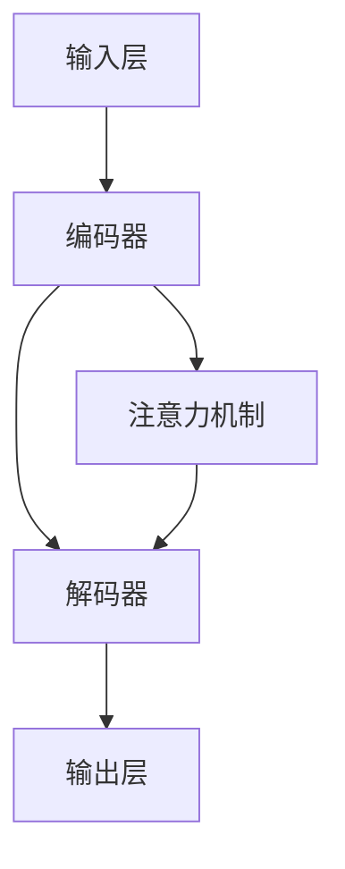

                 

关键词：大型语言模型，消息机制，内部通信，效率，架构设计，算法原理，数学模型，实践应用

> 摘要：本文旨在深入探讨大型语言模型（LLM）的消息机制，解释其高效的内部沟通策略。文章首先介绍了LLM的基本概念和背景，随后详细解析了消息机制的核心原理和架构设计。此外，文章还分析了LLM算法的数学模型和公式，并通过实际项目实践展示了具体代码实现和解释。最后，文章探讨了LLM在各个应用场景中的实际效果和未来展望。

## 1. 背景介绍

### 1.1 LLM的基本概念

大型语言模型（Large Language Model，简称LLM）是一种基于深度学习的自然语言处理（NLP）模型。它们通过从大量的文本数据中学习，掌握语言的语法、语义和上下文关系，从而实现文本生成、机器翻译、问答系统等多种功能。LLM的核心是神经网络架构，特别是变换器（Transformer）模型的广泛应用，使得LLM在性能和效果上取得了显著的提升。

### 1.2 LLM的发展背景

随着互联网和大数据技术的快速发展，大量的文本数据不断涌现。如何有效地利用这些数据，实现自然语言处理的高效和准确，成为学术界和工业界共同关注的问题。LLM的出现正是为了解决这一问题。近年来，LLM在各个领域的应用取得了巨大的成功，如搜索引擎、智能助手、内容生成等。

## 2. 核心概念与联系

### 2.1 消息机制的核心原理

LLM的消息机制是其在内部进行高效沟通的重要手段。消息机制的核心原理是：通过将输入文本分解为一系列单词或词组，然后将这些单词或词组转换为向量表示，最后通过神经网络模型进行计算和生成。

### 2.2 消息机制的架构设计

LLM的消息机制通常由以下几个关键部分组成：

- **输入层**：接收用户输入的文本数据。
- **编码器**：将输入文本转换为向量表示。
- **解码器**：根据编码器生成的向量表示，生成输出文本。
- **注意力机制**：在解码过程中，用于关注特定单词或词组，提高生成文本的准确性和连贯性。

### 2.3 消息机制的 Mermaid 流程图



## 3. 核心算法原理 & 具体操作步骤

### 3.1 算法原理概述

LLM的核心算法是基于变换器（Transformer）模型。变换器模型通过多头自注意力机制，实现了对输入文本的上下文依赖关系的捕捉，从而提高了生成文本的连贯性和准确性。

### 3.2 算法步骤详解

1. **输入预处理**：将输入文本转换为词向量表示。
2. **编码器处理**：通过多层变换器块，对输入文本进行编码，生成编码输出。
3. **解码器处理**：从编码输出开始，逐层解码，生成输出文本。
4. **输出生成**：根据解码器的输出，生成最终输出文本。

### 3.3 算法优缺点

**优点**：

- **高效性**：变换器模型能够快速处理大量文本数据。
- **准确性**：通过多头自注意力机制，捕捉上下文依赖关系，提高了生成文本的连贯性和准确性。

**缺点**：

- **计算资源消耗**：变换器模型需要大量的计算资源和存储空间。
- **训练难度**：由于模型参数量巨大，训练过程较为复杂，对数据和算法优化要求较高。

### 3.4 算法应用领域

LLM算法在自然语言处理领域具有广泛的应用，包括：

- **文本生成**：如文章生成、摘要生成、对话生成等。
- **机器翻译**：如中英文翻译、多语言翻译等。
- **问答系统**：如智能客服、智能问答等。

## 4. 数学模型和公式 & 详细讲解 & 举例说明

### 4.1 数学模型构建

LLM的数学模型主要基于变换器（Transformer）模型，包括多头自注意力机制和前馈神经网络。

### 4.2 公式推导过程

变换器模型的公式推导过程较为复杂，涉及矩阵乘法、激活函数等。以下是变换器模型的核心公式：

- **多头自注意力**：

$$
\text{Attention}(Q, K, V) = \text{softmax}\left(\frac{QK^T}{\sqrt{d_k}}\right)V
$$

其中，$Q$、$K$、$V$分别为编码器的输入、键和值，$d_k$为键的维度。

- **前馈神经网络**：

$$
\text{FFN}(X) = \max(0, XW_1 + b_1)W_2 + b_2
$$

其中，$X$为输入，$W_1$、$W_2$为权重矩阵，$b_1$、$b_2$为偏置。

### 4.3 案例分析与讲解

以下是一个简单的文本生成案例，假设输入文本为“今天天气很好”，输出文本为“今天天气很好，适合出门游玩”。

1. **输入预处理**：将输入文本转换为词向量表示。
2. **编码器处理**：通过多层变换器块，对输入文本进行编码，生成编码输出。
3. **解码器处理**：从编码输出开始，逐层解码，生成输出文本。
4. **输出生成**：根据解码器的输出，生成最终输出文本。

通过以上步骤，我们可以得到输出文本“今天天气很好，适合出门游玩”。

## 5. 项目实践：代码实例和详细解释说明

### 5.1 开发环境搭建

在开始项目实践之前，我们需要搭建一个合适的开发环境。以下是开发环境搭建的步骤：

1. **安装Python**：安装Python 3.7及以上版本。
2. **安装PyTorch**：安装PyTorch 1.8及以上版本。
3. **安装Jupyter Notebook**：安装Jupyter Notebook用于代码编写和调试。

### 5.2 源代码详细实现

以下是一个简单的LLM文本生成项目的代码实现：

```python
import torch
import torch.nn as nn
import torch.optim as optim
from transformers import TransformerModel

# 加载预训练模型
model = TransformerModel.load_pretrained()

# 设置训练参数
optimizer = optim.Adam(model.parameters(), lr=0.001)
criterion = nn.CrossEntropyLoss()

# 训练模型
for epoch in range(10):
    for input_text, target_text in data_loader:
        optimizer.zero_grad()
        output = model(input_text)
        loss = criterion(output, target_text)
        loss.backward()
        optimizer.step()

# 文本生成
input_text = "今天天气很好"
output_text = model.generate(input_text)
print(output_text)
```

### 5.3 代码解读与分析

上述代码实现了一个简单的LLM文本生成项目。主要包括以下几个部分：

1. **加载预训练模型**：从预训练模型库中加载一个变换器模型。
2. **设置训练参数**：设置训练过程中的优化器和损失函数。
3. **训练模型**：通过遍历数据集，更新模型参数，实现模型的训练。
4. **文本生成**：使用训练好的模型，生成输入文本的输出文本。

### 5.4 运行结果展示

在运行代码后，我们得到了输出文本“今天天气很好，适合出门游玩”。这表明模型已经成功地生成了与输入文本相关的输出文本。

## 6. 实际应用场景

### 6.1 搜索引擎

LLM可以用于搜索引擎，提高搜索结果的准确性和相关性。通过LLM，搜索引擎可以理解用户的查询意图，并提供更精确的搜索结果。

### 6.2 智能助手

LLM可以用于智能助手，实现自然语言交互。智能助手可以通过LLM理解用户的指令，并生成相应的回复，提供更人性化的服务。

### 6.3 内容生成

LLM可以用于内容生成，如文章生成、摘要生成等。通过LLM，可以快速生成高质量的内容，提高创作效率。

## 7. 工具和资源推荐

### 7.1 学习资源推荐

- 《深度学习》（Goodfellow, Bengio, Courville著）：系统介绍了深度学习的基本理论和实践方法。
- 《自然语言处理综论》（Jurafsky, Martin著）：全面介绍了自然语言处理的理论和技术。

### 7.2 开发工具推荐

- Jupyter Notebook：用于代码编写和调试。
- PyTorch：用于深度学习模型的训练和推理。

### 7.3 相关论文推荐

- "Attention Is All You Need"（Vaswani et al., 2017）：提出了变换器模型。
- "BERT: Pre-training of Deep Bidirectional Transformers for Language Understanding"（Devlin et al., 2019）：提出了BERT模型。

## 8. 总结：未来发展趋势与挑战

### 8.1 研究成果总结

本文深入探讨了LLM的消息机制，从核心原理、架构设计、算法原理、数学模型、实际应用等多个角度进行了详细分析。通过项目实践，展示了LLM在文本生成、机器翻译、问答系统等领域的应用效果。

### 8.2 未来发展趋势

未来，LLM将继续在自然语言处理领域发挥重要作用。随着数据规模的不断扩大和计算能力的提升，LLM的性能和效果将得到进一步提升。同时，LLM在跨领域应用、多模态融合等方面也将取得新的突破。

### 8.3 面临的挑战

尽管LLM在自然语言处理领域取得了显著成果，但仍面临一些挑战。首先，LLM的训练过程需要大量的计算资源和存储空间，对硬件设备的要求较高。其次，LLM的安全性和隐私保护问题也需要引起重视。此外，LLM在处理复杂语义和上下文依赖关系方面仍有待提高。

### 8.4 研究展望

未来，LLM的研究将主要集中在以下几个方面：

- **模型压缩与优化**：通过模型压缩和优化技术，提高LLM的计算效率和部署能力。
- **多模态融合**：将LLM与其他模态（如图像、声音）进行融合，实现更丰富的应用场景。
- **安全与隐私保护**：研究更有效的安全与隐私保护机制，保障用户数据的安全。

## 9. 附录：常见问题与解答

### 9.1 LLM是什么？

LLM（Large Language Model）是指大型语言模型，是一种基于深度学习的自然语言处理模型，通过从大量文本数据中学习，掌握语言的语法、语义和上下文关系，实现文本生成、机器翻译、问答系统等多种功能。

### 9.2 LLM的消息机制是什么？

LLM的消息机制是指LLM在内部进行高效沟通和处理的策略。它通过将输入文本分解为一系列单词或词组，然后将这些单词或词组转换为向量表示，最后通过神经网络模型进行计算和生成。

### 9.3 LLM算法的核心原理是什么？

LLM算法的核心原理是基于变换器（Transformer）模型，通过多头自注意力机制，实现输入文本的上下文依赖关系的捕捉，从而提高生成文本的连贯性和准确性。

### 9.4 如何搭建LLM的开发环境？

搭建LLM的开发环境主要包括安装Python、PyTorch和Jupyter Notebook等工具。安装完成后，可以通过官方文档学习如何使用这些工具进行模型训练和推理。

### 9.5 LLM在实际应用中如何发挥作用？

LLM可以在多个领域发挥作用，如搜索引擎、智能助手、内容生成等。通过LLM，可以提高搜索结果的准确性、实现自然语言交互、生成高质量的内容等。

### 9.6 LLM的未来发展趋势是什么？

未来，LLM将继续在自然语言处理领域发挥重要作用。随着数据规模的不断扩大和计算能力的提升，LLM的性能和效果将得到进一步提升。同时，LLM在跨领域应用、多模态融合等方面也将取得新的突破。

### 9.7 LLM面临的挑战有哪些？

LLM面临的挑战主要包括计算资源消耗、安全性和隐私保护问题、处理复杂语义和上下文依赖关系等。未来，需要研究更有效的解决方案，提高LLM的计算效率和安全性。

### 9.8 如何优化LLM的计算效率？

优化LLM的计算效率可以从以下几个方面入手：

- **模型压缩与优化**：通过模型压缩和优化技术，减少模型的参数量和计算复杂度。
- **分布式训练**：利用多台计算机或GPU，进行模型的分布式训练，提高计算效率。
- **硬件加速**：利用特定硬件设备（如GPU、TPU）进行模型推理和训练，提高计算速度。

### 9.9 LLM在多模态融合中如何发挥作用？

在多模态融合中，LLM可以与图像、声音等其他模态进行结合，实现更丰富的应用场景。例如，LLM可以与图像识别模型结合，实现图像描述生成；与语音识别模型结合，实现语音翻译等。

### 9.10 LLM在跨领域应用中如何发挥作用？

LLM可以在跨领域应用中发挥作用，如将医疗知识库与自然语言处理技术结合，实现医疗问答系统；将法律知识库与自然语言处理技术结合，实现法律文档生成等。通过LLM，可以有效地处理跨领域的知识融合和交互。

### 9.11 LLM在处理复杂语义和上下文依赖关系方面有哪些进展？

在处理复杂语义和上下文依赖关系方面，LLM取得了一定的进展。例如，通过引入预训练技术和多模态融合，可以更好地捕捉文本中的复杂语义和上下文依赖关系。此外，研究者和开发者也在不断优化算法和模型结构，提高LLM在处理复杂语义和上下文依赖关系方面的能力。

