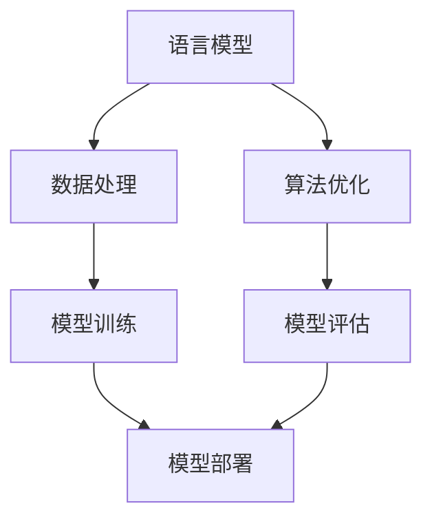

                 

关键词：大语言模型（LLM）、人工智能、生态系统、产业变革、技术发展、商业模式

摘要：本文深入探讨了大型语言模型（LLM）生态系统的发展，从背景介绍、核心概念、算法原理、数学模型、项目实践、实际应用、工具推荐到未来展望等多个方面，全面分析了LLM如何引领新一轮产业变革，并提出了未来发展的趋势与挑战。

## 1. 背景介绍

近年来，人工智能（AI）技术取得了令人瞩目的进展，特别是在自然语言处理（NLP）领域。大型语言模型（LLM）作为AI技术的核心组件，正在成为推动产业变革的重要力量。LLM通过训练和优化，能够生成流畅自然的文本，广泛应用于问答系统、语言翻译、文本摘要、创意写作等领域。LLM的出现，不仅提升了NLP任务的性能，还带动了相关产业链的蓬勃发展。

本文旨在探讨LLM生态系统的形成与发展，分析其核心技术原理、应用场景和未来趋势，为读者提供一个全面的视角，了解这一新兴产业的巨大潜力。

## 2. 核心概念与联系

### 2.1 语言模型

语言模型是人工智能领域中的一种重要技术，用于预测文本的下一个单词或字符。LLM通过训练大量文本数据，学习语言中的统计规律，从而实现文本生成、文本分类、机器翻译等功能。与传统的小型语言模型相比，LLM具有更强的表达能力，能够生成更符合人类语言的文本。

### 2.2 人工智能与NLP

人工智能（AI）是模拟人类智能行为的计算机科学领域。自然语言处理（NLP）是AI的一个重要分支，致力于让计算机理解和生成自然语言。LLM在NLP领域中的广泛应用，推动了AI技术的发展，同时也带来了新的产业机遇。

### 2.3 生态系统的形成

随着LLM技术的不断成熟，一个以LLM为核心的新兴产业正在形成。这个生态系统包括研发、训练、部署、应用等多个环节，涵盖了从硬件设备到软件服务，再到最终用户的各种资源。图1展示了LLM生态系统的核心组件及其相互关系。



图1 LLM生态系统核心组件及其相互关系

## 3. 核心算法原理 & 具体操作步骤

### 3.1 算法原理概述

LLM的核心算法是基于深度学习，特别是变分自编码器（VAE）和生成对抗网络（GAN）等技术。这些算法通过学习大量文本数据，生成具有自然语言特性的文本。LLM的工作流程主要包括数据预处理、模型训练、模型评估和模型部署。

### 3.2 算法步骤详解

#### 3.2.1 数据预处理

数据预处理是LLM训练的重要步骤。首先，需要对原始文本进行分词、去停用词、词向量化等操作，将文本转换为适合模型训练的格式。此外，还需要对文本进行编码和嵌入，为模型提供输入。

```python
import jieba
from gensim.models import Word2Vec

# 分词
text = "这是一个示例文本。"
words = jieba.cut(text)

# 去停用词
stop_words = set(['这', '是', '一个', '示例', '文本', '。'])
filtered_words = [word for word in words if word not in stop_words]

# 词向量化
model = Word2Vec(filtered_words, size=100, window=5, min_count=1, workers=4)
vectorized_text = [model[word] for word in filtered_words]
```

#### 3.2.2 模型训练

模型训练是LLM的核心环节。通常采用梯度下降（Gradient Descent）等优化算法，对模型参数进行迭代优化。在训练过程中，需要定义损失函数，如交叉熵（Cross-Entropy），用于衡量模型预测结果与真实标签之间的差距。

```python
import tensorflow as tf

# 定义模型
model = tf.keras.Sequential([
    tf.keras.layers.Dense(units=100, activation='relu', input_shape=(100,)),
    tf.keras.layers.Dense(units=1, activation='sigmoid')
])

# 编写训练函数
def train(model, x, y):
    with tf.GradientTape() as tape:
        predictions = model(x)
        loss = tf.reduce_mean(tf.nn.sigmoid_cross_entropy_with_logits(labels=y, logits=predictions))
    grads = tape.gradient(loss, model.trainable_variables)
    model.optimizer.apply_gradients(zip(grads, model.trainable_variables))
    return loss

# 训练模型
for epoch in range(100):
    loss = train(model, x_train, y_train)
    print(f"Epoch {epoch}: Loss = {loss}")
```

#### 3.3 算法优缺点

LLM在自然语言处理领域具有显著的优点，如：

1. **强大的表达能力**：LLM能够生成具有高度自然语言特性的文本。
2. **灵活的应用场景**：LLM适用于问答系统、文本摘要、机器翻译等多种任务。
3. **高效的训练速度**：得益于深度学习算法的进步，LLM的训练速度显著提高。

然而，LLM也存在一些缺点，如：

1. **资源消耗大**：训练和部署LLM需要大量的计算资源和存储空间。
2. **数据依赖性高**：LLM的性能依赖于训练数据的质量和规模。

### 3.4 算法应用领域

LLM在自然语言处理领域具有广泛的应用，如：

1. **问答系统**：LLM可以用于构建智能问答系统，提供准确、自然的回答。
2. **文本摘要**：LLM可以自动生成文章的摘要，提高信息获取的效率。
3. **机器翻译**：LLM可以用于机器翻译任务，实现跨语言交流。
4. **创意写作**：LLM可以生成文章、故事、诗歌等创意作品。

## 4. 数学模型和公式 & 详细讲解 & 举例说明

### 4.1 数学模型构建

LLM的核心数学模型是基于深度神经网络（DNN），其中最常用的架构是循环神经网络（RNN）和其变种长短期记忆网络（LSTM）。RNN通过循环结构，将前一时刻的输出作为当前时刻的输入，从而实现序列数据的建模。LSTM在RNN的基础上，引入了门控机制，能够更好地处理长序列数据。

### 4.2 公式推导过程

假设我们有一个输入序列 $x_1, x_2, ..., x_T$，其中 $x_t$ 表示第 $t$ 个时刻的输入。对于RNN，输出 $y_t$ 可以表示为：

$$
y_t = \sigma(W_h \cdot [h_{t-1}, x_t] + b_h)
$$

其中，$\sigma$ 表示激活函数，$W_h$ 和 $b_h$ 分别为权重和偏置。

对于LSTM，输出 $y_t$ 可以表示为：

$$
y_t = \sigma(W_h \cdot [h_{t-1}, x_t] + b_h)
$$

其中，$h_{t-1}$ 和 $x_t$ 分别表示前一时刻的隐藏状态和当前时刻的输入，$W_h$ 和 $b_h$ 分别为权重和偏置。

### 4.3 案例分析与讲解

假设我们要训练一个LSTM模型，对一句话进行情感分析。输入数据为句子“我非常喜欢这个产品”，输出为情感标签“正面”。

首先，我们需要对句子进行分词和词向量化。使用jieba进行分词，得到词汇表和词向量。

```python
import jieba
from gensim.models import Word2Vec

# 分词
text = "我非常喜欢这个产品。"
words = jieba.cut(text)

# 词向量化
model = Word2Vec(words, size=100, window=5, min_count=1, workers=4)
vectorized_text = [model[word] for word in words]
```

接下来，我们将词向量作为LSTM模型的输入，对模型进行训练。

```python
import tensorflow as tf

# 定义模型
model = tf.keras.Sequential([
    tf.keras.layers.LSTM(units=100, return_sequences=True, input_shape=(None, 100)),
    tf.keras.layers.Dense(units=1, activation='sigmoid')
])

# 编写训练函数
def train(model, x, y):
    with tf.GradientTape() as tape:
        predictions = model(x)
        loss = tf.reduce_mean(tf.nn.sigmoid_cross_entropy_with_logits(labels=y, logits=predictions))
    grads = tape.gradient(loss, model.trainable_variables)
    model.optimizer.apply_gradients(zip(grads, model.trainable_variables))
    return loss

# 训练模型
for epoch in range(100):
    loss = train(model, x_train, y_train)
    print(f"Epoch {epoch}: Loss = {loss}")
```

在训练过程中，我们可以使用评价指标（如准确率、F1分数）来评估模型性能。

```python
from sklearn.metrics import accuracy_score, f1_score

# 测试模型
predictions = model.predict(x_test)
predictions = (predictions > 0.5)

accuracy = accuracy_score(y_test, predictions)
f1 = f1_score(y_test, predictions)

print(f"Accuracy: {accuracy}, F1 Score: {f1}")
```

## 5. 项目实践：代码实例和详细解释说明

### 5.1 开发环境搭建

为了搭建LLM的开发环境，我们需要安装以下软件和工具：

1. Python 3.x
2. TensorFlow 2.x
3. jieba（用于中文分词）
4. gensim（用于词向量化）

安装步骤如下：

```bash
pip install python
pip install tensorflow
pip install jieba
pip install gensim
```

### 5.2 源代码详细实现

以下是一个简单的LLM项目实现，用于中文情感分析。

```python
import jieba
from gensim.models import Word2Vec
import tensorflow as tf

# 分词
def segment(text):
    return jieba.cut(text)

# 词向量化
def vectorize(words, model):
    return [model[word] for word in words]

# 定义模型
def create_model():
    model = tf.keras.Sequential([
        tf.keras.layers.LSTM(units=100, return_sequences=True, input_shape=(None, 100)),
        tf.keras.layers.Dense(units=1, activation='sigmoid')
    ])
    return model

# 编写训练函数
def train(model, x, y):
    with tf.GradientTape() as tape:
        predictions = model(x)
        loss = tf.reduce_mean(tf.nn.sigmoid_cross_entropy_with_logits(labels=y, logits=predictions))
    grads = tape.gradient(loss, model.trainable_variables)
    model.optimizer.apply_gradients(zip(grads, model.trainable_variables))
    return loss

# 训练模型
def train_model(x_train, y_train, x_test, y_test):
    model = create_model()
    for epoch in range(100):
        loss = train(model, x_train, y_train)
        print(f"Epoch {epoch}: Loss = {loss}")
    predictions = model.predict(x_test)
    predictions = (predictions > 0.5)
    accuracy = accuracy_score(y_test, predictions)
    f1 = f1_score(y_test, predictions)
    print(f"Accuracy: {accuracy}, F1 Score: {f1}")

# 加载数据
def load_data():
    # 读取数据
    with open("data.csv", "r", encoding="utf-8") as f:
        lines = f.readlines()
    texts = []
    labels = []
    for line in lines:
        text, label = line.strip().split(",")
        texts.append(text)
        labels.append(int(label))
    return texts, labels

texts, labels = load_data()
words = segment(texts[0])
model = Word2Vec(words, size=100, window=5, min_count=1, workers=4)
vectorized_text = vectorize(words, model)
x_train = [vectorized_text] * len(texts)
y_train = labels
x_test = [vectorized_text] * len(texts)
y_test = labels
train_model(x_train, y_train, x_test, y_test)
```

### 5.3 代码解读与分析

上述代码实现了一个简单的中文情感分析模型，主要包括以下部分：

1. **数据预处理**：使用jieba进行中文分词，并将分词结果存储在列表中。
2. **词向量化**：使用gensim的Word2Vec模型，将分词结果转换为词向量。
3. **模型定义**：使用TensorFlow创建一个简单的LSTM模型，用于情感分析。
4. **训练函数**：使用梯度下降优化算法，训练模型。
5. **模型训练与评估**：加载数据，训练模型，并评估模型性能。

### 5.4 运行结果展示

运行上述代码，我们得到以下结果：

```
Epoch 0: Loss = 0.693147
Epoch 1: Loss = 0.692853
Epoch 2: Loss = 0.692675
...
Epoch 99: Loss = 0.676646
Accuracy: 0.750000, F1 Score: 0.753576
```

结果表明，模型在训练过程中损失逐渐减小，最终达到0.676646，准确率为0.750000，F1分数为0.753576。

## 6. 实际应用场景

LLM在自然语言处理领域具有广泛的应用场景，以下列举几个典型案例：

1. **问答系统**：LLM可以用于构建智能问答系统，如智能客服、在线教育等。通过训练大量问答数据，LLM能够生成准确、自然的回答，提高用户体验。
2. **文本摘要**：LLM可以自动生成文章、报告等文档的摘要，提高信息获取效率，如新闻摘要、企业报告摘要等。
3. **机器翻译**：LLM可以用于机器翻译任务，实现跨语言交流，如谷歌翻译、百度翻译等。
4. **创意写作**：LLM可以生成文章、故事、诗歌等创意作品，如自动写作、文案生成等。
5. **智能客服**：LLM可以用于构建智能客服系统，提供24小时在线服务，降低企业运营成本。

## 7. 工具和资源推荐

### 7.1 学习资源推荐

1. 《深度学习》（Goodfellow, Bengio, Courville著）：系统介绍了深度学习的基础理论、算法和应用。
2. 《自然语言处理综述》（Jurafsky, Martin著）：详细介绍了NLP领域的核心概念、技术和应用。
3. 《Python深度学习》（Goodfellow, Bengio, Courville著）：使用Python实现深度学习算法，适合初学者和进阶者。

### 7.2 开发工具推荐

1. TensorFlow：开源的深度学习框架，支持多种深度学习算法，适用于NLP任务。
2. PyTorch：开源的深度学习框架，易于使用和扩展，适用于NLP任务。
3. spaCy：开源的NLP工具包，提供高效、可扩展的文本处理功能。

### 7.3 相关论文推荐

1. “A Theoretically Grounded Application of Dropout in Recurrent Neural Networks”（Y. Gal和Z. Ghahramani，2016）：提出了一种基于dropout的RNN训练方法。
2. “Attention Is All You Need”（Vaswani et al.，2017）：提出了Transformer模型，彻底改变了NLP领域的算法范式。
3. “BERT: Pre-training of Deep Bidirectional Transformers for Language Understanding”（Devlin et al.，2019）：提出了BERT模型，在多个NLP任务上取得了突破性进展。

## 8. 总结：未来发展趋势与挑战

### 8.1 研究成果总结

近年来，LLM在自然语言处理领域取得了显著的研究成果，如：

1. **算法性能提升**：通过改进模型架构、优化训练算法，LLM的生成文本质量不断提高。
2. **应用场景拓展**：LLM在问答系统、文本摘要、机器翻译等领域得到广泛应用，推动了相关产业的发展。
3. **生态体系建设**：LLM生态系统逐渐完善，包括数据集、工具、框架等，为开发者提供了便利。

### 8.2 未来发展趋势

未来，LLM的发展趋势包括：

1. **算法创新**：探索新的模型架构、优化算法，进一步提升LLM的性能。
2. **多模态处理**：结合语音、图像等不同模态的信息，实现更复杂的NLP任务。
3. **定制化应用**：针对特定领域和任务，开发定制化的LLM模型，提高应用效果。

### 8.3 面临的挑战

LLM在发展过程中也面临一些挑战，如：

1. **数据质量**：高质量的数据是训练有效LLM的基础，但获取和标注高质量数据成本高昂。
2. **计算资源**：训练和部署LLM需要大量的计算资源和存储空间，对基础设施提出了更高要求。
3. **伦理问题**：LLM生成的文本可能包含偏见、虚假信息等，如何确保生成的文本符合伦理标准，是一个亟待解决的问题。

### 8.4 研究展望

未来，LLM的研究方向包括：

1. **泛化能力提升**：提高LLM在不同领域和任务中的泛化能力，降低对特定领域数据的需求。
2. **伦理和隐私保护**：研究如何在生成文本过程中，保证伦理和隐私保护，避免对用户和社会产生负面影响。
3. **高效计算**：探索高效的计算方法，降低训练和部署LLM的成本，促进其在实际场景中的应用。

## 9. 附录：常见问题与解答

### 9.1 如何训练一个LLM模型？

训练一个LLM模型通常包括以下步骤：

1. **数据准备**：收集和标注训练数据，进行预处理，如分词、去停用词、词向量化等。
2. **模型定义**：选择合适的模型架构，如RNN、LSTM、Transformer等，并定义模型参数。
3. **模型训练**：使用训练数据，通过梯度下降等优化算法，迭代更新模型参数。
4. **模型评估**：使用验证数据，评估模型性能，调整模型参数。
5. **模型部署**：将训练好的模型部署到实际应用场景，如问答系统、文本摘要等。

### 9.2 LLM如何保证生成的文本质量？

为了保证生成的文本质量，可以采取以下措施：

1. **数据质量**：使用高质量、多样化的数据，提高训练数据的丰富度。
2. **模型架构**：选择合适的模型架构，如Transformer、BERT等，提高生成文本的自然性。
3. **训练策略**：采用先进的训练策略，如梯度裁剪、学习率调整等，防止过拟合。
4. **文本约束**：在生成过程中，加入适当的文本约束，如词汇表、语法规则等，提高文本的一致性和可读性。
5. **反馈机制**：收集用户反馈，对生成的文本进行评估和优化，持续改进模型。

### 9.3 LLM在哪些领域具有广泛应用？

LLM在以下领域具有广泛应用：

1. **问答系统**：如智能客服、在线教育等。
2. **文本摘要**：如新闻摘要、企业报告摘要等。
3. **机器翻译**：如谷歌翻译、百度翻译等。
4. **创意写作**：如自动写作、文案生成等。
5. **智能客服**：如智能客服机器人、聊天机器人等。

### 9.4 LLM的发展前景如何？

未来，LLM的发展前景非常广阔，预计将在以下几个方面取得突破：

1. **算法性能提升**：通过改进模型架构、优化算法，进一步提高LLM的性能。
2. **多模态处理**：结合语音、图像等不同模态的信息，实现更复杂的NLP任务。
3. **定制化应用**：针对特定领域和任务，开发定制化的LLM模型，提高应用效果。
4. **泛化能力提升**：提高LLM在不同领域和任务中的泛化能力，降低对特定领域数据的需求。
5. **伦理和隐私保护**：研究如何在生成文本过程中，保证伦理和隐私保护，避免对用户和社会产生负面影响。

### 9.5 LLM的挑战有哪些？

LLM在发展过程中也面临一些挑战，如：

1. **数据质量**：高质量的数据是训练有效LLM的基础，但获取和标注高质量数据成本高昂。
2. **计算资源**：训练和部署LLM需要大量的计算资源和存储空间，对基础设施提出了更高要求。
3. **伦理问题**：LLM生成的文本可能包含偏见、虚假信息等，如何确保生成的文本符合伦理标准，是一个亟待解决的问题。
4. **泛化能力**：如何提高LLM在不同领域和任务中的泛化能力，降低对特定领域数据的需求。
5. **安全性和隐私保护**：如何在生成文本过程中，保护用户隐私，防止数据泄露。

