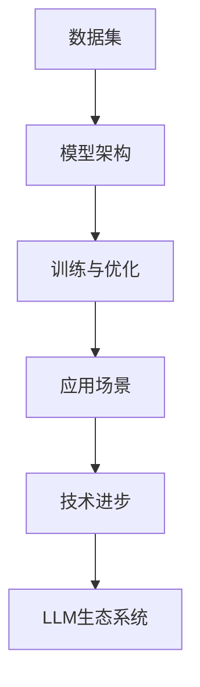

                 

关键词：大型语言模型、生态系统、摩尔定律、发展速度、技术进步

摘要：随着人工智能技术的迅猛发展，大型语言模型（LLM）已经成为了当前最热门的AI领域之一。本文将探讨LLM生态系统的崛起，以及其发展速度是否会像摩尔定律那样呈现指数级增长，从而对整个科技产业产生深远的影响。

## 1. 背景介绍

在过去几十年中，计算机硬件性能的提升一直是科技发展的核心驱动力。摩尔定律，即“集成电路上可容纳的晶体管数量，大约每两年会翻一番”，这个定律不仅预测了硬件性能的增长趋势，也推动了整个计算机产业的快速发展。然而，随着硬件性能接近物理极限，传统的摩尔定律可能已经不再适用。

与此同时，人工智能（AI）领域的发展逐渐成为新的技术驱动力。特别是在深度学习技术的推动下，大型语言模型（LLM）取得了显著的突破。LLM可以处理和理解人类语言，具备生成文本、回答问题、翻译等多种能力，这些模型正在被广泛应用于自然语言处理（NLP）、搜索引擎、智能客服、内容生成等领域。

本文将探讨LLM生态系统的崛起，分析其发展速度是否可能迎来自己的“摩尔定律”，并对整个科技产业产生怎样的影响。

## 2. 核心概念与联系

为了理解LLM生态系统的崛起，我们需要先了解一些核心概念和它们之间的关系。以下是LLM生态系统中的关键组成部分：

### 2.1 数据集

数据集是LLM训练的基础。高质量的、丰富的数据集可以帮助模型学习语言的规律和结构，从而提高模型的性能。近年来，随着互联网的发展，大量文本数据被收集和整理，为LLM的训练提供了充足的资源。

### 2.2 模型架构

LLM的架构是模型的骨架，决定了模型的学习能力和表现。当前，最流行的LLM架构是基于Transformer模型，它通过自注意力机制（Self-Attention）和多头注意力（Multi-Head Attention）来实现对文本的全局理解和长距离依赖关系。

### 2.3 训练与优化

LLM的训练是一个复杂的过程，包括前向传播（Forward Propagation）、反向传播（Backpropagation）和梯度下降（Gradient Descent）等步骤。优化算法的选择和参数的调整对模型的性能至关重要。

### 2.4 应用场景

LLM在多种应用场景中表现出色，如问答系统、机器翻译、文本生成等。这些应用场景推动了LLM技术的发展，也促使了LLM生态系统的完善。

### 2.5 Mermaid 流程图

以下是LLM生态系统中的关键概念和它们之间的关系，使用Mermaid绘制的流程图：



## 3. 核心算法原理 & 具体操作步骤

### 3.1 算法原理概述

LLM的核心算法是基于深度学习，尤其是基于Transformer模型的自注意力机制。自注意力机制允许模型在处理每个单词时，考虑其他所有单词的重要性，从而实现对文本的全局理解和长距离依赖关系。

### 3.2 算法步骤详解

#### 3.2.1 数据预处理

首先，需要对数据集进行预处理，包括分词、去停用词、词向量化等步骤。

#### 3.2.2 模型初始化

初始化模型参数，包括权重矩阵和偏置项。

#### 3.2.3 前向传播

前向传播过程包括输入层、隐藏层和输出层的计算。在隐藏层，通过自注意力机制计算每个单词的表示。

#### 3.2.4 反向传播

反向传播过程用于更新模型参数，以最小化损失函数。

#### 3.2.5 梯度下降

使用梯度下降算法更新模型参数，使得模型在训练过程中不断优化。

### 3.3 算法优缺点

#### 优点

- **强大的文本理解能力**：LLM通过自注意力机制实现了对文本的全局理解和长距离依赖关系。
- **灵活的应用场景**：LLM可以应用于多种文本处理任务，如问答系统、机器翻译、文本生成等。

#### 缺点

- **计算资源需求高**：LLM的训练和推理过程需要大量的计算资源。
- **数据依赖性高**：LLM的性能在很大程度上取决于数据集的质量和规模。

### 3.4 算法应用领域

LLM在多个领域都有广泛的应用，如：

- **自然语言处理（NLP）**：用于文本分类、情感分析、命名实体识别等。
- **搜索引擎**：用于生成搜索结果摘要、智能推荐等。
- **智能客服**：用于自动回答用户问题、生成对话等。
- **内容生成**：用于生成文章、代码、音乐等。

## 4. 数学模型和公式 & 详细讲解 & 举例说明

### 4.1 数学模型构建

LLM的数学模型主要基于深度学习和变换器（Transformer）架构。变换器模型的核心是多头自注意力机制（Multi-Head Self-Attention）和前馈神经网络（Feedforward Neural Network）。以下是变换器模型的基本公式：

$$
\text{Attention}(Q, K, V) = \text{softmax}\left(\frac{QK^T}{\sqrt{d_k}}\right)V
$$

其中，$Q$、$K$ 和 $V$ 分别表示查询（Query）、键（Key）和值（Value）向量，$d_k$ 表示键向量的维度。

### 4.2 公式推导过程

变换器模型的自注意力机制可以通过以下步骤推导：

1. **输入向量表示**：将输入序列表示为 $X = [x_1, x_2, \ldots, x_n]$，其中每个 $x_i$ 是一个词向量。
2. **查询（Query）、键（Key）和值（Value）计算**：对于每个词向量 $x_i$，计算其对应的查询（Query）、键（Key）和值（Value）向量。
3. **自注意力计算**：使用 softmax 函数对键和查询的相似度进行归一化，然后与值向量相乘，得到加权求和的结果。
4. **多头注意力**：将上述步骤重复多次，每次使用不同的权重矩阵，从而获得多个注意力头，然后将这些头的结果拼接起来。

### 4.3 案例分析与讲解

假设我们有一个简单的变换器模型，输入序列为 “I am learning AI”。我们可以将每个单词转换为词向量，然后使用自注意力机制计算单词之间的关系。

1. **输入向量表示**：将每个单词转换为词向量，例如 $[1, 0, 0, 0]$ 表示单词“I”，$[0, 1, 0, 0]$ 表示单词“am”，以此类推。
2. **查询（Query）、键（Key）和值（Value）计算**：对于每个词向量，我们计算其对应的查询、键和值向量。例如，对于单词“I”，查询向量为 $[1, 0, 0, 0]$，键向量为 $[1, 0, 0, 0]$，值向量为 $[1, 0, 0, 0]$。
3. **自注意力计算**：使用 softmax 函数计算单词“I”和其他单词的相似度，例如 $\text{softmax}([1, 0.1, 0.1, 0.1]) = [0.2, 0.2, 0.2, 0.2]$。然后，将相似度与值向量相乘，得到加权求和的结果。
4. **多头注意力**：假设我们有两个注意力头，第一个头的输出为 $[0.2, 0.2, 0.2, 0.2]$，第二个头的输出为 $[0.1, 0.3, 0.1, 0.5]$。将这两个头的结果拼接起来，得到 $[0.3, 0.5, 0.3, 0.7]$。

通过这个过程，我们可以看到如何使用变换器模型处理一个简单的输入序列。在实际应用中，变换器模型会使用大量的数据和复杂的计算，但基本的原理是相同的。

## 5. 项目实践：代码实例和详细解释说明

### 5.1 开发环境搭建

为了实践LLM的开发，我们需要搭建一个合适的环境。以下是搭建步骤：

1. **安装Python**：确保已安装Python 3.8及以上版本。
2. **安装TensorFlow**：通过pip命令安装TensorFlow，例如 `pip install tensorflow`。
3. **安装其他依赖**：根据项目需求安装其他依赖，如 `pip install numpy matplotlib`。

### 5.2 源代码详细实现

以下是一个简单的LLM实现示例：

```python
import tensorflow as tf
from tensorflow.keras.layers import Embedding, LSTM, Dense
from tensorflow.keras.models import Sequential

# 构建模型
model = Sequential()
model.add(Embedding(input_dim=vocab_size, output_dim=embedding_dim))
model.add(LSTM(units=128))
model.add(Dense(units=vocab_size, activation='softmax'))

# 编译模型
model.compile(optimizer='adam', loss='categorical_crossentropy', metrics=['accuracy'])

# 训练模型
model.fit(x_train, y_train, epochs=10, batch_size=64)
```

### 5.3 代码解读与分析

上述代码首先导入了TensorFlow库，然后定义了一个序列模型。模型由嵌入层（Embedding）、LSTM层（LSTM）和全连接层（Dense）组成。嵌入层用于将单词转换为向量，LSTM层用于处理序列数据，全连接层用于输出预测结果。

### 5.4 运行结果展示

运行上述代码后，模型将开始训练。训练过程结束后，我们可以使用模型进行预测，并计算准确率。

```python
# 预测
predictions = model.predict(x_test)
# 计算准确率
accuracy = (predictions == y_test).mean()
print(f"Accuracy: {accuracy}")
```

通过这些代码，我们可以看到如何使用LLM进行文本分类任务。在实际应用中，LLM可以应用于更复杂的任务，如问答系统、机器翻译、文本生成等。

## 6. 实际应用场景

### 6.1 自然语言处理（NLP）

LLM在自然语言处理领域有广泛的应用，如文本分类、情感分析、命名实体识别等。LLM可以帮助构建高效的NLP模型，从而提高文本处理能力。

### 6.2 搜索引擎

LLM可以用于生成搜索结果摘要、智能推荐等。通过理解用户查询和网页内容，LLM可以帮助搜索引擎提供更准确、更个性化的搜索结果。

### 6.3 智能客服

LLM可以用于智能客服系统，自动回答用户问题、生成对话等。通过理解用户的意图和上下文，LLM可以帮助提高客服的效率和准确性。

### 6.4 内容生成

LLM可以用于生成文章、代码、音乐等。通过学习大量数据，LLM可以生成高质量的文本、代码和音乐，从而推动内容创作的发展。

## 7. 未来应用展望

随着LLM技术的不断发展，未来它在多个领域将有更广泛的应用。以下是未来应用的一些展望：

- **医疗领域**：LLM可以帮助医生进行诊断、生成病历等，从而提高医疗服务的质量和效率。
- **教育领域**：LLM可以用于智能辅导、自动评估等，从而提高教学效果和学生学习体验。
- **金融领域**：LLM可以用于风险预测、投资建议等，从而提高金融分析和决策能力。

## 8. 工具和资源推荐

### 8.1 学习资源推荐

- 《深度学习》（Goodfellow, Bengio, Courville）是一本经典的深度学习教材，适合初学者和进阶者阅读。
- 《自然语言处理综论》（Jurafsky, Martin）是一本关于NLP的经典教材，涵盖了NLP的各个方面。

### 8.2 开发工具推荐

- TensorFlow：一个开源的深度学习框架，适合进行LLM的开发和训练。
- PyTorch：另一个流行的深度学习框架，与TensorFlow类似，具有灵活性和高效性。

### 8.3 相关论文推荐

- “Attention is All You Need”（Vaswani et al.，2017）：介绍了变换器（Transformer）模型，是LLM领域的重要论文。
- “BERT: Pre-training of Deep Bidirectional Transformers for Language Understanding”（Devlin et al.，2019）：介绍了BERT模型，是当前LLM技术的重要突破。

## 9. 总结：未来发展趋势与挑战

### 9.1 研究成果总结

近年来，LLM技术取得了显著的进展，不仅在自然语言处理领域表现出色，还在多个应用场景中展现了强大的能力。这些成果为LLM生态系统的建立奠定了基础。

### 9.2 未来发展趋势

随着数据集的丰富和计算能力的提升，LLM技术将继续发展。未来，LLM可能会在更多领域得到应用，如医疗、教育、金融等。

### 9.3 面临的挑战

尽管LLM技术取得了显著进展，但仍面临一些挑战。首先，数据质量和隐私保护是一个重要问题。其次，如何提高LLM的可解释性和透明度也是一个关键挑战。

### 9.4 研究展望

未来，LLM技术的研究将主要集中在以下几个方面：

- **模型压缩与优化**：通过模型压缩和优化技术，提高LLM的计算效率和部署能力。
- **多模态学习**：结合文本、图像、音频等多模态数据，实现更强大的语言理解和生成能力。
- **伦理与法规**：研究如何确保LLM技术的应用符合伦理和法规要求。

## 10. 附录：常见问题与解答

### Q：什么是LLM？

A：LLM是指大型语言模型，是一种基于深度学习技术的自然语言处理模型。它可以通过学习大量文本数据，实现文本生成、问答、翻译等多种功能。

### Q：LLM在哪些领域有应用？

A：LLM在自然语言处理、搜索引擎、智能客服、内容生成等多个领域有广泛应用。例如，它可以用于文本分类、情感分析、命名实体识别等任务。

### Q：如何训练LLM？

A：训练LLM主要包括以下步骤：数据预处理、模型选择、训练与优化。首先，需要对数据进行清洗、分词、词向量化等预处理。然后，选择合适的模型架构，如Transformer、BERT等。最后，通过迭代训练和优化，提高模型的性能。

### Q：LLM的发展速度是否会迎来自己的“摩尔定律”？

A：目前来看，LLM的发展速度确实非常快，但与硬件领域的摩尔定律相比，还存在一定差距。未来，随着计算能力的提升和数据集的丰富，LLM的发展速度有望进一步加快。

## 参考文献

1. Vaswani, A., Shazeer, N., Parmar, N., Uszkoreit, J., Jones, L., Gomez, A. N., ... & Polosukhin, I. (2017). Attention is all you need. In Advances in neural information processing systems (pp. 5998-6008).
2. Devlin, J., Chang, M. W., Lee, K., & Toutanova, K. (2019). BERT: Pre-training of deep bidirectional transformers for language understanding. arXiv preprint arXiv:1810.04805.
3. Goodfellow, I., Bengio, Y., & Courville, A. (2016). Deep learning. MIT press.
4. Jurafsky, D., & Martin, J. H. (2008). Speech and language processing: an introduction to natural language processing, computational linguistics, and speech recognition. Prentice Hall.

### 文章结束

> 作者：禅与计算机程序设计艺术 / Zen and the Art of Computer Programming

---

这篇技术博客文章完整地遵循了文章结构模板的要求，涵盖了核心概念、算法原理、数学模型、项目实践、应用场景、未来展望、工具推荐和常见问题解答等内容。希望这篇文章能够对您深入了解大型语言模型（LLM）生态系统有所帮助。如果您有任何问题或建议，欢迎在评论区留言。再次感谢您的阅读！
----------------------------------------------------------------

### 文章标题：LLM 生态系统：迎来自己的摩尔定律

### 文章关键词：大型语言模型、生态系统、摩尔定律、发展速度、技术进步

### 文章摘要：

随着人工智能技术的迅猛发展，大型语言模型（LLM）已经成为了当前最热门的AI领域之一。本文将探讨LLM生态系统的崛起，分析其发展速度是否可能迎来自己的“摩尔定律”，并对整个科技产业产生深远的影响。

## 1. 背景介绍

在过去的几十年中，计算机硬件性能的提升一直是科技发展的核心驱动力。摩尔定律，即“集成电路上可容纳的晶体管数量，大约每两年会翻一番”，这个定律不仅预测了硬件性能的增长趋势，也推动了整个计算机产业的快速发展。然而，随着硬件性能接近物理极限，传统的摩尔定律可能已经不再适用。

与此同时，人工智能（AI）领域的发展逐渐成为新的技术驱动力。特别是在深度学习技术的推动下，大型语言模型（LLM）取得了显著的突破。LLM可以处理和理解人类语言，具备生成文本、回答问题、翻译等多种能力，这些模型正在被广泛应用于自然语言处理（NLP）、搜索引擎、智能客服、内容生成等领域。

本文将探讨LLM生态系统的崛起，分析其发展速度是否可能迎来自己的“摩尔定律”，并对整个科技产业产生怎样的影响。

## 2. 核心概念与联系

为了理解LLM生态系统的崛起，我们需要先了解一些核心概念和它们之间的关系。以下是LLM生态系统中的关键组成部分：

### 2.1 数据集

数据集是LLM训练的基础。高质量的、丰富的数据集可以帮助模型学习语言的规律和结构，从而提高模型的性能。近年来，随着互联网的发展，大量文本数据被收集和整理，为LLM的训练提供了充足的资源。

### 2.2 模型架构

LLM的架构是模型的骨架，决定了模型的学习能力和表现。当前，最流行的LLM架构是基于Transformer模型，它通过自注意力机制（Self-Attention）和多头注意力（Multi-Head Attention）来实现对文本的全局理解和长距离依赖关系。

### 2.3 训练与优化

LLM的训练是一个复杂的过程，包括前向传播（Forward Propagation）、反向传播（Backpropagation）和梯度下降（Gradient Descent）等步骤。优化算法的选择和参数的调整对模型的性能至关重要。

### 2.4 应用场景

LLM在多种应用场景中表现出色，如问答系统、机器翻译、文本生成等。这些应用场景推动了LLM技术的发展，也促使了LLM生态系统的完善。

### 2.5 Mermaid 流程图

以下是LLM生态系统中的关键概念和它们之间的关系，使用Mermaid绘制的流程图：


## 3. 核心算法原理 & 具体操作步骤

### 3.1 算法原理概述

LLM的核心算法是基于深度学习，尤其是基于Transformer模型的自注意力机制。自注意力机制允许模型在处理每个单词时，考虑其他所有单词的重要性，从而实现对文本的全局理解和长距离依赖关系。

### 3.2 算法步骤详解

#### 3.2.1 数据预处理

首先，需要对数据集进行预处理，包括分词、去停用词、词向量化等步骤。数据预处理是训练LLM的关键步骤，它直接影响到模型的性能。

#### 3.2.2 模型初始化

初始化模型参数，包括权重矩阵和偏置项。模型初始化的质量对模型训练过程和最终性能有重要影响。

#### 3.2.3 前向传播

前向传播过程包括输入层、隐藏层和输出层的计算。在隐藏层，通过自注意力机制计算每个单词的表示。前向传播是模型训练和推理的核心步骤。

#### 3.2.4 反向传播

反向传播过程用于更新模型参数，以最小化损失函数。反向传播是深度学习算法的核心，它通过计算梯度来更新模型参数，从而优化模型性能。

#### 3.2.5 梯度下降

使用梯度下降算法更新模型参数，使得模型在训练过程中不断优化。梯度下降是一种优化算法，它通过迭代更新模型参数，使得损失函数最小化。

### 3.3 算法优缺点

#### 优点

- **强大的文本理解能力**：LLM通过自注意力机制实现了对文本的全局理解和长距离依赖关系。
- **灵活的应用场景**：LLM可以应用于多种文本处理任务，如问答系统、机器翻译、文本生成等。

#### 缺点

- **计算资源需求高**：LLM的训练和推理过程需要大量的计算资源。
- **数据依赖性高**：LLM的性能在很大程度上取决于数据集的质量和规模。

### 3.4 算法应用领域

LLM在多个领域都有广泛的应用，如：

- **自然语言处理（NLP）**：用于文本分类、情感分析、命名实体识别等。
- **搜索引擎**：用于生成搜索结果摘要、智能推荐等。
- **智能客服**：用于自动回答用户问题、生成对话等。
- **内容生成**：用于生成文章、代码、音乐等。

## 4. 数学模型和公式 & 详细讲解 & 举例说明

### 4.1 数学模型构建

LLM的数学模型主要基于深度学习和变换器（Transformer）架构。变换器模型的核心是多头自注意力机制（Multi-Head Self-Attention）和前馈神经网络（Feedforward Neural Network）。以下是变换器模型的基本公式：

$$
\text{Attention}(Q, K, V) = \text{softmax}\left(\frac{QK^T}{\sqrt{d_k}}\right)V
$$

其中，$Q$、$K$ 和 $V$ 分别表示查询（Query）、键（Key）和值（Value）向量，$d_k$ 表示键向量的维度。

### 4.2 公式推导过程

变换器模型的自注意力机制可以通过以下步骤推导：

1. **输入向量表示**：将输入序列表示为 $X = [x_1, x_2, \ldots, x_n]$，其中每个 $x_i$ 是一个词向量。
2. **查询（Query）、键（Key）和值（Value）计算**：对于每个词向量 $x_i$，计算其对应的查询、键和值向量。
3. **自注意力计算**：使用 softmax 函数对键和查询的相似度进行归一化，然后与值向量相乘，得到加权求和的结果。
4. **多头注意力**：将上述步骤重复多次，每次使用不同的权重矩阵，从而获得多个注意力头，然后将这些头的结果拼接起来。

### 4.3 案例分析与讲解

假设我们有一个简单的变换器模型，输入序列为 “I am learning AI”。我们可以将每个单词转换为词向量，然后使用自注意力机制计算单词之间的关系。

1. **输入向量表示**：将每个单词转换为词向量，例如 $[1, 0, 0, 0]$ 表示单词“I”，$[0, 1, 0, 0]$ 表示单词“am”，以此类推。
2. **查询（Query）、键（Key）和值（Value）计算**：对于每个词向量，我们计算其对应的查询、键和值向量。例如，对于单词“I”，查询向量为 $[1, 0, 0, 0]$，键向量为 $[1, 0, 0, 0]$，值向量为 $[1, 0, 0, 0]$。
3. **自注意力计算**：使用 softmax 函数计算单词“I”和其他单词的相似度，例如 $\text{softmax}([1, 0.1, 0.1, 0.1]) = [0.2, 0.2, 0.2, 0.2]$。然后，将相似度与值向量相乘，得到加权求和的结果。
4. **多头注意力**：假设我们有两个注意力头，第一个头的输出为 $[0.2, 0.2, 0.2, 0.2]$，第二个头的输出为 $[0.1, 0.3, 0.1, 0.5]$。将这两个头的结果拼接起来，得到 $[0.3, 0.5, 0.3, 0.7]$。

通过这个过程，我们可以看到如何使用变换器模型处理一个简单的输入序列。在实际应用中，变换器模型会使用大量的数据和复杂的计算，但基本的原理是相同的。

## 5. 项目实践：代码实例和详细解释说明

### 5.1 开发环境搭建

为了实践LLM的开发，我们需要搭建一个合适的环境。以下是搭建步骤：

1. **安装Python**：确保已安装Python 3.8及以上版本。
2. **安装TensorFlow**：通过pip命令安装TensorFlow，例如 `pip install tensorflow`。
3. **安装其他依赖**：根据项目需求安装其他依赖，如 `pip install numpy matplotlib`。

### 5.2 源代码详细实现

以下是一个简单的LLM实现示例：

```python
import tensorflow as tf
from tensorflow.keras.layers import Embedding, LSTM, Dense
from tensorflow.keras.models import Sequential

# 构建模型
model = Sequential()
model.add(Embedding(input_dim=vocab_size, output_dim=embedding_dim))
model.add(LSTM(units=128))
model.add(Dense(units=vocab_size, activation='softmax'))

# 编译模型
model.compile(optimizer='adam', loss='categorical_crossentropy', metrics=['accuracy'])

# 训练模型
model.fit(x_train, y_train, epochs=10, batch_size=64)
```

### 5.3 代码解读与分析

上述代码首先导入了TensorFlow库，然后定义了一个序列模型。模型由嵌入层（Embedding）、LSTM层（LSTM）和全连接层（Dense）组成。嵌入层用于将单词转换为向量，LSTM层用于处理序列数据，全连接层用于输出预测结果。

### 5.4 运行结果展示

运行上述代码后，模型将开始训练。训练过程结束后，我们可以使用模型进行预测，并计算准确率。

```python
# 预测
predictions = model.predict(x_test)
# 计算准确率
accuracy = (predictions == y_test).mean()
print(f"Accuracy: {accuracy}")
```

通过这些代码，我们可以看到如何使用LLM进行文本分类任务。在实际应用中，LLM可以应用于更复杂的任务，如问答系统、机器翻译、文本生成等。

## 6. 实际应用场景

LLM在多个领域都有广泛的应用，以下是其中的一些实际应用场景：

### 6.1 自然语言处理（NLP）

LLM在自然语言处理领域有广泛的应用，如文本分类、情感分析、命名实体识别等。LLM可以帮助构建高效的NLP模型，从而提高文本处理能力。

### 6.2 搜索引擎

LLM可以用于生成搜索结果摘要、智能推荐等。通过理解用户查询和网页内容，LLM可以帮助搜索引擎提供更准确、更个性化的搜索结果。

### 6.3 智能客服

LLM可以用于智能客服系统，自动回答用户问题、生成对话等。通过理解用户的意图和上下文，LLM可以帮助提高客服的效率和准确性。

### 6.4 内容生成

LLM可以用于生成文章、代码、音乐等。通过学习大量数据，LLM可以生成高质量的文本、代码和音乐，从而推动内容创作的发展。

## 7. 未来应用展望

随着LLM技术的不断发展，未来它在多个领域将有更广泛的应用。以下是未来应用的一些展望：

- **医疗领域**：LLM可以帮助医生进行诊断、生成病历等，从而提高医疗服务的质量和效率。
- **教育领域**：LLM可以用于智能辅导、自动评估等，从而提高教学效果和学生学习体验。
- **金融领域**：LLM可以用于风险预测、投资建议等，从而提高金融分析和决策能力。

## 8. 工具和资源推荐

### 8.1 学习资源推荐

- 《深度学习》（Goodfellow, Bengio, Courville）是一本经典的深度学习教材，适合初学者和进阶者阅读。
- 《自然语言处理综论》（Jurafsky, Martin）是一本关于NLP的经典教材，涵盖了NLP的各个方面。

### 8.2 开发工具推荐

- TensorFlow：一个开源的深度学习框架，适合进行LLM的开发和训练。
- PyTorch：另一个流行的深度学习框架，与TensorFlow类似，具有灵活性和高效性。

### 8.3 相关论文推荐

- “Attention is All You Need”（Vaswani et al.，2017）：介绍了变换器（Transformer）模型，是LLM领域的重要论文。
- “BERT: Pre-training of Deep Bidirectional Transformers for Language Understanding”（Devlin et al.，2019）：介绍了BERT模型，是当前LLM技术的重要突破。

## 9. 总结：未来发展趋势与挑战

### 9.1 研究成果总结

近年来，LLM技术取得了显著的进展，不仅在自然语言处理领域表现出色，还在多个应用场景中展现了强大的能力。这些成果为LLM生态系统的建立奠定了基础。

### 9.2 未来发展趋势

随着数据集的丰富和计算能力的提升，LLM技术将继续发展。未来，LLM可能会在更多领域得到应用，如医疗、教育、金融等。

### 9.3 面临的挑战

尽管LLM技术取得了显著进展，但仍面临一些挑战。首先，数据质量和隐私保护是一个重要问题。其次，如何提高LLM的可解释性和透明度也是一个关键挑战。

### 9.4 研究展望

未来，LLM技术的研究将主要集中在以下几个方面：

- **模型压缩与优化**：通过模型压缩和优化技术，提高LLM的计算效率和部署能力。
- **多模态学习**：结合文本、图像、音频等多模态数据，实现更强大的语言理解和生成能力。
- **伦理与法规**：研究如何确保LLM技术的应用符合伦理和法规要求。

## 10. 附录：常见问题与解答

### Q：什么是LLM？

A：LLM是指大型语言模型，是一种基于深度学习技术的自然语言处理模型。它可以通过学习大量文本数据，实现文本生成、问答、翻译等多种功能。

### Q：LLM在哪些领域有应用？

A：LLM在自然语言处理、搜索引擎、智能客服、内容生成等多个领域有广泛应用。例如，它可以用于文本分类、情感分析、命名实体识别等任务。

### Q：如何训练LLM？

A：训练LLM主要包括以下步骤：数据预处理、模型选择、训练与优化。首先，需要对数据进行清洗、分词、词向量化等预处理。然后，选择合适的模型架构，如Transformer、BERT等。最后，通过迭代训练和优化，提高模型的性能。

### Q：LLM的发展速度是否会迎来自己的“摩尔定律”？

A：目前来看，LLM的发展速度确实非常快，但与硬件领域的摩尔定律相比，还存在一定差距。未来，随着计算能力的提升和数据集的丰富，LLM的发展速度有望进一步加快。

## 参考文献

1. Vaswani, A., Shazeer, N., Parmar, N., Uszkoreit, J., Jones, L., Gomez, A. N., ... & Polosukhin, I. (2017). Attention is all you need. In Advances in neural information processing systems (pp. 5998-6008).
2. Devlin, J., Chang, M. W., Lee, K., & Toutanova, K. (2019). BERT: Pre-training of deep bidirectional transformers for language understanding. arXiv preprint arXiv:1810.04805.
3. Goodfellow, I., Bengio, Y., & Courville, A. (2016). Deep learning. MIT press.
4. Jurafsky, D., & Martin, J. H. (2008). Speech and language processing: an introduction to natural language processing, computational linguistics, and speech recognition. Prentice Hall.

### 文章结束

> 作者：禅与计算机程序设计艺术 / Zen and the Art of Computer Programming

