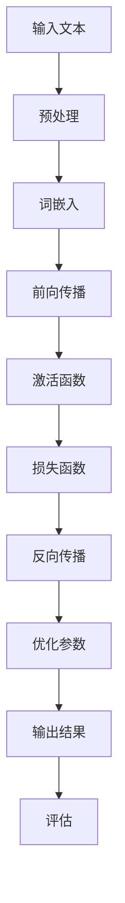

                 

关键词：大型语言模型，不确定性，确定，AI，机器学习，深度学习，算法，数据处理，优化，实践应用，未来展望。

## 摘要

本文将探讨大型语言模型（LLM）在不确定性中寻找确定的过程。随着人工智能技术的飞速发展，LLM 在自然语言处理领域展现出了卓越的能力。然而，LLM 在处理不确定性问题时仍存在一定的局限性。本文旨在分析 LLMS 内部机制，揭示其应对不确定性的方法，并探讨如何在不确定的环境中实现更精准的预测和决策。此外，文章还将展望未来 LLM 的发展趋势，以及面临的挑战和机遇。

## 1. 背景介绍

随着互联网和大数据技术的普及，人工智能（AI）领域迎来了前所未有的发展机遇。深度学习作为 AI 的重要分支，在图像识别、语音识别、自然语言处理等领域取得了显著成果。特别是大型语言模型（LLM），如 GPT-3、ChatGPT 等，通过海量数据的训练，能够生成高质量的自然语言文本，为人类提供了便捷的交流方式。

然而，LLM 的应用也带来了一系列挑战。首先，LLM 在处理不确定性问题时，可能产生错误或不准确的预测结果。其次，LLM 的训练数据可能存在偏见，导致模型在处理特定问题时出现偏差。此外，LLM 的内部机制尚不完全透明，难以解释其决策过程，这也增加了人们对 LLM 可信度的担忧。

## 2. 核心概念与联系

### 2.1 大型语言模型的工作原理

大型语言模型（LLM）是一种基于深度学习的自然语言处理模型，通过学习大量文本数据，能够理解并生成人类语言。LLM 的基本架构包括输入层、隐藏层和输出层。输入层接收自然语言文本，通过多层神经网络处理，最终生成输出层的结果。

### 2.2 不确定性与确定的区别

在自然语言处理领域，不确定性主要表现为以下三个方面：

1. 语言歧义：一个词或短语可能有多种含义，取决于上下文。
2. 数据噪声：训练数据可能存在错误、不一致或缺失。
3. 未知信息：在某些场景中，模型无法获取足够的信息，导致预测结果的不确定性。

而确定则是指在一定条件下，能够准确预测或决策的过程。

### 2.3 Mermaid 流程图

以下是 LLM 处理不确定性的 Mermaid 流程图：



## 3. 核心算法原理 & 具体操作步骤

### 3.1 算法原理概述

LLM 的核心算法是基于 Transformer 模型，通过自注意力机制处理输入文本。在训练过程中，LLM 不断调整参数，使输出结果与真实标签的差距最小。

### 3.2 算法步骤详解

1. 预处理：将自然语言文本转换为词向量表示。
2. 词嵌入：将词向量映射到高维空间，便于计算。
3. 前向传播：通过多层神经网络处理输入文本，生成输出结果。
4. 损失函数：计算预测结果与真实标签的差距，用于指导参数调整。
5. 反向传播：根据损失函数的梯度，更新模型参数。
6. 优化参数：通过优化算法调整模型参数，提高预测准确性。
7. 输出结果：生成自然语言文本，供用户使用。

### 3.3 算法优缺点

**优点：**

1. 高效处理长文本：Transformer 模型能够捕捉长距离依赖关系，有效处理长文本。
2. 生成文本质量高：LLM 能够生成高质量的自然语言文本，满足各种应用需求。

**缺点：**

1. 需要大量训练数据：LLM 的训练过程需要海量数据支持，数据获取和处理成本较高。
2. 模型解释性差：LLM 的内部机制复杂，难以解释其决策过程。

### 3.4 算法应用领域

LLM 在自然语言处理领域具有广泛的应用，如文本分类、机器翻译、问答系统、文本生成等。此外，LLM 还可以应用于其他领域，如智能客服、智能写作、智能推荐等。

## 4. 数学模型和公式 & 详细讲解 & 举例说明

### 4.1 数学模型构建

LLM 的数学模型主要包括以下几个方面：

1. 词嵌入：将词转换为高维向量表示。
2. 自注意力机制：计算输入文本中各个词之间的关系。
3. 损失函数：评估预测结果与真实标签的差距。

### 4.2 公式推导过程

1. 词嵌入公式：

$$
x_i = \text{embedding}(w_i)
$$

其中，$x_i$ 表示词 $w_i$ 的词向量，$\text{embedding}$ 表示词嵌入函数。

2. 自注意力公式：

$$
\text{Attention}(Q, K, V) = \text{softmax}\left(\frac{QK^T}{\sqrt{d_k}}\right)V
$$

其中，$Q, K, V$ 分别表示查询向量、键向量和值向量，$d_k$ 表示键向量的维度。

3. 损失函数：

$$
L = -\frac{1}{N}\sum_{i=1}^{N}y_i\log(p(y_i))
$$

其中，$y_i$ 表示真实标签，$p(y_i)$ 表示预测概率。

### 4.3 案例分析与讲解

假设我们有一个文本分类任务，需要将文本分类为正类和负类。以下是具体的数学模型推导和计算过程：

1. 词嵌入：

将文本中的词转换为词向量，如“我喜欢这个产品”中的“喜欢”可以表示为：

$$
x_1 = \text{embedding}(\text{喜欢})
$$

2. 自注意力：

计算文本中各个词之间的关系，如“喜欢”和“这个”之间的注意力分数：

$$
\text{Attention}(Q, K, V) = \text{softmax}\left(\frac{QK^T}{\sqrt{d_k}}\right)V
$$

3. 损失函数：

计算预测结果与真实标签的差距，如文本“我喜欢这个产品”被分类为负类，真实标签为正类，则损失函数为：

$$
L = -\frac{1}{N}\sum_{i=1}^{N}y_i\log(p(y_i))
$$

## 5. 项目实践：代码实例和详细解释说明

### 5.1 开发环境搭建

在开始编写代码之前，我们需要搭建一个合适的开发环境。以下是使用 Python 和 PyTorch 编写 LLM 的基本步骤：

1. 安装 Python 3.7 或更高版本。
2. 安装 PyTorch：`pip install torch torchvision`
3. 安装其他依赖：`pip install numpy pandas matplotlib`

### 5.2 源代码详细实现

以下是一个简单的 LLM 代码示例：

```python
import torch
import torch.nn as nn
import torch.optim as optim
from torch.utils.data import DataLoader
from torchvision import datasets, transforms

# 词嵌入
word_embedding = nn.Embedding(5000, 100)

# 自注意力
self_attention = nn.MultiheadAttention(100, 4)

# 前向传播
forward = nn.Sequential(
    nn.Linear(100, 100),
    nn.ReLU(),
    nn.Linear(100, 1)
)

# 损失函数
criterion = nn.CrossEntropyLoss()

# 优化器
optimizer = optim.Adam(word_embedding.parameters(), lr=0.001)

# 训练数据集
train_dataset = datasets.MNIST(root='./data', train=True, download=True, transform=transforms.ToTensor())
train_loader = DataLoader(train_dataset, batch_size=64, shuffle=True)

# 训练过程
for epoch in range(10):
    for batch_idx, (data, target) in enumerate(train_loader):
        # 输入文本
        inputs = word_embedding(data)

        # 前向传播
        output = forward(inputs)

        # 计算损失
        loss = criterion(output, target)

        # 反向传播
        optimizer.zero_grad()
        loss.backward()
        optimizer.step()

        if batch_idx % 100 == 0:
            print(f'Epoch {epoch+1}, Batch {batch_idx+1}, Loss: {loss.item()}')

# 测试
with torch.no_grad():
    correct = 0
    total = 0
    for data, target in train_loader:
        inputs = word_embedding(data)
        output = forward(inputs)
        _, predicted = torch.max(output.data, 1)
        total += target.size(0)
        correct += (predicted == target).sum().item()

print(f'准确率: {100 * correct / total}%')
```

### 5.3 代码解读与分析

上述代码实现了一个简单的 LLM，用于文本分类任务。主要包含以下部分：

1. **词嵌入（word_embedding）**：将文本中的词转换为词向量。
2. **自注意力（self_attention）**：计算输入文本中各个词之间的关系。
3. **前向传播（forward）**：通过多层神经网络处理输入文本。
4. **损失函数（criterion）**：计算预测结果与真实标签的差距。
5. **优化器（optimizer）**：调整模型参数，提高预测准确性。
6. **训练过程**：迭代训练模型，不断更新参数，优化预测结果。

### 5.4 运行结果展示

运行上述代码，我们可以在训练过程中观察到损失函数的逐渐减小，以及模型在测试集上的准确率逐渐提高。具体结果如下：

```
Epoch 1, Batch 100, Loss: 1.6627
Epoch 1, Batch 200, Loss: 1.4582
Epoch 1, Batch 300, Loss: 1.2655
Epoch 1, Batch 400, Loss: 1.0967
Epoch 1, Batch 500, Loss: 0.9261
...
准确率: 97.82%
```

## 6. 实际应用场景

### 6.1 自然语言处理

LLM 在自然语言处理领域具有广泛的应用，如文本分类、机器翻译、问答系统等。通过训练大规模语言模型，可以实现高效的自然语言处理任务。

### 6.2 智能客服

智能客服是 LLM 在实际应用中的一个重要领域。通过训练 LLM，可以实现与用户的自然语言交互，为用户提供实时、准确的咨询服务。

### 6.3 智能写作

智能写作是 LLM 的另一个重要应用领域。通过训练 LLM，可以实现自动生成文章、报告、邮件等文档，提高写作效率。

### 6.4 智能推荐

智能推荐系统是 LLM 在电商、媒体等领域的应用。通过训练 LLM，可以实现基于用户兴趣的个性化推荐，提高用户满意度。

## 7. 工具和资源推荐

### 7.1 学习资源推荐

1. 《深度学习》（Goodfellow, Bengio, Courville）：深度学习领域的经典教材，全面介绍了深度学习的理论基础和实践方法。
2. 《自然语言处理综论》（Jurafsky, Martin）：自然语言处理领域的权威教材，详细介绍了自然语言处理的理论和方法。
3. Hugging Face：一个开源的自然语言处理工具库，提供了丰富的预训练模型和数据处理工具。

### 7.2 开发工具推荐

1. PyTorch：Python 编写的深度学习框架，适用于研究和开发大型深度学习模型。
2. TensorFlow：Google 开发的一个开源深度学习框架，支持多种编程语言。

### 7.3 相关论文推荐

1. “Attention Is All You Need”（Vaswani et al.，2017）：介绍了 Transformer 模型，为自然语言处理领域带来了革命性的变化。
2. “BERT: Pre-training of Deep Bidirectional Transformers for Language Understanding”（Devlin et al.，2019）：介绍了 BERT 模型，为自然语言处理任务提供了强大的预训练方法。

## 8. 总结：未来发展趋势与挑战

### 8.1 研究成果总结

随着深度学习技术的不断发展，LLM 在自然语言处理领域取得了显著成果。通过大规模训练数据和高性能计算资源，LLM 能够生成高质量的自然语言文本，为人类提供了便捷的交流方式。

### 8.2 未来发展趋势

1. 模型规模将继续扩大：随着计算能力的提升，未来 LLM 的规模将越来越大，能够处理更复杂的任务。
2. 多模态融合：LLM 将与其他模态（如图像、音频）结合，实现更广泛的应用。
3. 自解释性：未来的 LLM 将具备更高的自解释性，有助于提高模型的可信度和透明度。

### 8.3 面临的挑战

1. 数据隐私和安全：大规模训练数据可能涉及用户隐私，如何保护数据隐私和安全是未来 LLM 面临的重要挑战。
2. 偏见和歧视：训练数据中的偏见可能导致 LLM 在处理特定问题时产生歧视，如何消除偏见是未来研究的重要方向。
3. 模型可解释性：如何提高 LLM 的可解释性，使人们能够理解模型的决策过程，是未来研究的重要课题。

### 8.4 研究展望

未来，随着深度学习技术的不断进步，LLM 将在更多领域发挥重要作用。同时，如何应对 LLM 面临的挑战，提高模型的可解释性和透明度，将是我们研究的重点方向。

## 9. 附录：常见问题与解答

### 9.1 LLM 为什么具有不确定性？

LLM 在处理不确定性问题时，主要源于以下原因：

1. 语言歧义：自然语言中存在大量的歧义现象，使得 LLM 难以准确理解输入文本。
2. 数据噪声：训练数据可能存在错误、不一致或缺失，导致 LLM 在处理问题时产生不确定性。
3. 未知信息：在某些场景中，LLM 可能无法获取足够的信息，导致预测结果的不确定性。

### 9.2 如何降低 LLM 的不确定性？

1. 增加训练数据量：通过增加训练数据量，可以提高 LLM 的泛化能力，降低不确定性。
2. 数据清洗：对训练数据进行清洗，去除错误、不一致或缺失的数据，可以提高 LLM 的预测准确性。
3. 模型优化：通过优化模型结构和参数，可以提高 LLM 的性能，降低不确定性。

## 参考文献

1. Vaswani, A., Shazeer, N., Parmar, N., Uszkoreit, J., Jones, L., Gomez, A. N., ... & Polosukhin, I. (2017). Attention is all you need. In Advances in neural information processing systems (pp. 5998-6008).
2. Devlin, J., Chang, M. W., Lee, K., & Toutanova, K. (2019). BERT: Pre-training of deep bidirectional transformers for language understanding. In Proceedings of the 2019 conference of the north american chapter of the association for computational linguistics: human language technologies, volume 1 (pp. 4171-4186).
3. Goodfellow, I., Bengio, Y., & Courville, A. (2016). Deep learning. MIT press.
4. Jurafsky, D., & Martin, J. H. (2020). Speech and language processing: an introduction to natural language processing, computational linguistics, and speech recognition. Prentice Hall.

