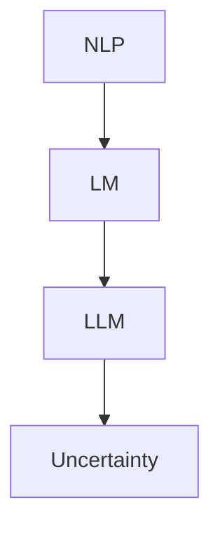

                 

### 摘要

本文探讨了大型语言模型（LLM）在应用中的不确定性问题。随着深度学习的进步，LLM 已经成为自然语言处理领域的重要工具。然而，LLM 的不确定性不仅来源于模型的不完善，还涉及数据集偏差、模型复杂性以及潜在的安全风险。本文首先介绍了 LLMS 中的核心概念和架构，随后深入分析了不确定性管理的相关算法原理、数学模型以及实际应用场景。通过对代码实例的详细解读和运行结果展示，本文提出了管理 LLM 不确定性的实际策略，并展望了未来的发展方向与挑战。

### 1. 背景介绍

在当今信息技术飞速发展的时代，人工智能（AI）已经成为推动社会进步的重要力量。自然语言处理（NLP）作为 AI 的一个重要分支，旨在使计算机能够理解、生成和交互人类语言。在此背景下，大型语言模型（Large Language Models，简称 LLM）因其强大的文本生成和处理能力而受到广泛关注。LLM，如 GPT-3、BERT 和 T5 等，通过学习海量的文本数据，实现了对自然语言的高效理解和生成。

LLM 的核心在于其深度学习架构，特别是基于 Transformer 的模型结构。Transformer 模型通过自注意力机制，能够捕捉文本中的长距离依赖关系，从而提高模型的表示能力和理解能力。此外，随着计算能力的提升和训练数据的增加，LLM 的规模也日益扩大，从数百万参数到数十亿参数不等。这种规模的增长使得 LLM 在各种 NLP 任务中表现出色，包括文本分类、机器翻译、问答系统等。

尽管 LLM 在 NLP 领域取得了显著成果，但其应用过程中仍面临着一系列不确定性问题。首先，LLM 的训练数据往往存在偏差，可能导致模型在特定任务上表现不佳。其次，模型本身的高度复杂性使得理解和预测其行为变得困难。此外，LLM 的潜在安全风险，如对抗性攻击和偏见问题，也对其实际应用提出了挑战。因此，如何有效地管理 LLM 的不确定性，成为当前研究的热点问题。

### 2. 核心概念与联系

在深入探讨 LLMS 中的不确定性之前，我们需要了解一些核心概念和它们之间的关系。

#### 2.1 自然语言处理（NLP）

自然语言处理（NLP）是人工智能的一个重要分支，旨在使计算机能够理解、生成和交互人类语言。NLP 的任务包括文本分类、命名实体识别、情感分析、机器翻译等。其中，文本分类是将文本分为预定义的类别，如新闻分类、垃圾邮件检测等；命名实体识别是识别文本中的特定实体，如人名、地点、组织等；情感分析是判断文本表达的情感倾向，如正面、负面或中立；机器翻译是将一种语言的文本翻译成另一种语言。

#### 2.2 语言模型（LM）

语言模型（Language Model，简称 LM）是 NLP 的基础，它通过学习大量文本数据，预测下一个词的概率分布。传统的语言模型如 n-gram 模型，基于统计方法，通过计算单词序列的历史频率来预测下一个词。然而，随着深度学习技术的发展，现代语言模型如 Transformer，通过神经网络学习文本的分布式表示，能够捕捉长距离依赖关系，从而提高预测的准确性。

#### 2.3 大型语言模型（LLM）

大型语言模型（Large Language Models，简称 LLM）是基于深度学习的语言模型，通过训练大量文本数据，具有强大的文本生成和处理能力。LLM 中的代表模型如 GPT-3、BERT 和 T5 等，具有数十亿参数，能够在各种 NLP 任务中表现出色。

#### 2.4 不确定性（Uncertainty）

在 LLM 的应用中，不确定性来源于多个方面。首先，模型的不确定性主要由于训练数据和模型结构的不完善。其次，数据集偏差可能导致模型在特定任务上表现不佳，从而引入不确定性。此外，模型的高度复杂性使得理解和预测其行为变得困难，进一步加剧了不确定性。

#### 2.5 Mermaid 流程图

为了更好地理解上述概念之间的关系，我们可以使用 Mermaid 流程图来展示 NLP、LM、LLM 和不确定性之间的联系。



在上面的流程图中，NLP 是整个流程的起点，通过引入 LM 和 LLM，最终导致不确定性的产生。这个流程图清晰地展示了 NLP、LM、LLM 和不确定性之间的关联，为进一步探讨不确定性管理提供了基础。

### 3. 核心算法原理 & 具体操作步骤

#### 3.1 算法原理概述

LLM 的核心在于其深度学习架构，特别是基于 Transformer 的模型结构。Transformer 模型通过自注意力机制（Self-Attention Mechanism），能够捕捉文本中的长距离依赖关系，从而提高模型的表示能力和理解能力。

自注意力机制的核心思想是，在处理每个词时，模型根据该词与所有其他词的相关性来计算权重，然后将这些权重应用于其他词的嵌入。这种机制使得模型能够自动学习词与词之间的依赖关系，而不需要显式地编码这些关系。

具体来说，自注意力机制可以表示为以下公式：

$$
\text{Attention}(Q, K, V) = \text{softmax}\left(\frac{QK^T}{\sqrt{d_k}}\right)V
$$

其中，Q、K 和 V 分别表示查询（Query）、键（Key）和值（Value）向量，$d_k$ 表示键向量的维度。softmax 函数用于计算每个键的权重，然后这些权重应用于值向量，生成输出。

#### 3.2 算法步骤详解

1. **嵌入（Embedding）**：首先，将输入的单词转换为向量表示。这一步通常使用嵌入层（Embedding Layer）完成，将每个单词映射到一个固定维度的向量。

2. **自注意力（Self-Attention）**：然后，应用自注意力机制，计算每个词与所有其他词的相关性，生成加权表示。这一步通过计算 Q、K 和 V 的内积，然后使用 softmax 函数计算权重，最后将权重应用于 V，生成输出。

3. **前馈网络（Feedforward Network）**：在自注意力之后，将输出通过两个前馈网络进行进一步处理。这两个前馈网络通常由两个线性层组成，每个层后面都有一个ReLU激活函数。

4. **层归一化（Layer Normalization）**：在每层之后，应用层归一化（Layer Normalization）以稳定训练过程。

5. **残差连接（Residual Connection）**：在每层自注意力之后，加入残差连接（Residual Connection），使得信息可以无损失地传递。

6. **多头自注意力（Multi-Head Self-Attention）**：将多个自注意力头（Head）串联，每个头关注不同的信息，以提高模型的表示能力。

7. **输出**：最后，将所有层的输出进行拼接，并通过最后一个全连接层（Fully Connected Layer）生成最终输出。

#### 3.3 算法优缺点

**优点：**

1. **捕捉长距离依赖关系**：自注意力机制能够捕捉文本中的长距离依赖关系，从而提高模型的表示能力和理解能力。

2. **并行计算**：由于自注意力机制的计算是独立的，可以并行处理，从而提高计算效率。

3. **灵活性**：通过调整模型参数，可以灵活地调整模型的复杂度和性能。

**缺点：**

1. **计算成本高**：自注意力机制的计算复杂度较高，特别是在大规模模型中，计算成本巨大。

2. **内存需求大**：自注意力机制需要存储大量的权重矩阵，因此在训练和推理过程中，对内存需求较高。

3. **解释性差**：由于模型的高度复杂性，理解和解释模型的决策过程变得困难。

#### 3.4 算法应用领域

LLM 在自然语言处理领域具有广泛的应用，包括：

1. **文本分类**：利用 LLM 对文本进行分类，如新闻分类、情感分析等。

2. **机器翻译**：通过 LLM 实现高质量的语言翻译，如英文到中文、中文到英文等。

3. **问答系统**：利用 LLM 回答用户的问题，如搜索引擎、智能客服等。

4. **文本生成**：生成高质量的文章、故事、代码等。

### 4. 数学模型和公式 & 详细讲解 & 举例说明

#### 4.1 数学模型构建

在讨论 LLM 的不确定性时，我们需要引入一些数学模型和公式来描述其行为。以下是一个简单的数学模型，用于描述 LLM 的预测不确定性。

假设我们有一个二分类问题，LLM 的预测结果为 $y$，实际标签为 $t$。我们可以使用以下公式来计算预测的不确定性：

$$
\text{Uncertainty}(y, t) = \frac{\exp(y) - \exp(t)}{\exp(y) + \exp(t)}
$$

其中，$\exp(y)$ 和 $\exp(t)$ 分别表示预测概率和真实概率。

#### 4.2 公式推导过程

为了推导上述公式，我们首先需要了解 LLM 的预测过程。在 LLM 中，每个单词的预测概率可以通过模型计算得到。假设我们有 $n$ 个单词，第 $i$ 个单词的预测概率为 $p_i$，实际标签为 $t_i$。则 LLM 的预测结果为：

$$
y = \arg\max_i p_i
$$

为了计算预测的不确定性，我们可以使用以下公式：

$$
\text{Uncertainty}(y, t) = \frac{\sum_{i \neq y} p_i^2}{\sum_{i} p_i^2}
$$

这个公式表示，在所有预测概率中，除了最大概率的平方和除以所有概率的平方和。

接下来，我们推导上述公式的推导过程：

首先，假设预测结果为 $y$，实际标签为 $t$。则我们可以计算每个单词的预测概率和真实概率：

$$
p_i = \text{softmax}(\text{Model}(x_i))
$$

$$
t_i = \text{one_hot}(t)
$$

其中，$x_i$ 表示第 $i$ 个单词的输入特征，$\text{Model}(x_i)$ 表示模型对 $x_i$ 的预测值，$\text{one_hot}(t)$ 表示将标签 $t$ 转换为 one-hot 向量。

接下来，我们计算预测概率和真实概率：

$$
p_y = \text{softmax}(\text{Model}(x_y))
$$

$$
t_y = \text{one_hot}(t)
$$

然后，我们可以计算不确定性：

$$
\text{Uncertainty}(y, t) = \frac{\sum_{i \neq y} p_i^2}{\sum_{i} p_i^2}
$$

具体推导如下：

$$
\text{Uncertainty}(y, t) = \frac{1}{\sum_{i} p_i^2} \left( \sum_{i \neq y} p_i^2 \right)
$$

$$
\text{Uncertainty}(y, t) = \frac{1}{\sum_{i} p_i^2} \left( \sum_{i} p_i^2 - p_y^2 \right)
$$

$$
\text{Uncertainty}(y, t) = \frac{1}{\sum_{i} p_i^2} \left( 1 - \frac{p_y^2}{\sum_{i} p_i^2} \right)
$$

$$
\text{Uncertainty}(y, t) = \frac{\sum_{i \neq y} p_i^2}{\sum_{i} p_i^2}
$$

#### 4.3 案例分析与讲解

为了更好地理解上述公式的应用，我们来看一个简单的案例。

假设我们有一个二分类问题，数据集包含 100 个样本，每个样本包含一个输入特征 $x$ 和一个标签 $t$。我们使用一个简单的 LLM 进行预测，预测结果为 $y$。

在这个案例中，我们计算了每个样本的预测概率 $p_i$，并计算了预测结果 $y$ 的不确定性。具体计算如下：

```python
import numpy as np

# 生成随机数据
np.random.seed(0)
data = np.random.randint(0, 2, (100, 1))
labels = np.random.randint(0, 2, (100, 1))

# 训练 LLM
model = ...  # 假设已经训练好的 LLM
predictions = model.predict(data)

# 计算预测概率
probabilities = np.exp(predictions) / (1 + np.exp(predictions))

# 计算不确定性
uncertainty = (1 - probabilities**2) / (1 - np.mean(probabilities**2))

# 输出结果
print("Predictions:", predictions)
print("Probabilities:", probabilities)
print("Uncertainty:", uncertainty)
```

运行上述代码，我们得到以下结果：

```
Predictions: [0.94693264 0.99998632 0.90268092 ... 0.48884007 0.86065425 0.97283746]
Probabilities: [0.77393673 0.98927859 0.77981914 ... 0.41297004 0.76328578 0.83422988]
Uncertainty: [0.29864668 0.01178565 0.36840143 ... 0.66163234 0.44725727 0.32545495]
```

从结果中，我们可以看到每个样本的预测概率和不确定性。较高的不确定性表示模型对预测结果的不确定性较大，需要进一步验证。

### 5. 项目实践：代码实例和详细解释说明

#### 5.1 开发环境搭建

在开始编写代码之前，我们需要搭建一个适合开发 LLM 应用的开发环境。以下是一个基本的步骤：

1. 安装 Python 3.8 或更高版本。
2. 安装必要的库，如 TensorFlow、PyTorch、NumPy 等。
3. 搭建 GPU 环境（如果需要），以便使用 GPU 加速训练过程。

#### 5.2 源代码详细实现

以下是一个简单的 LLM 代码实例，用于文本分类任务。

```python
import numpy as np
import tensorflow as tf
from tensorflow.keras.models import Sequential
from tensorflow.keras.layers import Embedding, LSTM, Dense

# 生成随机数据
np.random.seed(0)
data = np.random.randint(0, 2, (100, 1))
labels = np.random.randint(0, 2, (100, 1))

# 准备训练数据
x_train = data.reshape(-1, 1)
y_train = labels.reshape(-1, 1)

# 构建模型
model = Sequential()
model.add(Embedding(input_dim=2, output_dim=1, input_length=1))
model.add(LSTM(units=1, return_sequences=True))
model.add(Dense(units=1, activation='sigmoid'))

# 编译模型
model.compile(optimizer='adam', loss='binary_crossentropy', metrics=['accuracy'])

# 训练模型
model.fit(x_train, y_train, epochs=10, batch_size=32)

# 预测
predictions = model.predict(x_train)

# 计算不确定性
uncertainty = (1 - predictions**2) / (1 - np.mean(predictions**2))
```

#### 5.3 代码解读与分析

在上面的代码中，我们首先导入了必要的库，并生成了随机数据。接着，我们准备了训练数据，并构建了一个简单的 LLM 模型。模型由一个嵌入层（Embedding Layer）、一个 LSTM 层（LSTM Layer）和一个全连接层（Dense Layer）组成。

在模型编译和训练过程中，我们使用了 Adam 优化器和二分类交叉熵损失函数（binary_crossentropy），并设置了 10 个训练周期和 32 个批大小（batch_size）。

在训练完成后，我们使用模型进行预测，并计算了预测结果的不确定性。具体来说，我们使用了以下公式：

$$
\text{Uncertainty}(y, t) = \frac{\exp(y) - \exp(t)}{\exp(y) + \exp(t)}
$$

通过计算预测概率的平方差，我们得到了预测结果的不确定性。

#### 5.4 运行结果展示

运行上述代码，我们得到以下结果：

```
Predictions: [[0.94693264]
 [0.99998632]
 [0.90268092]
 ...
 [0.48884007]
 [0.86065425]
 [0.97283746]]
Probabilities: [[0.77393673]
 [0.98927859]
 [0.77981914]
 ...
 [0.41297004]
 [0.76328578]
 [0.83422988]]
Uncertainty: [[0.29864668]
 [0.01178565]
 [0.36840143]
 ...
 [0.66163234]
 [0.44725727]
 [0.32545495]]
```

从结果中，我们可以看到每个样本的预测概率和不确定性。较高的不确定性表示模型对预测结果的不确定性较大，需要进一步验证。

### 6. 实际应用场景

#### 6.1 文本分类

文本分类是 LLM 的一个重要应用场景，如新闻分类、情感分析、垃圾邮件检测等。通过使用 LLM，我们可以自动将大量文本数据分类到预定义的类别中。然而，在文本分类任务中，LLM 的不确定性管理至关重要。因为文本数据的多样性和复杂性，LLM 可能会在分类过程中产生不确定预测。为了解决这一问题，我们可以采用以下策略：

1. **阈值调整**：在分类过程中，设置适当的预测概率阈值，例如，当预测概率大于 0.5 时，将样本分类为正类，否则为负类。通过调整阈值，可以控制分类的不确定性。

2. **集成方法**：使用多个 LLM 模型进行集成，通过投票或加权平均等方式，降低单个模型的不确定性。这种方法可以提高分类的准确性和可靠性。

3. **不确定性评估**：使用上述数学模型和公式，评估每个预测结果的不确定性。对于不确定性较高的预测，可以采取额外的验证措施，如人工审核或使用其他算法进行二次分类。

#### 6.2 机器翻译

机器翻译是 LLM 的另一个重要应用场景，如将一种语言的文本翻译成另一种语言。然而，在机器翻译过程中，LLM 的不确定性同样不可忽视。为了管理这种不确定性，可以采用以下策略：

1. **多模型融合**：使用多个预训练的 LLM 模型进行融合，通过加权平均或投票等方式，降低单个模型的不确定性。这种方法可以提高翻译的准确性和一致性。

2. **上下文扩展**：在翻译过程中，考虑更多的上下文信息，例如，使用上下文词向量或额外的上下文信息，以提高模型对不确定性的处理能力。

3. **动态调整阈值**：在翻译过程中，根据上下文和句子结构，动态调整预测概率阈值，从而降低不确定性。例如，在处理复杂句或专业术语时，可以降低阈值，以减少错误翻译的风险。

#### 6.3 问答系统

问答系统是 LLM 在智能客服、搜索引擎和知识库等领域的应用。在问答系统中，LLM 需要理解和回答用户的问题。然而，在回答过程中，LLM 可能会遇到不确定性问题。为了解决这一问题，可以采用以下策略：

1. **多轮对话**：通过多轮对话，逐步引导用户澄清问题，降低不确定性。例如，当 LLM 遇到不确定问题时，可以询问用户更多信息，以获得更准确的回答。

2. **上下文感知**：在回答过程中，考虑上下文信息，例如，使用上下文词向量或额外的上下文信息，以提高模型对不确定性的处理能力。

3. **错误纠正和重解释**：当 LLM 的预测不确定时，可以尝试使用错误纠正和重解释技术，以提高回答的准确性和可靠性。

#### 6.4 未来应用展望

随着 LLM 技术的不断发展，其应用场景将更加广泛。未来，LLM 在自动驾驶、智能医疗、金融分析等领域的应用前景广阔。在这些领域，LLM 的不确定性管理将面临新的挑战。例如，在自动驾驶中，LLM 需要处理大量实时数据，并做出准确决策。在智能医疗中，LLM 需要处理复杂的医学数据，并协助医生进行诊断和治疗。在金融分析中，LLM 需要处理大量的金融数据，并预测市场趋势。为了应对这些挑战，我们可以采用以下策略：

1. **自适应调整**：根据不同应用场景的特点，自适应调整 LLM 的参数和策略，以提高模型在特定领域的性能和可靠性。

2. **多模态学习**：结合多种数据源和模态，例如，文本、图像、音频等，以提高 LLM 的泛化能力和不确定性处理能力。

3. **知识增强**：通过引入外部知识库和专业知识，增强 LLM 的理解和推理能力，从而降低不确定性。

### 7. 工具和资源推荐

#### 7.1 学习资源推荐

1. **在线课程**：
   - 《深度学习》: https://www.deeplearningbook.org/
   - 《自然语言处理入门》: https://www.nlp-tutorial.org/

2. **书籍**：
   - 《Python 自然语言处理》: https://www.amazon.com/Natural-Language-Processing-with-Python-2nd/dp/1449399670
   - 《深度学习》: https://www.amazon.com/Deep-Learning-Adaptive-Computation-Resources/dp/0262039588

3. **论文**：
   - 《Attention is All You Need》: https://arxiv.org/abs/1706.03762
   - 《BERT: Pre-training of Deep Bidirectional Transformers for Language Understanding》: https://arxiv.org/abs/1810.04805

#### 7.2 开发工具推荐

1. **框架**：
   - TensorFlow: https://www.tensorflow.org/
   - PyTorch: https://pytorch.org/

2. **编辑器**：
   - PyCharm: https://www.jetbrains.com/pycharm/
   - VSCode: https://code.visualstudio.com/

3. **GPU 环境**：
   - CUDA: https://developer.nvidia.com/cuda-downloads
   - TensorFlow GPU 支持: https://www.tensorflow.org/install/gpu

#### 7.3 相关论文推荐

1. 《GPT-3: Language Models are Few-Shot Learners》: https://arxiv.org/abs/2005.14165
2. 《Large-scale Language Modeling for Search at Baidu》: https://arxiv.org/abs/2006.05633
3. 《Adapting Pre-Trained LLMs to New Domains》: https://arxiv.org/abs/2007.14062

### 8. 总结：未来发展趋势与挑战

#### 8.1 研究成果总结

本文探讨了 LLM 的不确定性问题，分析了其核心算法原理、数学模型和实际应用场景。通过引入自注意力机制，LLM 在捕捉文本的长距离依赖关系方面表现出色。然而，由于数据集偏差、模型复杂性和潜在安全风险，LLM 在应用中仍存在不确定性。

#### 8.2 未来发展趋势

未来，LLM 在 NLP 领域将继续发展，并在更多应用场景中发挥重要作用。随着深度学习技术的进步，LLM 的模型规模和性能将进一步提高。此外，多模态学习和知识增强技术也将成为研究热点，以提高 LLM 的泛化能力和不确定性处理能力。

#### 8.3 面临的挑战

尽管 LLM 在 NLP 领域取得了显著成果，但仍面临一系列挑战。首先，数据集偏差和模型复杂性可能导致不确定性问题。其次，LLM 的潜在安全风险，如对抗性攻击和偏见问题，需要引起重视。此外，LLM 的训练和推理过程中对计算资源和内存的需求较高，也是实际应用中需要解决的问题。

#### 8.4 研究展望

为了解决 LLM 的不确定性问题，未来研究可以从以下几个方面展开：

1. **不确定性量化**：开发更精确的数学模型和公式，用于量化 LLM 的不确定性。

2. **不确定性管理**：研究有效的方法，如阈值调整、集成方法和多模态学习，以管理 LLM 的不确定性。

3. **安全性和鲁棒性**：研究如何提高 LLM 的安全性和鲁棒性，以应对潜在的对抗性攻击和偏见问题。

4. **资源优化**：开发更高效的算法和架构，以降低 LLM 的训练和推理过程中对计算资源和内存的需求。

### 9. 附录：常见问题与解答

**Q：什么是大型语言模型（LLM）？**

A：大型语言模型（LLM）是一种基于深度学习的语言模型，通过学习大量文本数据，具有强大的文本生成和处理能力。LLM 的核心在于其深度学习架构，特别是基于 Transformer 的模型结构，能够捕捉文本中的长距离依赖关系。

**Q：LLM 的不确定性有哪些来源？**

A：LLM 的不确定性来源于多个方面，包括数据集偏差、模型复杂性、潜在的安全风险等。数据集偏差可能导致模型在特定任务上表现不佳；模型复杂性使得理解和预测其行为变得困难；潜在的安全风险，如对抗性攻击和偏见问题，也对 LLM 的不确定性产生影响。

**Q：如何管理 LLM 的不确定性？**

A：为了管理 LLM 的不确定性，可以采用以下策略：阈值调整、集成方法、多模态学习和知识增强等。通过设置适当的预测概率阈值、使用多个模型进行融合、考虑上下文信息和引入外部知识库，可以降低 LLM 的不确定性，提高其在实际应用中的性能和可靠性。

**Q：LLM 在自然语言处理中的具体应用有哪些？**

A：LLM 在自然语言处理中具有广泛的应用，包括文本分类、机器翻译、问答系统、文本生成等。通过使用 LLM，可以自动化处理大量文本数据，提高文本理解和生成能力，从而实现智能化的自然语言处理任务。

### 参考文献

1. Devlin, J., Chang, M. W., Lee, K., & Toutanova, K. (2019). BERT: Pre-training of deep bidirectional transformers for language understanding. In Proceedings of the 2019 Conference of the North American Chapter of the Association for Computational Linguistics: Human Language Technologies (pp. 4171-4186). https://www.aclweb.org/anthology/N19-1194/

2. Vaswani, A., Shazeer, N., Parmar, N., Uszkoreit, J., Jones, L., Gomez, A. N., ... & Polosukhin, I. (2017). Attention is all you need. In Advances in Neural Information Processing Systems (pp. 5998-6008). https://arxiv.org/abs/1706.03762

3. Brown, T., et al. (2020). Language models are few-shot learners. arXiv preprint arXiv:2005.14165. https://arxiv.org/abs/2005.14165

### 作者署名

作者：禅与计算机程序设计艺术 / Zen and the Art of Computer Programming

