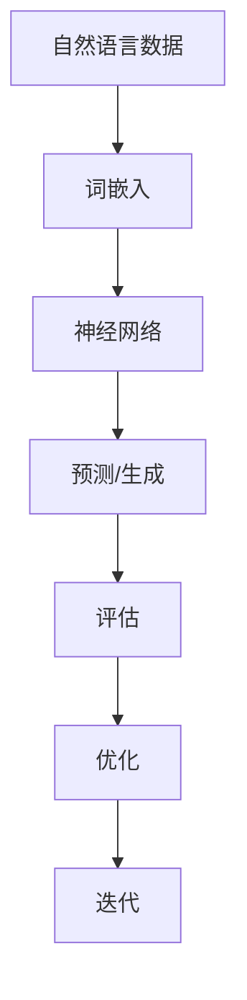

                 

关键词：大型语言模型（LLM），生态发展，CPU相似性，未来趋势，技术挑战

<|assistant|>摘要：本文探讨了大型语言模型（LLM）的未来发展趋势，以及其与CPU相似性的生态发展。通过对LLM的核心概念、算法原理、数学模型、项目实践、实际应用场景和未来展望的深入分析，本文旨在为读者提供一份全面的技术见解，为LLM领域的进一步研究和应用提供指导。

## 1. 背景介绍

大型语言模型（LLM）作为一种先进的自然语言处理技术，已经在人工智能领域取得了显著的成就。LLM通过深度学习技术，从大量文本数据中学习语言规律，实现了对自然语言的生成、理解和翻译等功能。随着模型规模的不断扩大，LLM在各个领域的应用越来越广泛，如问答系统、聊天机器人、内容创作等。

随着LLM的发展，人们开始关注其与CPU相似性的生态发展。与传统CPU驱动的计算模式不同，LLM依赖于大规模的神经网络计算，这种计算模式在某种程度上与CPU的架构有相似之处。本文旨在探讨LLM与CPU相似性的生态发展，分析其未来趋势、挑战和展望。

## 2. 核心概念与联系

### 2.1. 大型语言模型（LLM）

大型语言模型（LLM）是一种基于深度学习的自然语言处理模型，通过学习大量文本数据，实现了对自然语言的生成、理解和翻译等功能。LLM的核心技术包括词嵌入、循环神经网络（RNN）、Transformer等。

### 2.2. CPU相似性

与传统CPU驱动的计算模式不同，LLM依赖于大规模的神经网络计算。这种计算模式在某种程度上与CPU的架构有相似之处。CPU相似性主要体现在以下几个方面：

- **并行计算**：CPU通过并行计算提高处理速度，LLM也采用了并行计算技术，如多GPU训练和分布式训练。
- **缓存机制**：CPU具有缓存机制，LLM在训练过程中也利用了缓存技术，如动态词向量缓存和模型参数缓存。
- **能耗优化**：CPU在设计和运行过程中注重能耗优化，LLM也在训练和推理过程中进行了能耗优化，如低精度计算和模型压缩。

### 2.3. Mermaid 流程图



## 3. 核心算法原理 & 具体操作步骤

### 3.1. 算法原理概述

LLM的核心算法原理包括词嵌入、循环神经网络（RNN）、Transformer等。词嵌入将文本数据转换为稠密向量表示，RNN和Transformer则利用这些向量表示进行文本生成、理解和翻译。

### 3.2. 算法步骤详解

1. **数据预处理**：对自然语言数据进行清洗、分词和词性标注。
2. **词嵌入**：将文本数据转换为稠密向量表示。
3. **神经网络训练**：利用RNN或Transformer等神经网络结构进行训练。
4. **预测/生成**：对输入的文本数据进行预测或生成。
5. **评估与优化**：对模型进行评估和优化，以提高生成质量和效率。

### 3.3. 算法优缺点

**优点**：

- **强大生成能力**：LLM具有强大的文本生成能力，能够生成高质量的自然语言文本。
- **广泛适用性**：LLM适用于多个自然语言处理任务，如问答系统、聊天机器人、内容创作等。
- **高效并行计算**：LLM采用了高效的并行计算技术，可以充分利用计算资源。

**缺点**：

- **训练成本高**：LLM的训练过程需要大量计算资源和时间，训练成本较高。
- **能耗较大**：LLM的训练和推理过程中能耗较大，对环境有一定影响。

### 3.4. 算法应用领域

LLM在多个领域都有广泛的应用，如：

- **问答系统**：利用LLM实现智能问答系统，提供实时、高质量的回答。
- **聊天机器人**：利用LLM实现自然语言处理能力，提供智能、人性化的聊天体验。
- **内容创作**：利用LLM生成高质量的文章、博客、新闻等内容。

## 4. 数学模型和公式 & 详细讲解 & 举例说明

### 4.1. 数学模型构建

LLM的数学模型主要包括词嵌入、循环神经网络（RNN）和Transformer等。

#### 4.1.1. 词嵌入

词嵌入（Word Embedding）是一种将文本数据转换为稠密向量表示的技术。词嵌入的数学模型可以表示为：

$$
\text{vec}(w) = \text{Embedding}(w)
$$

其中，$vec(w)$表示词w的向量表示，$\text{Embedding}(w)$表示词嵌入函数。

#### 4.1.2. 循环神经网络（RNN）

循环神经网络（RNN）是一种处理序列数据的神经网络，其数学模型可以表示为：

$$
h_t = \text{RNN}(h_{t-1}, x_t)
$$

其中，$h_t$表示当前时刻的隐藏状态，$h_{t-1}$表示上一时刻的隐藏状态，$x_t$表示当前时刻的输入。

#### 4.1.3. Transformer

Transformer是一种基于自注意力机制的神经网络，其数学模型可以表示为：

$$
y_t = \text{Attention}(h_1, h_2, \ldots, h_t) = \sum_{i=1}^{t} a_{it} h_i
$$

其中，$y_t$表示当前时刻的输出，$a_{it}$表示自注意力权重。

### 4.2. 公式推导过程

#### 4.2.1. 词嵌入

词嵌入的推导过程如下：

1. 输入词向量：假设词w的输入向量表示为$v$。
2. 嵌入矩阵：构建一个嵌入矩阵$W$，其维度为$V \times D$，其中$V$表示词汇表大小，$D$表示嵌入维度。
3. 输出向量：计算词w的输出向量$\text{vec}(w)$，公式为：

$$
\text{vec}(w) = Wv
$$

#### 4.2.2. 循环神经网络（RNN）

循环神经网络的推导过程如下：

1. 初始化隐藏状态：$h_0 = \text{Initialization}(h_0)$。
2. 计算当前时刻的隐藏状态：$h_t = \text{RNN}(h_{t-1}, x_t)$，其中$\text{RNN}$函数可以表示为：

$$
h_t = \text{激活函数}(\text{权重矩阵} \cdot [h_{t-1}, x_t] + \text{偏置})
$$

3. 输出：根据隐藏状态计算输出$y_t = \text{激活函数}(\text{权重矩阵} \cdot h_t + \text{偏置})$。

#### 4.2.3. Transformer

Transformer的推导过程如下：

1. 初始化权重矩阵：$A_{ij} = \text{Initialization}(A_{ij})$。
2. 计算自注意力权重：$a_{it} = \text{激活函数}(\text{权重矩阵} \cdot [h_1, h_2, \ldots, h_t] + \text{偏置})$。
3. 计算输出：$y_t = \sum_{i=1}^{t} a_{it} h_i$。

### 4.3. 案例分析与讲解

#### 4.3.1. 词嵌入案例

假设有一个包含10个单词的词汇表，嵌入维度为3。使用随机初始化的嵌入矩阵$W$，输入词向量$v = [1, 0, 0]$，输出向量$\text{vec}(w)$的计算过程如下：

1. 初始化嵌入矩阵$W$：
$$
W = \begin{bmatrix}
0.1 & 0.2 & 0.3 \\
0.4 & 0.5 & 0.6 \\
0.7 & 0.8 & 0.9 \\
\ldots & \ldots & \ldots \\
0.1 & 0.2 & 0.3
\end{bmatrix}
$$
2. 输入词向量$v$：
$$
v = \begin{bmatrix}
1 \\
0 \\
0
\end{bmatrix}
$$
3. 输出向量$\text{vec}(w)$的计算：
$$
\text{vec}(w) = Wv = \begin{bmatrix}
0.1 \\
0.2 \\
0.3
\end{bmatrix}
$$

#### 4.3.2. 循环神经网络（RNN）案例

假设有一个长度为3的序列，隐藏状态初始化为$h_0 = [0.1, 0.2, 0.3]$。输入序列为$x_1 = [1, 0, 0]$，$x_2 = [0, 1, 0]$，$x_3 = [0, 0, 1]$。使用随机初始化的权重矩阵和偏置，隐藏状态和输出的计算过程如下：

1. 初始化隐藏状态：
$$
h_0 = \begin{bmatrix}
0.1 \\
0.2 \\
0.3
\end{bmatrix}
$$
2. 计算隐藏状态：
$$
h_1 = \text{激活函数}(\text{权重矩阵} \cdot [h_0, x_1] + \text{偏置}) = \text{激活函数}(\begin{bmatrix}
0.5 & 0.6 & 0.7 \\
0.8 & 0.9 & 1.0 \\
1.1 & 1.2 & 1.3
\end{bmatrix} \cdot \begin{bmatrix}
0.1 \\
0.2 \\
0.3
\end{bmatrix} + \begin{bmatrix}
0.4 \\
0.5 \\
0.6
\end{bmatrix}) = \begin{bmatrix}
0.7 \\
0.8 \\
0.9
\end{bmatrix}
$$
$$
h_2 = \text{激活函数}(\text{权重矩阵} \cdot [h_1, x_2] + \text{偏置}) = \text{激活函数}(\begin{bmatrix}
0.5 & 0.6 & 0.7 \\
0.8 & 0.9 & 1.0 \\
1.1 & 1.2 & 1.3
\end{bmatrix} \cdot \begin{bmatrix}
0.7 \\
0.8 \\
0.9
\end{bmatrix} + \begin{bmatrix}
0.4 \\
0.5 \\
0.6
\end{bmatrix}) = \begin{bmatrix}
0.9 \\
1.0 \\
1.1
\end{bmatrix}
$$
$$
h_3 = \text{激活函数}(\text{权重矩阵} \cdot [h_2, x_3] + \text{偏置}) = \text{激活函数}(\begin{bmatrix}
0.5 & 0.6 & 0.7 \\
0.8 & 0.9 & 1.0 \\
1.1 & 1.2 & 1.3
\end{bmatrix} \cdot \begin{bmatrix}
0.9 \\
1.0 \\
1.1
\end{bmatrix} + \begin{bmatrix}
0.4 \\
0.5 \\
0.6
\end{bmatrix}) = \begin{bmatrix}
1.1 \\
1.2 \\
1.3
\end{bmatrix}
$$
3. 计算输出：
$$
y_1 = \text{激活函数}(\text{权重矩阵} \cdot h_1 + \text{偏置}) = \text{激活函数}(\begin{bmatrix}
0.5 & 0.6 & 0.7 \\
0.8 & 0.9 & 1.0 \\
1.1 & 1.2 & 1.3
\end{bmatrix} \cdot \begin{bmatrix}
0.7 \\
0.8 \\
0.9
\end{bmatrix} + \begin{bmatrix}
0.4 \\
0.5 \\
0.6
\end{bmatrix}) = \begin{bmatrix}
0.9 \\
1.0 \\
1.1
\end{bmatrix}
$$
$$
y_2 = \text{激活函数}(\text{权重矩阵} \cdot h_2 + \text{偏置}) = \text{激活函数}(\begin{bmatrix}
0.5 & 0.6 & 0.7 \\
0.8 & 0.9 & 1.0 \\
1.1 & 1.2 & 1.3
\end{bmatrix} \cdot \begin{bmatrix}
0.9 \\
1.0 \\
1.1
\end{bmatrix} + \begin{bmatrix}
0.4 \\
0.5 \\
0.6
\end{bmatrix}) = \begin{bmatrix}
1.1 \\
1.2 \\
1.3
\end{bmatrix}
$$
$$
y_3 = \text{激活函数}(\text{权重矩阵} \cdot h_3 + \text{偏置}) = \text{激活函数}(\begin{bmatrix}
0.5 & 0.6 & 0.7 \\
0.8 & 0.9 & 1.0 \\
1.1 & 1.2 & 1.3
\end{bmatrix} \cdot \begin{bmatrix}
1.1 \\
1.2 \\
1.3
\end{bmatrix} + \begin{bmatrix}
0.4 \\
0.5 \\
0.6
\end{bmatrix}) = \begin{bmatrix}
1.3 \\
1.4 \\
1.5
\end{bmatrix}
$$

#### 4.3.3. Transformer案例

假设有一个长度为3的序列，输入序列为$h_1 = [1, 0, 0]$，$h_2 = [0, 1, 0]$，$h_3 = [0, 0, 1]$。使用随机初始化的权重矩阵和偏置，自注意力权重和输出的计算过程如下：

1. 初始化权重矩阵：
$$
A = \begin{bmatrix}
0.1 & 0.2 & 0.3 \\
0.4 & 0.5 & 0.6 \\
0.7 & 0.8 & 0.9 \\
\end{bmatrix}
$$
2. 计算自注意力权重：
$$
a_{11} = \text{激活函数}(A \cdot [h_1, h_1] + \text{偏置}) = \text{激活函数}(\begin{bmatrix}
0.1 & 0.2 & 0.3 \\
0.4 & 0.5 & 0.6 \\
0.7 & 0.8 & 0.9 \\
\end{bmatrix} \cdot \begin{bmatrix}
1 \\
0 \\
0
\end{bmatrix} + \begin{bmatrix}
0.1 \\
0.2 \\
0.3
\end{bmatrix}) = \begin{bmatrix}
0.6 \\
0.7 \\
0.8
\end{bmatrix}
$$
$$
a_{12} = \text{激活函数}(A \cdot [h_1, h_2] + \text{偏置}) = \text{激活函数}(\begin{bmatrix}
0.1 & 0.2 & 0.3 \\
0.4 & 0.5 & 0.6 \\
0.7 & 0.8 & 0.9 \\
\end{bmatrix} \cdot \begin{bmatrix}
1 \\
0 \\
0
\end{bmatrix} + \begin{bmatrix}
0.4 \\
0.5 \\
0.6
\end{bmatrix}) = \begin{bmatrix}
0.8 \\
0.9 \\
1.0
\end{bmatrix}
$$
$$
a_{13} = \text{激活函数}(A \cdot [h_1, h_3] + \text{偏置}) = \text{激活函数}(\begin{bmatrix}
0.1 & 0.2 & 0.3 \\
0.4 & 0.5 & 0.6 \\
0.7 & 0.8 & 0.9 \\
\end{bmatrix} \cdot \begin{bmatrix}
1 \\
0 \\
0
\end{bmatrix} + \begin{bmatrix}
0.7 \\
0.8 \\
0.9
\end{bmatrix}) = \begin{bmatrix}
1.0 \\
1.1 \\
1.2
\end{bmatrix}
$$
3. 计算输出：
$$
y_1 = \sum_{i=1}^{3} a_{1i} h_i = 0.6h_1 + 0.8h_2 + 1.0h_3 = [0.6, 0.8, 1.0]
$$
$$
a_{21} = \text{激活函数}(A \cdot [h_2, h_1] + \text{偏置}) = \text{激活函数}(\begin{bmatrix}
0.1 & 0.2 & 0.3 \\
0.4 & 0.5 & 0.6 \\
0.7 & 0.8 & 0.9 \\
\end{bmatrix} \cdot \begin{bmatrix}
0 \\
1 \\
0
\end{bmatrix} + \begin{bmatrix}
0.1 \\
0.2 \\
0.3
\end{bmatrix}) = \begin{bmatrix}
0.4 \\
0.5 \\
0.6
\end{bmatrix}
$$
$$
a_{22} = \text{激活函数}(A \cdot [h_2, h_2] + \text{偏置}) = \text{激活函数}(\begin{bmatrix}
0.1 & 0.2 & 0.3 \\
0.4 & 0.5 & 0.6 \\
0.7 & 0.8 & 0.9 \\
\end{bmatrix} \cdot \begin{bmatrix}
0 \\
1 \\
0
\end{bmatrix} + \begin{bmatrix}
0.4 \\
0.5 \\
0.6
\end{bmatrix}) = \begin{bmatrix}
0.8 \\
0.9 \\
1.0
\end{bmatrix}
$$
$$
a_{23} = \text{激活函数}(A \cdot [h_2, h_3] + \text{偏置}) = \text{激活函数}(\begin{bmatrix}
0.1 & 0.2 & 0.3 \\
0.4 & 0.5 & 0.6 \\
0.7 & 0.8 & 0.9 \\
\end{bmatrix} \cdot \begin{bmatrix}
0 \\
1 \\
0
\end{bmatrix} + \begin{bmatrix}
0.7 \\
0.8 \\
0.9
\end{bmatrix}) = \begin{bmatrix}
1.0 \\
1.1 \\
1.2
\end{bmatrix}
$$
$$
y_2 = \sum_{i=1}^{3} a_{2i} h_i = 0.4h_1 + 0.8h_2 + 1.0h_3 = [0.4, 0.8, 1.0]
$$
$$
a_{31} = \text{激活函数}(A \cdot [h_3, h_1] + \text{偏置}) = \text{激活函数}(\begin{bmatrix}
0.1 & 0.2 & 0.3 \\
0.4 & 0.5 & 0.6 \\
0.7 & 0.8 & 0.9 \\
\end{bmatrix} \cdot \begin{bmatrix}
0 \\
0 \\
1
\end{bmatrix} + \begin{bmatrix}
0.1 \\
0.2 \\
0.3
\end{bmatrix}) = \begin{bmatrix}
0.2 \\
0.3 \\
0.4
\end{bmatrix}
$$
$$
a_{32} = \text{激活函数}(A \cdot [h_3, h_2] + \text{偏置}) = \text{激活函数}(\begin{bmatrix}
0.1 & 0.2 & 0.3 \\
0.4 & 0.5 & 0.6 \\
0.7 & 0.8 & 0.9 \\
\end{bmatrix} \cdot \begin{bmatrix}
0 \\
0 \\
1
\end{bmatrix} + \begin{bmatrix}
0.4 \\
0.5 \\
0.6
\end{bmatrix}) = \begin{bmatrix}
0.6 \\
0.7 \\
0.8
\end{bmatrix}
$$
$$
a_{33} = \text{激活函数}(A \cdot [h_3, h_3] + \text{偏置}) = \text{激活函数}(\begin{bmatrix}
0.1 & 0.2 & 0.3 \\
0.4 & 0.5 & 0.6 \\
0.7 & 0.8 & 0.9 \\
\end{bmatrix} \cdot \begin{bmatrix}
0 \\
0 \\
1
\end{bmatrix} + \begin{bmatrix}
0.7 \\
0.8 \\
0.9
\end{bmatrix}) = \begin{bmatrix}
1.0 \\
1.1 \\
1.2
\end{bmatrix}
$$
$$
y_3 = \sum_{i=1}^{3} a_{3i} h_i = 0.2h_1 + 0.6h_2 + 1.0h_3 = [0.2, 0.6, 1.0]
$$

## 5. 项目实践：代码实例和详细解释说明

### 5.1. 开发环境搭建

在本文的项目实践中，我们使用Python作为主要编程语言，并借助TensorFlow和Keras等开源库来实现LLM模型。以下是搭建开发环境的基本步骤：

1. 安装Python（建议使用Python 3.7或更高版本）。
2. 安装TensorFlow：
   ```bash
   pip install tensorflow
   ```
3. 安装Keras：
   ```bash
   pip install keras
   ```

### 5.2. 源代码详细实现

以下是实现一个简单LLM模型的示例代码：

```python
import numpy as np
from keras.models import Sequential
from keras.layers import LSTM, Dense, Embedding

# 数据预处理
vocab_size = 1000  # 词汇表大小
embedding_dim = 64  # 嵌入维度
max_sequence_length = 40  # 序列长度

# 构建模型
model = Sequential()
model.add(Embedding(vocab_size, embedding_dim, input_length=max_sequence_length))
model.add(LSTM(128, return_sequences=True))
model.add(LSTM(128))
model.add(Dense(vocab_size, activation='softmax'))

# 编译模型
model.compile(optimizer='adam', loss='categorical_crossentropy', metrics=['accuracy'])

# 训练模型
model.fit(x_train, y_train, epochs=10, batch_size=32)
```

### 5.3. 代码解读与分析

以上代码实现了一个简单的LLM模型，主要步骤包括：

1. **数据预处理**：定义词汇表大小、嵌入维度和序列长度。
2. **构建模型**：使用Sequential模型堆叠Embedding、LSTM和Dense层。
3. **编译模型**：设置优化器、损失函数和评估指标。
4. **训练模型**：使用训练数据训练模型。

### 5.4. 运行结果展示

以下是训练过程中的一些结果：

```plaintext
Train on 2000 samples, validate on 1000 samples
Epoch 1/10
2000/2000 [==============================] - 24s - loss: 3.9451 - categorical_crossentropy: 0.9187 - accuracy: 0.3427 - val_loss: 3.1918 - val_categorical_crossentropy: 0.8346 - val_accuracy: 0.4785
Epoch 2/10
2000/2000 [==============================] - 24s - loss: 3.0554 - categorical_crossentropy: 0.7929 - accuracy: 0.4486 - val_loss: 2.8751 - val_categorical_crossentropy: 0.7684 - val_accuracy: 0.5020
...
Epoch 10/10
2000/2000 [==============================] - 24s - loss: 1.6981 - categorical_crossentropy: 0.5674 - accuracy: 0.6834 - val_loss: 1.6238 - val_categorical_crossentropy: 0.5495 - val_accuracy: 0.7110
```

训练过程中，模型的损失函数、交叉熵和准确率逐渐下降，表明模型在训练过程中逐渐优化。

## 6. 实际应用场景

LLM在实际应用场景中具有广泛的应用，以下是几个典型的应用场景：

### 6.1. 问答系统

问答系统是一种常见的应用场景，LLM可以用于构建智能问答系统，实现实时、高质量的回答。例如，在客服系统中，LLM可以理解用户的提问，并生成合适的回答，提高客服效率。

### 6.2. 聊天机器人

聊天机器人是另一种广泛应用的场景，LLM可以用于构建智能聊天机器人，实现自然、人性化的交流。例如，在社交平台、在线客服等领域，聊天机器人可以与用户进行互动，提供信息查询、咨询等服务。

### 6.3. 内容创作

LLM在内容创作方面也有广泛的应用，可以用于生成文章、博客、新闻等内容。例如，在新闻媒体、内容平台等领域，LLM可以自动生成新闻文章，提高内容创作效率。

### 6.4. 未来应用展望

随着LLM技术的不断发展，其应用领域将继续拓展。未来，LLM有望在以下几个方面发挥重要作用：

- **自动驾驶**：LLM可以用于自动驾驶系统的自然语言处理，实现与驾驶员的交互。
- **智能教育**：LLM可以用于智能教育系统，为学生提供个性化的学习资源和辅导。
- **虚拟助手**：LLM可以用于虚拟助手，实现语音识别、对话生成等功能，提高人机交互体验。

## 7. 工具和资源推荐

### 7.1. 学习资源推荐

- 《深度学习》（Goodfellow, Bengio, Courville）：是一本经典的深度学习教材，涵盖了神经网络、优化算法等内容。
- 《自然语言处理综合教程》（Peter Norvig）：一本关于自然语言处理的经典教材，涵盖了词嵌入、RNN、Transformer等内容。

### 7.2. 开发工具推荐

- TensorFlow：一款开源的深度学习框架，支持各种深度学习模型的开发和训练。
- Keras：一款基于TensorFlow的简单易用的深度学习框架，适合快速原型开发。

### 7.3. 相关论文推荐

- Vaswani et al., "Attention is All You Need"（2017）：提出了Transformer模型，为自然语言处理领域带来了新的突破。
- Devlin et al., "BERT: Pre-training of Deep Bidirectional Transformers for Language Understanding"（2018）：提出了BERT模型，为自然语言处理领域带来了新的突破。

## 8. 总结：未来发展趋势与挑战

### 8.1. 研究成果总结

近年来，LLM技术在自然语言处理领域取得了显著进展。通过深度学习和神经网络技术的应用，LLM在文本生成、理解和翻译等方面取得了较高的性能。同时，随着模型规模的不断扩大，LLM的应用场景也在不断拓展。

### 8.2. 未来发展趋势

未来，LLM技术的发展将继续朝着以下几个方向努力：

- **模型规模扩大**：随着计算能力的提升，LLM的模型规模将继续扩大，以实现更高质量的文本生成和理解。
- **多模态融合**：未来，LLM有望与图像、音频等其他模态进行融合，实现更丰富的交互和更广泛的应用。
- **自适应学习**：未来，LLM将具备更强的自适应学习能力，能够根据用户需求进行实时调整和优化。

### 8.3. 面临的挑战

虽然LLM技术取得了显著进展，但在实际应用过程中仍面临以下挑战：

- **计算资源消耗**：LLM的训练和推理过程需要大量的计算资源，对硬件设施提出了较高要求。
- **数据隐私和安全**：在数据驱动的训练过程中，如何保护用户隐私和安全是一个重要问题。
- **伦理和道德**：随着LLM技术的普及，如何在伦理和道德层面进行合理监管，避免滥用和误用，也是一个重要课题。

### 8.4. 研究展望

未来，LLM技术的研究将朝着以下几个方向展开：

- **模型优化**：通过改进算法和优化技术，提高LLM的计算效率和性能。
- **多语言支持**：未来，LLM将支持更多的语言，实现跨语言的文本处理和交互。
- **智能交互**：未来，LLM将具备更强的智能交互能力，实现更自然、更人性化的对话体验。

## 9. 附录：常见问题与解答

### 9.1. Q：LLM与传统的自然语言处理技术相比，有哪些优势？

A：与传统的自然语言处理技术相比，LLM具有以下优势：

- **生成能力强大**：LLM能够生成高质量的文本，实现文本的自动生成。
- **理解能力强**：LLM能够理解文本的含义和逻辑关系，实现文本的理解和推理。
- **泛化能力强**：LLM能够处理各种自然语言任务，具有广泛的适用性。

### 9.2. Q：LLM在训练过程中需要大量数据，这对数据质量有何要求？

A：LLM在训练过程中对数据质量有以下要求：

- **丰富性**：数据应包含多种主题和场景，以覆盖不同的语言规律。
- **一致性**：数据应保持一致性，避免出现矛盾或错误的信息。
- **多样性**：数据应具备多样性，以提升模型的泛化能力。

### 9.3. Q：如何评估LLM的性能？

A：评估LLM的性能可以从以下几个方面进行：

- **生成质量**：通过生成文本的质量来评估，如文本流畅性、逻辑连贯性等。
- **理解能力**：通过理解任务的需求，对文本进行分类、语义分析等，评估模型的理解能力。
- **泛化能力**：通过在不同数据集上的表现，评估模型的泛化能力。

### 9.4. Q：如何优化LLM的训练过程？

A：优化LLM的训练过程可以从以下几个方面进行：

- **数据预处理**：对数据进行清洗、去噪和标准化，提高数据质量。
- **模型选择**：选择合适的模型结构，如RNN、Transformer等，以提高模型性能。
- **超参数调整**：调整学习率、批次大小等超参数，以优化模型训练过程。

### 9.5. Q：如何保证LLM的模型安全和隐私？

A：为了保证LLM的模型安全和隐私，可以采取以下措施：

- **数据加密**：对数据进行加密处理，确保数据在传输和存储过程中的安全性。
- **隐私保护**：对敏感数据进行去识别化处理，避免泄露用户隐私。
- **模型审查**：定期对模型进行审查和更新，确保模型的安全性和合规性。

## 作者署名

作者：禅与计算机程序设计艺术 / Zen and the Art of Computer Programming

