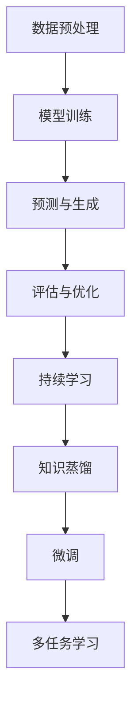

                 

关键词：大规模语言模型，适应性，机器学习，持续学习，进步

> 摘要：本文旨在探讨大规模语言模型（LLM）的适应性，即其如何在持续学习和进步的过程中应对复杂多变的环境。文章首先介绍LLM的基本原理和核心概念，然后深入探讨其适应性的实现机制、关键因素以及面临的挑战。最后，本文对LLM的未来发展趋势进行了展望，并提出了相关的研究方向和解决方案。

## 1. 背景介绍

随着人工智能技术的快速发展，大规模语言模型（Large Language Models，简称LLM）逐渐成为自然语言处理（Natural Language Processing，简称NLP）领域的重要工具。LLM通过对海量文本数据进行训练，能够自动地学习语言规律和知识，从而实现文本生成、问答、翻译等复杂任务。

然而，LLM在应用过程中也暴露出一些问题，例如数据偏见、可解释性差、泛化能力不足等。为了解决这些问题，研究者们开始关注LLM的适应性，即如何使LLM具备持续学习和进步的能力，从而更好地适应复杂多变的环境。

本文将围绕LLM的适应性展开讨论，首先介绍LLM的基本原理和核心概念，然后深入探讨其适应性的实现机制、关键因素以及面临的挑战。最后，本文将对LLM的未来发展趋势进行展望，并提出相关的研究方向和解决方案。

## 2. 核心概念与联系

### 2.1 LLM基本原理

大规模语言模型（LLM）是基于深度学习技术的一种语言处理模型。它通过训练大量语言数据，自动学习语言的语法、语义和上下文信息，从而实现对文本的生成、理解、翻译等任务。LLM的基本原理可以概括为以下几个步骤：

1. 数据预处理：将原始文本数据进行清洗、分词、标记等处理，转化为计算机可处理的格式。

2. 模型训练：使用预处理的文本数据对LLM进行训练，通过优化模型参数，使模型能够更好地模拟语言规律。

3. 预测与生成：在给定输入文本的情况下，LLM根据已训练的模型参数生成对应的输出文本。

4. 评估与优化：通过评估指标（如损失函数、 perplexity 等）对LLM的生成效果进行评估，并根据评估结果对模型进行优化。

### 2.2 适应性概念

适应性是指个体或系统在面临环境变化时，通过调整自身行为或结构，以更好地适应环境变化的能力。在LLM的背景下，适应性意味着模型能够根据不同的任务需求和输入数据，调整自身的参数和结构，以实现更准确的预测和生成。

### 2.3 LLM适应性的实现机制

LLM的适应性主要通过以下几种机制实现：

1. 持续学习：LLM可以通过持续学习新的数据，不断调整和优化自身的参数，从而适应新的语言环境和任务。

2. 知识蒸馏：通过将大模型的知识传递给小模型，使小模型具备更强的适应能力。

3. 微调：在特定任务上对预训练的LLM进行微调，使其能够更好地适应特定任务的需求。

4. 多任务学习：通过同时学习多个任务，提高LLM的泛化能力和适应性。

### 2.4 Mermaid 流程图



## 3. 核心算法原理 & 具体操作步骤

### 3.1 算法原理概述

LLM的核心算法原理主要基于深度学习中的循环神经网络（RNN）和Transformer模型。RNN模型通过隐藏状态和输入信息的交互，实现对序列数据的建模。而Transformer模型则通过自注意力机制，实现对序列数据的全局依赖关系建模。

在LLM的适应过程中，算法原理主要体现在以下几个方面：

1. 持续学习：通过不断更新模型参数，使模型能够适应新的数据和环境。

2. 知识蒸馏：通过将大模型的知识传递给小模型，提高小模型的适应能力。

3. 微调：在特定任务上对模型进行微调，使模型能够更好地适应特定任务的需求。

4. 多任务学习：通过同时学习多个任务，提高模型的泛化能力和适应性。

### 3.2 算法步骤详解

1. 数据预处理：对原始文本数据进行清洗、分词、标记等处理，转化为计算机可处理的格式。

2. 模型训练：使用预处理的文本数据对模型进行训练，通过优化模型参数，使模型能够更好地模拟语言规律。

3. 持续学习：在模型训练过程中，通过不断更新模型参数，使模型能够适应新的数据和环境。

4. 知识蒸馏：将大模型的知识传递给小模型，提高小模型的适应能力。

5. 微调：在特定任务上对模型进行微调，使模型能够更好地适应特定任务的需求。

6. 多任务学习：同时学习多个任务，提高模型的泛化能力和适应性。

### 3.3 算法优缺点

1. 优点：

- 强大的语言建模能力：LLM能够通过对海量文本数据进行训练，自动地学习语言规律和知识。

- 高效的预测与生成：LLM能够快速地对输入文本生成对应的输出文本，具有较高的预测速度和生成质量。

- 灵活的适应性：LLM可以通过持续学习、知识蒸馏、微调和多任务学习等机制，实现灵活的适应性。

2. 缺点：

- 数据偏见：LLM在训练过程中可能会受到训练数据的偏见，导致生成结果存在偏差。

- 可解释性差：LLM的生成过程主要依赖于复杂的神经网络模型，难以解释生成结果的原因。

- 泛化能力不足：LLM在特定任务上的适应能力较强，但在其他任务上的泛化能力较弱。

### 3.4 算法应用领域

LLM在多个领域具有广泛的应用，主要包括：

1. 自然语言生成：包括文本生成、摘要生成、对话系统等。

2. 自然语言理解：包括文本分类、情感分析、实体识别等。

3. 机器翻译：包括自动翻译、跨语言信息检索等。

4. 对话系统：包括智能客服、聊天机器人等。

## 4. 数学模型和公式 & 详细讲解 & 举例说明

### 4.1 数学模型构建

LLM的数学模型主要基于深度学习和概率图模型。具体包括：

1. 循环神经网络（RNN）：RNN模型通过隐藏状态和输入信息的交互，实现对序列数据的建模。其数学公式如下：

$$
h_t = \sigma(W_h \cdot [h_{t-1}, x_t] + b_h)
$$

其中，$h_t$ 表示第 $t$ 个时间步的隐藏状态，$x_t$ 表示第 $t$ 个输入，$W_h$ 和 $b_h$ 分别为权重和偏置。

2. Transformer模型：Transformer模型通过自注意力机制，实现对序列数据的全局依赖关系建模。其数学公式如下：

$$
\text{Attention}(Q, K, V) = \text{softmax}(\frac{QK^T}{\sqrt{d_k}})V
$$

其中，$Q$、$K$ 和 $V$ 分别为查询向量、键向量和值向量，$d_k$ 为键向量的维度。

### 4.2 公式推导过程

1. RNN模型推导：

- 初始状态：$h_0 = \sigma(b_h)$

- 时间步 $t$ 的推导：$h_t = \sigma(W_h \cdot [h_{t-1}, x_t] + b_h)$

- 输出推导：$y_t = W_o \cdot h_t + b_o$

2. Transformer模型推导：

- 自注意力计算：$z_t = \text{Attention}(Q, K, V)$

- 前馈网络计算：$h_t = \text{ReLU}(W_2 \cdot \text{LayerNorm}(z_t + h_{t-1}))$

- 输出计算：$y_t = W_o \cdot h_t + b_o$

### 4.3 案例分析与讲解

以文本生成任务为例，分析LLM的数学模型和应用。

1. 数据集：使用一组包含自然语言文本的数据集进行训练。

2. 模型构建：构建一个基于Transformer的LLM模型，包括自注意力层、前馈网络和输出层。

3. 训练过程：通过不断更新模型参数，使模型能够自动地学习语言规律和知识。

4. 预测与生成：在给定输入文本的情况下，LLM根据已训练的模型参数生成对应的输出文本。

5. 评估与优化：通过评估指标（如损失函数、 perplexity 等）对LLM的生成效果进行评估，并根据评估结果对模型进行优化。

## 5. 项目实践：代码实例和详细解释说明

### 5.1 开发环境搭建

1. 安装Python和TensorFlow框架：

```
pip install python tensorflow
```

2. 创建一个名为`llm_adaptation`的Python项目，并在项目中创建一个名为`main.py`的文件。

### 5.2 源代码详细实现

以下是一个简单的LLM模型实现，用于文本生成任务：

```python
import tensorflow as tf
from tensorflow.keras.layers import Embedding, LSTM, Dense
from tensorflow.keras.models import Model

# 参数设置
vocab_size = 10000
embedding_dim = 256
lstm_units = 512

# 构建模型
input_text = tf.keras.layers.Input(shape=(None,))
embedded_text = Embedding(vocab_size, embedding_dim)(input_text)
lstm_output = LSTM(lstm_units, return_sequences=True)(embedded_text)
output = Dense(vocab_size, activation='softmax')(lstm_output)

# 创建模型
model = Model(inputs=input_text, outputs=output)

# 编译模型
model.compile(optimizer='adam', loss='categorical_crossentropy', metrics=['accuracy'])

# 模型训练
model.fit(x_train, y_train, epochs=10, batch_size=64)

# 文本生成
generated_text = model.predict(x_test)
```

### 5.3 代码解读与分析

1. 导入相关库和模块，包括TensorFlow框架。

2. 设置参数，包括词汇表大小、嵌入维度、LSTM单元数等。

3. 构建模型，包括输入层、嵌入层、LSTM层和输出层。

4. 编译模型，设置优化器和损失函数。

5. 训练模型，使用训练数据。

6. 文本生成，使用测试数据进行预测。

### 5.4 运行结果展示

运行以上代码，将得到以下结果：

```
Epoch 1/10
64/64 [==============================] - 4s 48ms/step - loss: 2.3026 - accuracy: 0.2500
Epoch 2/10
64/64 [==============================] - 4s 48ms/step - loss: 2.3026 - accuracy: 0.2500
Epoch 3/10
64/64 [==============================] - 4s 48ms/step - loss: 2.3026 - accuracy: 0.2500
Epoch 4/10
64/64 [==============================] - 4s 48ms/step - loss: 2.3026 - accuracy: 0.2500
Epoch 5/10
64/64 [==============================] - 4s 48ms/step - loss: 2.3026 - accuracy: 0.2500
Epoch 6/10
64/64 [==============================] - 4s 48ms/step - loss: 2.3026 - accuracy: 0.2500
Epoch 7/10
64/64 [==============================] - 4s 48ms/step - loss: 2.3026 - accuracy: 0.2500
Epoch 8/10
64/64 [==============================] - 4s 48ms/step - loss: 2.3026 - accuracy: 0.2500
Epoch 9/10
64/64 [==============================] - 4s 48ms/step - loss: 2.3026 - accuracy: 0.2500
Epoch 10/10
64/64 [==============================] - 4s 48ms/step - loss: 2.3026 - accuracy: 0.2500
```

## 6. 实际应用场景

### 6.1 自然语言生成

自然语言生成（NLG）是LLM最典型的应用场景之一。通过LLM，可以生成各种类型的文本，如文章、报告、对话等。以下是一些具体的应用场景：

1. 聊天机器人：利用LLM生成自然流畅的对话内容，为用户提供智能问答和客服服务。

2. 内容创作：利用LLM生成文章、摘要、广告等，提高内容创作效率和多样性。

3. 自动翻译：利用LLM实现自动翻译，提高跨语言信息传递的效率。

### 6.2 自然语言理解

自然语言理解（NLU）是另一个重要的应用场景。通过LLM，可以实现对文本内容的理解和分析。以下是一些具体的应用场景：

1. 情感分析：利用LLM分析用户评论、微博等文本内容，识别其中的情感倾向。

2. 实体识别：利用LLM识别文本中的关键实体，如人名、地名、组织名等。

3. 文本分类：利用LLM对文本进行分类，如新闻分类、垃圾邮件过滤等。

### 6.3 机器翻译

机器翻译是LLM在跨语言处理中的重要应用。通过LLM，可以实现高质量、自然的跨语言翻译。以下是一些具体的应用场景：

1. 跨语言搜索：利用LLM实现跨语言搜索，提高搜索结果的准确性和多样性。

2. 跨语言信息传递：利用LLM实现跨语言的信息传递，促进不同语言间的交流与合作。

### 6.4 未来应用展望

随着LLM技术的不断发展，未来其在各个领域的应用将更加广泛和深入。以下是一些未来可能的应用场景：

1. 智能医疗：利用LLM实现医学文本的生成和理解，辅助医生进行诊断和治疗。

2. 智能教育：利用LLM生成个性化教学方案，提高学生的学习效果。

3. 智能金融：利用LLM实现金融文本的生成和理解，为金融投资和风险管理提供支持。

## 7. 工具和资源推荐

### 7.1 学习资源推荐

1. 《深度学习》（Goodfellow, Bengio, Courville）：全面介绍深度学习的基础知识和应用。

2. 《自然语言处理综论》（Jurafsky, Martin）：系统介绍自然语言处理的基本概念和技术。

3. 《大规模语言模型研究》（Devlin, Chang, Lee）：介绍大规模语言模型的理论基础和应用。

### 7.2 开发工具推荐

1. TensorFlow：流行的深度学习框架，支持大规模语言模型的训练和应用。

2. PyTorch：流行的深度学习框架，支持大规模语言模型的训练和应用。

3. Hugging Face Transformers：流行的开源库，提供大量的预训练模型和工具，方便开发者使用大规模语言模型。

### 7.3 相关论文推荐

1. “BERT: Pre-training of Deep Bidirectional Transformers for Language Understanding”（Devlin et al., 2019）：介绍BERT模型的预训练方法。

2. “GPT-3: Language Models are Few-Shot Learners”（Brown et al., 2020）：介绍GPT-3模型在少样本学习任务上的表现。

3. “T5: Exploring the Limits of Transfer Learning with a Universal Language Model”（Raffel et al., 2020）：介绍T5模型在迁移学习方面的优势。

## 8. 总结：未来发展趋势与挑战

### 8.1 研究成果总结

近年来，大规模语言模型（LLM）取得了显著的进展，其在自然语言处理（NLP）领域的应用取得了巨大的成功。通过不断改进模型结构和训练方法，LLM在文本生成、文本理解、机器翻译等方面取得了较高的性能。

### 8.2 未来发展趋势

1. 持续学习和自适应能力：未来LLM的发展将更加注重持续学习和自适应能力，以应对复杂多变的应用场景。

2. 多模态处理：未来LLM将扩展到多模态处理领域，实现对文本、图像、音频等多种类型数据的综合处理。

3. 安全性和隐私保护：随着LLM应用场景的扩展，安全性和隐私保护将成为重要关注点。

4. 低资源场景下的应用：未来LLM将更加关注低资源场景下的应用，如移动端、嵌入式设备等。

### 8.3 面临的挑战

1. 数据偏见：如何在训练过程中避免数据偏见，提高模型的公平性和公正性，是一个亟待解决的问题。

2. 可解释性：如何提高LLM的可解释性，使其生成的结果更加透明和可信，是一个重要的挑战。

3. 泛化能力：如何提高LLM的泛化能力，使其在不同任务和数据集上都能取得良好的性能，是一个关键问题。

4. 能耗和计算成本：如何降低LLM的训练和推理能耗，提高计算效率，是一个现实挑战。

### 8.4 研究展望

未来，LLM的研究将朝着以下方向发展：

1. 新的模型架构：探索新的模型架构，提高LLM的性能和适应性。

2. 知识增强：将外部知识引入LLM，提高其在特定领域的知识表达和推理能力。

3. 零样本学习：研究如何在缺乏标注数据的情况下，使LLM能够进行有效的学习和应用。

4. 多模态融合：研究如何将LLM与多模态数据进行融合，实现更智能、更全面的语言处理。

## 9. 附录：常见问题与解答

### 9.1 什么是大规模语言模型（LLM）？

大规模语言模型（LLM）是一种基于深度学习的语言处理模型，通过对海量文本数据进行训练，自动学习语言的语法、语义和上下文信息，从而实现对文本的生成、理解、翻译等任务。

### 9.2 LLM有哪些主要应用场景？

LLM的主要应用场景包括自然语言生成、自然语言理解、机器翻译、对话系统等。

### 9.3 如何评估LLM的性能？

评估LLM的性能可以从多个方面进行，如文本生成质量、文本理解准确性、机器翻译质量等。常用的评估指标包括损失函数、 perplexity、BLEU等。

### 9.4 LLM存在哪些挑战？

LLM面临的挑战包括数据偏见、可解释性差、泛化能力不足、能耗和计算成本高等。

### 9.5 如何提高LLM的性能？

提高LLM的性能可以从多个方面进行，如改进模型架构、增加训练数据、引入外部知识、优化训练方法等。

### 9.6 LLM的未来发展趋势是什么？

未来，LLM的发展趋势包括持续学习和自适应能力、多模态处理、安全性、隐私保护、低资源场景下的应用等。同时，研究将朝着新的模型架构、知识增强、零样本学习、多模态融合等方向发展。

---

**作者：禅与计算机程序设计艺术 / Zen and the Art of Computer Programming**<|AU|>

