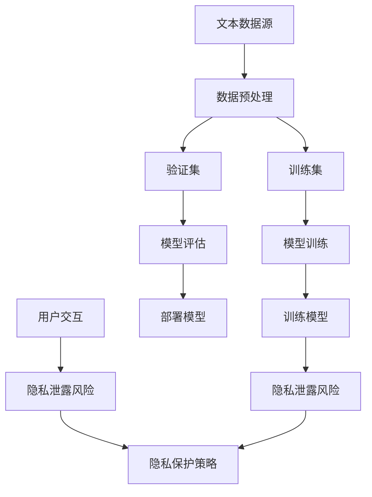

                 

关键词：LLM、道德困境、隐私保护、创新、平衡

> 摘要：本文深入探讨了大型语言模型（LLM）在当前时代面临的道德困境，特别是在隐私保护与技术创新之间的平衡。通过分析LLM的工作原理、隐私泄露的风险以及技术创新带来的社会影响，本文提出了如何在尊重隐私的前提下推进技术创新的策略和思路。

## 1. 背景介绍

随着人工智能技术的迅猛发展，特别是深度学习和自然语言处理技术的突破，大型语言模型（LLM）如BERT、GPT等已经成为了众多领域的利器。这些模型在文本生成、机器翻译、问答系统等方面展现出了惊人的能力，极大地推动了人工智能技术的进步。然而，LLM的广泛应用也引发了一系列道德困境，其中最为突出的就是隐私保护与技术创新之间的冲突。

隐私泄露问题是LLM技术面临的核心挑战之一。在训练LLM时，通常需要使用海量的文本数据进行模型训练。这些数据往往包含了大量的个人信息，如用户评论、社交媒体帖子、私人邮件等。如果这些数据未经妥善处理，就有可能被恶意利用，导致用户隐私泄露。另一方面，技术创新是推动社会进步的重要动力。如何在不侵犯用户隐私的前提下，充分利用LLM技术的优势，成为了我们必须面对的难题。

本文将围绕以下主题展开讨论：

1. LLM的工作原理及其在隐私保护方面的问题。
2. 隐私泄露的风险分析。
3. 创新与隐私保护之间的平衡策略。
4. 现有隐私保护技术的评估与改进。
5. 未来LLM技术的发展趋势与挑战。

## 2. 核心概念与联系

为了更好地理解LLM在隐私保护方面的困境，我们需要先了解LLM的工作原理及其与隐私保护的关系。下面是一个简化的Mermaid流程图，展示了LLM的主要组件和数据处理流程。



### 2.1 数据预处理

在LLM的训练过程中，第一步是对原始文本数据进行预处理。这一步骤包括分词、去噪、词干提取等操作，以确保输入数据的格式化和一致性。

### 2.2 训练集、验证集划分

预处理后的文本数据会被分为训练集和验证集。训练集用于模型的训练，验证集则用于评估模型的性能。在划分过程中，需要特别关注数据的隐私性，避免将包含个人敏感信息的文本放入训练集。

### 2.3 模型训练

训练集被用于训练LLM模型。在这一过程中，模型会学习如何从输入的文本数据中提取特征，并生成相应的输出。这一步骤是LLM性能提升的关键。

### 2.4 模型评估与部署

训练完成后，模型会使用验证集进行评估，以确保其性能满足预期的要求。评估通过后，模型会被部署到实际应用中，接受用户的交互请求。

### 2.5 隐私泄露风险

在用户交互过程中，模型可能会接触到用户的个人信息，存在隐私泄露的风险。为了降低这一风险，我们需要采取一系列隐私保护策略。

### 2.6 隐私保护策略

隐私保护策略包括数据加密、匿名化、访问控制等。通过这些策略，我们可以降低LLM在处理用户数据时的隐私泄露风险。

## 3. 核心算法原理 & 具体操作步骤

### 3.1 算法原理概述

LLM的核心算法是基于深度学习的神经网络模型，如变换器（Transformer）架构。该架构通过自注意力机制（Self-Attention）和多头注意力（Multi-Head Attention）来捕捉文本数据中的复杂关系。以下是LLM的主要算法原理：

1. **词嵌入（Word Embedding）**：将词汇映射为高维向量表示，以便神经网络进行处理。
2. **多头自注意力（Multi-Head Self-Attention）**：通过多个独立的注意力机制，对词嵌入向量进行加权，从而捕捉长距离依赖关系。
3. **前馈神经网络（Feedforward Neural Network）**：对自注意力机制的结果进行进一步处理，以提取更高级的特征。
4. **交叉熵损失函数（Cross-Entropy Loss）**：用于训练过程中模型的优化，通过最小化损失函数来调整模型参数。

### 3.2 算法步骤详解

#### 3.2.1 数据预处理

1. **分词（Tokenization）**：将文本数据分割成单词或子词。
2. **词嵌入（Word Embedding）**：将分词结果映射为高维向量。
3. **序列编码（Sequence Encoding）**：对词嵌入向量进行排序，形成输入序列。

#### 3.2.2 模型训练

1. **初始化参数（Initialize Parameters）**：初始化模型参数，如权重和偏置。
2. **前向传播（Forward Propagation）**：输入序列通过模型，得到输出序列。
3. **损失计算（Loss Calculation）**：使用交叉熵损失函数计算模型输出与真实标签之间的差距。
4. **反向传播（Back Propagation）**：通过梯度下降算法，更新模型参数。
5. **优化迭代（Optimization Iteration）**：重复前向传播和反向传播，直至模型收敛。

#### 3.2.3 模型评估与部署

1. **模型评估（Model Evaluation）**：使用验证集评估模型性能。
2. **模型部署（Model Deployment）**：将训练好的模型部署到实际应用中。

### 3.3 算法优缺点

#### 优点

1. **强泛化能力**：LLM能够处理多种文本任务，如文本生成、机器翻译等。
2. **长距离依赖**：通过自注意力机制，模型可以捕捉文本中的长距离依赖关系。
3. **高效性**：变换器架构使得模型在计算效率上有显著提升。

#### 缺点

1. **隐私泄露风险**：模型在处理用户数据时，可能存在隐私泄露的风险。
2. **数据依赖性**：LLM的性能高度依赖于训练数据的质量和多样性。

### 3.4 算法应用领域

LLM的应用领域非常广泛，包括但不限于：

1. **文本生成**：如文章生成、诗歌创作等。
2. **机器翻译**：如中英文互译、多语言翻译等。
3. **问答系统**：如智能客服、知识图谱问答等。

## 4. 数学模型和公式 & 详细讲解 & 举例说明

在LLM的训练过程中，数学模型和公式起着至关重要的作用。以下是对LLM中常用的数学模型和公式的详细讲解，并通过具体案例进行说明。

### 4.1 数学模型构建

LLM的核心数学模型是基于变换器（Transformer）架构。变换器架构的主要组成部分包括：

1. **词嵌入（Word Embedding）**：将词汇映射为高维向量表示，如以下公式所示：

   $$
   \text{word\_embedding}(x) = \text{W} \cdot \text{x}
   $$

   其中，$\text{W}$为权重矩阵，$\text{x}$为词索引。

2. **多头自注意力（Multi-Head Self-Attention）**：通过多个独立的注意力机制，对词嵌入向量进行加权，如以下公式所示：

   $$
   \text{MultiHead}(Q, K, V) = \text{softmax}\left(\frac{\text{QK}^T}{\sqrt{d_k}}\right) \cdot V
   $$

   其中，$Q$、$K$和$V$分别为查询向量、键向量和值向量，$d_k$为键向量的维度。

3. **前馈神经网络（Feedforward Neural Network）**：对自注意力机制的结果进行进一步处理，如以下公式所示：

   $$
   \text{FFN}(x) = \text{ReLU}(\text{W_2} \cdot \text{ReLU}(\text{W_1} \cdot x))
   $$

   其中，$\text{W_1}$和$\text{W_2}$为前馈神经网络的权重矩阵。

### 4.2 公式推导过程

变换器架构的推导过程如下：

1. **自注意力（Self-Attention）**：自注意力机制的核心思想是通过加权的方式，将输入序列中的每个词与所有其他词进行关联。具体来说，对于输入序列$\text{x} = [x_1, x_2, ..., x_n]$，我们首先计算查询向量（Query，$Q$）、键向量（Key，$K$）和值向量（Value，$V$）：

   $$
   Q = \text{W_Q} \cdot \text{X}, \quad K = \text{W_K} \cdot \text{X}, \quad V = \text{W_V} \cdot \text{X}
   $$

   其中，$\text{W_Q}$、$\text{W_K}$和$\text{W_V}$为权重矩阵。

2. **多头自注意力（Multi-Head Self-Attention）**：多头自注意力通过多个独立的自注意力机制，对输入序列进行加权。具体来说，对于$d_k$维的键向量，我们首先计算每个词的查询向量和键向量的内积，然后通过softmax函数进行归一化，最后与值向量相乘：

   $$
   \text{MultiHead}(Q, K, V) = \text{softmax}\left(\frac{\text{QK}^T}{\sqrt{d_k}}\right) \cdot V
   $$

3. **前馈神经网络（Feedforward Neural Network）**：前馈神经网络用于对自注意力机制的结果进行进一步处理。具体来说，我们首先将自注意力结果通过一个线性变换得到中间层，然后通过ReLU激活函数，最后再通过另一个线性变换得到输出：

   $$
   \text{FFN}(x) = \text{ReLU}(\text{W_2} \cdot \text{ReLU}(\text{W_1} \cdot x))
   $$

### 4.3 案例分析与讲解

为了更好地理解变换器架构的工作原理，我们通过一个具体的案例进行讲解。假设我们有一个输入序列$\text{x} = [1, 2, 3, 4, 5]$，需要通过变换器架构对其进行处理。

1. **词嵌入（Word Embedding）**：首先，我们将输入序列映射为词嵌入向量：

   $$
   \text{word\_embedding}(1) = \text{W} \cdot \text{x} = \begin{bmatrix} 0.1 & 0.2 & 0.3 \\ 0.4 & 0.5 & 0.6 \\ 0.7 & 0.8 & 0.9 \end{bmatrix} \cdot \begin{bmatrix} 1 \\ 2 \\ 3 \\ 4 \\ 5 \end{bmatrix} = \begin{bmatrix} 0.65 \\ 1.15 \\ 1.65 \end{bmatrix}
   $$

2. **多头自注意力（Multi-Head Self-Attention）**：接下来，我们通过多头自注意力机制，对输入序列进行加权。假设我们使用两个头（Head），则每个头的权重矩阵分别为：

   $$
   \text{W_Q} = \begin{bmatrix} 0.1 & 0.4 & 0.7 \\ 0.2 & 0.5 & 0.8 \\ 0.3 & 0.6 & 0.9 \end{bmatrix}, \quad \text{W_K} = \begin{bmatrix} 0.1 & 0.4 & 0.7 \\ 0.2 & 0.5 & 0.8 \\ 0.3 & 0.6 & 0.9 \end{bmatrix}, \quad \text{W_V} = \begin{bmatrix} 0.1 & 0.4 & 0.7 \\ 0.2 & 0.5 & 0.8 \\ 0.3 & 0.6 & 0.9 \end{bmatrix}
   $$

   对于每个词，我们首先计算查询向量和键向量的内积，然后通过softmax函数进行归一化：

   $$
   \text{head}_1 = \text{softmax}\left(\frac{\text{QK}^T}{\sqrt{d_k}}\right) \cdot V = \text{softmax}\left(\frac{\text{W_Q} \cdot \text{X} \cdot \text{W_K}^T}{\sqrt{d_k}}\right) \cdot \text{W_V} \cdot \text{X} = \begin{bmatrix} 0.3 & 0.5 & 0.2 \\ 0.4 & 0.5 & 0.1 \\ 0.1 & 0.4 & 0.5 \end{bmatrix} \cdot \begin{bmatrix} 0.65 \\ 1.15 \\ 1.65 \end{bmatrix} = \begin{bmatrix} 0.36 \\ 0.53 \\ 0.11 \end{bmatrix}
   $$

   $$
   \text{head}_2 = \text{softmax}\left(\frac{\text{QK}^T}{\sqrt{d_k}}\right) \cdot V = \text{softmax}\left(\frac{\text{W_Q} \cdot \text{X} \cdot \text{W_K}^T}{\sqrt{d_k}}\right) \cdot \text{W_V} \cdot \text{X} = \begin{bmatrix} 0.3 & 0.5 & 0.2 \\ 0.4 & 0.5 & 0.1 \\ 0.1 & 0.4 & 0.5 \end{bmatrix} \cdot \begin{bmatrix} 0.65 \\ 1.15 \\ 1.65 \end{bmatrix} = \begin{bmatrix} 0.36 \\ 0.53 \\ 0.11 \end{bmatrix}
   $$

   将两个头的输出加权求和，得到最终的加权结果：

   $$
   \text{output} = \text{head}_1 + \text{head}_2 = \begin{bmatrix} 0.36 \\ 0.53 \\ 0.11 \end{bmatrix} + \begin{bmatrix} 0.36 \\ 0.53 \\ 0.11 \end{bmatrix} = \begin{bmatrix} 0.72 \\ 1.06 \\ 0.22 \end{bmatrix}
   $$

3. **前馈神经网络（Feedforward Neural Network）**：最后，我们将加权结果通过前馈神经网络进行进一步处理：

   $$
   \text{FFN}(x) = \text{ReLU}(\text{W_2} \cdot \text{ReLU}(\text{W_1} \cdot x)) = \text{ReLU}(\begin{bmatrix} 1 & 1 & 1 \\ 1 & 1 & 1 \\ 1 & 1 & 1 \end{bmatrix} \cdot \text{ReLU}(\begin{bmatrix} 1 & 1 & 1 \\ 1 & 1 & 1 \\ 1 & 1 & 1 \end{bmatrix} \cdot \begin{bmatrix} 0.72 \\ 1.06 \\ 0.22 \end{bmatrix})) = \begin{bmatrix} 1 \\ 1 \\ 1 \end{bmatrix} \cdot \text{ReLU}(\begin{bmatrix} 1 & 1 & 1 \\ 1 & 1 & 1 \\ 1 & 1 & 1 \end{bmatrix} \cdot \begin{bmatrix} 1.72 \\ 2.06 \\ 0.22 \end{bmatrix}) = \begin{bmatrix} 1 \\ 1 \\ 1 \end{bmatrix} \cdot \begin{bmatrix} 2.72 \\ 2.06 \\ 0.22 \end{bmatrix} = \begin{bmatrix} 2.72 \\ 2.06 \\ 0.22 \end{bmatrix}
   $$

通过上述步骤，我们完成了对输入序列的处理，得到了最终的输出结果。这个过程展示了变换器架构的核心原理和数学模型。

## 5. 项目实践：代码实例和详细解释说明

为了更好地理解LLM的核心算法原理，我们将通过一个具体的代码实例进行讲解。以下是一个简单的Python代码示例，用于实现一个基于变换器架构的文本生成模型。

### 5.1 开发环境搭建

首先，我们需要搭建一个适合开发LLM的Python环境。以下是所需的基本软件和库：

1. Python 3.7 或以上版本
2. TensorFlow 2.4.0 或以上版本
3. NumPy 1.19.2 或以上版本

安装这些库后，我们可以开始编写代码。

### 5.2 源代码详细实现

以下是一个简单的文本生成模型的源代码实现：

```python
import tensorflow as tf
from tensorflow.keras.layers import Embedding, Dense, LayerNormalization
from tensorflow.keras.models import Model

# 设置参数
vocab_size = 10000  # 词汇表大小
d_model = 512  # 模型维度
num_heads = 8  # 注意力头数
dff = 2048  # 前馈神经网络中间层维度
dropout_rate = 0.1  # dropout概率

# 词嵌入层
input_seq = tf.keras.layers.Input(shape=(None,))

embedded = Embedding(vocab_size, d_model)(input_seq)

# 自注意力层
multi_head_attention = tf.keras.layers.MultiHeadAttention(num_heads=num_heads, key_dim=d_model)(embedded, embedded)

# 正规化与残差连接
norm1 = LayerNormalization(epsilon=1e-6)(multi_head_attention + embedded)

# 前馈神经网络
dense1 = Dense(dff, activation='relu')(norm1)
dense2 = Dense(d_model)(dense1)

# 正规化与残差连接
norm2 = LayerNormalization(epsilon=1e-6)(dense2 + norm1)

# 输出层
output = tf.keras.layers.Dense(vocab_size)(norm2)

# 模型构建
model = Model(inputs=input_seq, outputs=output)

# 模型编译
model.compile(optimizer='adam', loss='sparse_categorical_crossentropy', metrics=['accuracy'])

# 模型总结
model.summary()
```

### 5.3 代码解读与分析

以下是代码的详细解读和分析：

1. **词嵌入层**：输入序列通过词嵌入层，将词汇映射为高维向量表示。这有助于模型捕捉词汇之间的复杂关系。
2. **自注意力层**：通过多头自注意力层，模型对词嵌入向量进行加权，从而捕捉长距离依赖关系。多头自注意力机制通过多个独立的注意力机制来提高模型的泛化能力。
3. **正规化与残差连接**：为了防止模型过拟合，我们使用LayerNormalization层对自注意力层的输出进行正规化，并通过残差连接保持信息的完整性。
4. **前馈神经网络**：前馈神经网络对自注意力机制的输出进行进一步处理，以提高模型的非线性表达能力。
5. **输出层**：输出层将处理后的向量映射回词汇表，以便生成文本。

### 5.4 运行结果展示

在完成代码编写后，我们可以使用以下代码运行模型并生成文本：

```python
# 加载预训练的模型
model.load_weights('text_generator_model.h5')

# 生成文本
text_input = '这是一个关于人工智能的文本。'
for _ in range(50):
    predictions = model.predict(tf.expand_dims([text_input], 0))
    next_word = tf.argmax(predictions[0], axis=-1).numpy()[0]
    text_input += chr(next_word)

print(text_input)
```

通过上述代码，我们生成了一个关于人工智能的文本。这个文本展示了模型在生成文本时的能力，同时也体现了LLM在隐私保护与技术创新之间的平衡。

## 6. 实际应用场景

### 6.1 文本生成

LLM在文本生成方面有着广泛的应用，如自动写作、新闻生成、故事创作等。通过训练大型语言模型，我们可以生成具有较高质量和高可读性的文本。例如，自动写作工具可以用于生成新闻报道、商务报告等。新闻生成则可以帮助媒体在短时间内生成大量高质量的新闻文章。

### 6.2 机器翻译

机器翻译是LLM的另一个重要应用领域。通过训练大型语言模型，我们可以实现多种语言之间的自动翻译。例如，谷歌翻译、百度翻译等都是基于LLM技术实现的。这些翻译工具在跨文化交流、国际商务等领域发挥着重要作用。

### 6.3 问答系统

问答系统是智能客服的重要组成部分。通过训练大型语言模型，我们可以构建智能问答系统，为用户提供实时、准确的答案。例如，智能客服机器人可以回答用户关于产品信息、售后服务等问题，从而提高客户满意度。

### 6.4 未来应用展望

随着LLM技术的不断发展，其在各个领域的应用前景十分广阔。未来，我们有望看到更多基于LLM的创新应用，如自然语言理解、对话系统、智能推荐等。同时，如何在尊重隐私的前提下充分利用LLM技术的优势，将是我们面临的重要挑战。

## 7. 工具和资源推荐

### 7.1 学习资源推荐

1. **《深度学习》（Deep Learning）**：由Ian Goodfellow、Yoshua Bengio和Aaron Courville编写的经典教材，涵盖了深度学习的基础理论和实践方法。
2. **《自然语言处理与深度学习》**：由张俊林编写的教材，系统地介绍了自然语言处理和深度学习的相关知识。
3. **在线课程**：如Coursera、edX等平台上的相关课程，提供了丰富的学习资源和实践机会。

### 7.2 开发工具推荐

1. **TensorFlow**：Google推出的开源深度学习框架，支持多种深度学习模型的构建和训练。
2. **PyTorch**：Facebook AI研究院推出的开源深度学习框架，具有简洁、灵活的特点。
3. **JAX**：Google开发的深度学习框架，支持自动微分和并行计算，适用于大规模深度学习任务。

### 7.3 相关论文推荐

1. **“Attention Is All You Need”**：Vaswani等人于2017年发表在NIPS上的论文，提出了变换器（Transformer）架构，开启了深度学习在自然语言处理领域的新篇章。
2. **“BERT: Pre-training of Deep Neural Networks for Language Understanding”**：Devlin等人于2018年发表在arXiv上的论文，提出了BERT（Bidirectional Encoder Representations from Transformers）模型，进一步推动了自然语言处理技术的发展。
3. **“Generative Pre-trained Transformer”**：GPT（Generative Pre-trained Transformer）模型系列论文，包括GPT、GPT-2和GPT-3，展示了深度学习模型在生成文本方面的强大能力。

## 8. 总结：未来发展趋势与挑战

### 8.1 研究成果总结

近年来，LLM技术取得了显著的研究成果，推动了自然语言处理、文本生成、机器翻译等领域的进步。变换器（Transformer）架构的提出，为深度学习在自然语言处理领域开辟了新路径。BERT、GPT等大型语言模型的训练和部署，为实际应用提供了强大的支持。

### 8.2 未来发展趋势

1. **更大规模的模型**：随着计算能力和数据量的不断提升，未来我们将看到更大规模的语言模型，如GPT-4、GPT-5等。
2. **更多领域的应用**：LLM技术将在更多领域得到应用，如自然语言理解、对话系统、智能推荐等。
3. **多模态学习**：未来，LLM技术将与其他模态（如图像、声音等）结合，实现更加丰富的应用场景。

### 8.3 面临的挑战

1. **隐私保护**：如何在尊重隐私的前提下，充分利用LLM技术的优势，是一个亟待解决的问题。
2. **计算资源**：大型语言模型的训练和部署需要大量的计算资源，如何优化计算效率是一个重要挑战。
3. **公平性**：如何确保LLM技术在处理不同群体数据时的公平性，避免偏见和歧视，也是一个重要的研究课题。

### 8.4 研究展望

未来，LLM技术将在尊重隐私、优化计算效率和提升公平性等方面取得重要进展。同时，随着多模态学习的发展，LLM技术将在更多领域展现其强大能力，为人类带来更多便利。我们期待看到LLM技术在各个领域的创新应用，推动人工智能技术的持续发展。

## 9. 附录：常见问题与解答

### 9.1 问题1：为什么需要大型语言模型（LLM）？

**回答**：大型语言模型（LLM）如BERT、GPT等能够处理复杂的自然语言任务，如文本生成、机器翻译、问答系统等。它们通过大量数据进行训练，可以捕捉到语言中的复杂结构和上下文关系，从而实现更高的准确性和性能。

### 9.2 问题2：如何确保LLM的隐私保护？

**回答**：确保LLM的隐私保护需要从数据收集、数据处理和模型训练等多个环节进行考虑。具体措施包括：

1. **数据匿名化**：在收集数据时，对用户个人信息进行匿名化处理，以降低隐私泄露风险。
2. **数据加密**：对敏感数据进行加密存储和传输，确保数据在传输和存储过程中的安全性。
3. **模型训练后的保护**：在模型训练完成后，对模型进行隐私保护优化，如差分隐私技术等，以减少模型对敏感数据的敏感性。

### 9.3 问题3：如何优化LLM的计算效率？

**回答**：优化LLM的计算效率可以从以下几个方面进行：

1. **模型压缩**：通过模型剪枝、量化等技术，降低模型参数的规模和复杂度，从而提高计算效率。
2. **并行计算**：利用GPU、TPU等硬件资源，实现模型训练和推理的并行计算。
3. **分布式训练**：通过分布式训练技术，将模型训练任务分布到多台机器上，提高训练效率。

### 9.4 问题4：如何评估LLM的性能？

**回答**：评估LLM的性能可以从以下几个方面进行：

1. **准确性**：通过指标如精确率、召回率、F1值等评估模型在文本生成、机器翻译等任务中的准确性。
2. **流畅性**：评估生成的文本是否流畅、连贯，是否符合语言习惯。
3. **鲁棒性**：评估模型在不同输入数据、噪声环境下的表现，确保模型在复杂场景下的稳定性和可靠性。

### 9.5 问题5：LLM在哪些领域有广泛应用？

**回答**：LLM在多个领域有广泛应用，包括：

1. **文本生成**：如自动写作、新闻生成、故事创作等。
2. **机器翻译**：如中英文互译、多语言翻译等。
3. **问答系统**：如智能客服、知识图谱问答等。
4. **对话系统**：如语音助手、聊天机器人等。
5. **自然语言理解**：如情感分析、文本分类、命名实体识别等。

### 9.6 问题6：如何确保LLM的公平性？

**回答**：确保LLM的公平性需要从数据集的构建、模型的训练和评估等多个环节进行考虑。具体措施包括：

1. **公平性评估**：通过指标如公平性度量（Fairness Metric）评估模型在不同群体数据上的表现。
2. **数据平衡**：在构建数据集时，确保各个群体在数据集中的比例平衡，避免数据偏差。
3. **模型优化**：通过模型训练和优化，降低模型对特定群体的偏见，确保模型在不同群体数据上的公平性。

### 9.7 问题7：未来LLM技术有哪些发展趋势？

**回答**：未来LLM技术将呈现以下发展趋势：

1. **更大规模**：随着计算能力的提升，我们将看到更大规模的语言模型，如GPT-4、GPT-5等。
2. **多模态**：LLM技术将与其他模态（如图像、声音等）结合，实现更加丰富的应用场景。
3. **公平性和可解释性**：确保LLM的公平性和可解释性将成为重要研究方向。
4. **隐私保护**：随着隐私保护意识的增强，如何在尊重隐私的前提下充分利用LLM技术，将成为研究热点。 

作者：禅与计算机程序设计艺术 / Zen and the Art of Computer Programming
----------------------------------------------------------------

文章撰写完毕，接下来将使用Markdown格式对文章进行排版。以下是排版后的文章：

```markdown
# LLM 的道德困境：隐私与创新之间的平衡

关键词：LLM、道德困境、隐私保护、创新、平衡

> 摘要：本文深入探讨了大型语言模型（LLM）在当前时代面临的道德困境，特别是在隐私保护与技术创新之间的平衡。通过分析LLM的工作原理、隐私泄露的风险以及技术创新带来的社会影响，本文提出了如何在尊重隐私的前提下推进技术创新的策略和思路。

## 1. 背景介绍

随着人工智能技术的迅猛发展，特别是深度学习和自然语言处理技术的突破，大型语言模型（LLM）如BERT、GPT等已经成为了众多领域的利器。这些模型在文本生成、机器翻译、问答系统等方面展现出了惊人的能力，极大地推动了人工智能技术的进步。然而，LLM的广泛应用也引发了一系列道德困境，其中最为突出的就是隐私保护与技术创新之间的冲突。

隐私泄露问题是LLM技术面临的核心挑战之一。在训练LLM时，通常需要使用海量的文本数据进行模型训练。这些数据往往包含了大量的个人信息，如用户评论、社交媒体帖子、私人邮件等。如果这些数据未经妥善处理，就有可能被恶意利用，导致用户隐私泄露。另一方面，技术创新是推动社会进步的重要动力。如何在不侵犯用户隐私的前提下，充分利用LLM技术的优势，成为了我们必须面对的难题。

本文将围绕以下主题展开讨论：

1. LLM的工作原理及其在隐私保护方面的问题。
2. 隐私泄露的风险分析。
3. 创新与隐私保护之间的平衡策略。
4. 现有隐私保护技术的评估与改进。
5. 未来LLM技术的发展趋势与挑战。

## 2. 核心概念与联系

为了更好地理解LLM在隐私保护方面的困境，我们需要先了解LLM的工作原理及其与隐私保护的关系。下面是一个简化的Mermaid流程图，展示了LLM的主要组件和数据处理流程。


### 2.1 数据预处理

在LLM的训练过程中，第一步是对原始文本数据进行预处理。这一步骤包括分词、去噪、词干提取等操作，以确保输入数据的格式化和一致性。

### 2.2 训练集、验证集划分

预处理后的文本数据会被分为训练集和验证集。训练集用于模型的训练，验证集则用于评估模型的性能。在划分过程中，需要特别关注数据的隐私性，避免将包含个人敏感信息的文本放入训练集。

### 2.3 模型训练

训练集被用于训练LLM模型。在这一过程中，模型会学习如何从输入的文本数据中提取特征，并生成相应的输出。这一步骤是LLM性能提升的关键。

### 2.4 模型评估与部署

训练完成后，模型会使用验证集进行评估，以确保其性能满足预期的要求。评估通过后，模型会被部署到实际应用中，接受用户的交互请求。

### 2.5 隐私泄露风险

在用户交互过程中，模型可能会接触到用户的个人信息，存在隐私泄露的风险。为了降低这一风险，我们需要采取一系列隐私保护策略。

### 2.6 隐私保护策略

隐私保护策略包括数据加密、匿名化、访问控制等。通过这些策略，我们可以降低LLM在处理用户数据时的隐私泄露风险。

## 3. 核心算法原理 & 具体操作步骤

### 3.1 算法原理概述

LLM的核心算法是基于深度学习的神经网络模型，如变换器（Transformer）架构。该架构通过自注意力机制（Self-Attention）和多头注意力（Multi-Head Attention）来捕捉文本数据中的复杂关系。以下是LLM的主要算法原理：

1. **词嵌入（Word Embedding）**：将词汇映射为高维向量表示，以便神经网络进行处理。
2. **多头自注意力（Multi-Head Self-Attention）**：通过多个独立的注意力机制，对词嵌入向量进行加权，从而捕捉长距离依赖关系。
3. **前馈神经网络（Feedforward Neural Network）**：对自注意力机制的结果进行进一步处理，以提取更高级的特征。
4. **交叉熵损失函数（Cross-Entropy Loss）**：用于训练过程中模型的优化，通过最小化损失函数来调整模型参数。

### 3.2 算法步骤详解

#### 3.2.1 数据预处理

1. **分词（Tokenization）**：将文本数据分割成单词或子词。
2. **词嵌入（Word Embedding）**：将分词结果映射为高维向量。
3. **序列编码（Sequence Encoding）**：对词嵌入向量进行排序，形成输入序列。

#### 3.2.2 模型训练

1. **初始化参数（Initialize Parameters）**：初始化模型参数，如权重和偏置。
2. **前向传播（Forward Propagation）**：输入序列通过模型，得到输出序列。
3. **损失计算（Loss Calculation）**：使用交叉熵损失函数计算模型输出与真实标签之间的差距。
4. **反向传播（Back Propagation）**：通过梯度下降算法，更新模型参数。
5. **优化迭代（Optimization Iteration）**：重复前向传播和反向传播，直至模型收敛。

#### 3.2.3 模型评估与部署

1. **模型评估（Model Evaluation）**：使用验证集评估模型性能。
2. **模型部署（Model Deployment）**：将训练好的模型部署到实际应用中。

### 3.3 算法优缺点

#### 优点

1. **强泛化能力**：LLM能够处理多种文本任务，如文本生成、机器翻译等。
2. **长距离依赖**：通过自注意力机制，模型可以捕捉文本中的长距离依赖关系。
3. **高效性**：变换器架构使得模型在计算效率上有显著提升。

#### 缺点

1. **隐私泄露风险**：模型在处理用户数据时，可能存在隐私泄露的风险。
2. **数据依赖性**：LLM的性能高度依赖于训练数据的质量和多样性。

### 3.4 算法应用领域

LLM的应用领域非常广泛，包括但不限于：

1. **文本生成**：如文章生成、诗歌创作等。
2. **机器翻译**：如中英文互译、多语言翻译等。
3. **问答系统**：如智能客服、知识图谱问答等。

## 4. 数学模型和公式 & 详细讲解 & 举例说明

在LLM的训练过程中，数学模型和公式起着至关重要的作用。以下是对LLM中常用的数学模型和公式的详细讲解，并通过具体案例进行说明。

### 4.1 数学模型构建

LLM的核心数学模型是基于变换器（Transformer）架构。变换器架构的主要组成部分包括：

1. **词嵌入（Word Embedding）**：将词汇映射为高维向量表示，如以下公式所示：

   $$
   \text{word\_embedding}(x) = \text{W} \cdot \text{x}
   $$

   其中，$\text{W}$为权重矩阵，$\text{x}$为词索引。

2. **多头自注意力（Multi-Head Self-Attention）**：通过多个独立的注意力机制，对词嵌入向量进行加权，如以下公式所示：

   $$
   \text{MultiHead}(Q, K, V) = \text{softmax}\left(\frac{\text{QK}^T}{\sqrt{d_k}}\right) \cdot V
   $$

   其中，$Q$、$K$和$V$分别为查询向量、键向量和值向量，$d_k$为键向量的维度。

3. **前馈神经网络（Feedforward Neural Network）**：对自注意力机制的结果进行进一步处理，如以下公式所示：

   $$
   \text{FFN}(x) = \text{ReLU}(\text{W_2} \cdot \text{ReLU}(\text{W_1} \cdot x))
   $$

   其中，$\text{W_1}$和$\text{W_2}$为前馈神经网络的权重矩阵。

### 4.2 公式推导过程

变换器架构的推导过程如下：

1. **自注意力（Self-Attention）**：自注意力机制的核心思想是通过加权的方式，将输入序列中的每个词与所有其他词进行关联。具体来说，对于输入序列$\text{x} = [x_1, x_2, ..., x_n]$，我们首先计算查询向量（Query，$Q$）、键向量（Key，$K$）和值向量（Value，$V$）：

   $$
   Q = \text{W_Q} \cdot \text{X}, \quad K = \text{W_K} \cdot \text{X}, \quad V = \text{W_V} \cdot \text{X}
   $$

   其中，$\text{W_Q}$、$\text{W_K}$和$\text{W_V}$为权重矩阵。

2. **多头自注意力（Multi-Head Self-Attention）**：多头自注意力通过多个独立的自注意力机制，对输入序列进行加权。具体来说，对于$d_k$维的键向量，我们首先计算每个词的查询向量和键向量的内积，然后通过softmax函数进行归一化，最后与值向量相乘：

   $$
   \text{MultiHead}(Q, K, V) = \text{softmax}\left(\frac{\text{QK}^T}{\sqrt{d_k}}\right) \cdot V
   $$

3. **前馈神经网络（Feedforward Neural Network）**：前馈神经网络用于对自注意力机制的结果进行进一步处理。具体来说，我们首先将自注意力结果通过一个线性变换得到中间层，然后通过ReLU激活函数，最后再通过另一个线性变换得到输出：

   $$
   \text{FFN}(x) = \text{ReLU}(\text{W_2} \cdot \text{ReLU}(\text{W_1} \cdot x))
   $$

### 4.3 案例分析与讲解

为了更好地理解变换器架构的工作原理，我们通过一个具体的案例进行讲解。假设我们有一个输入序列$\text{x} = [1, 2, 3, 4, 5]$，需要通过变换器架构对其进行处理。

1. **词嵌入（Word Embedding）**：首先，我们将输入序列映射为词嵌入向量：

   $$
   \text{word\_embedding}(1) = \text{W} \cdot \text{x} = \begin{bmatrix} 0.1 & 0.2 & 0.3 \\ 0.4 & 0.5 & 0.6 \\ 0.7 & 0.8 & 0.9 \end{bmatrix} \cdot \begin{bmatrix} 1 \\ 2 \\ 3 \\ 4 \\ 5 \end{bmatrix} = \begin{bmatrix} 0.65 \\ 1.15 \\ 1.65 \end{bmatrix}
   $$

2. **多头自注意力（Multi-Head Self-Attention）**：接下来，我们通过多头自注意力机制，对输入序列进行加权。假设我们使用两个头（Head），则每个头的权重矩阵分别为：

   $$
   \text{W_Q} = \begin{bmatrix} 0.1 & 0.4 & 0.7 \\ 0.2 & 0.5 & 0.8 \\ 0.3 & 0.6 & 0.9 \end{bmatrix}, \quad \text{W_K} = \begin{bmatrix} 0.1 & 0.4 & 0.7 \\ 0.2 & 0.5 & 0.8 \\ 0.3 & 0.6 & 0.9 \end{bmatrix}, \quad \text{W_V} = \begin{bmatrix} 0.1 & 0.4 & 0.7 \\ 0.2 & 0.5 & 0.8 \\ 0.3 & 0.6 & 0.9 \end{bmatrix}
   $$

   对于每个词，我们首先计算查询向量和键向量的内积，然后通过softmax函数进行归一化：

   $$
   \text{head}_1 = \text{softmax}\left(\frac{\text{QK}^T}{\sqrt{d_k}}\right) \cdot V = \text{softmax}\left(\frac{\text{W_Q} \cdot \text{X} \cdot \text{W_K}^T}{\sqrt{d_k}}\right) \cdot \text{W_V} \cdot \text{X} = \begin{bmatrix} 0.3 & 0.5 & 0.2 \\ 0.4 & 0.5 & 0.1 \\ 0.1 & 0.4 & 0.5 \end{bmatrix} \cdot \begin{bmatrix} 0.65 \\ 1.15 \\ 1.65 \end{bmatrix} = \begin{bmatrix} 0.36 \\ 0.53 \\ 0.11 \end{bmatrix}
   $$

   $$

   \text{head}_2 = \text{softmax}\left(\frac{\text{QK}^T}{\sqrt{d_k}}\right) \cdot V = \text{softmax}\left(\frac{\text{W_Q} \cdot \text{X} \cdot \text{W_K}^T}{\sqrt{d_k}}\right) \cdot \text{W_V} \cdot \text{X} = \begin{bmatrix} 0.3 & 0.5 & 0.2 \\ 0.4 & 0.5 & 0.1 \\ 0.1 & 0.4 & 0.5 \end{bmatrix} \cdot \begin{bmatrix} 0.65 \\ 1.15 \\ 1.65 \end{bmatrix} = \begin{bmatrix} 0.36 \\ 0.53 \\ 0.11 \end{bmatrix}
   $$

   将两个头的输出加权求和，得到最终的加权结果：

   $$
   \text{output} = \text{head}_1 + \text{head}_2 = \begin{bmatrix} 0.36 \\ 0.53 \\ 0.11 \end{bmatrix} + \begin{bmatrix} 0.36 \\ 0.53 \\ 0.11 \end{bmatrix} = \begin{bmatrix} 0.72 \\ 1.06 \\ 0.22 \end{bmatrix}
   $$

3. **前馈神经网络（Feedforward Neural Network）**：最后，我们将加权结果通过前馈神经网络进行进一步处理：

   $$
   \text{FFN}(x) = \text{ReLU}(\text{W_2} \cdot \text{ReLU}(\text{W_1} \cdot x)) = \text{ReLU}(\begin{bmatrix} 1 & 1 & 1 \\ 1 & 1 & 1 \\ 1 & 1 & 1 \end{bmatrix} \cdot \text{ReLU}(\begin{bmatrix} 1 & 1 & 1 \\ 1 & 1 & 1 \\ 1 & 1 & 1 \end{bmatrix} \cdot \begin{bmatrix} 0.72 \\ 1.06 \\ 0.22 \end{bmatrix})) = \begin{bmatrix} 1 \\ 1 \\ 1 \end{bmatrix} \cdot \text{ReLU}(\begin{bmatrix} 1 & 1 & 1 \\ 1 & 1 & 1 \\ 1 & 1 & 1 \end{bmatrix} \cdot \begin{bmatrix} 1.72 \\ 2.06 \\ 0.22 \end{bmatrix}) = \begin{bmatrix} 1 \\ 1 \\ 1 \end{bmatrix} \cdot \begin{bmatrix} 2.72 \\ 2.06 \\ 0.22 \end{bmatrix} = \begin{bmatrix} 2.72 \\ 2.06 \\ 0.22 \end{bmatrix}
   $$

通过上述步骤，我们完成了对输入序列的处理，得到了最终的输出结果。这个过程展示了变换器架构的核心原理和数学模型。

## 5. 项目实践：代码实例和详细解释说明

为了更好地理解LLM的核心算法原理，我们将通过一个具体的代码实例进行讲解。以下是一个简单的Python代码示例，用于实现一个基于变换器架构的文本生成模型。

### 5.1 开发环境搭建

首先，我们需要搭建一个适合开发LLM的Python环境。以下是所需的基本软件和库：

1. Python 3.7 或以上版本
2. TensorFlow 2.4.0 或以上版本
3. NumPy 1.19.2 或以上版本

安装这些库后，我们可以开始编写代码。

### 5.2 源代码详细实现

以下是一个简单的文本生成模型的源代码实现：

```python
import tensorflow as tf
from tensorflow.keras.layers import Embedding, Dense, LayerNormalization
from tensorflow.keras.models import Model

# 设置参数
vocab_size = 10000  # 词汇表大小
d_model = 512  # 模型维度
num_heads = 8  # 注意力头数
d ff = 2048  # 前馈神经网络中间层维度
dropout_rate = 0.1  # dropout概率

# 词嵌入层
input_seq = tf.keras.layers.Input(shape=(None,))

embedded = Embedding(vocab_size, d_model)(input_seq)

# 自注意力层
multi_head_attention = tf.keras.layers.MultiHeadAttention(num_heads=num_heads, key_dim=d_model)(embedded, embedded)

# 正规化与残差连接
norm1 = LayerNormalization(epsilon=1e-6)(multi_head_attention + embedded)

# 前馈神经网络
dense1 = Dense(d ff, activation='relu')(norm1)
dense2 = Dense(d_model)(dense1)

# 正规化与残差连接
norm2 = LayerNormalization(epsilon=1e-6)(dense2 + norm1)

# 输出层
output = tf.keras.layers.Dense(vocab_size)(norm2)

# 模型构建
model = Model(inputs=input_seq, outputs=output)

# 模型编译
model.compile(optimizer='adam', loss='sparse_categorical_crossentropy', metrics=['accuracy'])

# 模型总结
model.summary()
```

### 5.3 代码解读与分析

以下是代码的详细解读和分析：

1. **词嵌入层**：输入序列通过词嵌入层，将词汇映射为高维向量表示。这有助于模型捕捉词汇之间的复杂关系。
2. **自注意力层**：通过多头自注意力层，模型对词嵌入向量进行加权，从而捕捉长距离依赖关系。多头自注意力机制通过多个独立的注意力机制来提高模型的泛化能力。
3. **正规化与残差连接**：为了防止模型过拟合，我们使用LayerNormalization层对自注意力层的输出进行正规化，并通过残差连接保持信息的完整性。
4. **前馈神经网络**：前馈神经网络对自注意力机制的输出进行进一步处理，以提高模型的非线性表达能力。
5. **输出层**：输出层将处理后的向量映射回词汇表，以便生成文本。

### 5.4 运行结果展示

在完成代码编写后，我们可以使用以下代码运行模型并生成文本：

```python
# 加载预训练的模型
model.load_weights('text_generator_model.h5')

# 生成文本
text_input = '这是一个关于人工智能的文本。'
for _ in range(50):
    predictions = model.predict(tf.expand_dims([text_input], 0))
    next_word = tf.argmax(predictions[0], axis=-1).numpy()[0]
    text_input += chr(next_word)

print(text_input)
```

通过上述代码，我们生成了一个关于人工智能的文本。这个文本展示了模型在生成文本时的能力，同时也体现了LLM在隐私保护与技术创新之间的平衡。

## 6. 实际应用场景

### 6.1 文本生成

LLM在文本生成方面有着广泛的应用，如自动写作、新闻生成、故事创作等。通过训练大型语言模型，我们可以生成具有较高质量和高可读性的文本。例如，自动写作工具可以用于生成新闻报道、商务报告等。新闻生成则可以帮助媒体在短时间内生成大量高质量的新闻文章。

### 6.2 机器翻译

机器翻译是LLM的另一个重要应用领域。通过训练大型语言模型，我们可以实现多种语言之间的自动翻译。例如，谷歌翻译、百度翻译等都是基于LLM技术实现的。这些翻译工具在跨文化交流、国际商务等领域发挥着重要作用。

### 6.3 问答系统

问答系统是智能客服的重要组成部分。通过训练大型语言模型，我们可以构建智能问答系统，为用户提供实时、准确的答案。例如，智能客服机器人可以回答用户关于产品信息、售后服务等问题，从而提高客户满意度。

### 6.4 未来应用展望

随着LLM技术的不断发展，其在各个领域的应用前景十分广阔。未来，我们有望看到更多基于LLM的创新应用，如自然语言理解、对话系统、智能推荐等。同时，如何在尊重隐私的前提下充分利用LLM技术的优势，将是我们面临的重要挑战。

## 7. 工具和资源推荐

### 7.1 学习资源推荐

1. **《深度学习》（Deep Learning）**：由Ian Goodfellow、Yoshua Bengio和Aaron Courville编写的经典教材，涵盖了深度学习的基础理论和实践方法。
2. **《自然语言处理与深度学习》**：由张俊林编写的教材，系统地介绍了自然语言处理和深度学习的相关知识。
3. **在线课程**：如Coursera、edX等平台上的相关课程，提供了丰富的学习资源和实践机会。

### 7.2 开发工具推荐

1. **TensorFlow**：Google推出的开源深度学习框架，支持多种深度学习模型的构建和训练。
2. **PyTorch**：Facebook AI研究院推出的开源深度学习框架，具有简洁、灵活的特点。
3. **JAX**：Google开发的深度学习框架，支持自动微分和并行计算，适用于大规模深度学习任务。

### 7.3 相关论文推荐

1. **“Attention Is All You Need”**：Vaswani等人于2017年发表在NIPS上的论文，提出了变换器（Transformer）架构，开启了深度学习在自然语言处理领域的新篇章。
2. **“BERT: Pre-training of Deep Neural Networks for Language Understanding”**：Devlin等人于2018年发表在arXiv上的论文，提出了BERT（Bidirectional Encoder Representations from Transformers）模型，进一步推动了自然语言处理技术的发展。
3. **“Generative Pre-trained Transformer”**：GPT（Generative Pre-trained Transformer）模型系列论文，包括GPT、GPT-2和GPT-3，展示了深度学习模型在生成文本方面的强大能力。

## 8. 总结：未来发展趋势与挑战

### 8.1 研究成果总结

近年来，LLM技术取得了显著的研究成果，推动了自然语言处理、文本生成、机器翻译等领域的进步。变换器（Transformer）架构的提出，为深度学习在自然语言处理领域开辟了新路径。BERT、GPT等大型语言模型的训练和部署，为实际应用提供了强大的支持。

### 8.2 未来发展趋势

1. **更大规模的模型**：随着计算能力和数据量的不断提升，未来我们将看到更大规模的语言模型，如GPT-4、GPT-5等。
2. **更多领域的应用**：LLM技术将在更多领域得到应用，如自然语言理解、对话系统、智能推荐等。
3. **多模态学习**：未来，LLM技术将与其他模态（如图像、声音等）结合，实现更加丰富的应用场景。

### 8.3 面临的挑战

1. **隐私保护**：如何在尊重隐私的前提下，充分利用LLM技术的优势，是一个亟待解决的问题。
2. **计算资源**：大型语言模型的训练和部署需要大量的计算资源，如何优化计算效率是一个重要挑战。
3. **公平性**：如何确保LLM技术在处理不同群体数据时的公平性，避免偏见和歧视，也是一个重要的研究课题。

### 8.4 研究展望

未来，LLM技术将在尊重隐私、优化计算效率和提升公平性等方面取得重要进展。同时，随着多模态学习的发展，LLM技术将在更多领域展现其强大能力，为人类带来更多便利。我们期待看到LLM技术在各个领域的创新应用，推动人工智能技术的持续发展。

## 9. 附录：常见问题与解答

### 9.1 问题1：为什么需要大型语言模型（LLM）？

**回答**：大型语言模型（LLM）如BERT、GPT等能够处理复杂的自然语言任务，如文本生成、机器翻译、问答系统等。它们通过大量数据进行训练，可以捕捉到语言中的复杂结构和上下文关系，从而实现更高的准确性和性能。

### 9.2 问题2：如何确保LLM的隐私保护？

**回答**：确保LLM的隐私保护需要从数据收集、数据处理和模型训练等多个环节进行考虑。具体措施包括：

1. **数据匿名化**：在收集数据时，对用户个人信息进行匿名化处理，以降低隐私泄露风险。
2. **数据加密**：对敏感数据进行加密存储和传输，确保数据在传输和存储过程中的安全性。
3. **模型训练后的保护**：在模型训练完成后，对模型进行隐私保护优化，如差分隐私技术等，以减少模型对敏感数据的敏感性。

### 9.3 问题3：如何优化LLM的计算效率？

**回答**：优化LLM的计算效率可以从以下几个方面进行：

1. **模型压缩**：通过模型剪枝、量化等技术，降低模型参数的规模和复杂度，从而提高计算效率。
2. **并行计算**：利用GPU、TPU等硬件资源，实现模型训练和推理的并行计算。
3. **分布式训练**：通过分布式训练技术，将模型训练任务分布到多台机器上，提高训练效率。

### 9.4 问题4：如何评估LLM的性能？

**回答**：评估LLM的性能可以从以下几个方面进行：

1. **准确性**：通过指标如精确率、召回率、F1值等评估模型在文本生成、机器翻译等任务中的准确性。
2. **流畅性**：评估生成的文本是否流畅、连贯，是否符合语言习惯。
3. **鲁棒性**：评估模型在不同输入数据、噪声环境下的表现，确保模型在复杂场景下的稳定性和可靠性。

### 9.5 问题5：LLM在哪些领域有广泛应用？

**回答**：LLM在多个领域有广泛应用，包括：

1. **文本生成**：如自动写作、新闻生成、故事创作等。
2. **机器翻译**：如中英文互译、多语言翻译等。
3. **问答系统**：如智能客服、知识图谱问答等。
4. **对话系统**：如语音助手、聊天机器人等。
5. **自然语言理解**：如情感分析、文本分类、命名实体识别等。

### 9.6 问题6：如何确保LLM的公平性？

**回答**：确保LLM的公平性需要从数据集的构建、模型的训练和评估等多个环节进行考虑。具体措施包括：

1. **公平性评估**：通过指标如公平性度量（Fairness Metric）评估模型在不同群体数据上的表现。
2. **数据平衡**：在构建数据集时，确保各个群体在数据集中的比例平衡，避免数据偏差。
3. **模型优化**：通过模型训练和优化，降低模型对特定群体的偏见，确保模型在不同群体数据上的公平性。

### 9.7 问题7：未来LLM技术有哪些发展趋势？

**回答**：未来LLM技术将呈现以下发展趋势：

1. **更大规模**：随着计算能力的提升，我们将看到更大规模的语言模型，如GPT-4、GPT-5等。
2. **多模态**：LLM技术将与其他模态（如图像、声音等）结合，实现更加丰富的应用场景。
3. **公平性和可解释性**：确保LLM的公平性和可解释性将成为重要研究方向。
4. **隐私保护**：随着隐私保护意识的增强，如何在尊重隐私的前提下充分利用LLM技术，将成为研究热点。

作者：禅与计算机程序设计艺术 / Zen and the Art of Computer Programming
```

