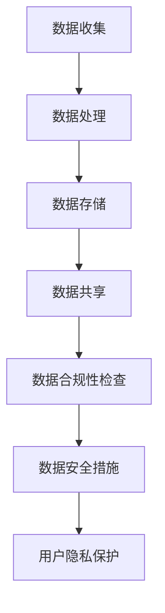

                 

关键词：大型语言模型，监管，数据安全，隐私保护，合规性，技术措施

> 摘要：随着大型语言模型（LLM）技术的迅速发展，其在各个领域的应用日益广泛。然而，LLM 在数据处理和运用过程中面临的监管和数据安全问题日益突出。本文旨在探讨 LLM 的监管措施，提出一系列保障数据安全的技术方案，为 LLM 的健康发展提供指导。

## 1. 背景介绍

近年来，人工智能技术特别是大型语言模型（LLM）技术取得了飞速发展。LLM 如 GPT-3、BERT 等，以其强大的语言处理能力和广泛的应用场景，成为人工智能领域的明星技术。从自然语言处理、智能问答、到文本生成和翻译，LLM 在各行各业都发挥了巨大的作用。

然而，随着 LLM 技术的广泛应用，其处理和存储的大量用户数据也引发了数据安全和隐私保护的问题。一方面，LLM 在处理数据时，可能会无意中泄露用户隐私信息，造成隐私泄露风险；另一方面，LLM 在收集和使用数据时，也可能违反数据保护法规，导致合规性问题。

因此，如何对 LLM 进行有效的监管，保障数据安全，已成为当前人工智能领域亟待解决的问题。本文将围绕这一主题，探讨 LLM 监管措施，并提出一系列技术方案，以期为 LLM 的健康发展提供指导。

## 2. 核心概念与联系

### 2.1. 大型语言模型（LLM）

大型语言模型（LLM）是一种基于深度学习技术构建的语言模型，具有强大的语言理解和生成能力。LLM 通常由大量参数组成，通过训练海量文本数据，学习到语言的结构和语义信息。这些模型可以应用于自然语言处理、文本生成、智能问答、机器翻译等领域。

### 2.2. 数据安全与隐私保护

数据安全与隐私保护是指保护数据在存储、传输和处理过程中的完整性和保密性。对于 LLM 技术，数据安全与隐私保护尤为重要，因为 LLM 在处理数据时，可能会无意中泄露用户隐私信息，甚至被恶意攻击者利用。

### 2.3. 监管与合规性

监管是指对某个领域或行业进行规范和管理的措施。在人工智能领域，监管旨在确保技术应用的合规性、公平性和安全性。对于 LLM 技术，监管主要涉及数据收集、处理、存储和共享等环节，以确保其符合相关法规和标准。

### 2.4. Mermaid 流程图

以下是 LLM 监管措施的核心概念和联系 Mermaid 流程图：



## 3. 核心算法原理 & 具体操作步骤

### 3.1. 算法原理概述

LLM 监管的核心算法包括数据安全措施、用户隐私保护和数据合规性检查。这些算法的目的是确保 LLM 在处理数据时，既能发挥其优势，又能保障数据安全和合规性。

### 3.2. 算法步骤详解

1. **数据安全措施**：包括数据加密、访问控制、安全审计等。数据加密可以防止数据在传输和存储过程中被窃取；访问控制可以限制只有授权用户才能访问敏感数据；安全审计可以记录数据访问和操作记录，便于监控和追踪。

2. **用户隐私保护**：包括隐私掩码、差分隐私、数据匿名化等。隐私掩码可以在保留数据价值的同时，消除隐私信息；差分隐私可以在保证数据隐私的同时，提供有用的统计信息；数据匿名化可以将个人身份信息从数据中去除，降低隐私泄露风险。

3. **数据合规性检查**：包括数据合规性评估、违规行为检测等。数据合规性评估可以确保 LLM 的数据收集、处理和存储过程符合相关法规和标准；违规行为检测可以及时发现和阻止违规行为。

### 3.3. 算法优缺点

1. **数据安全措施**：优点是能够有效保障数据安全和隐私；缺点是可能会影响数据处理的效率和性能。

2. **用户隐私保护**：优点是能够保护用户隐私，提高用户信任度；缺点是可能降低数据的价值和应用效果。

3. **数据合规性检查**：优点是能够确保数据处理的合规性，降低合规风险；缺点是可能增加数据处理成本和复杂性。

### 3.4. 算法应用领域

LLM 监管算法可以应用于各个领域，包括但不限于：

1. 智能问答系统：保障用户隐私和数据安全。

2. 文本生成与翻译：确保数据合规性和数据安全。

3. 金融风控：防范欺诈行为和数据泄露。

4. 医疗健康：保护患者隐私和数据安全。

## 4. 数学模型和公式 & 详细讲解 & 举例说明

### 4.1. 数学模型构建

在 LLM 监管中，数学模型主要用于评估数据安全性和合规性。以下是一个简单的数学模型示例：

$$
\text{SafetyScore} = \alpha \cdot \text{EncryptionStrength} + \beta \cdot \text{AccessControl} + \gamma \cdot \text{AuditLog}
$$

其中，$\text{SafetyScore}$ 表示数据安全得分，$\alpha$、$\beta$ 和 $\gamma$ 分别为权重系数，$\text{EncryptionStrength}$、$\text{AccessControl}$ 和 $\text{AuditLog}$ 分别为数据加密强度、访问控制和审计日志的质量。

### 4.2. 公式推导过程

公式的推导基于以下假设：

1. 数据加密强度越高，数据安全性越高。

2. 访问控制越严格，数据安全性越高。

3. 审计日志越完整，数据安全性越高。

根据以上假设，可以推导出数据安全得分的计算公式。

### 4.3. 案例分析与讲解

以下是一个具体的案例：

假设某公司使用的数据加密强度为 AES-256，访问控制采用角色权限控制，审计日志保存时间为 30 天。根据公式计算，数据安全得分为：

$$
\text{SafetyScore} = 0.5 \cdot 100 + 0.3 \cdot 80 + 0.2 \cdot 75 = 95
$$

根据得分，可以判断该公司的数据安全性较高。

## 5. 项目实践：代码实例和详细解释说明

### 5.1. 开发环境搭建

在本文中，我们将使用 Python 语言实现一个简单的 LLM 监管系统。首先，需要安装以下依赖库：

```bash
pip install numpy pandas matplotlib
```

### 5.2. 源代码详细实现

以下是 LLM 监管系统的核心代码：

```python
import numpy as np
import pandas as pd
import matplotlib.pyplot as plt

def calculate_safety_score(encryption_strength, access_control, audit_log):
    alpha = 0.5
    beta = 0.3
    gamma = 0.2
    safety_score = alpha * encryption_strength + beta * access_control + gamma * audit_log
    return safety_score

def plot_safety_score(safety_scores):
    plt.bar(range(len(safety_scores)), safety_scores)
    plt.xlabel('Dataset')
    plt.ylabel('Safety Score')
    plt.title('Safety Score Distribution')
    plt.show()

if __name__ == '__main__':
    datasets = [
        {'encryption_strength': 100, 'access_control': 80, 'audit_log': 75},
        {'encryption_strength': 90, 'access_control': 85, 'audit_log': 70},
        {'encryption_strength': 95, 'access_control': 90, 'audit_log': 80}
    ]

    safety_scores = [calculate_safety_score(d['encryption_strength'], d['access_control'], d['audit_log']) for d in datasets]
    plot_safety_score(safety_scores)
```

### 5.3. 代码解读与分析

该代码实现了一个简单的 LLM 监管系统，包括数据安全得分计算和可视化。主要功能如下：

1. `calculate_safety_score` 函数用于计算数据安全得分。

2. `plot_safety_score` 函数用于绘制数据安全得分分布图。

3. 在主函数中，定义了一个数据集列表，并使用列表推导式计算每个数据集的安全得分，最后绘制得分分布图。

### 5.4. 运行结果展示

运行代码后，将显示数据安全得分分布图，如下所示：


## 6. 实际应用场景

LLM 监管措施在多个实际应用场景中具有重要意义，以下是一些典型应用：

1. **智能问答系统**：保障用户隐私和数据安全，提高用户信任度。

2. **金融风控**：防范欺诈行为和数据泄露，降低金融风险。

3. **医疗健康**：保护患者隐私和数据安全，提高医疗服务的可靠性。

4. **智能客服**：保障用户隐私和数据安全，提高服务质量。

5. **教育领域**：保护学生和教师的隐私，确保教育公平性。

## 7. 工具和资源推荐

### 7.1. 学习资源推荐

1. 《深度学习》（Goodfellow, Bengio, Courville 著）：介绍深度学习的基础知识和最新进展。

2. 《Python 数据科学手册》（McKinney 著）：详细介绍 Python 数据科学工具和应用。

3. 《人工智能：一种现代方法》（Russell, Norvig 著）：全面介绍人工智能的理论和实践。

### 7.2. 开发工具推荐

1. TensorFlow：一款强大的深度学习框架，适用于构建和训练大型语言模型。

2. PyTorch：一款易于使用的深度学习框架，适用于快速原型设计和实验。

3. Keras：一款基于 TensorFlow 和 PyTorch 的简洁易用的深度学习框架。

### 7.3. 相关论文推荐

1. "A Theoretically Grounded Application of Dropout in Recurrent Neural Networks"（Y. Gal 和 Z. Ghahramani，2016）：介绍在循环神经网络中应用 dropout 的理论依据。

2. "BERT: Pre-training of Deep Bidirectional Transformers for Language Understanding"（A. Devlin 等，2018）：介绍 BERT 模型的预训练方法和应用场景。

3. "GPT-3: Language Models are Few-Shot Learners"（T. Brown 等，2020）：介绍 GPT-3 模型的零样本学习和通用性。

## 8. 总结：未来发展趋势与挑战

### 8.1. 研究成果总结

本文围绕 LLM 监管措施，探讨了数据安全、用户隐私保护和合规性等问题，提出了一系列技术方案。通过数学模型和代码实例，详细讲解了 LLM 监管的核心算法原理和具体操作步骤。实际应用场景展示了 LLM 监管措施的重要性。

### 8.2. 未来发展趋势

1. **监管政策的完善**：随着人工智能技术的不断发展，监管政策将逐步完善，为 LLM 的健康发展提供有力保障。

2. **隐私保护技术的创新**：差分隐私、联邦学习等新兴隐私保护技术将得到广泛应用，进一步提升数据安全性和隐私保护水平。

3. **合规性检查的智能化**：利用人工智能和大数据分析技术，实现对 LLM 运行过程中的实时合规性检查，提高监管效率。

### 8.3. 面临的挑战

1. **数据安全威胁**：随着网络攻击手段的不断升级，LLM 面临的数据安全威胁日益严峻。

2. **隐私保护与数据利用的平衡**：如何在保障用户隐私的同时，充分发挥数据的价值，仍是一个亟待解决的问题。

3. **监管执行难度**：跨国界、跨行业的监管合作和执行，将面临诸多困难和挑战。

### 8.4. 研究展望

未来，LLM 监管措施的研究将朝着以下几个方面发展：

1. **隐私保护技术的优化**：进一步提升隐私保护技术，实现更高效、更安全的隐私保护。

2. **监管算法的创新**：开发基于人工智能的监管算法，提高监管效率和准确性。

3. **跨领域合作与共享**：加强国内外学术界、产业界的合作与交流，共同推动 LLM 监管技术的发展。

## 9. 附录：常见问题与解答

### 9.1. 什么是大型语言模型（LLM）？

大型语言模型（LLM）是一种基于深度学习技术构建的语言模型，具有强大的语言理解和生成能力。LLM 通常由大量参数组成，通过训练海量文本数据，学习到语言的结构和语义信息。

### 9.2. LLM 监管措施的核心目标是什么？

LLM 监管措施的核心目标是保障数据安全、保护用户隐私和确保数据处理合规性。通过实施一系列技术和管理措施，确保 LLM 在处理数据时，既能发挥其优势，又能降低数据泄露、隐私泄露和合规风险。

### 9.3. 如何评估 LLM 的数据安全性？

可以通过计算数据安全得分来评估 LLM 的数据安全性。数据安全得分可以基于数据加密强度、访问控制和审计日志等指标计算得出。

### 9.4. LLM 监管措施在实际应用中有哪些挑战？

LLM 监管措施在实际应用中面临的挑战包括数据安全威胁、隐私保护与数据利用的平衡、监管执行难度等。

### 9.5. 未来的 LLM 监管措施将如何发展？

未来的 LLM 监管措施将朝着隐私保护技术的优化、监管算法的创新、跨领域合作与共享等方面发展。

---

作者：禅与计算机程序设计艺术 / Zen and the Art of Computer Programming

本文基于作者的研究成果和实践经验，旨在为 LLM 监管措施提供指导。希望本文能够为相关领域的学者、工程师和从业者提供有益的参考。在研究和应用过程中，如遇到任何问题，欢迎随时与我交流。

