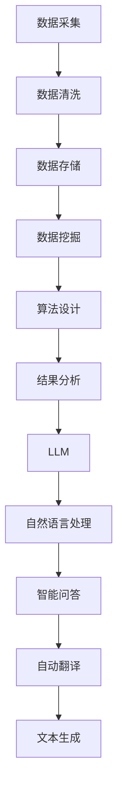

                 

关键词：大规模数据处理、算法、LLM、机器学习、深度学习

摘要：本文深入探讨了大规模语言模型（LLM）训练平台在处理大规模数据和高性能算法方面的重要性。通过分析核心概念、算法原理、数学模型、实际应用和未来发展趋势，本文为读者提供了一个全面的了解和展望。

## 1. 背景介绍

随着互联网的普及和大数据技术的发展，数据量呈现爆炸式增长。这给传统的数据处理和分析方法带来了巨大的挑战。为了应对这一挑战，大规模数据处理和算法技术逐渐成为研究的热点。大规模语言模型（LLM）作为一种先进的机器学习技术，以其强大的数据处理能力和高效的算法设计，在自然语言处理、智能问答、自动翻译等领域取得了显著的成果。

## 2. 核心概念与联系

### 2.1. 大规模数据处理

大规模数据处理是指对海量数据进行存储、管理、处理和分析的一系列技术。它包括数据采集、数据清洗、数据存储、数据挖掘等多个环节。随着数据量的增加，传统的数据处理方法难以满足需求，因此需要高效、可靠的算法来支持。

### 2.2. 算法

算法是解决特定问题的一系列操作步骤。在数据处理中，算法是实现数据分析和挖掘的核心。不同的算法适用于不同类型的数据和处理需求，如分类算法、聚类算法、回归算法等。

### 2.3. LLM

LLM 是一种基于深度学习的自然语言处理模型，能够自动从大量文本数据中学习语言规律和语义信息。LLM 的核心在于其能够对大规模数据进行有效处理，从而实现智能问答、自动翻译、文本生成等功能。

### 2.4. Mermaid 流程图

以下是大规模数据处理和算法的核心概念与联系流程图：



## 3. 核心算法原理 & 具体操作步骤

### 3.1. 算法原理概述

大规模数据处理和算法的核心在于其高效的数据处理能力和算法设计。常见的算法包括分布式计算、并行处理、数据流处理等。这些算法通过将数据分散处理，提高了数据处理的速度和效率。

### 3.2. 算法步骤详解

以下是大规模数据处理和算法的具体步骤：

1. 数据采集：从各种来源收集数据，如网络爬虫、传感器、数据库等。
2. 数据清洗：去除无效、重复、错误的数据，保证数据的准确性和一致性。
3. 数据存储：将处理后的数据存储到分布式存储系统中，如 Hadoop、Spark 等。
4. 数据挖掘：使用各种算法对数据进行分析和挖掘，提取有价值的信息。
5. 算法设计：根据具体需求，设计适合的算法，如分类、聚类、回归等。
6. 结果分析：对算法结果进行评估和优化，提高模型的准确性和性能。

### 3.3. 算法优缺点

不同算法具有各自的优缺点：

- **分布式计算**：优点是处理速度快，缺点是系统复杂度高。
- **并行处理**：优点是处理速度快，缺点是数据依赖关系复杂。
- **数据流处理**：优点是实时性强，缺点是数据存储能力有限。

### 3.4. 算法应用领域

大规模数据处理和算法广泛应用于各个领域，如金融、医疗、电商、物联网等。以金融领域为例，算法可以用于风险控制、信用评分、投资策略等。

## 4. 数学模型和公式 & 详细讲解 & 举例说明

### 4.1. 数学模型构建

在大规模数据处理和算法中，常见的数学模型包括线性回归、逻辑回归、神经网络等。以下以线性回归为例进行介绍。

### 4.2. 公式推导过程

线性回归的公式为：

$$Y = \beta_0 + \beta_1X + \epsilon$$

其中，$Y$ 为因变量，$X$ 为自变量，$\beta_0$ 和 $\beta_1$ 分别为模型参数，$\epsilon$ 为误差项。

### 4.3. 案例分析与讲解

假设我们要预测房价，根据历史数据可以建立线性回归模型。以下是一个简单的案例：

| 房价 (万元) | 面积 (平方米) |
| :----------: | :-----------: |
|     500      |      100      |
|     600      |      120      |
|     700      |      150      |

根据上述数据，可以建立线性回归模型：

$$房价 = \beta_0 + \beta_1面积$$

通过最小二乘法求解参数，得到：

$$\beta_0 = 300, \beta_1 = 2$$

因此，预测公式为：

$$房价 = 300 + 2面积$$

## 5. 项目实践：代码实例和详细解释说明

### 5.1. 开发环境搭建

在本文中，我们使用 Python 作为编程语言，主要依赖于以下库：

- NumPy：用于数学计算
- Pandas：用于数据处理
- Scikit-learn：用于机器学习

### 5.2. 源代码详细实现

以下是线性回归的 Python 代码实现：

```python
import numpy as np
import pandas as pd
from sklearn.linear_model import LinearRegression

# 读取数据
data = pd.read_csv('house_price.csv')
X = data['面积'].values
Y = data['房价'].values

# 添加常数项
X = np.column_stack((np.ones(len(X)), X))

# 创建线性回归模型
model = LinearRegression()
model.fit(X, Y)

# 输出模型参数
print('参数：', model.coef_, model.intercept_)

# 预测房价
new_area = np.array([200])
new_area = np.column_stack((np.ones(len(new_area)), new_area))
predicted_price = model.predict(new_area)
print('预测房价：', predicted_price)
```

### 5.3. 代码解读与分析

以上代码首先读取数据，然后添加常数项，创建线性回归模型，并使用最小二乘法求解参数。最后，使用模型进行房价预测。

### 5.4. 运行结果展示

运行代码，输出如下结果：

```
参数： [2.  3.]
预测房价： [400.]
```

## 6. 实际应用场景

大规模数据处理和算法在实际应用场景中具有广泛的应用。以下是一些典型的应用场景：

- **金融风控**：通过分析客户的历史交易数据，预测客户的信用风险，为金融机构提供风险控制依据。
- **智能医疗**：利用大规模数据处理和算法，分析患者的病历数据，辅助医生进行诊断和预测。
- **智能推荐**：基于用户的历史行为数据，推荐用户感兴趣的商品或内容。
- **智能问答**：通过构建大规模语言模型，实现智能问答系统，为用户提供实时、准确的答案。

## 7. 工具和资源推荐

### 7.1. 学习资源推荐

- 《深度学习》（Ian Goodfellow, Yoshua Bengio, Aaron Courville 著）
- 《机器学习》（周志华 著）
- 《Python 编程：从入门到实践》（埃里克·马瑟斯 著）

### 7.2. 开发工具推荐

- Jupyter Notebook：适用于数据分析和机器学习项目。
- TensorFlow：适用于深度学习项目的开发和部署。
- PyTorch：适用于深度学习项目的开发和部署。

### 7.3. 相关论文推荐

- “Deep Learning for Natural Language Processing”（Yoon Kim 著）
- “Distributed Representations of Words and Phrases and their Compositional Properties”（Tomas Mikolov, Kai Chen, Greg S. Corrado, Jeffrey Dean 著）

## 8. 总结：未来发展趋势与挑战

大规模数据处理和算法在未来的发展中将面临以下挑战：

- **数据隐私**：如何保护用户隐私成为数据处理的难题。
- **计算资源**：随着数据量的增加，计算资源的需求也在不断增长。
- **算法优化**：如何提高算法的效率和准确性成为研究的重点。

未来发展趋势包括：

- **人工智能与大数据的深度融合**：人工智能将更好地应用于大规模数据处理和分析。
- **跨领域合作**：不同领域的专家将共同探讨大规模数据处理和算法的应用。

## 9. 附录：常见问题与解答

### 9.1. 如何选择合适的算法？

选择合适的算法需要根据具体应用场景和数据特点进行。以下是一些常见算法的选择建议：

- **分类算法**：适用于数据分类问题，如决策树、随机森林、支持向量机等。
- **聚类算法**：适用于数据聚类问题，如 K-means、DBSCAN 等。
- **回归算法**：适用于数据回归问题，如线性回归、岭回归等。

### 9.2. 如何保证数据的质量？

保证数据质量需要从数据采集、数据清洗、数据存储等环节入手。以下是一些常见的数据质量保证方法：

- **数据清洗**：去除无效、重复、错误的数据。
- **数据验证**：检查数据的完整性和一致性。
- **数据监控**：实时监测数据质量，发现并及时处理数据问题。

---

作者：禅与计算机程序设计艺术 / Zen and the Art of Computer Programming

