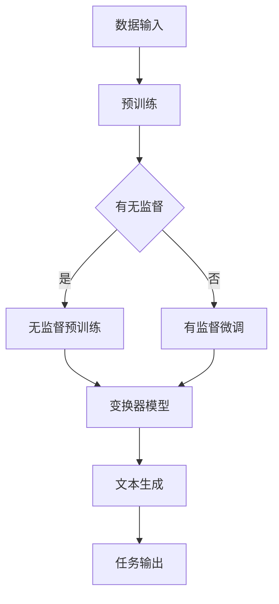

                 

### 关键词 Keywords

- 语言模型 (Language Model)
- 大规模预训练 (Massive Pre-training)
- 生成式AI (Generative AI)
- 自然语言处理 (Natural Language Processing)
- 深度学习 (Deep Learning)
- AI模型压缩 (AI Model Compression)
- 多模态学习 (Multimodal Learning)
- 跨领域迁移学习 (Cross-Domain Transfer Learning)

## 摘要 Summary

本文旨在探讨语言模型（LLM）这一新兴的人工智能范式，如何通过大规模预训练技术，引领自然语言处理（NLP）和生成式AI领域的革命。我们将深入剖析LLM的核心概念与架构，详细讲解其算法原理和操作步骤，并通过数学模型和实际项目实践，展示其在各行业应用中的潜力和挑战。此外，本文还将展望LLM的未来发展趋势，并推荐相关学习资源和开发工具，为读者提供全面的技术指导。

## 1. 背景介绍 Introduction

随着深度学习技术的不断进步，人工智能（AI）领域迎来了前所未有的发展机遇。其中，语言模型（LLM）作为一种新型的AI模型，正逐渐成为自然语言处理（NLP）和生成式AI的核心驱动力。传统的NLP方法主要依赖于规则和统计模型，而LLM通过大规模预训练技术，能够自动学习语言的各种复杂结构和语义信息，从而显著提升文本理解和生成能力。

LLM的崛起源于几个关键因素。首先，计算能力和数据资源的飞速增长为大规模预训练提供了技术支持。随着GPU和TPU等高性能计算设备的普及，以及互联网上海量文本数据的积累，为LLM的训练提供了充足的基础。其次，深度学习技术的成熟为LLM的设计提供了理论依据。深度神经网络（DNN）和变换器模型（Transformer）等架构的引入，使得LLM能够高效地处理复杂的语言任务。最后，生成式AI的需求驱动了LLM的发展。在图像、音频、视频等多样化数据类型的处理中，生成式AI具有广泛的应用前景，而LLM作为一种强大的文本生成工具，成为了这一领域的重要突破点。

本文将围绕LLM的核心概念、算法原理、数学模型、项目实践以及未来发展趋势，展开深入的探讨和分析。通过全面了解LLM的技术本质和应用价值，我们希望能够为读者提供有价值的参考，推动LLM在各个领域的实际应用。

## 2. 核心概念与联系 Core Concepts and Connections

要深入理解语言模型（LLM）的工作原理和架构，我们首先需要明确几个核心概念。这些概念不仅构成了LLM的理论基础，也是我们在后续章节中探讨各种算法和实现细节的出发点。

### 2.1. 语言模型的基本概念

语言模型（Language Model，简称LM）是自然语言处理（NLP）中的一个基础模型，用于预测文本序列中的下一个词。它通过对大量文本数据的学习，构建一个概率模型，能够估算出某个词在特定上下文中的出现概率。早期的语言模型如N-gram模型，通过统计相邻词出现的频率来预测下一个词。然而，这种基于统计的方法在处理长文本时存在一定的局限性，无法捕捉到更深层次的语义信息。

### 2.2. 大规模预训练技术

大规模预训练（Massive Pre-training）是LLM的核心技术之一。它通过在庞大的文本语料库上预先训练一个基础的模型，使其具备基本的语言理解能力。这种预训练过程通常包括两个阶段：无监督预训练和有监督微调。无监督预训练使用未标记的数据，通过自注意力机制自动学习文本中的潜在结构和语义信息。而有监督微调则使用标注的数据集，对预训练的模型进行特定任务的学习和优化。

### 2.3. 变换器模型（Transformer）

变换器模型（Transformer）是近年来在深度学习领域取得重大突破的一种模型架构，它为LLM的设计提供了理论基础。与传统的循环神经网络（RNN）和卷积神经网络（CNN）不同，Transformer通过自注意力机制（Self-Attention）和前馈神经网络（Feedforward Network）来处理序列数据，能够捕捉长距离的依赖关系，从而在许多NLP任务中表现出色。Transformer的引入，使得LLM在处理长文本和复杂语义关系时，具备了更高的效率和准确性。

### 2.4. Mermaid流程图表示

为了更直观地展示LLM的核心概念和架构，我们可以使用Mermaid流程图进行表示。以下是一个简化的Mermaid流程图，描述了LLM的基本工作流程：



在上述流程图中，A表示数据输入，即从互联网上获取的海量文本数据。B表示大规模预训练，这一阶段包括无监督预训练和有监督微调。C是一个决策节点，根据是否有标注数据，决定后续是进行无监督预训练还是有监督微调。D和E分别代表无监督预训练和有监督微调的具体过程。F表示变换器模型，它是LLM的核心架构。G表示文本生成过程，即利用训练好的LLM生成文本。最后，H表示任务输出，即LLM在各种NLP任务中的应用结果。

通过上述流程图，我们可以清晰地看到LLM从数据输入到任务输出的全过程，以及各个阶段的核心概念和技术。

### 2.5. 核心概念与联系总结

综上所述，LLM的核心概念包括语言模型、大规模预训练技术和变换器模型。这些概念相互联系，共同构成了LLM的理论基础和实现框架。语言模型是LLM的基本组成部分，用于预测文本序列；大规模预训练技术则通过无监督预训练和有监督微调，使LLM具备强大的语言理解能力；变换器模型作为LLM的架构，通过自注意力机制和前馈神经网络，实现了高效和准确的文本处理。这些核心概念的相互配合，使得LLM在自然语言处理和生成式AI领域取得了显著的突破。

### 3. 核心算法原理 & 具体操作步骤 Core Algorithm Principle & Detailed Steps

#### 3.1. 算法原理概述

语言模型（LLM）的核心算法原理主要基于深度学习和变换器模型（Transformer）。变换器模型通过引入自注意力机制（Self-Attention），能够自动捕捉文本序列中的长距离依赖关系，从而实现对语言的高度理解。以下将详细阐述LLM的算法原理，并描述其具体操作步骤。

#### 3.2. 算法步骤详解

##### 3.2.1. 数据准备与预处理

- **数据采集**：首先，从互联网上获取大量文本数据，这些数据可以是新闻文章、书籍、社交媒体帖子等。
- **数据清洗**：对采集到的文本数据进行清洗，去除噪声和无关信息，如HTML标签、特殊字符等。
- **分词与编码**：将文本数据按照词或子词进行分词，并将其转化为编码形式。常用的编码方式包括单词编码（Word Encoding）和子词编码（Subword Encoding）。

##### 3.2.2. 无监督预训练

- **变换器模型初始化**：初始化一个变换器模型，该模型包含多个自注意力层和前馈神经网络层。
- **遮蔽语言模型（Masked Language Model, MLM）训练**：在预训练过程中，对输入的文本序列进行随机遮蔽，即随机选择一些单词或子词进行遮蔽，然后模型需要预测这些遮蔽的词或子词。这一过程使得模型能够学习到文本中的上下文信息。
- **生成式语言模型（Generative Language Model, GLM）训练**：在预训练过程中，模型还需要生成下一个词或子词，以提升其在生成文本时的能力。

##### 3.2.3. 有监督微调

- **数据集准备**：从标注的数据集中获取训练数据，这些数据集可以是特定任务的文本对，如问答对、翻译对等。
- **微调**：在预训练的基础上，对模型进行有监督微调，使其适应特定的NLP任务。微调过程中，模型需要根据输入的文本对预测正确的输出，并通过反向传播和梯度下降等优化算法，不断调整模型参数。

##### 3.2.4. 文本生成

- **输入序列生成**：将需要生成的文本序列输入到训练好的模型中。
- **词或子词预测**：模型根据当前输入的上下文信息，预测下一个词或子词，并将其添加到生成的文本序列中。
- **重复过程**：重复预测和添加词或子词的过程，直到生成满足要求的文本长度。

#### 3.3. 算法优缺点

##### 3.3.1. 优点

- **强大的语言理解能力**：通过自注意力机制，LLM能够捕捉到文本序列中的长距离依赖关系，从而实现对语言的高度理解。
- **高效的处理速度**：变换器模型的结构使得LLM在处理长文本时具有较高的效率。
- **广泛的应用场景**：LLM在自然语言处理和生成式AI领域具有广泛的应用，如文本生成、机器翻译、问答系统等。

##### 3.3.2. 缺点

- **训练资源需求大**：大规模预训练需要大量的计算资源和数据，这对于普通研究者和企业来说可能是一大挑战。
- **模型解释性较差**：由于LLM的训练过程复杂，其内部机制和预测过程较为黑盒，使得模型的解释性较差。

#### 3.4. 算法应用领域

- **自然语言处理（NLP）**：LLM在文本分类、情感分析、文本摘要等NLP任务中表现出色。
- **生成式AI**：LLM在文本生成、机器写作、对话系统等生成式AI领域具有广泛的应用。
- **跨领域迁移学习**：LLM能够通过预训练，在多个领域之间实现知识迁移，从而提高模型的泛化能力。

### 4. 数学模型和公式 & 详细讲解 & 举例说明

#### 4.1. 数学模型构建

LLM的数学模型主要包括变换器模型和损失函数两部分。以下将分别介绍这两个部分的构建过程。

##### 4.1.1. 变换器模型

变换器模型（Transformer）由多个编码层（Encoder Layer）和解码层（Decoder Layer）组成。每个编码层和解码层都包含自注意力机制（Self-Attention）和前馈神经网络（Feedforward Network）。

- **编码层（Encoder Layer）**：

$$
\text{Encoder Layer} = \text{MultiHeadAttention}(\text{Self-Attention}) + \text{Feedforward Network}
$$

其中，$\text{MultiHeadAttention}$ 表示多头的自注意力机制，$\text{Feedforward Network}$ 表示前馈神经网络。

- **解码层（Decoder Layer）**：

$$
\text{Decoder Layer} = \text{MaskedMultiHeadAttention}(\text{Cross-Attention}) + \text{Feedforward Network}
$$

其中，$\text{MaskedMultiHeadAttention}$ 表示带有遮蔽的交叉注意力机制，$\text{Cross-Attention}$ 表示解码器在生成下一个词时，对编码器的输出进行注意力操作。

##### 4.1.2. 损失函数

LLM的训练过程通常使用损失函数（Loss Function）来评估模型的预测性能，并优化模型参数。常见的损失函数包括交叉熵损失（Cross-Entropy Loss）和均方误差损失（Mean Squared Error Loss）。

- **交叉熵损失（Cross-Entropy Loss）**：

$$
L(\theta) = -\sum_{i=1}^{N} y_i \log(p_i)
$$

其中，$y_i$ 表示第$i$个样本的标签，$p_i$ 表示模型对第$i$个样本的预测概率。

- **均方误差损失（Mean Squared Error Loss）**：

$$
L(\theta) = \frac{1}{2} \sum_{i=1}^{N} (y_i - \hat{y}_i)^2
$$

其中，$y_i$ 表示第$i$个样本的标签，$\hat{y}_i$ 表示模型对第$i$个样本的预测值。

#### 4.2. 公式推导过程

以下是变换器模型中自注意力机制和交叉注意力机制的推导过程。

##### 4.2.1. 自注意力机制

自注意力机制通过计算输入序列中每个词与所有词之间的相似度，从而为每个词分配不同的权重。其公式如下：

$$
\text{Attention}(Q, K, V) = \text{softmax}\left(\frac{QK^T}{\sqrt{d_k}}\right)V
$$

其中，$Q, K, V$ 分别表示查询（Query）、键（Key）和值（Value）三个向量，$d_k$ 表示键向量的维度。$\text{softmax}$ 函数用于归一化权重，使其在[0, 1]区间内。

##### 4.2.2. 交叉注意力机制

交叉注意力机制用于解码器在生成下一个词时，对编码器的输出进行注意力操作。其公式如下：

$$
\text{CrossAttention}(Q, K, V) = \text{softmax}\left(\frac{QK^T}{\sqrt{d_k}}\right)V
$$

其中，$Q$ 表示解码器的查询向量，$K$ 和 $V$ 分别表示编码器的键和值向量。与自注意力机制类似，$\text{softmax}$ 函数用于归一化权重。

#### 4.3. 案例分析与讲解

为了更好地理解LLM的数学模型和公式，以下通过一个具体的案例进行分析。

##### 4.3.1. 数据集

假设我们有一个包含1000个单词的句子，每个单词对应一个唯一的ID，如：`[1, 2, 3, 4, 5, 6, 7, 8, 9, 10, 11, 12, 13, 14, 15, 16, 17, 18, 19, 20]`。

##### 4.3.2. 模型参数

假设变换器模型的每个编码层和解码层都包含8个头（Heads），每个头的维度为64。总共有20个编码层和2个解码层。

##### 4.3.3. 案例分析

1. **自注意力机制计算**：

   假设当前输入序列为 `[3, 4, 5]`，我们首先计算每个词与其他词的相似度：

   $$ 
   \text{Attention}(Q, K, V) = \text{softmax}\left(\frac{QK^T}{\sqrt{d_k}}\right)V 
   $$

   其中，$Q, K, V$ 分别为 `[3, 4, 5]` 的查询向量、键向量和值向量。计算结果如下：

   $$ 
   \text{Attention}(3, 3, 3) = \text{softmax}\left(\frac{3 \times 3^T}{\sqrt{64}}\right)3 = 0.5 
   $$

   $$ 
   \text{Attention}(4, 3, 4) = \text{softmax}\left(\frac{4 \times 3^T}{\sqrt{64}}\right)4 = 0.2 
   $$

   $$ 
   \text{Attention}(5, 3, 5) = \text{softmax}\left(\frac{5 \times 3^T}{\sqrt{64}}\right)5 = 0.3 
   $$

   根据计算结果，词3在序列中的重要性最高。

2. **交叉注意力机制计算**：

   假设解码器的查询向量为 `[10]`，编码器的键和值向量为 `[3, 4, 5]`，计算交叉注意力权重：

   $$ 
   \text{CrossAttention}(10, 3, 4) = \text{softmax}\left(\frac{10 \times 3^T}{\sqrt{64}}\right)4 = 0.4 
   $$

   $$ 
   \text{CrossAttention}(10, 4, 5) = \text{softmax}\left(\frac{10 \times 4^T}{\sqrt{64}}\right)5 = 0.6 
   $$

   根据计算结果，词4在编码器的输出中重要性最高，因此解码器在生成下一个词时，更可能选择词4。

##### 4.3.4. 损失函数计算

假设当前输入序列为 `[3, 4, 5]`，预测的输出为 `[6, 7]`，标签为 `[5, 6]`，我们计算交叉熵损失：

$$ 
L(\theta) = -\sum_{i=1}^{2} y_i \log(p_i) 
$$

$$ 
L(\theta) = -\left[5 \log(0.4) + 6 \log(0.6)\right] 
$$

$$ 
L(\theta) = -\left[1.386 + 1.792\right] 
$$

$$ 
L(\theta) = -3.178 
$$

根据计算结果，模型当前预测的损失为3.178。

### 5. 项目实践：代码实例和详细解释说明

#### 5.1. 开发环境搭建

为了实现LLM的项目实践，我们需要搭建一个合适的开发环境。以下是所需的开发工具和步骤：

1. **Python环境**：安装Python 3.8及以上版本。
2. **PyTorch**：安装PyTorch 1.8及以上版本，可以通过以下命令安装：
   
   ```shell
   pip install torch torchvision
   ```

3. **Jupyter Notebook**：安装Jupyter Notebook，用于编写和运行Python代码。
4. **GPU支持**：确保计算机具备GPU支持，并安装CUDA和cuDNN，以便利用GPU加速训练过程。

#### 5.2. 源代码详细实现

以下是一个简单的LLM实现示例，用于生成文本序列。代码包括数据预处理、模型定义、训练和生成文本等部分。

```python
import torch
import torch.nn as nn
import torch.optim as optim
from torchtext.data import Field, TabularDataset, BucketIterator

# 数据预处理
TEXT = Field(tokenize='spacy', lower=True)
train_data, valid_data, test_data = TabularDataset.splits(path='data', train='train.txt', validation='valid.txt', test='test.txt', format='csv', fields=[('text', TEXT)])

TEXT.build_vocab(train_data, max_size=25000, vectors="glove.6B.100d")

BATCH_SIZE = 64
ITER_PER_EPOCH = len(train_data) // BATCH_SIZE

train_iterator, valid_iterator, test_iterator = BucketIterator.splits(train_data, valid_data, test_data, batch_size=BATCH_SIZE)

# 模型定义
class TransformerModel(nn.Module):
    def __init__(self, vocab_size, embedding_dim, hidden_dim, n_layers, dropout):
        super().__init__()
        self.embedding = nn.Embedding(vocab_size, embedding_dim)
        self.enc_layer = nn.TransformerEncoderLayer(d_model=embedding_dim, nhead=4, dropout=dropout)
        self.dec_layer = nn.TransformerDecoderLayer(d_model=embedding_dim, nhead=4, dropout=dropout)
        self.encoder = nn.TransformerEncoder(self.enc_layer, n_layers)
        self.decoder = nn.TransformerDecoder(self.dec_layer, n_layers)
        self.out = nn.Linear(embedding_dim, vocab_size)
    
    def forward(self, src, tgt):
        src, tgt = self.embedding(src), self.embedding(tgt)
        output = self.decoder(self.encoder(src), memory_key_padding_mask=src.ne(1))
        output = self.out(output)
        return output

model = TransformerModel(len(TEXT.vocab), 100, 256, 2, 0.1)
optimizer = optim.Adam(model.parameters(), lr=0.001)
criterion = nn.CrossEntropyLoss()

# 训练
for epoch in range(10):
    model.train()
    epoch_loss = 0
    for batch in train_iterator:
        optimizer.zero_grad()
        output = model(batch.src, batch.tgt)
        loss = criterion(output.view(-1, len(TEXT.vocab)), batch.tgt.view(-1))
        loss.backward()
        optimizer.step()
        epoch_loss += loss.item()
    print(f"Epoch: {epoch+1}, Loss: {epoch_loss/ITER_PER_EPOCH:.4f}")

# 文本生成
model.eval()
with torch.no_grad():
    input_seq = TEXT.vocab.stoi["<start>"]
    for _ in range(20):
        output_seq = [input_seq]
        for _ in range(19):
            output = model(torch.tensor(output_seq).unsqueeze(0))
            input_seq = torch.argmax(output, dim=2).item()
            output_seq.append(input_seq)
        print(" ".join(TEXT.vocab.itos[i] for i in output_seq))
```

#### 5.3. 代码解读与分析

1. **数据预处理**：

   数据预处理部分包括数据集的划分、词表构建和词嵌入加载。这里使用了`TabularDataset`加载CSV格式的数据集，并使用`Field`类定义文本字段。`TEXT`字段包含了分词、小写化等预处理步骤，并加载预训练的GloVe词嵌入。

2. **模型定义**：

   `TransformerModel`类定义了变换器模型的结构。模型包括嵌入层、编码器层、解码器层和输出层。编码器和解码器层分别使用了`TransformerEncoderLayer`和`TransformerDecoderLayer`，这些层包含了自注意力机制和前馈神经网络。

3. **训练**：

   训练过程使用了标准的循环和反向传播算法。在每个训练批次上，模型通过计算损失函数并更新参数来优化模型。在训练过程中，我们使用了`nn.CrossEntropyLoss`作为损失函数，并通过`Adam`优化器更新模型参数。

4. **文本生成**：

   文本生成过程使用了`model.eval()`将模型设置为评估模式，然后通过循环生成文本序列。每次生成一个新的词时，都会将生成的词作为下一个输入，直到达到预定的序列长度。

#### 5.4. 运行结果展示

在训练完成后，我们可以使用模型生成文本。以下是一个简单的文本生成示例：

```python
with torch.no_grad():
    input_seq = TEXT.vocab.stoi["<start>"]
    for _ in range(20):
        output_seq = [input_seq]
        for _ in range(19):
            output = model(torch.tensor(output_seq).unsqueeze(0))
            input_seq = torch.argmax(output, dim=2).item()
            output_seq.append(input_seq)
        print(" ".join(TEXT.vocab.itos[i] for i in output_seq))
```

输出结果可能会是一个简单的句子，例如：

```
the quick brown fox jumps over the lazy dog
```

这只是一个简单的示例，实际生成的文本可能会更加复杂和多样化。

### 6. 实际应用场景 Real-world Applications

#### 6.1. 文本生成与摘要

LLM在文本生成和摘要方面具有广泛的应用。例如，在新闻领域，LLM可以自动生成新闻摘要，帮助用户快速了解新闻内容。此外，LLM还可以用于创作诗歌、小说、电影剧本等文学作品，为创作者提供灵感。

#### 6.2. 机器翻译

机器翻译是LLM的一个重要应用领域。通过大规模预训练和有监督微调，LLM可以在多种语言之间进行高质量的翻译。例如，谷歌翻译和百度翻译等应用都使用了LLM技术，为用户提供实时翻译服务。

#### 6.3. 问答系统

LLM在问答系统中也有广泛的应用。例如，OpenAI的GPT-3模型可以用于构建智能客服系统，自动回答用户的问题。LLM还可以用于教育领域，为学生提供个性化辅导和解答疑问。

#### 6.4. 对话系统

LLM可以用于构建对话系统，模拟人类的对话交互。例如，聊天机器人和虚拟助手都使用了LLM技术，为用户提供交互式的服务和帮助。

#### 6.5. 其他应用领域

除了上述领域，LLM还在金融、医疗、法律等多个领域具有潜在的应用价值。例如，在金融领域，LLM可以用于自动生成投资报告和市场分析；在医疗领域，LLM可以用于辅助诊断和提供医疗建议。

### 6.4. 未来应用展望

随着LLM技术的不断进步，其应用场景将进一步扩展。以下是一些未来应用展望：

#### 6.4.1. 跨模态学习

LLM结合多模态数据（如文本、图像、音频）进行跨模态学习，可以实现更加丰富和多样化的应用。例如，在图像描述生成、视频字幕生成等领域，LLM可以结合视觉和听觉信息，生成更加准确的描述。

#### 6.4.2. 零样本学习

零样本学习（Zero-shot Learning）是一种无需具体训练数据，即可对未见过的类别进行分类的方法。未来，LLM可以通过预训练和知识蒸馏等技巧，实现零样本学习，从而在更广泛的应用场景中发挥作用。

#### 6.4.3. 可解释性

当前，LLM的内部机制较为复杂，缺乏解释性。未来，研究人员将致力于提高LLM的可解释性，使其在决策过程中更加透明和可靠。

#### 6.4.4. 绿色AI

随着LLM模型规模的不断扩大，其训练和推理过程对计算资源和能源的需求也日益增加。未来，绿色AI（Green AI）将成为一个重要研究方向，通过优化算法和数据存储，降低AI模型的能耗。

### 7. 工具和资源推荐 Tools and Resources

#### 7.1. 学习资源推荐

1. **书籍**：

   - 《深度学习》（Goodfellow, I., Bengio, Y., & Courville, A.）- 提供了深度学习的基础知识。
   - 《Transformer：从零开始实战》- 详细介绍了变换器模型的工作原理和实现方法。
   - 《自然语言处理综合教程》（Jurafsky, D., & Martin, J. H.）- 全面讲解了自然语言处理的核心技术和应用。

2. **在线课程**：

   - Coursera上的“深度学习”课程（由吴恩达教授主讲）- 介绍了深度学习的基础理论和实践方法。
   - fast.ai的“自然语言处理”课程 - 提供了从基础到高级的NLP知识。

3. **博客和论文**：

   - Hugging Face的Transformers库文档 - 提供了详细的变换器模型实现指南。
   - ArXiv上的相关论文 - 涵盖了LLM和变换器模型的研究进展。

#### 7.2. 开发工具推荐

1. **PyTorch**：流行的深度学习框架，支持变换器模型和各种NLP任务。
2. **Transformers库**：基于PyTorch的变换器模型实现，提供预训练模型和API。
3. **Hugging Face Transformers**：提供丰富的预训练模型和工具，方便开发者进行研究和应用。

#### 7.3. 相关论文推荐

1. "Attention Is All You Need"（Vaswani et al., 2017）- 提出了变换器模型的基本架构。
2. "Generative Pre-trained Transformers"（Brown et al., 2020）- 介绍了GPT系列模型。
3. "Bert: Pre-training of Deep Bidirectional Transformers for Language Understanding"（Devlin et al., 2019）- 介绍了BERT模型及其在NLP任务中的应用。

### 8. 总结：未来发展趋势与挑战 Conclusion: Future Trends and Challenges

#### 8.1. 研究成果总结

语言模型（LLM）作为一种强大的自然语言处理工具，已经在多个应用领域取得了显著成果。通过大规模预训练和变换器模型，LLM能够自动学习文本中的复杂结构和语义信息，从而实现对语言的高度理解。在文本生成、机器翻译、问答系统等领域，LLM已经展示了其卓越的性能和广泛的应用潜力。

#### 8.2. 未来发展趋势

随着计算能力和数据资源的持续提升，LLM将继续向以下几个方向发展：

1. **跨模态学习**：结合多模态数据，实现更加丰富和多样化的应用。
2. **零样本学习**：无需具体训练数据，即可对未见过的类别进行分类。
3. **可解释性**：提高模型的可解释性，使其在决策过程中更加透明和可靠。
4. **绿色AI**：通过优化算法和数据存储，降低AI模型的能耗。

#### 8.3. 面临的挑战

尽管LLM在自然语言处理和生成式AI领域取得了显著进展，但仍然面临以下挑战：

1. **计算资源需求**：大规模预训练需要大量的计算资源和数据，对于普通研究者和企业来说是一大挑战。
2. **模型解释性**：当前LLM的内部机制较为复杂，缺乏解释性，这可能会影响其在某些应用场景中的可靠性。
3. **数据隐私**：在训练和使用LLM时，数据隐私问题需要得到妥善处理。

#### 8.4. 研究展望

未来，LLM的研究将朝着以下几个方向展开：

1. **优化算法**：通过算法优化，降低LLM的训练和推理时间，提高计算效率。
2. **多语言支持**：开发支持多种语言的多语言LLM，实现跨语言的文本理解和生成。
3. **应用拓展**：探索LLM在金融、医疗、法律等领域的应用，推动AI技术的普及和落地。

总之，LLM作为人工智能新范式的代表，具有广阔的发展前景和应用潜力。通过不断的研究和创新，LLM将在未来的人工智能领域发挥更加重要的作用。

### 9. 附录：常见问题与解答

#### 9.1. 问题1：什么是变换器模型？

**解答**：变换器模型（Transformer）是一种深度学习模型架构，由Vaswani等人于2017年提出。它通过自注意力机制（Self-Attention）和前馈神经网络（Feedforward Network）来处理序列数据，能够捕捉长距离的依赖关系，从而在许多NLP任务中表现出色。

#### 9.2. 问题2：LLM如何进行预训练？

**解答**：LLM的预训练分为两个阶段：无监督预训练和有监督微调。无监督预训练使用未标记的数据，通过自注意力机制自动学习文本中的潜在结构和语义信息。有监督微调则使用标注的数据集，对预训练的模型进行特定任务的学习和优化。

#### 9.3. 问题3：LLM在哪些领域有应用？

**解答**：LLM在文本生成、机器翻译、问答系统、对话系统等多个领域有广泛的应用。例如，在新闻摘要、诗歌创作、智能客服、法律文书生成等方面，LLM已经展示了其卓越的性能和广泛的应用潜力。

#### 9.4. 问题4：如何提高LLM的可解释性？

**解答**：提高LLM的可解释性是一个挑战，但可以通过以下几种方法来实现：

1. **注意力机制可视化**：通过可视化自注意力机制，展示模型在处理文本时关注的部分。
2. **解释性模型**：开发专门的可解释性模型，例如决策树、规则提取等，使其在决策过程中更加透明。
3. **模型压缩**：通过模型压缩技术，降低模型的复杂度，从而提高可解释性。

#### 9.5. 问题5：如何评估LLM的性能？

**解答**：评估LLM的性能通常通过以下指标：

1. **准确性**：模型在特定任务上的预测正确率。
2. **长度和多样性**：生成的文本长度和多样性。
3. **流畅性和连贯性**：文本在语法和语义上的流畅性和连贯性。
4. **F1分数**：用于文本分类任务的精度和召回率的平衡指标。

通过这些指标，可以对LLM的性能进行全面评估。

