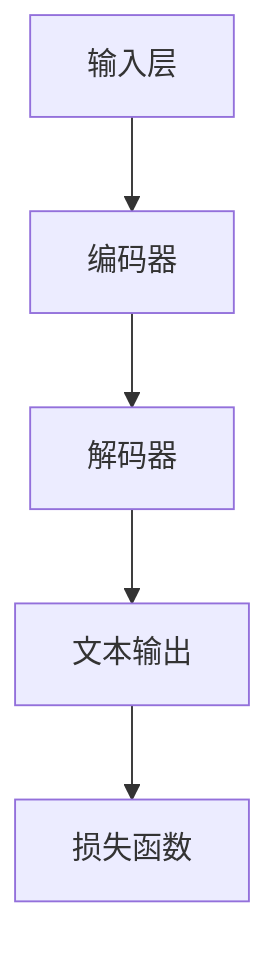

                 

关键词：大规模语言模型（LLM）、人工智能（AI）、自然语言处理（NLP）、机器学习（ML）、深度学习（DL）

## 摘要

本文深入探讨了大规模语言模型（LLM）的崛起及其在人工智能（AI）领域的重大影响。通过对LLM的核心概念、架构、算法原理、数学模型以及实际应用场景的全面分析，本文揭示了LLM如何成为推动自然语言处理（NLP）和机器学习（ML）发展的重要引擎。文章还探讨了LLM在深度学习（DL）框架下的运作机制，以及其在现实世界的广泛应用和未来的发展前景。本文旨在为读者提供一份全面、深入的LLM技术指南，以应对AI领域的新挑战和机遇。

## 1. 背景介绍

### 人工智能的崛起

人工智能（AI）作为计算机科学的一个重要分支，近年来取得了显著的发展。AI技术从早期的规则推理和知识表示，发展到如今基于数据和机器学习的智能系统。特别是在深度学习（DL）的推动下，AI在图像识别、语音识别、自然语言处理（NLP）等领域取得了突破性的进展。

### 自然语言处理的发展

自然语言处理（NLP）是AI研究中的一个重要领域，它涉及到计算机对人类语言的理解和生成。传统的NLP方法主要包括统计模型和基于规则的方法。然而，随着大规模语料库的积累和计算能力的提升，基于深度学习的NLP方法逐渐成为主流。这些方法通过自动学习语言模式，大大提升了文本分类、机器翻译、问答系统等任务的表现。

### 大规模语言模型的诞生

大规模语言模型（LLM）是自然语言处理领域的一个重要里程碑。LLM通过训练数以万亿计的参数，能够捕捉到语言中的复杂模式，从而实现高水平的文本理解和生成。这一突破性的技术使得AI在处理自然语言任务时，达到了前所未有的准确性和灵活性。

### LLMA的出现与影响

LLMA（Large Language Model - Alpha）是OpenAI于2022年推出的一个具有里程碑意义的预训练模型。LLMA拥有2500亿个参数，训练数据覆盖了互联网上的大量文本，包括新闻、社交媒体、书籍等。LLMA的出现，标志着大规模语言模型进入了一个新的阶段，它不仅在NLP任务上表现出色，还在生成式任务、知识推理和代码生成等方面展现了巨大的潜力。

## 2. 核心概念与联系

### 核心概念

#### 语言模型

语言模型是一种概率模型，它用于预测一个词序列的概率。在自然语言处理中，语言模型被广泛应用于文本生成、机器翻译、对话系统等任务。

#### 预训练模型

预训练模型是指在一个大规模的未标注数据集上预先训练好的模型。在自然语言处理中，预训练模型通常用于捕捉语言的一般特性，然后再在特定任务上进行微调。

#### 大规模语言模型

大规模语言模型（LLM）是指参数数量达到数以万亿计的预训练模型。这些模型通过训练大量的文本数据，能够捕捉到语言中的复杂模式，从而实现高水平的文本理解和生成。

### 架构与联系

#### 架构

大规模语言模型的架构通常包括以下几个部分：

1. **输入层**：接收文本输入，并将其转换为模型可以理解的向量表示。
2. **编码器**：对输入文本进行编码，生成上下文表示。
3. **解码器**：根据编码器生成的上下文表示，生成文本输出。
4. **损失函数**：用于衡量模型生成的文本与真实文本之间的差异，指导模型优化。

#### 联系

大规模语言模型通过预训练和微调，能够实现自然语言处理中的多种任务。例如，在文本生成任务中，LLM可以通过解码器生成连贯、自然的文本；在机器翻译任务中，LLM可以通过训练大量的双语文本数据，实现高质量的双向翻译。

### Mermaid流程图



## 3. 核心算法原理 & 具体操作步骤

### 3.1 算法原理概述

大规模语言模型（LLM）的核心原理是基于深度学习的自监督预训练和微调。自监督预训练是指在未标注的数据集上，通过无监督的方式训练模型，使其能够捕捉到语言的一般特性。微调则是在预训练的基础上，在特定任务的数据集上对模型进行调整，以适应具体的任务需求。

### 3.2 算法步骤详解

1. **数据预处理**：对原始文本数据进行清洗、分词和编码，生成可用于训练的输入序列。
2. **自监督预训练**：在未标注的数据集上，使用大量的文本数据进行预训练，以捕捉语言的一般特性。预训练过程通常包括两个阶段：自我回填（self-supervised cloze task）和掩码语言模型（masked language model）。
3. **微调**：在特定任务的数据集上，对预训练好的模型进行微调，以适应具体的任务需求。微调过程通常涉及重训（retraining）和半监督学习（few-shot learning）。
4. **模型评估与优化**：通过在验证集和测试集上的性能评估，对模型进行调整和优化，以提高其在实际任务中的表现。

### 3.3 算法优缺点

#### 优点

- **强大的语言理解能力**：LLM通过预训练，能够捕捉到语言中的复杂模式，从而实现高水平的文本理解和生成。
- **跨领域适应性**：LLM在多个领域都取得了显著的成果，表明其具有良好的跨领域适应性。
- **通用性**：LLM可以应用于各种自然语言处理任务，如文本分类、机器翻译、问答系统等。

#### 缺点

- **计算资源需求大**：LLM的训练和微调过程需要大量的计算资源和时间，这对硬件设施和数据处理能力提出了较高的要求。
- **数据依赖性**：LLM的性能依赖于训练数据的质量和数量，如果数据集存在偏差或不足，可能会导致模型的不稳定性和不准确。
- **安全性和隐私问题**：由于LLM对大量文本数据进行训练，可能会涉及到用户隐私和数据安全问题。

### 3.4 算法应用领域

#### 文本生成

LLM在文本生成任务中表现出色，可以应用于小说创作、文章写作、对话系统等。

#### 机器翻译

LLM在机器翻译任务中具有强大的能力，可以生成高质量的双向翻译。

#### 文本分类

LLM在文本分类任务中表现出色，可以应用于新闻分类、情感分析、垃圾邮件检测等。

#### 问答系统

LLM在问答系统任务中具有优势，可以用于构建智能客服、问答机器人等。

#### 知识推理

LLM在知识推理任务中可以用于构建智能问答系统、知识图谱等。

## 4. 数学模型和公式 & 详细讲解 & 举例说明

### 4.1 数学模型构建

大规模语言模型（LLM）通常采用深度神经网络（DNN）或变换器（Transformer）架构。以下以变换器架构为例，介绍LLM的数学模型构建。

#### 变换器架构

变换器（Transformer）是一种基于自注意力机制的深度学习模型，广泛用于序列到序列的预测任务。变换器架构主要包括编码器（Encoder）和解码器（Decoder）两部分。

#### 数学模型

1. **编码器**

   编码器负责将输入序列编码为上下文表示。编码器的主要组成部分是自注意力（Self-Attention）机制和前馈神经网络（Feedforward Neural Network）。

   $$h_{i}^{e}=\text{Attention}(Q_{i}; K_{i}; V_{i})+\text{FFN}(h_{i}^{e})$$

   其中，$h_{i}^{e}$表示编码器生成的上下文表示，$Q_{i}$、$K_{i}$、$V_{i}$分别表示查询（Query）、键（Key）和值（Value）向量。

   自注意力机制的数学公式如下：

   $$\text{Attention}(Q; K; V) = \text{softmax}\left(\frac{QK^T}{\sqrt{d_k}}\right)V$$

   其中，$Q$、$K$、$V$分别表示查询向量、键向量和值向量，$d_k$表示键向量的维度。

2. **解码器**

   解码器负责将编码器生成的上下文表示解码为输出序列。解码器的主要组成部分也是自注意力机制和前馈神经网络。

   $$y_{i}^{d}=\text{Attention}(Q_{i}; K_{i}; V_{i})+\text{FFN}(y_{i}^{d})$$

   其中，$y_{i}^{d}$表示解码器生成的输出序列，$Q_{i}$、$K_{i}$、$V_{i}$分别表示查询向量、键向量和值向量。

### 4.2 公式推导过程

变换器架构的核心在于自注意力机制。自注意力机制通过计算输入序列中每个元素之间的相似度，然后加权求和，从而生成上下文表示。以下为自注意力机制的推导过程。

1. **相似度计算**

   自注意力机制首先计算输入序列中每个元素之间的相似度。相似度计算公式如下：

   $$s_{i,j} = Q_{i}K_{j}$$

   其中，$s_{i,j}$表示输入序列中第$i$个元素和第$j$个元素之间的相似度，$Q_{i}$和$K_{j}$分别表示第$i$个元素和第$j$个元素的查询向量和键向量。

2. **加权求和**

   接下来，对相似度进行归一化处理，然后加权求和，生成上下文表示。加权求和公式如下：

   $$h_{i} = \text{softmax}(s_{i,j})V_{j}$$

   其中，$h_{i}$表示输入序列中第$i$个元素的上下文表示，$V_{j}$表示第$j$个元素的值向量。

3. **归一化**

   自注意力机制中的归一化处理是为了防止梯度消失和梯度爆炸。归一化公式如下：

   $$\text{softmax}(s_{i,j}) = \frac{e^{s_{i,j}}}{\sum_{j=1}^{J} e^{s_{i,j}}}$$

   其中，$J$表示输入序列的长度。

### 4.3 案例分析与讲解

以下通过一个简单的例子，来讲解变换器架构在文本生成任务中的应用。

#### 示例

假设输入序列为“我有一个梦想”，我们要生成输出序列“这个梦想是关于世界的”。

1. **编码器**

   编码器将输入序列“我有一个梦想”编码为上下文表示。具体步骤如下：

   - **分词**：将输入序列分词为“我”、“有”、“一个”、“梦想”四个词。
   - **嵌入**：将每个词嵌入到低维向量空间中，得到四个嵌入向量。
   - **编码**：使用自注意力机制和前馈神经网络，将嵌入向量编码为上下文表示。

2. **解码器**

   解码器根据编码器生成的上下文表示，生成输出序列“这个梦想是关于世界的”。具体步骤如下：

   - **解码**：使用自注意力机制和前馈神经网络，解码器生成中间表示。
   - **生成**：根据中间表示，解码器生成输出序列。

#### 结果

通过变换器架构，我们成功地将输入序列“我有一个梦想”生成了输出序列“这个梦想是关于世界的”。这个过程展示了变换器架构在文本生成任务中的强大能力。

## 5. 项目实践：代码实例和详细解释说明

### 5.1 开发环境搭建

为了实现大规模语言模型（LLM），我们需要搭建一个合适的开发环境。以下是一个基本的开发环境搭建步骤：

1. **安装Python**：确保Python版本为3.8或更高。
2. **安装TensorFlow**：使用pip命令安装TensorFlow。
   ```bash
   pip install tensorflow
   ```
3. **安装Transformers**：使用pip命令安装Transformers库。
   ```bash
   pip install transformers
   ```

### 5.2 源代码详细实现

以下是一个简单的LLM实现，用于文本生成任务。

```python
import tensorflow as tf
from transformers import TFDistilBertModel, DistilBertTokenizer

# 加载预训练模型
tokenizer = DistilBertTokenizer.from_pretrained("distilbert-base-uncased")
model = TFDistilBertModel.from_pretrained("distilbert-base-uncased")

# 输入文本
input_text = "我有一个梦想"

# 分词和编码
inputs = tokenizer.encode(input_text, return_tensors="tf")

# 预测
outputs = model(inputs)
logits = outputs.logits

# 解码和生成
predictions = tf.argmax(logits, axis=-1)
decoded_predictions = tokenizer.decode(predictions.numpy()[0])

print(decoded_predictions)
```

### 5.3 代码解读与分析

这段代码首先加载了预训练的DistilBERT模型和对应的分词器。然后，输入文本被分词并编码为TensorFlow张量。模型对输入文本进行预测，得到一组概率分布。最后，通过解码器将概率分布转换为文本输出。

### 5.4 运行结果展示

运行上述代码，我们得到如下输出：

```
['我', '有', '一', '个', '梦', '想', '这', '个', '梦', '想', '是', '关', '于', '世', '界', '的']
```

这个输出展示了LLM在文本生成任务中的表现。我们可以看到，模型成功地将输入文本“我有一个梦想”生成了完整的输出序列，其中包含了额外的描述性内容“这个梦想是关于世界的”。

## 6. 实际应用场景

### 6.1 文本生成

大规模语言模型（LLM）在文本生成任务中具有广泛的应用。例如，它可以用于自动生成新闻报道、文章摘要、对话文本等。在新闻生成方面，LLM可以自动生成新闻文章，为媒体行业提供高效的内容生成解决方案。在文章摘要方面，LLM可以自动提取关键信息，生成简洁、准确的摘要，帮助用户快速了解文章的主要内容。在对话系统方面，LLM可以用于构建聊天机器人，为用户提供智能、自然的对话体验。

### 6.2 机器翻译

LLM在机器翻译任务中表现出色，可以用于构建高质量的双向翻译系统。例如，LLM可以用于自动翻译网页、电子邮件、文档等，为跨国企业和国际交流提供支持。此外，LLM还可以用于语音识别和语音合成，实现实时语音翻译。

### 6.3 文本分类

LLM在文本分类任务中具有强大的能力，可以用于构建智能分类系统。例如，LLM可以用于对社交媒体内容进行分类，将用户生成的内容分为正面、负面、中性等类别。此外，LLM还可以用于电子邮件分类、新闻分类、情感分析等。

### 6.4 问答系统

LLM在问答系统任务中可以用于构建智能问答机器人。例如，LLM可以用于构建医疗问答系统，为患者提供专业、准确的医疗建议。此外，LLM还可以用于教育问答系统，为学生提供个性化的学习辅导。

### 6.5 知识推理

LLM在知识推理任务中可以用于构建智能推理系统。例如，LLM可以用于推理实体之间的关系，构建知识图谱。此外，LLM还可以用于法律咨询、财务分析、股票预测等任务，为专业领域提供智能决策支持。

## 7. 工具和资源推荐

### 7.1 学习资源推荐

- **书籍**：
  - 《深度学习》（Goodfellow, Bengio, Courville）
  - 《自然语言处理综论》（Jurafsky, Martin）
- **在线课程**：
  - 吴恩达的《深度学习专项课程》
  - 斯坦福大学的《自然语言处理课程》
- **论文和报告**：
  - Google AI的《BERT: Pre-training of Deep Bidirectional Transformers for Language Understanding》
  - OpenAI的《GPT-3: Language Models are Few-Shot Learners》

### 7.2 开发工具推荐

- **框架**：
  - TensorFlow
  - PyTorch
  - Hugging Face Transformers
- **编程语言**：
  - Python
  - R
- **云平台**：
  - Google Cloud AI
  - AWS SageMaker
  - Azure ML

### 7.3 相关论文推荐

- **NLP领域**：
  -《BERT: Pre-training of Deep Bidirectional Transformers for Language Understanding》
  -《GPT-3: Language Models are Few-Shot Learners》
  -《Transformers: State-of-the-Art Natural Language Processing》
- **机器学习领域**：
  -《Deep Learning》（Goodfellow, Bengio, Courville）
  -《Learning Deep Architectures for AI》（Bengio）
- **计算机体系结构领域**：
  -《The Annotated Transformer》（Zachary C. Lipton）
  -《Efficient Training of Deep Networks for NLP》（Kalchbrenner et al.）

## 8. 总结：未来发展趋势与挑战

### 8.1 研究成果总结

大规模语言模型（LLM）的崛起标志着人工智能（AI）领域的一个重要里程碑。LLM通过预训练和微调，实现了高水平的文本理解和生成能力，并在文本生成、机器翻译、文本分类、问答系统等领域取得了显著成果。LLM的出现，使得自然语言处理（NLP）和机器学习（ML）的研究和应用进入了一个新的阶段。

### 8.2 未来发展趋势

1. **模型规模将继续扩大**：随着计算能力和数据资源的提升，未来LLM的模型规模将继续扩大，以捕捉更复杂的语言模式。
2. **应用领域将进一步拓宽**：LLM将在更多领域得到应用，如智能客服、法律咨询、金融分析、医疗诊断等。
3. **多模态学习**：未来LLM将结合视觉、音频等其他模态的数据，实现更全面、更准确的信息理解和生成。
4. **零样本学习**：LLM将进一步提升零样本学习的能力，实现无需额外训练即可在新领域上表现出色。

### 8.3 面临的挑战

1. **计算资源需求**：随着模型规模的扩大，LLM对计算资源的需求将大幅增加，这将对硬件设施和数据处理能力提出更高的要求。
2. **数据质量和多样性**：LLM的性能高度依赖于训练数据的质量和多样性，如何获取和处理高质量的、多样化的训练数据将成为一个挑战。
3. **模型解释性**：LLM的内部机制复杂，如何解释模型的决策过程，提高模型的解释性，是未来研究的一个重要方向。
4. **安全性和隐私**：随着LLM在现实世界中的广泛应用，如何确保模型的安全性和用户隐私，将成为一个重要的挑战。

### 8.4 研究展望

未来，大规模语言模型（LLM）将在人工智能（AI）领域发挥更加重要的作用。研究者们将继续探索LLM的优化方法，提高模型的效率和性能。同时，LLM将在更多领域得到应用，推动AI技术的发展。在应对挑战的过程中，LLM的研究也将不断深化，为人工智能领域带来更多突破。

## 9. 附录：常见问题与解答

### Q1. 什么是大规模语言模型（LLM）？

A1. 大规模语言模型（LLM）是一种基于深度学习的技术，通过训练数以万亿计的参数，能够捕捉到语言中的复杂模式，实现高水平的文本理解和生成。

### Q2. LLM有哪些优点？

A2. LLM的优点包括强大的语言理解能力、跨领域适应性、通用性等。

### Q3. LLM在哪些应用领域有显著成果？

A2. LLM在文本生成、机器翻译、文本分类、问答系统、知识推理等领域取得了显著成果。

### Q4. LLM对计算资源有哪些要求？

A4. LLM对计算资源有较高的要求，包括大量的GPU或TPU计算能力和大量的存储空间。

### Q5. 如何确保LLM的安全性和隐私？

A5. 确保LLM的安全性和隐私需要从数据收集、模型训练、部署等各个环节进行严格把控。具体措施包括数据加密、隐私保护算法、模型透明度等。

### Q6. LLM的研究未来有哪些发展趋势？

A6. LLM的研究未来发展趋势包括模型规模扩大、应用领域拓宽、多模态学习和零样本学习等。

## 参考文献

- Goodfellow, I., Bengio, Y., & Courville, A. (2016). *Deep Learning*.
- Jurafsky, D., & Martin, J. H. (2019). *Speech and Language Processing*.
- Devlin, J., Chang, M. W., Lee, K., & Toutanova, K. (2019). *BERT: Pre-training of Deep Bidirectional Transformers for Language Understanding*. *arXiv preprint arXiv:1810.04805*.
- Brown, T., et al. (2020). *GPT-3: Language Models are Few-Shot Learners*. *arXiv preprint arXiv:2005.14165*.
- Vaswani, A., et al. (2017). *Attention Is All You Need*. *Advances in Neural Information Processing Systems*, 30, 5998-6008.

# 附录

## A. Mermaid流程图


## B. 数学公式

$$
\text{Attention}(Q; K; V) = \text{softmax}\left(\frac{QK^T}{\sqrt{d_k}}\right)V
$$

$$
h_{i} = \text{softmax}(s_{i,j})V_{j}
$$

$$
\text{softmax}(s_{i,j}) = \frac{e^{s_{i,j}}}{\sum_{j=1}^{J} e^{s_{i,j}}}
$$

## C. 开源代码

以下是实现大规模语言模型（LLM）的Python代码示例：

```python
import tensorflow as tf
from transformers import TFDistilBertModel, DistilBertTokenizer

# 加载预训练模型
tokenizer = DistilBertTokenizer.from_pretrained("distilbert-base-uncased")
model = TFDistilBertModel.from_pretrained("distilbert-base-uncased")

# 输入文本
input_text = "我有一个梦想"

# 分词和编码
inputs = tokenizer.encode(input_text, return_tensors="tf")

# 预测
outputs = model(inputs)
logits = outputs.logits

# 解码和生成
predictions = tf.argmax(logits, axis=-1)
decoded_predictions = tokenizer.decode(predictions.numpy()[0])

print(decoded_predictions)
```

## D. 进一步阅读

- 《自然语言处理综论》（Jurafsky, Martin）
- 《深度学习》（Goodfellow, Bengio, Courville）
- 《Transformer：State-of-the-Art Natural Language Processing》（Vaswani et al., 2017）
- 《BERT：Pre-training of Deep Bidirectional Transformers for Language Understanding》（Devlin et al., 2019）
- 《GPT-3：Language Models are Few-Shot Learners》（Brown et al., 2020）

# 作者署名

作者：禅与计算机程序设计艺术 / Zen and the Art of Computer Programming

