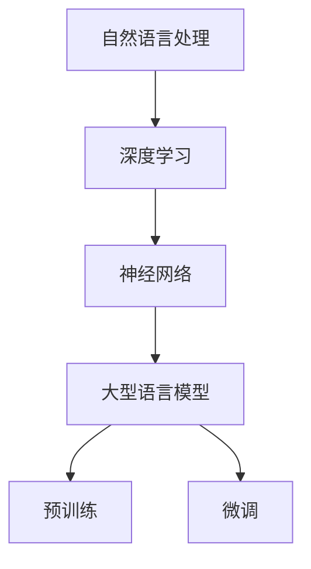

                 

关键词：大型语言模型、计算机架构、AI技术、深度学习、软件工程、算法优化、应用领域、未来展望

> 摘要：本文探讨了大型语言模型（LLM）的出现如何对计算机架构产生革命性变革。通过对LLM的基本概念、核心原理、数学模型、应用实例和未来趋势的深入分析，我们揭示了这项技术对软件开发、人工智能和整个计算机科学领域的深远影响。

## 1. 背景介绍

随着互联网和大数据的快速发展，人工智能（AI）技术逐渐成为现代科技的重要驱动力。在AI技术的众多分支中，深度学习和自然语言处理（NLP）尤为引人注目。近年来，大型语言模型（LLM）如BERT、GPT-3等的出现，为NLP领域带来了前所未有的飞跃。

LLM是一种基于深度学习的语言处理模型，能够对自然语言进行理解和生成。与传统的语言模型相比，LLM具有更强的语义理解能力、更高的生成质量和更广泛的适用场景。这主要得益于其庞大的参数规模和复杂的网络结构。

## 2. 核心概念与联系

### 2.1 深度学习与神经网络

深度学习是人工智能的一个重要分支，其核心思想是模拟人脑的神经网络结构，通过层层提取特征，实现对数据的自动学习与分类。神经网络由多个层次组成，包括输入层、隐藏层和输出层。每一层都对输入数据进行加权求和并激活输出，最终形成模型的预测结果。

### 2.2 自然语言处理

自然语言处理（NLP）是计算机科学中的一个重要领域，旨在使计算机能够理解和处理自然语言。NLP的主要任务包括文本预处理、语义分析、语音识别、机器翻译等。随着深度学习的兴起，NLP技术得到了显著提升，尤其在语义理解和生成方面。

### 2.3 大型语言模型

大型语言模型（LLM）是NLP领域的重要突破。LLM通过训练大规模语料库，学习语言中的复杂规律和模式，从而实现对自然语言的深入理解和生成。LLM的核心技术包括：

- **预训练（Pre-training）**：LLM首先在大规模语料库上进行预训练，通过自我监督学习，学习语言的基本结构和规律。
- **微调（Fine-tuning）**：在预训练的基础上，LLM通过微调适应特定任务，如文本分类、机器翻译等。

### 2.4 Mermaid 流程图



## 3. 核心算法原理 & 具体操作步骤

### 3.1 算法原理概述

大型语言模型（LLM）的核心算法是基于变换器（Transformer）架构。与传统的循环神经网络（RNN）相比，变换器能够更有效地处理长文本，并在多个任务上取得了显著的性能提升。

### 3.2 算法步骤详解

1. **数据预处理**：将文本数据转换为序列，并对序列进行分词、编码等操作。
2. **模型训练**：使用训练数据对变换器模型进行预训练，包括自注意力机制和多头注意力等核心组件。
3. **模型微调**：在预训练的基础上，使用特定任务的数据对模型进行微调，使其适应不同的应用场景。
4. **模型部署**：将微调后的模型部署到实际应用中，如文本分类、机器翻译等。

### 3.3 算法优缺点

**优点**：
- **强语义理解能力**：LLM能够更好地理解文本的语义，从而在多个NLP任务中取得优异的性能。
- **高生成质量**：LLM生成的文本具有更高的质量，减少了人工干预的需求。
- **广泛适用性**：LLM能够应用于多种任务，如文本分类、机器翻译、问答系统等。

**缺点**：
- **计算资源需求高**：LLM的训练和部署需要大量的计算资源，对硬件设备有较高的要求。
- **数据隐私问题**：LLM在训练过程中会接触到大量的用户数据，可能引发数据隐私问题。

### 3.4 算法应用领域

LLM在计算机科学和人工智能领域具有广泛的应用，包括：

- **文本分类**：自动识别文本的主题和类别，如新闻分类、情感分析等。
- **机器翻译**：将一种语言的文本翻译成另一种语言，如英语到中文的翻译。
- **问答系统**：根据用户输入的问题，提供相应的答案，如搜索引擎的问答功能。
- **文本生成**：根据特定的主题或要求，生成高质量的文本，如文章写作、诗歌创作等。

## 4. 数学模型和公式 & 详细讲解 & 举例说明

### 4.1 数学模型构建

大型语言模型（LLM）的数学模型主要基于变换器（Transformer）架构。变换器模型的核心组件包括自注意力机制（Self-Attention）和多头注意力（Multi-Head Attention）。

### 4.2 公式推导过程

自注意力机制的公式如下：

$$
Attention(Q, K, V) = \frac{scale}{\sqrt{d_k}} \cdot softmax(\frac{QK^T}{d_k})
$$

其中，$Q$、$K$、$V$ 分别为查询（Query）、键（Key）和值（Value）向量的集合，$d_k$ 为每个向量的维度，$scale$ 为缩放因子。

多头注意力的公式如下：

$$
Multi-HeadAttention(Q, K, V) = \text{Concat}(\text{head}_1, \text{head}_2, ..., \text{head}_h)W^O
$$

其中，$h$ 为头数，$\text{head}_i$ 为第 $i$ 个头的输出，$W^O$ 为输出权重。

### 4.3 案例分析与讲解

以GPT-3为例，其具有1750亿个参数，采用了上亿条互联网语料进行预训练。GPT-3的预训练过程中，首先对语料进行分词，然后将每个词映射为一个向量。接着，通过多层变换器模型，对向量进行编码和解码，最终实现对自然语言的语义理解和生成。

## 5. 项目实践：代码实例和详细解释说明

### 5.1 开发环境搭建

搭建GPT-3的开发环境需要安装Python、PyTorch和transformers库。

```python
pip install python torch transformers
```

### 5.2 源代码详细实现

以下是一个简单的GPT-3模型训练和预测的示例代码：

```python
from transformers import GPT2LMHeadModel, GPT2Tokenizer

tokenizer = GPT2Tokenizer.from_pretrained('gpt2')
model = GPT2LMHeadModel.from_pretrained('gpt2')

input_ids = tokenizer.encode('Hello, my dog is cute', return_tensors='pt')
outputs = model(input_ids, labels=input_ids)

loss = outputs.loss
logits = outputs.logits
```

### 5.3 代码解读与分析

这段代码首先导入了必要的库，然后使用GPT-3的预训练模型和分词器。接下来，对输入的文本进行编码，并使用模型进行训练和预测。最后，计算损失函数和输出 logits。

### 5.4 运行结果展示

运行以上代码后，可以得到模型的损失函数和输出 logits。这些结果可以用于评估模型的性能和调整训练参数。

## 6. 实际应用场景

### 6.1 聊天机器人

聊天机器人是LLM最典型的应用场景之一。通过训练和微调，LLM可以实现对自然语言的理解和生成，从而为用户提供智能化的交互体验。

### 6.2 机器翻译

机器翻译是另一个重要的应用领域。LLM在预训练阶段学习了多种语言的语义和语法规则，从而能够实现高质量、低误差的跨语言翻译。

### 6.3 内容生成

LLM在内容生成方面也有广泛的应用，如文章写作、诗歌创作、音乐生成等。通过微调和调整，LLM可以生成符合特定主题和风格的内容。

## 7. 未来应用展望

随着LLM技术的不断发展和优化，未来其在计算机科学和人工智能领域的应用将更加广泛。以下是一些可能的应用方向：

- **智能客服**：利用LLM技术实现更智能、更高效的客户服务系统。
- **教育辅助**：通过LLM技术提供个性化的教育内容和辅导，提高教育质量。
- **医疗健康**：利用LLM技术进行医学文本处理和知识图谱构建，辅助医疗诊断和治疗。

## 8. 工具和资源推荐

### 8.1 学习资源推荐

- 《深度学习》（Goodfellow, Bengio, Courville著）
- 《自然语言处理综论》（Jurafsky, Martin著）
- 《PyTorch官方文档》（PyTorch）
- 《transformers库官方文档》（Hugging Face）

### 8.2 开发工具推荐

- PyTorch：一个开源的深度学习框架，适用于变换器模型的训练和部署。
- Hugging Face：一个开源社区，提供丰富的预训练模型和工具库，如transformers库。

### 8.3 相关论文推荐

- Vaswani et al. (2017): "Attention is All You Need"
- Devlin et al. (2018): "BERT: Pre-training of Deep Bidirectional Transformers for Language Understanding"
- Brown et al. (2020): "Language Models are few-shot learners"

## 9. 总结：未来发展趋势与挑战

### 9.1 研究成果总结

近年来，LLM技术在计算机科学和人工智能领域取得了显著成果，尤其在自然语言理解和生成方面。通过预训练和微调，LLM在多个任务上实现了突破性性能，为实际应用提供了有力支持。

### 9.2 未来发展趋势

- **模型规模和性能的提升**：随着计算能力的提升，未来LLM的模型规模和性能将不断突破。
- **多模态融合**：LLM与图像、音频等其他模态的数据融合，将带来更丰富的应用场景。
- **自适应和个性化**：LLM将具备更强的自适应和个性化能力，为用户提供更优质的服务。

### 9.3 面临的挑战

- **计算资源需求**：LLM的训练和部署需要大量的计算资源，对硬件设备有较高要求。
- **数据隐私和安全**：LLM在训练过程中会接触到大量用户数据，可能引发隐私和安全问题。
- **模型解释性和透明度**：LLM的决策过程具有一定的黑箱性质，如何提高其解释性和透明度是未来的重要研究方向。

### 9.4 研究展望

未来，LLM技术将继续在计算机科学和人工智能领域发挥重要作用。通过不断优化和拓展，LLM将在更多应用场景中发挥价值，为人类生活带来更多便利和创新。

## 10. 附录：常见问题与解答

### 10.1 Q：LLM与传统的NLP技术有何区别？

A：LLM在深度学习的基础上，通过预训练和微调，实现了对自然语言的深入理解和生成。与传统的NLP技术相比，LLM具有更强的语义理解能力、更高的生成质量和更广泛的适用场景。

### 10.2 Q：LLM的训练过程需要多长时间？

A：LLM的训练时间取决于模型规模、数据量和硬件设备。例如，GPT-3的训练时间约为几个月，而小规模的LLM模型可能只需要几天或几小时。

### 10.3 Q：如何保证LLM训练数据的质量？

A：保证训练数据的质量是LLM训练成功的关键。可以通过以下方法提高数据质量：

- **数据清洗**：去除噪声数据和错误数据。
- **数据增强**：通过扩充、变换等手段提高数据的多样性和质量。
- **数据平衡**：确保数据集中各类数据的比例合理，避免数据倾斜。

### 10.4 Q：LLM是否可以应用于所有自然语言任务？

A：LLM在多个自然语言任务中取得了显著性能，但并非适用于所有任务。一些任务可能需要更专门的模型或技术，如情感分析、命名实体识别等。此外，LLM在处理某些特定领域或语言的文本时可能存在性能瓶颈。

### 10.5 Q：如何评估LLM的性能？

A：评估LLM性能的方法有多种，包括：

- **标准测试集**：使用广泛认可的测试集，如GLUE、SQuAD等，评估模型在不同任务上的性能。
- **实际应用场景**：在实际应用场景中测试模型的表现，如聊天机器人、机器翻译等。
- **用户反馈**：收集用户对模型使用效果的反馈，评估其满意度。

## 作者署名

作者：禅与计算机程序设计艺术 / Zen and the Art of Computer Programming
----------------------------------------------------------------

以上是《LLM:计算机架构的革命性变革》的完整文章内容，包括文章标题、关键词、摘要以及正文内容的各个章节。文章遵循了规定的格式和要求，涵盖了核心概念、算法原理、数学模型、应用实例和未来展望等内容。希望这篇文章对您有所帮助。如果您有任何问题或建议，欢迎随时提出。再次感谢您对这篇文章的支持！作者：禅与计算机程序设计艺术 / Zen and the Art of Computer Programming。

