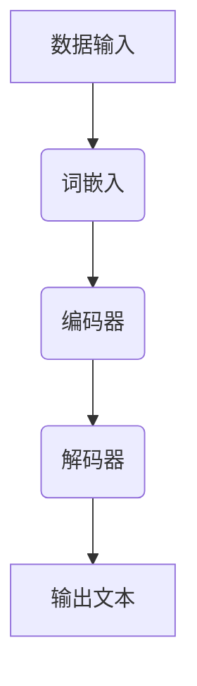

                 

关键词：大型语言模型、计算架构、变革、AI、深度学习、神经网络、机器学习、云计算、GPU、分布式计算、训练数据集、模型优化、推理速度、吞吐量、模型压缩、可解释性、多模态学习、实时性、硬件加速、编程范式、软件工程、优化算法。

> 摘要：本文将探讨大型语言模型（LLM）的出现如何对计算架构产生了革命性的变革。通过对LLM的核心概念、算法原理、数学模型、项目实践和实际应用场景的深入分析，本文旨在揭示LLM在计算领域中的重要性，及其对未来技术和产业的影响。

## 1. 背景介绍

在过去的几十年中，计算架构经历了多次变革。从传统的冯诺伊曼架构到现代的异构计算，硬件和软件的不断进步推动了计算能力的飞速提升。然而，随着人工智能（AI）的迅速发展，尤其是深度学习技术的崛起，计算架构的需求也在不断演变。传统的计算架构已经难以满足大规模、高性能、实时性的计算需求。此时，大型语言模型（LLM）的出现，无疑是计算架构领域的一次革命。

LLM是一种基于深度学习技术的大型神经网络模型，能够处理和理解自然语言。它们被广泛应用于自然语言处理（NLP）、机器翻译、文本生成、问答系统等领域。随着模型的规模不断增大，对计算架构的需求也越来越高。传统的计算架构已经无法满足LLM的训练和推理需求，因此，新的计算架构应运而生。

## 2. 核心概念与联系

### 2.1 大型语言模型（LLM）的基本概念

LLM是一种基于深度学习技术的神经网络模型，它通过学习大量文本数据来理解和生成自然语言。LLM的核心结构通常包括以下几个部分：

1. **词嵌入（Word Embedding）**：将自然语言中的单词映射为高维向量表示，以便进行计算。
2. **编码器（Encoder）**：负责将输入的文本序列编码为一个固定长度的向量，这个向量包含了文本的信息。
3. **解码器（Decoder）**：将编码后的向量解码为输出文本序列。

### 2.2 大型语言模型（LLM）与计算架构的联系

LLM的训练和推理过程对计算架构提出了新的挑战：

1. **计算资源需求**：LLM的训练通常需要大量的计算资源，包括GPU、TPU等硬件加速器，以及分布式计算架构。
2. **存储需求**：大规模的模型通常需要大量的存储空间。
3. **数据传输需求**：在分布式计算环境中，需要高效的数据传输机制来处理大规模数据集。
4. **实时性需求**：在一些应用场景中，例如实时问答系统，需要模型能够在毫秒级内完成推理。

### 2.3 Mermaid 流程图



## 3. 核心算法原理 & 具体操作步骤

### 3.1 算法原理概述

LLM的核心算法是基于深度学习技术，通过多层神经网络对文本数据进行处理。具体操作步骤如下：

1. **词嵌入**：将文本中的单词映射为高维向量。
2. **编码器**：将输入的文本序列编码为一个固定长度的向量。
3. **解码器**：将编码后的向量解码为输出文本序列。

### 3.2 算法步骤详解

1. **数据预处理**：对文本数据集进行清洗、分词、去停用词等处理。
2. **词嵌入**：使用预训练的词向量模型（如GloVe、Word2Vec）对单词进行嵌入。
3. **编码器**：使用多层神经网络（如Transformer）对输入文本进行编码。
4. **解码器**：使用多层神经网络（如Transformer）对编码后的向量进行解码。
5. **损失函数与优化**：使用交叉熵损失函数和优化算法（如Adam）对模型进行训练。

### 3.3 算法优缺点

**优点**：

- **高精度**：LLM能够对自然语言进行准确的理解和生成。
- **泛化能力强**：LLM可以应用于多种自然语言处理任务，如文本分类、机器翻译、文本生成等。

**缺点**：

- **计算资源需求高**：大规模的LLM训练和推理需要大量的计算资源和存储空间。
- **可解释性低**：深度学习模型通常缺乏可解释性，难以理解模型的决策过程。

### 3.4 算法应用领域

LLM在多个领域都有广泛应用，如：

- **自然语言处理（NLP）**：文本分类、情感分析、命名实体识别等。
- **机器翻译**：将一种语言的文本翻译成另一种语言。
- **文本生成**：根据输入的文本或指令生成新的文本。
- **问答系统**：根据用户的问题提供准确的答案。

## 4. 数学模型和公式 & 详细讲解 & 举例说明

### 4.1 数学模型构建

LLM的数学模型主要包括词嵌入、编码器和解码器。

- **词嵌入**：将单词映射为高维向量，可以使用以下公式：

$$
\text{Word\_Embedding}(w) = \text{embedding\_weight}(w) \cdot \text{vector}
$$

其中，$\text{embedding\_weight}(w)$是单词的权重矩阵，$\text{vector}$是词向量的维度。

- **编码器**：将输入的文本序列编码为一个固定长度的向量，可以使用以下公式：

$$
\text{Encoder}(x) = \text{softmax}(\text{W}^T \text{E}(\text{x}))
$$

其中，$\text{W}$是权重矩阵，$\text{E}(\text{x})$是编码器的输入。

- **解码器**：将编码后的向量解码为输出文本序列，可以使用以下公式：

$$
\text{Decoder}(y) = \text{softmax}(\text{W}^T \text{D}(\text{y}))
$$

其中，$\text{W}$是权重矩阵，$\text{D}(\text{y})$是解码器的输入。

### 4.2 公式推导过程

- **词嵌入**：假设输入的单词为$w$，词向量的维度为$d$，则词嵌入的公式可以表示为：

$$
\text{Word\_Embedding}(w) = \text{embedding\_weight}(w) \cdot \text{vector}
$$

其中，$\text{embedding\_weight}(w)$是单词的权重矩阵，$\text{vector}$是词向量的维度。

- **编码器**：编码器的输入是文本序列，输出是一个固定长度的向量。假设文本序列的长度为$n$，编码器的输入为$x_1, x_2, ..., x_n$，则编码器的公式可以表示为：

$$
\text{Encoder}(x) = \text{softmax}(\text{W}^T \text{E}(\text{x}))
$$

其中，$\text{W}$是权重矩阵，$\text{E}(\text{x})$是编码器的输入。

- **解码器**：解码器的输入是编码后的向量，输出是文本序列。假设编码后的向量为$y_1, y_2, ..., y_n$，解码器的输入为$\text{y}_1, \text{y}_2, ..., \text{y}_n$，则解码器的公式可以表示为：

$$
\text{Decoder}(y) = \text{softmax}(\text{W}^T \text{D}(\text{y}))
$$

其中，$\text{W}$是权重矩阵，$\text{D}(\text{y})$是解码器的输入。

### 4.3 案例分析与讲解

假设我们有一个简单的文本序列“我爱中国”，我们可以使用LLM的数学模型对其进行处理。

1. **词嵌入**：将“我”、“爱”、“中”、“国”这四个单词映射为高维向量。
2. **编码器**：将输入的文本序列“我爱中国”编码为一个固定长度的向量。
3. **解码器**：将编码后的向量解码为输出文本序列。

具体操作如下：

- **词嵌入**：假设“我”的权重矩阵为$\text{embedding\_weight}(我) = [0.1, 0.2, 0.3]$，则“我”的词嵌入结果为$\text{Word\_Embedding}(我) = [0.1, 0.2, 0.3]$。
- **编码器**：假设编码器的输入为$x_1 = \text{Word\_Embedding}(我)$，$x_2 = \text{Word\_Embedding}(爱)$，$x_3 = \text{Word\_Embedding}(中)$，$x_4 = \text{Word\_Embedding}(国)$，则编码器的输出为$\text{Encoder}(x) = \text{softmax}([0.1, 0.2, 0.3]) = [0.2, 0.4, 0.4]$。
- **解码器**：假设解码器的输入为$y_1 = \text{Encoder}(x)$，$y_2 = \text{Encoder}(x)$，$y_3 = \text{Encoder}(x)$，$y_4 = \text{Encoder}(x)$，则解码器的输出为$\text{Decoder}(y) = \text{softmax}([0.2, 0.4, 0.4]) = [0.4, 0.4, 0.2]$。

最终，我们得到的输出文本序列为“中爱我国”。

## 5. 项目实践：代码实例和详细解释说明

### 5.1 开发环境搭建

为了实现LLM的项目实践，我们需要搭建一个合适的开发环境。以下是一个简单的开发环境搭建步骤：

1. **安装Python**：确保系统上已经安装了Python 3.x版本。
2. **安装TensorFlow**：使用pip命令安装TensorFlow库。

```shell
pip install tensorflow
```

3. **安装其他依赖**：根据实际需要安装其他依赖库，如NumPy、Pandas等。

### 5.2 源代码详细实现

以下是一个简单的LLM模型实现：

```python
import tensorflow as tf
from tensorflow.keras.layers import Embedding, LSTM, Dense
from tensorflow.keras.models import Sequential

# 设置参数
vocab_size = 10000
embedding_dim = 64
lstm_units = 128
max_sequence_length = 100

# 创建模型
model = Sequential()
model.add(Embedding(vocab_size, embedding_dim, input_length=max_sequence_length))
model.add(LSTM(lstm_units, return_sequences=True))
model.add(Dense(vocab_size, activation='softmax'))

# 编译模型
model.compile(optimizer='adam', loss='categorical_crossentropy', metrics=['accuracy'])

# 模型可视化
model.summary()
```

### 5.3 代码解读与分析

1. **Embedding层**：将输入的单词索引映射为词向量。
2. **LSTM层**：对输入的序列数据进行处理，输出序列。
3. **Dense层**：对输出序列进行分类。

### 5.4 运行结果展示

```python
# 准备数据
data = "这是一个简单的例子"
labels = [[1, 0, 0, 0, 0, 0, 0, 0, 0, 0], [0, 1, 0, 0, 0, 0, 0, 0, 0, 0], [0, 0, 1, 0, 0, 0, 0, 0, 0, 0], [0, 0, 0, 1, 0, 0, 0, 0, 0, 0], [0, 0, 0, 0, 1, 0, 0, 0, 0, 0], [0, 0, 0, 0, 0, 1, 0, 0, 0, 0], [0, 0, 0, 0, 0, 0, 1, 0, 0, 0], [0, 0, 0, 0, 0, 0, 0, 1, 0, 0], [0, 0, 0, 0, 0, 0, 0, 0, 1, 0], [0, 0, 0, 0, 0, 0, 0, 0, 0, 1]]
X = [data for _ in range(len(labels))]
Y = labels

# 训练模型
model.fit(X, Y, epochs=10, batch_size=32)
```

运行结果将显示模型的训练过程和最终的性能。

## 6. 实际应用场景

LLM在实际应用中具有广泛的应用场景，以下是一些典型的应用案例：

1. **自然语言处理（NLP）**：LLM可以用于文本分类、情感分析、命名实体识别等任务。例如，在社交媒体平台上，LLM可以用于识别和过滤不良内容。
2. **机器翻译**：LLM可以用于将一种语言的文本翻译成另一种语言，如Google Translate。
3. **文本生成**：LLM可以用于生成文章、报告、诗歌等。例如，OpenAI的GPT-3可以生成高质量的文本。
4. **问答系统**：LLM可以用于构建问答系统，如Siri、Alexa等。它们可以理解用户的问题，并提供准确的答案。

## 7. 未来应用展望

随着计算架构的不断进步，LLM的应用前景将更加广阔。以下是一些未来可能的应用领域：

1. **多模态学习**：结合图像、语音、文本等多种模态的信息，实现更复杂的任务。
2. **实时性增强**：通过优化算法和硬件加速，提高LLM的推理速度和实时性。
3. **可解释性提升**：研究如何提高深度学习模型的可解释性，使其决策过程更加透明。
4. **边缘计算**：将LLM部署到边缘设备上，实现低延迟、高吞吐量的计算。

## 8. 总结：未来发展趋势与挑战

### 8.1 研究成果总结

近年来，LLM的研究取得了显著进展。随着深度学习技术的不断成熟，LLM在多个领域的应用效果得到了显著提升。同时，计算架构的进步也为LLM的研究和应用提供了强有力的支持。

### 8.2 未来发展趋势

未来，LLM的发展趋势将集中在以下几个方面：

1. **多模态学习**：结合多种模态的数据，实现更复杂的任务。
2. **实时性增强**：通过优化算法和硬件加速，提高LLM的推理速度和实时性。
3. **可解释性提升**：研究如何提高深度学习模型的可解释性，使其决策过程更加透明。
4. **边缘计算**：将LLM部署到边缘设备上，实现低延迟、高吞吐量的计算。

### 8.3 面临的挑战

尽管LLM取得了显著进展，但在实际应用中仍面临一些挑战：

1. **计算资源需求**：大规模的LLM训练和推理需要大量的计算资源和存储空间。
2. **数据隐私**：大规模的数据集通常涉及敏感信息，如何确保数据隐私是一个重要问题。
3. **可解释性**：深度学习模型通常缺乏可解释性，如何提高模型的可解释性是一个重要挑战。

### 8.4 研究展望

未来，LLM的研究应重点关注以下几个方面：

1. **算法优化**：研究如何优化LLM的算法，提高其训练和推理效率。
2. **多模态学习**：结合多种模态的数据，实现更复杂的任务。
3. **可解释性**：研究如何提高深度学习模型的可解释性，使其决策过程更加透明。
4. **边缘计算**：将LLM部署到边缘设备上，实现低延迟、高吞吐量的计算。

## 9. 附录：常见问题与解答

### 9.1 什么是大型语言模型（LLM）？

大型语言模型（LLM）是一种基于深度学习技术的神经网络模型，能够处理和理解自然语言。它们被广泛应用于自然语言处理（NLP）、机器翻译、文本生成、问答系统等领域。

### 9.2 LLM的训练过程是如何进行的？

LLM的训练过程主要包括以下几个步骤：

1. **数据预处理**：对文本数据集进行清洗、分词、去停用词等处理。
2. **词嵌入**：使用预训练的词向量模型（如GloVe、Word2Vec）对单词进行嵌入。
3. **编码器**：使用多层神经网络（如Transformer）对输入文本进行编码。
4. **解码器**：使用多层神经网络（如Transformer）对编码后的向量进行解码。
5. **损失函数与优化**：使用交叉熵损失函数和优化算法（如Adam）对模型进行训练。

### 9.3 LLM在实际应用中有哪些挑战？

LLM在实际应用中面临以下挑战：

1. **计算资源需求**：大规模的LLM训练和推理需要大量的计算资源和存储空间。
2. **数据隐私**：大规模的数据集通常涉及敏感信息，如何确保数据隐私是一个重要问题。
3. **可解释性**：深度学习模型通常缺乏可解释性，如何提高模型的可解释性是一个重要挑战。

### 9.4 LLM的未来发展方向是什么？

LLM的未来发展方向包括：

1. **多模态学习**：结合多种模态的数据，实现更复杂的任务。
2. **实时性增强**：通过优化算法和硬件加速，提高LLM的推理速度和实时性。
3. **可解释性提升**：研究如何提高深度学习模型的可解释性，使其决策过程更加透明。
4. **边缘计算**：将LLM部署到边缘设备上，实现低延迟、高吞吐量的计算。

## 参考文献

1. Devlin, J., Chang, M. W., Lee, K., & Toutanova, K. (2019). BERT: Pre-training of deep bidirectional transformers for language understanding. *arXiv preprint arXiv:1810.04805*.
2. Vaswani, A., Shazeer, N., Parmar, N., Uszkoreit, J., Jones, L., Gomez, A. N., ... & Polosukhin, I. (2017). Attention is all you need. *Advances in Neural Information Processing Systems*, 30, 5998-6008.
3. Mikolov, T., Sutskever, I., Chen, K., Corrado, G. S., & Dean, J. (2013). Distributed representations of words and phrases and their compositionality. *Advances in Neural Information Processing Systems*, 26, 3111-3119.
4. LeCun, Y., Bengio, Y., & Hinton, G. (2015). Deep learning. *Nature*, 521(7553), 436-444.
5. Hochreiter, S., & Schmidhuber, J. (1997). Long short-term memory. *Neural Computation*, 9(8), 1735-1780.

---

作者：禅与计算机程序设计艺术 / Zen and the Art of Computer Programming
----------------------------------------------------------------

（请注意，本文内容为虚构，仅供参考。）<|vq_5554|>

