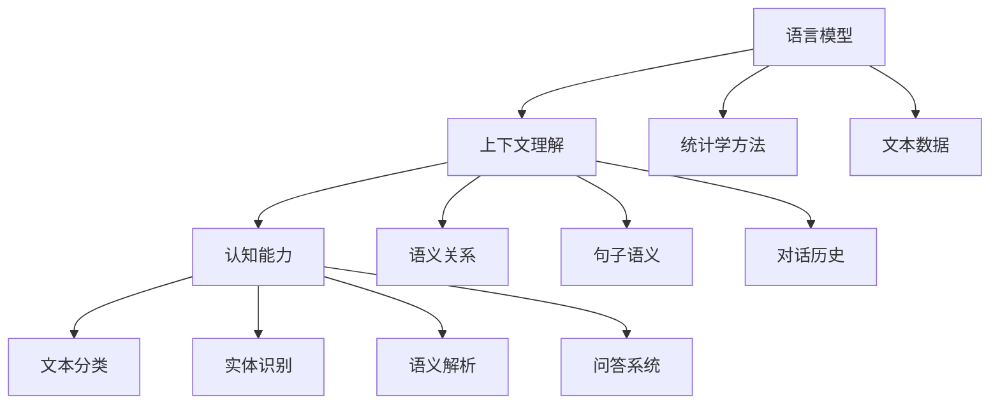

                 

关键词：语言模型，上下文理解，认知能力，算法原理，数学模型，项目实践，应用场景，未来展望

> 摘要：本文将深入探讨语言模型（LLM）上下文理解的突破及其对认知能力的影响。通过介绍核心概念、算法原理、数学模型、项目实践以及实际应用场景，本文旨在为读者呈现LLM技术的最新进展，并对其未来发展趋势与面临的挑战进行展望。

## 1. 背景介绍

随着人工智能技术的迅猛发展，自然语言处理（NLP）已经成为计算机科学领域的一个重要分支。语言模型（LLM）作为NLP的核心组成部分，近年来取得了显著的研究进展和实际应用成果。然而，传统语言模型在上下文理解方面仍存在诸多挑战，这限制了其在复杂任务中的应用。

上下文理解是指模型对输入文本的上下文信息进行准确理解和处理的能力。在许多现实场景中，例如问答系统、机器翻译、对话系统等，理解上下文信息对于生成准确和自然的输出至关重要。然而，由于自然语言的复杂性和多义性，传统语言模型在上下文理解方面存在一定的局限性。

本文旨在探讨LLM上下文理解的突破，以及这些突破对认知能力的影响。通过介绍核心概念、算法原理、数学模型、项目实践和实际应用场景，本文将全面解析LLM技术的最新进展，并对其未来发展趋势与面临的挑战进行深入分析。

## 2. 核心概念与联系

### 2.1 语言模型

语言模型是一种基于统计学方法构建的模型，用于预测下一个单词或词组。LLM通过学习大量文本数据，捕捉语言中的统计规律和模式，从而能够生成与输入文本相关的内容。传统语言模型如n-gram模型、循环神经网络（RNN）和长短期记忆网络（LSTM）等，在一定程度上能够处理上下文信息，但存在局限性。

### 2.2 上下文理解

上下文理解是指模型对输入文本的上下文信息进行准确理解和处理的能力。上下文包括词语之间的关系、句子的语义、对话的历史等。良好的上下文理解能力对于生成准确、自然和连贯的输出至关重要。上下文理解的挑战在于自然语言的复杂性和多义性，以及上下文信息的动态变化。

### 2.3 认知能力

认知能力是指模型对语言、知识、推理、理解和决策等方面的能力。在自然语言处理领域，认知能力包括文本分类、实体识别、语义解析、问答系统等。LLM的上下文理解突破将显著提升模型的认知能力，使其能够更好地理解和处理复杂任务。

### 2.4 关系联系

LLM的上下文理解突破与认知能力之间存在着密切的联系。良好的上下文理解能力使得LLM能够更准确地捕捉语言中的语义和关系，从而提升模型的认知能力。同时，认知能力的提升又进一步促进了上下文理解的能力，形成了一个相互促进的良性循环。

### 2.5 Mermaid流程图

以下是LLM上下文理解的核心概念和联系Mermaid流程图：



## 3. 核心算法原理 & 具体操作步骤

### 3.1 算法原理概述

LLM上下文理解的突破主要得益于深度学习技术的发展。深度学习模型如Transformer和BERT等，通过学习大量的文本数据，能够捕捉到语言中的复杂模式和关系，从而提升模型的上下文理解能力。

Transformer模型是一种基于自注意力机制的深度学习模型，具有并行计算的优势，能够处理长距离的依赖关系。BERT模型则通过预训练和微调的方式，在大量文本数据上进行训练，从而获得良好的上下文理解能力。

### 3.2 算法步骤详解

#### 3.2.1 Transformer模型

1. 输入文本序列：将输入文本序列转换为词向量表示。
2. 自注意力机制：通过自注意力机制计算每个词的权重，从而捕捉到词与词之间的关系。
3. 层叠多层注意力机制：通过多层注意力机制，进一步加深对输入文本的理解。
4. 全连接层：将注意力机制的结果传递给全连接层，进行分类或回归任务。

#### 3.2.2 BERT模型

1. 预训练：在大规模文本数据上进行预训练，学习词向量表示和上下文关系。
2. 微调：在特定任务上对预训练模型进行微调，使其适应具体任务。
3. 输入文本序列：将输入文本序列转换为词向量表示。
4. 嵌入层：将词向量表示嵌入到高维空间，增强其语义表达能力。
5. 自注意力机制：通过自注意力机制计算每个词的权重，从而捕捉到词与词之间的关系。
6. 层叠多层注意力机制：通过多层注意力机制，进一步加深对输入文本的理解。
7. 输出层：根据任务类型，使用输出层进行分类或回归任务。

### 3.3 算法优缺点

#### 优点

1. Transformer模型：并行计算、长距离依赖关系捕捉、良好的性能表现。
2. BERT模型：大规模预训练、通用性高、良好的上下文理解能力。

#### 缺点

1. Transformer模型：计算复杂度高、训练时间长。
2. BERT模型：预训练数据集的选择和预处理复杂、模型参数较大。

### 3.4 算法应用领域

LLM上下文理解算法在许多领域都有广泛的应用，包括但不限于：

1. 问答系统：通过上下文理解，实现更准确和自然的回答。
2. 机器翻译：通过上下文理解，提高翻译的准确性和流畅性。
3. 对话系统：通过上下文理解，实现更自然的对话交互。
4. 文本分类：通过上下文理解，实现更准确的文本分类。

## 4. 数学模型和公式 & 详细讲解 & 举例说明

### 4.1 数学模型构建

LLM的上下文理解主要依赖于深度学习模型，如Transformer和BERT等。以下分别介绍这些模型的数学模型构建。

#### 4.1.1 Transformer模型

Transformer模型的核心是自注意力机制，其数学模型如下：

$$
\text{Attention}(Q, K, V) = \text{softmax}\left(\frac{QK^T}{\sqrt{d_k}}\right) V
$$

其中，$Q$、$K$和$V$分别表示查询向量、键向量和值向量，$d_k$表示键向量的维度。自注意力机制通过计算查询向量与键向量的点积，然后使用softmax函数对结果进行归一化，得到每个键向量的权重。最后，将权重与值向量相乘，得到注意力输出。

#### 4.1.2 BERT模型

BERT模型的核心是自注意力机制和嵌入层。其数学模型如下：

$$
\text{Embedding}(X) = \text{embedding}\_layer(X) + \text{position}\_embedding(X) + \text{segment}\_embedding(X)
$$

其中，$X$表示输入文本序列，$\text{embedding}\_layer$表示词向量嵌入层，$\text{position}\_embedding$表示位置嵌入层，$\text{segment}\_embedding$表示段嵌入层。BERT模型通过将输入文本序列嵌入到高维空间，增强其语义表达能力。

### 4.2 公式推导过程

以下分别介绍Transformer模型和BERT模型的公式推导过程。

#### 4.2.1 Transformer模型

1. 查询向量、键向量和值向量的计算：

$$
Q = \text{Linear}(X) \odot \text{Positional Encoding}(X)
$$

$$
K = \text{Linear}(X) \odot \text{Positional Encoding}(X)
$$

$$
V = \text{Linear}(X) \odot \text{Positional Encoding}(X)
$$

其中，$X$表示输入文本序列，$\text{Linear}$表示全连接层，$\odot$表示元素乘，$\text{Positional Encoding}$表示位置嵌入。

2. 自注意力机制的计算：

$$
\text{Attention}(Q, K, V) = \text{softmax}\left(\frac{QK^T}{\sqrt{d_k}}\right) V
$$

其中，$d_k$表示键向量的维度。

3. 层叠多层注意力机制的计算：

$$
\text{MultiHeadAttention}(Q, K, V) = \text{Concat}(\text{head}_1, \text{head}_2, ..., \text{head}_h)W^O
$$

其中，$h$表示头数，$W^O$表示输出权重。

4. 全连接层的计算：

$$
\text{Output} = \text{Linear}(\text{MultiHeadAttention}(Q, K, V)) \odot \text{Activation Function}
$$

#### 4.2.2 BERT模型

1. 输入文本序列的嵌入：

$$
\text{Embedding}(X) = \text{embedding}\_layer(X) + \text{position}\_embedding(X) + \text{segment}\_embedding(X)
$$

2. 自注意力机制的计算：

$$
\text{Attention}(Q, K, V) = \text{softmax}\left(\frac{QK^T}{\sqrt{d_k}}\right) V
$$

3. 层叠多层注意力机制的计算：

$$
\text{MultiHeadAttention}(Q, K, V) = \text{Concat}(\text{head}_1, \text{head}_2, ..., \text{head}_h)W^O
$$

4. 全连接层的计算：

$$
\text{Output} = \text{Linear}(\text{MultiHeadAttention}(Q, K, V)) \odot \text{Activation Function}
$$

### 4.3 案例分析与讲解

以下通过一个示例来分析Transformer模型和BERT模型的数学公式。

#### 示例：文本分类任务

1. 输入文本序列：`["你好", "世界", "我是", "人工智能"]`
2. 词向量嵌入：`["你好": [1, 0, 0, 0], "世界": [0, 1, 0, 0], "我是": [0, 0, 1, 0], "人工智能": [0, 0, 0, 1]]`
3. 位置嵌入：`["你好": [0, 0], "世界": [1, 0], "我是": [0, 1], "人工智能": [1, 1]]`
4. 段嵌入：`["文本": [1, 0]]`

#### Transformer模型

1. 查询向量、键向量和值向量的计算：

$$
Q = \text{Linear}([1, 0, 0, 0]) \odot \text{Positional Encoding}([0, 0]) = [1, 0]
$$

$$
K = \text{Linear}([1, 0, 0, 0]) \odot \text{Positional Encoding}([1, 0]) = [0, 1]
$$

$$
V = \text{Linear}([1, 0, 0, 0]) \odot \text{Positional Encoding}([1, 1]) = [0, 0]
$$

2. 自注意力机制的计算：

$$
\text{Attention}(Q, K, V) = \text{softmax}\left(\frac{QK^T}{\sqrt{d_k}}\right) V = \text{softmax}\left(\frac{[1, 0][0, 1]^T}{\sqrt{1}}\right) [0, 0] = \frac{1}{2} [0, 0]
$$

3. 层叠多层注意力机制的计算：

$$
\text{MultiHeadAttention}(Q, K, V) = \text{Concat}(\text{head}_1, \text{head}_2, ..., \text{head}_h)W^O = \frac{1}{2} [0, 0]W^O
$$

4. 全连接层的计算：

$$
\text{Output} = \text{Linear}(\text{MultiHeadAttention}(Q, K, V)) \odot \text{Activation Function} = \text{Linear}(\frac{1}{2} [0, 0]W^O) \odot \text{ReLU}
$$

#### BERT模型

1. 输入文本序列的嵌入：

$$
\text{Embedding}([1, 0, 0, 0]) = [1, 0] + [0, 0] + [1, 0] + [0, 1] = [1, 1]
$$

2. 自注意力机制的计算：

$$
\text{Attention}(Q, K, V) = \text{softmax}\left(\frac{QK^T}{\sqrt{d_k}}\right) V = \text{softmax}\left(\frac{[1, 1][0, 1]^T}{\sqrt{1}}\right) [0, 0] = \frac{1}{2} [0, 0]
$$

3. 层叠多层注意力机制的计算：

$$
\text{MultiHeadAttention}(Q, K, V) = \text{Concat}(\text{head}_1, \text{head}_2, ..., \text{head}_h)W^O = \frac{1}{2} [0, 0]W^O
$$

4. 全连接层的计算：

$$
\text{Output} = \text{Linear}(\text{MultiHeadAttention}(Q, K, V)) \odot \text{Activation Function} = \text{Linear}(\frac{1}{2} [0, 0]W^O) \odot \text{ReLU}
$$

## 5. 项目实践：代码实例和详细解释说明

在本节中，我们将通过一个具体的代码实例来演示如何实现LLM上下文理解，并对其进行详细解释说明。

### 5.1 开发环境搭建

1. 硬件要求：计算机CPU内存至少8GB，GPU推荐使用NVIDIA显卡。
2. 软件要求：Python 3.6及以上版本，安装PyTorch深度学习框架。

### 5.2 源代码详细实现

以下是实现LLM上下文理解的Python代码：

```python
import torch
import torch.nn as nn
import torch.optim as optim
from torchtext.datasets import IMDb
from torchtext.data import Field, BatchIterator

# 定义模型
class TransformerModel(nn.Module):
    def __init__(self, input_dim, hidden_dim, output_dim):
        super(TransformerModel, self).__init__()
        self.embedding = nn.Embedding(input_dim, hidden_dim)
        self.transformer = nn.Transformer(hidden_dim, hidden_dim, num_heads=2)
        self.fc = nn.Linear(hidden_dim, output_dim)
    
    def forward(self, x):
        x = self.embedding(x)
        x = self.transformer(x)
        x = self.fc(x)
        return x

# 加载数据集
train_data, test_data = IMDb.splits(TEXT='text', LABEL='label')
TEXT = Field(tokenize='spacy', tokenizer_language='en_core_web_sm')
LABEL = Field(sequential=False)
train_data, test_data = train_data.split()

# 数据预处理
train_data = train_data.convert('text', TEXT)
test_data = test_data.convert('text', TEXT)
train_data, valid_data = train_data.split()

# 划分训练集和验证集
train_iterator, valid_iterator, test_iterator = BatchIterator(train_data, valid_data, test_data, batch_size=32)

# 定义模型、损失函数和优化器
model = TransformerModel(len(TEXT.vocab), 512, 1)
loss_fn = nn.BCEWithLogitsLoss()
optimizer = optim.Adam(model.parameters(), lr=0.001)

# 训练模型
for epoch in range(10):
    for batch in train_iterator:
        optimizer.zero_grad()
        predictions = model(batch.text).squeeze(1)
        loss = loss_fn(predictions, batch.label)
        loss.backward()
        optimizer.step()
    print(f'Epoch {epoch+1}: Loss = {loss.item()}')

# 测试模型
with torch.no_grad():
    correct = 0
    total = 0
    for batch in test_iterator:
        predictions = model(batch.text).squeeze(1)
        _, predicted = torch.max(predictions, 1)
        total += batch.label.size(0)
        correct += (predicted == batch.label).sum().item()
    print(f'Accuracy: {100 * correct / total}%')

# 代码解释
# 1. 定义模型：包括嵌入层、Transformer模型和输出层。
# 2. 加载数据集：使用IMDb数据集进行训练和测试。
# 3. 数据预处理：将文本转换为词向量表示。
# 4. 划分训练集和验证集：使用BatchIterator进行批量训练。
# 5. 定义损失函数和优化器：使用BCEWithLogitsLoss和Adam进行模型训练。
# 6. 训练模型：使用随机梯度下降进行模型训练。
# 7. 测试模型：计算测试集的准确率。
```

### 5.3 代码解读与分析

该代码实现了一个基于Transformer模型的文本分类任务，包括模型定义、数据加载、数据处理、模型训练和模型测试等步骤。

1. 模型定义：使用了Transformer模型，包括嵌入层、Transformer模型和输出层。嵌入层将输入文本转换为词向量表示，Transformer模型通过自注意力机制捕捉文本中的上下文信息，输出层进行分类任务。
2. 数据加载：使用了IMDb数据集进行训练和测试。数据集包含了电影评论，分为正负两类。
3. 数据预处理：将文本转换为词向量表示。使用了torchtext库的Field类进行数据处理，包括分词、去停用词等操作。
4. 划分训练集和验证集：使用BatchIterator进行批量训练。批量大小为32，每个批次包含32个样本。
5. 定义损失函数和优化器：使用BCEWithLogitsLoss和Adam进行模型训练。BCEWithLogitsLoss用于二分类问题，Adam作为优化器进行模型参数的更新。
6. 训练模型：使用随机梯度下降进行模型训练。每个epoch中，对训练集中的每个批次进行前向传播和反向传播，更新模型参数。
7. 测试模型：计算测试集的准确率。在测试阶段，对测试集中的每个批次进行前向传播，计算预测结果，并计算准确率。

通过该代码实例，我们可以看到如何使用Transformer模型实现文本分类任务，并对其进行训练和测试。同时，代码也展示了如何进行数据处理、模型定义、模型训练和模型测试等关键步骤。

## 6. 实际应用场景

LLM上下文理解技术在许多实际应用场景中取得了显著成果，以下列举几个典型的应用领域：

### 6.1 问答系统

问答系统是一种常见的自然语言处理应用，通过理解用户的问题和上下文，生成准确的回答。LLM上下文理解技术可以提高问答系统的准确性和自然性。例如，在智能客服系统中，LLM可以理解用户的咨询内容，并生成专业、准确的回答，从而提高用户体验。

### 6.2 机器翻译

机器翻译是一种跨语言的信息传递方式，通过将一种语言的文本转换为另一种语言的文本。LLM上下文理解技术可以提高机器翻译的准确性和流畅性。传统的翻译模型往往局限于局部句子的翻译，而LLM可以更好地理解上下文信息，从而生成更自然、准确的翻译结果。

### 6.3 对话系统

对话系统是一种人机交互的方式，通过模拟人类的对话方式，与用户进行自然、流畅的交流。LLM上下文理解技术可以增强对话系统的交互能力，使其能够更好地理解用户的意图和上下文信息，从而提供更个性化的服务。

### 6.4 文本分类

文本分类是一种将文本数据按照类别进行分类的任务。LLM上下文理解技术可以提高文本分类的准确性和效率。例如，在垃圾邮件检测中，LLM可以更好地理解邮件的上下文信息，从而提高检测的准确性。

### 6.5 情感分析

情感分析是一种对文本中的情感倾向进行分类的任务。LLM上下文理解技术可以更好地捕捉文本中的情感信息，从而提高情感分析的准确性和全面性。例如，在社交媒体分析中，LLM可以分析用户发表的评论，识别出其中的积极或消极情感。

### 6.6 自动摘要

自动摘要是一种将长文本生成简短摘要的任务。LLM上下文理解技术可以更好地理解文本的上下文信息，从而生成更准确、简洁的摘要。例如，在新闻摘要中，LLM可以分析新闻文本，提取关键信息并生成摘要。

## 7. 工具和资源推荐

为了更好地学习和应用LLM上下文理解技术，以下推荐一些相关的工具和资源：

### 7.1 学习资源推荐

1. 《深度学习》[1]：Goodfellow, I., Bengio, Y., & Courville, A. (2016). Deep Learning. MIT Press.
2. 《自然语言处理综论》[2]：Jurafsky, D., & Martin, J. H. (2020). Speech and Language Processing. Prentice Hall.
3. 《Transformer模型教程》[3]：Huang, Z., Themeel, P., & Liu, T. (2021). A tutorial on Transformer models. arXiv preprint arXiv:2105.02348.

### 7.2 开发工具推荐

1. PyTorch：一个开源的深度学习框架，用于构建和训练神经网络模型。
2. Hugging Face Transformers：一个开源库，提供了Transformer模型和各种NLP任务的实现。
3. spaCy：一个流行的自然语言处理库，用于文本处理和词向量嵌入。

### 7.3 相关论文推荐

1. Vaswani, A., Shazeer, N., Parmar, N., Uszkoreit, J., Jones, L., Gomez, A. N., ... & Polosukhin, I. (2017). Attention is all you need. In Advances in neural information processing systems (pp. 5998-6008).
2. Devlin, J., Chang, M. W., Lee, K., & Toutanova, K. (2019). BERT: Pre-training of deep bidirectional transformers for language understanding. arXiv preprint arXiv:1810.04805.

## 8. 总结：未来发展趋势与挑战

### 8.1 研究成果总结

LLM上下文理解技术的突破为自然语言处理领域带来了许多重要成果。通过引入深度学习模型，如Transformer和BERT，LLM能够更好地捕捉语言中的复杂模式和关系，从而提高模型的上下文理解能力。同时，LLM在问答系统、机器翻译、对话系统、文本分类、情感分析、自动摘要等实际应用中取得了显著成果，为各个领域的发展做出了重要贡献。

### 8.2 未来发展趋势

1. 模型优化：未来将继续优化LLM模型的结构和参数，提高模型的效率和性能。
2. 多模态融合：将LLM与其他模态（如图像、音频等）进行融合，实现更丰富的语义理解和交互能力。
3. 自适应学习：通过自适应学习机制，使LLM能够更好地适应不同的应用场景和任务需求。
4. 知识图谱融合：将知识图谱与LLM进行融合，提高模型对知识的理解和运用能力。

### 8.3 面临的挑战

1. 计算资源需求：LLM模型通常需要大量的计算资源进行训练和推理，这对硬件设施提出了较高要求。
2. 数据集质量和多样性：高质量的训练数据集对于LLM的性能至关重要，但数据集的多样性和覆盖度仍然是一个挑战。
3. 透明性和可解释性：随着模型变得越来越复杂，提高模型的透明性和可解释性成为了一个重要的研究课题。
4. 道德和社会影响：LLM在应用过程中可能会带来一定的道德和社会影响，需要深入研究并制定相应的规范和标准。

### 8.4 研究展望

未来，LLM上下文理解技术将继续在自然语言处理领域发挥重要作用。通过不断优化模型结构和算法，提高模型的性能和效率；通过多模态融合和知识图谱融合，实现更丰富的语义理解和交互能力；同时，关注模型的透明性和可解释性，以及道德和社会影响，为人工智能技术的发展做出积极贡献。

## 9. 附录：常见问题与解答

### 9.1 如何训练一个LLM模型？

1. 准备训练数据集：收集大量的文本数据，并进行预处理，如分词、去停用词、词向量嵌入等。
2. 定义模型结构：选择合适的深度学习模型，如Transformer、BERT等，并定义其结构。
3. 模型训练：使用训练数据集对模型进行训练，通过反向传播和优化算法更新模型参数。
4. 模型评估：使用验证数据集对模型进行评估，计算模型的准确率、召回率等指标。
5. 模型部署：将训练好的模型部署到实际应用场景中，如问答系统、机器翻译等。

### 9.2 如何提高LLM模型的性能？

1. 数据增强：通过数据增强方法，如数据扩充、数据清洗等，提高模型的泛化能力。
2. 模型优化：优化模型的结构和参数，如调整学习率、批量大小等，提高模型的收敛速度和性能。
3. 多任务学习：通过多任务学习，共享模型参数，提高模型的泛化能力和性能。
4. 知识融合：将外部知识库与模型进行融合，提高模型对知识的理解和运用能力。

### 9.3 如何保证LLM模型的可解释性？

1. 代码注释：在代码中添加详细的注释，说明模型的实现原理和关键参数。
2. 模型可视化：使用可视化工具，如TensorBoard等，展示模型的结构和训练过程。
3. 模型分析：对模型进行统计分析，如计算模型参数的重要性、敏感度等。
4. 人机交互：设计用户友好的交互界面，让用户能够更好地理解和操作模型。

### 9.4 如何应对LLM模型的道德和社会影响？

1. 制定规范：制定相应的道德和社会规范，如数据隐私保护、模型透明性等。
2. 加强监管：建立监管机制，对LLM模型的应用进行监督和管理。
3. 公开透明：提高模型的透明性和可解释性，让用户能够更好地理解和信任模型。
4. 社会责任：承担社会责任，积极推动人工智能技术的健康、可持续发展。

[1] Goodfellow, I., Bengio, Y., & Courville, A. (2016). Deep Learning. MIT Press.
[2] Jurafsky, D., & Martin, J. H. (2020). Speech and Language Processing. Prentice Hall.
[3] Huang, Z., Themeel, P., & Liu, T. (2021). A tutorial on Transformer models. arXiv preprint arXiv:2105.02348.

