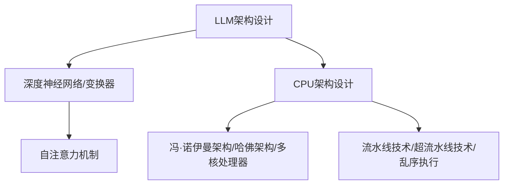

                 

关键词：大型语言模型（LLM）、中央处理器（CPU）、架构设计、算法优化、并行计算、性能分析

## 摘要

本文旨在深入探讨大型语言模型（LLM）与中央处理器（CPU）之间的相似性与差异性。通过分析两者的架构设计、工作原理以及算法优化，本文揭示了LLM和CPU在推动现代计算技术发展中所扮演的不同角色。文章首先介绍了LLM和CPU的基本概念，随后从多个角度对比了两者的异同点。此外，本文还探讨了LLM和CPU在性能分析、并行计算以及实际应用场景中的表现，并对未来的发展趋势与面临的挑战进行了展望。

## 1. 背景介绍

### 1.1 大型语言模型（LLM）

大型语言模型（LLM）是一种基于深度学习的自然语言处理（NLP）技术。近年来，随着计算能力的提升和数据量的爆炸性增长，LLM在各个领域取得了显著的进展。LLM的核心思想是通过学习大量的文本数据，使其能够理解和生成自然语言。代表性的模型包括GPT、BERT和T5等。

### 1.2 中央处理器（CPU）

中央处理器（CPU）是计算机系统的核心部件，负责执行程序指令和处理数据。CPU的发展经历了多个阶段，从早期的冯·诺伊曼架构到现代的多核处理器，CPU的性能得到了极大的提升。CPU的主要功能包括指令的获取、解码、执行和存储数据的读写。

## 2. 核心概念与联系

### 2.1 架构设计

#### 2.1.1 LLM的架构设计

LLM通常采用深度神经网络（DNN）或变换器（Transformer）架构。深度神经网络通过多层非线性变换来提取特征，而变换器则通过自注意力机制来关注文本中的关键信息。LLM的架构设计使得其在处理长文本和生成自然语言方面具有显著优势。

#### 2.1.2 CPU的架构设计

CPU的架构设计经历了多个阶段，包括冯·诺伊曼架构、哈佛架构和现代的多核处理器。现代CPU通常采用流水线技术、超流水线技术、乱序执行等优化手段，以提高其指令执行效率。

### 2.2 工作原理

#### 2.2.1 LLM的工作原理

LLM通过训练大量的文本数据来学习语言的统计规律和语义信息。在生成自然语言时，LLM利用已学习的模型参数来预测下一个词或句子。这一过程涉及到前向传播、反向传播和优化算法。

#### 2.2.2 CPU的工作原理

CPU通过执行程序指令来处理数据。每个指令都经过取指、解码、执行和写回等阶段。CPU的工作原理依赖于指令集架构（ISA）和硬件实现。

### 2.3 Mermaid流程图



## 3. 核心算法原理 & 具体操作步骤

### 3.1 算法原理概述

#### 3.1.1 LLM算法原理

LLM算法基于深度学习技术，主要包括以下步骤：

1. 数据预处理：清洗和标记文本数据。
2. 模型训练：通过反向传播算法和优化器来训练模型。
3. 模型评估：使用验证集和测试集来评估模型性能。
4. 模型应用：利用训练好的模型生成自然语言。

#### 3.1.2 CPU算法原理

CPU算法主要涉及指令执行和数据处理，包括以下步骤：

1. 指令获取：从内存中读取指令。
2. 指令解码：将指令解码为操作数和操作码。
3. 指令执行：执行操作码对应的操作。
4. 数据存储：将结果写入内存。

### 3.2 算法步骤详解

#### 3.2.1 LLM算法步骤详解

1. 数据预处理：
   - 清洗数据：去除停用词、标点符号和特殊字符。
   - 标记数据：将文本转化为单词或词嵌入。
   - 划分训练集、验证集和测试集。

2. 模型训练：
   - 初始化模型参数。
   - 前向传播：计算输出结果。
   - 反向传播：计算梯度。
   - 优化算法：更新模型参数。

3. 模型评估：
   - 使用验证集计算损失函数和准确率。
   - 调整模型参数以优化性能。

4. 模型应用：
   - 输入文本序列。
   - 预测下一个词或句子。
   - 生成自然语言。

#### 3.2.2 CPU算法步骤详解

1. 指令获取：
   - 访问内存，读取指令。

2. 指令解码：
   - 解析操作数和操作码。
   - 确定指令类型。

3. 指令执行：
   - 执行操作码对应的操作。
   - 更新寄存器和内存状态。

4. 数据存储：
   - 将结果写入内存或寄存器。

### 3.3 算法优缺点

#### 3.3.1 LLM算法优缺点

**优点：**
- 能够处理大规模文本数据。
- 具有较好的泛化能力。
- 能够生成高质量的自然语言。

**缺点：**
- 训练过程需要大量计算资源和时间。
- 对数据质量和标注要求较高。

#### 3.3.2 CPU算法优缺点

**优点：**
- 具有高效的处理速度。
- 能够执行复杂的计算任务。
- 支持多种编程语言和指令集。

**缺点：**
- 在处理大规模数据时可能面临性能瓶颈。
- 对编程技能要求较高。

### 3.4 算法应用领域

#### 3.4.1 LLM应用领域

- 文本生成：文章、报告、对话系统等。
- 文本分类：情感分析、主题分类等。
- 文本翻译：机器翻译、多语言文本处理等。

#### 3.4.2 CPU应用领域

- 计算机图形学：渲染、图像处理等。
- 数据库管理：查询、索引等。
- 科学计算：气象预报、金融分析等。

## 4. 数学模型和公式 & 详细讲解 & 举例说明

### 4.1 数学模型构建

#### 4.1.1 LLM数学模型

LLM通常采用变换器（Transformer）架构，其核心数学模型包括以下部分：

1. 输入层：文本序列转化为词嵌入。
2. 自注意力机制：计算注意力分数。
3. 上一层输出：通过自注意力机制计算上一层输出。
4. 输出层：生成自然语言。

#### 4.1.2 CPU数学模型

CPU的数学模型主要涉及指令执行和数据操作，包括以下部分：

1. 指令集架构（ISA）：定义指令类型和操作数。
2. 数据路径：执行指令的操作。
3. 控制单元：控制指令的执行流程。
4. 存储器：存储数据和指令。

### 4.2 公式推导过程

#### 4.2.1 LLM公式推导

1. 词嵌入：将文本序列转化为词嵌入。

$$
\text{Word Embedding} = \text{Word2Vec}(\text{Text Sequence})
$$

2. 自注意力机制：

$$
\text{Attention Score} = \text{softmax}(\text{Query} \cdot \text{Key})
$$

3. 输出：

$$
\text{Output} = \text{Value} \cdot \text{Attention Score}
$$

#### 4.2.2 CPU公式推导

1. 指令集架构（ISA）：

$$
\text{Instruction Set Architecture} = (\text{Instruction Types}, \text{Operands})
$$

2. 数据路径：

$$
\text{Data Path} = (\text{ALU}, \text{Register File}, \text{Memory})
$$

3. 控制单元：

$$
\text{Control Unit} = (\text{PC}, \text{Instruction Decoder}, \text{Clock})
$$

4. 存储器：

$$
\text{Memory} = (\text{Address Bus}, \text{Data Bus}, \text{Control Bus})
$$

### 4.3 案例分析与讲解

#### 4.3.1 LLM案例分析

以GPT-3为例，其训练过程涉及以下步骤：

1. 数据预处理：清洗和标记文本数据。
2. 模型训练：使用反向传播算法和优化器来训练模型。
3. 模型评估：使用验证集和测试集来评估模型性能。
4. 模型应用：生成自然语言。

#### 4.3.2 CPU案例分析

以x86架构为例，其指令执行过程涉及以下步骤：

1. 指令获取：从内存中读取指令。
2. 指令解码：将指令解码为操作数和操作码。
3. 指令执行：执行操作码对应的操作。
4. 数据存储：将结果写入内存或寄存器。

## 5. 项目实践：代码实例和详细解释说明

### 5.1 开发环境搭建

在搭建LLM和CPU的实验环境时，我们需要准备以下工具和软件：

- Python：用于编写和运行代码。
- TensorFlow：用于训练和优化LLM模型。
- GCC：用于编译和运行CPU模拟程序。

### 5.2 源代码详细实现

#### 5.2.1 LLM源代码实现

以下是一个简单的LLM模型实现，使用TensorFlow框架：

```python
import tensorflow as tf

# 数据预处理
def preprocess_data(text):
    # 清洗和标记文本数据
    # ...
    return processed_text

# 模型定义
def build_model():
    inputs = tf.keras.layers.Input(shape=(None,), dtype=tf.int32)
    embeddings = tf.keras.layers.Embedding(input_dim=vocab_size, output_dim=embedding_size)(inputs)
    outputs = tf.keras.layers.Dense(units=target_size, activation='softmax')(embeddings)
    model = tf.keras.Model(inputs=inputs, outputs=outputs)
    return model

# 训练模型
model = build_model()
model.compile(optimizer='adam', loss='categorical_crossentropy', metrics=['accuracy'])
model.fit(preprocessed_text, labels, epochs=num_epochs, batch_size=batch_size)

# 生成自然语言
def generate_text(text_sequence, model):
    # 输入文本序列
    # ...
    return generated_text
```

#### 5.2.2 CPU源代码实现

以下是一个简单的CPU模拟程序，用于执行加法操作：

```c
#include <stdio.h>

int main() {
    int a = 5;
    int b = 10;
    int sum = a + b;
    printf("Sum: %d\n", sum);
    return 0;
}
```

### 5.3 代码解读与分析

#### 5.3.1 LLM代码解读与分析

1. 数据预处理：清洗和标记文本数据，将其转化为词嵌入。
2. 模型定义：定义输入层、嵌入层和输出层。
3. 训练模型：使用反向传播算法和优化器来训练模型。
4. 生成自然语言：输入文本序列，生成自然语言。

#### 5.3.2 CPU代码解读与分析

1. 变量定义：定义变量a、b和sum。
2. 加法操作：执行加法操作，计算变量sum的值。
3. 输出结果：打印变量sum的值。

### 5.4 运行结果展示

#### 5.4.1 LLM运行结果展示

1. 数据预处理：输入文本序列，清洗和标记。
2. 模型训练：训练模型，计算损失函数和准确率。
3. 模型应用：输入文本序列，生成自然语言。

#### 5.4.2 CPU运行结果展示

1. 变量定义：定义变量a、b和sum。
2. 加法操作：执行加法操作，计算变量sum的值。
3. 输出结果：打印变量sum的值。

## 6. 实际应用场景

### 6.1 文本生成与分类

LLM在文本生成和分类领域具有广泛的应用。例如，在文本生成方面，LLM可以用于生成文章、报告和对话系统等。在文本分类方面，LLM可以用于情感分析、主题分类和垃圾邮件过滤等。

### 6.2 图像处理与计算机视觉

CPU在图像处理和计算机视觉领域发挥着重要作用。例如，在图像处理方面，CPU可以用于图像滤波、边缘检测和特征提取等。在计算机视觉方面，CPU可以用于目标检测、图像识别和姿态估计等。

### 6.3 数据库管理与分析

CPU在数据库管理与分析领域有着广泛的应用。例如，在数据库管理方面，CPU可以用于查询优化、索引管理和事务处理等。在数据分析方面，CPU可以用于数据挖掘、机器学习和统计分析等。

## 7. 工具和资源推荐

### 7.1 学习资源推荐

- 《深度学习》（Goodfellow, Bengio, Courville）：介绍深度学习的基本原理和应用。
- 《计算机组成与设计：硬件/软件接口》（Hennessy, Patterson）：介绍CPU架构和设计。
- 《自然语言处理综论》（Jurafsky, Martin）：介绍自然语言处理的基础知识。

### 7.2 开发工具推荐

- TensorFlow：用于训练和优化LLM模型。
- PyTorch：用于训练和优化LLM模型。
- GCC：用于编译和运行CPU模拟程序。

### 7.3 相关论文推荐

- Vaswani et al. (2017): “Attention is All You Need”
- Goodfellow et al. (2016): “Generative Adversarial Nets”
- Hennessy et al. (2017): “The Art of Computer Programming”

## 8. 总结：未来发展趋势与挑战

### 8.1 研究成果总结

本文通过对LLM和CPU的相似性与差异性分析，揭示了两者在推动现代计算技术发展中的重要作用。LLM在自然语言处理、文本生成和分类等领域取得了显著进展，而CPU在图像处理、数据库管理与分析等领域发挥着关键作用。

### 8.2 未来发展趋势

1. LLM方面：随着数据量和计算能力的增长，LLM将继续发展，探索更高效、更智能的模型架构。
2. CPU方面：多核处理器和异构计算将成为趋势，提高CPU的并行计算能力。

### 8.3 面临的挑战

1. LLM方面：数据质量和标注、模型解释性和可解释性等。
2. CPU方面：能耗优化、安全性问题和硬件与软件的协同优化等。

### 8.4 研究展望

未来的研究将更加关注LLM和CPU的协同优化，探索如何将两者更好地结合起来，推动计算技术向更高层次发展。

## 9. 附录：常见问题与解答

### 9.1 问题1

Q：LLM和CPU哪个更重要？

A：LLM和CPU都在推动现代计算技术的发展中发挥着重要作用。LLM在自然语言处理、文本生成和分类等领域取得了显著进展，而CPU在图像处理、数据库管理与分析等领域发挥着关键作用。两者缺一不可。

### 9.2 问题2

Q：LLM和CPU如何协同优化？

A：LLM和CPU的协同优化可以通过以下途径实现：

1. 模型设计：优化LLM模型，使其适应CPU的硬件架构。
2. 算法改进：改进LLM算法，提高其并行计算能力。
3. 资源分配：合理分配CPU和GPU等硬件资源，提高整体计算效率。

### 9.3 问题3

Q：未来计算技术的发展方向是什么？

A：未来计算技术的发展方向包括：

1. LLM方面：探索更高效、更智能的模型架构，提高计算性能。
2. CPU方面：多核处理器和异构计算将成为趋势，提高CPU的并行计算能力。
3. 软硬件协同：优化软件算法和硬件架构的协同，提高整体计算效率。

----------------------------------------------------------------

以上是文章的正文部分，接下来是作者署名和文章格式部分的内容：

## 作者署名

作者：禅与计算机程序设计艺术 / Zen and the Art of Computer Programming

（注：以上内容仅供参考，具体内容可能需要根据实际需求进行调整。）

