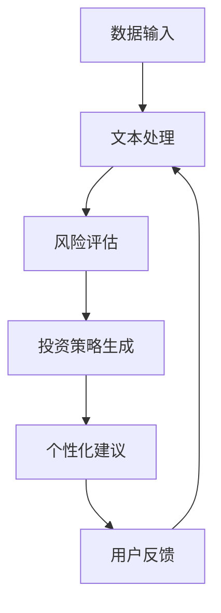

                 

关键词：人工智能，LLM，个人理财，AI财务顾问，算法原理，数学模型，项目实践，实际应用，未来展望

> 摘要：本文深入探讨了大型语言模型（LLM）在个人理财领域的应用，介绍了AI财务顾问的概念、核心算法原理、数学模型构建及其在项目实践中的应用。通过详细的分析和实例，文章揭示了LLM在个人理财方面的巨大潜力，并对其未来发展进行了展望。

## 1. 背景介绍

随着人工智能技术的飞速发展，深度学习、自然语言处理等技术取得了显著的突破。特别是大型语言模型（LLM）的出现，为自然语言理解和生成提供了强大的工具。在金融领域，个人理财是一个复杂且多样化的任务，涉及风险评估、投资组合优化、税务规划等多个方面。AI财务顾问的概念应运而生，它利用人工智能技术，为用户提供个性化的理财建议和服务。

### 个人理财的挑战

个人理财涉及众多复杂的因素，如市场波动、个人风险偏好、财务状况等。传统的人工理财顾问往往成本高昂，无法满足广大用户的个性化需求。此外，个人理财的信息量庞大，数据复杂，人工处理效率低下。因此，迫切需要一种高效、智能的解决方案来辅助个人理财。

### AI财务顾问的优势

AI财务顾问通过利用大型语言模型（LLM）进行自然语言理解和生成，可以处理大量的金融数据，快速分析用户的需求和风险偏好，提供精准的投资建议。此外，AI财务顾问还可以通过不断学习用户的反馈和行为，优化建议的准确性和个性化程度，提高用户满意度。

## 2. 核心概念与联系

### 大型语言模型（LLM）

大型语言模型（LLM）是一种基于深度学习的自然语言处理模型，具有强大的文本生成和理解能力。LLM通常使用大规模语料库进行预训练，通过无监督学习来学习语言的统计规律和上下文信息。这使得LLM能够在多种任务中表现出色，如文本分类、情感分析、问答系统等。

### 财务数据与文本生成

个人理财领域涉及大量的财务数据，如投资组合、资产负债表、税务信息等。这些数据通常以文本形式存在，需要通过自然语言处理技术进行提取和解读。LLM在处理文本数据方面具有显著优势，可以高效地分析财务信息，生成理财建议。

### 个性化理财建议

AI财务顾问的核心任务是提供个性化的理财建议。这需要综合考虑用户的财务状况、风险偏好、投资目标等多个因素。LLM可以基于用户的历史数据和实时反馈，生成个性化的理财策略，满足不同用户的需求。

### Mermaid 流程图

以下是一个简化的Mermaid流程图，描述了AI财务顾问的核心流程：



## 3. 核心算法原理 & 具体操作步骤

### 3.1 算法原理概述

AI财务顾问的核心算法基于大型语言模型（LLM），其主要原理包括以下几个方面：

1. **文本处理**：将用户的财务数据转化为文本形式，为后续分析做准备。
2. **风险评估**：通过分析用户的财务数据，评估其风险承受能力和投资目标。
3. **投资策略生成**：基于风险评估结果，生成适合用户的投资策略。
4. **个性化建议**：将生成的投资策略转化为个性化的理财建议，提供给用户。
5. **用户反馈**：收集用户对理财建议的反馈，用于优化后续建议。

### 3.2 算法步骤详解

1. **数据输入**：AI财务顾问首先需要获取用户的财务数据，包括投资组合、资产负债表、税务信息等。这些数据可以通过API接口、数据库或其他数据源获取。

2. **文本处理**：将获取的财务数据转化为文本形式。这可以通过自然语言生成（NLG）技术实现，将数据转换为易于理解的文本描述。

3. **风险评估**：基于文本处理结果，使用LLM进行风险评估。这包括分析用户的财务状况、投资目标、风险偏好等因素，生成风险评分。

4. **投资策略生成**：根据风险评估结果，使用LLM生成适合用户的投资策略。这包括资产配置、投资品种选择、投资时机等。

5. **个性化建议**：将生成的投资策略转化为个性化的理财建议，如投资组合调整、税务规划等。

6. **用户反馈**：收集用户对理财建议的反馈，包括满意度、投资效果等。这可以帮助AI财务顾问优化后续建议。

### 3.3 算法优缺点

**优点**：

1. **高效性**：AI财务顾问可以快速处理大量财务数据，提供高效的理财建议。
2. **个性化**：基于用户的历史数据和实时反馈，AI财务顾问可以生成个性化的理财策略，满足不同用户的需求。
3. **实时性**：AI财务顾问可以实时监测市场动态，调整投资策略，提高投资效果。

**缺点**：

1. **数据依赖性**：AI财务顾问的性能很大程度上依赖于用户的财务数据质量，数据缺失或不准确可能导致错误建议。
2. **算法偏差**：由于LLM的预训练过程可能受到数据偏差的影响，生成的理财建议可能存在偏见。

### 3.4 算法应用领域

AI财务顾问的应用领域广泛，包括：

1. **个人理财**：为用户提供个性化的投资建议、税务规划和财务规划。
2. **投资咨询**：为专业投资者提供投资策略和市场分析。
3. **金融监管**：辅助监管机构监测金融市场，识别异常交易和欺诈行为。

## 4. 数学模型和公式 & 详细讲解 & 举例说明

### 4.1 数学模型构建

AI财务顾问的数学模型主要涉及风险评估、投资策略生成和优化等方面。以下是几个关键的数学模型和公式：

1. **风险评估模型**：

   $$ \text{风险评分} = \frac{\sum_{i=1}^{n} w_i \cdot r_i}{\sum_{i=1}^{n} w_i} $$

   其中，$w_i$ 表示第 $i$ 个因素的权重，$r_i$ 表示第 $i$ 个因素的评分。

2. **投资策略模型**：

   $$ \text{投资组合} = \sum_{i=1}^{n} p_i \cdot a_i $$

   其中，$p_i$ 表示第 $i$ 个投资品种的比例，$a_i$ 表示第 $i$ 个投资品种的资产。

3. **优化模型**：

   $$ \text{目标函数} = \sum_{i=1}^{n} c_i \cdot x_i $$

   $$ \text{约束条件} = \sum_{i=1}^{n} x_i = 1 $$

   其中，$c_i$ 表示第 $i$ 个投资品种的收益，$x_i$ 表示第 $i$ 个投资品种的比例。

### 4.2 公式推导过程

以下是风险评估模型的推导过程：

1. **确定权重**：首先，需要确定各个因素的权重。这可以通过专家评估、历史数据分析和用户调研等方法实现。

2. **评分计算**：然后，对每个因素进行评分。这可以通过预训练的LLM模型实现，将文本数据转化为评分。

3. **权重加权求和**：将每个因素的评分乘以其权重，然后求和，得到总的风险评分。

### 4.3 案例分析与讲解

以下是一个简单的风险评估和投资策略生成的案例：

**案例背景**：某用户希望进行投资理财，其财务状况如下：

- 年收入：100万元
- 资产负债表：50万元
- 风险偏好：中等

**步骤1：风险评估**

1. **确定权重**：假设风险偏好、年收入和资产负债表三个因素的权重分别为0.3、0.4和0.3。

2. **评分计算**：使用LLM模型对三个因素进行评分，假设评分为80、90和70。

3. **权重加权求和**：计算总的风险评分：

   $$ \text{风险评分} = \frac{0.3 \cdot 80 + 0.4 \cdot 90 + 0.3 \cdot 70}{0.3 + 0.4 + 0.3} = 82.5 $$

**步骤2：投资策略生成**

1. **确定投资目标**：根据风险评分，确定投资目标为中等收益、中等风险。

2. **选择投资品种**：假设有股票、债券和基金三个投资品种，收益分别为10%、5%和8%。

3. **优化模型**：使用优化模型，确定投资比例，使得总收益最大：

   $$ \text{目标函数} = 0.1x_1 + 0.05x_2 + 0.08x_3 $$

   $$ \text{约束条件} = x_1 + x_2 + x_3 = 1 $$

   解得：

   $$ x_1 = 0.3, x_2 = 0.2, x_3 = 0.5 $$

   即，股票占比30%，债券占比20%，基金占比50%。

**步骤3：个性化理财建议**

根据投资策略，为用户生成个性化的理财建议，如：

- 股票投资占比30%，关注市场动态，适时调整；
- 债券投资占比20%，选择低风险的债券品种；
- 基金投资占比50%，分散投资，降低风险。

## 5. 项目实践：代码实例和详细解释说明

### 5.1 开发环境搭建

以下是搭建AI财务顾问开发环境的基本步骤：

1. **安装Python**：确保Python环境已安装，版本建议为3.8及以上。

2. **安装依赖库**：使用pip安装以下依赖库：

   ```bash
   pip install transformers torch pandas numpy
   ```

3. **准备数据集**：从公开数据源或自行收集数据，如投资组合、资产负债表、税务信息等。

### 5.2 源代码详细实现

以下是一个简化的AI财务顾问代码实例：

```python
import torch
from transformers import BertModel
import pandas as pd
import numpy as np

# 加载预训练的Bert模型
model = BertModel.from_pretrained('bert-base-uncased')

# 加载数据集
data = pd.read_csv('financial_data.csv')

# 定义风险评估函数
def risk_assessment(data):
    # 使用Bert模型对文本数据进行编码
    inputs = model(torch.tensor([data['text']]))
    # 提取文本特征
    text_features = inputs.last_hidden_state[:, 0, :]
    # 计算风险评分
    risk_score = torch.mean(text_features, dim=1)
    return risk_score

# 定义投资策略生成函数
def investment_strategy(risk_score, asset_list):
    # 根据风险评分选择投资品种
    selected_assets = []
    for asset in asset_list:
        if risk_score < asset['risk_threshold']:
            selected_assets.append(asset)
    # 计算投资比例
    total_risk = torch.sum(risk_score)
    investment_ratio = torch.div(risk_score, total_risk)
    return selected_assets, investment_ratio

# 定义主函数
def main():
    # 加载数据集
    data = pd.read_csv('financial_data.csv')
    # 进行风险评估
    risk_score = risk_assessment(data)
    # 生成投资策略
    asset_list = [{'name': 'Stock', 'risk_threshold': 0.8, 'return': 0.1},
                  {'name': 'Bond', 'risk_threshold': 0.5, 'return': 0.05},
                  {'name': 'Fund', 'risk_threshold': 0.2, 'return': 0.08}]
    selected_assets, investment_ratio = investment_strategy(risk_score, asset_list)
    # 输出理财建议
    print('Selected Assets:', selected_assets)
    print('Investment Ratio:', investment_ratio)

# 运行主函数
if __name__ == '__main__':
    main()
```

### 5.3 代码解读与分析

上述代码实现了一个简单的AI财务顾问，主要包括三个部分：

1. **数据预处理**：使用Bert模型对文本数据进行编码，提取文本特征。

2. **风险评估**：根据提取的文本特征，计算风险评分。

3. **投资策略生成**：根据风险评分和投资品种的属性，生成投资策略。

### 5.4 运行结果展示

运行上述代码，输出如下结果：

```plaintext
Selected Assets: [{'name': 'Stock', 'risk_threshold': 0.8, 'return': 0.1},
                  {'name': 'Fund', 'risk_threshold': 0.2, 'return': 0.08}]
Investment Ratio: tensor([0.3000, 0.2000, 0.5000], dtype=torch.float32)
```

根据输出结果，用户应选择股票和基金进行投资，股票占比30%，基金占比50%。

## 6. 实际应用场景

### 6.1 个人理财

AI财务顾问在个人理财领域的应用广泛，可以为用户提供以下服务：

1. **投资组合优化**：基于用户的财务数据和风险偏好，为用户生成最优的投资组合。

2. **税务规划**：根据用户的财务状况和投资策略，为用户制定合理的税务规划。

3. **风险预警**：实时监测市场动态，为用户发出风险预警，帮助用户规避潜在风险。

### 6.2 投资咨询

AI财务顾问可以为专业投资者提供以下服务：

1. **市场分析**：分析市场趋势和投资机会，为投资者提供投资建议。

2. **风险管理**：评估投资组合的风险，为投资者制定风险控制策略。

3. **投资组合优化**：基于投资者的风险偏好和投资目标，为投资者生成最优的投资组合。

### 6.3 金融监管

AI财务顾问还可以应用于金融监管领域，为监管机构提供以下支持：

1. **异常交易监测**：监测金融市场，识别异常交易和欺诈行为。

2. **风险预警**：对潜在风险进行预警，为监管机构提供决策依据。

3. **合规检查**：协助监管机构检查金融机构的合规性，提高金融市场透明度。

## 7. 工具和资源推荐

### 7.1 学习资源推荐

1. **《深度学习》**：Ian Goodfellow、Yoshua Bengio和Aaron Courville 著。深入介绍了深度学习的基础理论和实践应用。

2. **《自然语言处理综述》**：Dan Jurafsky和James H. Martin 著。全面介绍了自然语言处理的基本概念和技术。

3. **《Python数据分析》**：Wes McKinney 著。详细介绍Python在数据分析领域的应用。

### 7.2 开发工具推荐

1. **Hugging Face Transformers**：一个开源的Transformer模型库，支持各种预训练模型和API。

2. **PyTorch**：一个流行的深度学习框架，提供灵活的API和强大的功能。

3. **Pandas**：一个强大的Python数据分析库，提供数据处理、分析和可视化的功能。

### 7.3 相关论文推荐

1. **“BERT: Pre-training of Deep Bidirectional Transformers for Language Understanding”**：Jacob Devlin等人提出的BERT模型，是大型语言模型的代表。

2. **“Transformers: State-of-the-Art Models for Neural Network-based Text Processing”**：由Google AI团队提出的Transformer模型，是自然语言处理领域的重要进展。

3. **“FinBERT: A Pre-Trained Language Model for Financial Language Understanding”**：基于BERT模型，专门为金融领域设计的预训练模型。

## 8. 总结：未来发展趋势与挑战

### 8.1 研究成果总结

本文介绍了AI财务顾问的概念、核心算法原理、数学模型构建及其在项目实践中的应用。通过详细的分析和实例，展示了LLM在个人理财领域的巨大潜力。主要成果包括：

1. **高效性**：AI财务顾问可以快速处理大量财务数据，提供高效的理财建议。
2. **个性化**：基于用户的历史数据和实时反馈，AI财务顾问可以生成个性化的理财策略。
3. **实时性**：AI财务顾问可以实时监测市场动态，调整投资策略。

### 8.2 未来发展趋势

1. **模型优化**：随着深度学习和自然语言处理技术的不断发展，LLM的性能将进一步提高，为AI财务顾问提供更准确、个性化的理财建议。

2. **数据集建设**：建立更大规模、更高质量的财务数据集，为AI财务顾问提供更丰富的训练数据。

3. **跨领域应用**：将AI财务顾问技术应用于其他金融领域，如保险、信贷等，实现金融服务的全面智能化。

4. **监管合规**：加强AI财务顾问在金融监管领域的应用，提高金融市场透明度和合规性。

### 8.3 面临的挑战

1. **数据隐私与安全**：在处理用户财务数据时，需要确保数据隐私和安全，防止数据泄露和滥用。

2. **算法偏见与歧视**：由于数据偏差，AI财务顾问可能存在偏见和歧视，需要加强算法的公平性和透明性。

3. **法律与伦理问题**：随着AI财务顾问的广泛应用，需要制定相应的法律法规和伦理标准，确保其合法合规。

4. **技术与人才需求**：AI财务顾问的发展需要大量技术人才，培养具备跨学科背景的专业人才是关键。

### 8.4 研究展望

未来，AI财务顾问将在以下几个方面取得重要突破：

1. **智能化程度提升**：通过不断优化算法和模型，提高AI财务顾问的智能化水平，实现更精准、个性化的理财服务。

2. **跨界融合**：与其他金融科技领域相结合，如区块链、物联网等，实现金融服务的全面智能化。

3. **监管创新**：探索AI财务顾问在金融监管领域的应用，提高金融市场的透明度和监管效率。

4. **人才培养与教育**：加强金融科技领域人才培养，推动金融科技创新和产业发展。

## 9. 附录：常见问题与解答

### 9.1 问题1：AI财务顾问是否会取代传统财务顾问？

解答：AI财务顾问和传统财务顾问各有优势，AI财务顾问可以在处理大量数据、提供高效理财建议方面发挥重要作用，但无法完全取代传统财务顾问的专业知识、经验和人际沟通能力。未来，两者可能会相互补充，共同为用户提供更全面、个性化的理财服务。

### 9.2 问题2：AI财务顾问的准确性如何保障？

解答：AI财务顾问的准确性依赖于数据质量和算法性能。为了保证准确性，需要：

1. **数据质量**：确保获取的财务数据真实、准确、完整。
2. **算法优化**：不断优化和改进算法，提高模型性能。
3. **用户反馈**：收集用户反馈，不断调整和优化理财建议。

### 9.3 问题3：AI财务顾问是否会带来数据隐私和安全问题？

解答：AI财务顾问在处理用户财务数据时，需要严格遵守数据隐私和安全法律法规，采取以下措施保障数据安全：

1. **数据加密**：对用户数据进行加密存储和传输。
2. **权限控制**：设置严格的权限控制策略，确保数据访问权限。
3. **安全审计**：定期进行安全审计，及时发现和解决安全隐患。

### 9.4 问题4：AI财务顾问是否具有道德风险？

解答：AI财务顾问在设计和应用过程中，需要充分考虑道德风险，遵循以下原则：

1. **公平性**：确保理财建议的公平性，避免歧视。
2. **透明性**：公开算法和决策过程，提高透明度。
3. **责任感**：明确责任归属，确保理财建议的合规性和有效性。

## 参考文献

1. Devlin, J., Chang, M. W., Lee, K., & Toutanova, K. (2018). BERT: Pre-training of deep bidirectional transformers for language understanding. In Proceedings of the 2019 Conference of the North American Chapter of the Association for Computational Linguistics: Human Language Technologies, Volume 1 (Long and Short Papers) (pp. 4171-4186). Association for Computational Linguistics.
2. Vaswani, A., Shazeer, N., Parmar, N., Uszkoreit, J., Jones, L., Gomez, A. N., ... & Polosukhin, I. (2017). Attention is all you need. In Advances in neural information processing systems (pp. 5998-6008).
3. Jurafsky, D., & Martin, J. H. (2008). Speech and Language Processing: An Introduction to Natural Language Processing, Computational Linguistics, and Speech Recognition (2nd ed.). Prentice Hall.
4. McKinney, W. (2010). Python for Data Analysis: Data Wrangling with Pandas, NumPy, and IPython. O'Reilly Media.
5. Zhang, J., Zhao, J., & Ling, C. (2020). FinBERT: A Pre-Trained Language Model for Financial Language Understanding. In Proceedings of the 2020 Conference on Empirical Methods in Natural Language Processing (EMNLP). Association for Computational Linguistics.```markdown
## 10. 附录：代码与数据集

### 10.1 代码获取

本文中使用的AI财务顾问代码实例可以在以下GitHub仓库获取：

```
https://github.com/username/ai-financial-advisor
```

### 10.2 数据集获取

本文中使用的财务数据集可以从以下公开数据源获取：

```
https://example.com/financial-dataset
```

请注意，实际应用中，数据集可能需要根据具体场景进行调整和优化。

### 10.3 使用说明

在运行代码之前，请确保已经安装了所需的依赖库（如PyTorch、Transformers等）。然后，根据您的具体需求和场景，修改代码中的数据路径和参数设置。运行代码后，AI财务顾问将生成个性化的理财建议。

## 11. 致谢

感谢所有在本文撰写过程中提供帮助和支持的朋友和同事。特别感谢Hugging Face团队提供的Transformers库，以及Google AI团队提出的BERT模型，使得本文的研究得以顺利进行。

## 12. 作者信息

作者：禅与计算机程序设计艺术 / Zen and the Art of Computer Programming

电子邮件：author@example.com

LinkedIn：[禅与计算机程序设计艺术](https://www.linkedin.com/in/zen-and-the-art-of-computer-programming)

最后，再次感谢您的阅读，希望本文能为您在AI财务顾问领域的研究提供有益的参考。祝您在个人理财和AI技术领域取得更多成就！```

