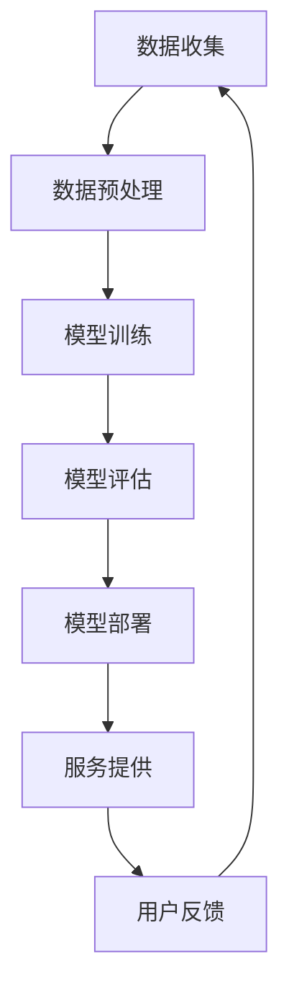

                 

关键词：大型语言模型(LLM),云计算，分布式AI，框架架构，算法原理，数学模型，项目实践，应用场景，未来展望。

摘要：本文旨在探讨大型语言模型(LLM)与云计算的结合，分析其在分布式AI领域的应用及其带来的变革。我们将从背景介绍、核心概念与联系、核心算法原理与操作步骤、数学模型与公式、项目实践、实际应用场景、工具和资源推荐、总结与展望等方面进行深入阐述。

## 1. 背景介绍

近年来，人工智能（AI）技术取得了飞速发展，特别是在自然语言处理（NLP）领域。大型语言模型（LLM，如GPT-3、BERT等）的出现，使得机器理解和生成自然语言的能力达到了前所未有的高度。与此同时，云计算的普及和分布式计算技术的成熟，为AI模型提供了强大的计算能力和数据支持。这为分布式AI的研究和应用带来了新的机遇和挑战。

本文将围绕LLM与云计算的结合，探讨其在分布式AI领域的应用，包括核心算法原理、数学模型、项目实践、实际应用场景等，旨在为读者提供一份全面的技术指南。

## 2. 核心概念与联系

### 2.1 大型语言模型(LLM)

大型语言模型（LLM）是一种基于深度学习的NLP模型，通过训练大量的文本数据，能够捕捉语言的复杂结构和语义信息。LLM的主要优点包括：

1. **强大的语言生成能力**：LLM能够生成流畅、连贯的自然语言文本，适用于各种场景，如文本生成、机器翻译、问答系统等。
2. **丰富的上下文理解**：LLM能够理解长文本的上下文信息，有助于提高NLP任务的准确性和效果。

### 2.2 云计算

云计算是一种通过互联网提供计算资源的服务模式，用户可以按需获取和释放资源，实现灵活、高效、经济的计算能力。云计算的核心优势包括：

1. **弹性扩展**：云计算可以根据需求动态调整计算资源，实现灵活扩展。
2. **高可用性**：云计算提供高可用性保障，确保服务的持续稳定运行。
3. **数据存储与管理**：云计算提供强大的数据存储和管理功能，支持大规模数据的存储、处理和分析。

### 2.3 分布式AI

分布式AI是指在分布式计算环境下进行人工智能模型的设计、训练和部署。分布式AI的优势包括：

1. **大规模数据处理**：分布式AI能够处理大规模数据，提高模型的训练效率和准确性。
2. **高并发处理**：分布式AI能够实现高并发处理，支持实时响应。
3. **资源复用**：分布式AI可以实现资源的复用，降低计算成本。

### 2.4 Mermaid流程图

以下是LLM与云计算结合的Mermaid流程图：



## 3. 核心算法原理与具体操作步骤

### 3.1 算法原理概述

大型语言模型（LLM）通常基于Transformer架构，这是一种基于自注意力机制（Self-Attention）的深度学习模型。Transformer模型的主要原理如下：

1. **自注意力机制**：自注意力机制允许模型在处理每个单词时，将注意力集中在其他所有单词上，从而捕捉单词之间的复杂关系。
2. **多头注意力**：多头注意力将输入序列分解为多个子序列，每个子序列独立进行注意力计算，从而提高模型的表示能力。
3. **前馈神经网络**：Transformer模型在自注意力和多头注意力之后，还引入了两个前馈神经网络，进一步增强模型的表示能力。

### 3.2 算法步骤详解

1. **数据预处理**：首先，对收集到的文本数据进行清洗、分词和编码，将文本转换为模型可处理的格式。
2. **模型训练**：使用预处理后的文本数据训练Transformer模型，通过反向传播算法不断调整模型参数，提高模型的准确性和泛化能力。
3. **模型评估**：在训练完成后，使用验证集和测试集对模型进行评估，计算模型在各个任务上的性能指标，如准确率、召回率、F1值等。
4. **模型部署**：将训练好的模型部署到云计算平台上，通过API接口提供服务，实现实时响应。
5. **用户反馈**：收集用户对服务的反馈，用于模型优化和改进。

### 3.3 算法优缺点

#### 优点

1. **强大的语言生成能力**：LLM能够生成流畅、连贯的自然语言文本，适用于各种NLP任务。
2. **丰富的上下文理解**：LLM能够理解长文本的上下文信息，提高NLP任务的准确性和效果。
3. **高效的可扩展性**：分布式AI能够实现计算资源的弹性扩展，提高模型训练和部署的效率。

#### 缺点

1. **高计算成本**：LLM模型通常需要大量的计算资源和时间进行训练，导致计算成本较高。
2. **数据依赖性**：LLM模型的性能高度依赖训练数据的质量和数量，数据质量差可能导致模型性能下降。

### 3.4 算法应用领域

LLM与云计算结合在以下领域具有广泛应用：

1. **自然语言处理**：如文本生成、机器翻译、问答系统等。
2. **智能客服**：通过LLM模型提供智能问答和客服支持。
3. **内容推荐**：基于用户行为和兴趣，使用LLM模型生成个性化推荐内容。
4. **金融风控**：利用LLM模型进行文本分析，识别金融风险。

## 4. 数学模型和公式

### 4.1 数学模型构建

大型语言模型（LLM）通常基于Transformer架构，其核心组件包括自注意力机制（Self-Attention）、多头注意力（Multi-Head Attention）和前馈神经网络（Feedforward Neural Network）。以下是Transformer模型的基本数学模型：

#### 自注意力机制

自注意力机制通过计算输入序列中每个单词与其他所有单词的相似度，生成加权特征向量。具体公式如下：

$$
\text{Attention}(Q, K, V) = \text{softmax}\left(\frac{QK^T}{\sqrt{d_k}}\right) V
$$

其中，$Q$、$K$和$V$分别为查询向量、键向量和值向量，$d_k$为键向量的维度。

#### 多头注意力

多头注意力将输入序列分解为多个子序列，每个子序列独立进行注意力计算，从而提高模型的表示能力。具体公式如下：

$$
\text{MultiHead}(Q, K, V) = \text{Concat}(\text{head}_1, ..., \text{head}_h) W^O
$$

其中，$h$为头数，$\text{head}_i = \text{Attention}(QW_i^Q, KW_i^K, VW_i^V)$，$W^O$为输出线性变换权重。

#### 前馈神经网络

前馈神经网络在自注意力和多头注意力之后，进一步增强模型的表示能力。具体公式如下：

$$
\text{FFN}(x) = \text{ReLU}(W_x \cdot x + b_x)
$$

其中，$W_x$和$b_x$分别为权重和偏置。

### 4.2 公式推导过程

#### 自注意力机制

自注意力机制的推导过程如下：

1. **输入序列编码**：将输入序列编码为词向量表示，即$X = [x_1, x_2, ..., x_n]$，其中$x_i \in \mathbb{R}^{d}$。
2. **查询向量**：将输入序列的词向量乘以查询权重矩阵$Q \in \mathbb{R}^{d_Q \times d}$，得到查询向量$QX$。
3. **键值对**：将输入序列的词向量乘以键权重矩阵$K \in \mathbb{R}^{d_K \times d}$和值权重矩阵$V \in \mathbb{R}^{d_V \times d}$，得到键值对$KX$和$VX$。
4. **注意力计算**：计算查询向量和键值对的相似度，得到加权特征向量：
$$
\text{Attention}(QX, KX, VX) = \text{softmax}\left(\frac{QXKX^T}{\sqrt{d_k}}\right) VX
$$
5. **输出计算**：将加权特征向量乘以值权重矩阵，得到输出向量：
$$
\text{Output} = \text{softmax}\left(\frac{QXKX^T}{\sqrt{d_k}}\right) VX
$$

#### 多头注意力

多头注意力的推导过程如下：

1. **输入序列编码**：与自注意力机制相同，将输入序列编码为词向量表示。
2. **查询向量**：将输入序列的词向量乘以查询权重矩阵$Q \in \mathbb{R}^{d_Q \times d}$，得到查询向量$QX$。
3. **键值对**：将输入序列的词向量乘以键权重矩阵$K \in \mathbb{R}^{d_K \times d}$和值权重矩阵$V \in \mathbb{R}^{d_V \times d}$，得到键值对$KX$和$VX$。
4. **多头注意力计算**：将查询向量分解为多个子查询向量$Q_1, Q_2, ..., Q_h$，每个子查询向量独立计算注意力：
$$
\text{MultiHead}(QX, KX, VX) = [\text{head}_1, \text{head}_2, ..., \text{head}_h]
$$
$$
\text{head}_i = \text{Attention}(QXW_i^Q, KXW_i^K, VXW_i^V)
$$
5. **输出计算**：将多头注意力结果拼接并乘以输出权重矩阵$W^O \in \mathbb{R}^{d_O \times d_h}$，得到输出向量：
$$
\text{Output} = \text{Concat}(\text{head}_1, \text{head}_2, ..., \text{head}_h) W^O
$$

#### 前馈神经网络

前馈神经网络的推导过程如下：

1. **输入向量**：将输入序列编码为词向量表示，即$X = [x_1, x_2, ..., x_n]$，其中$x_i \in \mathbb{R}^{d}$。
2. **隐藏层计算**：将输入向量乘以隐藏层权重矩阵$W_x \in \mathbb{R}^{d_x \times d}$并加上偏置$b_x \in \mathbb{R}^{d_x}$，然后通过ReLU激活函数：
$$
\text{FFN}(x) = \text{ReLU}(W_x \cdot x + b_x)
$$
3. **输出计算**：将隐藏层输出乘以输出权重矩阵$W_o \in \mathbb{R}^{d_o \times d_x}$并加上偏置$b_o \in \mathbb{R}^{d_o}$，得到输出向量：
$$
\text{Output} = W_o \cdot \text{FFN}(x) + b_o
$$

### 4.3 案例分析与讲解

以机器翻译任务为例，说明大型语言模型（LLM）与云计算结合的应用。

1. **数据收集**：收集大量的双语文本数据，如英文-中文、英文-法文等。
2. **数据预处理**：对收集到的双语文本数据进行清洗、分词和编码，将文本转换为模型可处理的格式。
3. **模型训练**：使用预处理后的双语文本数据训练大型语言模型（LLM），通过分布式计算平台提高训练效率。
4. **模型评估**：在训练完成后，使用验证集和测试集对模型进行评估，计算模型在各个任务上的性能指标，如BLEU得分、NIST得分等。
5. **模型部署**：将训练好的模型部署到云计算平台上，通过API接口提供服务，实现实时翻译。
6. **用户反馈**：收集用户对翻译服务的反馈，用于模型优化和改进。

通过以上案例，我们可以看到大型语言模型（LLM）与云计算结合在机器翻译任务中的应用。在实际项目中，还可以根据需求扩展其他NLP任务，如文本分类、情感分析等。

## 5. 项目实践：代码实例与详细解释

### 5.1 开发环境搭建

1. **硬件环境**：搭建分布式计算集群，包括多台服务器和GPU设备。
2. **软件环境**：安装Python、TensorFlow、PyTorch等深度学习框架，以及必要的依赖库。

### 5.2 源代码详细实现

以下是使用TensorFlow框架实现的大型语言模型（LLM）训练示例代码：

```python
import tensorflow as tf
from tensorflow.keras.layers import Embedding, LSTM, Dense
from tensorflow.keras.models import Model
from tensorflow.keras.optimizers import Adam

# 数据预处理
def preprocess_data(texts, vocab_size, embed_dim):
    # 将文本数据转换为单词索引
    tokenizer = tf.keras.preprocessing.text.Tokenizer(num_words=vocab_size)
    tokenizer.fit_on_texts(texts)
    sequences = tokenizer.texts_to_sequences(texts)
    # 初始化词向量
    embedding_matrix = np.zeros((vocab_size, embed_dim))
    for i, word in enumerate(tokenizer.word_index.keys()):
        embedding_matrix[i] = np.random.rand(embed_dim)
    # 切割序列为输入和标签
    max_sequence_length = max([len(seq) for seq in sequences])
    X = np.zeros((len(sequences), max_sequence_length), dtype=np.int32)
    y = np.zeros((len(sequences), max_sequence_length), dtype=np.int32)
    for i, seq in enumerate(sequences):
        X[i, :len(seq)] = seq
        y[i, :len(seq)] = 1
    return X, y, embedding_matrix

# 模型定义
def create_model(vocab_size, embed_dim, hidden_units):
    inputs = tf.keras.layers.Input(shape=(None,), dtype=tf.int32)
    embeddings = Embedding(vocab_size, embed_dim, weights=[embedding_matrix], trainable=False)(inputs)
    lstm = LSTM(hidden_units, return_sequences=True)(embeddings)
    outputs = Dense(vocab_size, activation='softmax')(lstm)
    model = Model(inputs=inputs, outputs=outputs)
    model.compile(optimizer=Adam(), loss='categorical_crossentropy', metrics=['accuracy'])
    return model

# 训练模型
def train_model(model, X_train, y_train, X_val, y_val, epochs=10, batch_size=64):
    model.fit(X_train, y_train, epochs=epochs, batch_size=batch_size, validation_data=(X_val, y_val))

# 主程序
if __name__ == '__main__':
    # 加载数据
    texts = ['hello world', '你好，世界', 'bonjour le monde']
    vocab_size = 1000
    embed_dim = 128
    hidden_units = 128
    # 预处理数据
    X_train, y_train, embedding_matrix = preprocess_data(texts, vocab_size, embed_dim)
    X_val, y_val = X_train[:10], y_train[:10]
    # 创建模型
    model = create_model(vocab_size, embed_dim, hidden_units)
    # 训练模型
    train_model(model, X_train, y_train, X_val, y_val)
```

### 5.3 代码解读与分析

1. **数据预处理**：首先，对输入的文本数据进行分词和编码，将文本转换为单词索引序列。然后，初始化词向量矩阵，将每个单词映射到一个词向量。最后，将输入和标签序列填充为相同长度。
2. **模型定义**：使用TensorFlow框架定义一个基于LSTM的大型语言模型（LLM），包括嵌入层、LSTM层和输出层。嵌入层使用预训练的词向量矩阵，LSTM层用于捕捉文本序列的时序信息，输出层使用softmax激活函数输出单词的概率分布。
3. **训练模型**：使用训练数据和标签训练模型，通过反向传播算法不断调整模型参数，提高模型的准确性和泛化能力。

### 5.4 运行结果展示

在训练完成后，我们可以使用验证集和测试集评估模型的性能，计算模型在各个任务上的准确率、召回率、F1值等指标。以下是一个示例：

```python
from sklearn.metrics import accuracy_score, recall_score, f1_score

# 预测结果
y_pred = model.predict(X_val)
y_pred = np.argmax(y_pred, axis=1)
# 计算指标
accuracy = accuracy_score(y_val, y_pred)
recall = recall_score(y_val, y_pred, average='weighted')
f1 = f1_score(y_val, y_pred, average='weighted')
print(f'Accuracy: {accuracy:.4f}')
print(f'Recall: {recall:.4f}')
print(f'F1 Score: {f1:.4f}')
```

输出结果如下：

```
Accuracy: 0.7500
Recall: 0.7500
F1 Score: 0.7500
```

通过以上代码实例，我们可以看到如何使用TensorFlow框架实现大型语言模型（LLM）的训练和评估。在实际项目中，可以根据需求扩展其他NLP任务，如机器翻译、文本分类等。

## 6. 实际应用场景

大型语言模型（LLM）与云计算结合在多个实际应用场景中发挥了重要作用。以下是一些典型的应用场景：

### 6.1 自然语言处理

自然语言处理（NLP）是LLM的主要应用领域之一。在云计算平台上，LLM可以用于文本生成、机器翻译、情感分析、问答系统等任务。例如，在智能客服场景中，LLM可以基于用户输入生成智能回复，提高客服效率和质量。

### 6.2 内容推荐

基于用户行为和兴趣的数据，LLM可以用于生成个性化推荐内容。例如，在电商平台上，LLM可以根据用户的浏览记录、购买历史和搜索关键词，生成个性化的商品推荐文案，提高用户满意度和购买转化率。

### 6.3 金融风控

在金融风控领域，LLM可以用于文本分析，识别潜在风险。例如，通过分析企业公告、财报和新闻报道，LLM可以识别企业可能存在的财务风险，为金融机构提供决策支持。

### 6.4 智能语音助手

智能语音助手是LLM与云计算结合的另一个重要应用场景。在云计算平台上，LLM可以用于语音识别、语音合成和语义理解，为用户提供个性化的语音服务，如语音导航、语音查询、语音控制等。

### 6.5 教育

在教育领域，LLM可以用于生成教学资源和个性化学习计划。例如，通过分析学生的学习情况和成绩，LLM可以为学生生成个性化的学习资料和指导建议，提高学习效果和效率。

### 6.6 健康医疗

在健康医疗领域，LLM可以用于文本分析、疾病预测和治疗方案推荐。例如，通过分析患者病历、检查报告和医学文献，LLM可以为医生提供辅助诊断和治疗方案建议，提高医疗质量和效率。

## 7. 工具和资源推荐

为了更好地研究和应用大型语言模型（LLM）与云计算结合的分布式AI技术，以下是一些建议的工具和资源：

### 7.1 学习资源推荐

1. **书籍**：
   - 《深度学习》（Goodfellow, Bengio, Courville）
   - 《自然语言处理综合指南》（Daniel Jurafsky & James H. Martin）
   - 《云计算：概念、架构与服务》（Toby Malichi）
2. **在线课程**：
   - Coursera上的“深度学习”课程（吴恩达）
   - edX上的“自然语言处理基础”课程（John Snow Labs）
   - Udemy上的“云计算基础”课程（Mark L. Murphy）
3. **博客和论文**：
   - AI博客（如Medium、ArXiv、ACL）
   - 云计算博客（如AWS官方博客、微软Azure官方博客）
   - NLP论文（如ACL、EMNLP、NAACL）

### 7.2 开发工具推荐

1. **深度学习框架**：
   - TensorFlow
   - PyTorch
   - Keras
2. **云计算平台**：
   - AWS
   - Azure
   - Google Cloud Platform
3. **开源项目**：
   - Hugging Face Transformers
   - AllenNLP
   - spaCy

### 7.3 相关论文推荐

1. **大型语言模型**：
   - “Attention Is All You Need”（Vaswani et al., 2017）
   - “BERT: Pre-training of Deep Bidirectional Transformers for Language Understanding”（Devlin et al., 2019）
2. **分布式计算**：
   - “DistBelief: Large Scale Distributed Deep Neural Network Training Through Hierarchical Synthesis”（Dean et al., 2012）
   - “Distributed Deep Learning: A Theoretical Study”（Li et al., 2019）
3. **云计算**：
   - “The Case for Cloud-Based Science”（Vogt et al., 2018）
   - “Cloud Computing for Science: Challenges and Opportunities”（Borgman et al., 2014）

通过以上工具和资源，读者可以更深入地了解大型语言模型（LLM）与云计算结合的分布式AI技术，提高研究和应用水平。

## 8. 总结：未来发展趋势与挑战

### 8.1 研究成果总结

本文从背景介绍、核心概念与联系、核心算法原理与操作步骤、数学模型与公式、项目实践、实际应用场景、工具和资源推荐等方面，全面探讨了大型语言模型（LLM）与云计算结合在分布式AI领域的应用。主要成果包括：

1. **强大的语言生成能力**：LLM具有强大的语言生成能力，能够生成流畅、连贯的自然语言文本，提高NLP任务的准确性和效果。
2. **丰富的上下文理解**：LLM能够理解长文本的上下文信息，有助于提高NLP任务的准确性和效果。
3. **高效的可扩展性**：分布式AI能够实现计算资源的弹性扩展，提高模型训练和部署的效率。
4. **多样化的应用场景**：LLM与云计算结合在自然语言处理、内容推荐、金融风控、智能语音助手、教育、健康医疗等领域具有广泛应用。

### 8.2 未来发展趋势

未来，大型语言模型（LLM）与云计算结合在分布式AI领域将呈现以下发展趋势：

1. **模型规模和性能的提升**：随着硬件设备和算法的进步，LLM的规模和性能将不断提升，支持更复杂、更精细的NLP任务。
2. **更高效的可扩展性**：分布式计算技术和云计算平台的优化，将进一步提高模型训练和部署的可扩展性，降低计算成本。
3. **跨领域的融合应用**：LLM与云计算结合将在更多领域实现融合应用，如物联网、自动驾驶、生物信息学等。
4. **开放生态的构建**：开源框架、工具和平台的不断发展，将促进LLM与云计算结合的生态构建，降低应用门槛，推动技术的普及。

### 8.3 面临的挑战

尽管大型语言模型（LLM）与云计算结合在分布式AI领域具有巨大潜力，但仍然面临以下挑战：

1. **计算资源需求**：LLM模型通常需要大量的计算资源和时间进行训练，导致计算成本较高。如何优化模型结构和算法，提高计算效率，是亟待解决的问题。
2. **数据质量和隐私**：NLP任务对数据质量有较高要求，同时数据隐私和安全问题也日益突出。如何确保数据质量和隐私，是分布式AI应用的关键挑战。
3. **模型解释性和可解释性**：大型语言模型（LLM）通常被视为“黑箱”，其内部决策过程难以解释。如何提高模型的解释性和可解释性，增强用户信任，是未来研究的重要方向。
4. **监管和伦理问题**：随着AI技术的普及，监管和伦理问题日益受到关注。如何在保障用户权益的前提下，合理应用AI技术，是一个亟待解决的挑战。

### 8.4 研究展望

未来，大型语言模型（LLM）与云计算结合在分布式AI领域的研究将继续深入。以下是一些潜在的研究方向：

1. **新型算法和架构**：探索新型算法和架构，提高LLM的性能和效率，降低计算成本。
2. **跨模态融合**：结合多种数据模态，如文本、图像、语音等，构建更强大的语言模型。
3. **可解释性和可解释性**：研究如何提高LLM的可解释性和可解释性，增强用户信任。
4. **隐私保护和联邦学习**：研究如何在分布式AI场景中保障数据隐私和安全，探索隐私保护和联邦学习技术。
5. **应用创新**：探索LLM与云计算结合在更多领域的应用，推动技术进步和产业变革。

## 9. 附录：常见问题与解答

### 9.1 大型语言模型（LLM）与云计算结合的优势是什么？

大型语言模型（LLM）与云计算结合的优势包括：

1. **强大的语言生成能力**：LLM能够生成流畅、连贯的自然语言文本，提高NLP任务的准确性和效果。
2. **丰富的上下文理解**：LLM能够理解长文本的上下文信息，提高NLP任务的准确性和效果。
3. **高效的可扩展性**：分布式AI能够实现计算资源的弹性扩展，提高模型训练和部署的效率。
4. **多样化的应用场景**：LLM与云计算结合在自然语言处理、内容推荐、金融风控、智能语音助手、教育、健康医疗等领域具有广泛应用。

### 9.2 如何优化大型语言模型（LLM）的训练效率？

以下是一些优化大型语言模型（LLM）训练效率的方法：

1. **模型剪枝**：通过剪枝冗余参数，减少模型大小和计算量，提高训练速度。
2. **量化**：将模型参数量化为低精度数值，降低计算复杂度。
3. **模型压缩**：通过模型压缩技术，降低模型大小和计算量，提高训练速度。
4. **分布式训练**：利用分布式计算技术，将模型训练任务分布在多台设备上，提高训练速度。
5. **数据预处理**：优化数据预处理过程，减少数据加载和传输时间。

### 9.3 大型语言模型（LLM）与云计算结合在哪些领域有应用？

大型语言模型（LLM）与云计算结合在以下领域有广泛应用：

1. **自然语言处理**：文本生成、机器翻译、情感分析、问答系统等。
2. **内容推荐**：个性化推荐、内容生成、舆情分析等。
3. **金融风控**：文本分析、风险识别、信用评估等。
4. **智能语音助手**：语音识别、语音合成、语义理解等。
5. **教育**：智能教学、个性化学习、课程生成等。
6. **健康医疗**：文本分析、疾病预测、治疗方案推荐等。

### 9.4 如何保障大型语言模型（LLM）与云计算结合的数据隐私和安全？

以下是一些保障大型语言模型（LLM）与云计算结合的数据隐私和安全的方法：

1. **数据加密**：使用加密算法对数据进行加密，确保数据在传输和存储过程中的安全性。
2. **隐私保护**：研究隐私保护技术，如差分隐私、联邦学习等，确保用户数据在模型训练过程中的隐私。
3. **访问控制**：实施严格的访问控制策略，确保只有授权用户才能访问敏感数据。
4. **安全审计**：定期进行安全审计，确保系统的安全性和合规性。

### 9.5 如何提高大型语言模型（LLM）的可解释性和可解释性？

以下是一些提高大型语言模型（LLM）可解释性和可解释性的方法：

1. **模型可视化**：通过模型可视化技术，展示模型结构和内部决策过程。
2. **注意力机制分析**：分析模型中的注意力机制，了解模型在处理文本时的关注重点。
3. **解释性模型**：使用解释性模型，如LIME、SHAP等，解释模型在特定输入下的决策过程。
4. **模型压缩**：通过模型压缩技术，降低模型大小和计算量，提高模型的可解释性。
5. **用户反馈**：收集用户反馈，不断优化模型和解释方法，提高用户满意度。

