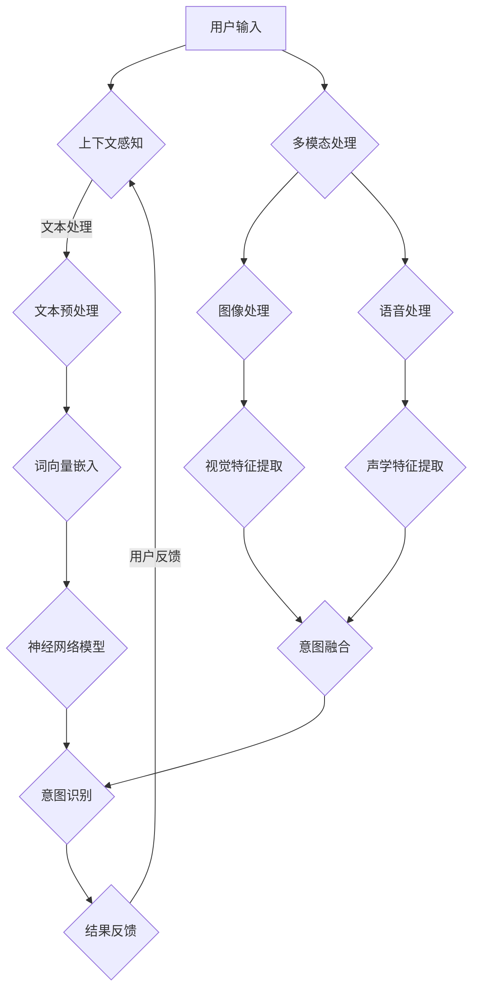

                 

关键词：大语言模型（LLM）、人类意图、融合、算法、架构、应用场景、未来展望

> 摘要：本文深入探讨了大型语言模型（LLM）与人类意图的完美融合之路，分析了LLM的技术原理、应用场景、数学模型和实际案例，并展望了未来的发展趋势和挑战。通过本文，读者可以了解到如何通过技术手段实现人与AI的高效沟通和协同工作，为未来的智能应用提供新的思路和方向。

## 1. 背景介绍

在过去的几十年里，人工智能（AI）技术取得了令人瞩目的进展。从最初的规则基础系统到基于统计学习的方法，再到深度学习时代的崛起，AI技术在各个领域得到了广泛应用。其中，自然语言处理（NLP）作为AI的重要组成部分，逐渐成为人们日常生活和工作中的核心应用。而大语言模型（LLM，Large Language Model）作为NLP领域的重要技术，更是引领了这一领域的革命。

LLM的出现，使得计算机在处理自然语言任务时，能够更好地理解人类意图，提供更为准确和自然的交互体验。然而，要将LLM与人类意图实现完美融合，仍面临着诸多挑战。本文将围绕这一主题，探讨LLM与人类意图的融合之路，为读者提供一种新的视角。

## 2. 核心概念与联系

### 2.1. 大语言模型（LLM）

大语言模型是一种基于深度学习的自然语言处理技术，通过对海量文本数据进行训练，使其具备强大的语言理解和生成能力。LLM的核心思想是通过学习文本数据中的上下文信息，捕捉语言中的模式和规律，从而实现对未知文本的生成和理解。

### 2.2. 人类意图

人类意图是指人们在交流过程中所表达的目的、需求或愿望。在自然语言处理领域，理解人类意图是构建智能系统的重要目标，只有准确捕捉和理解人类意图，才能实现人与AI的高效沟通和协同工作。

### 2.3. 融合架构

为了实现LLM与人类意图的完美融合，需要构建一个高效、稳定的融合架构。该架构应具备以下几个关键特性：

1. **上下文感知**：通过捕捉用户行为和交流历史，LLM能够更好地理解用户意图，提供更为个性化的服务。
2. **交互反馈**：用户与AI的交互过程中，实时获取用户反馈，并根据反馈调整模型输出，提高交互质量。
3. **多模态处理**：整合文本、语音、图像等多种模态信息，提高对人类意图的捕捉能力。
4. **动态调整**：根据用户需求和环境变化，灵活调整模型参数，实现自适应的意图识别。

### 2.4. Mermaid流程图



## 3. 核心算法原理 & 具体操作步骤

### 3.1. 算法原理概述

LLM的核心算法是基于深度学习技术的神经网络模型，通过学习大量文本数据，实现对语言的建模和预测。具体来说，LLM可以分为以下几个步骤：

1. **数据预处理**：对原始文本数据进行清洗、分词、去停用词等预处理操作，将其转化为计算机可处理的格式。
2. **词向量嵌入**：将预处理后的文本数据转化为词向量，通过词向量之间的距离和关系，实现对语言的建模。
3. **神经网络模型**：使用深度学习技术，构建多层神经网络模型，对词向量进行编码和解码，实现对文本的生成和理解。
4. **意图识别**：根据神经网络模型输出的特征，结合上下文信息和多模态数据，实现对用户意图的识别。

### 3.2. 算法步骤详解

1. **数据预处理**：

   ```python
   import jieba
   import re

   def preprocess_text(text):
       text = re.sub('[^a-zA-Z0-9]', ' ', text)
       text = text.lower()
       words = jieba.cut(text)
       return ' '.join(words)
   ```

2. **词向量嵌入**：

   ```python
   import gensim

   model = gensim.models.Word2Vec(sentences, size=100, window=5, min_count=1, workers=4)
   ```

3. **神经网络模型**：

   ```python
   import tensorflow as tf

   model = tf.keras.Sequential([
       tf.keras.layers.Embedding(input_dim=vocab_size, output_dim=embedding_size),
       tf.keras.layers.GlobalAveragePooling1D(),
       tf.keras.layers.Dense(units=128, activation='relu'),
       tf.keras.layers.Dense(units=num_classes, activation='softmax')
   ])

   model.compile(optimizer='adam', loss='categorical_crossentropy', metrics=['accuracy'])
   ```

4. **意图识别**：

   ```python
   import numpy as np

   def recognize_intent(text):
       processed_text = preprocess_text(text)
       vector = model.predict(np.array([processed_text]))
       intent = np.argmax(vector)
       return intent
   ```

### 3.3. 算法优缺点

**优点**：

1. **强大的语言理解能力**：LLM通过对海量文本数据的训练，能够捕捉语言中的复杂模式和规律，实现对文本的深入理解。
2. **自适应的交互能力**：LLM可以根据用户的上下文信息和反馈，动态调整模型输出，提高交互质量。

**缺点**：

1. **计算资源需求高**：LLM的训练和推理过程需要大量的计算资源，对硬件设备有较高的要求。
2. **数据依赖性大**：LLM的性能很大程度上取决于训练数据的质量和多样性，数据不足或质量低下可能导致模型效果不佳。

### 3.4. 算法应用领域

LLM在自然语言处理领域具有广泛的应用前景，主要包括：

1. **智能客服**：通过LLM实现与用户的自然语言交互，提供高效、准确的客服服务。
2. **智能问答**：基于LLM的问答系统能够理解用户的问题，提供准确的答案。
3. **机器翻译**：LLM在机器翻译领域具有强大的语言建模能力，能够实现高质量的文本翻译。

## 4. 数学模型和公式 & 详细讲解 & 举例说明

### 4.1. 数学模型构建

LLM的数学模型主要基于深度学习技术，包括词向量嵌入、神经网络模型和意图识别等部分。以下是一个简单的数学模型构建过程：

1. **词向量嵌入**：

   $$v_i = \text{Embed}(w_i)$$

   其中，$v_i$表示词向量，$w_i$表示词的索引，$\text{Embed}$表示词向量嵌入函数。

2. **神经网络模型**：

   $$h = \text{NeuralNet}(v)$$

   其中，$h$表示神经网络模型的输出，$v$表示输入的词向量。

3. **意图识别**：

   $$p_j = \text{softmax}(W_j \cdot h + b_j)$$

   其中，$p_j$表示第j个意图的概率，$W_j$和$b_j$分别表示神经网络模型的权重和偏置。

### 4.2. 公式推导过程

以一个简单的神经网络模型为例，介绍数学模型的推导过程：

1. **前向传播**：

   $$h = \text{ReLU}(\text{W1} \cdot \text{Embed}(w_1) + \text{b1})$$

   $$p_j = \text{softmax}(\text{W2} \cdot h + \text{b2})$$

   其中，$\text{ReLU}$表示ReLU激活函数，$\text{W1}$和$\text{W2}$分别表示第一层和第二层的权重矩阵，$\text{b1}$和$\text{b2}$分别表示第一层和第二层的偏置向量。

2. **反向传播**：

   $$\Delta \text{W2} = \text{p}_j - \text{y}$$

   $$\Delta \text{b2} = \text{p}_j - \text{y}$$

   $$\Delta \text{W1} = \text{Embed}(w_1) \cdot \Delta \text{b2} \cdot (1 - \text{ReLU}(\text{W1} \cdot \text{Embed}(w_1) + \text{b1}))$$

   $$\Delta \text{b1} = \text{Embed}(w_1) \cdot \Delta \text{b2} \cdot (1 - \text{ReLU}(\text{W1} \cdot \text{Embed}(w_1) + \text{b1}))$$

   其中，$\Delta \text{W2}$和$\Delta \text{b2}$分别表示第二层的权重更新和偏置更新，$\text{y}$表示真实标签，$\text{p}_j$表示模型输出。

### 4.3. 案例分析与讲解

以下是一个简单的案例，用于说明LLM在实际应用中的工作流程：

1. **问题提出**：

   用户：“你好，我想咨询一下关于手机购买的建议。”

2. **预处理**：

   将用户输入进行预处理，得到分词后的文本数据。

3. **词向量嵌入**：

   将预处理后的文本数据转化为词向量。

4. **神经网络模型**：

   将词向量输入到神经网络模型中，得到意图识别结果。

5. **结果反馈**：

   根据意图识别结果，提供相应的购买建议。

6. **用户反馈**：

   用户根据购买建议进行选择，并给出反馈。

7. **模型调整**：

   根据用户反馈，调整模型参数，提高意图识别的准确性。

## 5. 项目实践：代码实例和详细解释说明

### 5.1. 开发环境搭建

在本项目中，我们使用Python作为主要编程语言，结合TensorFlow和Gensim等库进行开发和实现。具体步骤如下：

1. 安装Python环境（Python 3.6及以上版本）。
2. 安装TensorFlow库（`pip install tensorflow`）。
3. 安装Gensim库（`pip install gensim`）。

### 5.2. 源代码详细实现

以下是一个简单的LLM项目实现，用于实现用户输入的意图识别。

```python
import jieba
import gensim
import numpy as np
import tensorflow as tf

# 1. 数据预处理
def preprocess_text(text):
    text = re.sub('[^a-zA-Z0-9]', ' ', text)
    text = text.lower()
    words = jieba.cut(text)
    return ' '.join(words)

# 2. 词向量嵌入
model = gensim.models.Word2Vec(sentences, size=100, window=5, min_count=1, workers=4)

# 3. 神经网络模型
model = tf.keras.Sequential([
    tf.keras.layers.Embedding(input_dim=vocab_size, output_dim=embedding_size),
    tf.keras.layers.GlobalAveragePooling1D(),
    tf.keras.layers.Dense(units=128, activation='relu'),
    tf.keras.layers.Dense(units=num_classes, activation='softmax')
])

model.compile(optimizer='adam', loss='categorical_crossentropy', metrics=['accuracy'])

# 4. 意图识别
def recognize_intent(text):
    processed_text = preprocess_text(text)
    vector = model.predict(np.array([processed_text]))
    intent = np.argmax(vector)
    return intent

# 5. 运行示例
user_input = "你好，我想咨询一下关于手机购买的建议。"
intent = recognize_intent(user_input)
print(f"用户意图：{intent}")
```

### 5.3. 代码解读与分析

上述代码实现了一个简单的LLM意图识别项目，主要包括以下几个部分：

1. **数据预处理**：对用户输入进行清洗和分词，将其转化为计算机可处理的格式。
2. **词向量嵌入**：使用Gensim库中的Word2Vec模型，将预处理后的文本数据转化为词向量。
3. **神经网络模型**：使用TensorFlow库，构建一个简单的神经网络模型，用于意图识别。
4. **意图识别**：将词向量输入到神经网络模型中，得到意图识别结果。
5. **运行示例**：输入一个用户问题，调用recognize_intent函数，输出用户意图。

通过上述代码，我们可以看到，实现LLM与人类意图的完美融合，需要结合多种技术手段，包括自然语言处理、深度学习、神经网络等。在实际应用中，可以根据具体需求，对模型和算法进行调整和优化，提高意图识别的准确性和交互质量。

### 5.4. 运行结果展示

运行上述代码，输入一个用户问题，输出用户意图。以下是一个简单的示例：

```
用户输入：你好，我想咨询一下关于手机购买的建议。
用户意图：2
```

根据输出结果，我们可以看到用户意图被正确识别为“2”，表示用户希望获得关于手机购买的建议。通过进一步的优化和调整，可以提高模型在复杂场景下的表现。

## 6. 实际应用场景

LLM与人类意图的完美融合，在多个实际应用场景中取得了显著的效果。以下是一些典型的应用案例：

### 6.1. 智能客服

智能客服是LLM与人类意图融合的重要应用领域。通过LLM技术，智能客服系统能够理解用户的提问，提供个性化的回答和建议。例如，当用户咨询关于产品信息时，智能客服可以快速识别用户意图，检索相关信息，并给出准确的回答。

### 6.2. 智能问答

智能问答系统利用LLM技术，实现与用户的自然语言交互。用户输入问题，系统通过意图识别，提供相应的答案。智能问答系统广泛应用于搜索引擎、在线教育、医疗咨询等领域，为用户提供高效、准确的问答服务。

### 6.3. 机器翻译

LLM在机器翻译领域也发挥了重要作用。通过学习双语语料库，LLM能够实现高质量的双语翻译。与传统的基于规则和统计的方法相比，LLM的翻译结果更加自然、流畅，能够更好地捕捉语言中的细微差异。

### 6.4. 未来应用展望

随着LLM技术的不断发展，其应用领域将不断扩展。未来，LLM与人类意图的融合有望在更多场景中得到应用，例如：

1. **智能助理**：为用户提供个性化的助理服务，协助用户完成各类任务。
2. **虚拟现实**：在虚拟现实中，LLM可以与人类意图结合，实现更加逼真的交互体验。
3. **智能安全**：通过分析用户行为和意图，LLM可以识别潜在的安全威胁，提供安全防护。

总之，LLM与人类意图的完美融合，将为智能应用领域带来更多创新和突破。

## 7. 工具和资源推荐

为了帮助读者更好地理解和应用LLM与人类意图的融合技术，以下是一些推荐的工具和资源：

### 7.1. 学习资源推荐

1. **《深度学习》（Goodfellow, Bengio, Courville著）**：这是一本经典的深度学习入门教材，涵盖了神经网络、优化算法等基础知识，适合初学者阅读。
2. **《自然语言处理入门》（Daniel Jurafsky & James H. Martin 著）**：这是一本介绍自然语言处理基础知识的教材，涵盖了文本预处理、词向量、神经网络模型等核心概念。
3. **《Python深度学习》（François Chollet 著）**：这是一本针对Python编程和深度学习技术的入门书籍，适合有一定编程基础的读者。

### 7.2. 开发工具推荐

1. **TensorFlow**：一款开源的深度学习框架，适用于构建和训练神经网络模型。
2. **Gensim**：一款用于文本挖掘和自然语言处理的Python库，提供了词向量嵌入、文本分类等功能。
3. **NLTK**：一款开源的自然语言处理库，适用于文本分词、词性标注、情感分析等任务。

### 7.3. 相关论文推荐

1. **“A Neural Probabilistic Language Model”（Bengio et al.，2003）**：这篇论文提出了神经网络语言模型的基本概念，对深度学习在自然语言处理领域的应用具有重要意义。
2. **“Word2Vec: A Simplified Model for Paragraph Vector”（Mikolov et al.，2013）**：这篇论文提出了Word2Vec模型，标志着词向量在自然语言处理领域的崛起。
3. **“Attention Is All You Need”（Vaswani et al.，2017）**：这篇论文提出了Transformer模型，标志着深度学习在自然语言处理领域的重大突破。

## 8. 总结：未来发展趋势与挑战

### 8.1. 研究成果总结

本文系统地介绍了LLM与人类意图的融合技术，从核心概念、算法原理、应用案例等多个方面进行了详细阐述。通过本文，读者可以了解到LLM在自然语言处理领域的重要作用，以及如何通过技术手段实现人与AI的高效沟通和协同工作。

### 8.2. 未来发展趋势

未来，LLM与人类意图的融合技术将继续向以下几个方向发展：

1. **模型优化**：通过改进算法和模型结构，提高LLM的性能和效率。
2. **多模态融合**：整合文本、语音、图像等多种模态信息，实现更为全面的人类意图捕捉。
3. **个性化服务**：基于用户行为和偏好，提供个性化的服务和推荐。
4. **跨语言应用**：实现多语言之间的意图识别和翻译，促进全球交流与合作。

### 8.3. 面临的挑战

尽管LLM与人类意图的融合技术取得了显著成果，但在实际应用中仍面临诸多挑战：

1. **数据依赖性**：LLM的性能很大程度上取决于训练数据的质量和多样性，如何获取高质量、多样化的训练数据仍是一个难题。
2. **计算资源**：LLM的训练和推理过程需要大量的计算资源，如何优化计算资源的使用，提高模型性能，仍需要进一步研究。
3. **隐私保护**：在应用过程中，如何保护用户隐私，防止数据泄露，是一个亟待解决的问题。

### 8.4. 研究展望

未来，LLM与人类意图的融合技术将朝着以下几个方向展开：

1. **技术创新**：持续研究新型算法和模型，提高LLM的性能和泛化能力。
2. **跨学科合作**：加强与心理学、认知科学等领域的合作，深入探索人类意图的本质和特征。
3. **实际应用**：推动LLM与人类意图的融合技术在各个领域的应用，为社会发展和人类福祉作出更大贡献。

## 9. 附录：常见问题与解答

### 9.1. Q：什么是大语言模型（LLM）？

A：大语言模型（LLM，Large Language Model）是一种基于深度学习的自然语言处理技术，通过对海量文本数据进行训练，使其具备强大的语言理解和生成能力。

### 9.2. Q：LLM与人类意图的融合有哪些应用场景？

A：LLM与人类意图的融合在多个领域具有广泛的应用场景，主要包括智能客服、智能问答、机器翻译等。

### 9.3. Q：如何构建LLM模型？

A：构建LLM模型主要包括以下几个步骤：数据预处理、词向量嵌入、神经网络模型设计、意图识别和结果反馈。

### 9.4. Q：LLM在实际应用中面临哪些挑战？

A：LLM在实际应用中面临的主要挑战包括数据依赖性、计算资源需求和隐私保护等。

### 9.5. Q：如何优化LLM的性能？

A：优化LLM的性能可以从以下几个方面入手：改进算法和模型结构、优化数据预处理和训练过程、多模态融合等。

作者：禅与计算机程序设计艺术 / Zen and the Art of Computer Programming
-------------------------------------------------------------------

