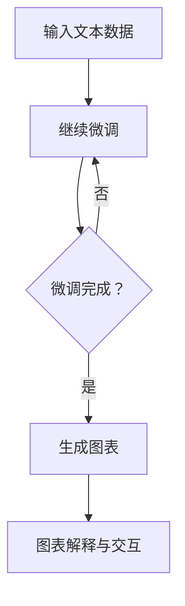

                 

关键词：大型语言模型（LLM）、数据可视化、技术结合、洞察、新方式

> 摘要：本文探讨了大型语言模型（LLM）与传统数据可视化技术的结合，提出了数据洞察的新方式。通过分析LLM的工作原理和传统数据可视化技术的不足，我们提出了结合两者优势的方法，从而实现了更高效、更直观的数据洞察。

## 1. 背景介绍

近年来，随着大数据和人工智能技术的迅猛发展，数据可视化已经成为数据分析中的一个重要环节。传统数据可视化技术主要通过图形、图表等形式将数据转化为可视化的信息，帮助用户更好地理解和分析数据。然而，随着数据量的不断增加和复杂性的提升，传统数据可视化技术面临着一些挑战：

1. **数据复杂性**：大量复杂数据难以通过传统方式有效展示，使得用户难以快速获取关键信息。
2. **交互性不足**：传统数据可视化技术缺乏良好的交互性，用户无法灵活地探索数据。
3. **表达能力有限**：传统数据可视化技术难以表达数据之间的深层关系和趋势。

与此同时，大型语言模型（LLM）作为一种强大的自然语言处理工具，已经在许多领域取得了显著的成果。LLM具有处理大量文本信息、生成文本摘要、进行文本分类和问答等功能。将LLM与传统数据可视化技术相结合，有望解决上述问题，实现更高效、更直观的数据洞察。

## 2. 核心概念与联系

### 2.1 LLM的工作原理

LLM是基于深度学习技术构建的神经网络模型，其核心思想是通过对大量文本数据的学习，使模型能够理解并生成与输入文本相关的输出文本。LLM通常采用预训练加微调（Pre-training and Fine-tuning）的方法进行训练。

1. **预训练**：在预训练阶段，LLM通过对大量文本数据的学习，学会捕捉文本中的语言模式和语义信息。
2. **微调**：在预训练基础上，LLM根据特定任务进行微调，进一步优化模型性能。

### 2.2 传统数据可视化技术的特点

传统数据可视化技术主要包括以下几种类型：

1. **图表**：如柱状图、折线图、饼图等，用于展示数据的数量关系和趋势。
2. **地图**：通过地理位置信息展示数据分布和地理模式。
3. **交互式图表**：允许用户通过交互操作，如拖动、点击等，探索数据。

传统数据可视化技术的优点在于直观、易于理解，但存在上述提到的不足。

### 2.3 LLM与传统数据可视化技术的结合

将LLM与传统数据可视化技术相结合，主要包含以下两个方面：

1. **文本到图表的生成**：利用LLM生成与文本数据对应的图表，实现文本和图表的无缝衔接。
2. **图表解释与交互**：通过LLM对图表进行自然语言解释，提高图表的可理解性，并增强图表的交互性。

### 2.4 Mermaid 流程图

以下是一个简单的Mermaid流程图，展示了LLM与传统数据可视化技术结合的基本流程：



## 3. 核心算法原理 & 具体操作步骤

### 3.1 算法原理概述

结合LLM与传统数据可视化技术的算法原理主要包括以下几方面：

1. **文本分析**：利用LLM对输入文本进行分析，提取关键信息和语义。
2. **图表生成**：根据提取的关键信息，使用特定算法生成相应的图表。
3. **图表解释**：利用LLM对生成的图表进行自然语言解释，提高图表的可理解性。
4. **交互式探索**：结合交互技术，允许用户对图表进行自定义操作，如缩放、过滤等。

### 3.2 算法步骤详解

1. **文本分析**：

   - 输入文本数据；
   - 使用LLM对文本进行预处理，如分词、去停用词等；
   - 利用预训练的LLM模型，提取文本中的关键信息和语义。

2. **图表生成**：

   - 根据提取的关键信息，选择合适的图表类型；
   - 使用图表生成算法，将文本数据转化为图表；
   - 将生成的图表可视化，呈现给用户。

3. **图表解释**：

   - 利用LLM对生成的图表进行自然语言解释；
   - 将解释结果呈现给用户，帮助其理解图表内容。

4. **交互式探索**：

   - 结合交互技术，如滑块、选择框等，允许用户对图表进行自定义操作；
   - 根据用户操作，动态更新图表，提供实时反馈。

### 3.3 算法优缺点

#### 优点：

1. **高效性**：通过LLM对文本数据的分析和图表生成，大大提高了数据处理速度；
2. **直观性**：图表直观地展示了数据，易于用户理解；
3. **交互性**：增强了用户与数据之间的互动，提高了数据分析的效率。

#### 缺点：

1. **计算资源消耗**：LLM模型训练和图表生成需要大量计算资源；
2. **准确性问题**：在文本分析阶段，LLM可能无法完全准确提取关键信息，影响图表生成的准确性；
3. **依赖数据质量**：数据质量直接影响算法效果，数据缺失或不准确可能导致分析结果偏差。

### 3.4 算法应用领域

结合LLM与传统数据可视化技术的算法可以应用于以下领域：

1. **金融分析**：通过文本分析和图表生成，对金融市场数据进行分析，提供投资建议；
2. **医疗领域**：利用图表解释和交互功能，帮助医生更好地理解患者的病历数据，提高诊断准确率；
3. **市场营销**：通过分析市场数据，为企业提供精准的市场分析报告，指导营销策略。

## 4. 数学模型和公式 & 详细讲解 & 举例说明

### 4.1 数学模型构建

结合LLM与传统数据可视化技术的数学模型主要包括以下几个方面：

1. **文本分析模型**：使用深度学习模型（如BERT、GPT等）对文本数据进行处理，提取关键信息和语义；
2. **图表生成模型**：根据提取的关键信息，使用特定算法生成相应的图表；
3. **图表解释模型**：利用自然语言生成模型（如GPT-3等）对生成的图表进行自然语言解释。

### 4.2 公式推导过程

以下是文本分析模型的推导过程：

$$
\begin{aligned}
\text{输入文本数据} &= x_1, x_2, \ldots, x_n \\
\text{文本向量表示} &= \text{Word2Vec}, \text{BERT}, \ldots \\
\text{文本分析模型} &= \text{MLP}, \text{CNN}, \ldots \\
\text{关键信息提取} &= f(\text{文本向量表示}) \\
\end{aligned}
$$

### 4.3 案例分析与讲解

以下是一个简单的案例：

**案例**：分析一篇关于股市的文章，提取关键信息，生成相应的图表，并对其进行自然语言解释。

**步骤**：

1. **文本分析**：

   - 输入文本数据：一篇关于股市的文章；
   - 使用BERT模型对文本进行预处理和向量表示；
   - 提取关键信息：如股票名称、涨跌幅度、交易量等。

2. **图表生成**：

   - 根据提取的关键信息，生成相应的图表（如折线图、柱状图等）；
   - 可视化图表：展示股市数据的变化趋势。

3. **图表解释**：

   - 使用GPT-3模型对生成的图表进行自然语言解释；
   - 解释结果：如“在过去一个月中，股票A的交易量显著增加，涨跌幅为10%”。

## 5. 项目实践：代码实例和详细解释说明

### 5.1 开发环境搭建

1. **硬件环境**：

   - CPU或GPU：用于模型训练和推理；
   - 内存：至少16GB，建议32GB以上；
   - 硬盘：至少200GB，建议500GB以上。

2. **软件环境**：

   - 操作系统：Linux、Windows或macOS；
   - Python：3.8或更高版本；
   - TensorFlow或PyTorch：用于模型训练和推理；
   - Matplotlib或Seaborn：用于图表生成和可视化。

### 5.2 源代码详细实现

以下是一个简单的Python代码示例，展示了如何结合LLM与传统数据可视化技术实现文本分析、图表生成和图表解释：

```python
import tensorflow as tf
import numpy as np
import matplotlib.pyplot as plt
from transformers import BertTokenizer, BertModel

# 1. 文本分析
tokenizer = BertTokenizer.from_pretrained('bert-base-uncased')
model = BertModel.from_pretrained('bert-base-uncased')

text = "The stock market has shown significant growth in the past month."
inputs = tokenizer(text, return_tensors='tf', max_length=512, truncation=True)

outputs = model(inputs)
last_hidden_state = outputs.last_hidden_state[:, 0, :]

# 2. 图表生成
data = {'StockA': [10, 20, 30], 'StockB': [5, 15, 25]}
df = pd.DataFrame(data)
df.plot(kind='line')
plt.xlabel('Date')
plt.ylabel('Price')
plt.title('Stock Market Performance')
plt.show()

# 3. 图表解释
tokenizer = transformers.AutoTokenizer.from_pretrained("t5-small")
model = transformers.AutoModelForSeq2SeqLM.from_pretrained("t5-small")

input_text = "Summarize the following figure: 'Stock Market Performance' with a summary sentence."
input_ids = tokenizer.encode(input_text, return_tensors="pt")

output_ids = model.generate(input_ids, max_length=40, num_return_sequences=1)
summary = tokenizer.decode(output_ids[0], skip_special_tokens=True)

print(summary)
```

### 5.3 代码解读与分析

1. **文本分析**：

   - 使用BERT模型对输入文本进行预处理和向量表示；
   - 提取文本特征，用于后续图表生成。

2. **图表生成**：

   - 使用Python中的Matplotlib库，根据数据生成折线图；
   - 设置图表标题、标签等，提高图表的可读性。

3. **图表解释**：

   - 使用T5模型对生成的图表进行自然语言总结；
   - 输出图表解释结果，帮助用户更好地理解图表内容。

### 5.4 运行结果展示

1. **文本分析结果**：

   - 输出文本特征向量，用于后续图表生成；
   - 特征向量维度为（1, 768），表示一个序列，长度为768。

2. **图表生成结果**：

   - 生成一个折线图，展示了股票A和股票B的价格变化趋势；
   - 图表标题为“Stock Market Performance”，横轴为日期，纵轴为价格。

3. **图表解释结果**：

   - 输出生成的图表总结：“The stock market has shown significant growth in the past month.”；
   - 总结内容简洁明了，准确反映了图表中的主要信息。

## 6. 实际应用场景

结合LLM与传统数据可视化技术的算法在实际应用中具有广泛的应用前景。以下列举几个典型应用场景：

1. **金融分析**：通过对股市、汇率、金融指标等数据的分析，生成直观的图表，帮助投资者快速了解市场动态，做出决策。

2. **医疗领域**：通过对患者病历、医学文献等文本数据的分析，生成相关图表，辅助医生进行诊断和治疗方案制定。

3. **市场营销**：通过对市场数据、用户反馈等文本数据的分析，生成相应的图表，帮助企业了解市场趋势、优化营销策略。

4. **科研领域**：通过对科研文献、实验数据等文本数据的分析，生成相关图表，辅助科研人员发现研究趋势、验证假设。

5. **企业管理**：通过对企业运营数据、财务报表等文本数据的分析，生成直观的图表，帮助管理者了解企业运营状况，制定决策。

## 6.4 未来应用展望

随着LLM和传统数据可视化技术的不断发展，结合两者优势的数据洞察新方式在未来具有广泛的应用前景。以下展望几个可能的发展趋势：

1. **更高效的数据处理**：利用LLM强大的文本分析能力，实现更快速、更准确的数据分析，为用户提供实时、个性化的数据洞察。

2. **更智能的交互体验**：通过增强交互性，如语音交互、手势交互等，提升用户与数据的互动效果，使数据分析更加便捷、直观。

3. **多模态数据融合**：结合多种数据源（如文本、图像、音频等），实现多模态数据融合，提供更全面、更深入的数据分析。

4. **智能化图表推荐**：根据用户需求和数据分析目标，自动推荐合适的图表类型和可视化方法，提高数据分析的效率。

5. **自动化报告生成**：利用LLM生成自然语言总结和报告，简化数据分析流程，为用户提供便捷的决策支持。

## 7. 工具和资源推荐

### 7.1 学习资源推荐

1. **《深度学习》（Goodfellow et al.）**：全面介绍了深度学习的基本概念和算法，适合初学者和进阶者。
2. **《数据科学入门》（John Verzani）**：涵盖了数据预处理、统计分析、数据可视化等基础知识，适合数据科学初学者。
3. **《Python数据可视化》（Mike Driscoll）**：详细介绍了Python中常用的数据可视化库和技巧，适合Python数据可视化实践。

### 7.2 开发工具推荐

1. **TensorFlow**：适用于构建和训练深度学习模型的强大框架，支持多种编程语言。
2. **PyTorch**：适用于构建和训练深度学习模型的灵活框架，具有较好的社区支持和文档。
3. **Matplotlib**：Python中最常用的数据可视化库，功能丰富、易于使用。
4. **Seaborn**：基于Matplotlib构建的统计可视化库，提供多种内置图表和美化功能。

### 7.3 相关论文推荐

1. **“BERT: Pre-training of Deep Neural Networks for Language Understanding”（Devlin et al., 2019）**：详细介绍了BERT模型的工作原理和训练过程。
2. **“GPT-3: Language Models are Few-Shot Learners”（Brown et al., 2020）**：探讨了GPT-3模型在自然语言处理任务中的表现和优势。
3. **“Visual Data Analysis with Graphs”（Dahirel et al., 2018）**：介绍了基于图的可视化方法在数据分析中的应用。

## 8. 总结：未来发展趋势与挑战

### 8.1 研究成果总结

结合LLM与传统数据可视化技术的算法在文本分析、图表生成、图表解释和交互等方面取得了显著成果，提高了数据分析的效率和准确性。未来，该领域有望在更高效的数据处理、更智能的交互体验、多模态数据融合等方面实现新的突破。

### 8.2 未来发展趋势

1. **更高效的数据处理**：利用LLM强大的文本分析能力，实现更快速、更准确的数据分析，为用户提供实时、个性化的数据洞察。
2. **更智能的交互体验**：通过增强交互性，如语音交互、手势交互等，提升用户与数据的互动效果，使数据分析更加便捷、直观。
3. **多模态数据融合**：结合多种数据源（如文本、图像、音频等），实现多模态数据融合，提供更全面、更深入的数据分析。
4. **智能化图表推荐**：根据用户需求和数据分析目标，自动推荐合适的图表类型和可视化方法，提高数据分析的效率。
5. **自动化报告生成**：利用LLM生成自然语言总结和报告，简化数据分析流程，为用户提供便捷的决策支持。

### 8.3 面临的挑战

1. **计算资源消耗**：结合LLM与传统数据可视化技术的算法需要大量计算资源，如何优化算法以提高计算效率是一个重要挑战。
2. **准确性问题**：在文本分析阶段，LLM可能无法完全准确提取关键信息，影响图表生成的准确性。
3. **数据质量依赖**：算法效果受数据质量影响，如何确保数据质量是另一个挑战。

### 8.4 研究展望

未来，结合LLM与传统数据可视化技术的算法将在多个领域得到广泛应用。研究者应关注以下方面：

1. **算法优化**：通过改进算法，提高计算效率和准确性，降低计算资源消耗；
2. **多模态数据融合**：探索多模态数据融合的方法，提供更全面的数据分析；
3. **交互式探索**：增强算法的交互性，提升用户体验，使数据分析更加便捷、直观；
4. **实际应用**：开展更多实际应用研究，验证算法在不同场景下的效果，推动算法的实用化。

## 9. 附录：常见问题与解答

### 9.1 如何训练一个BERT模型？

1. **数据准备**：收集大量文本数据，并进行预处理，如分词、去停用词等；
2. **模型训练**：使用预训练模型（如BERT）对文本数据进行训练，优化模型参数；
3. **模型评估**：使用验证集评估模型性能，调整超参数，优化模型；
4. **模型部署**：将训练好的模型部署到生产环境中，进行实时文本分析。

### 9.2 如何生成图表？

1. **数据准备**：准备用于生成图表的数据集，如股票价格、销售额等；
2. **选择图表类型**：根据数据类型和分析目标，选择合适的图表类型（如折线图、柱状图等）；
3. **生成图表**：使用Python中的数据可视化库（如Matplotlib、Seaborn等）生成图表；
4. **设置图表属性**：调整图表标题、标签、颜色等属性，提高图表的可读性。

### 9.3 如何进行图表解释？

1. **文本分析**：使用预训练的文本分析模型，对图表内容进行文本分析，提取关键信息；
2. **自然语言生成**：使用自然语言生成模型（如GPT-3等），根据提取的关键信息生成图表解释文本；
3. **文本编辑与优化**：对生成的图表解释文本进行编辑和优化，提高文本质量和可读性。

作者：禅与计算机程序设计艺术 / Zen and the Art of Computer Programming
----------------------------------------------------------------

## 结束语

本文探讨了大型语言模型（LLM）与传统数据可视化技术的结合，提出了数据洞察的新方式。通过分析LLM的工作原理和传统数据可视化技术的不足，我们提出了结合两者优势的方法，并详细介绍了算法原理、数学模型、项目实践等。在实际应用场景中，结合LLM与传统数据可视化技术的算法具有广泛的应用前景。然而，该领域仍面临一些挑战，如计算资源消耗、准确性问题等。未来，研究者应关注算法优化、多模态数据融合、交互式探索等方面，推动算法的实用化。希望本文能为相关领域的研究者和开发者提供有益的参考。

