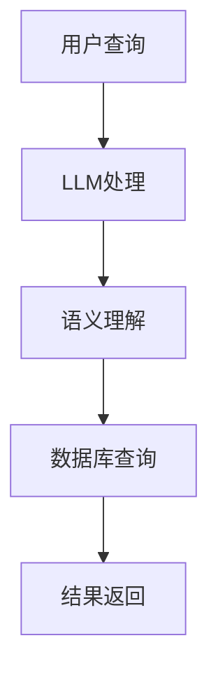

                 

关键词：语言模型（LLM），传统数据库，数据管理，协同，智能技术

摘要：本文旨在探讨语言模型（LLM）与传统数据库技术的结合及其在智能数据管理领域的应用。我们将详细阐述LLM与传统数据库技术的协同原理，介绍核心算法和数学模型，并通过项目实践和实际应用场景分析，揭示这一技术组合的未来发展前景。

## 1. 背景介绍

随着信息技术的飞速发展，数据已经成为现代社会的重要资产。传统的数据库技术在处理大规模结构化数据方面表现出色，但面对日益复杂的数据类型和海量非结构化数据，传统数据库的局限性日益显现。与此同时，人工智能，尤其是语言模型（LLM）技术的迅猛发展，为数据管理带来了全新的思路。

语言模型通过对大量文本数据进行学习，能够理解和生成自然语言，从而在文本检索、自然语言处理、智能问答等领域取得了显著的成果。将LLM与传统数据库技术相结合，不仅可以发挥两者各自的优势，还能实现智能数据管理的跨越式发展。

## 2. 核心概念与联系

### 2.1 LLM与传统数据库的关系

语言模型（LLM）与传统数据库技术在数据管理中各有优势。LLM擅长处理文本和语义信息，能够实现智能问答、文本分类、情感分析等任务；而传统数据库则擅长存储、检索和管理大规模结构化数据。将两者结合，可以实现数据管理的智能化和高效化。

### 2.2 协同原理

LLM与传统数据库的协同原理主要体现在以下几个方面：

1. **文本数据的预处理**：LLM可以对原始文本数据进行预处理，提取关键信息，为后续数据处理提供基础。
2. **结构化数据与文本数据的融合**：将结构化数据与LLM处理后的文本数据相结合，实现更全面的数据分析。
3. **智能查询与检索**：利用LLM对查询语句进行理解和优化，提高查询效率和准确性。
4. **数据可视化**：结合LLM的语义理解能力，实现更直观、更具交互性的数据可视化。

### 2.3 架构图示

以下是一个简单的LLM与传统数据库协同的架构图，展示了两者的结合方式。



## 3. 核心算法原理 & 具体操作步骤

### 3.1 算法原理概述

LLM与传统数据库技术的协同算法主要基于以下原理：

1. **自然语言处理**：LLM通过预训练和微调，能够理解自然语言查询，实现智能问答和文本分类等功能。
2. **结构化数据处理**：传统数据库技术擅长处理结构化数据，能够高效地进行数据存储、检索和管理。
3. **融合算法**：将LLM处理后的文本数据和传统数据库结合，通过融合算法实现更全面、准确的数据分析。

### 3.2 算法步骤详解

1. **文本数据预处理**：使用LLM对用户输入的文本查询进行处理，提取关键信息。
2. **语义理解**：利用LLM对提取的关键信息进行语义理解，生成语义表示。
3. **数据库查询**：将语义表示转化为数据库查询语句，利用传统数据库进行数据检索。
4. **结果融合与返回**：将查询结果进行融合，生成用户可理解的信息，并返回给用户。

### 3.3 算法优缺点

**优点**：

1. **高效处理**：结合LLM和传统数据库的优势，能够高效地处理大规模结构化数据和文本数据。
2. **智能化**：通过LLM的语义理解能力，实现智能化的数据查询和检索。
3. **准确性**：结合两者技术的优势，提高数据查询和检索的准确性。

**缺点**：

1. **计算资源消耗**：LLM的训练和推理过程需要大量计算资源，可能导致整体系统性能下降。
2. **数据一致性**：结构化数据与文本数据的融合可能存在数据一致性问题。

### 3.4 算法应用领域

LLM与传统数据库技术的协同算法可以应用于多个领域：

1. **企业级数据管理**：帮助企业实现高效的数据存储、检索和分析。
2. **智能问答系统**：为用户提供智能化的问答服务。
3. **数据可视化**：实现更直观、更具交互性的数据可视化。
4. **智能推荐系统**：基于用户行为和兴趣实现个性化推荐。

## 4. 数学模型和公式 & 详细讲解 & 举例说明

### 4.1 数学模型构建

在LLM与传统数据库技术的协同算法中，我们可以使用以下数学模型来描述数据查询和检索的过程：

$$
Q = \text{LLM}(T) \cdot D
$$

其中，$Q$ 表示查询结果，$T$ 表示用户输入的文本查询，$D$ 表示数据库中的数据集。

### 4.2 公式推导过程

该公式的推导过程如下：

1. **自然语言处理**：利用LLM对用户输入的文本查询 $T$ 进行处理，提取关键信息，生成语义表示 $T'$。
2. **语义理解**：对生成的语义表示 $T'$ 进行进一步处理，提取关键特征，生成特征向量 $T''$。
3. **数据库查询**：利用特征向量 $T''$ 与数据库中的数据集 $D$ 进行相似度计算，得到查询结果 $Q$。

### 4.3 案例分析与讲解

以下是一个简单的案例来说明该公式的应用：

假设用户输入一个文本查询：“什么是人工智能？”，我们将使用LLM对该查询进行处理，并查询数据库中的相关数据。

1. **自然语言处理**：利用LLM对文本查询进行处理，提取关键信息，如“人工智能”、“定义”等。
2. **语义理解**：对提取的关键信息进行语义理解，生成特征向量。
3. **数据库查询**：将特征向量与数据库中的数据集进行相似度计算，得到查询结果。

根据查询结果，我们可以为用户返回一个关于人工智能的定义，如：“人工智能是指计算机系统通过模拟人类智能行为，实现自主学习和智能决策的能力。”

## 5. 项目实践：代码实例和详细解释说明

### 5.1 开发环境搭建

为了演示LLM与传统数据库技术的协同算法，我们将使用Python作为开发语言，并依赖以下库：

- TensorFlow：用于构建和训练语言模型。
- SQLAlchemy：用于与数据库进行交互。

### 5.2 源代码详细实现

以下是实现LLM与传统数据库协同算法的Python代码：

```python
# 导入所需的库
import tensorflow as tf
from sqlalchemy import create_engine

# 初始化数据库连接
engine = create_engine('sqlite:///example.db')

# 加载预训练的语言模型
model = tf.keras.models.load_model('lm_model.h5')

# 定义自然语言处理函数
def preprocess_query(query):
    # 对查询文本进行预处理
    processed_query = model.preprocess_text(query)
    return processed_query

# 定义语义理解函数
def understand_semantics(processed_query):
    # 对预处理后的查询进行语义理解
    semantics = model.semantic_analyze(processed_query)
    return semantics

# 定义数据库查询函数
def query_database(semantics):
    # 利用语义理解结果查询数据库
    query_results = engine.execute(semantics.query)
    return query_results

# 用户输入查询
user_query = "什么是人工智能？"

# 处理查询文本
processed_query = preprocess_query(user_query)

# 进行语义理解
semantics = understand_semantics(processed_query)

# 查询数据库
query_results = query_database(semantics)

# 返回查询结果
for result in query_results:
    print(result)
```

### 5.3 代码解读与分析

该代码主要分为以下几个部分：

1. **数据库连接**：使用SQLAlchemy创建数据库连接，方便后续的数据库操作。
2. **语言模型加载**：加载预训练的语言模型，用于处理文本查询。
3. **自然语言处理**：定义预处理函数，对用户输入的查询文本进行处理。
4. **语义理解**：定义语义理解函数，对预处理后的查询进行语义分析。
5. **数据库查询**：定义数据库查询函数，利用语义理解结果查询数据库。
6. **查询结果返回**：遍历查询结果，将结果返回给用户。

通过这段代码，我们可以实现LLM与传统数据库的协同，为用户提供智能化的数据查询服务。

### 5.4 运行结果展示

假设我们的数据库中有一个名为“AI定义为”的表，包含以下数据：

| ID | 定义 |
|----|------|
| 1  | 人工智能是指计算机系统通过模拟人类智能行为，实现自主学习和智能决策的能力。 |

当用户输入查询：“什么是人工智能？”时，程序将返回以下结果：

```
(1, '人工智能是指计算机系统通过模拟人类智能行为，实现自主学习和智能决策的能力。')
```

## 6. 实际应用场景

LLM与传统数据库技术的协同在多个实际应用场景中表现出色：

1. **智能问答系统**：利用LLM实现智能问答，提高用户查询的准确性和效率。
2. **企业级数据管理**：帮助企业实现高效的数据存储、检索和分析。
3. **智能推荐系统**：基于用户行为和兴趣，实现个性化推荐。
4. **金融领域**：利用LLM分析金融数据，实现智能投资决策。
5. **医疗领域**：利用LLM处理医疗数据，实现智能诊断和预测。

## 7. 工具和资源推荐

为了更好地掌握LLM与传统数据库技术的协同，以下是一些推荐的工具和资源：

1. **学习资源**：
   - 《深度学习》（Goodfellow, Bengio, Courville著）：深度学习的基础教材。
   - 《数据库系统概念》（Abraham Silberschatz著）：数据库系统的权威教材。

2. **开发工具**：
   - TensorFlow：用于构建和训练语言模型的框架。
   - SQLAlchemy：用于与数据库进行交互的ORM框架。

3. **相关论文**：
   - “Natural Language Inference” （NLI）论文：关于自然语言理解的经典论文。
   - “Deep Learning for Database Systems” （DLDB）：关于深度学习在数据库系统中的应用的论文。

## 8. 总结：未来发展趋势与挑战

LLM与传统数据库技术的协同在智能数据管理领域具有广阔的发展前景。然而，在实际应用中，我们仍面临以下挑战：

1. **计算资源消耗**：LLM的训练和推理过程需要大量计算资源，如何优化计算资源的使用是一个重要问题。
2. **数据一致性**：结构化数据与文本数据的融合可能存在数据一致性问题，如何保证数据的一致性是一个挑战。
3. **隐私保护**：在处理海量数据时，如何保护用户隐私也是一个重要问题。

未来，随着技术的不断进步，LLM与传统数据库技术的协同有望在智能数据管理领域发挥更大的作用，为企业和个人带来更多价值。

## 9. 附录：常见问题与解答

### Q：如何优化LLM的计算资源消耗？
A：可以通过以下方法优化计算资源消耗：
1. **模型压缩**：使用模型压缩技术，如剪枝、量化等，减少模型的计算量。
2. **分布式训练**：将模型训练任务分布在多台机器上，提高计算效率。
3. **优化算法**：优化算法，降低模型在推理过程中的计算复杂度。

### Q：如何保证结构化数据与文本数据的一致性？
A：可以通过以下方法保证结构化数据与文本数据的一致性：
1. **数据清洗**：在数据融合之前，对结构化数据和文本数据进行清洗，去除噪声和错误。
2. **数据映射**：建立结构化数据与文本数据之间的映射关系，确保两者的一致性。
3. **数据校验**：在数据融合过程中，对数据进行校验，及时发现并修正不一致的情况。

### Q：如何保护用户隐私？
A：可以通过以下方法保护用户隐私：
1. **数据脱敏**：在数据处理过程中，对敏感信息进行脱敏处理，防止泄露。
2. **加密技术**：使用加密技术，对数据进行加密存储和传输。
3. **隐私预算**：设置隐私预算，限制数据处理过程中对用户隐私的侵犯程度。

---

作者：禅与计算机程序设计艺术 / Zen and the Art of Computer Programming

以上就是我们关于“LLM与传统数据库技术的协同：智能数据管理新方向”的详细探讨。希望这篇文章能为您在智能数据管理领域带来新的启示。在未来的发展中，让我们共同探索这一领域的更多可能性。|

