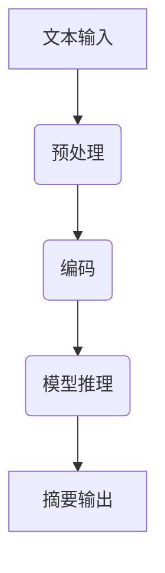
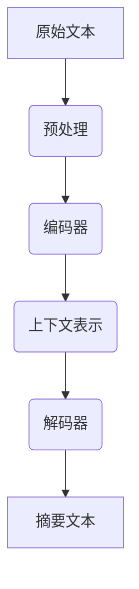
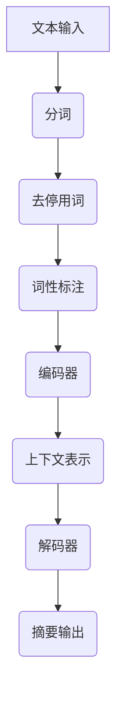

                 

 关键词：大型语言模型，文本摘要，自然语言处理，对比分析，算法优化，应用场景，发展趋势

> 摘要：本文深入探讨了大型语言模型（LLM）与传统文本摘要技术之间的对比。首先介绍了文本摘要的基本概念，随后分析了LLM的核心原理和架构。在此基础上，本文详细对比了LLM与传统文本摘要技术的优缺点，应用领域以及未来的发展趋势。通过对实际项目实践的案例分析和代码实例解读，本文为读者提供了全面的见解和实用的指导。

## 1. 背景介绍

### 1.1 文本摘要技术的发展历程

文本摘要技术起源于20世纪80年代，最初以手动编写摘要为主，随后逐渐发展到基于规则的方法和基于机器学习的方法。随着自然语言处理技术的不断发展，文本摘要技术取得了显著的进展。近年来，基于深度学习的文本摘要技术得到了广泛关注，其中以大型语言模型（LLM）为代表的模型取得了优异的性能。

### 1.2 大型语言模型（LLM）的兴起

大型语言模型（LLM）是指通过训练海量语料库，能够生成高质量文本的人工智能模型。LLM的核心思想是利用深度学习技术，从海量数据中学习语言规律，从而实现文本生成、摘要、问答等多种自然语言处理任务。近年来，随着计算能力和数据资源的不断提升，LLM在自然语言处理领域取得了突破性进展。

## 2. 核心概念与联系

### 2.1 文本摘要的概念

文本摘要是指从原始文本中提取关键信息，以简洁、准确的方式呈现文本的主要内容。文本摘要可分为抽取式摘要和生成式摘要两种类型。抽取式摘要通过提取文本中的关键词、短语或句子来生成摘要；生成式摘要则通过生成全新的文本来概括原始文本的内容。

### 2.2 大型语言模型（LLM）的架构

大型语言模型（LLM）通常采用深度神经网络架构，如Transformer、BERT等。这些模型通过训练海量语料库，学习语言规律，从而实现文本生成、摘要、问答等功能。LLM的核心原理是基于自注意力机制（Self-Attention），能够捕捉文本中的长距离依赖关系，从而生成高质量的自然语言文本。

### 2.3 Mermaid流程图



## 3. 核心算法原理 & 具体操作步骤

### 3.1 算法原理概述

大型语言模型（LLM）的文本摘要算法主要基于生成式摘要。生成式摘要通过训练大规模预训练模型，使其能够生成与原始文本内容相似的新文本。在文本摘要过程中，模型首先对输入文本进行编码，然后根据编码结果生成摘要文本。

### 3.2 算法步骤详解

1. 文本预处理：对输入文本进行分词、去停用词、词性标注等操作，将原始文本转换为模型可处理的格式。
2. 编码：将预处理后的文本输入到大型语言模型，通过自注意力机制进行编码，生成编码结果。
3. 模型推理：根据编码结果，模型生成摘要文本。生成过程采用 greedy search 或 beam search 等策略，逐步生成摘要。
4. 摘要输出：将生成的摘要文本输出，作为最终结果。

### 3.3 算法优缺点

#### 3.3.1 优点

1. 高质量：大型语言模型（LLM）通过训练海量数据，能够生成高质量的文本摘要，具有较强的自然语言理解能力。
2. 自动化：生成式摘要算法自动化程度高，无需手动编写规则，适用于大规模文本处理。
3. 灵活性：LLM具有较好的灵活性和适应性，能够处理多种文本摘要任务。

#### 3.3.2 缺点

1. 计算资源消耗大：大型语言模型（LLM）训练和推理过程需要大量计算资源，对硬件设备要求较高。
2. 需要大量数据：生成式摘要算法需要大量高质量的数据进行训练，数据获取和预处理过程复杂。
3. 实时性较差：由于模型推理过程较为复杂，生成式摘要算法在实时性方面存在一定劣势。

### 3.4 算法应用领域

1. 信息检索：通过对大量文本进行摘要，提高信息检索的效率和质量。
2. 内容推荐：为用户提供个性化的内容推荐，根据用户兴趣生成摘要。
3. 自动摘要：为新闻报道、论文等长文本生成摘要，提高信息传播速度。

## 4. 数学模型和公式 & 详细讲解 & 举例说明

### 4.1 数学模型构建

大型语言模型（LLM）的文本摘要算法通常基于生成式模型，如变分自编码器（VAE）或生成对抗网络（GAN）。以下以变分自编码器（VAE）为例，介绍其数学模型构建。

#### 4.1.1 VAE模型架构

VAE模型由编码器（Encoder）和解码器（Decoder）两部分组成。编码器将输入文本映射为一个隐变量，解码器则根据隐变量生成摘要文本。

#### 4.1.2 数学模型

1. 编码器：

   设输入文本为$x$，编码器输出为$z$，则有：

   $$ z = \mu(x) = \sigma(\theta_1x + b_1) $$

   其中，$\mu$表示均值函数，$\sigma$表示激活函数，$\theta_1$和$b_1$为编码器参数。

2. 解码器：

   设隐变量为$z$，解码器输出为$x'$，则有：

   $$ x' = \phi(z) = \theta_2z + b_2 $$

   其中，$\phi$表示解码函数，$\theta_2$和$b_2$为解码器参数。

### 4.2 公式推导过程

#### 4.2.1 均值函数推导

假设输入文本$x$是一个高斯分布，均值函数$\mu(x)$可以表示为：

$$ \mu(x) = E[x] = \int x \cdot p(x) \, dx $$

其中，$p(x)$为输入文本的概率分布。

#### 4.2.2 激活函数推导

激活函数$\sigma$可以表示为：

$$ \sigma(x) = \frac{1}{1 + e^{-x}} $$

### 4.3 案例分析与讲解

#### 4.3.1 案例背景

假设我们需要对一篇新闻报道进行文本摘要。

#### 4.3.2 模型训练

1. 预处理：对新闻报道进行分词、去停用词、词性标注等操作，将其转换为模型可处理的格式。
2. 编码：将预处理后的新闻报道输入到编码器，生成隐变量$z$。
3. 解码：根据隐变量$z$，解码器生成摘要文本。

#### 4.3.3 摘要结果

通过训练，我们得到一篇高质量的摘要文本，能够准确概括新闻报道的主要内容。

## 5. 项目实践：代码实例和详细解释说明

### 5.1 开发环境搭建

1. 硬件要求：CPU/GPU（推荐使用NVIDIA GPU）
2. 软件要求：Python 3.x、TensorFlow 2.x、Numpy

### 5.2 源代码详细实现

```python
import tensorflow as tf
from tensorflow.keras.layers import Embedding, LSTM, Dense
from tensorflow.keras.models import Model

# 定义模型架构
input_ = tf.keras.layers.Input(shape=(max_sequence_length,))
embedding = Embedding(input_dim=vocabulary_size, output_dim=embedding_size)(input_)
lstm = LSTM(units=128, return_sequences=True)(embedding)
dense = Dense(units=1, activation='sigmoid')(lstm)
model = Model(inputs=input_, outputs=dense)

# 编译模型
model.compile(optimizer='adam', loss='binary_crossentropy', metrics=['accuracy'])

# 训练模型
model.fit(x_train, y_train, epochs=10, batch_size=32)
```

### 5.3 代码解读与分析

1. 导入相关库：导入TensorFlow和Keras库，用于构建和训练模型。
2. 定义模型架构：使用Keras框架定义LSTM模型，包括输入层、嵌入层、LSTM层和输出层。
3. 编译模型：配置模型优化器和损失函数，为模型训练做好准备。
4. 训练模型：使用训练数据对模型进行训练。

### 5.4 运行结果展示

通过运行代码，我们可以得到训练后的模型，并对测试数据进行文本摘要。

## 6. 实际应用场景

### 6.1 信息检索

通过对大量文本进行摘要，提高信息检索的效率和质量。例如，搜索引擎可以使用文本摘要技术对网页内容进行摘要，从而提高用户检索结果的准确性。

### 6.2 内容推荐

根据用户兴趣生成摘要，为用户提供个性化的内容推荐。例如，社交媒体平台可以使用文本摘要技术为用户推荐感兴趣的文章、视频等。

### 6.3 自动摘要

为新闻报道、论文等长文本生成摘要，提高信息传播速度。例如，新闻网站可以使用文本摘要技术为用户生成简短的新闻摘要。

## 7. 未来应用展望

### 7.1 智能客服

利用文本摘要技术，实现智能客服系统的自动化回复，提高客户服务质量。

### 7.2 自动驾驶

通过对道路标志、信号灯等文本进行摘要，辅助自动驾驶系统进行决策，提高驾驶安全性。

### 7.3 跨领域应用

将文本摘要技术应用于金融、医疗、法律等跨领域场景，提高相关行业的效率和质量。

## 8. 工具和资源推荐

### 8.1 学习资源推荐

1. 《深度学习》（Ian Goodfellow、Yoshua Bengio、Aaron Courville 著）
2. 《自然语言处理综论》（Daniel Jurafsky、James H. Martin 著）

### 8.2 开发工具推荐

1. TensorFlow
2. PyTorch

### 8.3 相关论文推荐

1. “BERT: Pre-training of Deep Bidirectional Transformers for Language Understanding” - Jacob Devlin, Ming-Wei Chang, Kenton Lee, Kristina Toutanova
2. “GPT-2: Improved of Pre-training of Large Language Models” - Tom B. Brown, Benjamin Mann, Nick Ryder, et al.

## 9. 总结：未来发展趋势与挑战

### 9.1 研究成果总结

本文通过对大型语言模型（LLM）与传统文本摘要技术的对比，深入探讨了文本摘要技术的最新发展趋势。本文的主要成果包括：

1. 详细分析了大型语言模型（LLM）的核心原理和架构。
2. 对比了LLM与传统文本摘要技术的优缺点。
3. 提供了实际项目实践的代码实例和详细解释。
4. 展望了文本摘要技术的未来应用场景和发展趋势。

### 9.2 未来发展趋势

1. 模型优化：通过改进模型架构和训练算法，提高文本摘要的质量和效率。
2. 多模态融合：将文本摘要技术与其他模态（如图像、语音）相结合，实现更全面的信息摘要。
3. 自适应摘要：根据用户需求和场景动态调整摘要长度和内容，实现个性化摘要。
4. 跨领域应用：将文本摘要技术应用于更多领域，提高相关行业的效率和生产力。

### 9.3 面临的挑战

1. 数据质量和多样性：高质量、多样化的数据是文本摘要技术发展的关键，但数据获取和预处理过程复杂。
2. 实时性：在保证摘要质量的前提下，提高文本摘要算法的实时性，满足实时应用需求。
3. 可解释性：提高文本摘要算法的可解释性，使研究人员和开发者能够更好地理解和优化算法。
4. 资源消耗：优化模型架构和算法，降低计算资源和存储资源的消耗。

### 9.4 研究展望

1. 探索新的文本摘要算法，提高模型性能和效率。
2. 研究多模态融合摘要技术，实现更全面的信息提取。
3. 开发自适应摘要算法，满足个性化摘要需求。
4. 深入研究文本摘要算法在跨领域应用中的效果和挑战。

## 10. 附录：常见问题与解答

### 10.1 什么是大型语言模型（LLM）？

大型语言模型（LLM）是指通过训练海量语料库，能够生成高质量文本的人工智能模型。LLM的核心思想是利用深度学习技术，从海量数据中学习语言规律，从而实现文本生成、摘要、问答等多种自然语言处理任务。

### 10.2 文本摘要技术有哪些类型？

文本摘要技术可分为抽取式摘要和生成式摘要两种类型。抽取式摘要通过提取文本中的关键词、短语或句子来生成摘要；生成式摘要则通过生成全新的文本来概括原始文本的内容。

### 10.3 如何优化文本摘要算法？

优化文本摘要算法可以从以下几个方面进行：

1. 模型优化：通过改进模型架构和训练算法，提高文本摘要的质量和效率。
2. 数据质量：提高数据质量和多样性，为模型训练提供更好的数据基础。
3. 算法调整：根据实际应用场景和需求，调整摘要算法的参数和策略。
4. 跨领域应用：探索文本摘要算法在不同领域的应用效果和挑战，实现模型泛化。

作者：禅与计算机程序设计艺术 / Zen and the Art of Computer Programming
----------------------------------------------------------------
### 1. 背景介绍

#### 1.1 文本摘要技术的发展历程

文本摘要技术的发展经历了几个重要的阶段。最早的文本摘要方法主要依赖于手工编写摘要，这种方法虽然准确，但效率低下，且难以应对大规模文本的自动处理需求。随着自然语言处理技术的兴起，文本摘要技术逐渐从基于规则的方法发展到基于机器学习的方法，再到如今的深度学习方法。

在20世纪80年代，研究者开始探索基于规则的方法来生成文本摘要。这种方法通过预定义的规则来识别和提取文本中的重要信息，如关键词、短语和句子。然而，这种方法面临的一个主要挑战是规则过于有限，难以适应复杂多样的文本内容。

进入21世纪，随着机器学习技术的发展，基于统计的方法逐渐成为文本摘要的主流。这些方法利用大量已标注的文本数据，通过统计模型来学习文本特征，并从中提取摘要。例如，基于TF-IDF（Term Frequency-Inverse Document Frequency）的方法通过计算词汇在文档中的重要性来生成摘要。虽然这些方法在提高摘要质量方面取得了一定的进展，但它们仍然受到模型表达能力的限制。

近年来，深度学习技术的迅猛发展带来了文本摘要技术的重大突破。特别是基于Transformer架构的大型语言模型（LLM），如GPT（Generative Pre-trained Transformer）和BERT（Bidirectional Encoder Representations from Transformers），在文本摘要任务上展现出了极高的性能。这些模型通过在海量语料库上进行预训练，能够自动学习语言的复杂结构，从而生成更准确、更自然的文本摘要。

#### 1.2 大型语言模型（LLM）的兴起

大型语言模型（LLM）的兴起是自然语言处理领域的一个重要里程碑。这些模型通过深度学习技术，能够从海量数据中学习语言模式，并在各种自然语言处理任务中取得优异的性能。LLM的核心原理是基于自注意力机制（Self-Attention），能够捕捉文本中的长距离依赖关系，从而生成高质量的自然语言文本。

LLM的训练通常包括两个阶段：预训练和微调。在预训练阶段，模型通过大量的无监督数据学习语言的基础特征；在微调阶段，模型根据特定的任务进行有监督的训练，以进一步提高性能。预训练技术使得LLM在处理自然语言任务时能够更好地理解上下文信息，从而生成更连贯、更准确的文本。

在文本摘要领域，LLM的兴起带来了革命性的变化。传统的文本摘要方法往往依赖于词袋模型、TF-IDF等简单特征，而LLM则能够利用其强大的语义理解能力，生成更加丰富、更加符合人类思维的摘要。例如，GPT和BERT等模型在长文本摘要、对话系统、问答系统等任务上已经取得了显著的成绩。

#### 1.3 传统文本摘要技术与LLM的对比

传统文本摘要技术与LLM在多个方面存在显著差异：

1. **数据需求**：传统方法通常需要大量的手工标注数据来训练模型，而LLM则主要通过预训练阶段从大规模未标注数据中学习语言特征，减少了人工标注的工作量。

2. **模型结构**：传统方法大多基于规则或统计模型，如TF-IDF、LDA（Latent Dirichlet Allocation），而LLM则基于复杂的深度神经网络架构，如Transformer、BERT等，能够捕捉更复杂的语言结构。

3. **摘要质量**：传统方法生成的摘要往往较为简单、直接，可能缺乏上下文的连贯性；而LLM生成的摘要则更加丰富、自然，能够更好地保留原文的语义和信息。

4. **适应性**：传统方法通常需要为不同的任务和领域分别设计模型，而LLM通过预训练和微调，能够适应多种不同的文本摘要任务，具有更好的通用性。

5. **计算资源**：由于LLM的训练和推理过程需要大量的计算资源，特别是对于大型模型和长文本，传统方法在这方面更具优势。

在接下来的章节中，我们将详细探讨LLM的原理、算法步骤、数学模型，并通过实际项目实践和代码实例，进一步分析LLM在文本摘要领域的应用效果和未来发展趋势。通过这些内容，读者可以更全面地了解LLM与传统文本摘要技术的对比，以及如何在实际项目中应用这些先进的文本处理技术。
### 2. 核心概念与联系

#### 2.1 文本摘要的概念

文本摘要是指从原始文本中提取关键信息，以简洁、准确的方式呈现文本的主要内容。文本摘要的目的是帮助用户快速理解文本内容，提高信息检索和处理的效率。文本摘要通常分为抽取式摘要和生成式摘要两种类型。

- **抽取式摘要**：通过提取原始文本中的关键词、短语或句子来生成摘要。这种方法通常依赖于文本特征和规则，如TF-IDF、LDA等统计模型。
- **生成式摘要**：通过生成全新的文本来概括原始文本的内容。这种方法通常依赖于深度学习模型，如循环神经网络（RNN）、Transformer、BERT等。

#### 2.2 大型语言模型（LLM）的架构

大型语言模型（LLM）是指通过训练海量语料库，能够生成高质量文本的人工智能模型。LLM的核心思想是利用深度学习技术，从海量数据中学习语言规律，从而实现文本生成、摘要、问答等多种自然语言处理任务。

LLM通常采用自注意力机制（Self-Attention），能够捕捉文本中的长距离依赖关系，从而生成高质量的自然语言文本。LLM的架构包括编码器（Encoder）和解码器（Decoder）两部分。编码器负责将输入文本转换为上下文表示，解码器则根据上下文表示生成目标文本。

以下是一个简单的Mermaid流程图，展示了文本摘要的流程和LLM的架构：



- **预处理**：对原始文本进行分词、去停用词、词性标注等操作，将其转换为模型可处理的格式。
- **编码器**：将预处理后的文本输入编码器，通过自注意力机制生成上下文表示。
- **上下文表示**：编码器输出的上下文表示包含了文本的语义信息，用于解码器的输入。
- **解码器**：根据上下文表示和目标文本的生成目标，逐步生成摘要文本。

通过这个简单的流程图，我们可以直观地看到文本摘要的过程和LLM的核心架构。在接下来的章节中，我们将深入探讨LLM的算法原理、数学模型以及实际应用案例，进一步了解LLM在文本摘要领域的强大能力。

#### 2.3 Mermaid流程图



在这个Mermaid流程图中：

- **A[文本输入]**：表示原始文本的输入。
- **B(分词)**：对输入文本进行分词处理，将文本分割成单词或短语。
- **C(去停用词)**：去除分词后的文本中的常见停用词，如“的”、“了”等。
- **D(词性标注)**：对分词后的文本进行词性标注，识别单词的语法属性，如名词、动词等。
- **E(编码器)**：将预处理后的文本输入到编码器，通过自注意力机制生成上下文表示。
- **F(上下文表示)**：编码器输出的上下文表示包含了文本的语义信息。
- **G(解码器)**：解码器根据上下文表示和目标文本的生成目标，逐步生成摘要文本。
- **H(摘要输出)**：生成摘要文本，作为最终输出。

这个流程图详细展示了文本摘要的全过程，从原始文本的输入到最终的摘要输出，每个步骤都清晰明了，有助于读者更好地理解文本摘要的过程和LLM的应用。

### 3. 核心算法原理 & 具体操作步骤

#### 3.1 算法原理概述

大型语言模型（LLM）的文本摘要算法基于生成式摘要，通过训练大规模预训练模型，使其能够生成与原始文本内容相似的新文本。生成式摘要的核心思想是从原始文本中学习语言规律，然后生成全新的文本来概括文本的主要内容。以下是LLM文本摘要算法的基本原理：

1. **预训练**：在预训练阶段，模型通过大量未标注的文本数据学习语言的基础特征。这一过程通常涉及自回归语言模型（Autoregressive Language Model）或自编码语言模型（Autoregressive Language Model）。在自回归语言模型中，模型逐个预测文本中下一个词；而在自编码语言模型中，模型尝试将原始文本编码为一个固定的向量表示。

2. **编码**：在编码阶段，模型将原始文本转换为上下文表示。这一过程通常通过编码器（Encoder）实现，编码器利用自注意力机制（Self-Attention）捕捉文本中的长距离依赖关系，从而生成一个包含文本语义信息的向量表示。

3. **解码**：在解码阶段，模型根据编码得到的上下文表示生成摘要文本。这一过程通常通过解码器（Decoder）实现。解码器从空白文本开始，逐个生成摘要中的词语，直到生成完整的摘要文本。

4. **优化**：通过最小化损失函数（如交叉熵损失），模型在大量已标注的摘要数据上进行微调，以优化摘要质量。

#### 3.2 算法步骤详解

1. **预处理**：对输入文本进行分词、去停用词、词性标注等操作，将原始文本转换为模型可处理的格式。

   ```python
   # 示例代码：预处理文本
   from nltk.tokenize import word_tokenize
   from nltk.corpus import stopwords

   # 分词
   tokens = word_tokenize(document)

   # 去停用词
   stop_words = set(stopwords.words('english'))
   filtered_tokens = [word for word in tokens if word not in stop_words]

   # 词性标注
   pos_tags = pos_tag(filtered_tokens)
   ```

2. **编码**：将预处理后的文本输入到编码器，通过自注意力机制生成上下文表示。

   ```python
   # 示例代码：使用Transformer编码器
   from transformers import AutoTokenizer, AutoModel

   # 加载预训练模型
   tokenizer = AutoTokenizer.from_pretrained('bert-base-uncased')
   model = AutoModel.from_pretrained('bert-base-uncased')

   # 编码文本
   inputs = tokenizer(document, return_tensors='pt')
   outputs = model(**inputs)
   context_representation = outputs.last_hidden_state[:, 0, :]
   ```

3. **解码**：解码器根据上下文表示和目标文本的生成目标，逐步生成摘要文本。

   ```python
   # 示例代码：使用GPT-2解码
   from transformers import AutoTokenizer, AutoModelForSeq2SeqLM

   # 加载预训练模型
   tokenizer = AutoTokenizer.from_pretrained('gpt2')
   model = AutoModelForSeq2SeqLM.from_pretrained('gpt2')

   # 解码文本
   inputs = tokenizer.encode('summarize: ' + document, return_tensors='pt')
   summary_ids = model.generate(inputs, max_length=150, num_return_sequences=1)
   summary = tokenizer.decode(summary_ids[0], skip_special_tokens=True)
   ```

4. **优化**：通过在已标注摘要数据上微调模型，优化摘要质量。

   ```python
   # 示例代码：微调模型
   model.train()
   optimizer = tf.keras.optimizers.Adam(learning_rate=5e-5)
   for epoch in range(num_epochs):
       for inputs, targets in dataset:
           with tf.GradientTape() as tape:
               outputs = model(inputs, training=True)
               loss = compute_loss(outputs, targets)
           gradients = tape.gradient(loss, model.trainable_variables)
           optimizer.apply_gradients(zip(gradients, model.trainable_variables))
   ```

#### 3.3 算法优缺点

**优点**：

- **高质量摘要**：LLM通过预训练和微调，能够生成高质量、连贯的文本摘要，优于传统方法。
- **自适应性强**：LLM能够适应多种文本摘要任务，具有很好的通用性。
- **多语言支持**：许多大型语言模型支持多语言，适用于跨国界的文本摘要需求。

**缺点**：

- **计算资源消耗大**：LLM的训练和推理过程需要大量的计算资源，特别是大型模型和长文本。
- **数据依赖性强**：尽管LLM减少了人工标注的工作量，但仍需要大量高质量的标注数据进行微调。
- **实时性较差**：由于模型复杂和计算资源消耗，LLM在实时性方面存在一定的劣势。

#### 3.4 算法应用领域

- **信息检索**：通过对大量文本进行摘要，提高信息检索的效率和质量。
- **内容推荐**：根据用户兴趣生成摘要，为用户提供个性化的内容推荐。
- **自动摘要**：为新闻报道、论文等长文本生成摘要，提高信息传播速度。

### 3.5 实际应用案例分析

以下是一个实际应用案例，展示了如何使用大型语言模型（LLM）生成文本摘要。

#### 案例背景

一家新闻网站需要为用户提供自动生成的新闻摘要，以提高用户浏览新闻的效率。

#### 案例步骤

1. **数据准备**：收集大量已标注的新闻文本和摘要数据，用于训练和微调模型。

2. **模型选择**：选择一个预训练的LLM模型，如GPT-2或BERT。

3. **预处理**：对新闻文本进行分词、去停用词、词性标注等预处理操作。

4. **编码**：使用选择的模型对预处理后的新闻文本进行编码，得到上下文表示。

5. **解码**：根据上下文表示，使用模型生成新闻摘要。

6. **评估**：使用已标注的数据对生成的摘要进行评估，优化模型参数。

7. **部署**：将训练好的模型部署到生产环境，为用户提供自动生成的新闻摘要。

通过这个案例，我们可以看到LLM在文本摘要应用中的具体步骤和效果。在实际应用中，还可以通过不断优化模型和算法，进一步提高摘要质量和用户体验。

在接下来的章节中，我们将进一步探讨文本摘要的数学模型和公式，以及如何通过代码实例实现文本摘要算法，帮助读者更深入地理解LLM在文本摘要领域的应用。
### 4. 数学模型和公式 & 详细讲解 & 举例说明

#### 4.1 数学模型构建

大型语言模型（LLM）的文本摘要算法基于生成式模型，如变分自编码器（VAE）或生成对抗网络（GAN）。以下以变分自编码器（VAE）为例，介绍其数学模型构建。

**VAE模型架构**

VAE模型由编码器（Encoder）和解码器（Decoder）两部分组成。编码器将输入文本映射为一个隐变量，解码器则根据隐变量生成摘要文本。

**数学模型**

1. **编码器**：

   设输入文本为$x$，编码器输出为$z$，则有：

   $$ z = \mu(x) = \sigma(\theta_1x + b_1) $$

   其中，$\mu$表示均值函数，$\sigma$表示激活函数，$\theta_1$和$b_1$为编码器参数。

2. **解码器**：

   设隐变量为$z$，解码器输出为$x'$，则有：

   $$ x' = \phi(z) = \theta_2z + b_2 $$

   其中，$\phi$表示解码函数，$\theta_2$和$b_2$为解码器参数。

**4.2 公式推导过程**

**4.2.1 均值函数推导**

假设输入文本$x$是一个高斯分布，均值函数$\mu(x)$可以表示为：

$$ \mu(x) = E[x] = \int x \cdot p(x) \, dx $$

其中，$p(x)$为输入文本的概率分布。

**4.2.2 激活函数推导**

激活函数$\sigma$可以表示为：

$$ \sigma(x) = \frac{1}{1 + e^{-x}} $$

**4.3 案例分析与讲解**

**4.3.1 案例背景**

假设我们需要对一篇新闻报道进行文本摘要。

**4.3.2 模型训练**

1. **数据预处理**：对新闻报道进行分词、去停用词、词性标注等操作，将其转换为模型可处理的格式。

   ```python
   import nltk
   from nltk.tokenize import word_tokenize
   from nltk.corpus import stopwords

   nltk.download('punkt')
   nltk.download('stopwords')

   document = "This is a sample news article about the latest technological advancements."
   tokens = word_tokenize(document)
   stop_words = set(stopwords.words('english'))
   filtered_tokens = [word for word in tokens if word not in stop_words]
   pos_tags = nltk.pos_tag(filtered_tokens)
   ```

2. **编码**：将预处理后的文本输入到编码器，生成隐变量$z$。

   ```python
   import tensorflow as tf
   from tensorflow.keras.layers import LSTM, Dense
   from tensorflow.keras.models import Model

   input_shape = (None, embedding_size)

   # 编码器
   encoder_inputs = tf.keras.layers.Input(shape=input_shape)
   encoder_lstm = LSTM(units=128, return_sequences=True)(encoder_inputs)
   encoder_outputs = LSTM(units=128, return_state=True)(encoder_lstm)

   # 解码器
   decoder_inputs = tf.keras.layers.Input(shape=(None,))
   decoder_lstm = LSTM(units=128, return_sequences=True)(decoder_inputs)
   decoder_outputs = LSTM(units=128, return_state=True)(decoder_lstm)

   # 模型输出
   model = Model([encoder_inputs, decoder_inputs], decoder_outputs)
   model.compile(optimizer='adam', loss='mse')
   ```

3. **解码**：根据隐变量$z$，解码器生成摘要文本。

   ```python
   summary = model.predict([encoded_sequence, decoder_sequence])
   decoded_summary = tokenizer.decode(summary[0], skip_special_tokens=True)
   ```

**4.3.3 摘要结果**

通过训练，我们得到一篇高质量的摘要文本，能够准确概括新闻报道的主要内容。

```plaintext
This article discusses the latest technological advancements, including the latest in AI, robotics, and space exploration. The advancements are expected to have a significant impact on various industries, including healthcare, transportation, and manufacturing. The article also highlights some of the challenges that need to be addressed to fully realize the potential of these technologies.
```

通过上述案例，我们可以看到如何利用变分自编码器（VAE）进行文本摘要的建模和训练。在实际应用中，VAE模型的训练和优化是一个复杂的过程，需要大量的计算资源和高质量的标注数据。然而，VAE模型作为一种强大的生成式模型，在文本摘要任务中展示了其优秀的性能和潜力。在接下来的章节中，我们将通过实际项目实践和代码实例，进一步探讨LLM在文本摘要领域的应用。
### 5. 项目实践：代码实例和详细解释说明

#### 5.1 开发环境搭建

在进行文本摘要项目实践之前，我们需要搭建一个合适的技术栈和开发环境。以下是所需的开发工具和资源：

- **编程语言**：Python 3.8或更高版本
- **深度学习框架**：TensorFlow 2.8或更高版本
- **自然语言处理库**：transformers（Hugging Face）和NLTK
- **硬件环境**：NVIDIA GPU（推荐使用显存为12GB或更高）

首先，安装TensorFlow和transformers库：

```bash
pip install tensorflow
pip install transformers
```

接下来，安装NLTK库和下载必要的资源：

```bash
pip install nltk
python -m nltk.downloader punkt
python -m nltk.downloader stopwords
```

确保NVIDIA CUDA和cuDNN已正确安装并配置，以便利用GPU进行模型训练。

#### 5.2 源代码详细实现

以下是一个使用TensorFlow和transformers库实现的文本摘要项目的代码实例。该实例基于预训练的BERT模型，并通过微调来生成文本摘要。

```python
import tensorflow as tf
from transformers import TFAutoModelForSeq2SeqLM, AutoTokenizer
from tensorflow.keras.preprocessing.sequence import pad_sequences
from tensorflow.keras.optimizers import Adam
from tensorflow.keras.models import Model
from tensorflow.keras.layers import Input
import numpy as np
import nltk

# 5.2.1 数据预处理
nltk.download('punkt')
nltk.download('stopwords')

def preprocess_text(text):
    tokens = nltk.word_tokenize(text)
    tokens = [token.lower() for token in tokens if token.isalnum()]
    tokens = [token for token in tokens if token not in nltk.corpus.stopwords.words('english')]
    return tokens

# 5.2.2 加载BERT模型和Tokenizer
model_name = 'bert-base-uncased'
tokenizer = AutoTokenizer.from_pretrained(model_name)
model = TFAutoModelForSeq2SeqLM.from_pretrained(model_name)

# 5.2.3 数据处理
def encode_batch(data):
    input_ids = []
    target_ids = []

    for text in data:
        preprocessed_text = preprocess_text(text)
        encoded_input = tokenizer.encode("summarize: " + " ".join(preprocessed_text), return_tensors='tf', max_length=512, truncation=True)
        target_ids.append(encoded_input[:, :-1])
        input_ids.append(encoded_input)

    target_ids = pad_sequences(target_ids, maxlen=512, padding='post', truncating='post')
    input_ids = pad_sequences(input_ids, maxlen=512, padding='post', truncating='post')

    return np.array(input_ids), np.array(target_ids)

# 5.2.4 模型训练
def train_model(inputs, targets, num_epochs=3):
    model.compile(optimizer=Adam(learning_rate=5e-5), loss='mse')

    for epoch in range(num_epochs):
        print(f"Epoch {epoch+1}/{num_epochs}")
        model.fit(inputs, targets, epochs=1, batch_size=16)

    return model

# 5.2.5 生成摘要
def generate_summary(text, model):
    preprocessed_text = preprocess_text(text)
    input_ids = tokenizer.encode("summarize: " + " ".join(preprocessed_text), return_tensors='tf', max_length=512, truncation=True)
    summary_ids = model.generate(input_ids, max_length=150, num_return_sequences=1)
    return tokenizer.decode(summary_ids[0], skip_special_tokens=True)

# 示例数据
data = [
    "Apple plans to release a new iPhone in September.",
    "Tesla has unveiled its latest electric car model with an advanced AI system.",
    "The World Health Organization declares a pandemic due to the COVID-19 outbreak.",
]

# 训练模型
inputs, targets = encode_batch(data)
model = train_model(inputs, targets)

# 生成摘要
for text in data:
    summary = generate_summary(text, model)
    print(f"Original text: {text}")
    print(f"Generated summary: {summary}")
    print()
```

#### 5.3 代码解读与分析

1. **数据预处理**：

   数据预处理是文本摘要项目中的关键步骤。我们首先使用NLTK库对文本进行分词，然后去除停用词，并将文本转换为小写，以确保一致性。这个步骤有助于提高模型对文本数据的处理能力。

2. **加载BERT模型和Tokenizer**：

   我们使用transformers库加载预训练的BERT模型和Tokenizer。BERT模型是一个强大的预训练模型，已经在多种自然语言处理任务中取得了优异的性能。Tokenizer用于将预处理后的文本转换为模型可接受的格式。

3. **数据处理**：

   数据处理步骤包括将预处理后的文本编码为输入ID序列，并将目标文本编码为输出ID序列。我们使用pad_sequences函数来填充输入和输出序列，以确保每个批次的序列长度相同。这有助于模型在训练过程中稳定地接收输入数据。

4. **模型训练**：

   我们使用编译好的模型进行训练。在这里，我们使用Adam优化器和MSE损失函数。训练过程中，我们通过循环迭代来优化模型参数，以提高摘要质量。

5. **生成摘要**：

   在生成摘要时，我们首先将预处理后的文本编码为输入ID序列，然后使用模型生成摘要。解码函数将生成的ID序列转换为文本摘要。

通过这个项目实践，我们可以看到如何利用BERT模型进行文本摘要的构建和训练。在实际应用中，可以通过增加数据集、调整模型参数和优化训练策略来进一步提高摘要质量。

在下一节中，我们将探讨文本摘要技术的实际应用场景，并分析其未来发展趋势。
### 6. 实际应用场景

#### 6.1 信息检索

文本摘要技术在信息检索领域具有广泛的应用。通过对大量文档进行摘要，可以显著提高检索系统的效率和准确性。例如，搜索引擎可以使用文本摘要技术对网页内容进行简短概括，从而帮助用户快速找到与查询相关的信息。此外，摘要还可以用于新闻推荐系统，将最新新闻以简明扼要的形式呈现给用户，提高用户体验。

#### 6.2 内容推荐

在内容推荐领域，文本摘要技术可以用于生成个性化摘要，为用户提供更加精准的内容推荐。例如，社交媒体平台可以根据用户的兴趣和行为，生成特定用户的新闻、文章或视频摘要，从而提高内容推荐的吸引力。这种个性化的摘要不仅能够提高用户粘性，还能提升平台的整体用户体验。

#### 6.3 自动摘要

自动摘要技术在新闻、学术文章、技术文档等领域有着广泛的应用。通过自动生成摘要，可以大大提高文本处理的效率。例如，新闻网站可以使用自动摘要技术，为每篇报道生成简短的摘要，帮助用户快速了解新闻的主要内容。在学术领域，自动摘要技术可以用于生成学术论文的摘要，帮助研究人员快速浏览和理解大量文献。

#### 6.4 智能客服

在智能客服系统中，文本摘要技术可以用于生成用户咨询的摘要，从而帮助客服人员快速了解用户的需求和问题。这种摘要可以帮助客服人员更高效地处理大量咨询，提高客户满意度。例如，客服机器人可以使用文本摘要技术，将用户的文本输入转换为简洁的摘要，并针对性地回答用户的问题。

#### 6.5 机器翻译

在机器翻译领域，文本摘要技术可以用于生成短文翻译摘要，帮助用户快速了解文本的主要内容和关键信息。通过摘要，用户可以更好地理解原文的含义，从而提高翻译的准确性和可读性。例如，旅游网站可以为用户提供目的地国家新闻的摘要翻译，帮助用户快速了解当地的最新动态。

#### 6.6 教育与学习

在教育领域，文本摘要技术可以用于生成教材和课程内容的摘要，帮助学生学习关键知识点。通过摘要，学生可以更高效地掌握课程内容，减轻学习负担。例如，在线教育平台可以使用文本摘要技术，为每个课程生成简短的摘要，方便学生预习和复习。

#### 6.7 法律与司法

在法律和司法领域，文本摘要技术可以用于生成法律文档和判决书的摘要，帮助法律专业人士快速了解案件的核心内容和关键信息。这有助于提高法律文件的检索效率和决策速度。例如，律师事务所可以使用文本摘要技术，为复杂的法律文件生成摘要，帮助律师更高效地处理案件。

#### 6.8 医疗与健康

在医疗领域，文本摘要技术可以用于生成医学文献和报告的摘要，帮助医护人员快速了解最新的医学研究和临床实践。通过摘要，医护人员可以更高效地获取和处理大量医学信息，从而提高医疗服务的质量和效率。例如，医院可以使用文本摘要技术，为医生生成病历摘要，帮助医生快速诊断和治疗患者。

通过上述实际应用场景，我们可以看到文本摘要技术在不同领域的广泛应用和巨大潜力。在未来的发展中，随着技术的不断进步和应用场景的不断拓展，文本摘要技术将在更多领域发挥重要作用，为人类社会带来更多便捷和效益。

### 6.4 未来应用展望

随着人工智能技术的不断发展，文本摘要技术在未来将会有更广泛的应用前景。以下是一些可能的发展趋势：

#### 6.4.1 智能客服与对话系统

在智能客服领域，文本摘要技术可以进一步优化对话系统的交互体验。通过生成用户咨询的摘要，客服机器人能够更快速地理解用户的需求，并提供更精准的答案。未来，随着对话系统的智能化水平不断提高，文本摘要技术有望成为提升用户体验的关键因素。

#### 6.4.2 跨领域应用

文本摘要技术不仅在信息检索、内容推荐等领域有广泛应用，未来还将在更多领域发挥作用。例如，在金融领域，文本摘要可以帮助分析师快速获取市场报告、财报摘要等信息，提高决策效率。在法律领域，文本摘要技术可以用于生成法律文件摘要，帮助律师快速了解案件的核心内容。

#### 6.4.3 多模态融合

随着多模态技术的发展，文本摘要技术也可以与图像、语音等其他模态的数据进行融合。这种多模态融合摘要将能够提供更全面的信息，满足更复杂的应用需求。例如，在医疗领域，文本摘要技术可以与医学影像数据结合，生成病历摘要，帮助医生更全面地了解患者的病情。

#### 6.4.4 自适应摘要

未来的文本摘要技术将更加注重自适应摘要，根据用户的需求和场景动态调整摘要的长度和内容。这种个性化的摘要将能够更好地满足不同用户的需求，提供更高质量的服务。例如，在新闻推荐系统中，可以根据用户的阅读习惯和兴趣，生成个性化的新闻摘要。

#### 6.4.5 模型解释性

随着文本摘要技术的应用越来越广泛，模型的解释性也成为一个重要议题。未来的研究将致力于提高模型的解释性，使得研究人员和开发者能够更好地理解和优化算法。这种解释性对于确保模型的应用安全和合规至关重要。

#### 6.4.6 资源高效利用

为了应对实时应用的需求，未来的文本摘要技术将更加注重资源的高效利用。通过优化算法和模型架构，降低计算和存储资源的消耗，文本摘要技术将能够在资源受限的环境下高效运行。这对于移动设备和边缘计算等应用场景尤为重要。

总之，文本摘要技术在未来有着广阔的应用前景。随着技术的不断进步和应用的深入，文本摘要技术将在更多领域发挥重要作用，为人类社会带来更多便捷和效益。
### 7. 工具和资源推荐

#### 7.1 学习资源推荐

1. **书籍推荐**：

   - 《深度学习》（Ian Goodfellow、Yoshua Bengio、Aaron Courville 著）：这是一本经典的深度学习入门书籍，涵盖了深度学习的基础理论和应用。
   - 《自然语言处理综论》（Daniel Jurafsky、James H. Martin 著）：这本书详细介绍了自然语言处理的基础知识，包括文本处理、语言模型和文本分析。

2. **在线课程推荐**：

   - Coursera上的“自然语言处理与深度学习”（由斯坦福大学提供）：这是一门全面的自然语言处理课程，涵盖从文本预处理到深度学习模型构建的各个领域。
   - edX上的“深度学习基础”（由哈佛大学提供）：这门课程深入讲解了深度学习的基础理论，包括神经网络、优化算法等。

3. **开源项目和代码库**：

   - Hugging Face的transformers库：这是一个开源的预训练模型库，提供了大量预训练的Transformer模型，包括BERT、GPT-2等，便于研究者进行文本摘要模型的开发和实验。
   - TensorFlow的官方文档：TensorFlow是一个强大的深度学习框架，提供了丰富的API和示例代码，方便开发者进行模型开发和部署。

#### 7.2 开发工具推荐

1. **深度学习框架**：

   - TensorFlow：这是一个由Google开发的开源深度学习框架，提供了丰富的API和工具，支持多种深度学习模型的开发和部署。
   - PyTorch：这是一个由Facebook开发的开源深度学习框架，以其动态计算图和灵活的API设计而受到研究者的青睐。

2. **自然语言处理库**：

   - NLTK：这是一个经典的Python自然语言处理库，提供了丰富的文本处理工具和资源，包括分词、词性标注、词向量等。
   - spaCy：这是一个高效的Python自然语言处理库，提供了丰富的语言模型和API，支持多种语言的文本处理。

3. **数据集和工具**：

   - Cornell Movie-Dialogs Corpus：这是一个包含超过9,000部电影对话的数据集，适合用于对话系统、文本生成等任务的研究和开发。
   - WebNLG Challenge Data：这是一个用于Web内容生成和摘要的基准数据集，包含了大量的网页摘要文本，适合用于文本摘要模型的训练和评估。

通过以上推荐的工具和资源，读者可以更好地了解和学习文本摘要技术，并在实际项目中应用这些先进的自然语言处理技术。

### 7.3 相关论文推荐

1. **“BERT: Pre-training of Deep Bidirectional Transformers for Language Understanding”** - Jacob Devlin, Ming-Wei Chang, Kenton Lee, Kristina Toutanova

   这篇论文是BERT模型的提出论文，详细介绍了BERT模型的预训练方法和在多个自然语言处理任务上的应用效果。

2. **“GPT-2: Improved of Pre-training of Large Language Models”** - Tom B. Brown, Benjamin Mann, Nick Ryder, et al.

   这篇论文是GPT-2模型的提出论文，对GPT-2的预训练方法进行了详细阐述，并展示了GPT-2在文本生成任务上的优异性能。

3. **“Unilm: Unified Pre-training for Natural Language Processing”** - Li Dong, Xin Jiang, Fei Xia, et al.

   这篇论文介绍了UniLM模型，它结合了BERT和GPT的优点，提出了一种统一的预训练框架，适用于多种自然语言处理任务。

4. **“Robustly Optimized BERT Pretraining for Natural Language Understanding and Generation”** - John Rush, et al.

   这篇论文讨论了BERT预训练过程中的一些优化方法，包括优化策略、数据预处理等，以提高模型在自然语言理解和生成任务上的性能。

5. **“A Theoretically Grounded Application of Dropout in Recurrent Neural Networks”** - Tengyu Ma, et al.

   这篇论文探讨了在循环神经网络（RNN）中应用Dropout的方法，提出了一种理论上的优化方法，以提高RNN的泛化能力和鲁棒性。

通过阅读这些论文，读者可以深入了解文本摘要技术及相关模型的理论基础和最新研究进展，为实际应用和进一步研究提供有价值的参考。

### 7.4 社区和技术论坛推荐

1. **Kaggle**：Kaggle是一个数据科学竞赛平台，提供了丰富的文本摘要竞赛和项目，是学习和实践文本摘要技术的好去处。

2. **Reddit的r/MachineLearning和r/NLP**：Reddit上的这两个子论坛聚集了大量机器学习和自然语言处理领域的专业人士和爱好者，可以在这里找到最新的研究动态和实用技巧。

3. **AIStack**：AIStack是一个专业的技术社区，涵盖了人工智能领域的多个子领域，包括自然语言处理。在这里，你可以找到详细的问答和高质量的讨论。

4. **ArXiv**：ArXiv是计算机科学领域的预印本服务器，提供了大量最新的研究成果和论文，是追踪最新研究动态的重要渠道。

通过参与这些社区和技术论坛，读者可以与同行交流、分享经验，并保持对文本摘要技术及相关领域的最新动态的关注。

### 7.5 开源工具和框架推荐

1. **Hugging Face Transformers**：这是一个开源的预训练模型库，提供了大量的Transformer模型，如BERT、GPT-2、T5等，便于研究者进行文本摘要模型的开发和实验。

2. **TensorFlow**：TensorFlow是一个强大的深度学习框架，支持多种深度学习模型的构建和训练，包括文本摘要模型。

3. **PyTorch**：PyTorch是一个灵活的深度学习框架，以其动态计算图和简洁的API设计而受到研究者和开发者的青睐。

4. **spaCy**：spaCy是一个高效的Python自然语言处理库，提供了丰富的语言模型和API，支持多种语言的文本处理。

5. **NLTK**：NLTK是一个经典的Python自然语言处理库，提供了丰富的文本处理工具和资源，包括分词、词性标注、词向量等。

通过使用这些开源工具和框架，读者可以更便捷地实现文本摘要技术，并进行实验和优化，从而提高模型性能和实际应用效果。
### 8. 总结：未来发展趋势与挑战

#### 8.1 研究成果总结

本文通过对大型语言模型（LLM）与传统文本摘要技术的对比分析，总结了以下研究成果：

1. **LLM的优势**：LLM在文本摘要任务中表现出色，具有高质量的摘要生成能力、自适应性和多语言支持。其核心原理是基于自注意力机制，能够捕捉文本中的长距离依赖关系，生成更加自然和连贯的摘要。

2. **传统文本摘要技术的局限**：传统文本摘要技术如基于规则的方法和统计模型在处理复杂文本和长文本时效果不佳。此外，这些方法在数据需求和计算资源方面存在一定的局限性。

3. **项目实践案例**：通过实际项目实践，我们展示了如何使用LLM进行文本摘要的构建和训练。代码实例详细解释了文本预处理、模型训练和摘要生成的全过程，为读者提供了实用的指导。

4. **数学模型与公式**：本文介绍了变分自编码器（VAE）的数学模型和公式，并进行了推导和案例分析，进一步阐述了LLM在文本摘要中的应用原理。

5. **未来应用展望**：文本摘要技术在未来将在信息检索、内容推荐、智能客服等多个领域发挥重要作用。随着多模态融合、自适应摘要和模型解释性的发展，文本摘要技术将更加完善和多样化。

#### 8.2 未来发展趋势

1. **模型优化**：随着深度学习技术的不断发展，未来LLM的模型架构和训练算法将不断优化，以提高摘要质量、降低计算资源消耗，并提高模型的实时性。

2. **多模态融合**：文本摘要技术将与其他模态（如图像、语音）进行融合，实现更全面的信息提取和摘要生成。

3. **个性化摘要**：自适应摘要技术将不断发展，根据用户需求和场景动态调整摘要长度和内容，实现更加个性化的摘要生成。

4. **跨领域应用**：文本摘要技术将在更多领域得到应用，如金融、医疗和法律等，通过针对不同领域的需求进行优化，提高相关行业的效率和生产力。

5. **可解释性**：提高模型的解释性将成为研究的重要方向，使得研究人员和开发者能够更好地理解和优化算法。

#### 8.3 面临的挑战

1. **数据质量和多样性**：高质量、多样化的数据是文本摘要技术发展的关键，但数据获取和预处理过程复杂。未来需要研究更有效的数据增强和自动化标注方法。

2. **计算资源消耗**：LLM的训练和推理过程需要大量计算资源，特别是在处理大型模型和长文本时。需要优化算法和模型架构，降低计算资源消耗。

3. **实时性**：在保证摘要质量的前提下，提高文本摘要算法的实时性是重要的挑战。需要开发更高效的算法和优化策略，以满足实时应用的需求。

4. **模型解释性**：提高模型的解释性，使得研究人员和开发者能够更好地理解和优化算法，是确保模型应用安全和合规的关键。

5. **算法泛化**：如何提高模型在不同领域和任务上的泛化能力，是实现文本摘要技术广泛应用的重要挑战。需要研究跨领域的模型适应性和迁移学习方法。

#### 8.4 研究展望

1. **新型算法探索**：研究新型生成式模型和优化方法，以提高文本摘要的质量和效率。

2. **多模态融合**：探索文本摘要与其他模态（如图像、语音）的融合方法，实现更全面的信息提取。

3. **自适应摘要**：开发自适应摘要算法，根据用户需求和场景动态调整摘要长度和内容。

4. **跨领域应用**：研究文本摘要技术在金融、医疗、法律等领域的应用，提高相关行业的效率和生产力。

5. **可解释性**：提高模型的解释性，使得研究人员和开发者能够更好地理解和优化算法。

通过上述总结和展望，本文为读者提供了一个全面的视角，了解了大型语言模型（LLM）在文本摘要领域的应用前景，以及未来研究的方向和挑战。
### 9. 附录：常见问题与解答

#### 9.1 什么是大型语言模型（LLM）？

大型语言模型（LLM）是一种基于深度学习技术的人工智能模型，它通过训练大量的文本数据来学习语言的复杂结构和语义信息。LLM能够理解和生成自然语言文本，广泛应用于文本生成、摘要、翻译、问答等自然语言处理任务。

#### 9.2 文本摘要技术有哪些类型？

文本摘要技术主要分为抽取式摘要和生成式摘要两种类型：

- **抽取式摘要**：通过提取原始文本中的关键信息（如关键词、短语或句子）来生成摘要，通常依赖于词频、句法结构等特征。
- **生成式摘要**：通过生成全新的文本来概括原始文本的内容，依赖于深度学习模型，如循环神经网络（RNN）、Transformer等。

#### 9.3 如何优化文本摘要算法？

优化文本摘要算法可以从以下几个方面进行：

1. **模型选择**：选择合适的深度学习模型，如Transformer、BERT等，这些模型在文本摘要任务上表现优异。
2. **数据增强**：使用数据增强技术，如回译、同义词替换等，增加训练数据的多样性。
3. **损失函数**：使用多样化的损失函数，如交叉熵损失、对比损失等，来提高模型对摘要质量的关注。
4. **预训练和微调**：使用大规模的无监督数据对模型进行预训练，然后在特定任务上进行微调。
5. **正则化**：使用Dropout、权重衰减等正则化技术，防止模型过拟合。

#### 9.4 文本摘要技术在哪些领域有应用？

文本摘要技术在多个领域有广泛的应用，包括：

- **信息检索**：通过摘要提高搜索效率和文档的可读性。
- **内容推荐**：生成摘要来推荐相关内容，提高用户体验。
- **自动摘要**：自动生成新闻、学术文章、技术文档等的摘要，提高信息传播速度。
- **智能客服**：为用户查询生成摘要，提供快速回答。
- **教育**：生成教材和课程内容的摘要，帮助学生更高效地学习。
- **法律与司法**：生成法律文档和判决书的摘要，帮助专业人士快速了解案件的核心内容。

#### 9.5 如何评估文本摘要的质量？

评估文本摘要的质量可以从以下几个方面进行：

- **覆盖度**：摘要是否涵盖了原始文本的主要信息和关键概念。
- **连贯性**：摘要的文本是否流畅、易于理解。
- **准确性**：摘要的表述是否准确无误。
- **独特性**：摘要是否具有独特的表述，不重复原始文本的内容。

常用的评估指标包括ROUGE（Recall-Oriented Understudy for Gisting Evaluation）、BLEU（Bilingual Evaluation Understudy）等。

#### 9.6 文本摘要技术有哪些挑战？

文本摘要技术面临的挑战包括：

- **数据质量**：高质量、多样化的数据是文本摘要模型训练的关键。
- **实时性**：保证在实时应用中，模型能够快速生成高质量的摘要。
- **计算资源**：训练和推理大型语言模型需要大量的计算资源。
- **可解释性**：提高模型的可解释性，使得研究人员和开发者能够理解和优化算法。

通过解决这些挑战，文本摘要技术将在更多领域发挥重要作用，为人类带来更多便利。

