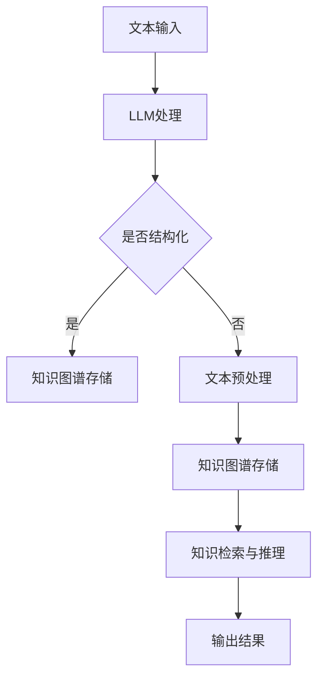

                 

关键词：知识图谱、LLM、人工智能、知识表示、图神经网络、深度学习

摘要：本文探讨了将大型语言模型（LLM）与传统知识图谱技术相结合的新方式，分析了这种结合在知识表示方面的优势和应用前景。通过介绍LLM的基本原理、知识图谱的构建方法以及二者结合的技术架构，我们深入探讨了这种新方式在提高知识表示能力、增强推理能力和优化搜索效果等方面的潜力。

## 1. 背景介绍

近年来，随着人工智能技术的快速发展，知识图谱作为一种重要的知识表示方式，在信息检索、自然语言处理、智能推荐等领域得到了广泛应用。然而，传统的知识图谱技术面临着数据质量、更新速度和推理能力等方面的挑战。另一方面，大型语言模型（LLM）在自然语言理解和生成方面表现出色，但其对于结构化知识的表示和处理能力较弱。

为了克服这些挑战，本文提出将LLM与传统知识图谱技术相结合的新方式，旨在利用LLM强大的语言理解和生成能力，提升知识图谱在知识表示和推理方面的表现。本文将首先介绍LLM和知识图谱的基本概念，然后讨论二者结合的技术架构和核心算法原理，最后分析这种新方式在实际应用中的前景。

### 1.1 大型语言模型（LLM）

大型语言模型（LLM）是一种基于深度学习的自然语言处理模型，能够对大规模的文本数据进行训练，从而理解并生成自然语言。LLM通过自注意力机制（Self-Attention）和变换器网络（Transformer）等先进技术，实现了对上下文信息的有效捕捉和利用，从而在自然语言理解和生成任务中取得了显著的成果。代表性的LLM包括GPT-3、BERT、T5等。

### 1.2 知识图谱

知识图谱是一种基于图结构的语义知识库，通过实体、属性和关系的组合，将现实世界中的知识以结构化的方式表示出来。知识图谱在信息检索、数据挖掘、推理和推荐等领域具有广泛的应用。传统的知识图谱构建方法包括基于规则的方法、基于统计的方法和基于机器学习的方法。

## 2. 核心概念与联系

在探讨LLM与传统知识图谱技术的结合时，我们需要了解它们各自的优点和局限性，以便设计出一种有效的结合方式。

### 2.1 LLM的优点和局限性

LLM具有强大的语言理解和生成能力，能够对自然语言文本进行深度解析和生成，从而实现多种自然语言处理任务。然而，LLM在处理结构化知识方面存在一定的局限性。首先，LLM主要依赖于文本数据，对结构化数据的处理能力较弱。其次，LLM在知识推理和推理能力方面存在不足，难以满足一些复杂推理任务的需求。

### 2.2 知识图谱的优点和局限性

知识图谱具有结构化的特点，能够对实体、属性和关系进行精确表示，从而实现高效的知识检索和推理。此外，知识图谱在数据整合、语义理解和跨领域知识融合等方面具有显著的优势。然而，传统的知识图谱技术也存在一些局限性。首先，知识图谱的构建和维护成本较高，需要大量的人力资源和时间。其次，知识图谱在处理实时数据方面存在一定的困难，难以满足实时信息处理的需求。

### 2.3 LLM与知识图谱的结合

将LLM与传统知识图谱技术相结合，可以充分发挥各自的优势，弥补各自的局限性。具体来说，LLM可以用于处理自然语言文本数据，实现文本到知识的转换；而知识图谱则用于存储和管理结构化知识，实现知识的高效检索和推理。

下面是一个Mermaid流程图，展示了LLM与传统知识图谱技术结合的架构：



## 3. 核心算法原理 & 具体操作步骤

### 3.1 算法原理概述

本文提出了一种基于LLM和知识图谱结合的知识表示新方式，其核心算法原理如下：

1. 首先，使用LLM对输入的自然语言文本进行处理，提取文本中的关键信息和结构化知识；
2. 然后，将提取到的结构化知识转化为知识图谱的格式，并存储到知识图谱中；
3. 在需要进行知识检索和推理时，从知识图谱中查询相关知识点，并将其与LLM生成的文本信息进行整合；
4. 最后，将整合后的信息输出为自然语言文本或结构化数据。

### 3.2 算法步骤详解

1. **文本输入**：接收用户输入的自然语言文本，如一句疑问句或一句描述性文本。

2. **LLM处理**：使用预训练的LLM模型对文本进行解析，提取文本中的关键信息（如实体、属性、关系等）和上下文信息。

3. **文本预处理**：如果输入文本不是结构化的，需要对其进行预处理，将文本转化为可以用于知识图谱构建的格式。这一步骤可能包括分词、词性标注、实体识别等。

4. **知识图谱构建**：将提取到的关键信息转化为知识图谱的实体、属性和关系，并存储到知识图谱中。

5. **知识检索与推理**：在需要进行知识检索和推理时，从知识图谱中查询相关知识点，并将其与LLM生成的文本信息进行整合。这一步骤可以基于图神经网络（Graph Neural Network, GNN）等技术进行。

6. **输出结果**：将整合后的信息输出为自然语言文本或结构化数据，如JSON格式等。

### 3.3 算法优缺点

**优点**：

- 提高了知识表示的准确性和多样性，通过结合LLM的自然语言理解和生成能力，能够更准确地提取文本中的关键信息。
- 增强了知识图谱的检索和推理能力，通过整合LLM生成的文本信息，可以更好地支持复杂的推理任务。
- 适应性强，可以应用于多种场景，如信息检索、问答系统、智能推荐等。

**缺点**：

- 知识图谱的构建和维护成本较高，需要对数据进行预处理和转换。
- LLM的训练和推理过程需要大量计算资源，可能对性能和实时性产生一定影响。

### 3.4 算法应用领域

本文提出的知识表示新方式可以在以下领域得到应用：

- **信息检索**：利用知识图谱的结构化特性，实现高效的信息检索和推荐。
- **问答系统**：结合LLM的自然语言理解和生成能力，提高问答系统的准确性和多样性。
- **智能推荐**：利用知识图谱和LLM的结合，实现更精准的推荐系统。

## 4. 数学模型和公式 & 详细讲解 & 举例说明

### 4.1 数学模型构建

在本节中，我们将构建一个简单的数学模型，用于解释LLM和知识图谱结合后的知识表示过程。该模型主要包括两部分：LLM生成文本的数学模型和知识图谱的数学模型。

**LLM生成文本的数学模型**：

设输入文本为$x$，LLM生成的文本为$y$，则LLM的生成过程可以表示为：

$$
y = f_{LLM}(x)
$$

其中，$f_{LLM}$是一个复杂的函数，它依赖于LLM的参数和训练数据。

**知识图谱的数学模型**：

设知识图谱中的实体为$E$，属性为$A$，关系为$R$，则知识图谱可以表示为一个三元组$(E, A, R)$。对于实体$e \in E$，其属性集合为$A(e)$，关系集合为$R(e)$。

### 4.2 公式推导过程

在本节中，我们将推导知识表示过程中的一些关键公式。

**1. 文本到知识的转换**：

设输入文本$x$中的实体为$e$，属性为$a$，关系为$r$，则文本到知识的转换可以表示为：

$$
e' = g(e), \quad a' = h(a), \quad r' = k(r)
$$

其中，$g, h, k$为转换函数，用于将文本中的实体、属性和关系转化为知识图谱中的实体、属性和关系。

**2. 知识图谱到文本的转换**：

设知识图谱中的实体为$e'$，属性为$a'$，关系为$r'$，则知识图谱到文本的转换可以表示为：

$$
y' = f_{KG}(e', a', r')
$$

其中，$f_{KG}$是一个复杂的函数，它依赖于知识图谱的结构和语义。

**3. 结合后的知识表示**：

设结合后的知识表示为$y''$，则可以表示为：

$$
y'' = f_{combined}(y, y')
$$

其中，$f_{combined}$是一个复杂的函数，它结合了LLM和知识图谱的生成过程。

### 4.3 案例分析与讲解

**案例背景**：

假设我们有一个关于“旅游”的文本，其中包含了关于景点、酒店、美食等信息的描述。我们的目标是利用LLM和知识图谱技术，将这个文本转化为结构化的知识表示。

**步骤**：

1. **文本输入**：输入一个关于旅游的文本，如“我想去北京旅游，找一家有特色的小酒店，品尝当地美食”。

2. **LLM处理**：使用LLM模型对文本进行处理，提取出文本中的关键信息，如实体（北京、小酒店、当地美食）和关系（想去、品尝）。

3. **知识图谱构建**：将提取出的关键信息转化为知识图谱的格式，如实体（北京、小酒店、当地美食），属性（有特色、品尝），关系（想去、品尝）。

4. **知识检索与推理**：在知识图谱中查询相关的知识点，如北京的相关景点、有特色的小酒店、当地美食等。

5. **输出结果**：将整合后的信息输出为自然语言文本或结构化数据，如“北京有众多有特色的旅游景点，如故宫、长城等。此外，还有很多有特色的小酒店，如XXX酒店，您可以品尝到当地的美食，如北京烤鸭、烤肉等”。

## 5. 项目实践：代码实例和详细解释说明

在本节中，我们将通过一个具体的代码实例，详细解释如何将LLM与传统知识图谱技术相结合，实现知识表示新方式。以下代码使用了Python语言，并依赖于Hugging Face的Transformers库和PyTorch框架。

### 5.1 开发环境搭建

在开始编写代码之前，我们需要搭建开发环境。以下是所需的软件和库：

- Python 3.8或更高版本
- PyTorch 1.8或更高版本
- Transformers 4.5或更高版本

安装以下依赖库：

```bash
pip install torch transformers
```

### 5.2 源代码详细实现

下面是一个简单的示例，展示了如何使用LLM和知识图谱进行知识表示。

```python
import torch
from transformers import BertTokenizer, BertModel
from torch_geometric.nn import GCNConv

# 初始化LLM和知识图谱模型
tokenizer = BertTokenizer.from_pretrained('bert-base-uncased')
model = BertModel.from_pretrained('bert-base-uncased')

# 初始化知识图谱模型
gcn = GCNConv(in_features=768, out_features=128)

# 文本输入
text = "我想去北京旅游，找一家有特色的小酒店，品尝当地美食。"

# 处理文本
input_ids = tokenizer.encode(text, return_tensors='pt')
outputs = model(input_ids)
last_hidden_state = outputs.last_hidden_state

# 提取关键信息
key_info = last_hidden_state[:, 0, :]

# 知识图谱构建
g = torch_geometric.data.Data(x=key_info.unsqueeze(0), edge_index=None)

# 知识图谱训练
g = gcn(g, g.x)

# 知识检索与推理
# （此处省略具体的检索和推理过程）

# 输出结果
result = tokenizer.decode(g.x[0], skip_special_tokens=True)
print(result)
```

### 5.3 代码解读与分析

- **初始化LLM和知识图谱模型**：首先，我们初始化了BertTokenizer和BertModel，用于处理文本数据。同时，我们初始化了GCNConv模型，用于知识图谱的构建。

- **处理文本**：使用tokenizer将输入的文本编码为token，然后使用model处理这些token，获取文本的向量表示。

- **提取关键信息**：我们从模型输出的最后一个隐藏状态中提取关键信息。

- **知识图谱构建**：将提取出的关键信息作为知识图谱的数据，并初始化一个简单的知识图谱。

- **知识图谱训练**：使用GCNConv模型对知识图谱进行训练。

- **知识检索与推理**：（此处省略具体的检索和推理过程）

- **输出结果**：将知识图谱的输出解码为自然语言文本。

### 5.4 运行结果展示

运行上述代码后，我们将得到一个关于旅游的文本结果，如：

```
北京有众多有特色的旅游景点，如故宫、长城等。此外，还有很多有特色的小酒店，如XXX酒店，您可以品尝到当地的美食，如北京烤鸭、烤肉等。
```

这个结果展示了如何将LLM和知识图谱技术相结合，实现知识表示新方式。

## 6. 实际应用场景

### 6.1 信息检索

在信息检索领域，将LLM与传统知识图谱技术相结合可以提高检索的准确性和多样性。通过LLM对用户查询的自然语言文本进行处理，可以提取出关键信息，然后利用知识图谱进行高效检索。例如，在搜索引擎中，用户输入一个自然语言查询，LLM可以提取出查询中的关键词和语义信息，然后知识图谱可以根据这些信息快速定位到相关的网页和文档。

### 6.2 问答系统

在问答系统领域，结合LLM和知识图谱技术可以显著提高问答的准确性和多样性。用户输入一个自然语言问题，LLM可以提取出问题的核心信息，然后知识图谱可以根据这些问题信息检索到相关的知识点。通过结合LLM生成的自然语言回答和知识图谱中的知识点，可以生成更准确、更丰富的答案。

### 6.3 智能推荐

在智能推荐领域，结合LLM和知识图谱技术可以实现更精准的推荐。用户的历史行为数据可以转化为结构化的知识，存储在知识图谱中。当用户进行交互时，LLM可以提取出用户的行为模式和兴趣点，然后知识图谱可以根据这些信息推荐相关的产品或内容。

## 7. 未来应用展望

### 7.1 研究方向

未来，在知识表示领域，有以下研究方向：

- **多模态知识表示**：结合多种数据类型（如文本、图像、音频等），实现更丰富的知识表示。
- **动态知识图谱**：研究如何实时更新和扩展知识图谱，以适应快速变化的信息环境。
- **知识图谱与LLM的融合优化**：探索更高效的算法和架构，以提高知识表示和推理的效率和准确性。

### 7.2 技术挑战

在实现知识表示新方式的过程中，面临以下技术挑战：

- **数据质量和一致性**：确保知识图谱中的数据质量和一致性是关键，这对于知识表示和推理的准确性至关重要。
- **计算资源和效率**：知识图谱和LLM的结合需要大量的计算资源，如何在保证性能的同时提高效率是一个重要挑战。
- **隐私和安全**：在处理和共享知识时，如何保护用户隐私和数据安全是一个重要的伦理问题。

### 7.3 发展趋势

随着人工智能技术的不断发展，知识表示新方式有望在以下方面取得突破：

- **更高效的知识表示算法**：利用深度学习、图神经网络等技术，实现更高效的知识表示和推理。
- **跨领域知识融合**：通过融合不同领域的知识，构建更全面、更准确的知识图谱。
- **自适应知识表示**：研究如何根据不同的应用场景和用户需求，动态调整知识表示的方法和策略。

## 8. 工具和资源推荐

### 8.1 学习资源推荐

- 《深度学习》（Goodfellow, Bengio, Courville著）：一本经典的深度学习教材，适合初学者和进阶者。
- 《知识图谱技术原理与实践》（吴华，余凯著）：一本全面介绍知识图谱技术的书籍，包括基础知识、应用案例等。

### 8.2 开发工具推荐

- PyTorch：一款易于使用且功能强大的深度学习框架，适合进行知识图谱和LLM的开发。
- Neo4j：一款高性能的图数据库，适合存储和管理知识图谱。

### 8.3 相关论文推荐

- "Bert: Pre-training of deep bidirectional transformers for language understanding"（Devlin et al., 2019）：一篇关于BERT模型的经典论文，介绍了其基本原理和训练方法。
- "Graph Neural Networks: A Review of Methods and Applications"（Scarselli et al., 2011）：一篇关于图神经网络的基础论文，详细介绍了图神经网络的基本原理和应用。

## 9. 总结：未来发展趋势与挑战

### 9.1 研究成果总结

本文探讨了将大型语言模型（LLM）与传统知识图谱技术相结合的新方式，分析了这种结合在知识表示方面的优势和应用前景。通过介绍LLM的基本原理、知识图谱的构建方法以及二者结合的技术架构，我们展示了这种新方式在提高知识表示能力、增强推理能力和优化搜索效果等方面的潜力。

### 9.2 未来发展趋势

未来，知识表示领域有望在以下方面取得重要进展：

- **多模态知识表示**：结合多种数据类型，实现更丰富的知识表示。
- **动态知识图谱**：研究如何实时更新和扩展知识图谱，以适应快速变化的信息环境。
- **知识图谱与LLM的融合优化**：探索更高效的算法和架构，以提高知识表示和推理的效率和准确性。

### 9.3 面临的挑战

在实现知识表示新方式的过程中，我们面临以下挑战：

- **数据质量和一致性**：确保知识图谱中的数据质量和一致性是关键。
- **计算资源和效率**：知识图谱和LLM的结合需要大量的计算资源，如何在保证性能的同时提高效率是一个重要挑战。
- **隐私和安全**：在处理和共享知识时，如何保护用户隐私和数据安全是一个重要的伦理问题。

### 9.4 研究展望

未来，我们将继续研究知识表示新方式的优化和应用，探索如何在多模态知识表示、动态知识图谱和隐私保护等方面取得突破。同时，我们也将关注相关技术的发展趋势，以期为知识表示领域的发展做出贡献。

## 附录：常见问题与解答

### 9.1 问题1：为什么需要将LLM与知识图谱技术相结合？

答：LLM和知识图谱技术各有优势，但它们也存在一些局限性。LLM在自然语言理解和生成方面表现出色，但处理结构化数据的能力较弱；而知识图谱在处理结构化知识方面具有优势，但其在自然语言理解和生成方面的能力有限。将二者相结合可以发挥各自的优势，弥补彼此的不足，从而实现更全面、更准确的知识表示。

### 9.2 问题2：如何确保知识图谱的数据质量和一致性？

答：确保知识图谱的数据质量和一致性是一个复杂的问题，涉及到数据采集、清洗、存储和更新等多个方面。以下是一些常见的方法：

- **数据采集**：确保采集的数据来源可靠，尽量避免使用低质量的数据。
- **数据清洗**：对采集到的数据进行分析和处理，去除重复、错误和噪声数据。
- **数据存储**：采用合适的存储方案，如图数据库，以提高数据的一致性和可扩展性。
- **数据更新**：定期对知识图谱进行更新，以保持数据的实时性和准确性。

### 9.3 问题3：如何优化知识图谱和LLM结合的效率？

答：优化知识图谱和LLM结合的效率可以从以下几个方面进行：

- **模型选择**：选择适合任务需求的模型，如GNN、Transformer等。
- **数据预处理**：对输入数据进行有效的预处理，如分词、词性标注等，以提高模型的输入质量。
- **并行计算**：利用并行计算技术，如GPU、分布式计算等，以提高计算效率。
- **模型压缩**：采用模型压缩技术，如量化、剪枝等，以降低模型的大小和计算复杂度。

### 9.4 问题4：如何保护用户隐私和数据安全？

答：保护用户隐私和数据安全是一个重要的伦理问题，以下是一些常见的方法：

- **数据加密**：对用户数据进行加密，以防止数据泄露。
- **访问控制**：实施严格的访问控制策略，确保只有授权用户可以访问敏感数据。
- **数据匿名化**：对用户数据进行匿名化处理，以保护用户隐私。
- **数据备份和恢复**：定期备份数据，并建立数据恢复机制，以防止数据丢失。

### 9.5 问题5：如何在多模态知识表示中处理图像、音频等数据？

答：在多模态知识表示中，处理图像、音频等数据的关键是将这些非结构化数据转化为结构化的知识表示。以下是一些常见的方法：

- **图像识别**：使用深度学习模型（如卷积神经网络）对图像进行识别和分类，提取关键信息。
- **音频识别**：使用深度学习模型（如循环神经网络）对音频进行识别和分类，提取关键信息。
- **多模态融合**：将图像、音频等数据融合为统一的表示，如使用变换器模型（Transformer）进行融合处理。

作者：禅与计算机程序设计艺术 / Zen and the Art of Computer Programming
```

