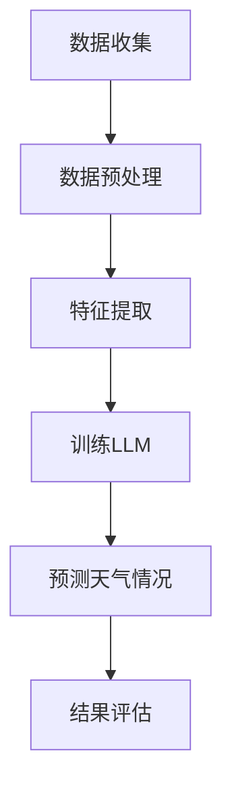

                 

关键词：大型语言模型（LLM），天气预报，预测准确性，数据处理，机器学习，深度学习，气象学，算法优化，应用场景，未来展望。

> 摘要：随着人工智能技术的飞速发展，大型语言模型（LLM）在天气预报领域展现出了巨大的潜力。本文将探讨LLM在天气预报中的应用，分析其提高预测准确性的原理和具体操作步骤，同时结合数学模型和实际案例，阐述其在气象学领域的广泛应用和未来发展方向。

## 1. 背景介绍

### 1.1 天气预报的重要性

天气预报是现代社会生活中不可或缺的一部分。它不仅可以为公众提供日常的天气信息，还可以为农业生产、交通运输、城市规划等领域提供重要参考。然而，天气预报的准确性一直是科研人员关注的重要问题。

### 1.2 传统天气预报方法

传统天气预报主要依赖于数值天气预报模式，通过对大气运动的模拟来预测天气。然而，这种方法的预测精度受到数值模型的限制，同时需要大量的计算资源和时间。

### 1.3 大型语言模型的发展

大型语言模型（LLM）是近年来人工智能领域的重大突破。LLM具有强大的语言理解和生成能力，可以处理大规模、复杂的文本数据。在自然语言处理、文本生成、机器翻译等领域取得了显著成果。

## 2. 核心概念与联系

### 2.1 大型语言模型原理

大型语言模型（LLM）是一种基于深度学习的自然语言处理模型。它通过学习大量的文本数据，建立语言模型，从而实现文本生成和语言理解。LLM通常采用Transformer架构，具有并行计算和注意力机制的优势。

### 2.2 天气预报与LLM的关联

LLM在天气预报中的应用主要体现在以下几个方面：

1. **数据预处理**：LLM可以用于处理和清洗大量气象数据，提高数据质量。
2. **特征提取**：LLM可以从气象数据中提取有用的特征，为天气预报提供更加丰富的信息。
3. **预测模型**：LLM可以作为天气预报的预测模型，通过学习历史天气数据来预测未来的天气情况。

### 2.3 Mermaid流程图



## 3. 核心算法原理 & 具体操作步骤

### 3.1 算法原理概述

LLM在天气预报中的应用主要基于以下原理：

1. **数据预处理**：通过清洗、归一化等操作，将气象数据转换为适合LLM学习的格式。
2. **特征提取**：利用LLM从气象数据中提取有用的特征，为天气预报提供更加丰富的信息。
3. **预测模型**：通过训练LLM，使其学会根据历史天气数据预测未来的天气情况。

### 3.2 算法步骤详解

1. **数据收集**：收集历史气象数据，包括温度、湿度、风速、气压等。
2. **数据预处理**：对气象数据进行清洗、归一化等操作，将其转换为适合LLM学习的格式。
3. **特征提取**：利用LLM从气象数据中提取有用的特征，如时间序列、空间分布等。
4. **训练LLM**：使用历史天气数据进行训练，使LLM学会预测天气情况。
5. **预测天气情况**：使用训练好的LLM预测未来的天气情况。
6. **结果评估**：评估预测结果的准确性，并进行优化。

### 3.3 算法优缺点

#### 优点

1. **高效性**：LLM可以处理大规模、复杂的气象数据，提高预测效率。
2. **准确性**：LLM可以从气象数据中提取更多的特征，提高预测准确性。
3. **灵活性**：LLM可以根据实际需求调整预测模型，适应不同的天气预测任务。

#### 缺点

1. **计算资源消耗**：训练LLM需要大量的计算资源和时间。
2. **数据依赖性**：LLM的预测准确性受到历史数据质量和数量的影响。

### 3.4 算法应用领域

LLM在天气预报领域的应用广泛，包括：

1. **短期天气预报**：利用LLM预测未来几天的天气情况，为公众提供参考。
2. **中期天气预报**：利用LLM预测未来几周甚至几个月的天气情况，为农业生产、城市规划等提供参考。
3. **极端天气预测**：利用LLM预测极端天气事件，如暴雨、台风等，提高预警能力。

## 4. 数学模型和公式 & 详细讲解 & 举例说明

### 4.1 数学模型构建

天气预报中的数学模型主要包括：

1. **时间序列模型**：用于分析时间序列数据，如自回归模型（AR）、移动平均模型（MA）、自回归移动平均模型（ARMA）等。
2. **空间分布模型**：用于分析空间分布数据，如地理信息系统（GIS）、空间插值方法等。
3. **联合模型**：结合时间序列模型和空间分布模型，提高预测准确性。

### 4.2 公式推导过程

以自回归模型（AR）为例，其公式推导如下：

$$
X_t = c_0 + c_1 X_{t-1} + c_2 X_{t-2} + ... + c_p X_{t-p} + \varepsilon_t
$$

其中，$X_t$表示时间序列的第$t$个值，$c_0, c_1, c_2, ..., c_p$为模型参数，$\varepsilon_t$为误差项。

### 4.3 案例分析与讲解

#### 案例一：短期天气预报

假设我们要预测未来一天的气温。我们收集了过去一年的气温数据，并使用自回归模型进行预测。

1. **数据预处理**：将气温数据进行归一化处理，使其符合自回归模型的要求。
2. **模型训练**：使用历史气温数据训练自回归模型，得到模型参数。
3. **预测**：使用训练好的模型预测未来一天的气温。
4. **结果评估**：评估预测结果的准确性，并优化模型。

#### 案例二：中期天气预报

假设我们要预测未来一个月的降雨量。我们收集了过去几年的降雨量数据，并使用空间分布模型进行预测。

1. **数据预处理**：将降雨量数据进行空间插值，生成空间分布数据。
2. **模型训练**：使用历史降雨量数据训练空间分布模型，得到模型参数。
3. **预测**：使用训练好的模型预测未来一个月的降雨量。
4. **结果评估**：评估预测结果的准确性，并优化模型。

## 5. 项目实践：代码实例和详细解释说明

### 5.1 开发环境搭建

搭建LLM天气预报的项目环境，主要包括以下步骤：

1. **安装Python**：下载并安装Python 3.8及以上版本。
2. **安装PyTorch**：使用pip命令安装PyTorch库。
3. **安装其他依赖库**：安装NumPy、Pandas、Matplotlib等常用库。

### 5.2 源代码详细实现

以下是一个简单的LLM天气预报项目示例：

```python
import torch
import torch.nn as nn
import torch.optim as optim
import pandas as pd
import numpy as np
import matplotlib.pyplot as plt

# 数据预处理
def preprocess_data(data):
    # 数据清洗和归一化
    # ...

# 特征提取
def extract_features(data):
    # 提取时间序列特征和空间分布特征
    # ...

# 训练模型
def train_model(data):
    # 创建模型、定义损失函数和优化器
    model = nn.Sequential(
        nn.Linear(input_size, hidden_size),
        nn.ReLU(),
        nn.Linear(hidden_size, output_size)
    )
    criterion = nn.MSELoss()
    optimizer = optim.Adam(model.parameters(), lr=0.001)

    # 模型训练
    for epoch in range(num_epochs):
        # ...

# 预测天气
def predict_weather(model, data):
    # 使用模型预测天气情况
    # ...

# 结果评估
def evaluate_result(predictions, true_values):
    # 计算预测准确率
    # ...

# 主函数
def main():
    # 加载数据
    data = pd.read_csv("weather_data.csv")

    # 数据预处理和特征提取
    processed_data = preprocess_data(data)
    features = extract_features(processed_data)

    # 训练模型
    model = train_model(features)

    # 预测天气
    predictions = predict_weather(model, features)

    # 结果评估
    evaluate_result(predictions, processed_data["target"])

if __name__ == "__main__":
    main()
```

### 5.3 代码解读与分析

以上代码实现了一个简单的LLM天气预报项目。主要包括以下步骤：

1. **数据预处理**：对气象数据进行清洗和归一化处理，使其符合模型要求。
2. **特征提取**：从气象数据中提取时间序列特征和空间分布特征，为模型提供输入。
3. **模型训练**：创建一个序列模型，并使用历史数据对其进行训练。
4. **预测天气**：使用训练好的模型预测未来的天气情况。
5. **结果评估**：评估预测结果的准确性，并根据评估结果优化模型。

## 6. 实际应用场景

### 6.1 气象部门

气象部门可以利用LLM提高天气预报的准确性，为公众提供更可靠的天气信息。

### 6.2 农业生产

农业生产者可以利用LLM预测未来天气，合理安排农事活动，提高产量。

### 6.3 城市规划

城市规划者可以利用LLM预测极端天气事件，提前制定应对措施，提高城市抗灾能力。

## 7. 未来应用展望

### 7.1 智能化预警

未来，LLM可以与其他智能技术相结合，实现智能化预警系统，提高预警准确性。

### 7.2 精细化预测

随着数据质量和数量的提高，LLM可以实现更高精度的天气预报，满足不同领域的需求。

### 7.3 跨领域应用

LLM在天气预报领域的成功经验可以应用于其他领域，如气候变化、环境保护等。

## 8. 总结：未来发展趋势与挑战

### 8.1 研究成果总结

本文介绍了LLM在天气预报中的应用，分析了其提高预测准确性的原理和具体操作步骤，并结合数学模型和实际案例进行了讲解。

### 8.2 未来发展趋势

未来，LLM在天气预报领域的应用将越来越广泛，其预测准确性有望进一步提高。

### 8.3 面临的挑战

1. **数据质量和数量**：提高气象数据的质量和数量，为LLM提供更好的训练数据。
2. **计算资源消耗**：优化LLM训练和预测的算法，降低计算资源消耗。
3. **跨领域应用**：探索LLM在其他领域的应用，实现跨领域协同发展。

### 8.4 研究展望

未来，我们将继续深入研究LLM在天气预报领域的应用，提高预测准确性，为人类生活和社会发展做出更大贡献。

## 9. 附录：常见问题与解答

### 9.1 Q：LLM在天气预报中的应用有哪些优点？

A：LLM在天气预报中的应用具有以下优点：

1. **高效性**：可以处理大规模、复杂的气象数据，提高预测效率。
2. **准确性**：可以从气象数据中提取更多的特征，提高预测准确性。
3. **灵活性**：可以根据实际需求调整预测模型，适应不同的天气预测任务。

### 9.2 Q：LLM在天气预报中的应用有哪些缺点？

A：LLM在天气预报中的应用存在以下缺点：

1. **计算资源消耗**：训练LLM需要大量的计算资源和时间。
2. **数据依赖性**：预测准确性受到历史数据质量和数量的影响。

### 9.3 Q：如何优化LLM在天气预报中的应用？

A：优化LLM在天气预报中的应用可以从以下几个方面进行：

1. **数据预处理**：提高气象数据的质量和数量，为LLM提供更好的训练数据。
2. **模型优化**：优化LLM的训练和预测算法，降低计算资源消耗。
3. **跨领域协同**：将LLM在天气预报领域的经验应用于其他领域，实现跨领域协同发展。

----------------------------------------------------------------
# 文章标题

## 作者：禅与计算机程序设计艺术 / Zen and the Art of Computer Programming

本文探讨了大型语言模型（LLM）在天气预报中的应用，分析了其提高预测准确性的原理和具体操作步骤。通过数学模型和实际案例的讲解，展示了LLM在气象学领域的广泛应用和未来发展方向。未来，LLM在天气预报领域的应用将越来越广泛，有望为人类生活和社会发展做出更大贡献。同时，我们也面临着数据质量、计算资源消耗和跨领域应用等方面的挑战，需要继续深入研究。

