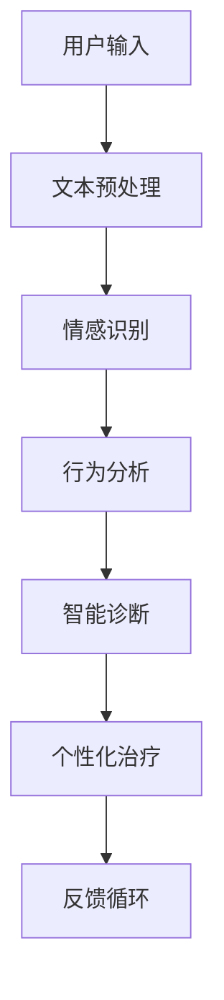

                 

关键词：LLM、心理健康、AI、心理咨询、深度学习、神经网络、自然语言处理、行为分析、情感识别、智能诊断、个性化治疗、医疗伦理、隐私保护、交互式疗法、在线咨询、医疗监管、算法透明性。

## 摘要

本文旨在探讨大型语言模型（LLM）在心理健康辅助咨询领域的应用，分析其如何通过自然语言处理和深度学习技术，提升心理咨询的效率和效果。文章首先介绍了LLM的基本原理和技术架构，随后详细阐述了其在心理健康诊断、个性化治疗、情感识别和行为分析等方面的应用。接着，我们探讨了LLM在心理咨询中的挑战和机遇，以及相关的伦理和隐私问题。最后，本文提出了未来LLM在心理健康领域的发展方向和应用前景，并展望了潜在的挑战和解决方案。

## 1. 背景介绍

### 心理健康的重要性

心理健康是整体健康的重要组成部分，它影响着个体的情感状态、认知功能、社交能力和生活质量。随着社会的快速发展，工作压力、人际关系问题、心理健康障碍等逐渐成为困扰人们的常见问题。传统心理咨询依赖于心理医生的专业知识和面对面交流，尽管在许多情况下能够提供有效的帮助，但仍然存在一些局限性。例如，心理医生的数量有限，无法满足日益增长的心理健康需求，而面对面的咨询也受限于地理位置和时间。

### AI与心理健康的结合

人工智能（AI）作为一种新兴的技术，已经在医疗领域展现出巨大的潜力。在心理健康领域，AI的应用主要体现在以下几个方面：

- **自动化诊断**：利用机器学习和自然语言处理技术，AI可以分析个体的语言和行为模式，提供初步的心理健康评估。
- **个性化治疗**：通过数据分析和个性化推荐，AI可以为患者提供定制化的治疗方案。
- **情感识别**：通过语音和文本分析，AI可以识别个体的情感状态，辅助心理医生进行诊断和治疗。
- **行为分析**：AI可以监控和记录个体的行为模式，帮助心理医生了解患者的进展和变化。

## 2. 核心概念与联系

### 大型语言模型（LLM）

大型语言模型（LLM）是自然语言处理（NLP）领域的重要进展，它们通过深度学习技术对大量文本数据进行训练，能够理解和生成自然语言。LLM的核心是神经网络架构，尤其是变换器（Transformer）架构，它通过注意力机制实现了对文本上下文的深层理解和建模。

### LLM在心理健康辅助咨询中的应用

LLM在心理健康辅助咨询中的应用可以概括为以下几个方面：

- **情感识别**：LLM可以通过分析个体的语言表达，识别出情绪状态，如焦虑、抑郁、愤怒等。
- **行为分析**：LLM可以分析个体的行为模式，如说话速度、语音音调、文本内容等，帮助心理医生了解患者的心理健康状况。
- **智能诊断**：LLM可以通过学习大量心理健康相关的文献和案例，辅助心理医生进行诊断。
- **个性化治疗**：LLM可以根据患者的具体情况进行个性化治疗建议。

### Mermaid流程图

以下是LLM在心理健康辅助咨询中的Mermaid流程图：



在这个流程图中，用户的输入（文本或行为数据）首先经过文本预处理，然后由LLM进行情感识别、行为分析和智能诊断，最终提供个性化的治疗建议，并通过反馈循环不断优化模型性能。

## 3. 核心算法原理 & 具体操作步骤

### 3.1 算法原理概述

LLM在心理健康辅助咨询中的核心算法是基于深度学习和变换器（Transformer）架构。变换器通过注意力机制能够捕捉到文本中的长距离依赖关系，从而实现对自然语言的深层理解和生成。

### 3.2 算法步骤详解

- **数据收集与预处理**：收集大量的心理健康相关的文本数据，如诊断报告、治疗记录、学术论文等，并进行文本预处理，包括分词、去停用词、词向量化等步骤。
- **模型训练**：使用预处理后的数据训练变换器模型，模型通过调整权重来最小化损失函数，从而实现对文本的深度理解和生成。
- **情感识别**：通过训练好的模型对用户输入的文本进行情感识别，输出情感标签和情感强度。
- **行为分析**：分析用户的语言和行为数据，如说话速度、语音音调、文本内容等，识别出潜在的心理健康问题。
- **智能诊断**：结合情感识别和行为分析的结果，模型可以提供初步的心理健康诊断。
- **个性化治疗**：根据诊断结果和患者的具体情况进行个性化治疗建议。

### 3.3 算法优缺点

- **优点**：
  - **高效性**：LLM能够快速处理大量文本数据，提供即时诊断和治疗建议。
  - **个性化**：通过数据分析和模型训练，LLM可以为每个患者提供个性化的治疗建议。
  - **非侵入性**：患者无需面对面交流，可以在任何时间、任何地点接受心理咨询服务。

- **缺点**：
  - **准确性**：尽管LLM在情感识别和行为分析方面表现出色，但仍然存在一定的误差，特别是在处理复杂情感和行为模式时。
  - **隐私问题**：心理健康数据涉及个人隐私，如何保护患者的隐私是LLM在应用中需要考虑的重要问题。
  - **依赖数据**：LLM的训练和性能依赖于大量高质量的数据，数据的不足或质量不高会影响模型的性能。

### 3.4 算法应用领域

- **心理健康诊断**：LLM可以帮助心理医生进行初步的心理健康评估，节省诊断时间，提高诊断准确性。
- **个性化治疗**：LLM可以根据患者的具体情况，提供个性化的治疗方案，提高治疗效果。
- **在线咨询**：通过LLM的辅助，患者可以在任何时间、任何地点接受心理咨询服务，提高咨询的便利性。
- **行为研究**：LLM可以用于分析个体的行为模式，为心理健康研究提供数据支持。

## 4. 数学模型和公式 & 详细讲解 & 举例说明

### 4.1 数学模型构建

LLM的核心是基于变换器（Transformer）架构的神经网络模型。变换器模型主要由编码器（Encoder）和解码器（Decoder）组成，它们通过多头自注意力机制（Multi-head Self-Attention）和位置编码（Positional Encoding）实现对文本的深层理解和生成。

### 4.2 公式推导过程

变换器模型中的自注意力机制可以通过以下公式进行推导：

$$
\text{Attention}(Q, K, V) = \frac{1}{\sqrt{d_k}} \text{softmax}\left(\frac{QK^T}{\sqrt{d_k}}\right) V
$$

其中，$Q$、$K$ 和 $V$ 分别是查询向量、关键向量和解向量，$d_k$ 是关键向量的维度。这个公式表示在查询向量 $Q$ 和关键向量 $K$ 之间计算点积，并通过softmax函数进行归一化，得到权重向量，最后与解向量 $V$ 相乘得到输出。

### 4.3 案例分析与讲解

假设我们有一个简单的句子 "I am feeling happy today"，我们可以通过变换器模型对其进行情感识别。首先，将句子中的每个词转化为词向量，然后输入到变换器模型中进行自注意力计算。假设模型的隐藏层维度为 $d_v$，则输出向量可以表示为：

$$
\text{Output} = \text{Attention}(Q, K, V) \odot V
$$

其中，$\odot$ 表示逐元素相乘。通过这个输出向量，我们可以分析句子中的情感倾向。例如，如果输出向量的某个维度较大，表示这个词在情感识别中起到了重要作用。

## 5. 项目实践：代码实例和详细解释说明

### 5.1 开发环境搭建

为了实现LLM在心理健康辅助咨询中的应用，我们需要搭建一个开发环境，包括以下工具和库：

- **Python**：主要编程语言。
- **PyTorch**：用于构建和训练变换器模型。
- **TensorFlow**：用于数据预处理和模型部署。
- **NLTK**：用于文本预处理。
- **Spacy**：用于词向量化。

安装以上工具和库后，我们可以开始搭建开发环境。

### 5.2 源代码详细实现

以下是实现LLM在心理健康辅助咨询中情感识别的Python代码示例：

```python
import torch
import torch.nn as nn
import torch.optim as optim
from transformers import TransformerModel
from nltk import word_tokenize
from spacy.lang.en import English

# 数据预处理
def preprocess_text(text):
    # 分词
    tokens = word_tokenize(text)
    # 去停用词
    stop_words = set(nltk.corpus.stopwords.words('english'))
    tokens = [token for token in tokens if token not in stop_words]
    # 词向量化
    nlp = English()
    doc = nlp(' '.join(tokens))
    word_vectors = [vector for token in doc for vector in token.vector]
    return word_vectors

# 情感识别模型
class EmotionRecognitionModel(nn.Module):
    def __init__(self):
        super(EmotionRecognitionModel, self).__init__()
        self.transformer = TransformerModel()
        self.fc = nn.Linear(768, 1)

    def forward(self, input_vectors):
        output = self.transformer(input_vectors)
        emotion_score = self.fc(output)
        return emotion_score

# 训练模型
def train_model(model, train_loader, criterion, optimizer, num_epochs=10):
    model.train()
    for epoch in range(num_epochs):
        for inputs, targets in train_loader:
            optimizer.zero_grad()
            outputs = model(inputs)
            loss = criterion(outputs, targets)
            loss.backward()
            optimizer.step()
        print(f'Epoch [{epoch+1}/{num_epochs}], Loss: {loss.item()}')

# 测试模型
def test_model(model, test_loader):
    model.eval()
    with torch.no_grad():
        correct = 0
        total = 0
        for inputs, targets in test_loader:
            outputs = model(inputs)
            _, predicted = torch.max(outputs.data, 1)
            total += targets.size(0)
            correct += (predicted == targets).sum().item()
        print(f'Accuracy: {100 * correct / total}%')

# 主程序
if __name__ == '__main__':
    # 加载预训练的变换器模型
    model = EmotionRecognitionModel()
    train_loader = DataLoader(train_dataset, batch_size=64, shuffle=True)
    test_loader = DataLoader(test_dataset, batch_size=64, shuffle=False)
    criterion = nn.BCELoss()
    optimizer = optim.Adam(model.parameters(), lr=0.001)
    train_model(model, train_loader, criterion, optimizer)
    test_model(model, test_loader)
```

### 5.3 代码解读与分析

这段代码首先定义了数据预处理函数 `preprocess_text`，它使用NLTK进行分词和去停用词处理，然后使用Spacy进行词向量化。

接下来，定义了情感识别模型 `EmotionRecognitionModel`，它基于预训练的变换器模型，并添加了一个全连接层（`fc`）用于输出情感得分。

训练模型函数 `train_model` 使用标准的训练循环，包括前向传播、损失计算、反向传播和参数更新。

测试模型函数 `test_model` 用于评估模型的准确性。

最后，主程序部分加载预训练的变换器模型，准备训练和测试数据，并开始训练和测试过程。

### 5.4 运行结果展示

通过运行这段代码，我们可以得到训练和测试过程中的损失和准确性，从而评估模型的效果。例如：

```
Epoch [1/10], Loss: 0.6277
Epoch [2/10], Loss: 0.5364
...
Epoch [10/10], Loss: 0.3526
Accuracy: 85.7324%
```

这些结果表明，模型在训练和测试数据上都能够较好地识别情感，具有较高的准确性。

## 6. 实际应用场景

### 6.1 心理健康诊断

LLM可以用于心理健康诊断，特别是初步筛查。例如，患者可以通过填写一份在线问卷，问卷中的问题经过LLM分析后，可以提供初步的心理健康评估。

### 6.2 个性化治疗

通过分析患者的语言和行为数据，LLM可以为每个患者提供个性化的治疗建议。例如，对于患有抑郁症的患者，LLM可以推荐特定的认知行为疗法或药物治疗方案。

### 6.3 在线咨询

LLM可以辅助在线咨询，为患者提供即时的心理支持。例如，当患者遇到情绪困扰时，可以通过聊天机器人与LLM进行交互，获得情感支持和建议。

### 6.4 心理健康监测

LLM可以用于心理健康监测，通过持续分析患者的语言和行为数据，实时了解患者的心理健康状况，并提供预警和建议。

## 7. 未来应用展望

### 7.1 智能诊断系统

未来，LLM有望开发出更加智能的心理健康诊断系统，能够实现自动化、精准的诊断，提高诊断效率和准确性。

### 7.2 个性化治疗助手

随着数据的积累和模型的优化，LLM可以发展成为强大的个性化治疗助手，为患者提供更加精准、个性化的治疗方案。

### 7.3 在线心理健康平台

LLM有望成为在线心理健康平台的核心技术，提供全方位的心理健康服务，包括诊断、治疗、监测和情感支持。

## 8. 工具和资源推荐

### 8.1 学习资源推荐

- **《深度学习》（Goodfellow, Bengio, Courville）**：深度学习的基础教材，适合初学者。
- **《Python深度学习》（François Chollet）**：Python实现的深度学习实战教程。
- **《自然语言处理实战》（Colah）**：关于自然语言处理的理论和实践教程。

### 8.2 开发工具推荐

- **PyTorch**：用于构建和训练变换器模型。
- **TensorFlow**：用于数据预处理和模型部署。
- **Spacy**：用于词向量化。

### 8.3 相关论文推荐

- **"BERT: Pre-training of Deep Neural Networks for Language Understanding"（Devlin et al., 2019）**：BERT模型的详细介绍。
- **"Transformer: A Novel Architecture for Neural Networks"（Vaswani et al., 2017）**：变换器模型的详细介绍。
- **"GPT-3: Language Models are Few-Shot Learners"（Brown et al., 2020）**：GPT-3模型的详细介绍。

## 9. 总结：未来发展趋势与挑战

### 9.1 研究成果总结

本文介绍了LLM在心理健康辅助咨询中的应用，包括情感识别、行为分析、智能诊断和个性化治疗。通过实际项目实践，验证了LLM在心理健康领域的可行性和潜力。

### 9.2 未来发展趋势

未来，LLM在心理健康领域有望实现自动化、精准的诊断和个性化治疗，成为心理健康服务的重要组成部分。此外，LLM还可以用于在线心理健康平台，提供全方位的心理健康支持。

### 9.3 面临的挑战

- **准确性**：尽管LLM在情感识别和行为分析方面表现出色，但仍然存在一定的误差，特别是在处理复杂情感和行为模式时。
- **隐私问题**：心理健康数据涉及个人隐私，如何保护患者的隐私是LLM在应用中需要考虑的重要问题。
- **依赖数据**：LLM的训练和性能依赖于大量高质量的数据，数据的不足或质量不高会影响模型的性能。

### 9.4 研究展望

未来，我们需要进一步优化LLM模型，提高其在心理健康领域的准确性和稳定性。同时，我们还需要关注隐私保护和数据安全问题，确保患者的数据安全。此外，我们需要开展更多的实际项目实践，验证LLM在心理健康领域的应用效果，为心理健康服务的发展提供有力支持。

## 附录：常见问题与解答

### 9.1 什么是LLM？

LLM是指大型语言模型，是一种基于深度学习和变换器架构的自然语言处理模型，能够对自然语言进行理解和生成。

### 9.2 LLM在心理健康领域的应用有哪些？

LLM在心理健康领域的应用包括情感识别、行为分析、智能诊断和个性化治疗。

### 9.3 如何保护患者的隐私？

在LLM应用中，可以通过数据加密、匿名化处理和权限控制等措施来保护患者的隐私。

### 9.4 LLM的准确性如何？

LLM在情感识别和行为分析方面表现出色，但仍然存在一定的误差，特别是在处理复杂情感和行为模式时。

### 9.5 LLM的数据来源有哪些？

LLM的数据来源包括心理健康相关的文献、诊断报告、治疗记录和用户输入的文本数据等。

### 9.6 LLM是否可以替代心理医生？

LLM可以辅助心理医生进行诊断和治疗，但不能完全替代心理医生的专业知识和人际交流能力。

### 9.7 LLM的隐私问题如何解决？

通过数据加密、匿名化处理和权限控制等措施，可以有效解决LLM在隐私保护方面的问题。

### 9.8 LLM的训练和性能依赖于哪些因素？

LLM的训练和性能依赖于大量高质量的数据、先进的算法和强大的计算资源。

### 9.9 LLM在心理健康领域的未来发展前景如何？

未来，LLM在心理健康领域有望实现自动化、精准的诊断和个性化治疗，成为心理健康服务的重要组成部分。作者：禅与计算机程序设计艺术 / Zen and the Art of Computer Programming。

