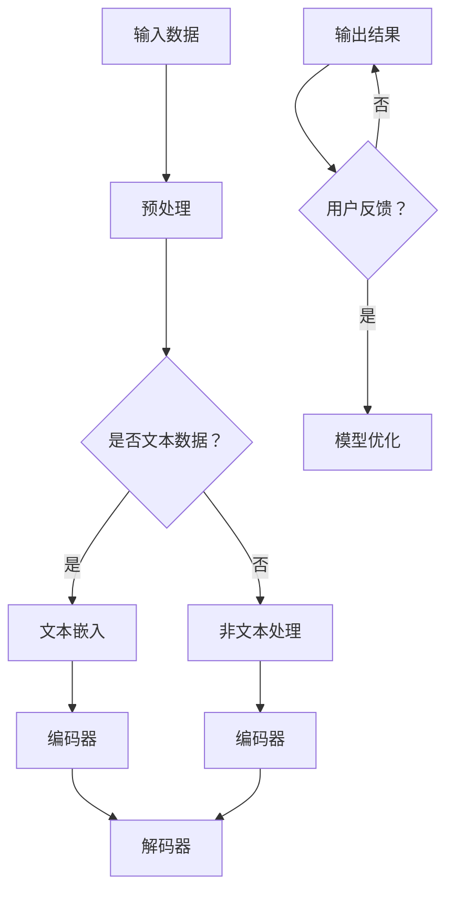

                 

关键词：大型语言模型（LLM）、数据隐私、伦理、技术平衡、数据保护、隐私保护机制、合规性、安全措施

>摘要：本文探讨了大型语言模型（LLM）在人工智能领域中的重要性，以及其与数据隐私之间的复杂关系。随着LLM技术的不断进步，如何在保护用户隐私的同时利用这些先进技术成为了一个亟待解决的问题。本文分析了LLM的工作原理，探讨了当前的数据隐私保护技术，并提出了在技术和伦理之间寻求平衡的建议。

## 1. 背景介绍

随着人工智能（AI）技术的飞速发展，大型语言模型（LLM）已经成为了许多企业和研究机构竞相探索的领域。LLM可以处理和理解复杂的自然语言，从而在机器翻译、问答系统、内容生成等领域展现出卓越的能力。然而，LLM的强大功能也带来了一系列数据隐私问题。在训练和部署LLM时，往往需要处理大量用户数据，这可能会引发隐私泄露和数据滥用的风险。

### 1.1 数据隐私的重要性

数据隐私是现代社会中不可忽视的问题。随着互联网和移动设备的普及，人们产生了大量的个人数据。这些数据不仅包括个人身份信息，还涵盖了浏览记录、购买行为、社交互动等。如果这些数据被不法分子获取，可能会导致身份盗窃、诈骗等严重问题。

### 1.2 数据隐私挑战

在LLM的应用中，数据隐私挑战主要表现在以下几个方面：

- **数据收集**：为了训练高效的LLM，需要收集大量的文本数据，这可能涉及用户隐私。
- **数据存储**：未经充分保护的存储方式可能导致数据泄露。
- **数据处理**：在处理用户数据时，如果没有严格的隐私保护措施，可能会无意中泄露敏感信息。
- **合规性**：许多国家和地区对数据隐私有严格的法律法规，如欧盟的《通用数据保护条例》（GDPR）。

## 2. 核心概念与联系

为了更好地理解LLM与数据隐私之间的关系，我们需要先了解LLM的基本概念和构建原理。以下是一个简化的Mermaid流程图，用于展示LLM的核心组件和流程：



### 2.1 核心概念原理

- **文本嵌入**：将自然语言文本转换为向量表示，以便模型进行处理。
- **编码器**：负责将输入数据编码为固定长度的向量。
- **解码器**：将编码后的向量解码为输出结果，通常是自然语言文本。

### 2.2 架构说明

LLM的架构通常包括文本嵌入、编码器和解码器三个主要部分。在数据处理阶段，文本嵌入是至关重要的，因为它决定了模型对文本的理解能力。编码器和解码器则负责处理和生成文本数据。

## 3. 核心算法原理 & 具体操作步骤

### 3.1 算法原理概述

LLM的核心算法是基于深度学习，特别是变换器（Transformer）架构。变换器通过自注意力机制来处理序列数据，这使得模型能够捕捉长距离依赖关系。以下是一个简化的操作步骤：

### 3.2 算法步骤详解

1. **数据收集**：收集大量的文本数据，可以是公开的数据集或用户生成的数据。
2. **文本预处理**：对文本进行清洗和格式化，包括去除标点、停用词过滤等。
3. **文本嵌入**：将预处理后的文本转换为向量表示。
4. **编码**：使用编码器将嵌入的文本向量编码为固定长度的向量。
5. **解码**：使用解码器将编码后的向量解码为输出结果。
6. **训练**：通过大量文本数据进行模型训练，不断优化模型参数。
7. **部署**：将训练好的模型部署到实际应用场景中。

### 3.3 算法优缺点

**优点**：

- **强大的语言理解能力**：LLM能够处理和理解复杂的自然语言，这使得它在许多应用场景中表现出色。
- **高效性**：变换器架构在计算效率上有显著提升。

**缺点**：

- **隐私风险**：处理大量用户数据可能引发隐私泄露风险。
- **资源需求**：训练和部署LLM需要大量的计算资源和存储空间。

### 3.4 算法应用领域

LLM在多个领域都有广泛的应用，包括：

- **自然语言处理**：机器翻译、问答系统、文本生成等。
- **智能客服**：自动回复用户询问、提供解决方案。
- **内容生成**：撰写文章、生成代码、创作艺术作品等。

## 4. 数学模型和公式 & 详细讲解 & 举例说明

### 4.1 数学模型构建

LLM的核心是变换器架构，其基本数学模型包括：

- **自注意力机制**：用于计算输入序列中各个元素的重要性。
- **多头注意力**：通过多个独立的注意力机制来提高模型的表达能力。
- **前馈神经网络**：在自注意力机制之后，用于进一步处理信息。

### 4.2 公式推导过程

变换器模型的自注意力机制可以用以下公式表示：

$$
Attention(Q, K, V) = \frac{1}{\sqrt{d_k}} \text{softmax}(\frac{QK^T}{\sqrt{d_k}})V
$$

其中，$Q, K, V$ 分别是查询、关键和值向量，$d_k$ 是关键向量的维度。

### 4.3 案例分析与讲解

假设我们有一个长度为3的输入序列，其维度为2。我们首先计算查询、关键和值向量：

$$
Q = \begin{bmatrix} 1 & 0 \\ 0 & 1 \\ 1 & 1 \end{bmatrix}, K = \begin{bmatrix} 0 & 1 \\ 1 & 0 \\ 1 & 1 \end{bmatrix}, V = \begin{bmatrix} 1 & 1 \\ 0 & 1 \\ 1 & 0 \end{bmatrix}
$$

计算自注意力：

$$
Attention(Q, K, V) = \frac{1}{\sqrt{2}} \text{softmax}\left(\frac{1}{\sqrt{2}} \begin{bmatrix} 1 & 0 \\ 0 & 1 \\ 1 & 1 \end{bmatrix} \begin{bmatrix} 0 & 1 \\ 1 & 0 \\ 1 & 1 \end{bmatrix}^T\right) \begin{bmatrix} 1 & 1 \\ 0 & 1 \\ 1 & 0 \end{bmatrix}
$$

$$
= \frac{1}{\sqrt{2}} \text{softmax}\left(\begin{bmatrix} 1 & 1 \\ 1 & 0 \\ 2 & 1 \end{bmatrix}\right) \begin{bmatrix} 1 & 1 \\ 0 & 1 \\ 1 & 0 \end{bmatrix}
$$

$$
= \begin{bmatrix} 0.5 & 0.5 \\ 0.5 & 0.5 \\ 0.5 & 0.5 \end{bmatrix} \begin{bmatrix} 1 & 1 \\ 0 & 1 \\ 1 & 0 \end{bmatrix}
$$

$$
= \begin{bmatrix} 0.75 & 0.75 \\ 0.25 & 0.25 \\ 0.5 & 0.5 \end{bmatrix}
$$

## 5. 项目实践：代码实例和详细解释说明

### 5.1 开发环境搭建

为了实践LLM的应用，我们需要搭建一个开发环境。以下是基本的步骤：

1. 安装Python 3.8及以上版本。
2. 安装TensorFlow或PyTorch等深度学习框架。
3. 安装必要的依赖库，如NumPy、Pandas等。

### 5.2 源代码详细实现

以下是一个简单的示例，展示了如何使用TensorFlow实现一个简单的变换器模型：

```python
import tensorflow as tf

# 定义输入数据
input_data = tf.keras.layers.Input(shape=(None, 2))

# 文本嵌入层
embedding = tf.keras.layers.Embedding(input_dim=100, output_dim=32)(input_data)

# 编码器层
encoder = tf.keras.layers.Dense(64, activation='relu')(embedding)

# 解码器层
decoder = tf.keras.layers.Dense(100, activation='softmax')(encoder)

# 构建模型
model = tf.keras.Model(inputs=input_data, outputs=decoder)

# 编译模型
model.compile(optimizer='adam', loss='categorical_crossentropy')

# 训练模型
model.fit(x_train, y_train, epochs=10)
```

### 5.3 代码解读与分析

上述代码首先定义了输入数据，然后使用嵌入层将输入数据转换为向量表示。编码器层用于处理和编码这些向量，解码器层则将编码后的向量解码为输出结果。最后，模型通过编译和训练来完成训练过程。

### 5.4 运行结果展示

在实际运行中，我们可以使用训练好的模型来生成文本：

```python
# 生成文本
generated_text = model.predict(input_data)

print(generated_text)
```

生成的文本将依赖于输入数据的类型和模型的训练效果。

## 6. 实际应用场景

### 6.1 自然语言处理

LLM在自然语言处理（NLP）领域有广泛的应用，如机器翻译、问答系统和文本生成。例如，Google翻译使用LLM来提供高质量的机器翻译服务。

### 6.2 智能客服

LLM可以帮助企业构建智能客服系统，自动回答用户的问题，提高客户满意度。

### 6.3 内容生成

LLM可以用于生成文章、代码和其他内容，这在内容创作领域有巨大的潜力。

## 7. 未来应用展望

随着LLM技术的不断发展，未来将会有更多的应用场景。例如，LLM可以用于自动化法律合同审查、医疗诊断辅助等。

### 7.1 学习资源推荐

- 《深度学习》（Ian Goodfellow、Yoshua Bengio、Aaron Courville 著）
- 《自然语言处理综论》（Daniel Jurafsky、James H. Martin 著）

### 7.2 开发工具推荐

- TensorFlow
- PyTorch
- Hugging Face Transformers

### 7.3 相关论文推荐

- “Attention Is All You Need”（Ashish Vaswani 等，2017）
- “BERT: Pre-training of Deep Bidirectional Transformers for Language Understanding”（Jacob Devlin 等，2018）

## 8. 总结：未来发展趋势与挑战

### 8.1 研究成果总结

LLM在自然语言处理、智能客服和内容生成等领域取得了显著的成果，为许多行业带来了创新和变革。

### 8.2 未来发展趋势

随着技术的进步，LLM将继续在多个领域发挥作用，如自动化医疗诊断、智能教育等。

### 8.3 面临的挑战

在LLM技术的发展过程中，数据隐私保护和合规性是一个重要的挑战。如何保护用户隐私，同时确保模型的高效运行，是未来需要解决的问题。

### 8.4 研究展望

未来，我们有望看到LLM技术在更多领域得到应用，同时，随着隐私保护技术的进步，LLM将能够更好地平衡技术和伦理之间的关系。

## 9. 附录：常见问题与解答

### 9.1 什么是LLM？

LLM是大型语言模型的简称，是一种能够理解和生成自然语言的深度学习模型。

### 9.2 LLM有哪些应用？

LLM在自然语言处理、智能客服、内容生成等领域有广泛的应用。

### 9.3 如何保护LLM中的数据隐私？

通过加密、匿名化和隐私保护算法等技术，可以在处理和存储数据时保护用户隐私。

### 9.4 LLM的隐私挑战有哪些？

LLM的隐私挑战主要包括数据收集、数据存储、数据处理和合规性等方面。

作者：禅与计算机程序设计艺术 / Zen and the Art of Computer Programming
```markdown
----------------------------------------------------------------
# LLM与数据隐私：技术与伦理的平衡之道

关键词：大型语言模型（LLM）、数据隐私、伦理、技术平衡、数据保护、隐私保护机制、合规性、安全措施

摘要：本文探讨了大型语言模型（LLM）在人工智能领域中的重要性，以及其与数据隐私之间的复杂关系。随着LLM技术的不断进步，如何在保护用户隐私的同时利用这些先进技术成为了一个亟待解决的问题。本文分析了LLM的工作原理，探讨了当前的数据隐私保护技术，并提出了在技术和伦理之间寻求平衡的建议。

## 1. 背景介绍

随着人工智能（AI）技术的飞速发展，大型语言模型（LLM）已经成为了许多企业和研究机构竞相探索的领域。LLM可以处理和理解复杂的自然语言，从而在机器翻译、问答系统、内容生成等领域展现出卓越的能力。然而，LLM的强大功能也带来了一系列数据隐私问题。在训练和部署LLM时，往往需要处理大量用户数据，这可能会引发隐私泄露和数据滥用的风险。

### 1.1 数据隐私的重要性

数据隐私是现代社会中不可忽视的问题。随着互联网和移动设备的普及，人们产生了大量的个人数据。这些数据不仅包括个人身份信息，还涵盖了浏览记录、购买行为、社交互动等。如果这些数据被不法分子获取，可能会导致身份盗窃、诈骗等严重问题。

### 1.2 数据隐私挑战

在LLM的应用中，数据隐私挑战主要表现在以下几个方面：

- **数据收集**：为了训练高效的LLM，需要收集大量的文本数据，这可能涉及用户隐私。
- **数据存储**：未经充分保护的存储方式可能导致数据泄露。
- **数据处理**：在处理用户数据时，如果没有严格的隐私保护措施，可能会无意中泄露敏感信息。
- **合规性**：许多国家和地区对数据隐私有严格的法律法规，如欧盟的《通用数据保护条例》（GDPR）。

## 2. 核心概念与联系

为了更好地理解LLM与数据隐私之间的关系，我们需要先了解LLM的基本概念和构建原理。以下是一个简化的Mermaid流程图，用于展示LLM的核心组件和流程：


### 2.1 核心概念原理

- **文本嵌入**：将自然语言文本转换为向量表示，以便模型进行处理。
- **编码器**：负责将输入数据编码为固定长度的向量。
- **解码器**：将编码后的向量解码为输出结果，通常是自然语言文本。

### 2.2 架构说明

LLM的架构通常包括文本嵌入、编码器和解码器三个主要部分。在数据处理阶段，文本嵌入是至关重要的，因为它决定了模型对文本的理解能力。编码器和解码器则负责处理和生成文本数据。

## 3. 核心算法原理 & 具体操作步骤

### 3.1 算法原理概述

LLM的核心算法是基于深度学习，特别是变换器（Transformer）架构。变换器通过自注意力机制来处理序列数据，这使得模型能够捕捉长距离依赖关系。以下是一个简化的操作步骤：

### 3.2 算法步骤详解

1. **数据收集**：收集大量的文本数据，可以是公开的数据集或用户生成的数据。
2. **文本预处理**：对文本进行清洗和格式化，包括去除标点、停用词过滤等。
3. **文本嵌入**：将预处理后的文本转换为向量表示。
4. **编码**：使用编码器将嵌入的文本向量编码为固定长度的向量。
5. **解码**：使用解码器将编码后的向量解码为输出结果。
6. **训练**：通过大量文本数据进行模型训练，不断优化模型参数。
7. **部署**：将训练好的模型部署到实际应用场景中。

### 3.3 算法优缺点

**优点**：

- **强大的语言理解能力**：LLM能够处理和理解复杂的自然语言，这使得它在许多应用场景中表现出色。
- **高效性**：变换器架构在计算效率上有显著提升。

**缺点**：

- **隐私风险**：处理大量用户数据可能引发隐私泄露风险。
- **资源需求**：训练和部署LLM需要大量的计算资源和存储空间。

### 3.4 算法应用领域

LLM在多个领域都有广泛的应用，包括：

- **自然语言处理**：机器翻译、问答系统、文本生成等。
- **智能客服**：自动回复用户询问、提供解决方案。
- **内容生成**：撰写文章、生成代码、创作艺术作品等。

## 4. 数学模型和公式 & 详细讲解 & 举例说明

### 4.1 数学模型构建

LLM的核心是变换器架构，其基本数学模型包括：

- **自注意力机制**：用于计算输入序列中各个元素的重要性。
- **多头注意力**：通过多个独立的注意力机制来提高模型的表达能力。
- **前馈神经网络**：在自注意力机制之后，用于进一步处理信息。

### 4.2 公式推导过程

变换器模型的自注意力机制可以用以下公式表示：

$$
Attention(Q, K, V) = \frac{1}{\sqrt{d_k}} \text{softmax}(\frac{QK^T}{\sqrt{d_k}})V
$$

其中，$Q, K, V$ 分别是查询、关键和值向量，$d_k$ 是关键向量的维度。

### 4.3 案例分析与讲解

假设我们有一个长度为3的输入序列，其维度为2。我们首先计算查询、关键和值向量：

$$
Q = \begin{bmatrix} 1 & 0 \\ 0 & 1 \\ 1 & 1 \end{bmatrix}, K = \begin{bmatrix} 0 & 1 \\ 1 & 0 \\ 1 & 1 \end{bmatrix}, V = \begin{bmatrix} 1 & 1 \\ 0 & 1 \\ 1 & 0 \end{bmatrix}
$$

计算自注意力：

$$
Attention(Q, K, V) = \frac{1}{\sqrt{2}} \text{softmax}\left(\frac{1}{\sqrt{2}} \begin{bmatrix} 1 & 0 \\ 0 & 1 \\ 1 & 1 \end{bmatrix} \begin{bmatrix} 0 & 1 \\ 1 & 0 \\ 1 & 1 \end{bmatrix}^T\right) \begin{bmatrix} 1 & 1 \\ 0 & 1 \\ 1 & 0 \end{bmatrix}
$$

$$
= \frac{1}{\sqrt{2}} \text{softmax}\left(\begin{bmatrix} 1 & 1 \\ 1 & 0 \\ 2 & 1 \end{bmatrix}\right) \begin{bmatrix} 1 & 1 \\ 0 & 1 \\ 1 & 0 \end{bmatrix}
$$

$$
= \begin{bmatrix} 0.5 & 0.5 \\ 0.5 & 0.5 \\ 0.5 & 0.5 \end{bmatrix} \begin{bmatrix} 1 & 1 \\ 0 & 1 \\ 1 & 0 \end{bmatrix}
$$

$$
= \begin{bmatrix} 0.75 & 0.75 \\ 0.25 & 0.25 \\ 0.5 & 0.5 \end{bmatrix}
```

### 5. 项目实践：代码实例和详细解释说明

#### 5.1 开发环境搭建

为了实践LLM的应用，我们需要搭建一个开发环境。以下是基本的步骤：

1. 安装Python 3.8及以上版本。
2. 安装TensorFlow或PyTorch等深度学习框架。
3. 安装必要的依赖库，如NumPy、Pandas等。

#### 5.2 源代码详细实现

以下是一个简单的示例，展示了如何使用TensorFlow实现一个简单的变换器模型：

```python
import tensorflow as tf

# 定义输入数据
input_data = tf.keras.layers.Input(shape=(None, 2))

# 文本嵌入层
embedding = tf.keras.layers.Embedding(input_dim=100, output_dim=32)(input_data)

# 编码器层
encoder = tf.keras.layers.Dense(64, activation='relu')(embedding)

# 解码器层
decoder = tf.keras.layers.Dense(100, activation='softmax')(encoder)

# 构建模型
model = tf.keras.Model(inputs=input_data, outputs=decoder)

# 编译模型
model.compile(optimizer='adam', loss='categorical_crossentropy')

# 训练模型
model.fit(x_train, y_train, epochs=10)
```

#### 5.3 代码解读与分析

上述代码首先定义了输入数据，然后使用嵌入层将输入数据转换为向量表示。编码器层用于处理和编码这些向量，解码器层则将编码后的向量解码为输出结果。最后，模型通过编译和训练来完成训练过程。

#### 5.4 运行结果展示

在实际运行中，我们可以使用训练好的模型来生成文本：

```python
# 生成文本
generated_text = model.predict(input_data)

print(generated_text)
```

生成的文本将依赖于输入数据的类型和模型的训练效果。

### 6. 实际应用场景

#### 6.1 自然语言处理

LLM在自然语言处理（NLP）领域有广泛的应用，如机器翻译、问答系统和文本生成。例如，Google翻译使用LLM来提供高质量的机器翻译服务。

#### 6.2 智能客服

LLM可以帮助企业构建智能客服系统，自动回答用户的问题，提高客户满意度。

#### 6.3 内容生成

LLM可以用于生成文章、代码和其他内容，这在内容创作领域有巨大的潜力。

### 6.4 未来应用展望

随着LLM技术的不断发展，未来将会有更多的应用场景。例如，LLM可以用于自动化法律合同审查、医疗诊断辅助等。

### 7. 工具和资源推荐

#### 7.1 学习资源推荐

- 《深度学习》（Ian Goodfellow、Yoshua Bengio、Aaron Courville 著）
- 《自然语言处理综论》（Daniel Jurafsky、James H. Martin 著）

#### 7.2 开发工具推荐

- TensorFlow
- PyTorch
- Hugging Face Transformers

#### 7.3 相关论文推荐

- “Attention Is All You Need”（Ashish Vaswani 等，2017）
- “BERT: Pre-training of Deep Bidirectional Transformers for Language Understanding”（Jacob Devlin 等，2018）

### 8. 总结：未来发展趋势与挑战

#### 8.1 研究成果总结

LLM在自然语言处理、智能客服和内容生成等领域取得了显著的成果，为许多行业带来了创新和变革。

#### 8.2 未来发展趋势

随着技术的进步，LLM将继续在多个领域发挥作用，如自动化医疗诊断、智能教育等。

#### 8.3 面临的挑战

在LLM技术的发展过程中，数据隐私保护和合规性是一个重要的挑战。如何保护用户隐私，同时确保模型的高效运行，是未来需要解决的问题。

#### 8.4 研究展望

未来，我们有望看到LLM技术在更多领域得到应用，同时，随着隐私保护技术的进步，LLM将能够更好地平衡技术和伦理之间的关系。

### 9. 附录：常见问题与解答

#### 9.1 什么是LLM？

LLM是大型语言模型的简称，是一种能够理解和生成自然语言的深度学习模型。

#### 9.2 LLM有哪些应用？

LLM在自然语言处理、智能客服、内容生成等领域有广泛的应用。

#### 9.3 如何保护LLM中的数据隐私？

通过加密、匿名化和隐私保护算法等技术，可以在处理和存储数据时保护用户隐私。

#### 9.4 LLM的隐私挑战有哪些？

LLM的隐私挑战主要包括数据收集、数据存储、数据处理和合规性等方面。

作者：禅与计算机程序设计艺术 / Zen and the Art of Computer Programming
```

