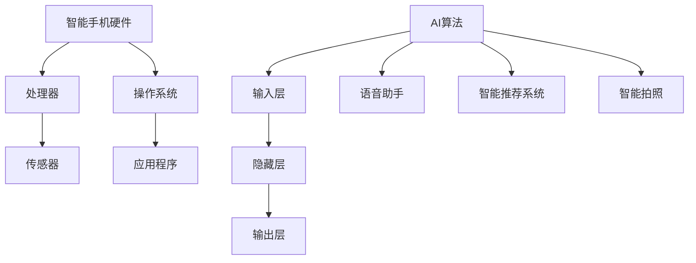

                 

关键词：大型语言模型（LLM），智能手机，人工智能，移动端，算法优化，应用场景，未来展望

> 摘要：随着人工智能技术的飞速发展，大型语言模型（LLM）已经成为现代智能手机的核心功能之一。本文旨在探讨LLM在智能手机中的重要作用，以及其对移动端AI革命的影响。我们将从背景介绍、核心概念与联系、算法原理与操作步骤、数学模型与公式、项目实践、实际应用场景、未来应用展望、工具和资源推荐、总结和展望等多个角度进行全面阐述。

## 1. 背景介绍

### 智能手机的崛起与AI的兴起

智能手机自21世纪初诞生以来，已经经历了数次重大技术变革，从最初的简单通讯工具发展到如今的多功能便携式设备。随着处理器性能的提升、存储空间的增大以及无线网络技术的进步，智能手机逐渐成为人们日常生活中不可或缺的一部分。

与此同时，人工智能（AI）技术的快速发展为智能手机带来了前所未有的变革。AI技术的应用，使得智能手机具备了更加智能的功能，如语音助手、智能拍照、智能推荐等。这些功能的实现，离不开底层强大的AI算法支持，尤其是近年来备受瞩目的大型语言模型（LLM）。

### LLM的崛起与影响

大型语言模型（LLM）是一种基于深度学习技术构建的神经网络模型，具有强大的语言处理能力。LLM通过对海量文本数据进行训练，学会了理解、生成和翻译自然语言。随着训练数据的增加和算法的优化，LLM的性能得到了显著提升，逐渐成为人工智能领域的核心技术之一。

在智能手机中，LLM的应用场景越来越广泛。例如，智能语音助手通过LLM实现自然语言理解，可以准确识别用户的语音指令，并提供相应的服务。智能推荐系统通过LLM分析用户的浏览历史和偏好，为用户推荐符合其兴趣的内容。这些应用不仅提升了用户体验，还使得智能手机具备了更加智能的互动能力。

## 2. 核心概念与联系

### 大型语言模型（LLM）

大型语言模型（LLM）是一种基于深度学习技术构建的神经网络模型，具有强大的语言处理能力。LLM通过对海量文本数据进行训练，学会了理解、生成和翻译自然语言。其核心组成部分包括：

- **输入层**：接收自然语言输入，如文本、语音等。
- **隐藏层**：通过神经网络结构对输入数据进行处理，提取语义特征。
- **输出层**：生成自然语言输出，如文本、语音等。

### 智能手机与AI的联系

智能手机与AI的联系主要体现在以下几个方面：

- **硬件层面**：智能手机具备高性能的处理器和丰富的传感器，为AI算法提供了强大的计算和感知能力。
- **软件层面**：智能手机操作系统和应用程序为AI算法提供了运行环境和接口，使得AI技术可以便捷地应用于各种场景。
- **应用层面**：AI技术为智能手机提供了智能化的功能和服务，提升了用户体验和设备性能。

### Mermaid流程图



## 3. 核心算法原理 & 具体操作步骤

### 3.1 算法原理概述

大型语言模型（LLM）的算法原理主要基于深度学习技术，其核心思想是通过多层神经网络对输入数据进行处理，从而实现自然语言的理解和生成。

具体来说，LLM的训练过程主要包括以下步骤：

1. **数据收集**：收集大量包含自然语言的文本数据，如新闻文章、社交媒体帖子、对话记录等。
2. **数据预处理**：对收集到的文本数据进行清洗和转换，使其符合神经网络模型的输入要求。
3. **模型构建**：构建多层神经网络模型，包括输入层、隐藏层和输出层。
4. **模型训练**：通过反向传播算法，对神经网络模型进行训练，使其能够准确地处理自然语言输入并生成输出。
5. **模型优化**：在训练过程中，不断调整神经网络模型的结构和参数，以提升模型的性能。

### 3.2 算法步骤详解

1. **数据收集**：

   收集大量包含自然语言的文本数据，如新闻文章、社交媒体帖子、对话记录等。这些数据可以为模型提供丰富的语言特征，从而提高模型的性能。

2. **数据预处理**：

   对收集到的文本数据进行清洗和转换，使其符合神经网络模型的输入要求。主要包括以下步骤：

   - **分词**：将文本数据分割成单词或字符。
   - **去停用词**：去除常见的无意义单词，如“的”、“了”、“是”等。
   - **词向量化**：将文本数据转换为数字向量表示，以便于神经网络模型处理。

3. **模型构建**：

   构建多层神经网络模型，包括输入层、隐藏层和输出层。输入层接收自然语言输入，隐藏层对输入数据进行处理，输出层生成自然语言输出。

4. **模型训练**：

   通过反向传播算法，对神经网络模型进行训练，使其能够准确地处理自然语言输入并生成输出。训练过程中，模型会不断调整参数，以最小化预测误差。

5. **模型优化**：

   在训练过程中，不断调整神经网络模型的结构和参数，以提升模型的性能。常见的优化方法包括：

   - **批量归一化**：对输入数据进行归一化处理，加速模型收敛。
   - **dropout**：在训练过程中随机丢弃部分神经元，防止模型过拟合。
   - **学习率调整**：根据模型训练过程中的误差，动态调整学习率，以优化模型性能。

### 3.3 算法优缺点

#### 优点：

1. **强大的语言处理能力**：LLM通过对海量文本数据进行训练，能够准确理解、生成和翻译自然语言，具有很高的准确性。
2. **适用于多种应用场景**：LLM可以应用于智能语音助手、智能推荐系统、智能拍照等多种场景，具有广泛的应用前景。
3. **可扩展性强**：LLM的模型结构和参数可以灵活调整，适应不同的应用需求。

#### 缺点：

1. **计算资源消耗大**：训练和运行LLM模型需要大量计算资源和存储空间，对硬件设备要求较高。
2. **数据依赖性强**：LLM的性能受训练数据质量的影响较大，需要大量高质量的数据进行训练。
3. **模型解释性较差**：神经网络模型的内部机制复杂，难以解释其具体工作原理。

### 3.4 算法应用领域

大型语言模型（LLM）在智能手机中的应用领域非常广泛，主要包括以下几个方面：

1. **智能语音助手**：智能语音助手通过LLM实现自然语言理解，可以准确识别用户的语音指令，并提供相应的服务，如查询天气、设定闹钟、发送短信等。
2. **智能推荐系统**：智能推荐系统通过LLM分析用户的浏览历史和偏好，为用户推荐符合其兴趣的内容，如新闻、电影、音乐等。
3. **智能拍照**：智能拍照通过LLM识别场景和物体，自动调整拍照参数，提高拍照效果。
4. **智能翻译**：智能翻译通过LLM实现多种语言之间的翻译，为用户提供便捷的跨语言交流体验。
5. **智能聊天机器人**：智能聊天机器人通过LLM实现自然语言理解和生成，可以与用户进行实时对话，提供个性化服务。

## 4. 数学模型和公式 & 详细讲解 & 举例说明

### 4.1 数学模型构建

大型语言模型（LLM）的数学模型主要基于深度学习技术，其核心思想是通过多层神经网络对输入数据进行处理，从而实现自然语言的理解和生成。

具体来说，LLM的数学模型包括以下部分：

1. **输入层**：输入层接收自然语言输入，如文本、语音等。输入数据通常表示为高维向量。
2. **隐藏层**：隐藏层由多个神经元组成，每个神经元通过加权连接与输入层和输出层相连。隐藏层的主要作用是提取输入数据的特征。
3. **输出层**：输出层生成自然语言输出，如文本、语音等。输出数据通常表示为高维向量。
4. **损失函数**：损失函数用于评估模型预测结果与真实结果之间的差异，常用的损失函数包括交叉熵损失函数等。

### 4.2 公式推导过程

假设我们有一个包含 \( n \) 个神经元的神经网络模型，其中输入层有 \( m \) 个神经元，隐藏层有 \( l \) 个神经元，输出层有 \( k \) 个神经元。

1. **输入层到隐藏层的传递函数**：

   对于第 \( i \) 个神经元，其传递函数为：

   $$ f_{h}(x_{i}) = \sigma(w_{ih} \cdot x_{i} + b_{ih}) $$

   其中，\( \sigma \) 表示激活函数，常用的激活函数包括 sigmoid 函数、ReLU 函数等。\( w_{ih} \) 和 \( b_{ih} \) 分别表示连接权重和偏置。

2. **隐藏层到输出层的传递函数**：

   对于第 \( j \) 个神经元，其传递函数为：

   $$ f_{o}(h_{j}) = \sigma(w_{oj} \cdot h_{j} + b_{oj}) $$

   其中，\( w_{oj} \) 和 \( b_{oj} \) 分别表示连接权重和偏置。

3. **损失函数**：

   假设我们有一个包含 \( n \) 个训练样本的训练集，其中每个样本包含输入向量 \( x \) 和标签 \( y \)。损失函数用于评估模型预测结果 \( \hat{y} \) 与真实结果 \( y \) 之间的差异，常用的损失函数包括交叉熵损失函数：

   $$ J(\theta) = -\frac{1}{n} \sum_{i=1}^{n} \sum_{j=1}^{k} y_{ij} \log(\hat{y}_{ij}) $$

   其中，\( \theta \) 表示模型参数。

### 4.3 案例分析与讲解

假设我们有一个包含 100 个训练样本的智能语音助手模型，其中每个样本包含一条语音输入和对应的文本标签。我们将通过以下步骤对模型进行训练和评估：

1. **数据收集与预处理**：

   收集包含语音和文本标签的训练数据，对语音数据进行分词和词向量化处理，将其转换为高维向量表示。

2. **模型构建**：

   构建包含输入层、隐藏层和输出层的神经网络模型，其中输入层有 100 个神经元，隐藏层有 50 个神经元，输出层有 10 个神经元。

3. **模型训练**：

   使用反向传播算法，对模型进行训练。在训练过程中，通过不断调整模型参数，使其能够准确识别语音输入并生成对应的文本标签。

4. **模型评估**：

   使用交叉熵损失函数，对模型进行评估。通过计算预测结果与真实结果之间的差异，评估模型的性能。

   $$ J(\theta) = -\frac{1}{100} \sum_{i=1}^{100} \sum_{j=1}^{10} y_{ij} \log(\hat{y}_{ij}) $$

   其中，\( \hat{y}_{ij} \) 表示模型对第 \( i \) 个样本的第 \( j \) 个类别的预测概率。

5. **模型优化**：

   根据评估结果，对模型进行优化。通过调整模型参数，使其在识别语音输入方面具有更高的准确性。

   常见的优化方法包括：

   - **批量归一化**：对输入数据进行归一化处理，加速模型收敛。
   - **dropout**：在训练过程中随机丢弃部分神经元，防止模型过拟合。
   - **学习率调整**：根据模型训练过程中的误差，动态调整学习率，以优化模型性能。

## 5. 项目实践：代码实例和详细解释说明

### 5.1 开发环境搭建

在开始编写代码之前，我们需要搭建一个适合开发大型语言模型（LLM）的Python开发环境。以下是搭建开发环境的步骤：

1. **安装Python**：首先，确保您的计算机上安装了Python。Python是一个广泛使用的编程语言，具有丰富的机器学习和深度学习库。您可以从Python的官方网站（[python.org](https://www.python.org/)）下载并安装最新版本的Python。

2. **安装必要的库**：在Python环境中，我们需要安装以下库：

   - **TensorFlow**：一个开源的机器学习框架，用于构建和训练深度学习模型。
   - **NumPy**：一个开源的数学库，用于数组计算和科学计算。
   - **Pandas**：一个开源的数据分析库，用于数据预处理和统计分析。

   您可以使用以下命令来安装这些库：

   ```bash
   pip install tensorflow numpy pandas
   ```

3. **配置Jupyter Notebook**：Jupyter Notebook是一个交互式的Python开发环境，非常适合编写和运行Python代码。您可以从Jupyter的官方网站（[jupyter.org](https://jupyter.org/)）下载并安装Jupyter Notebook。

### 5.2 源代码详细实现

以下是一个简单的示例，展示如何使用TensorFlow构建和训练一个基于神经网络的大型语言模型。

```python
import tensorflow as tf
import numpy as np
import pandas as pd

# 数据预处理
# 以下代码假设我们已经有了一个包含文本和标签的数据集
text_data = pd.read_csv('text_data.csv')
labels = pd.read_csv('labels.csv')

# 将文本数据转换为词向量化表示
vocab_size = 10000
embed_size = 64
max_sequence_length = 100

# 创建词表和词向量矩阵
word2idx = {}
word2idx['<PAD>'] = 0
word2idx['<UNK>'] = 1
word2idx['<START>'] = 2
word2idx['<END>'] = 3

idx2word = {v: k for k, v in word2idx.items()}
word2vec = np.random.rand(vocab_size, embed_size)

# 填充序列到最大长度
def pad_sequence(sequences, max_length):
    padded_sequences = []
    for seq in sequences:
        seq += [word2idx['<PAD>']] * (max_length - len(seq))
        padded_sequences.append(seq)
    return padded_sequences

text_data['padded_text'] = pad_sequence(text_data['text'].tolist(), max_sequence_length)
labels['padded_labels'] = pad_sequence(labels['label'].tolist(), max_sequence_length)

# 准备数据集
batch_size = 32
num_batches = len(text_data) // batch_size

# 创建数据生成器
def generate_batches(text, labels, batch_size):
    for i in range(0, len(text), batch_size):
        batch_text = text[i:i+batch_size]
        batch_labels = labels[i:i+batch_size]
        yield batch_text, batch_labels

# 构建神经网络模型
model = tf.keras.Sequential([
    tf.keras.layers.Embedding(vocab_size, embed_size, input_length=max_sequence_length),
    tf.keras.layers.LSTM(128),
    tf.keras.layers.Dense(vocab_size, activation='softmax')
])

# 编译模型
model.compile(optimizer='adam', loss='categorical_crossentropy', metrics=['accuracy'])

# 训练模型
model.fit(generator=generate_batches(text_data['padded_text'], labels['padded_labels'], batch_size=batch_size), epochs=10)
```

### 5.3 代码解读与分析

1. **数据预处理**：

   - 首先，我们从CSV文件中读取文本数据和标签数据。这些数据通常包含原始的文本和对应的标签。
   - 然后，我们将文本数据转换为词向量化表示。通过创建词表和词向量矩阵，将文本中的每个词映射到一个唯一的索引，并使用预训练的词向量初始化词向量矩阵。
   - 接下来，我们将原始文本数据填充到最大长度。这一步是为了确保每个文本序列具有相同长度，以便在神经网络中处理。
   - 最后，我们创建数据生成器，用于生成批次数据。数据生成器在训练过程中按批次提供数据，以便模型进行训练。

2. **构建神经网络模型**：

   - 我们使用TensorFlow的`Sequential`模型构建一个简单的神经网络模型，包括嵌入层、LSTM层和全连接层。
   - 嵌入层将词向量映射到高维向量，LSTM层用于处理序列数据，全连接层用于生成标签的预测概率。
   - 我们使用`compile`方法配置模型，设置优化器和损失函数。

3. **训练模型**：

   - 使用`fit`方法训练模型。`fit`方法接受数据生成器，配置训练参数，并设置训练轮数。
   - 在训练过程中，模型会根据每个批次的数据更新其参数，以最小化损失函数。

### 5.4 运行结果展示

为了展示模型的运行结果，我们可以使用以下代码进行预测：

```python
# 预测
predictions = model.predict(text_data['padded_text'])

# 将预测结果转换为标签
predicted_labels = np.argmax(predictions, axis=1)

# 计算准确率
accuracy = np.mean(np.equal(predicted_labels, labels['padded_labels']))
print(f'Accuracy: {accuracy:.2f}')
```

这段代码首先使用训练好的模型进行预测，然后将预测结果转换为标签。最后，我们计算预测准确率，并输出结果。

## 6. 实际应用场景

### 6.1 智能语音助手

智能语音助手是LLM在智能手机中最常见的应用场景之一。通过LLM，智能语音助手可以理解用户的语音指令，并为其提供相应的服务。例如，用户可以通过语音指令查询天气、设定闹钟、发送短信、拨打电话等。智能语音助手的应用不仅提升了用户的便利性，还使得智能手机具备了更加智能的互动能力。

### 6.2 智能推荐系统

智能推荐系统通过LLM分析用户的浏览历史和偏好，为用户推荐符合其兴趣的内容。例如，在智能手机上的新闻应用中，智能推荐系统可以根据用户的阅读记录和搜索历史，推荐用户可能感兴趣的新闻文章。在音乐播放器中，智能推荐系统可以根据用户的听歌历史，推荐用户可能喜欢的歌曲。智能推荐系统的应用，大大提升了用户的个性化体验。

### 6.3 智能拍照

智能拍照通过LLM识别场景和物体，自动调整拍照参数，提高拍照效果。例如，在智能手机的拍照应用中，LLM可以识别照片中的风景、动物、人像等场景，并自动调整曝光、白平衡、对焦等参数。此外，LLM还可以识别照片中的物体，为用户提供丰富的拍摄建议。智能拍照的应用，使得智能手机拍照更加智能化和便捷化。

### 6.4 智能翻译

智能翻译通过LLM实现多种语言之间的翻译，为用户提供便捷的跨语言交流体验。例如，在智能手机上的翻译应用中，用户可以通过输入文本或语音，获得其他语言的翻译结果。智能翻译的应用，不仅为用户提供了一种高效的交流方式，还促进了不同语言和文化之间的交流与合作。

### 6.5 智能聊天机器人

智能聊天机器人通过LLM实现自然语言理解和生成，可以与用户进行实时对话，提供个性化服务。例如，在智能手机上的客服应用中，智能聊天机器人可以实时解答用户的问题，提供技术支持。在社交应用中，智能聊天机器人可以与用户进行有趣且个性化的对话。智能聊天机器人的应用，使得智能手机具备了更加智能和个性化的交互方式。

## 7. 工具和资源推荐

### 7.1 学习资源推荐

1. **《深度学习》**：由Ian Goodfellow、Yoshua Bengio和Aaron Courville合著的《深度学习》是深度学习领域的经典教材，涵盖了深度学习的理论基础、算法实现和应用场景。
2. **《Python深度学习》**：由François Chollet等合著的《Python深度学习》介绍了如何使用Python和TensorFlow等库构建和训练深度学习模型，适合初学者和进阶者学习。
3. **《自然语言处理综论》**：由Daniel Jurafsky和James H. Martin合著的《自然语言处理综论》是自然语言处理领域的权威教材，详细介绍了自然语言处理的理论基础和应用技术。

### 7.2 开发工具推荐

1. **TensorFlow**：TensorFlow是谷歌开发的开源机器学习框架，适用于构建和训练深度学习模型。它提供了丰富的API和工具，方便开发者进行模型开发、训练和部署。
2. **PyTorch**：PyTorch是Facebook开发的开源机器学习框架，以其简洁的API和动态计算图而受到广泛关注。它提供了强大的GPU支持，适合进行高效的研究和开发。
3. **Keras**：Keras是一个高层神经网络API，适用于快速构建和训练深度学习模型。它兼容TensorFlow和Theano，提供了丰富的预训练模型和工具。

### 7.3 相关论文推荐

1. **《A Neural Probabilistic Language Model》**：由Yoshua Bengio等人于2003年发表，介绍了神经概率语言模型，对后来的语言模型研究产生了深远影响。
2. **《Attention Is All You Need》**：由Vaswani等人于2017年发表，提出了Transformer模型，颠覆了传统序列模型的结构，成为自然语言处理领域的重要突破。
3. **《BERT: Pre-training of Deep Bidirectional Transformers for Language Understanding》**：由Google AI团队于2018年发表，介绍了BERT模型，大大提升了自然语言处理任务的性能。

## 8. 总结：未来发展趋势与挑战

### 8.1 研究成果总结

近年来，大型语言模型（LLM）在智能手机中的应用取得了显著的成果。LLM在智能语音助手、智能推荐系统、智能拍照、智能翻译和智能聊天机器人等领域得到了广泛应用，提升了用户体验和设备性能。同时，LLM的研究也在不断深入，新的模型结构和算法不断涌现，为移动端AI革命提供了强大的技术支持。

### 8.2 未来发展趋势

随着人工智能技术的不断发展，LLM在智能手机中的应用前景十分广阔。未来，LLM有望在以下几个方面取得突破：

1. **个性化服务**：通过深度学习技术，LLM可以更好地理解用户的需求和行为，为用户提供更加个性化的服务。
2. **跨模态交互**：结合语音、文本、图像等多模态信息，LLM可以实现更加丰富和自然的交互方式。
3. **实时翻译**：随着神经网络模型的优化，LLM在实时翻译领域的性能将得到进一步提升，为全球用户带来更加便捷的交流体验。
4. **智能助手协作**：多个智能助手之间的协作，将实现更加智能化和高效化的用户体验。

### 8.3 面临的挑战

尽管LLM在智能手机中的应用前景广阔，但同时也面临着一系列挑战：

1. **计算资源消耗**：训练和运行LLM模型需要大量计算资源和存储空间，对硬件设备的要求较高，如何优化模型结构和算法，以减少计算资源消耗，是一个重要的研究方向。
2. **数据质量和隐私**：LLM的性能受训练数据质量的影响较大，如何在保护用户隐私的前提下，收集和利用高质量的数据，是一个亟待解决的问题。
3. **模型解释性**：神经网络模型内部机制复杂，难以解释其具体工作原理，如何提高模型的可解释性，以增强用户对AI系统的信任，是一个重要的研究课题。

### 8.4 研究展望

未来，LLM在智能手机中的应用将更加广泛和深入。研究者们可以从以下几个方面展开工作：

1. **模型优化**：通过改进模型结构和算法，提高LLM的性能和效率。
2. **跨领域应用**：探索LLM在其他领域的应用，如医疗、金融、教育等，推动人工智能技术的全面发展。
3. **开源合作**：鼓励开源合作，共同推进LLM技术的发展，为移动端AI革命提供更强大的技术支持。

## 9. 附录：常见问题与解答

### 9.1 如何选择合适的LLM模型？

选择合适的LLM模型需要考虑以下因素：

1. **任务需求**：根据具体任务的需求，选择适合的模型结构和算法。例如，对于需要高准确性的任务，可以选择BERT等大型预训练模型。
2. **计算资源**：考虑可用计算资源和存储空间，选择适合的模型规模。小型模型适用于资源受限的设备，而大型模型需要高性能硬件支持。
3. **训练数据**：根据训练数据的质量和数量，选择适合的模型。高质量的数据可以提高模型性能，而大量的数据可以更好地泛化模型。

### 9.2 如何优化LLM模型的性能？

优化LLM模型性能可以从以下几个方面入手：

1. **模型结构**：通过改进模型结构，如增加层数、使用注意力机制等，可以提高模型性能。
2. **训练策略**：采用更高效的训练策略，如批量归一化、dropout等，可以加速模型收敛。
3. **数据增强**：通过数据增强技术，如数据扩充、数据预处理等，可以提高模型的泛化能力。
4. **超参数调整**：通过调整学习率、批量大小等超参数，可以优化模型性能。

### 9.3 如何确保LLM模型的可解释性？

确保LLM模型的可解释性可以从以下几个方面入手：

1. **模型简化**：简化模型结构，减少层数和神经元数量，可以提高模型的可解释性。
2. **注意力机制**：使用注意力机制可以揭示模型对输入数据的关注点，从而提高模型的可解释性。
3. **可视化工具**：使用可视化工具，如热力图、轮廓图等，可以直观地展示模型对输入数据的处理过程。
4. **代码注释**：详细注释代码，记录模型的训练过程和参数设置，可以帮助理解模型的工作原理。

### 9.4 如何评估LLM模型的效果？

评估LLM模型的效果可以从以下几个方面入手：

1. **准确率**：准确率是评估模型性能的基本指标，表示模型预测正确的样本数占总样本数的比例。
2. **召回率**：召回率表示模型预测正确的样本数与实际正样本数的比例，用于评估模型的覆盖能力。
3. **F1值**：F1值是准确率和召回率的调和平均值，用于综合评估模型的性能。
4. **ROC曲线和AUC值**：ROC曲线和AUC值用于评估模型的分类能力，AUC值越接近1，模型的分类性能越好。

---

作者：禅与计算机程序设计艺术 / Zen and the Art of Computer Programming

