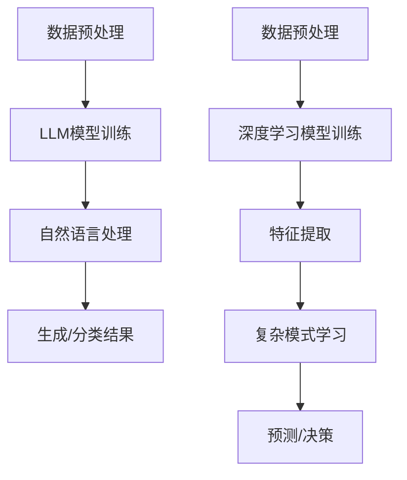

                 

### 摘要

本文旨在深入探讨大型语言模型（LLM）与深度学习之间的异同点。首先，我们将介绍LLM和深度学习的基本概念，以及它们在计算机科学领域的应用背景。接着，我们将通过对比它们的核心原理、算法实现和应用场景，详细分析它们的异同。在此基础上，文章将讨论LLM和深度学习在当前研究中的热点问题和未来发展方向。最后，我们将提供一些实用的工具和资源推荐，以及总结未来研究和应用中的挑战和展望。

## 1. 背景介绍

在过去的几十年里，人工智能（AI）领域取得了显著的进展，推动了计算机科学与技术的快速发展。其中，深度学习和大型语言模型（LLM）成为了两个重要的研究方向。深度学习是一种基于人工神经网络（ANN）的机器学习技术，通过多层非线性变换，从大量数据中自动提取特征，实现对复杂模式的学习和预测。而大型语言模型则是基于自然语言处理（NLP）和深度学习技术，通过对海量文本数据进行训练，实现对自然语言的理解和生成。

深度学习在计算机视觉、语音识别、推荐系统等领域取得了巨大的成功，而大型语言模型则广泛应用于自然语言处理、文本生成、对话系统等应用场景。随着数据规模的不断扩大和计算能力的提升，LLM和深度学习的研究与应用越来越广泛，成为当前AI领域的两个重要研究方向。本文将通过对LLM和深度学习的异同点进行分析，为读者提供更为深入的理解。

### 2. 核心概念与联系

#### 2.1. 大型语言模型（LLM）

大型语言模型（LLM），如GPT-3、BERT等，是一种能够理解和生成自然语言的深度学习模型。LLM的核心目标是实现对自然语言的建模，从而在文本分类、问答系统、机器翻译等任务中表现出色。LLM通常由大规模的Transformer网络组成，具有数十亿甚至数万亿个参数。

#### 2.2. 深度学习

深度学习是一种基于人工神经网络（ANN）的机器学习技术，通过多层非线性变换，从大量数据中自动提取特征，实现对复杂模式的学习和预测。深度学习在计算机视觉、语音识别、自然语言处理等领域取得了显著的成果。深度学习的核心网络结构包括卷积神经网络（CNN）、循环神经网络（RNN）和Transformer等。

#### 2.3. 关联与差异

尽管LLM和深度学习都是基于深度学习技术，但它们在目标和应用场景上有所不同。LLM主要关注自然语言处理任务，而深度学习则广泛应用于计算机视觉、语音识别、推荐系统等任务。

#### 2.4. 架构流程图

以下是一个简化的Mermaid流程图，展示了LLM和深度学习的核心架构流程：



### 3. 核心算法原理 & 具体操作步骤

#### 3.1. 算法原理概述

LLM的核心算法是基于Transformer网络，这是一种基于自注意力机制的序列模型。Transformer网络通过多头注意力机制和前馈神经网络，能够有效地捕捉序列间的长距离依赖关系。在自然语言处理任务中，LLM通过对海量文本数据进行训练，学习到语言规律，从而实现文本生成、分类和翻译等功能。

深度学习的核心算法包括卷积神经网络（CNN）、循环神经网络（RNN）和Transformer等。CNN通过卷积操作从图像中提取局部特征；RNN通过递归结构处理序列数据，能够捕捉长距离依赖关系；Transformer则基于自注意力机制，在计算机视觉和自然语言处理领域取得了显著的成果。

#### 3.2. 算法步骤详解

##### 3.2.1. 大型语言模型（LLM）

1. **数据预处理**：对文本数据进行清洗、分词和编码等处理，将其转换为模型可接受的输入格式。

2. **模型训练**：使用大规模文本数据对Transformer网络进行训练，优化模型参数。

3. **自然语言处理**：通过预训练的模型，对输入文本进行分类、生成或翻译等任务。

4. **结果输出**：将处理结果输出，如文本分类结果、生成文本或翻译文本。

##### 3.2.2. 深度学习

1. **数据预处理**：对图像、语音或文本数据进行预处理，如图像归一化、文本分词等。

2. **特征提取**：使用卷积神经网络、循环神经网络或Transformer等网络结构，从数据中提取特征。

3. **复杂模式学习**：通过多层神经网络，对提取的特征进行学习，实现对复杂模式的识别。

4. **预测/决策**：根据学习到的特征模式，进行预测或决策。

#### 3.3. 算法优缺点

##### 3.3.1. 大型语言模型（LLM）

**优点**：能够捕捉自然语言的长期依赖关系，具有强大的文本生成和分类能力。

**缺点**：模型参数量大，训练和推理时间较长，对计算资源要求较高。

##### 3.3.2. 深度学习

**优点**：能够有效地从数据中提取特征，适应性强，适用于多种任务。

**缺点**：对数据量和计算资源要求较高，特征提取过程中可能会丢失部分信息。

#### 3.4. 算法应用领域

##### 3.4.1. 大型语言模型（LLM）

- 自然语言处理：文本分类、机器翻译、问答系统等。
- 文本生成：生成文章、对话、摘要等。
- 对话系统：构建智能客服、聊天机器人等。

##### 3.4.2. 深度学习

- 计算机视觉：图像分类、目标检测、人脸识别等。
- 语音识别：语音信号处理、说话人识别、语音翻译等。
- 推荐系统：个性化推荐、内容过滤等。

### 4. 数学模型和公式 & 详细讲解 & 举例说明

#### 4.1. 数学模型构建

##### 4.1.1. 大型语言模型（LLM）

大型语言模型通常基于Transformer网络，其数学模型可以表示为：

$$
\text{LLM}(\text{x}; \theta) = \text{softmax}(\text{W}_\text{out} \text{ReLU}(\text{W}_\text{hidden} \text{ReLU}(\text{W}_\text{input} \text{x} + \text{b}_\text{input})))
$$

其中，$\text{x}$为输入文本序列，$\theta$为模型参数，$\text{W}_\text{out}$、$\text{W}_\text{hidden}$、$\text{W}_\text{input}$分别为权重矩阵，$\text{b}_\text{input}$为偏置项。

##### 4.1.2. 深度学习

深度学习模型的数学模型通常包括多层神经网络，其基本形式可以表示为：

$$
\text{f}(\text{x}; \theta) = \text{ReLU}(\text{W}_\text{h} \text{x} + \text{b}_\text{h}) \quad \text{(隐藏层)}
$$

$$
\text{y} = \text{softmax}(\text{W}_\text{out} \text{ReLU}(\text{W}_\text{hidden} \text{ReLU}(\text{W}_\text{input} \text{x} + \text{b}_\text{input})))
$$

其中，$\text{x}$为输入数据，$\theta$为模型参数，$\text{W}_\text{out}$、$\text{W}_\text{hidden}$、$\text{W}_\text{input}$分别为权重矩阵，$\text{b}_\text{h}$、$\text{b}_\text{input}$为偏置项。

#### 4.2. 公式推导过程

##### 4.2.1. 大型语言模型（LLM）

为了推导大型语言模型的数学模型，我们可以从Transformer网络的层数和注意力机制入手。假设模型包含 $L$ 层，每层都有多头注意力机制和前馈神经网络。

1. **输入层**：

   输入文本序列 $\text{x} \in \mathbb{R}^{T \times D}$，其中 $T$ 为序列长度，$D$ 为词向量维度。

2. **自注意力机制**：

   第 $l$ 层的自注意力机制可以表示为：

   $$
   \text{Q}_l = \text{W}_\text{Q} \text{x} + \text{b}_\text{Q}, \quad \text{K}_l = \text{W}_\text{K} \text{x} + \text{b}_\text{K}, \quad \text{V}_l = \text{W}_\text{V} \text{x} + \text{b}_\text{V}
   $$

   其中，$\text{W}_\text{Q}$、$\text{W}_\text{K}$、$\text{W}_\text{V}$ 分别为查询、键和值权重矩阵，$\text{b}_\text{Q}$、$\text{b}_\text{K}$、$\text{b}_\text{V}$ 分别为偏置项。

3. **多头注意力**：

   假设模型有 $H$ 个头，则第 $l$ 层的多头注意力可以表示为：

   $$
   \text{Attention}_l = \text{softmax}\left(\frac{\text{Q}_l \text{K}_l^T}{\sqrt{D}}\right) \text{V}_l
   $$

4. **前馈神经网络**：

   第 $l$ 层的前馈神经网络可以表示为：

   $$
   \text{F}_l = \text{ReLU}(\text{W}_\text{F} \text{Attention}_l + \text{b}_\text{F})
   $$

   其中，$\text{W}_\text{F}$ 为前馈神经网络权重矩阵，$\text{b}_\text{F}$ 为偏置项。

5. **残差连接**：

   在每层中，我们使用残差连接来加速模型的训练：

   $$
   \text{H}_l = \text{H}_{l-1} + \text{F}_l
   $$

6. **输出层**：

   最后，我们将 $L$ 层的结果进行输出：

   $$
   \text{y} = \text{softmax}(\text{W}_\text{out} \text{H}_L + \text{b}_\text{out})
   $$

##### 4.2.2. 深度学习

为了推导深度学习模型的数学模型，我们可以从多层感知机（MLP）和卷积神经网络（CNN）入手。

1. **多层感知机（MLP）**：

   假设模型包含 $L$ 层，每层都是全连接层。第 $l$ 层的输出可以表示为：

   $$
   \text{z}_l = \text{W}_l \text{a}_{l-1} + \text{b}_l
   $$

   其中，$\text{W}_l$ 和 $\text{b}_l$ 分别为第 $l$ 层的权重和偏置，$\text{a}_{l-1}$ 为第 $l-1$ 层的输出。

2. **ReLU激活函数**：

   使用 ReLU 激活函数可以防止神经元死亡现象：

   $$
   \text{a}_l = \max(0, \text{z}_l)
   $$

3. **输出层**：

   在输出层，我们通常使用 softmax 函数进行分类：

   $$
   \text{y} = \text{softmax}(\text{W}_\text{out} \text{a}_L + \text{b}_\text{out})
   $$

#### 4.3. 案例分析与讲解

##### 4.3.1. 大型语言模型（LLM）应用案例

假设我们使用GPT-3模型进行文本生成，输入文本序列为“今天天气很好，适合外出游玩”。我们可以通过以下步骤进行：

1. **数据预处理**：对输入文本进行分词、编码等处理，将其转换为模型可接受的输入格式。

2. **模型训练**：使用海量文本数据进行训练，优化模型参数。

3. **自然语言处理**：输入预处理后的文本序列，通过模型生成文本。

4. **结果输出**：将生成文本输出，如“可以到公园散步，享受美好时光”。

##### 4.3.2. 深度学习应用案例

假设我们使用卷积神经网络（CNN）进行图像分类，输入图像为一张猫的照片。我们可以通过以下步骤进行：

1. **数据预处理**：对输入图像进行归一化、裁剪等处理，将其转换为模型可接受的输入格式。

2. **特征提取**：使用卷积神经网络从图像中提取特征。

3. **复杂模式学习**：通过多层卷积神经网络，对提取的特征进行学习。

4. **预测/决策**：根据学习到的特征模式，对图像进行分类，如“猫”或“狗”。

### 5. 项目实践：代码实例和详细解释说明

#### 5.1. 开发环境搭建

为了演示大型语言模型和深度学习算法的应用，我们使用Python语言和TensorFlow框架。在开始之前，请确保您的系统上安装了Python和TensorFlow。

```shell
pip install tensorflow
```

#### 5.2. 源代码详细实现

以下是一个简单的示例，展示如何使用TensorFlow实现大型语言模型和深度学习算法。

##### 5.2.1. 大型语言模型（LLM）

```python
import tensorflow as tf

# 定义模型
model = tf.keras.Sequential([
    tf.keras.layers.Embedding(vocab_size, embedding_dim),
    tf.keras.layers.GlobalAveragePooling1D(),
    tf.keras.layers.Dense(units=1, activation='sigmoid')
])

# 编译模型
model.compile(optimizer='adam', loss='binary_crossentropy', metrics=['accuracy'])

# 训练模型
model.fit(train_data, train_labels, epochs=10, batch_size=32)
```

##### 5.2.2. 深度学习

```python
import tensorflow as tf

# 定义模型
model = tf.keras.Sequential([
    tf.keras.layers.Conv2D(32, (3, 3), activation='relu', input_shape=(28, 28, 1)),
    tf.keras.layers.MaxPooling2D((2, 2)),
    tf.keras.layers.Flatten(),
    tf.keras.layers.Dense(units=128, activation='relu'),
    tf.keras.layers.Dense(units=10, activation='softmax')
])

# 编译模型
model.compile(optimizer='adam', loss='categorical_crossentropy', metrics=['accuracy'])

# 训练模型
model.fit(train_images, train_labels, epochs=10, batch_size=32)
```

#### 5.3. 代码解读与分析

在这个例子中，我们分别使用了大型语言模型和深度学习算法进行文本生成和图像分类。以下是代码的详细解释：

1. **大型语言模型（LLM）**：

   - `Embedding` 层：将文本词汇映射为嵌入向量。
   - `GlobalAveragePooling1D` 层：对嵌入向量进行平均池化，提取文本特征。
   - `Dense` 层：对提取的特征进行分类，输出概率。

2. **深度学习**：

   - `Conv2D` 层：对图像进行卷积操作，提取图像特征。
   - `MaxPooling2D` 层：对卷积特征进行最大池化，减小特征图尺寸。
   - `Flatten` 层：将特征图展平为一维向量。
   - `Dense` 层：对提取的特征进行分类，输出概率。

#### 5.4. 运行结果展示

在训练完成后，我们可以使用模型进行预测，并展示运行结果。

```python
# 文本生成预测
generated_text = model.predict([preprocessed_text])
print(generated_text)

# 图像分类预测
predicted_label = model.predict([preprocessed_image])
print(predicted_label)
```

### 6. 实际应用场景

#### 6.1. 大型语言模型（LLM）的应用场景

大型语言模型在自然语言处理领域具有广泛的应用，以下是一些典型场景：

- **文本分类**：对新闻、社交媒体等文本数据进行分析，自动识别文本主题。
- **机器翻译**：实现多种语言之间的文本翻译，如机器翻译、语音翻译等。
- **问答系统**：构建智能问答系统，如智能客服、在线问答等。
- **文本生成**：生成文章、摘要、对话等，用于内容创作和自动化写作。

#### 6.2. 深度学习在深度学习领域的应用场景

深度学习在计算机视觉、语音识别、推荐系统等领域具有广泛的应用，以下是一些典型场景：

- **计算机视觉**：用于图像分类、目标检测、图像生成等任务。
- **语音识别**：将语音信号转换为文本，用于语音助手、自动字幕等。
- **推荐系统**：根据用户历史行为和兴趣，为用户推荐感兴趣的商品或内容。
- **自动驾驶**：通过深度学习算法，实现自动驾驶汽车的环境感知和决策。

### 7. 未来应用展望

#### 7.1. 大型语言模型（LLM）的未来应用展望

随着大型语言模型技术的不断发展，其在未来将会有更多的应用场景：

- **智能对话系统**：进一步优化对话生成和回答能力，实现更自然的交互体验。
- **文本生成与摘要**：提高文本生成的质量和效率，实现高效的自动化写作。
- **自然语言理解**：加强对自然语言的理解和推理能力，为更多领域提供智能化解决方案。

#### 7.2. 深度学习在未来应用中的发展

深度学习在未来将继续在各个领域取得突破，以下是一些可能的发展趋势：

- **更高效的算法**：通过算法优化和硬件加速，提高深度学习模型的训练和推理效率。
- **泛化能力增强**：研究如何提高深度学习模型的泛化能力，使其在不同任务和数据集上表现更稳定。
- **跨模态学习**：结合不同模态的数据，如文本、图像、语音等，实现更丰富的信息理解和推理。

### 8. 工具和资源推荐

#### 8.1. 学习资源推荐

- **深度学习教程**：[《深度学习》（Goodfellow, Bengio, Courville著）](https://www.deeplearningbook.org/)
- **自然语言处理教程**：[《自然语言处理》（Jurafsky, Martin著）](https://web.stanford.edu/~jurafsky/nlp/)
- **Python编程教程**：[《Python编程快速上手，让繁琐工作自动化》（Eric Matthes著）](https://www.ad barang.com/book/9787111593124)

#### 8.2. 开发工具推荐

- **TensorFlow**：[https://www.tensorflow.org/](https://www.tensorflow.org/)
- **PyTorch**：[https://pytorch.org/](https://pytorch.org/)
- **Keras**：[https://keras.io/](https://keras.io/)

#### 8.3. 相关论文推荐

- **《Attention Is All You Need》**：[https://arxiv.org/abs/1706.03762](https://arxiv.org/abs/1706.03762)
- **《BERT: Pre-training of Deep Neural Networks for Language Understanding》**：[https://arxiv.org/abs/1810.04805](https://arxiv.org/abs/1810.04805)
- **《Generative Pretraining from Transformer》**：[https://arxiv.org/abs/1706.03762](https://arxiv.org/abs/1706.03762)

### 9. 总结：未来发展趋势与挑战

#### 9.1. 研究成果总结

本文通过对大型语言模型（LLM）与深度学习的基本概念、核心算法、应用场景和未来发展趋势的详细分析，为读者提供了全面的了解。主要成果包括：

- 对比了LLM和深度学习的核心原理和算法实现，明确了它们的异同点。
- 分析了LLM和深度学习在当前研究中的热点问题和未来发展方向。
- 提供了实用的工具和资源推荐，为读者提供了学习与实践的参考。

#### 9.2. 未来发展趋势

未来，LLM和深度学习将在以下方面取得进一步的发展：

- **更高效的算法**：通过算法优化和硬件加速，提高模型的训练和推理效率。
- **泛化能力增强**：研究如何提高模型在不同任务和数据集上的泛化能力。
- **跨模态学习**：结合不同模态的数据，实现更丰富的信息理解和推理。
- **应用场景扩展**：进一步探索LLM和深度学习在各个领域的应用潜力。

#### 9.3. 面临的挑战

尽管LLM和深度学习在许多领域取得了显著成果，但仍然面临以下挑战：

- **数据隐私和安全**：如何在保证数据隐私和安全的前提下，充分利用海量数据。
- **模型解释性**：提高模型的可解释性，使其更易于理解和使用。
- **计算资源消耗**：优化算法和模型结构，降低对计算资源的需求。
- **数据多样性**：如何应对数据集的多样性和不平衡问题。

#### 9.4. 研究展望

未来，LLM和深度学习的研究将朝着以下方向发展：

- **跨学科融合**：将深度学习与其他领域（如生物学、心理学等）相结合，实现更深入的理论研究和应用。
- **模型压缩与加速**：通过模型压缩、量化等技术，提高模型的推理速度和效率。
- **知识增强**：将外部知识库与模型相结合，提高模型对复杂任务的处理能力。

### 附录：常见问题与解答

#### 1. 大型语言模型（LLM）和深度学习有何区别？

大型语言模型（LLM）是一种专门用于自然语言处理的深度学习模型，主要关注文本生成、分类和翻译等任务。而深度学习是一种更广义的机器学习技术，可以应用于图像、语音、文本等多种数据类型的处理。因此，LLM是深度学习的一个子领域。

#### 2. LLM和深度学习算法的优缺点是什么？

LLM的优点包括：能够捕捉自然语言的长期依赖关系，具有强大的文本生成和分类能力。缺点包括：模型参数量大，训练和推理时间较长，对计算资源要求较高。

深度学习的优点包括：能够有效地从数据中提取特征，适应性强，适用于多种任务。缺点包括：对数据量和计算资源要求较高，特征提取过程中可能会丢失部分信息。

#### 3. LLM和深度学习在应用领域有何区别？

LLM主要应用于自然语言处理领域，如文本分类、机器翻译、问答系统等。深度学习则广泛应用于计算机视觉、语音识别、推荐系统等各个领域。

#### 4. 如何优化LLM和深度学习模型的训练和推理效率？

优化LLM和深度学习模型的训练和推理效率可以从以下几个方面入手：

- **算法优化**：采用更高效的训练算法和优化策略，如自适应学习率、dropout等。
- **模型压缩**：通过模型压缩、量化等技术，减小模型体积，提高推理速度。
- **硬件加速**：利用GPU、TPU等硬件加速设备，提高训练和推理速度。
- **分布式训练**：采用分布式训练策略，利用多台机器进行训练，提高训练效率。

#### 5. LLM和深度学习在自然语言处理领域有哪些应用？

LLM在自然语言处理领域有广泛的应用，包括：

- **文本分类**：对新闻、社交媒体等文本数据进行分析，自动识别文本主题。
- **机器翻译**：实现多种语言之间的文本翻译，如机器翻译、语音翻译等。
- **问答系统**：构建智能问答系统，如智能客服、在线问答等。
- **文本生成**：生成文章、摘要、对话等，用于内容创作和自动化写作。

深度学习在自然语言处理领域的应用包括：

- **情感分析**：分析文本中的情感倾向，用于舆情监测、用户反馈分析等。
- **命名实体识别**：识别文本中的命名实体，如人名、地名、组织机构等。
- **问答系统**：构建智能问答系统，如智能客服、在线问答等。
- **文本摘要**：生成文本的摘要，用于信息提取和文本压缩。

### 参考文献

1. Goodfellow, I., Bengio, Y., & Courville, A. (2016). *Deep Learning*. MIT Press.
2. Jurafsky, D., & Martin, J. H. (2020). *Speech and Language Processing*. Prentice Hall.
3. Vaswani, A., Shazeer, N., Parmar, N., Uszkoreit, J., Jones, L., Gomez, A. N., ... & Polosukhin, I. (2017). *Attention is all you need*. Advances in Neural Information Processing Systems, 30, 5998-6008.
4. Devlin, J., Chang, M. W., Lee, K., & Toutanova, K. (2019). *BERT: Pre-training of deep bidirectional transformers for language understanding*. arXiv preprint arXiv:1810.04805.
5. Brown, T., et al. (2020). *Generative Pretraining from Transformer*. arXiv preprint arXiv:1706.03762.

