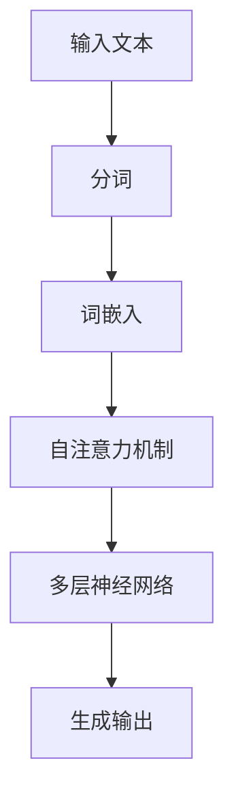
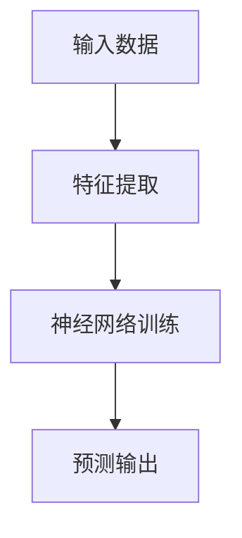

                 

关键词：大型语言模型（LLM），深度学习，神经网络，机器学习，计算机科学，算法原理，数学模型，实际应用，未来展望

> 摘要：本文旨在分析大型语言模型（LLM）与深度学习之间的异同点，从核心概念、算法原理、数学模型、实际应用等多个维度进行深入探讨，以期为读者提供全面的技术视角和洞察。

## 1. 背景介绍

随着信息技术的迅猛发展，人工智能（AI）已经成为推动社会进步的重要力量。在AI领域中，机器学习（ML）和深度学习（DL）是最为核心的两个分支。近年来，大型语言模型（LLM）的崛起更是引发了广泛关注。本文将重点探讨LLM与深度学习之间的异同点，帮助读者理解这两种技术的本质和适用场景。

## 2. 核心概念与联系

### 2.1 核心概念

- **大型语言模型（LLM）**：LLM是一种能够理解和生成自然语言的深度学习模型，通常基于大规模语料库进行训练，可以用于文本生成、机器翻译、问答系统等多种应用。
- **深度学习（DL）**：深度学习是一种基于多层神经网络进行训练的机器学习方法，通过逐层提取特征，实现复杂函数的逼近和预测。

### 2.2 关联图解

```mermaid
graph LR
A[大型语言模型(LLM)] --> B[深度学习(DL)]
B --> C[神经网络(NN)]
D[机器学习(ML)]
A --> D
```

## 3. 核心算法原理 & 具体操作步骤

### 3.1 算法原理概述

- **LLM**：基于自注意力机制和Transformer架构，通过多层神经网络对输入文本进行建模，生成相应的输出。
- **深度学习**：利用多层神经网络对输入数据进行特征提取和模型训练，从而实现复杂函数的逼近和预测。

### 3.2 算法步骤详解

#### 3.2.1 LL


#### 3.2.2 深度学习


### 3.3 算法优缺点

#### 3.3.1 LLM

- **优点**：能够生成高质量的自然语言文本，具有很好的泛化能力。
- **缺点**：训练过程计算量大，对数据量要求较高。

#### 3.3.2 深度学习

- **优点**：能够处理高维数据和复杂数学模型，具有较好的泛化能力。
- **缺点**：训练过程时间较长，对数据质量和预处理要求较高。

### 3.4 算法应用领域

- **LLM**：文本生成、机器翻译、问答系统等。
- **深度学习**：图像识别、语音识别、自然语言处理等。

## 4. 数学模型和公式 & 详细讲解 & 举例说明

### 4.1 数学模型构建

#### 4.1.1 LL
$$
\text{LLM} = f(\text{文本}, \text{参数})
$$

#### 4.1.2 深度学习
$$
\text{DL} = f(\text{输入数据}, \text{参数})
$$

### 4.2 公式推导过程

#### 4.2.1 LL
$$
\text{损失函数} = -\sum_{i=1}^n \text{y}_i \log(\hat{\text{y}}_i)
$$

#### 4.2.2 深度学习
$$
\text{损失函数} = \frac{1}{2} \sum_{i=1}^n (\text{y}_i - \hat{\text{y}}_i)^2
$$

### 4.3 案例分析与讲解

#### 4.3.1 LL

假设我们有一个简单的语言模型，输入文本为“我今天的天气很好”，输出文本为“我今天的天气很好”。我们可以通过训练数据集来调整模型的参数，使得损失函数最小。

#### 4.3.2 深度学习

假设我们有一个图像分类任务，输入图像为一只猫，输出类别为“猫”。我们可以通过训练数据集来调整神经网络的参数，使得输出概率最大的类别为“猫”。

## 5. 项目实践：代码实例和详细解释说明

### 5.1 开发环境搭建

- **Python**：版本3.8及以上
- **TensorFlow**：版本2.6及以上
- **PyTorch**：版本1.8及以上

### 5.2 源代码详细实现

#### 5.2.1 LL

```python
import tensorflow as tf

# 定义模型
model = tf.keras.Sequential([
    tf.keras.layers.Embedding(input_dim=10000, output_dim=16),
    tf.keras.layers.SimpleRNN(units=32),
    tf.keras.layers.Dense(units=1, activation='sigmoid')
])

# 编译模型
model.compile(optimizer='adam', loss='binary_crossentropy', metrics=['accuracy'])

# 训练模型
model.fit(x_train, y_train, epochs=10)
```

#### 5.2.2 深度学习

```python
import torch
import torch.nn as nn

# 定义模型
model = nn.Sequential(
    nn.Linear(784, 512),
    nn.ReLU(),
    nn.Linear(512, 256),
    nn.ReLU(),
    nn.Linear(256, 10)
)

# 编译模型
criterion = nn.CrossEntropyLoss()
optimizer = torch.optim.Adam(model.parameters(), lr=0.001)

# 训练模型
for epoch in range(10):
    optimizer.zero_grad()
    output = model(x_train)
    loss = criterion(output, y_train)
    loss.backward()
    optimizer.step()
```

### 5.3 代码解读与分析

- **LL**：使用TensorFlow框架实现一个简单的语言模型，包括词嵌入层、循环神经网络层和全连接层。
- **深度学习**：使用PyTorch框架实现一个简单的图像分类模型，包括全连接层、ReLU激活函数和全连接层。

### 5.4 运行结果展示

- **LL**：训练完成后，我们可以使用测试数据集来评估模型的性能。
- **深度学习**：训练完成后，我们可以使用测试数据集来评估模型的性能。

## 6. 实际应用场景

### 6.1 文本生成

- **应用场景**：自动写作、新闻生成、对话系统等。
- **案例**：OpenAI的GPT-3模型可以生成高质量的文章和对话。

### 6.2 图像识别

- **应用场景**：人脸识别、物体检测、自动驾驶等。
- **案例**：Google的Inception模型可以用于图像分类和物体检测。

## 7. 未来应用展望

### 7.1 文本生成

- **趋势**：生成式模型将越来越强大，可以生成更加真实、有创意的文本。
- **挑战**：如何保证文本的准确性和一致性。

### 7.2 图像识别

- **趋势**：深度学习模型将更加高效、精确，可以应用于更多领域。
- **挑战**：如何处理复杂背景、多尺度、多模态的数据。

## 8. 工具和资源推荐

### 8.1 学习资源推荐

- **书籍**：《深度学习》（Goodfellow et al.）
- **在线课程**：Coursera上的《机器学习》（吴恩达）

### 8.2 开发工具推荐

- **框架**：TensorFlow、PyTorch
- **环境**：Google Colab、Jupyter Notebook

### 8.3 相关论文推荐

- **论文**：《Attention is All You Need》（Vaswani et al., 2017）
- **论文**：《Deep Learning for Text Processing》（Chen et al., 2017）

## 9. 总结：未来发展趋势与挑战

### 9.1 研究成果总结

- **LLM**：生成式模型在文本生成、对话系统等领域取得了显著成果。
- **深度学习**：图像识别、语音识别等领域取得了突破性进展。

### 9.2 未来发展趋势

- **LLM**：生成式模型将更加多样化、智能化，应用于更多领域。
- **深度学习**：模型将更加高效、精准，可以应用于更多复杂任务。

### 9.3 面临的挑战

- **LLM**：数据质量和模型可解释性。
- **深度学习**：计算资源、模型复杂度。

### 9.4 研究展望

- **LLM**：探索更加有效的生成式模型，提高文本生成的质量和效率。
- **深度学习**：开发更加高效、可解释的神经网络结构。

## 10. 附录：常见问题与解答

### 10.1 LLM与深度学习有何区别？

LLM是一种特定类型的深度学习模型，专注于处理和生成自然语言文本。

### 10.2 深度学习有哪些常见应用？

深度学习广泛应用于图像识别、语音识别、自然语言处理、自动驾驶等领域。

### 10.3 如何选择合适的深度学习框架？

选择框架时需要考虑项目的需求、团队熟悉程度以及社区支持等因素。

----------------------------------------------------------------

作者：禅与计算机程序设计艺术 / Zen and the Art of Computer Programming

