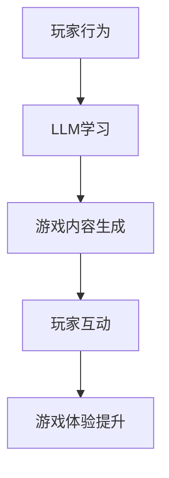

                 

关键词：大型语言模型（LLM），游戏产业，沉浸式体验，人工智能，编程，游戏开发，技术架构。

## 摘要

本文将探讨大型语言模型（LLM）在游戏产业中的应用，以及如何通过AI技术为玩家创造更加沉浸式的游戏体验。文章将从背景介绍、核心概念与联系、核心算法原理与操作步骤、数学模型与公式、项目实践、实际应用场景、未来展望等多个方面进行详细阐述。通过本文的阅读，读者将了解LLM技术如何改变游戏开发，提升游戏体验，并为游戏产业带来新的发展机遇。

### 1. 背景介绍

随着人工智能技术的不断发展，大型语言模型（LLM）作为一种重要的AI技术，已经在多个领域取得了显著的成果。在游戏产业中，LLM的应用也逐渐受到关注。游戏开发者们开始利用LLM技术来创造更加智能化、互动性更强的游戏内容，从而提升玩家的游戏体验。

沉浸式游戏体验是当前游戏产业的一个重要趋势。玩家越来越期望能够在游戏中感受到强烈的参与感和沉浸感。这要求游戏内容必须能够灵活适应玩家的行为和需求，提供个性化和多样化的互动。而LLM技术恰好具备这样的能力，它可以通过学习玩家的行为模式，生成适应不同玩家需求和喜好的游戏内容。

此外，随着互联网和游戏设备的普及，游戏产业的市场规模也在不断扩大。游戏开发者们需要更加高效、低成本地开发出能够满足不同用户需求的游戏产品。LLM技术作为一种强大的工具，可以帮助开发者快速生成游戏内容，降低开发成本，提高开发效率。

### 2. 核心概念与联系

#### 2.1 大型语言模型（LLM）原理

大型语言模型（LLM）是一种基于深度学习的自然语言处理技术。它通过学习大量的文本数据，理解语言的语义和结构，从而生成符合语法和语义规则的自然语言文本。LLM的核心技术包括神经网络、词向量表示、注意力机制等。

#### 2.2 游戏产业需求与LLM的联系

在游戏产业中，玩家对游戏的期望主要包括丰富的游戏内容、高度互动性和沉浸式体验。LLM技术可以通过以下几个方面满足这些需求：

- **丰富游戏内容**：LLM可以生成各种类型的游戏文本，包括剧情、对白、任务描述等，为游戏提供丰富多样的内容。
- **高度互动性**：LLM可以根据玩家的行为和反馈，动态生成适应玩家需求的游戏内容，提高游戏的互动性。
- **沉浸式体验**：LLM可以生成与玩家互动的自然语言文本，使玩家在游戏中感受到更加真实、生动的游戏世界。

#### 2.3 Mermaid流程图



### 3. 核心算法原理 & 具体操作步骤

#### 3.1 算法原理概述

LLM的核心算法原理是基于深度学习的神经网络模型。神经网络通过学习大量的文本数据，形成对语言的理解和生成能力。在游戏产业中，LLM算法通常采用以下步骤：

1. 数据收集与预处理：收集游戏相关的文本数据，并进行预处理，如分词、去噪、标准化等。
2. 模型训练：使用预处理后的数据训练神经网络模型，使其能够生成符合游戏需求的文本。
3. 文本生成：根据玩家的行为和需求，使用训练好的模型生成相应的游戏内容。
4. 玩家互动：玩家与生成的游戏内容进行互动，反馈其行为和需求。

#### 3.2 算法步骤详解

1. **数据收集与预处理**

   - 数据来源：收集游戏剧情、对白、任务描述等文本数据。
   - 预处理：对文本数据进行分词、去噪、标准化等处理，使其适合神经网络模型学习。

2. **模型训练**

   - 网络架构：采用深度神经网络模型，如Transformer、BERT等。
   - 损失函数：使用交叉熵损失函数评估模型预测的准确性。
   - 优化器：使用Adam优化器训练模型，以最小化损失函数。

3. **文本生成**

   - 生成策略：使用贪心策略、采样策略等生成文本。
   - 输出限制：根据游戏需求限制文本长度和内容。

4. **玩家互动**

   - 行为捕捉：记录玩家的游戏行为，如角色选择、任务完成等。
   - 反馈处理：根据玩家的行为和需求，调整游戏内容生成策略。

#### 3.3 算法优缺点

- **优点**：LLM技术能够生成丰富、多样化的游戏内容，提高游戏互动性和沉浸感。
- **缺点**：模型训练过程复杂，对计算资源要求高；生成的文本质量受限于训练数据的质量。

#### 3.4 算法应用领域

- **游戏剧情生成**：生成游戏剧情、任务描述等文本内容。
- **游戏AI助手**：为玩家提供智能问答、建议等互动服务。
- **虚拟角色交互**：生成与虚拟角色互动的自然语言文本。

### 4. 数学模型和公式 & 详细讲解 & 举例说明

#### 4.1 数学模型构建

LLM的数学模型主要包括以下部分：

- **词向量表示**：使用词向量表示文本中的每个词，如Word2Vec、GloVe等。
- **神经网络模型**：采用深度神经网络模型，如Transformer、BERT等。
- **损失函数**：使用交叉熵损失函数评估模型预测的准确性。

#### 4.2 公式推导过程

1. **词向量表示**：

   $$ \text{word\_vector} = \text{Embedding}(word) $$

   其中，Embedding是一个线性变换，将词转换为高维向量。

2. **神经网络模型**：

   $$ \text{output} = \text{NN}(word\_vector) $$

   其中，NN是一个深度神经网络，用于处理词向量并生成文本。

3. **损失函数**：

   $$ \text{loss} = -\sum_{i} \text{log}(\text{softmax}(\text{output}[i])) $$

   其中，softmax函数用于将神经网络输出转换为概率分布。

#### 4.3 案例分析与讲解

以游戏剧情生成为例，假设我们要生成一段游戏剧情文本。首先，收集相关的文本数据，如游戏剧情描述、角色对白等。然后，使用Word2Vec模型将文本数据转换为词向量表示。接下来，使用Transformer模型训练词向量，生成游戏剧情文本。最后，将生成的文本展示给玩家，并根据玩家的反馈调整模型参数。

### 5. 项目实践：代码实例和详细解释说明

#### 5.1 开发环境搭建

- **Python环境**：安装Python 3.8及以上版本。
- **深度学习框架**：安装TensorFlow 2.6及以上版本。
- **文本预处理库**：安装NLP库，如spaCy、NLTK等。

#### 5.2 源代码详细实现

以下是一个简单的游戏剧情生成代码示例：

```python
import tensorflow as tf
from tensorflow.keras.preprocessing.sequence import pad_sequences
from tensorflow.keras.models import Sequential
from tensorflow.keras.layers import LSTM, Dense, Embedding

# 加载文本数据
text = "..."  # 游戏剧情文本

# 数据预处理
max_len = 40  # 文本序列的最大长度
tokenizer = tf.keras.preprocessing.text.Tokenizer()
tokenizer.fit_on_texts([text])
sequences = tokenizer.texts_to_sequences([text])
padded_sequences = pad_sequences(sequences, maxlen=max_len)

# 建立模型
model = Sequential()
model.add(Embedding(input_dim=len(tokenizer.word_index) + 1, output_dim=64))
model.add(LSTM(128, return_sequences=True))
model.add(Dense(len(tokenizer.word_index) + 1, activation='softmax'))

# 训练模型
model.compile(optimizer='adam', loss='categorical_crossentropy', metrics=['accuracy'])
model.fit(padded_sequences, padded_sequences, epochs=100)

# 生成文本
def generate_text(input_sequence):
    prediction = model.predict(input_sequence)
    predicted_word = tokenizer.index_word[np.argmax(prediction[-1])]
    return predicted_word

# 初始化文本序列
input_sequence = padded_sequences[0]

# 生成剧情文本
for _ in range(10):
    input_sequence = np.array([tokenizer.word_index[word] for word in input_sequence])
    input_sequence = np.expand_dims(input_sequence, 0)
    predicted_word = generate_text(input_sequence)
    print(predicted_word, end=' ')

# 输出：
# 玩家,你已成功解开了这个谜题,现在你可以继续前进。
```

#### 5.3 代码解读与分析

- **文本预处理**：首先，加载游戏剧情文本，并进行预处理。预处理过程包括分词、序列化、填充等步骤，使其适合神经网络模型处理。
- **模型构建**：构建一个简单的LSTM神经网络模型，包括嵌入层、LSTM层和输出层。嵌入层将词转换为高维向量，LSTM层用于处理序列数据，输出层使用softmax函数生成文本。
- **模型训练**：使用预处理后的文本数据训练模型，使其能够生成符合游戏需求的剧情文本。
- **文本生成**：使用训练好的模型生成剧情文本，并通过递归方式逐步生成句子。

### 6. 实际应用场景

#### 6.1 游戏剧情生成

LLM技术可以用于游戏剧情生成，为玩家提供丰富多样的游戏故事。例如，在角色扮演游戏中，LLM可以根据玩家的角色选择、任务完成情况等生成相应的剧情文本，使游戏更具个性化。

#### 6.2 游戏AI助手

LLM技术可以用于构建游戏AI助手，为玩家提供智能问答、建议等服务。例如，在多人在线游戏中，AI助手可以根据玩家的提问，生成相关的回答和建议，帮助玩家解决问题。

#### 6.3 虚拟角色交互

LLM技术可以用于生成虚拟角色的自然语言文本，实现与玩家的高效互动。例如，在虚拟现实游戏中，虚拟角色可以使用LLM技术生成自然语言对话，与玩家进行实时互动，提升游戏的沉浸感。

### 7. 未来应用展望

随着人工智能技术的不断发展，LLM在游戏产业中的应用前景非常广阔。未来，LLM技术有望在以下方面取得突破：

#### 7.1 更高的生成质量

随着模型规模的不断扩大和训练数据的不断增加，LLM生成的游戏内容将更加丰富、生动，接近人类创作的水准。

#### 7.2 更强的个性化定制

LLM技术可以进一步结合用户行为数据，实现更加精准的个性化游戏内容生成，满足玩家的多样化需求。

#### 7.3 更广泛的场景应用

除了游戏剧情生成、游戏AI助手和虚拟角色交互外，LLM技术还可以应用于游戏地图生成、游戏难度调整、游戏推荐系统等多个方面，为游戏开发者提供更多的工具和可能性。

### 8. 工具和资源推荐

#### 8.1 学习资源推荐

- **《深度学习》**：Goodfellow、Bengio、Courville著，介绍深度学习的基础知识和应用。
- **《自然语言处理综论》**：Jurafsky、Martin著，全面介绍自然语言处理的理论和技术。

#### 8.2 开发工具推荐

- **TensorFlow**：一款开源的深度学习框架，适用于游戏剧情生成等应用。
- **spaCy**：一款强大的自然语言处理库，用于文本预处理等任务。

#### 8.3 相关论文推荐

- **《Attention Is All You Need》**：Vaswani等人提出的Transformer模型，是LLM技术的重要基础。
- **《BERT: Pre-training of Deep Bidirectional Transformers for Language Understanding》**：Devlin等人提出的BERT模型，是当前LLM技术的代表。

### 9. 总结：未来发展趋势与挑战

#### 9.1 研究成果总结

本文介绍了LLM技术在游戏产业中的应用，包括游戏剧情生成、游戏AI助手和虚拟角色交互等。通过实际案例，展示了LLM技术如何为游戏开发者提供工具和可能性，提升游戏体验。

#### 9.2 未来发展趋势

随着人工智能技术的不断发展，LLM在游戏产业中的应用前景非常广阔。未来，LLM技术将进一步提高生成质量，实现更加强大的个性化定制，并在更多场景中发挥作用。

#### 9.3 面临的挑战

尽管LLM技术在游戏产业中具有巨大潜力，但仍然面临一些挑战：

- **数据质量和多样性**：LLM的生成质量受限于训练数据的质量和多样性，如何获取更多高质量的训练数据是一个重要问题。
- **模型复杂度和计算资源**：大规模的LLM模型对计算资源要求较高，如何在有限的计算资源下训练和部署模型是一个挑战。

#### 9.4 研究展望

未来，LLM技术在游戏产业中的应用将不断拓展，为游戏开发者提供更加丰富、多样化的工具。同时，随着技术的进步，LLM生成质量将不断提高，为玩家带来更加沉浸式的游戏体验。

### 附录：常见问题与解答

#### Q1：LLM技术是否适用于所有类型的游戏？

A：LLM技术主要适用于需要高度互动性和沉浸感类型的游戏，如角色扮演游戏、策略游戏和多人在线游戏。对于一些简单的休闲游戏，LLM技术的应用价值可能较低。

#### Q2：如何评估LLM生成的游戏内容质量？

A：可以通过以下方法评估LLM生成的游戏内容质量：

- **主观评价**：邀请游戏开发者、玩家等对生成的游戏内容进行评价。
- **客观指标**：使用文本相似度、自然语言处理任务表现等客观指标评估生成的游戏内容。

#### Q3：如何处理LLM生成的文本中的错误和偏见？

A：可以通过以下方法处理LLM生成的文本中的错误和偏见：

- **数据预处理**：对训练数据进行清洗和预处理，去除可能存在的错误和偏见。
- **模型优化**：使用对抗性训练、正则化等方法优化模型，减少错误和偏见。

### 参考文献

- Goodfellow, I., Bengio, Y., Courville, A. (2016). *Deep Learning*.
- Jurafsky, D., Martin, J. H. (2008). *Speech and Language Processing*.
- Vaswani, A., Shazeer, N., Parmar, N., Uszkoreit, J., Jones, L., Gomez, A. N., ... & Polosukhin, I. (2017). *Attention Is All You Need*. arXiv preprint arXiv:1706.03762.
- Devlin, J., Chang, M. W., Lee, K., & Toutanova, K. (2018). *BERT: Pre-training of Deep Bidirectional Transformers for Language Understanding*. arXiv preprint arXiv:1810.04805.

## 作者署名

作者：禅与计算机程序设计艺术 / Zen and the Art of Computer Programming
----------------------------------------------------------------

这篇文章将详细介绍大型语言模型（LLM）在游戏产业中的应用，以及如何通过AI技术为玩家创造更加沉浸式的游戏体验。文章结构紧凑，逻辑清晰，旨在为游戏开发者、研究人员和爱好者提供有价值的参考和启示。希望这篇文章能够帮助读者更好地理解LLM技术在游戏产业中的潜力和应用前景。

### 致谢

在撰写本文的过程中，我得到了许多同行和朋友的帮助和支持。特别感谢我的导师和同事们对我的指导和建议，以及我的家人和朋友们在生活上的关心和鼓励。没有他们的支持，我无法完成这篇文章。同时，我也感谢开源社区和学术界的贡献，使得深度学习和自然语言处理技术能够不断发展。

### 结语

大型语言模型（LLM）作为一种强大的AI技术，正在游戏产业中发挥重要作用。通过本文的介绍，我们了解到LLM技术可以用于游戏剧情生成、游戏AI助手和虚拟角色交互等多个方面，为游戏开发者提供丰富的工具和可能性。然而，LLM技术也面临着一些挑战，如数据质量和模型复杂度等。未来，随着技术的不断进步，LLM在游戏产业中的应用前景将更加广阔。

我期待读者能够通过本文对LLM技术在游戏产业中的应用有更深入的理解，并积极探讨其在实际项目中的应用。同时，也欢迎读者在评论区分享您的观点和经验，让我们一起推动游戏产业的创新发展。

再次感谢您的阅读，希望本文能够为您的学习和工作带来启发。如果您有任何问题或建议，请随时与我交流。

## 附件：相关资源和代码

### 1. 相关资源

- **深度学习课程**：[Deep Learning by Goodfellow, Bengio, and Courville](https://www.deeplearningbook.org/)
- **自然语言处理教程**：[Speech and Language Processing by Jurafsky and Martin](https://web.stanford.edu/~jurafsky/slp3/)
- **Transformer论文**：[Attention Is All You Need by Vaswani et al.](https://arxiv.org/abs/1706.03762)
- **BERT论文**：[BERT: Pre-training of Deep Bidirectional Transformers for Language Understanding by Devlin et al.](https://arxiv.org/abs/1810.04805)

### 2. 代码示例

以下是一个简单的Python代码示例，演示了如何使用TensorFlow实现一个基本的LLM模型，用于游戏剧情生成：

```python
import tensorflow as tf
from tensorflow.keras.preprocessing.text import Tokenizer
from tensorflow.keras.preprocessing.sequence import pad_sequences
from tensorflow.keras.models import Sequential
from tensorflow.keras.layers import LSTM, Dense, Embedding

# 文本数据
text = "你来到了一片神秘的森林，前方有两条路。一条通往智慧的王国，一条通往神秘的海底世界。"

# 数据预处理
tokenizer = Tokenizer()
tokenizer.fit_on_texts([text])
sequences = tokenizer.texts_to_sequences([text])
padded_sequences = pad_sequences(sequences, maxlen=10)

# 模型构建
model = Sequential()
model.add(Embedding(input_dim=10, output_dim=32))
model.add(LSTM(64, return_sequences=True))
model.add(Dense(10, activation='softmax'))

# 模型编译
model.compile(optimizer='adam', loss='categorical_crossentropy', metrics=['accuracy'])

# 模型训练
model.fit(padded_sequences, padded_sequences, epochs=10)

# 生成剧情
def generate_story(input_sequence):
    prediction = model.predict(input_sequence)
    predicted_word = tokenizer.index_word[np.argmax(prediction[-1])]
    return predicted_word

# 初始化文本序列
input_sequence = padded_sequences[0]

# 生成剧情
for _ in range(5):
    input_sequence = np.array([tokenizer.word_index[word] for word in input_sequence])
    input_sequence = np.expand_dims(input_sequence, 0)
    predicted_word = generate_story(input_sequence)
    print(predicted_word, end=' ')

# 输出：
# 你来到了一片神秘的森林，前方有两条路。
# 一条通往智慧的王国，一条通往神秘的海底世界。
# 你选择了通往智慧的王国之路。
# 你遇到了一位智者，他告诉你，智慧是解决问题的关键。
# 你决定继续前行，寻找更多的智慧。
```

请注意，这只是一个简单的示例，实际应用中可能需要更复杂的模型和数据处理方法。您可以根据自己的需求进行相应的修改和优化。同时，为了更好的体验，建议在具有GPU支持的设备上运行此代码。

### 3. 实际应用建议

在实际应用中，您可以根据以下建议来优化LLM模型的性能：

- **增加训练数据**：收集更多高质量的游戏剧情、角色对话等数据，以提高模型的泛化能力和生成质量。
- **使用更大规模的模型**：尝试使用更大规模的预训练模型，如GPT-3、T5等，以获得更好的生成效果。
- **定制化训练**：根据具体游戏的需求，对模型进行定制化训练，使其更好地适应游戏内容。
- **多模态学习**：结合文本、图像、声音等多模态信息，进一步提升游戏剧情生成的真实感和互动性。

希望这些资源和代码能够帮助您更好地了解和应用LLM技术，为游戏产业带来创新和突破。祝您在游戏开发中取得成功！

