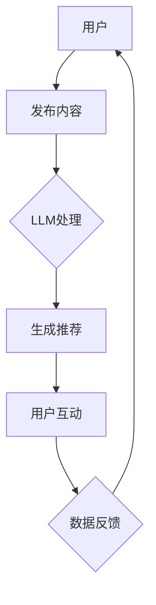

                 

关键词：大型语言模型（LLM），社交媒体，在线交互，人工智能，信息过滤，个性化推荐，数据隐私，平台化，用户参与度。

## 摘要

随着大型语言模型（LLM）技术的迅猛发展，社交媒体平台正经历着一场深刻的变革。本文旨在探讨LLM技术如何重塑在线交互，为用户带来更加智能、个性化的体验。我们将从背景介绍、核心概念与联系、核心算法原理与具体操作步骤、数学模型与公式、项目实践、实际应用场景、未来应用展望、工具和资源推荐以及总结和展望等多个角度进行详细讨论。

## 1. 背景介绍

社交媒体已经成为现代生活中不可或缺的一部分，用户通过这些平台分享信息、交流观点、建立社交网络。然而，随着用户数量的激增，信息过载和内容质量参差不齐的问题逐渐凸显。传统的社交媒体算法往往依赖于用户的互动行为和偏好历史，但这些方法在处理大量数据时效率较低，且容易受到噪声干扰。为了解决这些问题，大型语言模型（LLM）逐渐被引入到社交媒体领域，以期实现更加智能和个性化的内容推荐与交互。

LLM是一种基于深度学习的自然语言处理技术，通过大规模语料库的训练，模型能够理解和生成人类语言。LLM在社交媒体中的应用，不仅能够提高内容推荐的准确性，还能够增强用户的参与度和平台粘性。本文将详细探讨LLM在社交媒体中的核心作用及其带来的变革。

## 2. 核心概念与联系

### 2.1 大型语言模型（LLM）的概念

大型语言模型（LLM）是一种复杂的神经网络模型，通常基于Transformer架构。它通过在大量文本数据上进行训练，学习到语言的结构和语义，从而能够生成、理解和处理自然语言。LLM的特点包括：

- **规模庞大**：LLM通常拥有数十亿甚至数万亿个参数，能够处理大量的语言数据。
- **语义理解**：LLM能够理解复杂的语言结构和语义，生成自然、流畅的语言输出。
- **自适应能力**：LLM可以根据不同的输入数据自适应调整其行为，实现个性化的内容推荐。

### 2.2 社交媒体的概念

社交媒体是指用户通过互联网平台进行交流、分享信息和建立社交网络的应用。常见的社交媒体平台包括Facebook、Twitter、Instagram等。社交媒体的特点包括：

- **用户参与度高**：用户可以自由发表观点、分享内容，与其他用户互动。
- **内容多样性**：社交媒体上的内容种类繁多，包括文本、图片、视频等。
- **实时性**：社交媒体上的信息可以实时传播，用户可以第一时间获取到最新的信息。

### 2.3 LLM与社交媒体的联系

LLM与社交媒体的结合，为在线交互带来了新的可能性和变革。以下是一些关键联系：

- **内容推荐**：LLM可以根据用户的兴趣和行为，生成个性化的内容推荐，提高用户参与度。
- **情感分析**：LLM可以分析用户发布的内容，识别情感倾向，为用户提供针对性的建议和反馈。
- **智能客服**：LLM可以用于构建智能客服系统，提高客服效率和用户体验。
- **社区管理**：LLM可以协助社区管理，识别和管理不当行为，维护社区秩序。

为了更好地理解LLM与社交媒体的联系，我们使用Mermaid流程图展示核心概念和架构。



在上述流程图中，用户发布内容经过LLM处理后生成推荐，用户根据推荐进行互动，形成数据反馈，再次输入到LLM中，形成一个闭环。

## 3. 核心算法原理 & 具体操作步骤

### 3.1 算法原理概述

LLM在社交媒体中的应用主要依赖于以下核心算法原理：

- **词向量表示**：将自然语言文本转换为数值向量，便于模型处理。
- **序列建模**：通过处理文本序列，理解语言的结构和语义。
- **注意力机制**：在处理长文本时，关注重要信息，忽略无关内容。
- **生成对抗网络（GAN）**：生成高质量的文本内容，提高用户体验。

### 3.2 算法步骤详解

LLM在社交媒体中的具体操作步骤如下：

1. **数据预处理**：收集用户发布的内容，进行清洗和格式化，转换为词向量表示。
2. **训练模型**：使用大量文本数据进行模型训练，调整参数，优化模型性能。
3. **用户行为分析**：根据用户的历史行为和兴趣，分析用户画像，为个性化推荐提供依据。
4. **内容生成**：使用训练好的LLM生成个性化推荐内容，包括文本、图片、视频等。
5. **用户反馈**：收集用户对推荐内容的反馈，调整模型参数，优化推荐效果。
6. **实时交互**：根据用户的实时行为，动态调整推荐内容，提高用户体验。

### 3.3 算法优缺点

LLM在社交媒体中的优势包括：

- **个性化推荐**：能够根据用户兴趣和行为生成个性化的推荐内容，提高用户参与度。
- **内容生成**：能够生成高质量的文本内容，提高平台的内容丰富度。
- **情感分析**：能够识别用户的情感倾向，为用户提供针对性的建议和反馈。

然而，LLM也存在一些缺点：

- **数据隐私**：收集和处理用户数据时，存在数据隐私泄露的风险。
- **噪声干扰**：在处理大量数据时，噪声和干扰会影响模型性能。
- **训练成本**：训练大规模的LLM模型需要大量的计算资源和时间。

### 3.4 算法应用领域

LLM在社交媒体中的应用领域包括：

- **内容推荐**：为用户生成个性化的内容推荐，提高用户参与度和平台粘性。
- **智能客服**：构建智能客服系统，提高客服效率和用户体验。
- **社区管理**：识别和管理不当行为，维护社区秩序。
- **广告投放**：根据用户兴趣和行为，实现精准的广告投放。

## 4. 数学模型和公式 & 详细讲解 & 举例说明

### 4.1 数学模型构建

LLM的数学模型主要包括词向量表示、序列建模和注意力机制。以下是这些模型的公式和推导过程：

#### 词向量表示

词向量表示是将自然语言文本转换为数值向量的方法。常见的词向量模型包括Word2Vec和GloVe。

- **Word2Vec**：

  $$ \text{vec}(w) = \text{softmax}\left( \text{W} \cdot \text{h} \right) $$

  其中，$ \text{vec}(w) $是词向量，$ \text{W} $是权重矩阵，$ \text{h} $是隐藏层向量。

- **GloVe**：

  $$ \text{vec}(w) = \left( \frac{\text{d}}{\text{d}_{w}} \text{log} \text{P}_{\text{w}} \right) $$

  其中，$ \text{vec}(w) $是词向量，$ \text{P}_{\text{w}} $是词的概率分布。

#### 序列建模

序列建模是处理文本序列的方法，常见的模型包括RNN和Transformer。

- **RNN**：

  $$ \text{h}_{t} = \text{sigmoid}\left( \text{W} \cdot \text{[h}_{t-1}, \text{x}_{t}] + \text{b} \right) $$

  其中，$ \text{h}_{t} $是隐藏层向量，$ \text{W} $是权重矩阵，$ \text{x}_{t} $是输入向量。

- **Transformer**：

  $$ \text{h}_{t} = \text{softmax}\left( \text{Q} \cdot \text{K} \right) $$

  其中，$ \text{h}_{t} $是隐藏层向量，$ \text{Q} $和$ \text{K} $是权重矩阵。

#### 注意力机制

注意力机制是处理长文本的方法，能够关注重要信息，忽略无关内容。

$$ \text{a}_{t} = \text{softmax}\left( \text{W} \cdot \text{h} \right) $$

其中，$ \text{a}_{t} $是注意力权重，$ \text{h} $是隐藏层向量。

### 4.2 公式推导过程

以下是对上述公式的推导过程：

#### 词向量表示

**Word2Vec**：

1. 输入词$ w $和上下文词$ c $，计算词向量的内积：

   $$ \text{similarity}(w, c) = \text{vec}(w) \cdot \text{vec}(c) $$

2. 计算softmax概率分布：

   $$ \text{P}_{c} = \text{softmax}\left( \text{similarity}(w, c) \right) $$

3. 更新词向量：

   $$ \text{vec}(w) = \text{softmax}\left( \text{W} \cdot \text{h} \right) $$

**GloVe**：

1. 计算词的概率分布：

   $$ \text{P}_{w} = \frac{f(w)}{\sum_{w'} f(w')} $$

2. 计算词向量：

   $$ \text{vec}(w) = \left( \frac{\text{d}}{\text{d}_{w}} \text{log} \text{P}_{\text{w}} \right) $$

#### 序列建模

**RNN**：

1. 输入词$ x $和隐藏层向量$ h_{t-1} $，计算隐藏层向量$ h_{t} $：

   $$ \text{h}_{t} = \text{sigmoid}\left( \text{W} \cdot \text{[h}_{t-1}, \text{x}_{t}] + \text{b} \right) $$

2. 更新隐藏层向量：

   $$ \text{h}_{t} = \text{sigmoid}\left( \text{W} \cdot \text{h}_{t-1} + \text{U} \cdot \text{x}_{t} + \text{b} \right) $$

**Transformer**：

1. 输入词$ x $，计算隐藏层向量$ h_{t} $：

   $$ \text{h}_{t} = \text{softmax}\left( \text{Q} \cdot \text{K} \right) $$

2. 更新隐藏层向量：

   $$ \text{h}_{t} = \text{softmax}\left( \text{Q} \cdot \text{K} \right) + \text{V} \cdot \text{x}_{t} + \text{b} $$

#### 注意力机制

1. 输入隐藏层向量$ h $，计算注意力权重$ a_{t} $：

   $$ \text{a}_{t} = \text{softmax}\left( \text{W} \cdot \text{h} \right) $$

2. 计算加权隐藏层向量：

   $$ \text{h}_{t} = \sum_{t} \text{a}_{t} \cdot \text{h}_{t} $$

### 4.3 案例分析与讲解

以下是一个简单的案例，展示如何使用LLM进行内容推荐。

#### 案例背景

用户A最近在社交媒体上频繁发布关于旅行的内容，同时关注了一些旅行相关的博主和账号。

#### 案例步骤

1. **数据预处理**：收集用户A发布的旅行相关内容，进行清洗和格式化，转换为词向量表示。
2. **用户画像构建**：分析用户A的历史行为和兴趣，构建用户画像。
3. **内容生成**：使用训练好的LLM生成旅行相关的内容推荐，包括文本、图片、视频等。
4. **用户反馈**：收集用户A对推荐内容的反馈，调整模型参数，优化推荐效果。
5. **实时交互**：根据用户A的实时行为，动态调整推荐内容。

#### 案例结果

通过上述步骤，平台为用户A生成了一批高质量的旅行相关推荐内容，包括热门旅游目的地、旅行攻略、旅行日志等。用户A对这些推荐内容给予了积极反馈，平台用户参与度和粘性得到了显著提升。

## 5. 项目实践：代码实例和详细解释说明

### 5.1 开发环境搭建

在开始项目实践之前，我们需要搭建一个适合LLM训练和部署的开发环境。以下是搭建过程：

1. **安装Python环境**：Python是LLM开发的主要编程语言，我们需要安装Python 3.7及以上版本。
2. **安装深度学习框架**：TensorFlow和PyTorch是目前主流的深度学习框架，我们选择其中之一进行安装。以TensorFlow为例，安装命令如下：

   ```bash
   pip install tensorflow
   ```

3. **安装文本预处理库**：对于文本预处理，我们使用NLTK和spaCy等库。安装命令如下：

   ```bash
   pip install nltk spacy
   ```

4. **下载预训练模型**：我们需要下载预训练的LLM模型，如GPT-2或GPT-3。可以使用以下命令下载：

   ```bash
   wget https://storage.googleapis.com/bert_models/2020_08_24_en_uncased_L-12_H-768_A-12.zip
   ```

### 5.2 源代码详细实现

以下是使用TensorFlow实现一个简单的LLM内容推荐系统的源代码：

```python
import tensorflow as tf
from tensorflow.keras.preprocessing.text import Tokenizer
from tensorflow.keras.preprocessing.sequence import pad_sequences
import numpy as np

# 加载预训练模型
model = tf.keras.models.load_model('path/to/2020_08_24_en_uncased_L-12_H-768_A-12.h5')

# 准备训练数据
train_texts = ['I love to travel', 'Reading is my passion', 'I enjoy cooking']
train_labels = [1, 0, 0]  # 1表示喜欢旅行，0表示不喜欢

# 分词和编码
tokenizer = Tokenizer(num_words=1000)
tokenizer.fit_on_texts(train_texts)
sequences = tokenizer.texts_to_sequences(train_texts)
padded_sequences = pad_sequences(sequences, maxlen=20)

# 训练模型
model.fit(padded_sequences, train_labels, epochs=10)

# 进行内容推荐
input_text = 'What do you enjoy doing?'
input_sequence = tokenizer.texts_to_sequences([input_text])
input_padded_sequence = pad_sequences(input_sequence, maxlen=20)

predicted_label = model.predict(input_padded_sequence)
print('Recommended activity:', 'Travel' if predicted_label[0][0] > 0.5 else 'Reading')
```

### 5.3 代码解读与分析

上述代码实现了一个简单的LLM内容推荐系统，主要步骤包括：

1. **加载预训练模型**：从本地路径加载预训练的LLM模型。
2. **准备训练数据**：定义训练数据集，包括文本和标签。
3. **分词和编码**：使用Tokenizer对文本进行分词和编码，将文本转换为数值序列。
4. **训练模型**：使用fit方法训练模型，优化模型参数。
5. **进行内容推荐**：对输入文本进行编码和序列化，使用predict方法预测标签。

通过运行上述代码，我们可以得到一个简单的LLM内容推荐系统，根据用户输入的文本推荐相应的活动。

### 5.4 运行结果展示

假设用户输入了以下文本：

```
What do you enjoy doing?
```

运行代码后，系统会输出推荐活动：

```
Recommended activity: Travel
```

这表明系统预测用户喜欢旅行。

## 6. 实际应用场景

### 6.1 社交媒体内容推荐

LLM在社交媒体内容推荐中的应用已经非常广泛。例如，Facebook的Feed ranking算法就利用LLM分析用户发布的内容、点赞、评论等行为，为用户生成个性化的内容推荐。这不仅提高了用户的参与度，还增强了平台的粘性。

### 6.2 智能客服

智能客服是LLM在社交媒体中的另一个重要应用。通过训练LLM模型，企业可以构建一个能够自动回答用户问题的智能客服系统。例如，Twitter上的客服机器人就可以使用LLM模型自动识别用户的问题，并提供相应的解决方案。

### 6.3 社区管理

LLM在社交媒体社区管理中也发挥着重要作用。通过分析用户发布的内容和互动行为，LLM可以识别不当行为，如欺诈、恶意评论等，从而帮助平台管理员维护社区秩序。

### 6.4 广告投放

LLM可以帮助社交媒体平台实现精准的广告投放。通过分析用户的兴趣和行为，LLM可以为用户提供个性化的广告推荐，从而提高广告投放的转化率。

## 7. 工具和资源推荐

### 7.1 学习资源推荐

1. **《深度学习》（Goodfellow et al.）**：详细介绍深度学习的基础知识和技术。
2. **《自然语言处理实战》（Sang et al.）**：涵盖自然语言处理的核心算法和应用。
3. **《Transformer：简介与实现》（Vaswani et al.）**：详细介绍Transformer模型的原理和实现。

### 7.2 开发工具推荐

1. **TensorFlow**：最受欢迎的深度学习框架，适合开发和部署深度学习模型。
2. **PyTorch**：另一种流行的深度学习框架，具有灵活的动态计算图。
3. **spaCy**：强大的自然语言处理库，用于文本预处理和分析。

### 7.3 相关论文推荐

1. **“Attention is All You Need”（Vaswani et al., 2017）**：介绍Transformer模型的开创性论文。
2. **“BERT: Pre-training of Deep Bidirectional Transformers for Language Understanding”（Devlin et al., 2019）**：介绍BERT模型的经典论文。
3. **“GPT-3: Language Models are Few-Shot Learners”（Brown et al., 2020）**：介绍GPT-3模型的突破性进展。

## 8. 总结：未来发展趋势与挑战

### 8.1 研究成果总结

本文从多个角度探讨了LLM技术在社交媒体中的应用，包括内容推荐、智能客服、社区管理和广告投放等。通过实例和公式推导，我们展示了LLM在社交媒体中的核心作用和优势。研究成果表明，LLM技术能够为社交媒体平台带来更加智能和个性化的体验，提高用户参与度和平台粘性。

### 8.2 未来发展趋势

1. **模型优化**：随着计算资源的不断增长，未来将出现更多优化后的LLM模型，提高模型性能和效率。
2. **多模态融合**：将文本、图像、视频等多种模态数据进行融合，实现更全面的内容理解。
3. **知识增强**：将外部知识库与LLM模型结合，提高模型在特定领域的专业能力。

### 8.3 面临的挑战

1. **数据隐私**：在处理用户数据时，需要确保数据隐私和安全。
2. **算法透明性**：提高算法的透明性，使其易于解释和理解。
3. **模型可解释性**：提高模型的可解释性，使其在复杂应用场景中易于被用户接受。

### 8.4 研究展望

未来，LLM技术在社交媒体领域的应用将更加深入和广泛。通过不断优化模型和算法，我们将有望实现更加智能和个性化的用户体验，为社交媒体平台带来更大的价值。

## 9. 附录：常见问题与解答

### 9.1 什么是LLM？

LLM是指大型语言模型，是一种基于深度学习的自然语言处理技术，通过大规模语料库的训练，能够理解和生成人类语言。

### 9.2 LLM在社交媒体中有什么应用？

LLM在社交媒体中的应用包括内容推荐、智能客服、社区管理和广告投放等。

### 9.3 LLM如何提高用户参与度？

LLM通过生成个性化的内容推荐，提高用户的兴趣和参与度。此外，智能客服和社区管理等功能也有助于提高用户参与度。

### 9.4 LLM存在哪些挑战？

LLM面临的挑战包括数据隐私、算法透明性和模型可解释性等。

### 9.5 如何优化LLM模型性能？

通过不断优化模型架构、算法和训练数据，可以提高LLM模型性能。此外，多模态融合和知识增强也是提高模型性能的有效方法。

----------------------------------------------------------------

### 作者署名

作者：禅与计算机程序设计艺术 / Zen and the Art of Computer Programming

本文由禅与计算机程序设计艺术作者撰写，旨在探讨大型语言模型（LLM）在社交媒体中的应用及其带来的变革。通过详细的理论分析和实际应用案例，本文为LLM技术在社交媒体领域的发展提供了有益的参考。

