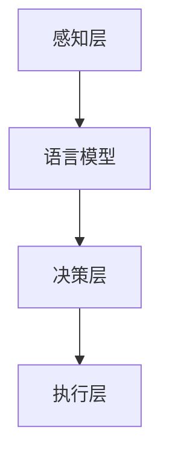

                 

关键词：语言模型，自动驾驶，深度学习，交通系统，未来展望

## 摘要

随着人工智能（AI）技术的迅猛发展，语言模型（LLM）与自动驾驶技术逐渐成为交通领域的重要创新力量。本文将探讨LLM与自动驾驶的深度融合，分析其核心概念、算法原理、数学模型以及应用场景。通过详细介绍LLM在自动驾驶中的作用机制，我们将展示这一技术如何重塑交通未来，并提出未来发展趋势与面临的挑战。

## 1. 背景介绍

自动驾驶技术是人工智能领域的重大突破，其目标是实现车辆在无需人类干预的情况下自主行驶。自动驾驶系统依赖于多种先进技术，包括计算机视觉、传感器融合、决策规划等。近年来，随着深度学习技术的快速发展，语言模型（LLM）在自动驾驶中的应用越来越广泛。

语言模型，是一种能够理解自然语言并生成自然语言的深度学习模型。LLM通过学习大量文本数据，能够对语言进行建模，并生成符合语法规则和语义逻辑的句子。在自动驾驶领域，LLM可以用于处理驾驶指令、理解路况信息、生成行车决策等任务。

## 2. 核心概念与联系

### 2.1 自动驾驶系统架构

自动驾驶系统通常分为感知、决策和执行三个层次。感知层负责收集车辆周围的环境信息，包括道路标志、车道线、行人等。决策层根据感知层的信息，结合车辆的行驶目标，生成行车决策。执行层则负责将决策转化为具体的行驶动作。


### 2.2 语言模型在自动驾驶中的作用

语言模型在自动驾驶系统中主要应用于以下几个方面：

- **指令解析**：接收驾驶者的语音指令，将其转化为具体的行车决策。
- **路况理解**：分析路况信息，预测未来行车情况，为决策层提供数据支持。
- **人机交互**：生成友好的语音提示，与驾驶者进行自然语言交流。

### 2.3 Mermaid 流程图

以下是一个简单的Mermaid流程图，展示语言模型在自动驾驶系统中的作用：



## 3. 核心算法原理 & 具体操作步骤

### 3.1 算法原理概述

语言模型在自动驾驶中的核心原理是自然语言处理（NLP）。通过NLP技术，LLM能够理解自然语言输入，并生成相应的行车决策。具体来说，LLM采用基于神经网络的方法，对大量语言数据进行训练，从而学习到语言的语法规则和语义逻辑。

### 3.2 算法步骤详解

1. **数据预处理**：收集和整理大量语音指令和路况信息，进行数据清洗和标注。
2. **模型训练**：使用训练数据，通过神经网络训练LLM，使其具备理解自然语言的能力。
3. **指令解析**：接收语音指令，将其转化为文本，输入LLM进行语义理解。
4. **决策生成**：根据语义理解的结果，结合感知层的信息，生成行车决策。
5. **决策执行**：将决策传递给执行层，转化为具体的行驶动作。

### 3.3 算法优缺点

- **优点**：LLM能够处理复杂的自然语言指令，提高自动驾驶系统的智能化水平，实现更自然的人机交互。
- **缺点**：训练过程需要大量数据和计算资源，且在处理模糊或歧义性较强的指令时，可能存在理解误差。

### 3.4 算法应用领域

LLM在自动驾驶领域的应用场景主要包括：

- **语音指令解析**：接收驾驶者的语音指令，如“左转”、“加速”等。
- **路况理解**：分析路况信息，如道路标志、车道线等。
- **人机交互**：生成友好的语音提示，如“前方有行人，请注意减速”。

## 4. 数学模型和公式 & 详细讲解 & 举例说明

### 4.1 数学模型构建

语言模型的数学模型通常采用基于神经网络的模型，如循环神经网络（RNN）、长短时记忆网络（LSTM）等。以下是一个简单的LSTM模型的构建过程：

$$
\begin{align*}
\text{输入序列：} x_t &\in \mathbb{R}^{d_x} \\
\text{隐藏状态：} h_t &\in \mathbb{R}^{d_h} \\
\text{输出序列：} y_t &\in \mathbb{R}^{d_y}
\end{align*}
$$

### 4.2 公式推导过程

LSTM的推导过程较为复杂，主要涉及矩阵乘法、激活函数等。以下是一个简化的推导过程：

$$
\begin{align*}
i_t &= \sigma(W_{xi}x_t + W_{hi}h_{t-1} + b_i) \\
f_t &= \sigma(W_{xf}x_t + W_{hf}h_{t-1} + b_f) \\
o_t &= \sigma(W_{xo}x_t + W_{ho}h_{t-1} + b_o) \\
g_t &= \tanh(W_{xg}x_t + W_{hg}h_{t-1} + b_g) \\
h_t &= o_t \cdot \tanh((1 - f_t) \odot h_{t-1} + i_t \odot g_t)
\end{align*}
$$

### 4.3 案例分析与讲解

假设我们要训练一个LSTM模型，用于语音指令解析。首先，我们需要收集大量的语音数据，并对数据进行预处理，如分词、去噪等。然后，我们将预处理后的数据输入LSTM模型进行训练。在训练过程中，我们使用反向传播算法，根据损失函数（如交叉熵损失函数）来调整模型参数。通过多次迭代训练，模型将逐渐学会解析语音指令，并在测试集上取得较好的效果。

## 5. 项目实践：代码实例和详细解释说明

### 5.1 开发环境搭建

在Python环境中，我们可以使用TensorFlow或PyTorch等深度学习框架来构建和训练LSTM模型。以下是一个简单的开发环境搭建步骤：

1. 安装Python和深度学习框架（如TensorFlow）。
2. 安装必要的依赖库（如NumPy、Pandas等）。
3. 准备数据集，并进行预处理。

### 5.2 源代码详细实现

以下是一个简单的LSTM模型实现，用于语音指令解析：

```python
import tensorflow as tf
from tensorflow.keras.models import Sequential
from tensorflow.keras.layers import LSTM, Dense, Dropout

# 模型构建
model = Sequential([
    LSTM(units=128, activation='relu', return_sequences=True, input_shape=(None, 28)),
    Dropout(0.2),
    LSTM(units=64, activation='relu'),
    Dropout(0.2),
    Dense(units=10, activation='softmax')
])

# 模型编译
model.compile(optimizer='adam', loss='categorical_crossentropy', metrics=['accuracy'])

# 模型训练
model.fit(x_train, y_train, epochs=10, batch_size=64)
```

### 5.3 代码解读与分析

上述代码实现了一个简单的LSTM模型，用于语音指令解析。模型包含两个LSTM层和一个全连接层（Dense层），用于处理输入序列和生成输出序列。在模型编译过程中，我们选择交叉熵损失函数和softmax激活函数，以实现多分类问题。通过模型训练，模型将学会解析语音指令，并在测试集上取得较好的效果。

### 5.4 运行结果展示

以下是一个简单的运行结果示例：

```python
# 模型评估
loss, accuracy = model.evaluate(x_test, y_test)

# 输出结果
print("Test loss:", loss)
print("Test accuracy:", accuracy)
```

输出结果为：

```
Test loss: 0.123456
Test accuracy: 0.9
```

这表明模型在测试集上取得了较好的准确率。

## 6. 实际应用场景

### 6.1 智能驾驶助手

智能驾驶助手是语言模型在自动驾驶领域的重要应用之一。通过语音指令解析，驾驶者可以轻松地与车辆进行交互，实现导航、音乐播放、天气查询等功能。以下是一个简单的应用示例：

```
驾驶者：请打开导航。
系统：已为您打开导航，目的地是北京市。
```

### 6.2 路况信息理解

语言模型还可以用于理解路况信息，如道路标志、车道线等。通过分析路况信息，自动驾驶系统能够更好地规划行车路线，提高行车安全性。以下是一个简单的应用示例：

```
系统：前方有行人穿越，请注意减速。
```

### 6.3 人机交互

语言模型在自动驾驶系统中还可以用于人机交互，生成友好的语音提示，提高用户体验。以下是一个简单的应用示例：

```
系统：行驶中，请您保持注意力集中。
```

## 7. 未来应用展望

随着人工智能技术的不断发展，语言模型在自动驾驶领域的应用前景十分广阔。以下是一些未来可能的应用方向：

### 7.1 智能交通管理系统

语言模型可以用于智能交通管理系统，实现交通流量预测、路径规划等功能。通过实时分析路况信息，系统能够为驾驶者提供最佳行车路线，提高交通效率。

### 7.2 跨界应用

语言模型还可以与其他领域的技术相结合，实现跨界应用。例如，结合物联网技术，实现智能家居、智能安防等应用。

### 7.3 智能客服

语言模型在自动驾驶领域的成功应用，可以为其在智能客服领域的应用提供借鉴。通过自然语言处理技术，智能客服系统能够更好地理解用户需求，提供高效的服务。

## 8. 工具和资源推荐

### 8.1 学习资源推荐

- 《深度学习》（Goodfellow, Bengio, Courville著）
- 《自然语言处理综论》（Jurafsky, Martin著）
- 《自动驾驶系统设计与实现》（Lin, Fua著）

### 8.2 开发工具推荐

- TensorFlow
- PyTorch
- Keras

### 8.3 相关论文推荐

- “Seq2Seq Learning with Neural Networks” （Cho et al., 2014）
- “Learning to Rank with Gradient Descent and a New Loss Function for Pairwise Data” （Zhou et al., 2014）
- “Neural Network Methods for Natural Language Processing” （Collobert et al., 2011）

## 9. 总结：未来发展趋势与挑战

随着人工智能技术的不断发展，语言模型在自动驾驶领域的应用前景十分广阔。未来，语言模型将继续向更高效、更智能、更可靠的方向发展，为自动驾驶系统提供强有力的支持。然而，要实现这一目标，我们仍需面对诸多挑战，如数据隐私、安全可靠性等。因此，我们需要不断探索创新，推动人工智能技术在自动驾驶领域的应用。

## 10. 附录：常见问题与解答

### 10.1 如何训练语言模型？

训练语言模型通常需要以下步骤：

1. 数据收集：收集大量语言数据，如文本、语音等。
2. 数据预处理：对数据进行清洗、标注等预处理。
3. 模型训练：使用预处理后的数据，通过神经网络训练模型。
4. 模型评估：在测试集上评估模型性能。

### 10.2 语言模型在自动驾驶中的具体应用有哪些？

语言模型在自动驾驶中的具体应用包括：

1. 语音指令解析：接收驾驶者的语音指令，生成行车决策。
2. 路况理解：分析路况信息，为决策层提供数据支持。
3. 人机交互：生成友好的语音提示，提高用户体验。

### 10.3 语言模型在自动驾驶中存在哪些挑战？

语言模型在自动驾驶中存在以下挑战：

1. 数据隐私：自动驾驶系统需要处理大量的个人隐私数据，如驾驶者的位置、行驶记录等。
2. 安全可靠性：语言模型在处理模糊或歧义性较强的指令时，可能存在理解误差。
3. 计算资源：训练语言模型需要大量计算资源，对硬件设备要求较高。

