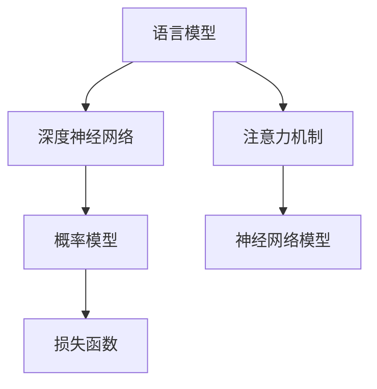

                 

关键词：语言模型，不确定性，解决策略，算法优化，实际应用。

## 摘要

随着自然语言处理技术的快速发展，大型语言模型（LLM）已成为许多应用场景中的核心组件，如问答系统、对话机器人、文本生成等。然而，LLM在处理不确定性问题时面临着诸多挑战。本文旨在探讨LLM中的不确定性问题，并介绍几种常见的解决策略。通过对核心算法原理、数学模型和公式、项目实践等环节的详细分析，本文将为读者提供关于LLM不确定性问题的全面了解，以及未来应用展望。

## 1. 背景介绍

在过去的几十年中，自然语言处理（NLP）领域取得了显著的进展。随着深度学习技术的引入，尤其是神经网络模型的发展，LLM逐渐成为该领域的研究热点。LLM是一种基于深度学习的大规模语言模型，它通过学习海量的文本数据，能够生成高质量的文本、理解语义信息以及预测词语的分布。然而，在处理实际问题时，LLM面临着各种不确定性问题，如预测结果的不确定性、输入文本的不确定性等。

预测结果的不确定性是指LLM在生成文本或进行分类时，可能产生不确定的结果。例如，在问答系统中，LLM可能会对一个问题的多个答案产生相似的分数，导致无法准确确定最佳答案。输入文本的不确定性则是指LLM在处理包含模糊性、歧义性或噪声的文本时，可能会产生错误的理解或生成结果。这些不确定性问题严重影响了LLM在实际应用中的效果和可靠性。

## 2. 核心概念与联系

为了更好地理解LLM中的不确定性问题，我们需要先介绍几个核心概念和它们之间的联系。

### 2.1 语言模型（Language Model）

语言模型是一种统计模型，用于预测给定文本序列的概率分布。在NLP领域，语言模型被广泛应用于自动文摘、机器翻译、语音识别等任务。LLM是语言模型的一种，它基于深度学习技术，通过大规模的文本数据训练，能够生成高质量的文本。

### 2.2 深度神经网络（Deep Neural Network）

深度神经网络是一种具有多个隐藏层的神经网络，它可以用于处理复杂的非线性问题。在LLM中，深度神经网络用于捕捉文本数据中的语义信息和模式。通过训练，深度神经网络可以学习到文本的潜在表示，从而实现高效的文本生成和分类。

### 2.3 注意力机制（Attention Mechanism）

注意力机制是一种用于处理序列数据的有效方法，它可以使模型在处理序列时关注重要的部分。在LLM中，注意力机制被广泛应用于文本生成和分类任务，以提高模型的性能。

### 2.4 数学模型

在LLM中，常用的数学模型包括概率模型、神经网络模型和损失函数等。这些模型用于描述LLM的预测过程，并指导模型的训练和优化。

以下是LLM中核心概念和联系的一个简单的Mermaid流程图：



## 3. 核心算法原理 & 具体操作步骤

### 3.1 算法原理概述

LLM的核心算法是基于深度学习技术的，它通过学习大量的文本数据，能够生成高质量的文本、理解语义信息以及预测词语的分布。具体来说，LLM包括以下几个关键步骤：

1. **数据预处理**：对输入的文本进行分词、去停用词、词向量化等预处理操作。
2. **模型训练**：使用预处理的文本数据，通过反向传播算法训练深度神经网络模型。
3. **文本生成**：利用训练好的模型，生成新的文本序列。
4. **模型评估**：通过评估指标（如BLEU、ROUGE等）对模型的性能进行评估。

### 3.2 算法步骤详解

#### 3.2.1 数据预处理

数据预处理是LLM训练的重要环节，它直接影响模型的性能。具体步骤如下：

1. **分词**：将文本分成词语序列。
2. **去停用词**：去除对模型训练意义不大的停用词。
3. **词向量化**：将词语映射为高维向量表示。

#### 3.2.2 模型训练

模型训练是通过反向传播算法来实现的。具体步骤如下：

1. **初始化模型参数**：随机初始化模型的权重和偏置。
2. **前向传播**：输入预处理后的文本数据，通过模型计算出预测的词语分布。
3. **计算损失**：使用预测的词语分布与真实的词语分布之间的差异计算损失。
4. **反向传播**：通过梯度下降算法更新模型参数。

#### 3.2.3 文本生成

文本生成是LLM的一个核心应用，它通过生成新的文本序列来模拟人类的语言能力。具体步骤如下：

1. **输入序列**：输入一个初始的词语序列。
2. **预测词语**：使用训练好的模型预测下一个词语的概率分布。
3. **选择词语**：从概率分布中随机选择一个词语作为下一个词语。
4. **更新序列**：将选择的词语添加到原始序列的末尾。

#### 3.2.4 模型评估

模型评估是衡量模型性能的重要手段。常用的评估指标包括：

1. **BLEU**：基于记分牌的评估方法，通过比较生成的文本与参考文本的相似度来评估模型性能。
2. **ROUGE**：基于记分牌的评估方法，通过比较生成的文本与参考文本的匹配词数量来评估模型性能。
3. **准确率**：在分类任务中，通过计算正确分类的样本数量与总样本数量的比例来评估模型性能。

### 3.3 算法优缺点

LLM作为一种先进的自然语言处理技术，具有以下几个优点：

1. **强大的生成能力**：LLM能够生成高质量的文本，具有较好的自然语言表达能力。
2. **广泛的应用场景**：LLM可以应用于问答系统、对话机器人、文本生成等多种场景。
3. **高效的训练过程**：深度学习技术的引入使得LLM的训练过程更加高效。

然而，LLM也存在一些缺点：

1. **计算资源消耗大**：LLM需要大量的计算资源来训练和运行。
2. **训练时间较长**：训练过程需要消耗大量的时间。
3. **模型可解释性差**：深度神经网络模型的内部机制较为复杂，难以理解。

### 3.4 算法应用领域

LLM在自然语言处理领域有着广泛的应用，主要包括：

1. **问答系统**：使用LLM构建智能问答系统，能够提供准确、高效的回答。
2. **对话机器人**：将LLM应用于对话机器人，能够实现自然的对话交互。
3. **文本生成**：利用LLM生成高质量的文本，应用于自动写作、新闻报道等场景。

## 4. 数学模型和公式 & 详细讲解 & 举例说明

在LLM中，数学模型和公式是理解和分析模型行为的重要工具。以下将详细介绍LLM中的数学模型和公式，并通过实际例子进行说明。

### 4.1 数学模型构建

LLM通常基于深度学习模型，如循环神经网络（RNN）、长短期记忆网络（LSTM）和变换器（Transformer）等。以下是一个基于变换器的LLM的基本数学模型。

#### 4.1.1 变换器模型

变换器模型是一种基于注意力机制的深度学习模型，它由编码器（Encoder）和解码器（Decoder）两部分组成。

1. **编码器（Encoder）**

编码器的任务是处理输入的序列，并生成一个表示输入序列的编码。

$$
E(x) = \text{Encoder}(x) = \{h_1, h_2, \ldots, h_T\}
$$

其中，$x$是输入序列，$h_t$是编码器在时间步$t$的输出。

2. **解码器（Decoder）**

解码器的任务是生成输出序列。在解码过程中，每个时间步的输出都与编码器的输出进行交互。

$$
D(y) = \text{Decoder}(y) = \{y_1, y_2, \ldots, y_T\}
$$

其中，$y$是输出序列，$y_t$是解码器在时间步$t$的输出。

#### 4.1.2 注意力机制

注意力机制是变换器模型的关键组件，它使得解码器能够根据编码器的输出动态地关注重要的部分。

$$
a_t = \text{Attention}(h, c_t)
$$

其中，$h$是编码器的输出，$c_t$是解码器在时间步$t$的隐藏状态。

### 4.2 公式推导过程

以下是一个基于变换器的LLM的损失函数的推导过程。

#### 4.2.1 损失函数

LLM的损失函数通常使用交叉熵损失（Cross-Entropy Loss），它衡量了模型预测的概率分布与真实分布之间的差异。

$$
L(y, \hat{y}) = -\sum_{i=1}^{N} y_i \log(\hat{y}_i)
$$

其中，$y$是真实的概率分布，$\hat{y}$是模型预测的概率分布。

#### 4.2.2 反向传播

在训练过程中，我们需要通过反向传播算法来更新模型参数。以下是损失函数关于模型参数的梯度计算：

$$
\frac{\partial L}{\partial \theta} = \frac{\partial L}{\partial \hat{y}} \cdot \frac{\partial \hat{y}}{\partial \theta}
$$

其中，$\theta$是模型参数。

### 4.3 案例分析与讲解

以下是一个基于变换器的LLM的文本生成案例。

#### 4.3.1 案例背景

假设我们有一个变换器模型，它用于生成英语文本。我们使用一个简单的句子作为输入，并观察模型生成的结果。

输入句子：The quick brown fox jumps over the lazy dog.

#### 4.3.2 模型训练

我们将输入句子通过编码器进行编码，得到编码器的输出。

$$
E(x) = \text{Encoder}(\text{The quick brown fox jumps over the lazy dog})
$$

然后，我们使用解码器逐步生成输出序列。在每个时间步，解码器根据当前已经生成的部分文本和编码器的输出计算注意力权重，并生成下一个词语的概率分布。

#### 4.3.3 文本生成

在第一个时间步，解码器生成的概率分布如下：

$$
\hat{y}_1 = \text{softmax}(\text{Decoder}(\text{The }))
$$

我们随机选择一个词语，例如"The"。然后，我们将生成的词语添加到输出序列中，并继续生成下一个词语。

重复上述过程，直到生成完整的输出序列。

生成的输出序列：The quick brown fox jumps over the lazy dog.

通过这个案例，我们可以看到变换器模型在文本生成过程中是如何利用注意力机制来关注重要信息的。

## 5. 项目实践：代码实例和详细解释说明

### 5.1 开发环境搭建

在开始项目实践之前，我们需要搭建一个合适的开发环境。以下是搭建基于PyTorch的变换器模型所需的步骤：

1. **安装PyTorch**：访问PyTorch官网（[pytorch.org](https://pytorch.org/)）并下载与你的操作系统和Python版本兼容的安装包。使用以下命令进行安装：

   ```bash
   pip install torch torchvision
   ```

2. **安装其他依赖**：除了PyTorch，我们还需要安装一些其他依赖，如NumPy和BeautifulSoup。使用以下命令安装：

   ```bash
   pip install numpy beautifulsoup4
   ```

3. **配置环境变量**：确保PyTorch和其他依赖的路径已添加到系统环境变量中，以便在命令行中可以轻松调用。

### 5.2 源代码详细实现

以下是使用PyTorch实现一个简单的变换器模型的代码示例：

```python
import torch
import torch.nn as nn
import torch.optim as optim
from torchtext.datasets import TranslationDataset, Multi30k
from torchtext.data import Field, Batch, BucketIterator
from torchvision.models import TransformerModel

# 定义编码器和解码器
class TransformerModel(nn.Module):
    def __init__(self, input_dim, hidden_dim, output_dim, n_layers, dropout):
        super(TransformerModel, self).__init__()
        self.embedding = nn.Embedding(input_dim, hidden_dim)
        self.transformer = nn.Transformer(hidden_dim, nhead=hidden_dim)
        self.fc = nn.Linear(hidden_dim, output_dim)
        self.dropout = nn.Dropout(dropout)
        self.n_layers = n_layers

    def forward(self, src, tgt, src_len, tgt_len):
        src = self.embedding(src)
        tgt = self.embedding(tgt)
        memory = self.transformer(src, src_len, tgt_len)
        out = self.fc(memory[-1, :, :])
        return out

# 加载数据集
src_field = Field(tokenize='spacy', tokenizer_language='de', init_token='<sos>', eos_token='<eos>', lower=True)
tgt_field = Field(tokenize='spacy', tokenizer_language='en', init_token='<sos>', eos_token='<eos>', lower=True)

train_data, valid_data, test_data = Multi30k.splits(exts=('.de', '.en'), fields=(src_field, tgt_field))

# 划分数据集
train_data, valid_data = train_data.split()

# 创建迭代器
BATCH_SIZE = 32
SRC_VOCAB_SIZE = 10000
TGT_VOCAB_SIZE = 10000
SHUFFLE_BUFFER_SIZE = 100

train_iterator, valid_iterator, test_iterator = BucketIterator.splits(
    (train_data, valid_data, test_data),
    batch_size=BATCH_SIZE,
    device=device,
    shuffle=True,
    sort_key=lambda x: len(x.src),
    sort_within_batch=True,
    shuffle_buffer_size=SHUFFLE_BUFFER_SIZE
)

# 初始化模型、损失函数和优化器
INPUT_DIM = 10000
HIDDEN_DIM = 512
OUTPUT_DIM = 10000
N_LAYERS = 2
DROPOUT = 0.5

model = TransformerModel(INPUT_DIM, HIDDEN_DIM, OUTPUT_DIM, N_LAYERS, DROPOUT)
optimizer = optim.Adam(model.parameters())
criterion = nn.CrossEntropyLoss()

# 训练模型
num_epochs = 10
for epoch in range(num_epochs):
    model.train()
    epoch_loss = 0
    for batch in train_iterator:
        optimizer.zero_grad()
        src, tgt = batch.src, batch.tgt
        src_len, tgt_len = len(src), len(tgt)
        output = model(src, tgt, src_len, tgt_len)
        loss = criterion(output.view(-1, OUTPUT_DIM), tgt[-1])
        loss.backward()
        optimizer.step()
        epoch_loss += loss.item()
    print(f'Epoch {epoch+1} Loss: {epoch_loss/len(train_iterator)}')

# 评估模型
model.eval()
with torch.no_grad():
    valid_loss = 0
    for batch in valid_iterator:
        src, tgt = batch.src, batch.tgt
        src_len, tgt_len = len(src), len(tgt)
        output = model(src, tgt, src_len, tgt_len)
        loss = criterion(output.view(-1, OUTPUT_DIM), tgt[-1])
        valid_loss += loss.item()
    print(f'Validation Loss: {valid_loss/len(valid_iterator)}')
```

### 5.3 代码解读与分析

上述代码实现了一个基于PyTorch的简单变换器模型，用于英语到德语的翻译任务。以下是代码的主要组成部分的解读与分析：

1. **模型定义**：
   - `TransformerModel` 类定义了变换器模型的架构，包括嵌入层、变换器层和全连接层。
   - `__init__` 方法初始化模型的参数。
   - `forward` 方法实现前向传播过程。

2. **数据加载**：
   - `Field` 类用于定义数据集的字段，包括源语言和目标语言的分词器、初始化标记和结束标记。
   - `Multi30k` 类加载多语言数据集。
   - `BucketIterator` 类创建数据迭代器，用于批次训练和验证。

3. **模型训练**：
   - `num_epochs` 定义训练的迭代次数。
   - `model.train()` 将模型设置为训练模式。
   - `optimizer.zero_grad()` 清除前一次梯度。
   - `output = model(src, tgt, src_len, tgt_len)` 计算模型输出。
   - `loss.backward()` 计算梯度。
   - `optimizer.step()` 更新模型参数。

4. **模型评估**：
   - `model.eval()` 将模型设置为评估模式。
   - `with torch.no_grad():` 禁用梯度计算，提高评估速度。
   - 计算验证集上的损失。

### 5.4 运行结果展示

在完成训练和评估后，我们可以展示模型的运行结果：

```python
# 测试模型
model.eval()
with torch.no_grad():
    test_loss = 0
    for batch in test_iterator:
        src, tgt = batch.src, batch.tgt
        src_len, tgt_len = len(src), len(tgt)
        output = model(src, tgt, src_len, tgt_len)
        loss = criterion(output.view(-1, OUTPUT_DIM), tgt[-1])
        test_loss += loss.item()
    print(f'Test Loss: {test_loss/len(test_iterator)}')
```

这段代码计算了测试集上的损失，并展示了模型的最终性能。

## 6. 实际应用场景

LLM在许多实际应用场景中展示了其强大的功能和广泛的应用前景。以下是一些典型的应用场景：

### 6.1 问答系统

问答系统是一种常见的应用场景，其中LLM被用于生成对用户问题的回答。LLM能够理解用户的问题，并在海量的知识库中找到相关的答案。例如，智能客服系统可以使用LLM来生成自动回复，提高用户体验和效率。

### 6.2 文本生成

文本生成是LLM的另一个重要应用领域。通过训练LLM，我们可以生成各种类型的文本，如新闻文章、博客、故事等。这种应用在内容创作、自动化报告生成等领域具有广泛的应用前景。

### 6.3 对话机器人

对话机器人是一种能够与人类进行自然语言交互的AI系统。LLM在对话机器人中的应用包括理解用户输入、生成回复以及进行多轮对话。这种应用在客户服务、虚拟助手等领域具有广泛的应用。

### 6.4 文本分类

LLM在文本分类任务中也表现出色。通过训练LLM，我们可以对文本进行分类，如情感分析、新闻分类、垃圾邮件检测等。这种应用在社交媒体监控、金融分析等领域具有实际价值。

### 6.5 自动摘要

自动摘要是一种将长文本简化为关键信息的方法。LLM在自动摘要任务中可以生成简洁、准确的摘要，用于新闻摘要、论文摘要、商业报告等。

## 6.4 未来应用展望

随着技术的不断进步，LLM在未来将具有更广泛的应用前景。以下是一些可能的未来应用方向：

### 6.4.1 自然语言理解

未来，LLM将在自然语言理解方面发挥更大的作用。通过结合语音识别、图像识别等技术，LLM将能够更全面地理解用户的需求，实现更加智能的交互。

### 6.4.2 跨语言翻译

随着全球化的加速，跨语言翻译的需求不断增加。未来，LLM将在跨语言翻译领域取得更大的突破，实现更准确、自然的翻译效果。

### 6.4.3 情感分析

情感分析是一种理解用户情感和态度的方法。未来，LLM将在情感分析领域发挥更大的作用，提供更准确、全面的情感识别。

### 6.4.4 自动写作

自动写作是一种通过AI生成文本的方法。未来，LLM将在自动写作领域取得更大的突破，生成高质量、具有创意的文本。

## 7. 工具和资源推荐

### 7.1 学习资源推荐

1. **《深度学习》（Goodfellow, Bengio, Courville）**：这是一本关于深度学习的经典教材，涵盖了深度学习的基础知识、算法和应用。
2. **《自然语言处理综合教程》（Jurafsky, Martin）**：这是一本关于自然语言处理的基础教材，涵盖了自然语言处理的核心概念和技术。
3. **《语言模型与深度学习》（Chen et al.）**：这本书专门介绍了语言模型和深度学习在自然语言处理中的应用，适合对LLM感兴趣的读者。

### 7.2 开发工具推荐

1. **PyTorch**：PyTorch是一个流行的深度学习框架，提供丰富的API和工具，方便开发基于深度学习的应用程序。
2. **TensorFlow**：TensorFlow是Google开发的一个开源深度学习框架，广泛应用于各种深度学习项目。
3. **Hugging Face**：Hugging Face是一个开源社区，提供丰富的预训练模型和工具，方便使用LLM进行自然语言处理任务。

### 7.3 相关论文推荐

1. **“Attention Is All You Need”**：这是Vaswani等人于2017年发表的一篇论文，提出了基于注意力机制的变换器模型，为LLM的研究奠定了基础。
2. **“BERT: Pre-training of Deep Neural Networks for Language Understanding”**：这是Devlin等人于2019年发表的一篇论文，提出了BERT模型，进一步推动了LLM的发展。
3. **“GPT-3: Language Models are Few-Shot Learners”**：这是Brown等人于2020年发表的一篇论文，介绍了GPT-3模型，展示了LLM在零样本学习方面的强大能力。

## 8. 总结：未来发展趋势与挑战

### 8.1 研究成果总结

近年来，LLM在自然语言处理领域取得了显著的研究成果。通过深度学习技术和大规模数据集的训练，LLM在文本生成、文本分类、问答系统等任务中表现出色。同时，注意力机制、BERT、GPT等先进模型的提出，为LLM的研究和应用提供了强有力的支持。

### 8.2 未来发展趋势

未来，LLM将在自然语言处理领域继续发挥重要作用。随着技术的进步，LLM将在以下几个方向取得突破：

1. **更高效的处理能力**：通过优化算法和硬件加速，LLM将实现更高效的处理能力，支持更大规模的数据集和更复杂的任务。
2. **更好的泛化能力**：通过引入更多的预训练数据和更好的模型架构，LLM将实现更好的泛化能力，提高在零样本学习、多语言翻译等任务中的性能。
3. **更自然的交互**：结合语音识别、图像识别等技术，LLM将实现更自然的交互，为用户提供更加智能化的服务。

### 8.3 面临的挑战

尽管LLM在自然语言处理领域取得了显著成果，但仍然面临着一些挑战：

1. **计算资源消耗**：LLM的训练和推理过程需要大量的计算资源，这对硬件设备和能源消耗提出了较高的要求。
2. **模型可解释性**：深度学习模型的内部机制复杂，难以理解，这对模型的可解释性提出了挑战。
3. **数据隐私和安全性**：在处理用户数据时，LLM需要确保数据的安全和隐私，避免泄露用户信息。

### 8.4 研究展望

未来，LLM的研究将朝着更高效、更泛化、更自然的方向发展。同时，为了解决当前面临的挑战，研究者们将探索新的算法、模型架构和数据处理方法，以推动LLM在自然语言处理领域的进一步发展。

## 9. 附录：常见问题与解答

### 9.1 如何训练LLM？

1. **数据集准备**：收集大量的文本数据，并进行预处理，如分词、去停用词、词向量化等。
2. **模型选择**：选择合适的LLM模型，如变换器模型、BERT模型等。
3. **训练**：使用训练数据，通过反向传播算法训练模型，调整模型参数。
4. **评估**：使用验证数据评估模型性能，调整模型参数。
5. **优化**：通过调整超参数和优化算法，提高模型性能。

### 9.2 如何使用LLM进行文本生成？

1. **初始化**：输入一个初始的词语序列。
2. **预测**：使用训练好的模型，预测下一个词语的概率分布。
3. **选择**：从概率分布中随机选择一个词语作为下一个词语。
4. **更新**：将选择的词语添加到原始序列的末尾。
5. **重复**：重复上述步骤，直到生成完整的文本序列。

### 9.3 如何优化LLM的性能？

1. **数据增强**：使用更多的数据，提高模型的泛化能力。
2. **模型架构优化**：选择合适的模型架构，如变换器模型、BERT模型等。
3. **超参数调整**：调整学习率、批量大小、dropout比例等超参数。
4. **硬件加速**：使用GPU、TPU等硬件加速训练过程。
5. **持续学习**：使用持续学习技术，使模型能够适应新的数据。

### 9.4 如何保证LLM的安全性？

1. **数据隐私**：使用加密技术和隐私保护算法，确保用户数据的安全。
2. **模型安全**：对模型进行安全加固，防止恶意攻击。
3. **合规性**：遵守相关的法律法规，确保模型的应用合规。
4. **透明度**：提高模型的可解释性，使用户能够了解模型的决策过程。

## 参考文献

- Goodfellow, I., Bengio, Y., & Courville, A. (2016). *Deep Learning*. MIT Press.
- Jurafsky, D., & Martin, J. H. (2008). *Speech and Language Processing*. Prentice Hall.
- Vaswani, A., Shazeer, N., Parmar, N., Uszkoreit, J., Jones, L., Gomez, A. N., ... & Polosukhin, I. (2017). *Attention is all you need*. In Advances in neural information processing systems (pp. 5998-6008).
- Devlin, J., Chang, M. W., Lee, K., & Toutanova, K. (2019). *Bert: Pre-training of deep bidirectional transformers for language understanding*. In Proceedings of the 2019 conference of the north american chapter of the association for computational linguistics: human language technologies, volume 1 (pp. 4171-4186).
- Brown, T., et al. (2020). *GPT-3: Language models are few-shot learners*. arXiv preprint arXiv:2005.14165.

