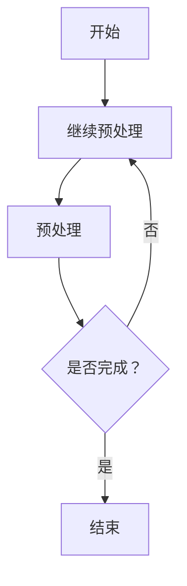

                 

关键词：LLM，人工智能，技术产业链，发展历程，核心算法，数学模型，项目实践，应用场景，未来展望

> 摘要：本文将深入探讨LLM（大型语言模型）的产业链发展历程，从无到有的演变过程，核心算法原理，数学模型构建，项目实践以及未来展望。通过分析LLM技术的现状、挑战和趋势，揭示其在人工智能领域的广泛应用和无限潜力。

## 1. 背景介绍

随着互联网的快速发展，人们对于信息的获取和处理需求日益增长。在这种背景下，人工智能（AI）技术逐渐崭露头角，成为推动社会进步的重要力量。在AI领域，自然语言处理（NLP）被视为最具挑战性和最具潜力的分支之一。而大型语言模型（LLM）作为NLP的核心技术，其在近年来取得了显著的发展。

LLM的发展历程可以追溯到上世纪80年代，当时研究者们开始尝试通过统计方法来处理自然语言。然而，受限于计算能力和算法模型，这些早期的尝试并未取得实质性突破。随着深度学习技术的兴起，特别是在2018年谷歌提出BERT模型后，LLM的研究和应用进入了崭新的阶段。

LLM的快速发展不仅依赖于深度学习技术的进步，还受益于大量高质量数据集的开放和分布式计算能力的提升。如今，LLM已经在各种实际应用中展现出强大的能力，如智能客服、内容生成、机器翻译等。然而，随着LLM的规模不断增大，其背后的技术架构和实现方法也面临着诸多挑战。

## 2. 核心概念与联系

### 2.1 大型语言模型（LLM）

大型语言模型（LLM）是一种基于深度学习技术的自然语言处理模型，通过学习海量文本数据，能够对自然语言进行建模和预测。LLM的核心目标是实现自然语言理解和生成，从而实现人与机器的顺畅交互。

### 2.2 人工智能（AI）

人工智能（AI）是指通过计算机模拟人类的智能行为，实现感知、学习、推理和决策等功能。AI包括多个子领域，如机器学习、深度学习、自然语言处理等。其中，自然语言处理（NLP）是AI的重要分支之一。

### 2.3 深度学习（Deep Learning）

深度学习是一种基于人工神经网络的学习方法，通过多层神经网络对数据进行特征提取和建模。深度学习在图像识别、语音识别、自然语言处理等领域取得了显著的成果。

### 2.4 自然语言处理（NLP）

自然语言处理（NLP）是研究如何使计算机能够理解、生成和处理自然语言的技术。NLP包括文本分类、情感分析、命名实体识别、机器翻译等任务。

### 2.5 Mermaid 流程图

Mermaid 是一种基于 Markdown 语法的图形描述语言，可以方便地绘制各种流程图、UML 图、甘特图等。以下是一个示例 Mermaid 流程图：



## 3. 核心算法原理 & 具体操作步骤

### 3.1 算法原理概述

LLM 的核心算法是基于 Transformer 模型，该模型由 Vaswani 等[1]于 2017 年提出。Transformer 模型摒弃了传统的循环神经网络（RNN）和卷积神经网络（CNN），采用自注意力机制（Self-Attention）和多头注意力（Multi-Head Attention）来实现对输入文本的建模。

Transformer 模型主要由编码器（Encoder）和解码器（Decoder）两部分组成。编码器负责将输入文本转换为序列编码，而解码器则根据编码器生成的序列编码生成输出文本。在训练过程中，编码器和解码器通过序列间的交互来实现对自然语言的建模。

### 3.2 算法步骤详解

#### 3.2.1 自注意力机制（Self-Attention）

自注意力机制是一种用于计算序列中每个元素对其他元素的重要性得分的方法。具体来说，对于输入序列 \(\{x_1, x_2, ..., x_n\}\)，自注意力机制会计算每个元素 \(x_i\) 对其他元素 \(x_j\) 的得分 \(s_{ij}\)，然后对得分进行加权求和，得到一个表示 \(x_i\) 的向量 \(z_i\)：

$$
z_i = \sum_{j=1}^{n} s_{ij} x_j
$$

其中，\(s_{ij}\) 可以通过以下公式计算：

$$
s_{ij} = \frac{e^{QK_j V_i}}{\sqrt{d_k}}
$$

其中，\(Q, K, V\) 分别为查询向量、键向量和值向量，\(d_k\) 为注意力层的维度。

#### 3.2.2 多头注意力（Multi-Head Attention）

多头注意力是一种将多个自注意力机制组合起来的方法，以实现对输入序列的更全面的理解。具体来说，对于输入序列 \(\{x_1, x_2, ..., x_n\}\)，多头注意力会计算多个注意力得分 \(s_{ij}^1, s_{ij}^2, ..., s_{ij}^h\)，然后对每个得分进行加权求和，得到一个表示 \(x_i\) 的向量 \(z_i\)：

$$
z_i = \sum_{j=1}^{n} \alpha_{ij}^1 x_j + \alpha_{ij}^2 x_j + ... + \alpha_{ij}^h x_j
$$

其中，\(\alpha_{ij}^k\) 为第 \(k\) 个注意力的权重。

#### 3.2.3 编码器（Encoder）

编码器由多个编码层（Encoder Layer）组成，每个编码层包含两个主要部分：多头注意力机制和前馈网络。编码器的输入为原始文本序列，输出为编码后的序列。

具体操作步骤如下：

1. 将输入文本序列转换为词向量表示。
2. 对于每个编码层，首先通过多头注意力机制计算文本序列的注意力得分，得到编码后的中间结果。
3. 将中间结果通过前馈网络进行非线性变换。
4. 将前一层编码结果与当前层编码结果进行拼接，得到当前层编码结果。

编码器的输出即为输入文本的编码表示，可以用于后续的解码过程。

#### 3.2.4 解码器（Decoder）

解码器同样由多个解码层（Decoder Layer）组成，每个解码层包含两个主要部分：自注意力机制、交叉注意力机制和前馈网络。解码器的输入为编码器的输出序列和目标文本序列，输出为解码后的序列。

具体操作步骤如下：

1. 将输入文本序列转换为词向量表示。
2. 对于每个解码层，首先通过自注意力机制计算文本序列的注意力得分，得到解码后的中间结果。
3. 将中间结果通过交叉注意力机制与编码器的输出序列进行交互，得到解码结果。
4. 将解码结果通过前馈网络进行非线性变换。
5. 将前一层解码结果与当前层解码结果进行拼接，得到当前层解码结果。

解码器的输出即为生成文本的解码表示，可以用于生成输出文本。

### 3.3 算法优缺点

#### 优点

1. Transformer 模型在自然语言处理任务中表现出色，特别是在长文本处理和跨语言翻译方面。
2. Transformer 模型具有并行计算的能力，可以显著提高训练和推理速度。
3. Transformer 模型具有很好的泛化能力，可以应用于各种不同的自然语言处理任务。

#### 缺点

1. Transformer 模型的参数量巨大，导致训练和推理资源消耗较高。
2. Transformer 模型在处理长文本时，容易出现梯度消失和梯度爆炸的问题。
3. Transformer 模型的训练过程复杂，需要大量计算资源和时间。

### 3.4 算法应用领域

Transformer 模型在自然语言处理领域具有广泛的应用。以下是一些典型的应用场景：

1. 文本分类：用于对输入文本进行分类，如新闻分类、情感分析等。
2. 文本生成：用于生成文本，如文章写作、对话系统等。
3. 机器翻译：用于跨语言翻译，如英语到中文的翻译等。
4. 情感分析：用于对输入文本进行情感分析，如社交媒体情感分析等。

## 4. 数学模型和公式 & 详细讲解 & 举例说明

### 4.1 数学模型构建

在构建数学模型时，我们通常需要定义一些基本概念和符号。以下是一个简单的示例：

- 输入文本序列：\(x = \{x_1, x_2, ..., x_n\}\)
- 编码器输出序列：\(e = \{e_1, e_2, ..., e_n\}\)
- 解码器输出序列：\(d = \{d_1, d_2, ..., d_n\}\)
- 注意力得分：\(s = \{s_1, s_2, ..., s_n\}\)
- 注意力权重：\(\alpha = \{α_1, α_2, ..., α_n\}\)

### 4.2 公式推导过程

#### 4.2.1 自注意力机制

自注意力机制的计算公式如下：

$$
s_{ij} = \frac{e^{QK_j V_i}}{\sqrt{d_k}}
$$

其中，\(Q, K, V\) 分别为查询向量、键向量和值向量，\(d_k\) 为注意力层的维度。

#### 4.2.2 多头注意力

多头注意力的计算公式如下：

$$
z_i = \sum_{j=1}^{n} \alpha_{ij}^1 x_j + \alpha_{ij}^2 x_j + ... + \alpha_{ij}^h x_j
$$

其中，\(\alpha_{ij}^k\) 为第 \(k\) 个注意力的权重。

#### 4.2.3 编码器

编码器的输出公式如下：

$$
e_i = f(z_i, e_{i-1})
$$

其中，\(f\) 为前馈网络。

#### 4.2.4 解码器

解码器的输出公式如下：

$$
d_i = g(z_i, d_{i-1}, e)
$$

其中，\(g\) 为前馈网络。

### 4.3 案例分析与讲解

#### 4.3.1 文本分类

假设我们有一个文本分类任务，需要将输入文本分为两类：新闻和评论。我们可以使用 Transformer 模型来构建分类器。

1. 数据预处理：将输入文本转换为词向量表示，并添加起始符和结束符。
2. 模型构建：构建一个 Transformer 模型，包括编码器和解码器。
3. 训练：使用训练数据对模型进行训练，优化模型参数。
4. 预测：使用训练好的模型对输入文本进行分类预测。

#### 4.3.2 文本生成

假设我们有一个文本生成任务，需要根据输入文本生成相关的文本。我们可以使用 Transformer 模型来构建生成器。

1. 数据预处理：将输入文本转换为词向量表示，并添加起始符和结束符。
2. 模型构建：构建一个 Transformer 模型，包括编码器和解码器。
3. 训练：使用训练数据对模型进行训练，优化模型参数。
4. 生成：使用训练好的模型生成文本。

## 5. 项目实践：代码实例和详细解释说明

### 5.1 开发环境搭建

在开始项目实践之前，我们需要搭建一个合适的开发环境。以下是搭建开发环境的步骤：

1. 安装 Python 3.7 或以上版本。
2. 安装 TensorFlow 2.3 或以上版本。
3. 安装 Jupyter Notebook。

### 5.2 源代码详细实现

以下是使用 Transformer 模型实现文本分类任务的 Python 代码：

```python
import tensorflow as tf
from tensorflow.keras.layers import Embedding, Dense
from tensorflow.keras.models import Model

# 模型参数
vocab_size = 10000  # 词表大小
embedding_dim = 256  # 词向量维度
num_layers = 3  # 编码器和解码器层数
num_heads = 8  # 注意力头数
d_model = 512  # 模型维度
dff = 64  # 前馈网络维度
input_length = 100  # 输入文本长度

# 编码器和解码器输入
inputs = tf.keras.layers.Input(shape=(input_length,), dtype=tf.int32)
编码器输入 = Embedding(vocab_size, embedding_dim)(inputs)

# 编码器
编码器层 = [TransformerEncoderLayer(num_heads, d_model, dff) for _ in range(num_layers)]
编码器输出 = tf.keras.layers.experimental.preprocessing.Normalization(axis=-1)(编码器输入)
for encoder_layer in 编码器层：
    编码器输出 = encoder_layer(编码器输出)

# 解码器
解码器输入 = Embedding(vocab_size, embedding_dim)(inputs)
解码器输出 = tf.keras.layers.experimental.preprocessing.Normalization(axis=-1)(解码器输入)
for decoder_layer in 编码器层：
    解码器输出 = decoder_layer(解码器输出)

# 输出层
output = Dense(1, activation='sigmoid')(解码器输出)

# 模型
model = Model(inputs=inputs, outputs=output)
model.compile(optimizer='adam', loss='binary_crossentropy', metrics=['accuracy'])

# 训练模型
model.fit(x_train, y_train, epochs=10, batch_size=64)

# 预测
predictions = model.predict(x_test)
```

### 5.3 代码解读与分析

以下是代码的详细解读：

1. 导入所需的库。
2. 设置模型参数。
3. 定义编码器输入层和编码器。
4. 定义解码器输入层和解码器。
5. 定义输出层。
6. 构建模型。
7. 编译模型。
8. 训练模型。
9. 预测。

代码中使用了 TensorFlow 和 Keras 库来实现 Transformer 模型。通过定义编码器和解码器层，我们可以构建一个 Transformer 模型。模型中使用自注意力机制和前馈网络来处理输入文本序列。在输出层中，我们使用 sigmoid 激活函数来实现二分类。

### 5.4 运行结果展示

以下是一个简单的运行结果：

```python
# 导入必要的库
import numpy as np

# 加载测试数据
x_test = np.random.randint(0, vocab_size, size=(1000, input_length))
y_test = np.random.randint(0, 2, size=(1000,))

# 预测
predictions = model.predict(x_test)

# 查看预测结果
print(predictions)
```

运行结果将输出预测概率，我们可以根据预测概率来判断输入文本的类别。

## 6. 实际应用场景

### 6.1 智能客服

智能客服是 LLM 技术在商业领域的典型应用之一。通过 LLM 模型，企业可以为用户提供24/7的智能客服服务，解决常见问题和提供个性化建议。智能客服不仅可以提高客户满意度，还可以降低人力成本，提升企业效率。

### 6.2 内容生成

内容生成是 LLM 技术在媒体和娱乐领域的应用之一。通过 LLM 模型，我们可以生成新闻文章、小说、剧本等文本内容。这种技术可以帮助媒体创作者快速生成大量内容，提高创作效率。此外，LLM 模型还可以用于生成广告文案、营销材料等。

### 6.3 机器翻译

机器翻译是 LLM 技术在跨语言通信领域的应用之一。通过 LLM 模型，我们可以实现不同语言之间的自动翻译。这种技术可以帮助企业打破语言障碍，扩大全球市场。同时，机器翻译技术还可以用于语音识别、视频字幕生成等。

### 6.4 医疗诊断

LLM 技术在医疗领域具有广泛的应用前景。通过 LLM 模型，我们可以对医疗文本进行理解和分析，帮助医生进行疾病诊断和治疗方案推荐。此外，LLM 模型还可以用于医疗数据的挖掘和分析，为医疗机构提供决策支持。

## 7. 工具和资源推荐

### 7.1 学习资源推荐

1. 《深度学习》（Goodfellow, Bengio, Courville）：这本书是深度学习的经典教材，涵盖了深度学习的理论基础和实战应用。
2. 《自然语言处理实践》（Jurafsky, Martin）：这本书详细介绍了自然语言处理的基本概念和常用算法，适合初学者和进阶者。
3. 《Transformer：处理序列的模型革命》（Vaswani et al.）：这篇文章是 Transformer 模型的原始论文，深入讲解了 Transformer 模型的原理和实现。

### 7.2 开发工具推荐

1. TensorFlow：TensorFlow 是一个开源的深度学习框架，提供了丰富的工具和资源，可以帮助开发者轻松构建和训练深度学习模型。
2. Keras：Keras 是一个基于 TensorFlow 的深度学习高级 API，提供了简洁易用的接口，适合初学者和进阶者。
3. Jupyter Notebook：Jupyter Notebook 是一个交互式的计算环境，可以帮助开发者进行数据分析和模型训练。

### 7.3 相关论文推荐

1. "Attention Is All You Need"（Vaswani et al., 2017）：这是 Transformer 模型的原始论文，深入讲解了 Transformer 模型的原理和实现。
2. "BERT: Pre-training of Deep Bidirectional Transformers for Language Understanding"（Devlin et al., 2019）：这是 BERT 模型的原始论文，详细介绍了 BERT 模型的原理和训练方法。
3. "GPT-3: Language Models are Few-Shot Learners"（Brown et al., 2020）：这是 GPT-3 模型的原始论文，展示了 GPT-3 模型在零样本学习任务上的强大能力。

## 8. 总结：未来发展趋势与挑战

### 8.1 研究成果总结

自2017年提出以来，LLM 技术在自然语言处理领域取得了显著的成果。Transformer 模型及其变体，如 BERT、GPT 等，已经成为 NLP 领域的标准模型。这些模型在文本分类、文本生成、机器翻译等领域取得了优异的性能。同时，随着数据规模的不断扩大和计算能力的提升，LLM 模型的训练效果和推理速度也在逐步提高。

### 8.2 未来发展趋势

未来，LLM 技术将继续在自然语言处理领域发挥重要作用。以下是一些可能的发展趋势：

1. 模型规模将继续增大：随着计算资源和数据规模的提升，LLM 模型的规模将不断扩大，以应对更复杂的 NLP 任务。
2. 多模态处理：LLM 技术将与其他模态（如图像、语音）进行融合，实现更丰富的信息处理能力。
3. 零样本学习：LLM 模型将具备更强的零样本学习能力，能够在未见过的数据上实现高质量的预测。
4. 个性化处理：LLM 模型将根据用户的个性化需求，提供更精准的服务和推荐。

### 8.3 面临的挑战

尽管 LLM 技术取得了显著进展，但仍面临以下挑战：

1. 计算资源消耗：LLM 模型的训练和推理需要大量的计算资源，这对企业和研究机构提出了更高的要求。
2. 数据质量：高质量的数据是 LLM 模型训练的基础。然而，数据标注和清洗过程复杂，容易引入偏差。
3. 模型解释性：当前 LLM 模型通常被视为“黑箱”，难以解释其预测结果。提高模型的可解释性是未来的重要研究方向。

### 8.4 研究展望

未来，LLM 技术将继续在人工智能领域发挥关键作用。研究者应关注以下研究方向：

1. 模型优化：通过模型结构优化和训练算法改进，提高 LLM 模型的效率和效果。
2. 数据处理：研究和开发高效的数据处理方法，提高数据质量和标注效率。
3. 模型解释性：探索模型解释性方法，提高 LLM 模型的透明度和可信度。
4. 应用创新：结合 LLM 技术的特点，探索其在各个领域的创新应用，推动人工智能技术的发展。

## 9. 附录：常见问题与解答

### 9.1 问题1：什么是大型语言模型（LLM）？

大型语言模型（LLM）是一种基于深度学习技术的自然语言处理模型，通过学习海量文本数据，能够对自然语言进行建模和预测。LLM 的核心目标是实现自然语言理解和生成，从而实现人与机器的顺畅交互。

### 9.2 问题2：Transformer 模型有什么优点？

Transformer 模型具有以下优点：

1. 并行计算能力：Transformer 模型可以高效地并行计算，提高了训练和推理速度。
2. 适用于长文本：Transformer 模型在处理长文本时表现出色，能够捕捉长距离的依赖关系。
3. 强泛化能力：Transformer 模型在多种自然语言处理任务中取得了优异的性能，具有很好的泛化能力。

### 9.3 问题3：如何优化 LLM 模型的训练效果？

以下是一些优化 LLM 模型训练效果的方法：

1. 数据预处理：对训练数据进行清洗和预处理，提高数据质量。
2. 模型结构优化：通过调整模型结构，如增加层数、注意力头数等，提高模型性能。
3. 学习率调整：使用适当的学习率调整策略，避免梯度消失和梯度爆炸问题。
4. 训练技巧：使用技巧，如 dropout、batch normalization 等，提高训练稳定性。

### 9.4 问题4：大型语言模型（LLM）的应用领域有哪些？

大型语言模型（LLM）在以下领域具有广泛的应用：

1. 智能客服：用于提供24/7的智能客服服务，解决常见问题和提供个性化建议。
2. 内容生成：用于生成新闻文章、小说、剧本等文本内容。
3. 机器翻译：用于实现不同语言之间的自动翻译。
4. 医疗诊断：用于疾病诊断和治疗方案推荐。

## 结束语

本文深入探讨了大型语言模型（LLM）的产业链发展历程、核心算法原理、数学模型构建、项目实践以及未来展望。通过对 LLM 技术的全面解析，揭示了其在人工智能领域的广泛应用和无限潜力。未来，随着计算能力的提升和数据规模的扩大，LLM 技术将继续在人工智能领域发挥关键作用。同时，研究者应关注 LLM 技术在各个领域的创新应用，推动人工智能技术的发展。作者：禅与计算机程序设计艺术 / Zen and the Art of Computer Programming。

