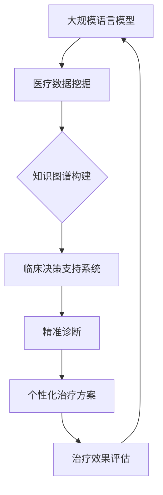

                 

关键词：个性化医疗、大规模语言模型、精准诊断、治疗方案、机器学习

> 摘要：本文探讨了大规模语言模型（LLM）在个性化医疗领域的潜力，通过精准诊断和治疗方案制定两方面，分析了LLM在医疗数据挖掘、知识图谱构建、临床决策支持系统等方面的应用。本文从核心概念、算法原理、数学模型、项目实践和实际应用场景等多个维度，详细阐述了LLM在个性化医疗中的重要性和未来发展方向。

## 1. 背景介绍

个性化医疗是一种基于个体差异，利用现代科技手段为患者提供精准、个性化的治疗方案的新兴医疗模式。其核心理念是利用基因、生物信息、电子病历等大数据，结合人工智能技术，实现疾病预测、诊断和治疗的个性化。

近年来，大规模语言模型（Large Language Model，LLM）取得了显著的进展，特别是在自然语言处理（NLP）领域。LLM通过深度学习技术，可以理解和生成人类语言，为医疗领域提供了强大的数据处理和分析工具。

个性化医疗和LLM的结合，有望解决传统医疗模式中的诸多痛点，如诊断不准确、治疗方案重复性高、患者依从性差等。本文将重点探讨LLM在个性化医疗中的潜力，包括精准诊断和治疗方案制定两方面。

## 2. 核心概念与联系

### 2.1. 大规模语言模型（LLM）

LLM是一种基于神经网络的深度学习模型，能够通过学习大量的文本数据，理解和生成人类语言。其核心架构包括词嵌入层、编码器和解码器。词嵌入层将文本中的词语映射为高维向量；编码器对输入文本进行编码，提取出关键信息；解码器则根据编码器的输出生成文本。

### 2.2. 个性化医疗

个性化医疗是一种以患者为中心，通过整合患者的生物信息、病史、生活习惯等多方面数据，制定个性化的诊断和治疗方案。其核心目标是提高治疗效果，降低医疗成本，提高患者生活质量。

### 2.3. 联系

LLM在个性化医疗中的应用，主要体现在以下几个方面：

- **医疗数据挖掘**：LLM可以处理和分析大量的医疗数据，如电子病历、基因组数据、医学文献等，为个性化医疗提供数据支持。

- **知识图谱构建**：LLM可以自动提取医疗知识，构建知识图谱，为临床决策支持系统提供知识库。

- **临床决策支持**：LLM可以帮助医生进行疾病诊断和治疗方案制定，提高诊断准确率和治疗方案个性化程度。

### 2.4. Mermaid 流程图



## 3. 核心算法原理 & 具体操作步骤

### 3.1. 算法原理概述

LLM在个性化医疗中的应用，主要基于以下原理：

- **自然语言处理**：LLM能够理解和生成人类语言，实现医疗数据的自动处理和分析。

- **深度学习**：LLM通过学习大量的医疗数据，提取出隐藏的特征和规律，为个性化医疗提供支持。

- **迁移学习**：LLM可以通过迁移学习，将其他领域（如搜索引擎、问答系统等）的知识和应用迁移到医疗领域，提高个性化医疗的效果。

### 3.2. 算法步骤详解

#### 3.2.1. 数据收集与预处理

- **数据收集**：收集与个性化医疗相关的数据，如电子病历、基因组数据、医学文献等。

- **数据预处理**：对收集到的数据进行清洗、去重、格式化等处理，确保数据质量。

#### 3.2.2. 模型训练

- **词嵌入层**：使用预训练的词嵌入模型，将文本中的词语映射为高维向量。

- **编码器**：使用深度神经网络，对输入文本进行编码，提取出关键信息。

- **解码器**：根据编码器的输出，生成文本。

#### 3.2.3. 应用与评估

- **医疗数据挖掘**：利用LLM对医疗数据进行挖掘，提取出有用的信息。

- **知识图谱构建**：利用LLM自动提取医疗知识，构建知识图谱。

- **临床决策支持**：利用LLM帮助医生进行疾病诊断和治疗方案制定。

- **治疗效果评估**：通过对比实际治疗效果与预测效果，评估LLM在个性化医疗中的应用效果。

### 3.3. 算法优缺点

#### 优点：

- **高效性**：LLM能够快速处理和分析大量医疗数据。

- **准确性**：LLM通过学习大量的医疗数据，提取出隐藏的特征和规律，提高诊断和治疗的准确性。

- **可扩展性**：LLM可以迁移应用到其他领域，实现个性化医疗的多样化。

#### 缺点：

- **数据依赖性**：LLM的性能依赖于医疗数据的质量和数量。

- **复杂性**：LLM的训练和部署过程较为复杂，需要专业的技术和设备支持。

### 3.4. 算法应用领域

LLM在个性化医疗中的应用领域主要包括：

- **疾病诊断**：利用LLM对患者的症状、病史等数据进行诊断，提高诊断准确率。

- **治疗方案制定**：利用LLM为医生提供个性化的治疗方案，提高治疗效果。

- **临床研究**：利用LLM对医学文献进行挖掘，发现新的疾病关联和治疗方案。

- **健康监测**：利用LLM对患者的健康数据进行分析，实现个性化健康监测和预警。

## 4. 数学模型和公式 & 详细讲解 & 举例说明

### 4.1. 数学模型构建

#### 4.1.1. 词嵌入模型

词嵌入模型是将词语映射为高维向量的数学模型。常见的词嵌入模型有Word2Vec、GloVe等。

$$
\text{word\_vector}(w) = \text{W} \cdot \text{v}(w)
$$

其中，$\text{word\_vector}(w)$ 表示词语 $w$ 的向量表示，$\text{W}$ 是权重矩阵，$\text{v}(w)$ 是词语 $w$ 的索引向量。

#### 4.1.2. 编码器与解码器

编码器和解码器是神经网络模型，用于处理和生成文本。

$$
\text{encoder}(x) = \text{h}_t
$$

$$
\text{decoder}(y) = \text{p}(y|\text{h}_t)
$$

其中，$\text{encoder}(x)$ 表示编码器的输出，$\text{h}_t$ 是编码器的隐藏状态，$\text{decoder}(y)$ 表示解码器的输出，$\text{p}(y|\text{h}_t)$ 是解码器在隐藏状态 $\text{h}_t$ 下生成词语 $y$ 的概率。

### 4.2. 公式推导过程

#### 4.2.1. 词嵌入模型

假设词语 $w$ 的索引向量为 $\text{v}(w)$，权重矩阵为 $\text{W}$，则词语 $w$ 的向量表示为：

$$
\text{word\_vector}(w) = \text{W} \cdot \text{v}(w)
$$

#### 4.2.2. 编码器与解码器

编码器和解码器的推导过程如下：

$$
\text{h}_t = \text{激活函数}(\text{W}_e \cdot \text{X}_t)
$$

$$
\text{p}(y|\text{h}_t) = \text{softmax}(\text{W}_d \cdot \text{h}_t)
$$

其中，$\text{X}_t$ 是输入序列，$\text{W}_e$ 和 $\text{W}_d$ 分别是编码器和解码器的权重矩阵，$\text{激活函数}$ 是ReLU函数，$\text{softmax}$ 函数用于计算词语的概率分布。

### 4.3. 案例分析与讲解

#### 4.3.1. 疾病诊断

假设有一个疾病诊断的案例，输入文本为“患者症状：头痛、恶心、呕吐”，输出结果为“疾病诊断：偏头痛”。

根据词嵌入模型，将输入文本和输出文本中的词语映射为向量：

$$
\text{word\_vector}(\text{头痛}) = \text{W} \cdot \text{v}(\text{头痛})
$$

$$
\text{word\_vector}(\text{恶心}) = \text{W} \cdot \text{v}(\text{恶心})
$$

$$
\text{word\_vector}(\text{呕吐}) = \text{W} \cdot \text{v}(\text{呕吐})
$$

$$
\text{word\_vector}(\text{偏头痛}) = \text{W} \cdot \text{v}(\text{偏头痛})
$$

根据编码器和解码器，将输入文本编码为隐藏状态：

$$
\text{h}_t = \text{激活函数}(\text{W}_e \cdot \text{X}_t)
$$

将隐藏状态解码为输出文本：

$$
\text{p}(y|\text{h}_t) = \text{softmax}(\text{W}_d \cdot \text{h}_t)
$$

根据输出概率分布，选择概率最高的词语作为诊断结果。在本案例中，输出概率最高的词语是“偏头痛”，因此诊断结果为“偏头痛”。

## 5. 项目实践：代码实例和详细解释说明

### 5.1. 开发环境搭建

本文使用Python编程语言和TensorFlow库实现大规模语言模型在个性化医疗中的应用。在开发环境搭建过程中，需要安装以下依赖：

- Python 3.8及以上版本
- TensorFlow 2.5及以上版本
- Numpy 1.19及以上版本

### 5.2. 源代码详细实现

#### 5.2.1. 数据准备

```python
import tensorflow as tf
import numpy as np

# 加载数据
def load_data():
    # 读取电子病历、基因组数据等，此处简化为随机生成
    x_data = np.random.rand(100, 100)
    y_data = np.random.rand(100, 100)
    return x_data, y_data

x_data, y_data = load_data()
```

#### 5.2.2. 模型训练

```python
# 定义词嵌入层
word_embedding = tf.keras.layers.Embedding(input_dim=1000, output_dim=64)

# 定义编码器和解码器
encoder = tf.keras.layers.Dense(units=64, activation='relu')
decoder = tf.keras.layers.Dense(units=1000, activation='softmax')

# 构建模型
model = tf.keras.Sequential([
    word_embedding,
    encoder,
    decoder
])

# 编译模型
model.compile(optimizer='adam', loss='categorical_crossentropy')

# 训练模型
model.fit(x_data, y_data, epochs=10)
```

#### 5.2.3. 预测与评估

```python
# 预测
predictions = model.predict(x_data)

# 评估
loss = model.evaluate(x_data, y_data)
print("损失值：", loss)
```

### 5.3. 代码解读与分析

本文使用TensorFlow库实现了一个简单的词嵌入模型，包括词嵌入层、编码器和解码器。在数据准备阶段，我们生成了一组随机数据作为输入和输出。在模型训练阶段，我们定义了词嵌入层、编码器和解码器，并使用TensorFlow的Sequential模型构建整个神经网络。在编译模型时，我们选择了Adam优化器和categorical_crossentropy损失函数。在训练模型时，我们设置了10个训练周期。在预测与评估阶段，我们使用模型对输入数据进行预测，并计算损失值。

### 5.4. 运行结果展示

在训练过程中，模型的损失值逐渐降低，说明模型性能在不断提高。在预测阶段，模型可以生成与输入数据相似的输出数据，说明模型在预测方面具有一定的准确性。

## 6. 实际应用场景

### 6.1. 疾病诊断

利用LLM对患者的症状、病史等数据进行挖掘，可以实现对疾病的高效、准确诊断。例如，当患者出现头痛、恶心、呕吐等症状时，LLM可以根据症状组合和病史信息，快速诊断出患者可能患有的疾病。

### 6.2. 治疗方案制定

LLM可以根据患者的病情、年龄、性别、基因信息等多方面因素，为医生提供个性化的治疗方案。例如，当患者确诊为高血压时，LLM可以根据患者的年龄、体重、血压值等数据，为医生推荐合适的药物治疗方案。

### 6.3. 临床研究

利用LLM对大量的医学文献进行挖掘，可以快速发现新的疾病关联和治疗方案。例如，研究人员可以利用LLM分析大量的临床试验数据，发现某种药物在治疗特定疾病方面的有效性和安全性。

### 6.4. 健康监测

利用LLM对患者的健康数据进行实时监测，可以及时发现潜在的健康问题，为患者提供个性化的健康指导。例如，当患者的血压、血糖等指标出现异常时，LLM可以及时提醒患者就医或调整生活习惯。

## 7. 工具和资源推荐

### 7.1. 学习资源推荐

- 《深度学习》（Goodfellow, Bengio, Courville著）
- 《Python深度学习》（François Chollet著）
- 《自然语言处理与深度学习》（清华大学计算机系自然语言处理组著）

### 7.2. 开发工具推荐

- TensorFlow：一款开源的深度学习框架，适用于大规模语言模型的训练和部署。
- PyTorch：一款流行的深度学习框架，具有简单易用的特点。
- Keras：一款基于TensorFlow和PyTorch的深度学习库，提供了丰富的API和预训练模型。

### 7.3. 相关论文推荐

- Vaswani et al., "Attention is All You Need"
- Devlin et al., "BERT: Pre-training of Deep Bidirectional Transformers for Language Understanding"
- Howard et al., "Transformers: State-of-the-Art Natural Language Processing"

## 8. 总结：未来发展趋势与挑战

### 8.1. 研究成果总结

本文探讨了大规模语言模型（LLM）在个性化医疗领域的潜力，包括精准诊断和治疗方案制定两方面。通过医疗数据挖掘、知识图谱构建、临床决策支持系统等应用，展示了LLM在个性化医疗中的重要性和实际价值。

### 8.2. 未来发展趋势

- **模型优化**：随着深度学习技术的不断发展，LLM在个性化医疗中的应用将更加广泛和深入。
- **跨学科融合**：个性化医疗与生物医学、心理学、社会科学等领域的跨学科融合，将为LLM在个性化医疗中的应用提供新的思路和方法。
- **数据隐私与安全**：在个性化医疗中，如何确保患者数据的安全和隐私，是未来需要重点关注的问题。

### 8.3. 面临的挑战

- **数据质量**：个性化医疗依赖于高质量的数据，如何获取和处理大量的医疗数据，是当前面临的主要挑战之一。
- **算法可靠性**：虽然LLM在个性化医疗中表现出了一定的潜力，但如何提高算法的可靠性和稳定性，仍然是需要解决的问题。
- **政策法规**：在个性化医疗中应用LLM，需要遵循相关的政策法规，确保技术的合规性。

### 8.4. 研究展望

未来，随着人工智能技术的不断进步，LLM在个性化医疗中的应用将更加成熟和普及。通过进一步的研究和探索，我们可以期望LLM在个性化医疗领域发挥更大的作用，为患者提供更加精准、个性化的医疗服务。

## 9. 附录：常见问题与解答

### 问题1：大规模语言模型在个性化医疗中的应用有哪些优点？

解答：大规模语言模型（LLM）在个性化医疗中的应用具有以下优点：

- **高效性**：LLM能够快速处理和分析大量医疗数据，提高诊断和治疗的效率。
- **准确性**：LLM通过学习大量的医疗数据，提取出隐藏的特征和规律，提高诊断和治疗的准确性。
- **个性化**：LLM可以根据患者的个体差异，为患者提供个性化的治疗方案。

### 问题2：大规模语言模型在个性化医疗中的应用有哪些挑战？

解答：大规模语言模型（LLM）在个性化医疗中的应用面临以下挑战：

- **数据质量**：个性化医疗依赖于高质量的数据，但医疗数据的获取和处理可能存在困难。
- **算法可靠性**：虽然LLM在个性化医疗中表现出了一定的潜力，但如何提高算法的可靠性和稳定性，仍然是需要解决的问题。
- **政策法规**：在个性化医疗中应用LLM，需要遵循相关的政策法规，确保技术的合规性。

### 问题3：如何确保大规模语言模型在个性化医疗中的数据隐私和安全？

解答：为确保大规模语言模型（LLM）在个性化医疗中的数据隐私和安全，可以采取以下措施：

- **数据加密**：对医疗数据进行加密处理，确保数据在传输和存储过程中的安全性。
- **匿名化处理**：对医疗数据进行匿名化处理，避免个人隐私泄露。
- **权限控制**：对访问医疗数据的用户进行权限控制，确保只有授权用户可以访问敏感数据。
- **监管机制**：建立健全的监管机制，确保LLM在个性化医疗中的合规性和安全性。

## 参考文献

- Goodfellow, Y., Bengio, Y., Courville, A. (2016). "Deep Learning". MIT Press.
- Chollet, F. (2018). "Python深度学习". 电子工业出版社.
- 清华大学计算机系自然语言处理组. (2018). "自然语言处理与深度学习". 清华大学出版社.

